# IBM Storage Defender Data Protect with IBM Storage Protect Tape Integration

**Integration Blueprint for Cold Data Archival to Tape**

**Version**: 1.0

**Last Updated**: 2026-07-01

**Target Audience**: Storage Architects, System Administrators, Data Protection Engineers

---

## Table of Contents

1. [Executive Summary](#executive-summary)
2. [Integration Concepts](#integration-concepts)
3. [Use Cases](#use-cases)
4. [Architecture Overview](#architecture-overview)
5. [Best Practices](#best-practices)
6. [Setup and Configuration](#setup-and-configuration)
7. [Performance Considerations](#performance-considerations)
8. [Operational Guidelines](#operational-guidelines)
9. [Troubleshooting](#troubleshooting)
10. [Appendix](#appendix)

---

## Executive Summary

### Overview

This document describes the integration of **IBM Storage Defender Data Protect** with **IBM Storage Protect** to enable long-term archival of backup data to tape storage. This solution combines the modern data protection capabilities of Data Protect with the proven tape management features of IBM Storage Protect, creating a comprehensive tiered storage strategy.

This solution is particularly applicable for users of IBM Storage Protect Plus who are currently using IBM Storage Protect as a target for archives to tape and wish to migrate to IBM Storage Defender Data Protect. The integration with tape works similarly with Data Protect, providing a smooth migration path while maintaining your existing tape infrastructure and workflows.

### Key Benefits

- **Cost Optimization**: Leverage economical tape storage for long-term retention
- **Extended Retention**: Archive data beyond cluster disk capacity limits
- **Infrastructure Reuse**: Maximize return on investment (ROI) on existing tape library investments
- **Compliance**: Meet regulatory requirements for long-term data retention
- **Hybrid Approach**: Combine speed of disk with economics of tape

### Solution Components

```mermaid
%%{init: {'theme':'base', 'themeVariables': {'fontSize':'11px', 'fontFamily':'arial'}}}%%
graph LR
    A[IBM Storage Defender Data Protect Cluster] -->|S3 Protocol, Glacier Storage Class| B[IBM Storage Protect Object Agent] -->|Verb Protocol| C[IBM Storage Protect Server]
    C -->|Cold Data Cache| D[Disk-Based Storage Pool]
    D -->|Migration| E[Tape Storage Pool]
    E -->|Write| F[Tape Library / Drives]
    
    style A fill:#f0f9ff
    style B fill:#fffaf0
    style C fill:#fff5f5
    style D fill:#f8f0ff
    style E fill:#f0fff0
    style F fill:#f0f9ff
```

### Target Scenarios

This integration is ideal for organizations that:

- Have existing tape infrastructure and want to leverage it for modern backup solutions
- Need to retain backup data for extended periods (months to years)
- Want to reduce primary storage costs by tiering cold data to tape
- Must meet compliance requirements for long-term data retention
- Prefer a hybrid disk-and-tape approach for backup storage

---

## Integration Concepts

### How the Integration Works

The integration uses IBM Storage Protect as an **external "cold" target** for IBM Storage Defender Data Protect, leveraging the S3 protocol (via the **Glacier** storage class) for data transfer and IBM Storage Protect's object storage protocal layer (the Object Agent S3 interface) along with the IBM Storage Protect server's "cold data cache" functionality for tape archival.

Protection groups within the IBM Storage Defender Data Protect cluster are configured with a policy that specifies to perform archive operations to an External Target, where this target is a **Tape Based** type External Target configured to leverage the IBM Storage Protect server's "cold" storage via the S3 protocol and **Glacier** storage class.

Initial backups are still performed to native, disk-resident IBM Storage Defender Data Protect cluster, with archives to "Tape Based" storage featuring a separate retention policy.

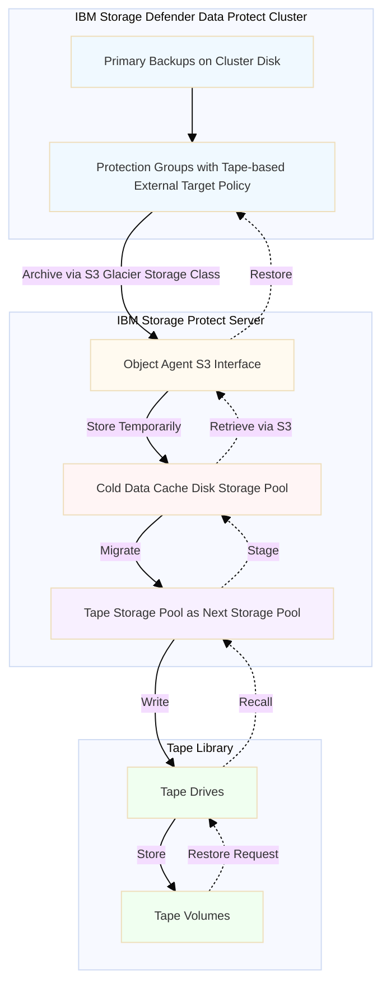

### Key Concepts

#### 1. External Target (IBM Storage Defender Data Protect Perspective)

From the IBM Storage Defender Data Protect perspective, IBM Storage Protect appears as an **External Target** of type **Tape Based**. IBM Storage Defender Data Protect uses the S3 protocol to communicate with IBM Storage Protect's object agent, treating it as an S3-compatible storage endpoint. Objects are stored with the "Glacier" storage class, indicating that the data is stored in cold storage and will be migrated to tape automatically. Data is accessed by the cluster via S3/Glacier API semantics.

**Key Characteristics**:

- Registered as an External Target in IBM Storage Defender Data Protect
- Uses S3/Glacier API for data transfer and management
- Supports encryption and compression
- Enables cloud archive workflows, including to tape-based storage

#### 2. IBM Storage Protect Object Agent

The IBM Storage Protect object agent is a **data movement and storage management component** that handles the transfer of data between IBM Storage Defender Data Protect and IBM Storage Protect's tape storage infrastructure. It is responsible for providing a front-end S3 protocol interface to IBM Storage Protect. In practice, objects stored with the **Standard** S3 storage class are routed to a (cloud or directory) container storage pool within the IBM Storage Protect server, while objects stored with the **Glacier** storage class are routed to a **cold data cache** storage pool (with a tape storage pool migration target). This document is focused on the **Glacier** storage class and integrated tape solution with IBM Storage Protect.

**Key Characteristics**:

- Serves as a bridge between IBM Storage Defender Data Protect and IBM Storage Protect
- Implements S3/Glacier API semantics
- IBM Storage Protect (type=object) client node credentials are provided as S3 access and secret keys
- IBM Storage Protect client node filespaces map 1-to-1 to S3 buckets (creating a bucket creates a filespace)

#### 3. Cold Data Cache (IBM Storage Protect Perspective)

From the IBM Storage Protect perspective, the cold data cache is a **disk-based storage pool** that acts as a staging area between the S3 object agent and tape storage for **Glacier** storage class objects. S3 objects written with the **Glacier** storage class are routed to a cold data cache storage pool with automatic, asynchronous migration to a **tape storage pool**. This disk location is used both as an "ingest cache" as well as a temporary staging area for "restored" (Glacier) object data.

Data stored in the cold data cache storage pool cannot be immediately accessed via the S3 API, but must be staged via a S3 Glacier protocol "restore" operation first. This restore operation runs asynchronously and may be polled for status. Once the restore operation completes, the data is available in the cold data cache storage pool and can be accessed via the S3 API.

**Object Lifecycle Management**: With this integration, the S3 client (in this case, the IBM Storage Defender Data Protect cluster) controls the retention and lifecycle of objects within the IBM Storage Protect server. This differs from typical IBM Storage Protect workloads where the "inventory expiration" mechanism controls object lifecycle. Instead, this integration works more like other traditional API-based client solutions with IBM Storage Protect, where the client determines when to delete objects (such as IBM Storage Protect Data Protection for VMware). The IBM Storage Defender Data Protect cluster manages object deletion based on its own retention policies, determing when deletion of objects occur within the IBM Storage Protect server.

**Key Characteristics**:

- Temporary storage for data in transit
- Enables parallel ingestion, migration, and restore activity
- Provides staging for data "restored" from tape for a specified period of time
- Disk storage should be optimized for 256 KiB I/O operations
- Client-controlled object lifecycle (IBM Storage Defender Data Protect cluster manages retention and deletion)

#### 4. Data Flow Stages

**Archive Flow (IBM Storage Defender Data Protect → Tape)**:

1. **Backup**: IBM Storage Defender Data Protect creates backups on native cluster storage domain disk
2. **Archive**: Protection policy triggers archive to External Target
3. **Transfer**: Data sent via S3/Glacier protocol to IBM Storage Protect object agent
4. **Cache**: Data temporarily stored in cold data cache storage pool, within disk-based storage pool "volumes"
5. **Migrate**: Data asynchronously migrated from cold data cache storage pool to tape storage pool
6. **Write**: Data written to tape volumes in the tape storage pool
7. **Cleanup**: Data deleted from cold data cache after successful migration

**Note**:

- Cold data cache storage volumes only become eligible for migration after the volume is either full or closed for a short period of time, and any S3 protocol "multi-part" objects stored within those volumes have been "completed".
- IBM Storage Defender Data Protect protection group archives make use of S3 protocol "multi-part" objects for storing data. These objects are only "completed" by the protection job after all data for the protection group has been archived.
- Therefore, the cold data cache (disk) storage pool must be larged enough to fit all data for all protection group archives performed within the same window of time (see sizing considerations later in this document).

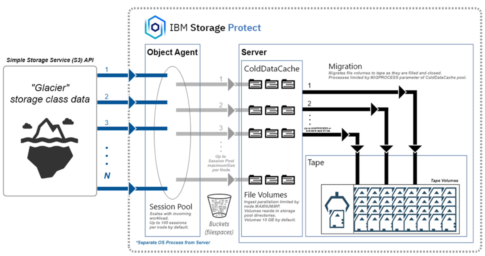

**Restore Flow (Tape → IBM Storage Defender Data Protect)**:

1. **Request**: IBM Storage Defender Data Protect requests restore from External Target
2. **Recall**: IBM Storage Protect "restores" data from tape. IBM Storage Defender Data Protect polls for data to be restored
3. **Stage**: Data staged in cold data cache storage pool
4. **Transfer**: Data sent via S3 protocol to IBM Storage Defender Data Protect
5. **Restore**: Data restored to target location
6. **Retention**: Data retained in cold cache for retention period (7 days by default, but is configurable)
7. **Cleanup**: Data deleted from cold cache after retention period

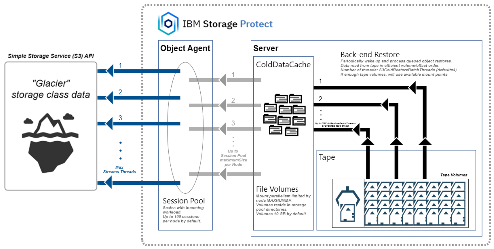

### Technology Stack

| Layer | Component | Protocol/Technology |
|-------|-----------|---------------------|
| **Data Protection** | IBM Storage Defender Data Protect 7.1+ | Native backup protocols |
| **Integration** | S3/Glacier API | RESTful S3-compatible API with Glacier semantics |
| **Object Agent** | IBM Storage Protect Object Agent | S3 server implementation layer |
| **Disk Cache** | Cold Data Cache Storage Pool | File-based storage pool for temporary storage |
| **Tape Management** | IBM Storage Protect Tape Pool | Sequential access storage for long-term storage |
| **Physical Storage** | Tape Library / Drives | LTO-8 or newer / IBM Jaguar (TS1160) or newer, or similar, recommended |

---

## Use Cases

The following are some use cases that the integration of IBM Storage Defender Data Protect and IBM Storage Protect enables. Note that some of these use cases can overlap with each other, depending on an organizations requirements, goals, and constraints.

### Use Case 1: Monthly Archive for Long-Term Retention

**Scenario**: Organization needs to retain monthly full backups for 7 years to meet regulatory and/or compliance requirements, but cluster disk space is limited.

**Solution**:

- Configure daily/weekly backups to IBM Storage Defender Data protect cluster disk with a certain retention (example: 90 days)
- Configure monthly full backups to do a policy-based archive to a (Tape Based) IBM Storage Protect External Target
- Tape archives retained for a long period of time (example: 7 years)
- Recent backups available on fast cluster disk
- Older backups needed for regulatory/compliance requirements are economically stored on tape

**Benefits**:

- Reduced cluster disk requirements
- Cost-effective long-term retention to tape storage
- Fast access to recent backups
- Compliance with retention policies

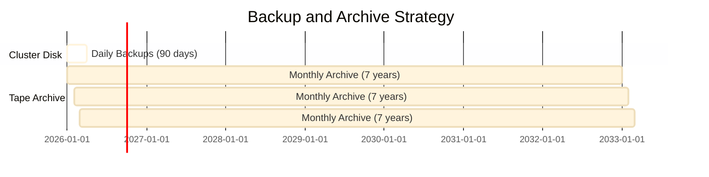

### Use Case 2: Migration from IBM Storage Protect Plus to IBM Storage Defender Data Protect

**Scenario**: Organization is currently using IBM Storage Protect Plus with IBM Storage Protect as a target for archives to tape, and wants to migrate to IBM Storage Defender Data Protect while maintaining their existing tape infrastructure and workflows.

**Solution**:

- Deploy IBM Storage Defender Data Protect as the new primary data protection platform
- Continue using existing IBM Storage Protect server and tape library infrastructure
- Configure Data Protect to archive to the same IBM Storage Protect tape target
- Maintain existing tape management processes, procedures, and operator expertise
- Leverage enhanced features and capabilities of Data Protect while preserving tape investment

**Benefits**:

- Smooth migration path from IBM Storage Protect Plus to IBM Storage Defender Data Protect
- No disruption to existing tape infrastructure or workflows
- Preserve tape management expertise and processes
- Access to enhanced workload support and modern features
- Maintain continuity of tape-based archives during and after migration
- Unified IBM data protection strategy with proven tape integration
- Continue to be able to restore IBM Storage Protect Plus archives from tape

### Use Case 3: Leveraging Existing Tape Infrastructure

**Scenario**: Organization has significant investment in tape library and IBM Storage Protect infrastructure, and wants to integrate modern data protection (with IBM Storage Defender Data Protect) to take advanced of enhanced workload support, but without replacing existing tape systems.

**Solution**:

- Deploy IBM Storage Defender Data Protect for primary backup operations
- Use existing IBM Storage Protect and tape library as an archival tier
- Maintain existing tape management processes and procedures
- Leverage existing tape operator skills and workflows

**Benefits**:

- Maximize return on investment (ROI) on existing IBM Storage Protect and tape infrastructure
- Preserve tape management expertise
- Leverage enhanced workload support and protection features of IBM Storage Defender Data Protect
- Allow for a gradual migration to a new data protection platform
- Provide a unified IBM data protection strategy

### Use Case 4: Disaster Recovery and Off-Site Storage

**Scenario**: Organization needs multiple copies of critical data for disaster recovery, including off-site tape copies with vaulting to a remote location.

**Solution**:

- Primary backups taken to the IBM Storage Defender Data Protect cluster
- Configure IBM Storage Defender Data Protect replication to a second cluster for a second data copy (for DR purposes)
- Archive to tape via IBM Storage Protect provides a third copy
- Tape vaulting to off-site location using existing processes with the tape storage pool and library
- Maintain air-gapped copies for ransomware protection

**Benefits**:

- Multiple data copies for comprehensive protection (3-2-1 backup strategy)
- Second copy via Data Protect replication provides fast DR capability
- Third copy on tape provides physical off-site protection
- Air-gapped security against ransomware and cyber threats
- Proven tape vaulting processes are leveraged
- Disaster recovery capability is achieved/maintained with multiple recovery options

### Use Case 5: Regulatory Compliance and Legal Hold

**Scenario**: Organization must retain specific datasets for legal or regulatory purposes with immutable storage requirements.

**Solution**:

- Identify data requiring long-term retention
- Primary backups of this data stored on the IBM Storage Defender Data Protect cluster
- Archive to tape via IBM Storage Protect with appropriate retention policies
- Leverage tape's physical immutability
- Maintain chain of custody documentation

**Benefits**:

- Regulatory compliance archieved
- Immutable storage on tape
- Long-term retention capability
- Audit trail and compliance reporting
- Cost-effective compliance solution

### Use Case 6: Capacity Management and Cost Optimization

**Scenario**: IBM Storage Defender Data Protect cluster is approaching capacity limits due to workload growth, and adding disk capacity is expensive compared to tape storage.

**Solution**:

- Adjust IBM Storage Defender Data Protection policies for shorter retention on native cluster disk, but longer retention to the archive target
- Free up cluster disk space for recent backups of growing workloads
- Maintain tape archives for occasional restore needs and longer retention
- Balance performance, cost, and data storage needs between disk and tape

**Benefits**:

- Extend the life of existing infrastructure
- Reduced cluster disk requirements
- Enable further data workload growth
- Lower storage costs per TiB
- Scalable storage strategy

---

## Architecture Overview

### Logical Architecture

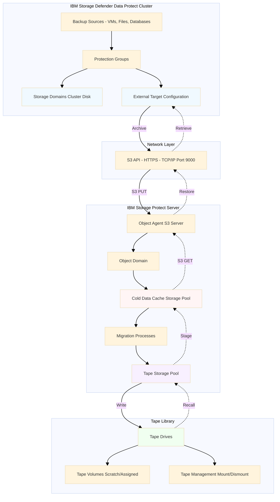

### Physical Architecture

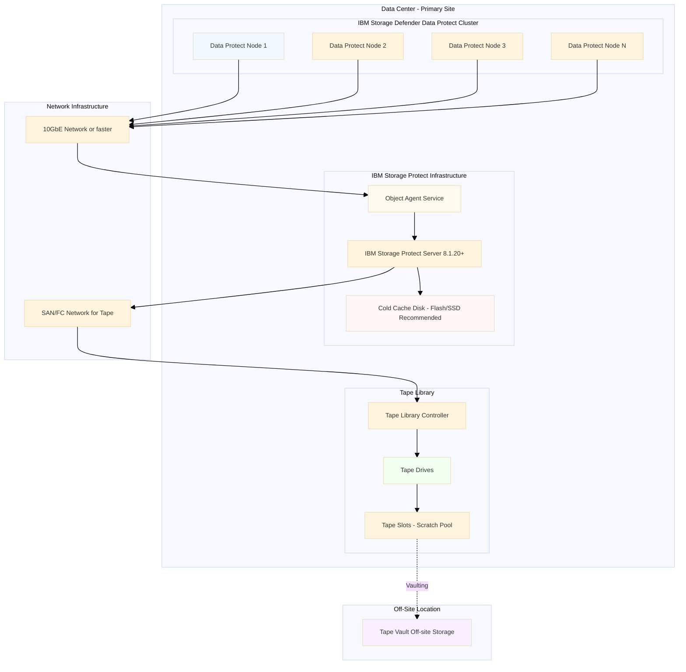

### Data Flow Architecture

#### Archive Operation Flow

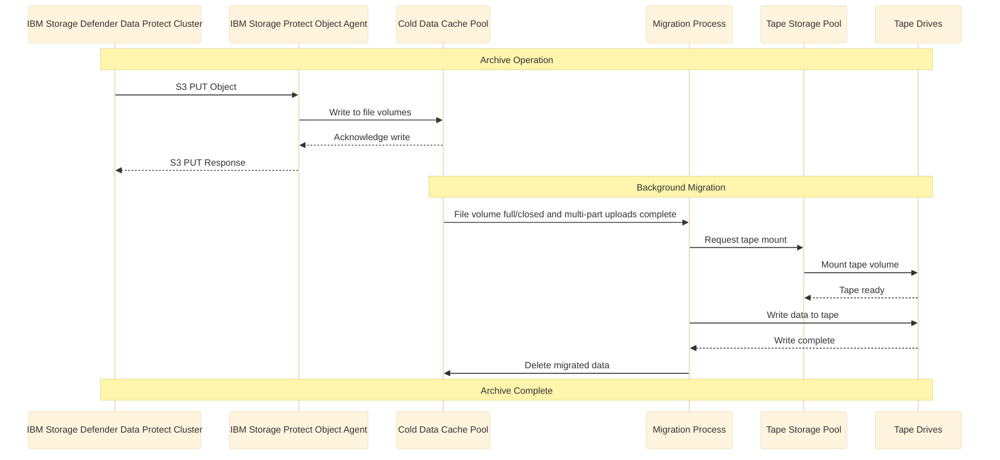

#### Restore Operation Flow

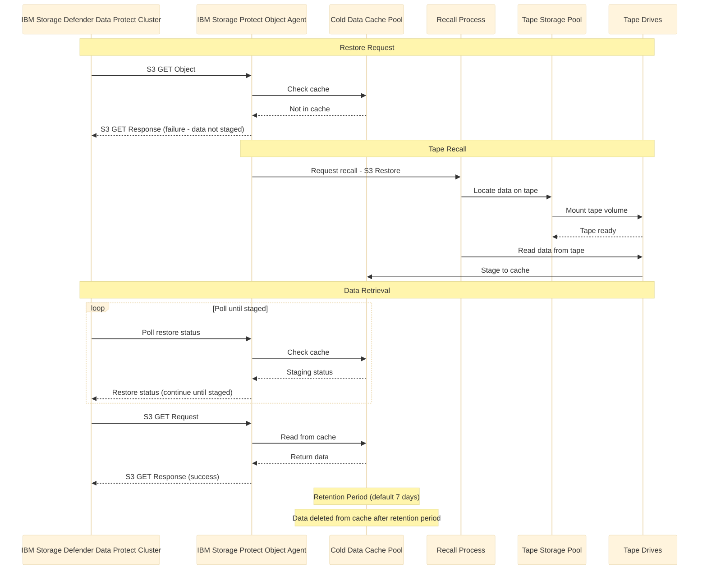

### Component Pre-requisites and Recommended Sizing

#### IBM Storage Defender Data Protect Cluster

| Component | Minimum | Recommended | Notes |
|-----------|---------|-------------|-------|
| Cluster Version | 7.1 | 7.3.2+ | Required for tape integration |
| Nodes | 3 | 4+ | For redundancy and performance |
| Network | 10 GbE | 25 GbE | For S3 traffic to IBM Storage Protect |
| Disk Capacity | Varies | As per retention requirements (example: 90 days) | Based on backup frequency/retention |

#### IBM Storage Protect Server

| Component | Minimum | Recommended | Notes |
|-----------|---------|-------------|-------|
| Server Version | 8.1.20 | 8.2.0+ | Required for object agent tape support |
| CPU Cores | 8 | 16+ | For object agent and migration performance |
| Memory | 32 GiB | 64 GiB+ | For object agent and migration performance |
| Network | 10 GbE | 25 GbE | For S3 and tape traffic |

#### Cold Data Cache Storage Pool

| Component | Calculation | Example | Notes |
|-----------|-------------|---------|-------|
| Base Capacity | Total Protection Group Archive Job Size | 10 TiB | For archive success regardless of migration performance |
| Restore Job(s) | Total Restore Job(s) Size (Active at a time) | 5 TiB | For concurrent archive and recovery |
| Buffer | +20% | 3 TiB | For concurrent archive and recovery |
| Total Capacity | Base Capacity + Restore Job(s) + Buffer  | 18 TiB | Minimum recommended |
| Performance | Random I/O optimized | SSD/NVMe preferred | For overlapped 256 KiB block operations |

#### Tape Library

| Component | Minimum | Recommended | Notes |
|-----------|---------|-------------|-------|
| Tape Drives | 2 | 4-8+ | For parallel migration and other tape activity |
| Drive Type |  LTO-8 / TS1155 | LTO-9 / TS1160 / TS1170 | For performance and capacity |
| Throughput | 300 MB/s | 400 MB/s | Per drive |
| Tape Slots | 50 | 100+ | Based on archive capacity/retention needs |
| Connectivity | FC 8Gb | FC 16Gb | For drive performance |

---

## Best Practices

### 1. Protection Group Design

#### Keep Protection Groups Small

**Recommendation**: Limit protection groups that archive to tape to **≤100 VMs** per group.

**Rationale**:

- Recovering anything from a protection group requires recall of most of the group's data
- Smaller groups make recovery operations more manageable
- Reduces the amount of data that must be recalled from tape and staged to cold data cache
- Enables more granular recovery operations
- Cold data cache volumes only become eligible for migration (and deletion) when they are closed or full, and when all multi-part uploads are complete
  - IBM Storage Defender Data Protect only completes all multi-part uploads of archive data when a protection job is complete
  - So the entire footprint of the protection job will remain in the cold data cache until the archive job is completed

**Example Organization**:

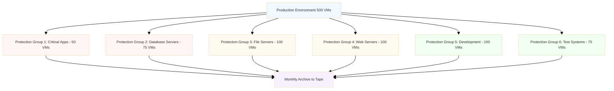

#### Organize by Recovery Requirements

Group VMs based on:

- **Business criticality**: Critical, important, standard
- **Recovery time objectives**: Fast, medium, slow
- **Logical relationships**: Application tiers, departments
- **Data characteristics**: Size, change rate, access patterns

### 2. Archive Frequency and Retention

#### Weekly or Monthly Archives

**Recommendation**: Use tape archival for **weekly or, better yet, monthly backups** only.

**Rationale**:

- Frequent archives would take too much time and storage
- Recent backups satisfied by cluster disk (daily/weekly)
- Monthly cadence balances retention needs with operational efficiency

**Example Retention Strategy**:

| Backup Type | Storage Location | Retention Period | Purpose |
|-------------|------------------|------------------|---------|
| Daily | Cluster Disk | 30 days | Fast recovery, operational restores |
| Weekly | Cluster Disk | 90 days | Recent history, compliance |
| Monthly | Tape (via SP) | 7 years | Long-term retention, compliance |

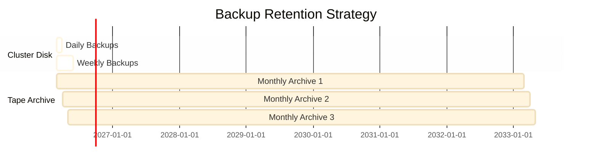

### 3. IBM Storage Protect S3 Node and IBM Storage Defender Data Protect External Target Configuration

#### Separate S3 Nodes for Different External Targets

**Requirement**: IBM Storage Defender Data Protect requires **separate External Targets** for "Tape Based" (S3 Glacier storage class) and "S3 Compatible" (S3 Standard storage class) use cases.

**Configuration (IBM Storage Protect S3 client nodes)**:

- **Node 1**: For Glacier storage class and tape archival via IBM Storage Protect ("Tape Based" External Target type)
- **Node 2**: For Standard storage class object storage via IBM Storage Protect ("S3 Compatible" target type)
- **Per Cluster**: Separate node/filespace(S3 bucket) used per IBM Storage Defender Data Protect cluster and per each External Target within each cluster

**Example**:

```
IBM Storage Protect Configuration:
- Node: CLUSTER1_TAPE (for tape archival using S3 Glacier storage class)
- Node: CLUSTER1_CLOUD (for object storage using S3 Standard storage class)
- Node: CLUSTER2_TAPE (for second cluster)
```

### 4. Cold Data Cache Sizing

#### Size for Both Ingestion and Recall

**Formula**:
```
Cold Cache Size = Total Protection Group Archive Job Size
                  + Total Restore Job(s) Size (Active at a time)
                  + 20% buffer
```

**Example Calculation**:

- Total Protection Group Archive Job Size: 10 TiB
- Total Restore Job(s) Size (Active at a time): 5 TiB
- Buffer: 3 TiB
- Minimum cold cache: 10 TiB + 5 TiB + 3 TiB = **18 TiB**

**Considerations**:

- **7-day retention**: Recalled data retained in cache for 7 days by default (can be tuned)
- **Concurrent operations**: Size for simultaneous archive and restore
- **Growth planning**: Consider growth of protection groups and workloads in the future
- **Performance**: Recommended to use SSD/NVMe storage for cache (due to randomized/overlapped 256 KiB I/O pattern)
- **File system type**: On Windows use NTFS, on Linux use XFS, on AIX use JFS2. **SSD/NVMe storage is critical for JFS2 performance on AIX**.

### 5. Migration Process Optimization

#### Set MIGPROCESS Appropriately

**Recommendation**: Set `MIGPROCESS` parameter to match available tape drives you are willing to devote to the tape archive workload.

**Guidelines**:

- **Minimum**: 2 processes
- **Recommended**: 4-8 processes, or more (match tape drive count)
- **Maximum**: 999 (limited by tape drive availability)

**Example**:
```sql
DEFINE STGPOOL S3COLDCACHE
    STGTYPE=COLDDATACACHE
    NEXTSTGPOOL=TAPEPOOL
    MIGPROCESS=6
```

**Benefits**:

- Parallel migration to tape
- Faster cold cache space reclamation
- Reduced risk of cache filling up
- Better tape drive utilization

**Considerations**:

- Remember to factor in tape drive needs for other workloads scheduled during the day, including possible IBM Storage Protect (Db2) database backup.

### 6. Performance Tuning

#### IBM Storage Defender Data Protect Cluster Node Tuning

For larger-scale protection group workloads similar to those described in the **Real-World Performance Test Results** section of this document, internal performance tuning based on the number of nodes in the cluster may be necessary to achieve optimal performance. In particular, internal options related to threading parallelism for archive operations may need to be adjusted to increase throughput.

Currently, this tuning should be pursued with the assistance of IBM Storage Defender support.

#### Object Client Node Configuration

**IBM Storage Protect MAXNUMMP Parameter**: Set to **at least 100** to match the default, per-node session pool size of the object agent. Each object client session that is writing in parallel to the cold data cache storage pool requires a "mount point".

```sql
REGISTER NODE DATAPROTECT_TAPE
    TYPE=OBJECTCLIENT
    DOMAIN=DP_TAPE_DOMAIN
    MAXNUMMP=100
```

**Benefits**:

- Enables up to 100 parallel sessions per (S3) client node, matching the default per-node session pool size of the object agent
- Improves throughput for large archives
- Better utilization of network bandwidth
- Faster archive and restore operations

**Other Tuning**:

- Consider increasing the `maximumSize` per-node object agent session limit in the IBM Storage Protect object agent's `object_agent_config.json` configuration file
- This configuration file is located in a sub-directory within the IBM Storage Protect server's instance directory, where the sub-directory has the same name as the object agent server (as per the `DEFINE SERVER` command).
- If this value is increased, also increase the client node `MAXNUMMP` value to match
- For example, to increase the session pool size from 100 to 200:
```json
        "sessionPool": {
                "maximumSize": 200,
                ... other options ...
        },
```

- When running the IBM Storage Protect object agent service locally with the IBM Storage Protect server (the typical configuration), a significant performance improvement may be gained by turning off TLS encryption for the localhost TCP/IP connection between the object agent and server. This can be done by editing the `object_agent_config.json` with the following setting:
```json
        "sessionPool": {
                ... other options ...
                "encrypt": false
                ... other options ...
        },
```
- This modification was used for the "TLS optimized" object agent testing described in the Performance Testing section of this document.

**Benefits**:

- When running large protection group archives and/or protection group archives with the same S3 client node in parallel, increasing this value (along with the client node `MAXNUMMP` parameter) may help ingest performance.
- When running the object agent on the same host system as the server, turning off TLS encryption for the localhost TCP/IP connection between the object agent and server can significantly improve performance.
  - This is only possible if the two services are running on the same host system.

#### IBM Storage Protect Tape Storage Pool Collocation

**COLLOCATE Parameter**: Configure based on recovery patterns and how different IBM Defender Data Protect clusters and External Targets are configured

**Example**:
```sql
UPDATE STGPOOL TAPEPOOL
    COLLOCATE=GROUP
```

**Options**:

- **GROUP**: Collocate by IBM Storage Protect node group
- **NODE**: Collocate by IBM Storage Protect node
- **FILESPACE**: Collocate by IBM Storage Protect filespace (each filespace maps 1-to-1 to a S3 bucket)

**Considerations**:

- Collocation will attempt to keep data for node groups, nodes, or filespaces together on tape volumes
- By using separate nodes/filespaces (S3 buckets) per External Target per cluster, you can maximize flexibility for collocating data on tape
  - Since data per External Target can be collocated separately from other data
- Collocated data results in better restore (staging) from tape to cold data cache storage
- There is a tradeoff between tape capacity utilization and restore performance

**Benefits**:

- Reduces tape mounts during restore
- Improves restore performance, so data is staged faster to the cold data cache (disk)
- Minimizes tape wear
- Optimizes tape capacity utilization

### 7. Disk System Configuration

#### Optimize for Random I/O

**Recommendation**: Optimize the cold data cache disk system for **random read/write** operations.

**Best Practices**:

- Use SSD/Flash or NVMe storage for the cold data cache (especially in the case of AIX+JFS2 configurations)
- Ensure durability (with RAID or other technology) to avoid data loss of ingested data not yet migrated to tape
- Optimize for 256 KiB block size (writes/reads)

**Example Configuration**:

```
Cold Cache Directories:
/TSMdisk1/coldcache/  (SSD, 20 TiB usable)
/TSMdisk2/coldcache/  (SSD, 20 TiB usable)
/TSMdisk3/coldcache/  (SSD, 20 TiB usable)
/TSMdisk4/coldcache/  (SSD, 20 TiB usable)

Total: 80 TiB usable capacity
```

### 8. Monitoring and Alerting

#### Proactive Monitoring

**Key Metrics to Monitor**:

| Metric | Threshold | Action |
|--------|-----------|--------|
| Cold cache space | >80% used consistently | Consider adding capacity or modifying protection group sizings |
| Migration rate | < expected | Investigate cache disk read and/or tape write performance |
| Tape drive utilization | > 80% | Consider adding drives |
| Archive job duration | > baseline + 50% | Investigate network data transfer and cold data cache writes performance |
| Restore job duration | > baseline + 100% | Check for tape recall performance/issues, cold data cache read performance |

**Monitoring Tools**:

- IBM Storage Protect activity log -- for monitoring node session status, errors, and warnings, migration and restore, etc.
- Object agent logs (log-rotated "protect.log") -- for monitoring individual S3 protocol operations
- IBM Storage Protect S3_ARCHIVE_RESTORE table queries -- for monitoring S3 archive restore operations from tape
- IBM Storage Defender Data Protect protection run reports -- for monitoring overall protection run status, errors, and perofrmance
- Tape library management console -- for monitoring for tape drive status, media, and errors

### 9. Security Best Practices

#### Encryption

**Recommendation**: Enable encryption at multiple layers.

**Encryption Layers**:

1. **IBM Storage Defender Data Protect**: Enable encryption for protection groups
2. **External target**: Enable encryption for the "Tape Based" External Target
3. **IBM Storage Protect**: Enable encryption for tape storage pool
4. **Network**: Use HTTPS for S3 communication (the default)

**Key Management**:

- Use IBM Storage Defender Data Protect's Internal KMS or KMIP-compliant KMS
- Enable "additional security" for External Target
- Download and securely store encryption keys
- Document key management procedures

#### Access Control

**Recommendations**:

- Use strong passwords for IBM Storage Protect nodes (administrator and non-object client nodes)
- Securely store S3 access and secret keys for object client nodes
- Implement role-based access control (RBAC)
- Audit access to tape archives
- Restrict physical access to tape library

### 10. Disaster Recovery Considerations

#### Important Limitation

**Note**: Tape archive does **not** assist in recovering a lost IBM Storage Defender Data Protect cluster.

**Implications**:

- Tape archives are for data retention, not cluster recovery
- Implement separate cluster backup/replication strategy
- Document cluster configuration and settings
- Maintain cluster recovery procedures

**Recommended DR Strategy**:

1. **Cluster Replication**: Replicate cluster to secondary site
2. **Configuration Backup**: Regular backup of cluster configuration
3. **Tape Archives**: For long-term data retention only
4. **Documentation**: Maintain recovery runbooks

---

## Setup and Configuration

### Prerequisites

#### Software Requirements

| Component | Version | Purpose |
|-----------|---------|---------|
| IBM Storage Defender Data Protect | 7.1+ | Source backup system |
| IBM Storage Protect Server | 8.1.20+ | Tape management and object agent |
| Tape Library Firmware | Current | Tape hardware support |

#### Hardware Requirements

| Component | Specification | Notes |
|-----------|---------------|-------|
| Tape Drives | LTO-8 / TS1155 or newer recommended | LTO-9 / TS1160 / TS1170 better for performance |
| Cold Cache Disk Capacity | Total Protection Group Archive Job Size + Total Restore Job(s) Size (Active at a time) + 20% buffer | Based on sizing formula |
| Cold Cache Disk Technology | NVM-E/Flash/SSD recommended for AIX/JFS2 platforms | Overlapped 256 KiB I/O |
| Network | 10 GbE+ | Between IBM Storage Defender Data Protect and IBM Storage Protect |
| Tape Connectivity | FC 8Gb+ | FC 16Gb recommended |

#### Network Requirements

- **Connectivity**: Network path exists between IBM Storage Defender Data Protect cluster and IBM Storage Protect server
- **Bandwidth**: Sufficient for archive operations (10 GbE minimum)
- **Latency**: Low latency preferred (< 5ms)
- **Ports**: TCP port 9000 (default S3 port) open between systems
- **DNS**: Proper DNS resolution for hostnames

### Configuration Steps

#### Step 1: Prepare IBM Storage Protect Server

##### 1.1 Define Cold Data Cache Storage Pool with Tape Next Pool

```sql
DEFINE STGPOOL S3COLDCACHE
    STGTYPE=COLDDATACACHE
    NEXTSTGPOOL=TAPEPOOL
    DIRECTORY=/TSMdisk1/coldcache/,/TSMdisk2/coldcache/,/TSMdisk3/coldcache/
    DESCRIPTION='Cold Data Cache for IBM Storage Defender Data Protect Tape Archive'
    MIGPROCESS=6
    MAXSCRATCH=7500
    REMOVERESTOREDCOPYBEFORELIFETIMEEND=YES
```

**Parameters Explained**:

- `S3COLDCACHE`: Name of the cold data cache storage pool
- `STGTYPE=COLDDATACACHE`: Specifies storage pool type of cold data cache
- `NEXTSTGPOOL=TAPEPOOL`: Tape storage pool for migration
- `DIRECTORY`: Comma-separated list of cache directories (file systems)
- `MIGPROCESS=6`: Number of parallel migration processes (should match number of tape drives)
- `MAXSCRATCH=7500`: Maximum scratch volumes (7500 × 10 GiB = 75 TiB)
- `REMOVERESTOREDCOPYBEFORELIFETIMEEND=YES`: Prioritize new data over recalled data

**Considerations**:

- Cold data cache storage pools are 10 GiB in size by default
- Configure `MAXSCRATCH` based on total desired capacity (number of scratch volumes x 10 GiB = max capacity)
  - Or just set `MAXSCRATCH` to something much higher

##### 1.2 Verify Tape Storage Pool

Ensure tape storage pool exists and is properly configured:

```sql
QUERY STGPOOL TAPEPOOL F=D
```

If needed, create or update tape storage pool:

```sql
UPDATE STGPOOL TAPEPOOL
    COLLOCATE=GROUP
    MAXSCRATCH=1000
    RECLAMATIONTHRESHOLD=60
```

##### 1.3 Define Object Agent Server

```sql
DEFINE SERVER DATAPROTECT_OBJAGENT
    HLAddress=10.1.10.150
    LLAddress=9000
    OBJECTAgent=yes
```

**Parameters Explained**:

- `DATAPROTECT_OBJAGENT`: Name for the object agent server
- `HLAddress`: Hostname or IP of IBM Storage Protect object agent
- `LLAddress`: Port number (9000 is standard S3 port used by IBM Storage Protect)
- `OBJECTAgent=yes`: Identifies this as an object agent server type

**Output**: This command provides the configuration file path for the next step.

##### 1.4 Install Object Agent Service

```bash
sudo /opt/tivoli/tsm/server/bin/spObjectAgent service install \
    /home/tsminst1/tsminst1/DATAPROTECT_OBJAGENT/spObjectAgent_DATAPROTECT_OBJAGENT_9000.config
```

**Verify Installation**:
```bash
# On Linux
sudo systemctl status spObjectAgent_DATAPROTECT_OBJAGENT_9000
```

##### 1.5 Define Object Domain

```sql
DEFINE OBJECTDOMAIN DATAPROTECT_TAPE_DOMAIN
    COLDPOOL=S3COLDCACHE
    DESCRIPTION='Object domain for IBM Storage Defender Data Protect tape archival'
```

**Parameters Explained**:

- `DATAPROTECT_TAPE_DOMAIN`: Name of the object domain
- `COLDPOOL=S3COLDCACHE`: Links to cold data cache storage pool
- `STANDARDPOOL`: Not used for tape-only archival

**Note**: The `DEFINE OBJECTDOMAIN` command creates IBM Storage Protect policy domain, copy group, etc. structures automatically.

##### 1.6 Register Object Client Node

```sql
REGISTER NODE DATAPROTECT_TAPE
    TYPE=OBJECTCLIENT
    DOMAIN=DATAPROTECT_TAPE_DOMAIN
    MAXNUMMP=100
    DESCRIPTION='IBM Storage Defender Data Protect cluster tape archival node'
```

**Important**: Save the output credentials (S3 access key and secret key)!

**Example Output**:
```
ANR2470I The new authentication credentials for object client node DATAPROTECT_TAPE are:
Access Key ID: XVZCW5KUR7MFXDWUCF5
Secret Access Key: bRNC0Mghdt7eG74YWyr580Ge2XjETVQQzTxfxqO
```

**Action Required**:

1. Copy and securely store these credentials
2. You'll need them for IBM Storage Defender Data Protect configuration
3. These cannot be retrieved later (but they can be regenerated/replaced)

**Note**: Use the `UPDATE NODE` command with the `GENERATEKEYS=YES` option if you need to regenerate/replace credentials.

##### 1.7 Create a S3 Object Storage Bucket

The S3 protocol must be used with the S3 client node credentials to create a S3 bucket to storage IBM Storage Defender Data Protect archival data to. This procedure can be done easily with the Amazon AWS CLI tool.

**Action Required**:

1. Install and configure the AWS CLI
```
curl "https://awscli.amazonaws.com/awscli-exe-linux-x86_64.zip" -o "awscliv2.zip"
unzip awscliv2.zip
sudo ./aws/install
```

2. Configure the tool to use the access key and secret key credentials for the registered S3 client node
```
aws configure
AWS Access Key ID [None]: FEKEENXUKIHPHNUCF99P
AWS Secret Access Key [None]: VyyjlM1u4ge03xI1b8Vp3wJymMEokt7KvzhHxThD
Default region name [None]:
Default output format [None]:
```

3. Create the S3 bucket
```
aws --no-verify-ssl --endpoint-url https://<object agent HLA>:<object agent LLA/port> s3api create-bucket --bucket tapebucket
```

#### Step 2: Configure IBM Storage Defender Data Protect Cluster

##### 2.1 Access IBM Storage Defender Data Protect UI

1. Log in to the IBM Storage Defender Data Protect web interface
2. Navigate to **Infrastructure** > **External Targets**
3. Click **Add External Target**

##### 2.2 Register External Target

**Configuration Parameters**:

| Parameter | Value | Notes |
|-----------|-------|-------|
| **Purpose** | `Archival` | Not Tiering |
| **Storage Type** | `S3Compatible` | Select from dropdown |
| **Storage Class** | `Tape Based ` | Select from dropdown |
| **Bucket Name** | `tapebucket` | Existing bucket created for S3 node via the object agent |
| **Access Key ID** | `<ACCESS KEY>` | Access Key credential for the S3 node |
| **Secret Access Key** | `<SECRET KEY>` | Secret Key credential for the S3 node |
| **Endpoint** | `<object agent HLA>` | IP/Hostname of the object agent |
| **Port** | `<object agent LLA/port>` | Port of the object agent |
| **Region** | `us-east-2` | Doesn't matter (choose any) |
| **Secure Connection (HTTPS)** | `On` | Recommended for added security |
| **AWS Signature Version** | `Ver 4` | Use version 4 for the object agent |
| **External Target Name** | `StorageProtect_Tape` | Descriptive name |
| **Archive Object Lock** | `Yes/No` | Depending on requirements |
| **Encryption** | `Enabled` | Recommended |
| **Compression** | `Enabled` | Recommended |
| **Bandwidth Throttling** | `Disabled` | Not recommended |

##### 2.3 Create Archival Policy

1. Navigate to **Data Protection** > **Policies**
2. Click **Create Policy**
3. Configure policy settings:

**Policy Configuration**:

| Setting | Value | Notes |
|---------|-------|-------|
| **Policy Name** | `Monthly_Tape_Archive` | Descriptive name |
| **Backup every** | `1 Month` | First day of month |
| **Primary Copy** | `Keep on Local` | Keep on cluster disk |
| **Primary Retention** | `1 Month` | Or per compliance requirements |
| **Primary Lock** | `1 Month` | Or per compliance requirements |
| **Archive Copy** | `Archive to StorageProtect_Tape` | External Target |
| **Archive After** | `Every Run` | Archive after backup completes |
| **Archive Retention** | `7 Years` | Or per compliance requirements |
| **Archive Lock** | `1 Year` | Or per compliance requirements |

##### 2.4 Create Protection Groups

1. Navigate to **Data Protection** > **Protection**
2. Click **Protect** > **Virtual Machines (or other type)**
3. Configure protection group:

**Protection Group Configuration**:

| Setting | Value | Notes |
|---------|-------|-------|
| **Protection Group Name** | `Critical_Apps_Monthly` | Descriptive name |
| **Objects** | Select VMs | ≤100 VMs per group |
| **Policy** | `Monthly_Tape_Archive` | Policy from Step 2.3 |
| **Priority** | `Medium` | Or as appropriate |

**Best Practice**: Create multiple small protection groups rather than one large group.

##### 2.5 Test Archive Operation

1. Run a test backup of a small protection group
2. Verify archive to tape completes successfully
3. Monitor in IBM Storage Defender Data Protect UI:
   - **Data Protection** > **Protection**
   - Click on desired protection group
   - Check for successful archive task
4. Verify in IBM Storage Protect that data flows through the cold data cache storage pool and onwards to the tape storage pool:
   ```sql
   QUERY OCCUPANCY S3COLDCACHE
   QUERY OCCUPANCY TAPEPOOL
   ```

#### Step 3: Verify Configuration

##### 3.1 Verify IBM Storage Protect Configuration

```sql
-- Check cold data cache storage pool
QUERY STGPOOL S3COLDCACHE F=D

-- Check tape storage pool
QUERY STGPOOL TAPEPOOL F=D

-- Check object domain
QUERY OBJECTDOMAIN DATAPROTECT_TAPE_DOMAIN F=D

-- Check object client node
QUERY NODE DATAPROTECT_TAPE F=D

-- Check object agent server
QUERY SERVER DATAPROTECT_OBJAGENT F=D

-- Check occupancy
QUERY OCCUPANCY S3COLDCACHE
QUERY OCCUPANCY TAPEPOOL
```

##### 3.2 Verify IBM Storage Defender Data Protect Configuration

1. **External Target Status**:
   - Navigate to **Infrastructure** > **External Targets**
   - Verify `StorageProtect_Tape` shows as **Registered**

2. **Policy Status**:
   - Navigate to **Data Protection** > **Policies**
   - Verify `Monthly_Tape_Archive` is used by at least one protection group

3. **Protection Group Status**:
   - Navigate to **Data Protection** > **Protection**
   - Verify groups are active, with the appropriate policy assigned

##### 3.3 Test Connectivity to S3 Object Storage

The AWS CLI can be used to validate that data can be stored and retrieved to/from the S3 object agent.

**Actions:**

1. Store a test file/object to the IBM Storage Protect object agent:
```
aws --no-verify-ssl --endpoint-url https://<object agent HLA>:<object agent LLA/port> s3api put-object --bucket tapebucket --key <object name> --body </path/to/local/file.txt>
```

2. Restore the object from the object agent:
```
aws --no-verify-ssl --endpoint-url https://<object agent HLA>:<object agent LLA/port> s3api get-object --bucket tapebucket --key <object name> </path/to/local/restored/file.txt>
```

**Other Useful Tools to Test Connectivity:**

- MinIO Client (https://min.io/docs/minio/linux/reference/minio-mc.html) -- Command line S3 client tool from the creators of MinIO object storage
- S3 Browser (https://s3browser.com/) -- Freeware Windows GUI client for Amazon S3 and S3-compatible object storage systems
- Cyberduck (https://cyberduck.io/) -- Open-source GUI client for object and other storage/systems
- Boto3 (Python) -- Programming library for Python to interact with AWS S3

##### 3.4 Test End-to-End Workflow

**Test Archive**:

1. Run manual backup of test protection group
2. Wait for archive to complete
3. Verify data in cold cache:
   ```sql
   QUERY OCCUPANCY S3COLDCACHE
   ```
4. Wait for migration to tape
5. Verify data on tape:
   ```sql
   QUERY OCCUPANCY TAPEPOOL
   ```
6. Verify data removed from cold cache
   ```sql
   QUERY OCCUPANCY S3COLDCACHE
   ```

**Test Restore**:

1. In IBM Storage Defender Data Protect UI, initiate restore from tape archive
2. Monitor recall in IBM Storage Protect:
   ```sql
   SELECT * FROM S3_ARCHIVE_RESTORE
   ```
3. Verify data staged in cold cache
   ```sql
   QUERY OCCUPANCY TAPEPOOL
   ```

4. Complete restore operation
5. Verify successful restore

### Configuration Diagram

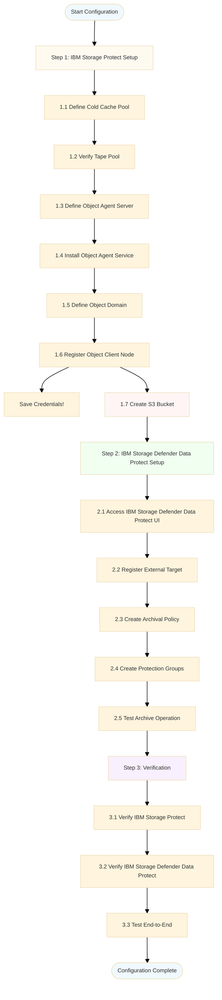

---

## Performance Considerations

### Archive Performance

#### Factors Affecting Archive Performance

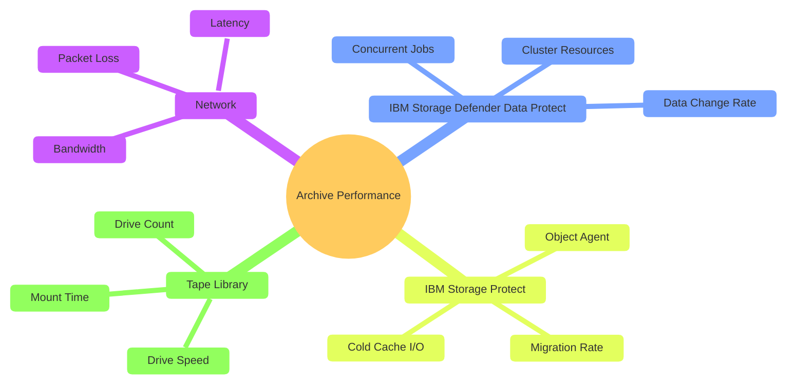

#### Performance Metrics

| Component | Metric | Typical Value | target Value |
|-----------|--------|---------------|--------------|
| **Network Throughput** | Data transfer rate | 800-1000 MB/s | 1000+ MB/s |
| **Cold Cache Write** | Write throughput | 500-800 MB/s | 800+ MB/s |
| **Tape Migration** | Per-drive throughput | 300-400 MB/s | 400+ MB/s |
| **Overall Archive** | End-to-end rate | 200-300 MB/s | 300+ MB/s |

#### Optimization Strategies

**1. Network Optimization**

- Use a dedicated network for archive traffic
- Consider enabling jumbo frames (MTU 9000)
- Use 25 GbE or faster connections
- Minimize network hops

**2. Cold Cache Optimization**

- Use SSD/Flash or NVMe storage (not HDDs)
- Configure multiple directories across disk arrays
- Optimize for random I/O (256 KiB block size)
- Ensure durability of storage to avoid transient data loss (before tape migration)

**3. Migration Optimization**

- Set MIGPROCESS to match tape drive count
- Use LTO-9 / TS1160 / TS1170 drives for better throughput
- Enable parallel migration processes
- Monitor and tune collocation settings if using multiple External Targets and/or clusters

**4. IBM Storage Defender Data Protect Optimization**

- Schedule archives during off-peak hours
- Limit concurrent archive jobs
- Use compression at source
- Enable deduplication on cluster
- Keep protection groups <=100 VMs

### Restore Performance

#### Factors Affecting Restore Performance

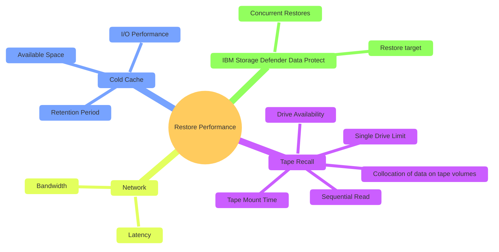

#### Performance Metrics

| Component | Metric | Typical Value | Notes |
|-----------|--------|---------------|-------|
| **Tape Recall** | Read throughput | 300-400 MB/s | Per drive, LTO-8/9 or TS1155/TS1160/TS1170 |
| **Tape Mount** | Mount time | 30-60 seconds | Per tape |
| **Cold Cache Stage** | Write throughput | 500-800 MB/s | To cache |
| **Network Transfer** | Transfer rate | 800-1000 MB/s | Cache to IBM Storage Defender Data Protect |
| **Overall Restore** | End-to-end rate | 200-300 MB/s | Depends on tape recall |

#### Optimization Strategies

**1. Protection Group Design**

- Keep groups small (≤100 VMs)
- Minimize data that must be recalled
- Organize by recovery requirements

**2. Cold Cache Management**

- Ensure adequate space for recalls
- Monitor S3_ARCHIVE_RESTORE table for pending/current restores
- Plan for 7-day retention of recalled data (unless tuned otherwise)

**3. Tape Collocation**

- Use collocation if utilizing multiple client nodes/filespaces (for multiple External Targets and/or clusters)
- Helps to minimize tape mounts required during restore
- Helps to optimize tape volume usage

**4. Restore Planning**

- Schedule large restores during off-peak hours
- Perform test restores to validate performance
- Document restore procedures and timelines

### Capacity Planning

#### Cold Cache Capacity Formula

```
Cold Cache Capacity = Total Protection Group Archive Job Size + Total Restore Job(s) Size (Active at a time) + 20% buffer
```

**Example Calculation**:
```
Total Archive: 10 TiB
Total Restore: 5 TiB
Buffer: 20%

Base Capacity = 10 TiB + 5 TiB = 15 TiB
With Buffer = 15 TiB × 1.20 = 18 TiB
```

#### Tape Capacity Planning

**Monthly Archive Calculation**:
```
Monthly Archive Size = Protection Group Size × Number of Groups
Annual Tape Requirement = Monthly Archive Size × 12 months
Multi-Year Requirement = Annual Tape Requirement × Retention Years
```

**Example**:
```
Protection Group Size: 5 TiB (average)
Number of Groups: 10
Monthly Archive: 5 TiB × 10 = 50 TiB
Annual Requirement: 50 TiB × 12 = 600 TiB
7-Year Requirement: 600 TiB × 7 = 4,200 TiB (4.2 PiB)
```

**Tape Capacity**:

- Native capacity: 18 TiB per tape
- Compressed capacity: 45 TiB per tape (2.5:1 ratio)
- Tapes needed (native): 4,200 TiB ÷ 18 TiB = 234 tapes
- Tapes needed (compressed): 4,200 TiB ÷ 45 TiB = 94 tapes

#### Growth Planning

**Annual Growth Considerations**:

- Data growth rate: 20-30% per year (typical)
- New workloads and applications
- Increased backup frequency
- Longer retention requirements

**Capacity Planning Table**:

| Year | Monthly Archive | Annual Tape | Cumulative | Tapes Needed |
|------|----------------|-------------|------------|--------------|
| 1 | 50 TiB | 600 TiB | 600 TiB | 34 (compressed) |
| 2 | 60 TiB | 720 TiB | 1,320 TiB | 74 |
| 3 | 72 TiB | 864 TiB | 2,184 TiB | 122 |
| 4 | 86 TiB | 1,037 TiB | 3,221 TiB | 180 |
| 5 | 104 TiB | 1,244 TiB | 4,465 TiB | 249 |

### Configuration Diagram

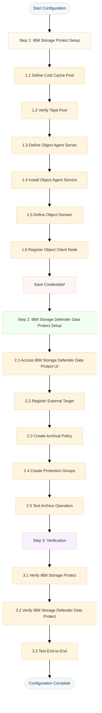

---

## Operational Guidelines

### Daily Operations

#### Monitoring Tasks

**Daily Checks**:

1. **Cold Cache Space**: Verify adequate free space (>20%)
2. **Archive Jobs**: Review completed archive jobs for errors
3. **Migration Status**: Check migration processes are running
4. **Tape Drive Status**: Verify tape drives are operational

**IBM Storage Protect Queries**:
```sql
-- Check cold cache space
QUERY STGPOOL S3COLDCACHE F=D

-- Check recent archive activity
QUERY ACTLOG SEARCH="DATAPROTECT_TAPE" BEGIND=-1

-- Check migration processes
QUERY PROCESS

-- Check tape drive status
QUERY DRIVE F=D
```

**IBM Storage Defender Data Protect Checks**:

- Review protection run status
- Check for failed archive tasks
- Verify External Target connectivity
- Review capacity reports

#### Alert Response

**Cold Cache Space Alert** (< 20% free):

1. Check migration process status
2. Verify tape drives are available
3. Review MIGPROCESS setting
4. Consider increasing MAXSCRATCH
5. Plan cold cache expansion if needed

**Archive Failure Alert**:

1. Check IBM Storage Defender Data Protect error logs
2. Review IBM Storage Protect activity log
3. Verify network connectivity
4. Check object agent status
5. Verify tape drive availability

**Migration Slow Alert**:

1. Check tape drive utilization
2. Review MIGPROCESS setting
3. Verify tape library status
4. Check for competing workloads
5. Consider adding tape drives

### Weekly Operations

#### Maintenance Tasks

**Weekly Checks**:

1. **Capacity Trends**: Review cold cache and tape usage trends
2. **Performance Metrics**: Analyze archive and restore performance
3. **Tape Inventory**: Verify adequate scratch tapes available
4. **Recalled Data**: Review S3_ARCHIVE_RESTORE table for old entries

**IBM Storage Protect Maintenance**:
```sql
-- Review capacity trends
QUERY STGPOOL S3COLDCACHE F=D
QUERY STGPOOL TAPEPOOL F=D

-- Check for old recalled objects
SELECT NODE_NAME, OBJECT_NAME, EXPIRATION_DATE
FROM S3_ARCHIVE_RESTORE
WHERE EXPIRATION_DATE < CURRENT_DATE + 1 DAY
ORDER BY EXPIRATION_DATE

-- Review tape scratch pool
QUERY LIBVOLUME * SEARCH=SCRATCH

-- Check for tape errors
QUERY ACTLOG SEARCH="ANR8XXX" BEGIND=-7
```

**IBM Storage Defender Data Protect Maintenance**:

- Review protection group statistics
- Analyze archive job durations
- Check for policy compliance
- Review capacity forecasts

### Monthly Operations

#### Planning and Review

**Monthly Tasks**:

1. **Capacity Planning**: Review growth trends and plan expansions
2. **Performance Review**: Analyze monthly performance metrics
3. **Tape Vaulting**: Coordinate off-site tape vaulting
4. **Documentation**: Update configuration documentation
5. **Testing**: Perform test restore from tape

**Monthly Reports**:

- Archive success rate
- Average archive duration
- Tape capacity utilization
- Cold cache efficiency
- Restore test results

### Backup and Recovery Procedures

#### IBM Storage Protect Database Backup

**Critical**: Regularly backup the IBM Storage Protect database!

```sql
-- Full database backup
BACKUP DB TYPE=FULL DEVC=DBBACKUP_DEVICE

-- Verify backup
QUERY VOLHIST TYPE=DBFULL BEGIND=-1
```

**Frequency**: Daily (minimum)
**Retention**: 30 days (minimum)

**Considerations**:

- The IBM Storage Protect database is generally stored to tape or cloud storage
- Best practice: configuration automated (daily) backups

#### IBM Storage Defender Data Protect Configuration Backup

**Critical**: Backup the IBM Storage Defender Data Protect cluster configuration!

**Methods**:

1. **Cluster Replication**: Replicate to secondary cluster
2. **Configuration Export**: Export policies and settings
3. **Documentation**: Maintain configuration runbooks

**Frequency**: After any configuration change

### Tape Management

#### Tape Lifecycle

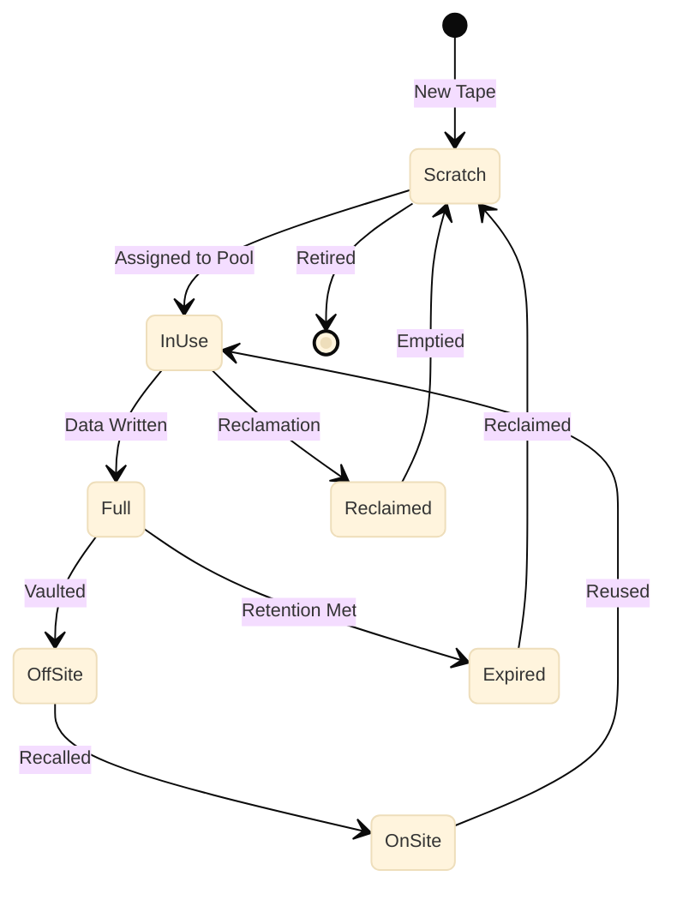

#### Tape Operations

The following provide example commands that can be used for different IBM Storage Protect tape activities. Reference the official IBM Storage Protect documentation for the most current syntax and options.

**Adding Scratch Tapes**:
```sql
-- Check in new tapes
CHECKIN LIBVOLUME <library_name> SEARCH=<YES|BULK> STATUS=SCRATCH CHECKLABEL=BARCODE

-- Verify
QUERY LIBVOLUME * SEARCH=SCRATCH
```

**Tape Vaulting**:
```sql
-- Mark tape volume for off-site storage (vaulting)
QUERY DRMEDIA WHERESTATE=MOUNTABLE
MOVE DRMEDIA * WHERESTATE=MOUNTABLE TOSTATE=COURIER REMOVE=BULK
MOVE DRMEDIA * WHERESTATE=COURIER TOSTATE=VAULT

-- Generate vault report
QUERY DRMEDIA * WHERESTATE=VAULT
```

**Tape Recall**:
```sql
-- Return tapes from vault
MOVE DRMEDIA * WHERESTATE=VAULTRETRIEVE TOSTATE=COURIERRETRIEVE
MOVE DRMEDIA * WHERESTATE=COURIERRETRIEVE TOSTATE=ONSITERETRIEVE
CHECKIN LIBVOLUME library_name SEARCH=YES STATUS=SCRATCH CHECKLABEL=BARCODE

-- Verify
QUERY DRMEDIA * WHERESTATE=MOUNTABLE
```

#### Tape Reclamation

**Purpose**: Reclaim space on partially filled tapes.

**Configuration**:
```sql
UPDATE STGPOOL TAPEPOOL RECLAMATIONTHRESHOLD=60
```

**Manual Reclamation**:
```sql
-- Start reclamation
RECLAIM STGPOOL TAPEPOOL THRESHOLD=60

-- Monitor progress
QUERY PROCESS
```

**Best Practices**:

- Run during off-peak hours
- Set threshold to 60% (recommended)
- Monitor tape drive availability
- Schedule regularly (weekly/monthly)

---

## Troubleshooting

### Common Issues and Solutions

#### Issue 1: Archive Job Fails

**Symptoms**:

- Archive task shows failed in IBM Storage Defender Data Protect
- Error message in protection run log
- Data not appearing in cold cache

**Diagnosis Steps**:

1. Check IBM Storage Defender Data Protect error message
2. Review IBM Storage Protect activity log:
   ```sql
   QUERY ACTLOG SEARCH="DATAPROTECT_TAPE" BEGIND=-1
   ```
3. Verify object agent status:
   ```bash
   systemctl status spObjectAgent_DATAPROTECT_OBJAGENT_9000
   ```
4. Check network connectivity
5. Verify credentials are correct

**Common Causes and Solutions**:

| Cause | Solution |
|-------|----------|
| Object agent not running | Restart object agent service, check the protect.log |
| Network connectivity issue | Check firewall rules, DNS resolution |
| Invalid credentials | Re-register node, update IBM Storage Defender Data Protect config |
| Cold cache full | Increase MAXSCRATCH and/or add disk space |
| Tape drives unavailable | Check tape library status |

**Resolution Example**:
```bash
# Restart object agent
sudo systemctl restart spObjectAgent_DATAPROTECT_OBJAGENT_9000

# Verify status
sudo systemctl status spObjectAgent_DATAPROTECT_OBJAGENT_9000

# Check logs
tail -f /home/tsminst1/tsminst1/DATAPROTECT_OBJAGENT/protect.log
```

#### Issue 2: Cold Cache Filling Up

**Symptoms**:

- Cold data cache space utilization is >80% consistently
- Archive jobs slowing down or failing
- Migration not keeping pace with ingestion

**Diagnosis Steps**:

1. Check cold cache occupancy:
   ```sql
   QUERY STGPOOL S3COLDCACHE F=D
   ```
2. Check migration process status:
   ```sql
   QUERY PROCESS
   ```
3. Verify tape drive availability:
   ```sql
   QUERY DRIVE F=D
   ```
4. Check for recalled objects:
   ```sql
   SELECT * FROM S3_ARCHIVE_RESTORE
   ```

**Solutions**:

**Short-term**:
```sql
-- Increase MIGPROCESS
UPDATE STGPOOL S3COLDCACHE MIGPROCESS=8

-- Enable early deletion of recalled data
UPDATE STGPOOL S3COLDCACHE REMOVERESTOREDCOPYBEFORELIFETIMEEND=YES
```

**Long-term**:
```sql
-- Increase MAXSCRATCH
UPDATE STGPOOL S3COLDCACHE MAXSCRATCH=9999

-- Increase device class volume size for the device class used by the Cold Data Cache storage pool
UPDATE DEVCLASS COLDCACHE_DEVC MAXCAPACITY=20G

-- Add more cold cache directories
UPDATE STGPOOL S3COLDCACHE DIRECTORY=/TSMdisk1/coldcache/,/TSMdisk2/coldcache/,/TSMdisk3/coldcache/,/TSMdisk4/coldcache/
```

#### Issue 3: Slow Migration to Tape

**Symptoms**:

- Data accumulating in cold cache
- Migration processes running slowly
- Tape drives underutilized

**Diagnosis Steps**:

1. Check migration process count:
   ```sql
   QUERY PROCESS
   ```
2. Check tape drive utilization:
   ```sql
   QUERY DRIVE F=D
   QUERY MOUNT
   ```
3. Check for competing workloads:
   ```sql
   QUERY SESSION
   ```
4. Review tape throughput:
   ```sql
   QUERY ACTLOG SEARCH="ANR0984I" BEGIND=-1
   ```

**Solutions**:

```sql
-- Increase MIGPROCESS
UPDATE STGPOOL S3COLDCACHE MIGPROCESS=6

-- Check tape drive paths
QUERY PATH * SRCTYPE=SERVER DESTTYPE=DRIVE

-- Verify tape library online
QUERY LIBRARY TAPELIB F=D

-- Check for tape mount delays
QUERY ACTLOG SEARCH="ANR8XXX" BEGIND=-1
```

**Performance Tuning**:

- Add more tape drives if available
- Optimize tape collocation settings
- Schedule migration during off-peak hours
- Check tape library firmware

#### Issue 4: Restore from Tape Fails

**Symptoms**:

- Restore job fails in IBM Storage Defender Data Protect
- Error retrieving data from External Target
- Tape recall errors in IBM Storage Protect

**Diagnosis Steps**:

1. Check IBM Storage Defender Data Protect restore error
2. Query S3_ARCHIVE_RESTORE table:
   ```sql
   SELECT * FROM S3_ARCHIVE_RESTORE WHERE NODE_NAME='DATAPROTECT_TAPE'
   ```
3. Check tape volume status:
   ```sql
   QUERY VOLUME * STGPOOL=TAPEPOOL
   ```
4. Verify tape drive availability:
   ```sql
   QUERY DRIVE F=D
   ```
5. Check for tape errors:
   ```sql
   QUERY ACTLOG SEARCH="ANR8XXX" BEGIND=-1
   ```

**Common Causes and Solutions**:

| Cause | Solution |
|-------|----------|
| Tape not mounted | Check tape library, mount manually if needed |
| Tape drive error | Check drive status, clean drive if needed |
| Cold cache full | Free up space in cold cache |
| Tape volume damaged | Restore from duplicate copy or vault |
| Network issue | Check connectivity between systems |

**Resolution Steps**:
```sql
-- Check tape location
QUERY VOLUME volume_name F=D

-- If tape is off-site, physically move it back to the library
CHECKIN LIBVOLUME library_name volume_name STATUS=PRIVATE CHECKLABEL=BARCODE

-- Or multiple tapes at once
CHECKIN LIBVOLUME library_name SEARCH=BULK STATUS=PRIVATE CHECKLABEL=BARCODE

-- Return the volume to read/write status
UPDATE VOLUME volume_name ACCESS=READWRITE

-- Verify tape is mountable
QUERY MEDIA volume_name

-- Retry restore operation
-- (from IBM Storage Defender Data Protect UI)
```

#### Issue 5: Object Agent Not Responding

**Symptoms**:

- Cannot connect to External Target from IBM Storage Defender Data Protect
- Object agent service not running
- Connection timeout errors

**Diagnosis Steps**:

1. Check service status:
   ```bash
   systemctl status spObjectAgent_DATAPROTECT_OBJAGENT_9000
   ```
2. Check object agent logs:
   ```bash
   tail -100 /home/tsminst1/tsminst1/DATAPROTECT_OBJAGENT/protect.log
   ```
3. Check port availability:
   ```bash
   netstat -an | grep 9000
   ```
4. Test connectivity:
   ```bash
   telnet sp-server.company.com 9000
   ```

**Solutions**:

```bash
# Restart object agent
sudo systemctl restart spObjectAgent_DATAPROTECT_OBJAGENT_9000

# If service won't start, check configuration
cat /home/tsminst1/tsminst1/DATAPROTECT_OBJAGENT/spObjectAgent_DATAPROTECT_OBJAGENT_9000.config

# Check for port conflicts
sudo lsof -i :9000

# Review system logs
sudo journalctl -u spObjectAgent_DATAPROTECT_OBJAGENT_9000 -n 100

# If necessary, delete and recreate the object agent server (service)
```

**Firewall Configuration** (if needed):
```bash
# Allow port 9000
sudo firewall-cmd --permanent --add-port=9000/tcp
sudo firewall-cmd --reload
```

### Diagnostic Tools

#### Enable S3 Trace

**Purpose**: Detailed logging of S3 operations.

```sql
-- Enable S3 trace
TRACE ENABLE S3

-- Start trace to file
TRACE BEGIN /tsm/traces/s3_trace.txt BUFSIZE=4096

-- Reproduce issue

-- Flush and stop trace
TRACE FLUSH
TRACE END

-- Disable trace
TRACE DISABLE S3
```

**What to Look For**:

- S3 PUT/GET requests
- Authentication failures
- Network errors
- Timeout issues

#### Object Agent Logs

**Location**:
```
/home/tsminst1/tsminst1/DATAPROTECT_OBJAGENT/protect.log
```

**Useful Commands**:
```bash
# View latest log
tail -f /home/tsminst1/tsminst1/DATAPROTECT_OBJAGENT/protect.log

# Search for errors
grep -i error /home/tsminst1/tsminst1/DATAPROTECT_OBJAGENT/protect.log

# Search for specific node
grep "DATAPROTECT_TAPE" /home/tsminst1/tsminst1/DATAPROTECT_OBJAGENT/protect.log

# View archived logs (log-rotated)
ls -ltr /home/tsminst1/tsminst1/DATAPROTECT_OBJAGENT/protect-*.log
```

#### IBM Storage Protect Activity Log

**Useful Queries**:
```sql
-- Recent errors
QUERY ACTLOG SEARCH="ANR" BEGIND=-1

-- Specific node activity
QUERY ACTLOG SEARCH="DATAPROTECT_TAPE" BEGIND=-1

-- Tape-related messages
QUERY ACTLOG SEARCH="ANR8" BEGIND=-1

-- Migration activity
QUERY ACTLOG SEARCH="ANR0984I" BEGIND=-1

-- Archive activity
QUERY ACTLOG SEARCH="ANR2579I" BEGIND=-1
```

### Getting Help

#### IBM Support

**When to Contact Support**:

- Persistent errors after troubleshooting
- Performance issues not resolved by tuning
- Software defects or bugs
- Configuration questions

**Information to Provide**:

1. **Environment Details**:

   - IBM Storage Defender Data Protect version
   - IBM Storage Protect version
   - Tape library model
   - Network configuration

2. **Problem Description**:

   - Symptoms and error messages
   - When problem started
   - Frequency of occurrence
   - Impact on operations

3. **Diagnostic Data**:

   - IBM Storage Protect servermon archives covering dates of the issue
   - IBM Storage Protect activity log and FFDC log
   - Object agent logs
   - S3 trace (if available)
   - IBM Storage Defender Data Protect logs
   - Configuration details

**Support Resources**:

- IBM Support Portal: https://www.ibm.com/support
- IBM Storage Defender Data Protect Documentation
- IBM Storage Protect Documentation
- IBM Community Forums

---

## Appendix

### A. Configuration Reference

#### IBM Storage Protect Commands Summary

**Storage Pool Management**:
```sql
-- Define cold cache pool
DEFINE STGPOOL poolname STGTYPE=COLDDATACACHE NEXTSTGPOOL=tapepool DIRECTORY=paths MIGPROCESS=n

-- Update cold cache pool
UPDATE STGPOOL poolname MIGPROCESS=n MAXSCRATCH=n REMOVERESTOREDCOPYBEFORELIFETIMEEND=YES

-- Query pool status
QUERY STGPOOL poolname F=D

-- Check occupancy
QUERY OCCUPANCY poolname
```

**Object Agent Management**:
```sql
-- Define object agent server
DEFINE SERVER servername HLAddress=hostname LLAddress=port OBJECTAgent=yes

-- Define object domain
DEFINE OBJECTDOMAIN domainname COLDPOOL=poolname

-- Register object client node
REGISTER NODE nodename TYPE=OBJECTCLIENT DOMAIN=domainname MAXNUMMP=100

-- Update node
UPDATE NODE nodename MAXNUMMP=100

-- Query node
QUERY NODE nodename F=D
```

**Tape Management**:
```sql
-- Update tape pool
UPDATE STGPOOL tapepool COLLOCATE=GROUP RECLAMATIONTHRESHOLD=60

-- Check in tapes
CHECKIN LIBVOLUME library SEARCH=* STATUS=SCRATCH

-- Query tapes
QUERY LIBVOLUME * SEARCH=SCRATCH
QUERY VOLUME * STGPOOL=tapepool

-- Tape vaulting:
QUERY DRMEDIA WHERESTATE=MOUNTABLE
MOVE DRMEDIA * WHERESTATE=MOUNTABLE TOSTATE=COURIER REMOVE=BULK
MOVE DRMEDIA * WHERESTATE=COURIER TOSTATE=VAULT
```

**Monitoring**:
```sql
-- Check processes
QUERY PROCESS

-- Check sessions
QUERY SESSION

-- Check drives
QUERY DRIVE F=D

-- Check mounts
QUERY MOUNT

-- Activity log
QUERY ACTLOG SEARCH="text" BEGIND=-n

-- Archive restore table
SELECT * FROM S3_ARCHIVE_RESTORE
```

#### IBM Storage Defender Data Protect CLI Commands

# List External Targets
iris_cli cluster list-external-targets

# Update External Target
iris_cli cluster update-external-target --id target_id --parameters

# Unregister External Target
iris_cli cluster unregister-external-target --id target_id
```

**Policy Management**:
```bash
# Create policy
iris_cli cluster create-policy --policy-json policy.json

# List policies
iris_cli cluster list-policies

# Update policy
iris_cli cluster update-policy --id policy_id --policy-json policy.json

# Delete policy
iris_cli cluster delete-policy --id policy_id
```

**Protection Group Management**:
```bash
# Create protection group
iris_cli cluster create-protection-group --group-json group.json

# List protection groups
iris_cli cluster list-protection-groups

# Run protection group
iris_cli cluster run-protection-group --id group_id

# Delete protection group
iris_cli cluster delete-protection-group --id group_id
```

### B. Performance Tuning Checklist

#### Network Layer
- [ ] Dedicated network for archive traffic
- [ ] Consider enabling jumbo enabled (MTU 9000)
- [ ] 25 GbE or faster connections
- [ ] Minimal network hops
- [ ] QoS configured for backup traffic
- [ ] Network monitoring in place

#### IBM Data Protect Cluster
- [ ] Adequate cluster resources (CPU, memory, disk)
- [ ] Deduplication enabled
- [ ] Compression enabled
- [ ] Archive scheduled during off-peak hours
- [ ] Protection groups sized appropriately (≤100 VMs)
- [ ] Concurrent jobs limited

#### IBM Storage Protect Server
- [ ] Adequate server resources (CPU, memory)
- [ ] Object agent service running
- [ ] MAXNUMMP set to 100+
- [ ] Database regularly backed up
- [ ] Activity log monitored

#### Cold Data Cache
- [ ] SSD or NVMe storage
- [ ] Durable storage provisioned
- [ ] Optimized for random I/O (256 KiB block size)
- [ ] Adequate capacity (formula-based)
- [ ] MAXSCRATCH set appropriately
- [ ] REMOVERESTOREDCOPYBEFORELIFETIMEEND=YES if needed
- [ ] Space monitoring configured

#### Tape Storage Pool
- [ ] MIGPROCESS matches tape drive count
- [ ] COLLOCATE set appropriately
- [ ] RECLAMATIONTHRESHOLD set to 60%
- [ ] Adequate scratch tapes available
- [ ] Tape drives operational
- [ ] Tape library firmware current

#### Monitoring and Alerting
- [ ] Cold cache space alerts (<20%)
- [ ] Archive job failure alerts
- [ ] Migration slow alerts
- [ ] Tape drive error alerts
- [ ] Daily monitoring tasks documented
- [ ] Weekly maintenance tasks scheduled

### C. Capacity Planning Worksheet

#### Current Environment

| Parameter | Value | Notes |
|-----------|-------|-------|
| Number of VMs | | |
| Average VM size | | |
| Total data under protection | | |
| Daily change rate | | |
| Backup frequency | | |
| Current retention period | | |

#### Archive Requirements

| Parameter | Value | Calculation |
|-----------|-------|-------------|
| Protection groups for tape | | |
| VMs per protection group | | ≤100 recommended |
| Average group size | | |
| Monthly archive volume | | Groups × Avg Size |
| Annual archive volume | | Monthly × 12 |
| Retention period (years) | | |
| Total tape requirement | | Annual × Years |

#### Cold Cache Sizing

| Parameter | Value | Calculation |
|-----------|-------|-------------|
| Total Protection Group Archive Job Size | | |
| Restore retention period (days) | 7 | Default |
| Total Restore Job(s) Size (Active at a time) | | |
| Buffer percentage | 20% | Recommended |
| **Total cold cache required** | | Total archive size + Total restore size + Buffer |

#### Tape Library Sizing

| Parameter | Value | Calculation |
|-----------|-------|-------------|
| Tape type | | LTO-8 / LTO-9 / TS1160 / TS1155 |
| Native capacity per tape | | 12 TB (LTO-8) / 18 TB (LTO-9) / 20 TB (TS1160) / 50 TB (TS1170) |
| **Tapes needed (native)** | | Total Requirement ÷ Native Capacity |
| **Tapes needed (compressed)** | | Total Requirement ÷ Compressed Capacity |
| Tape drives required | | 4-8 recommended |

#### Growth Planning

| Year | Data Growth | Monthly Archive | Annual Tape | Cumulative | Tapes Needed |
|------|-------------|----------------|-------------|------------|--------------|
| 1 | - | | | | |
| 2 | 20% | | | | |
| 3 | 20% | | | | |
| 4 | 20% | | | | |
| 5 | 20% | | | | |

### D. Glossary

**Cold Data Cache**: Disk-based storage pool in IBM Storage Protect that acts as a staging area between S3 object agent and tape storage.

**Collocation**: IBM Storage Protect feature that stores related data together on as few tape volumes as possible to optimize restore performance.

**External target**: Storage destination outside the IBM Storage Defender Data Protect cluster where data can be archived for long-term retention.

**IBM Jaguar / TSXXXX**: Enterprise-class IBM magnetic tape data storage technology.

**LTO (Linear Tape-Open)**: Industry-standard magnetic tape data storage technology.

**MIGPROCESS**: IBM Storage Protect parameter that controls the number of parallel processes used to migrate data from cold cache to tape.

**Object Agent**: IBM Storage Protect component that provides S3-compatible API interface for object storage clients.

**Object Domain**: IBM Storage Protect configuration that links object client nodes to storage pools.

**Protection Group**: IBM Storage Defender Data Protect configuration that defines which data sources to protect and which policies to apply.

**S3Compatible**: External Target type in IBM Storage Defender Data Protect that represents a S3 compatible target (can be "Regular" or "Tape Based")

**S3 Protocol**: Amazon Simple Storage Service API, used for object storage communication.

**Storage Domain**: IBM Storage Defender Data Protect logical grouping of storage resources on the cluster.

### E. Additional Resources

#### Documentation

**IBM Storage Defender Data Protect**:

- User's Guide
- Administrator's Guide
- CLI Reference
- API Reference

**IBM Storage Protect**:

- Administrator's Guide
- Administrator's Reference
- Troubleshooting Guide
- Performance Tuning Guide

#### IBM Support

**Support Portal**: https://www.ibm.com/support

**Knowledge Center**:

- IBM Storage Defender: https://www.ibm.com/docs/en/storage-defender
- IBM Storage Protect: https://www.ibm.com/docs/en/storage-protect

**Community Forums**:

- IBM Community: https://community.ibm.com

#### Training

**IBM Training**:

- IBM Storage Defender Data Protect Administration
- IBM Storage Protect Administration
- Tape Library Management
- Performance Tuning

**Certification**:

- IBM Certified Administrator - IBM Storage Protect

### F. Revision History

| Version | Date | Author | Changes |
|---------|------|--------|---------|
| 1.0 | 2026-07-01 | Dominic Müller-Wicke, Jason Basler, James Damgar | Initial version |

---

## Summary

This document provides a comprehensive guide for integrating IBM Storage Defender Data Protect with IBM Storage Protect for cold data archival to tape. The solution combines modern backup capabilities with proven tape management, enabling:

- **Cost-effective long-term retention** using economical tape storage
- **Extended data retention** beyond cluster disk capacity
- **Leverage of existing infrastructure** maximizing ROI on tape investments
- **Compliance support** for regulatory retention requirements
- **Hybrid storage strategy** balancing performance and cost

### Key Takeaways

1. **Architecture**: IBM Storage Defender Data Protect uses S3 protocol to send data to IBM Storage Protect's object agent, which stages data in a cold data cache before migrating to tape.

2. **Best Practices**: Keep protection groups small (≤100 VMs), use monthly archives, size cold cache appropriately, and optimize migration processes.

3. **Performance**: Expect 200-300 MB/s end-to-end archive performance with proper tuning. Restore performance depends on tape recall (currently limited to single drive).

4. **Capacity Planning**: Size cold cache for total archive ingestion plus expected restore activity. Plan tape capacity based on monthly archive volume and retention requirements.

5. **Operations**: Implement daily monitoring, weekly maintenance, and monthly planning. Maintain proper backups of both systems.

### Next Steps

1. **Review Prerequisites**: Ensure software versions and hardware meet requirements
2. **Plan Capacity**: Use worksheets to calculate cold cache and tape requirements
3. **Configure Systems**: Follow step-by-step setup procedures
4. **Test Thoroughly**: Perform end-to-end testing before production use
5. **Document Configuration**: Maintain detailed documentation of your implementation
6. **Train Staff**: Ensure operations team understands procedures
7. **Monitor and Optimize**: Continuously monitor and tune for optimal performance

---

**Document End**

**For questions or support, contact IBM Support or your IBM representative.**
