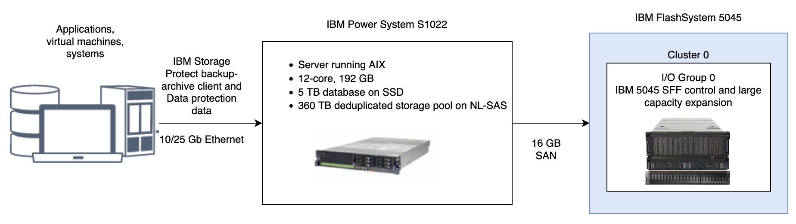

# IBM Storage Protect Blueprint for AIX

> Version 5.1
> 
> © Copyright International Business Machines Corporation 2013, 2022, 2024.</br>
> US Government Users Restricted Rights – Use, duplication or disclosure restricted by GSA ADP Schedule Contract with IBM Corp.
>
> This edition applies to Version 8.1.22 and later of the IBM Storage Protect server, and to all subsequent releases and
modifications until otherwise indicated in new editions or technical newsletters.

## About this document

This information is intended to facilitate the deployment of an IBM Storage Protect server by using detailed hardware specifications to build a system and automated scripts to configure the software. To complete the tasks, you must have an understanding of IBM Storage Protect and scripting.

### Support for IBM Storage Protect blueprint and server automated configuration

The information in this document is distributed on an "as is" basis without any warranty that is either expressed or implied. Support assistance for the use of this material is limited to situations where IBM Storage Protect support is entitled and where the issues are not specific to a blueprint implementation.

---
### What's new in Version 5.1

The IBM Storage Protect Blueprint configuration scripts, hardware and software requirements, and documentation are updated.
* **Updated the Storage Protect references for AIX 7.3 on Power10 based on the IBM Power S1022 server.** </br>
  The small, medium, and large storage references have been updated to the IBM FlashSystem 5015, 5045, and 5200 respectively which provide a scalable hybrid storage solution that is fast, affordable, and reliable.

* **The blueprint configuration automation no longer provides default passwords** </br>
  The default values for passwords set during server configuration have been eliminated to improve security. The user is now required to provide values for all passwords set during the initial configuration. In addition, the blueprint configuration automation now enforces the new minimum password length of 15 characters introduced in IBM Storage Protect 8.1.16

* **Updated the part numbers** </br>
  Updated the part numbers for the minimum hardware required for the small, medium and large blueprint configuration, based on reference from the Power10 Redbook.  This will help users with, a ready to order configuration.

---

# Table of Contents

* [About this document](#about-this-document)
* [What's new in version 5.1](#whats-new-in-version-51)
* [Table of Contents](#table-of-contents)
* [Chapter 1. Introduction](#chapter-1-introduction)
* [Chapter 2. Implementation requirements](#chapter-2-implementation-requirements)
  * [Hardware and software prerequisites](#21-hardware-and-software-prerequisites)
      * [Hardware requirements](#211-hardware-requirements)
      * [Software requirements](#212-software-requirements)
  * [Planning worksheets](#22-planning-worksheets)
* [Chapter 3. Storage configuration blueprints](#chapter-3-storage-configuration-blueprints)
  * [3.1 Small configuration](#31-small-configuration)
  * [3.2 Medium configuration](#32-medium-configuration)
  * [3.3 Large configuration](#33-large-configuration)
  * [3.4 IBM Elastic Storage System](#34-ibm-elastic-storage-system)
* [Chapter 4. Setting up the system](#chapter-4-setting-up-the-system)
  * [Step 1: Setup and configure hardware](#step-1-setup-and-configure-hardware)
  * [Step 2: Install the operating system](#step-2-install-the-operating-system)
  * [Step 3: IBM FlashSystem Storage: Configure multipath I/O](#step-3-ibm-flashsystem-storage-configure-multipath-io)
  * [Step 4: IBM FlashSystem Storage: Configure file systems for IBM Storage Protect](#step-4-ibm-flashsystem-storage-configure-file-systems-for-ibm-storage-protect)
    * [Configure a file system by using the script](#configure-a-file-system-by-using-the-script)
    * [Configure a file system by using the manual procedure](#configure-a-file-system-by-using-the-manual-procedure)
  * [Step 5: IBM Elastic Storage System: Configuring the system](#step-5-ibm-elastic-storage-system-configuring-the-system)
  * [Step 6: Test system performance](#step-6-test-system-performance)
  * [Step 7: Install the IBM Storage Protect backup-archive client](#step-7-install-the-ibm-storage-protect-backup-archive-client)
  * [Step 8: Install the IBM Storage Protect server](#step-8-install-the-ibm-storage-protect-server)
    * [Obtain the installation package](#obtain-the-installation-package)
    * [Install the IBM Storage Protect server](#install-the-ibm-storage-protect-server)
* [Chapter 5. Configuring the IBM Storage Protect server](#chapter-5-configuring-the-ibm-storage-protect-server)
   * [5.1 Removing an IBM Storage Protect blueprint configuration](#51-removing-an-ibm-storage-protect-blueprint-configuration)
* [Chapter 6. Completing the system configuration](#chapter-6-completing-the-system-configuration)
   * [6.1 Changing default passwords](#61-changing-default-passwords)
   * [6.2 Registering nodes and associating them with predefined client schedules](#62-registering-nodes-and-associating-them-with-predefined-client-schedules)
   * [6.3 Reorganizing database tables and indexes](#63-reorganizing-database-tables-and-indexes)
* [Chapter 7. Next steps](#chapter-7-next-steps)
   * [7.1 Optional: Setup data replication by using replication storage rules and subrules](#71-optional-setup-data-replication-by-using-replication-storage-rules-and-subrules)
* [Appendix A. Performance results](#appendix-a-performance-results)
   * [Medium system performance measurements](#medium-system-performance-measurements)
   * [Large system performance measurements](#large-system-performance-measurements)
   * [Workload simulation tool results](#workload-simulation-tool-results)
* [Appendix B. Configuring the disk system by using commands](#appendix-b-configuring-the-disk-system-by-using-commands)
   * [Small system](#small-system)
   * [Medium system](#medium-system)
   * [Large system](#large-system)
* [Appendix C. Using a response file with the Blueprint configuration script](#appendix-c-using-a-response-file-with-the-blueprint-configuration-script)
* [Appendix D. Using predefined client schedules](#appendix-d-using-predefined-client-schedules)
* [Appendix E. Modification of blueprint configurations](#appendix-e-modification-of-blueprint-configurations)
* [Appendix F. Troubleshooting](#appendix-f-troubleshooting)
* [Appendix G. Accessibility](#appendix-g-accessibility-features-for-the-ibm-storage-protect-product-family)
* [Notices](#notices)

---
## Chapter 1. Introduction

This document provides detailed steps to build a small, medium, or large IBM Storage Protect server with disk-only storage that uses data deduplication on an IBM® AIX® system.

Two options for the storage architecture are included:

* IBM FlashSystem® with Fibre Channel attachments
* IBM Elastic Storage System with an Ethernet or Infiniband attachment.

By following prerequisite steps precisely, you can setup hardware and prepare your system to run the IBM Storage Protect Blueprint configuration script, [`sp_config.pl`](../../tools/sp_config.pl), for a successful deployment. The settings and options that are defined by the script are designed to ensure optimal performance, based on the size of your system.

### Overview
The following roadmap lists the main tasks that you must complete to deploy a server:

1. Determine the size of the configuration that you want to implement.
1. Review the requirements and prerequisites for the server system.
1. Setup the hardware by using detailed blueprint specifications for system layout.
1. Configure the hardware and install the AIX operating system.
1. Prepare storage for IBM Storage Protect.
1. Run the IBM Storage Protect workload simulation tool to verify that your configuration is functioning properly.
1. Install the IBM Storage Protect backup-archive client.
1. Install a licensed version of the IBM Storage Protect server.
1. Run the Blueprint configuration script to validate your hardware configuration, and then configure the server.
1. Complete post-configuration steps to begin managing and monitoring your server environment.

### Deviating from the Blueprints

Avoid deviations from the Blueprints. Deviations can result in poor performance or other operational problems. Some customization, including substituting comparable server and storage models from other manufacturers, can be implemented, but care must be taken to use components with equivalent or better performance. Avoid the following deviations:

* Running multiple IBM Storage Protect server instances on the same operating system on the same computer.
* Reducing the number of drives by substituting larger capacity drives.
* Using the capacity-saving features of storage systems including thin provisioning, compression, or data deduplication. These features are provided by the IBM Storage Protect software and redundant use in the storage system can lead to performance problems.

The Blueprints on IBM Power Systems are implemented without the use of logical partitions (LPARs) or a Virtual I/O Server (VIOS). If you plan to implement a variation of the Blueprint that uses a larger Power Systems server model with LPARs, avoid using a VIOS to virtualize network and storage connections for the IBM Storage Protect server. Instead, use dedicated network and storage adapters that are assigned directly to the LPAR that is running the IBM Storage Protect server.

---
## Chapter 2. Implementation requirements

Select the appropriate size for your IBM Storage Protect environment and then review requirements for hardware and software.

Use Table 1 to select the server size, based on the amount of data that you manage. Both the total managed data and daily amount of new data are measured before data deduplication.

Data amounts in the table are based on the use of directory-container storage pools with inline data deduplication, a feature that was introduced in IBM Storage Protect Version 7.1.3. The blueprints are also designed to use inline storage pool compression, a feature that was introduced in IBM Storage Protect V7.1.5.

> **Tip**: Before you configure a solution, learn about container storage pools. See [Directory-container storage pools FAQs](https://www.ibm.com/support/pages/node/3227697).

_Table 1. Selecting the size of the IBM Storage Protect server_

| If your total managed data is in this range | And the amount of new data that you back up with one replication copy is in this range |  The amount of new data that you back up with two replication copies is in this range | Build a server of this size |
|-------------------|---------------------|----------------------|----------------|
| 60 TB - 240 TB    | Up to 10 TB per day | Up to 6 TB per day   | Small          |
| 360 TB - 1440 TB  | 10 - 30 TB per day  | 6 - 18 TB per day    | Medium         |
| 1000 TB - 4000 TB | 30 - 100 TB per day | 18 - 60 TB per day   | Large          |

The _daily ingestion rate_ is the amount of data that you back up each day. The daily ingestion needs to be completed in a backup window that leaves enough time remaining in the day to complete maintenance tasks. For optimum performance, split the tasks of backing up and archiving client data, and performing server data maintenance into separate time windows. The daily ingestion amounts in Table 1 are based on test results with 128 MB sized objects, which are used by IBM Storage Protect for Virtual Environments assuming a backup window of eight hours. The daily ingestion amount is stated as a range because backup throughput, and the time that is required to complete maintenance tasks, vary based on workload.

If a server is used to both accept backup data, and receive replicated data from other servers, more planning is needed. Any data that is received through replication must be considered as part of the daily backup amount. For example, a server that receives 25 TB of new backup data and 15 TB of new replication data daily has a total ingestion rate of 40 TB per day. Optionally, backup data and data received through replication can be placed in separate directory container storage pools.

**Remember**: If you are planning to create two replication copies of the backup data, you will to need to consider it while selecting the size of the server. The daily amount of backup data has to be decreased to reduce the amount of time required to back up data. This is done to compensate for the additional time needed to create the second replication copy.

Not every workload can achieve the maximum amount in the range for daily backups. The range is a continuum, and placement within the range depends on several factors:

* **Major factors** </br>
  * Average object size. Workloads with smaller average object sizes, such as those that are common with file server backups, typically have smaller backup throughputs. If the average object size is less than 128 KB, daily backup amounts are likely to fall in the lower 25% of the range. If the average object size is larger, for example, 512 KB or more, backup throughputs are greater.
  * Daily data reduction. When data is reduced by using data deduplication and compression, less data must be written to storage pools. As a result, the server can handle larger amounts of daily data ingestion.
* **Additional factors**
  * Data deduplication location. By using client-side data deduplication, you reduce the processing workload on the server. As a result, you can increase the total amount of data that is deduplicated daily.
  * Network performance. By using efficient networks, you can back up and replicate more data daily.


Additionally, including optional features in the solution, such as making a copy of the container storage pool to tape storage, will require adjustments to the maximum amount of new backup data that can be processed per day. The amount of time required to complete the optional data copy or movement activities needs to be considered in evaluating the daily ingest limit for the server.

To better understand the factors that affect the maximum amount of daily data ingestion, review the following figure:


_Total managed data_ is the amount of data that is protected. This amount includes all versions. A range is provided because data processing responds differently to data deduplication and compression, depending on the type of data that is backed up. The smaller number in the range represents the physical capacity of the IBM Storage Protect storage pool. Although the use of inline compression does not result in additional growth of the IBM Storage Protect database, compression might result in the ability to store more data in the same amount of storage pool space. In this way, the amount of total managed data can increase causing more database space to be used.

To estimate the total managed data for your environment, you must have the following information:
* The amount of client data (the front-end data amount) that will be protected
* The number of days that backup data must be retained
* An estimate of the daily change percentage
* The backup model that is used for a client type, for example, incremental-forever, full daily, or full periodic

If you are unsure of your workload characteristics, use the middle of the range for planning purposes.

You can calculate the total managed data for different types of clients in groups and then add the group results.

* **Client types with incremental-forever backup operations**
  * Use the following formula to estimate the total managed data:
    ```
    Frontend + (Frontend * changerate * (retention - 1))
    ```
  * For example, if you back up 100 TB of front-end data, use a 30-day retention period, and have a 5% change rate, calculate your total managed data as shown:
    ```
    100 TB + (100TB * 0.05 * (30-1)) = 245 TB total managed data
    ```
* **Client types with full daily backup operations**
  * Use the following formula to estimate the total managed data:
    ```
    Frontend * retention * (1 + changerate)
    ```
  * For example, if you back up 10 TB of front-end data, use a 30-day retention period, and have a 3% change rate, calculate your total managed data as shown:
    ```
    10 TB * 30 * (1 + .03) = 309 TB total managed data
    ```

To efficiently maintain periodic copies of your data to meet long-term retention requirements, you can use the retention set feature. Retention sets are created from existing backups without requiring data to be redundantly sent to the IBM Storage Protect server. Retention sets can either be created in-place by maintaining the existing backups for multiple retention requirements, or with copies made to tape media. In-place retention sets will increase the amount of total managed data requiring additional storage pool and database space. Retention set copies will require space in a retention pool, but have a very minimal impact to database space.

---

### 2.1 Hardware and software prerequisites

Before you setup your system and configure IBM Storage Protect, you must meet hardware and software prerequisites.

The hardware requirements which follow specify server and storage specifications to meet different sized
workloads. References to CPU core requirements are referring to physical CPU cores, and not virtual CPU
threads.

#### 2.1.1 Hardware requirements

You must acquire hardware that is based on scale size requirements. You can choose equivalent or better components than what are listed.

The following topics list the hardware requirements for a small, medium, or large configuration. The tables contain detailed descriptions, including part numbers and quantities for IBM® components that are used in the storage configuration blueprints.

The system memory sizes that are provided are recommendations for optimal performance. They are not minimum requirements. Memory recommendations account for using both data deduplication and node replication with a database that is near maximum capacity. Some workloads can tolerate smaller amounts of memory. When node replication is not used, the memory recommendations can be reduced by 25%.

The hardware specifications that are provided are current at the time of publishing. Part substitutions might be required, depending on hardware availability over time. Be cautious if you plan to substitute a smaller quantity of larger drives, particularly for the database. A smaller quantity of drives might not provide comparable performance.

IBM FlashSystem storage systems are designed to provide a simple, high-performance solution for managing block-based storage. For this reason, FlashSystem storage systems are suited for use by the IBM Storage Protect server for both the database and storage pool. For more information about FlashSystem features, see IBM Flash Storage family.

**Note**: The IBM FlashSystem 92 drive expansion racks require more rack depth than other disk expansion options. Review the product specifications for rack requirements to make sure racks that support the required depth are available.

Recent IBM Storage Protect releases introduce new capabilities for moving or copying data to tape storage. If you are planning to include the optional features of tiering to tape, making retention set copies to tape, or copying the container pool to tape, you will need to increase the number of fibre channel ports in the configuration. Consider the following:

* Fibre channel traffic for disk access and tape access should be zoned to different fibre channel ports rather than sharing ports.
* The data being moved or copied to tape is reconstructed and uncompressed to its original size before being transferred to tape. For this reason, more fibre channel port capacity is needed for the tape access than the disk access. For a system which requires a single port for disk access, at least two additional ports dedicated for tape access will be required. For a system which requires two ports for disk access, at least four additional ports are required for tape access.

The tables in the following topics have abbreviated part lists, which include only major components. Work with your hardware supplier to ensure that your configuration is complete.

**_2.1.1.1 Hardware requirements for small systems_**

You must acquire hardware that is based on scale size requirements. You can choose equivalent or better components than what are listed.

<table>
    <tr>
      <th colspan=6> Hardware requirements for a small system configuration</th>
    </tr>
    <tr>
        <td> Hardware </td>
        <td> Requirements </td>
        <td> Blueprint component </td>
        <td> Detailed description </td>
        <td> Quantity </td>
        <td> Part number </td>
    </tr>
    <tr>
        <td rowspan=8> Server and network </td>
        <td rowspan=8> 
            <ul>
                <li> 8 processor cores Typical 2.90 to 4.0 Ghz (max) Power10 processor. (License entitlement)</li>
                <li>64 GB RAM</li>
                <li>25/10 Gb Ethernet</li>
                <li>16Gb 2-port Fibre Channel Adapter</li>
            </ul>
        </td>
        <td rowspan=8> IBM Power® System S1022 </td>
        <td> POWER10™ processor-based server </td>
        <td> 1 </td>
        <td> 9105-22A </td>
    </tr>      
    <tr>
      <td> 12-core 2.75 GHz to 4.0 GHz POWER10 processor </td>
      <td> 1 </td>
      <td> EPG9 </td>
    </tr>
    <tr>
        <td> One CUoD Static Processor Core Activation for EPG9 </td>
        <td> 8 </td>
        <td> EPF9 </td>
    </tr>
    <tr>
      <td> 32GB (2x16GB) DDR4, 3200 MHz, 8GBIT memory </td>
      <td> 2 </td>
      <td> EM6N </td>
    </tr>
    <tr>
      <td> PCIe4 LP 2-Port 25/10/1 GbE RoCE SFP28 Adapter </td>
      <td> 1 </td>
      <td> EC71 </td>
    </tr>
    <tr>
      <td> PCIe3 LP 16Gb 2-port Fibre Channel Adapter </td>
      <td> 1 </td>
      <td> EN2B </td>
    </tr>
    <tr>
      <td> Storage backplane with four NVMe U.2 drive slots </td>
      <td> 1 </td>
      <td> EJ1X </td>
    </tr>
    <tr>
      <td> 800GB Mainstream NVMe U.2 SSD 4k for AIX/Linux </td>
      <td> 2 </td>
      <td> EC7T </td>
    </tr>
    <tr>
        <td rowspan=7> Disks for storage </td>
        <td rowspan=7>
            <ul>
                <li>16 Gb host interface </li>
                <li>Database and active log disks: 1.92 TB Flash drive </li>
                <li>Storage pool disks: 2.4TB 10K enterprise HDD </li>
            </ul>
        </td>
        <td rowspan=7> IBM FlashSystem 5015 </td>
        <td> IBM FlashSystem 5015 SFF Controller </td>
        <td> 1 </td>
        <td> 4680-2P4 </td>
    </tr>
    <tr>
        <td>16 Gb Fibre Channel adapter pair </td>
        <td> 1 </td>
        <td> ALBG </td>
    </tr>
    <tr>
        <td> 32 GB Cache Upgrade </td>
        <td> 1 </td>
        <td> ALGA </td>
    </tr>
    <tr>
        <td> 1.92TB 12 Gb SAS 2.5 Inch Flash Drive </td>
        <td> 4 </td>
        <td> AL80 </td>
    </tr>
    <tr>
        <td> IBM Storage FlashSystem 5015/5045 SFF Expansion </td>
        <td> 1 </td>
        <td> 4680-24H </td>
    </tr>
    <tr>
        <td> 0.6 m SAS Cable (mSAS HD) </td>
        <td> 4 </td>
        <td> ACUA </td>
    </tr>
    <tr>
        <td> 2.4TB 10K 2.5 Inch HDD </td>
        <td> 44 </td>
        <td> AL6B </td>
    </tr>
    <tr>
      <td colspan=6>
          Two 800 GB internal NVME modules are configured in a RAID 1 pair.
      </td>
    </tr>
</table>

Refer to parts-configuration for Power server [here](econfig/small-server-power10.md).
Refer to parts-configuration for Storage system [here](econfig/small-flashsystem-5015.md).

**_2.1.1.2 Hardware requirements for medium systems_**

You must acquire hardware that is based on scale size requirements. You can choose equivalent or better components than what are listed.

<table >
    <tr>
      <th colspan=6> Hardware requirements for a medium system configuration </th>
    </tr>
    <tr>
        <td> Hardware </td>
        <td> Requirements </td>
        <td> Blueprint component </td>
        <td> Detailed description </td>
        <td> Quantity </td>
        <td> Part number </td>
    </tr>
    <tr>
        <td rowspan=7> Server and network </td>
        <td rowspan=7> 
            <ul>
                <li> 12 processor cores Typical 2.90 to 4.0 Ghz (max) Power10 processor</li>
                <li>192 GB RAM</li>
                <li>25/10 Gb Ethernet</li>
                <li>16Gb 2-port Fibre Channel Adapter</li>
            </ul>
        </td>
        <td rowspan=7> IBM Power® System S1022 </td>
        <td > POWER10™ processor-based server </td>
        <td > 1 </td>
        <td > 9105-22A </td>
    </tr>      
    <tr>
      <td> 12-core 2.90 GHz to 4.0 GHz POWER10 processor </td>
      <td> 1 </td>
      <td> EPG9 </td>
    </tr>
    <tr>
      <td> 32GB (2x16GB) DDR4, 3200 MHz, 8GBIT memory </td>
      <td> 6 </td>
      <td> EM6N </td>
    </tr>
    <tr>
      <td> PCIe4 LP 2-Port 25/10/1 GbE RoCE SFP28 Adapter </td>
      <td> 1 </td>
      <td> EC71 </td>
    </tr>
    <tr>
      <td> PCIe3 LP 16Gb 2-port Fibre Channel Adapter </td>
      <td> 1 </td>
      <td> EN2B </td>
    </tr>
    <tr>
      <td> Storage backplane with four NVMe U.2 drive slots </td>
      <td> 1 </td>
      <td> EJ1X </td>
    </tr>
    <tr>
      <td> 800GB Mainstream NVMe U.2 SSD 4k for AIX/Linux </td>
      <td> 2 </td>
      <td> EC7T </td>
    </tr>
    <tr>
        <td rowspan=7> Disks for storage </td>
        <td rowspan=7>
            <ul>
                <li>16 Gb host interface </li>
                <li>Database and active log disks: 1.92 TB SSD </li>
                <li>Storage pool disks: 8 TB NL-SAS </li>
            </ul>
        </td>
        <td rowspan=7> IBM FlashSystem 5045 </td>
        <td> IBM FlashSystem 5045 SFF Controller </td>
        <td> 1 </td>
        <td> 4680-3P4 </td>
    </tr>
    <tr>
        <td>16 Gb FC 4 Port Adapter Cards (Pair) </td>
        <td> 1 </td>
        <td> ALBG </td>
    </tr>
    <tr>
        <td> 32 GB Cache Upgrade </td>
        <td> 1 </td>
        <td> ALGA </td>
    </tr>
    <tr>
        <td> 1.92TB 12 Gb SAS 2.5 Inch Flash Drive </td>
        <td> 8 </td>
        <td> AL80 </td>
    </tr>
    <tr>
        <td> IBM Storage FlashSystem 5015/5045 HD LFF Expansion </td>
        <td> 1 </td>
        <td> 4680-92H </td>
    </tr>
    <tr>
        <td> 0.6 m SAS Cable (mSAS HD) </td>
        <td> 4 </td>
        <td> ACUA </td>
    </tr>
    <tr>
        <td> 8TB 7.2K 3.5 Inch NL HDD </td>
        <td> 92 </td>
        <td> AL48 </td>
    </tr>
    <tr>
      <td colspan=6>
          Two 800 GB internal NVME modules are configured in a RAID 1 pair.
      </td>
    </tr>
</table>

Refer to parts-configuration for Power server [here](econfig/medium-server-power10.md).
Refer to parts-configuration for Storage system [here](econfig/medium-flashsystem-5045.md).

**_2.1.1.3 Hardware requirements for large systems_**

You must acquire hardware that is based on scale size requirements. You can choose equivalent or better components than what are listed.

<table >
    <tr>
      <th colspan=6> Hardware requirements for a large system configuration </th>
    </tr>
    <tr>
        <td> Hardware </td>
        <td> Requirements </td>
        <td> Blueprint component </td>
        <td> Detailed description </td>
        <td> Quantity </td>
        <td> Part number </td>
    </tr>
    <tr>
        <td rowspan=6> Server and network </td>
        <td rowspan=6> 
            <ul>
                <li> 24 processor cores Typical 2.90 to 4.0 Ghz (max) Power10 processor</li>
                <li>512 GB RAM</li>
                <li>25/10 Gb Ethernet</li>
                <li>16Gb 2-port Fibre Channel Adapter</li>
            </ul>
        </td>
        <td rowspan=6> IBM Power® System S1022 </td>
        <td > POWER10™ processor-based server </td>
        <td > 1 </td>
        <td > 9105-22A </td>
    </tr>      
    <tr>
      <td> 12-core 2.90 GHz to 4.0 GHz POWER10 processor </td>
      <td> 2 </td>
      <td> EPG9 </td>
    </tr>
    <tr>
      <td> 64GB (2x32GB) DDIMMs, 3200 MHz, 8GBIT DDR4 Memory </td>
      <td> 8 </td>
      <td> EM6W </td>
    </tr>
    <tr>
      <td> PCIe3 LP 2-Port 16Gb Fibre Channel Adapter </td>
      <td> 2 </td>
      <td> EN2B </td>
    </tr>
    <tr>
      <td> PCIe3 LP 2-Port 25/10Gb NIC&ROCE SR/Cu Adapter </td>
      <td> 2 </td>
      <td> EC71 </td>
    </tr>
    <tr>
      <td> 800GB Mainstream NVMe U.2 SSD 4k for AIX/Linux </td>
      <td> 2 </td>
      <td> EC7T </td>
    </tr>
    <tr>
        <td rowspan=7> Disks for storage </td>
        <td rowspan=7>
            <ul>
                <li>16 Gb host interface </li>
                <li>Database and active log disks: 1.92 TB NVME FLASH DRIVE </li>
                <li>Storage pool disks: 8 TB NL-SAS drives </li>
            </ul>
        </td>
        <td rowspan=7> IBM FlashSystem 5200 </td>
        <td>  IBM FlashSystem 5200 NVMe Control Enclosure </td>
        <td> 1 </td>
        <td> 4662-6H2 </td>
    </tr>
    <tr>
        <td> 16 Gb FC 4 Port Adapter Cards (Pair) </td>
        <td> 1 </td>
        <td> ALBJ </td>
    </tr>
    <tr>
        <td> 512 GB Base Cache </td>
        <td> 1 </td>
        <td> ALG1 </td>
    </tr>
    <tr>
        <td> 1.92 TB NVMe Flash Drive </td>
        <td> 9 </td>
        <td> AGT2 </td>
    </tr>
    <tr>
        <td> IBM FlashSystem 5200 High Density Expansion </td>
        <td> 2 </td>
        <td> 4662-92G </td>
    </tr>
    <tr>
        <td> 3m 12 Gb SAS Cable (mSAS HD to mSAS HD) </td>
        <td> 4 </td>
        <td> ACUC </td>
    </tr>
    <tr>
        <td> 8 TB 7,200 rpm 12 Gb SAS NL 3.5 Inch HDD </td>
        <td> 184 </td>
        <td> AL48 </td>
    </tr>
    <tr>
      <td colspan=6>
          Two 800 GB internal NVME modules are configured in a RAID 1 pair.
      </td>
    </tr>
</table>

Refer to parts-configuration for Power server [here](econfig/large-server-power10.md).
Refer to parts-configuration for Storage system [here](econfig/large-flashsystem-5200.md).

**_2.1.1.4 Hardware requirements for IBM Elastic Storage System_**

Review the hardware requirements. You can choose equivalent or better components than what are listed.

The high-level components that are needed to build a large system with IBM Elastic Storage System storage are listed in the following table. To complete the configuration tasks by using this information, contact your IBM representative or Business Partner.

The following reference shows an IBM Elastic Storage Server GL6S model that uses a 4 TB drive size. This configuration provides capacity that is sufficient for two or more IBM Storage Protect servers. Other configurations with lower performance levels, smaller capacity, or both are possible by using the GL2S and GL4S models. For larger capacity implementations, which use the IBM Elastic Storage Server GL6S model with more than two IBM Storage Protect servers, you can use 8 TB or 10 TB drives.

**Large system**

<table >
    <tr>
      <th colspan=5> Hardware requirements for a large system that uses IBM Elastic Storage System </th>
    </tr>
    <tr>
        <td> Hardware </td>
        <td> Requirements </td>
        <td> Blueprint component </td>
        <td> Detailed description </td>
        <td> Quantity </td>
        <td> Part number </td>
    </tr>
    <tr>
        <td rowspan=5> Server and network </td>
        <td rowspan=5> 
            <ul>
                <li> 24 cores of Typical 2.90 to 4.0 Ghz (max) Power10 processor</li>
                <li>512 GB RAM</li>
                <li>25/10 Gb Ethernet</li>
            </ul>
        </td>
        <td rowspan=5> IBM Power® System S1022 </td>
        <td > POWER10™ processor-based server </td>
        <td > 1 </td>
        <td > 9105-22A </td>
    </tr>      
    <tr>
      <td> 12-core 2.90 GHz to 4.0 GHz POWER10 processor </td>
      <td> 2 </td>
      <td> EPG9 </td>
    </tr>
    <tr>
      <td> 64GB (2x32GB) DDIMMs, 3200 MHz, 8GBIT DDR4 Memory </td>
      <td> 8 </td>
      <td> EM6W </td>
    </tr>
    <tr>
      <td> PCIe3 LP 2-Port 25/10Gb NIC&ROCE SR/Cu Adapter </td>
      <td> 4 </td>
      <td> EC2T </td>
    </tr>
    <tr>
      <td> 800GB Mainstream NVMe U.2 SSD 4k for AIX/Linux </td>
      <td> 2 </td>
      <td> EC7T </td>
    </tr>
    <tr>
        <td rowspan=8> Storage System </td>
        <td rowspan=8>
            <ul>
                <li>Database and active log disks: 3.84 TB NVMe Flash Disks </li>
                <li>Storage pool disks: 10 TB Enterprise HDD </li>
            </ul>
        </td>
        <td rowspan=8> IBM Elastic Storage System model 5000 SL6 and model 3200 </td>
        <td>  IBM Elastic Storage System system </td>
        <td> 1 </td>
        <td> &nbsp; </td>
    </tr>
    <tr>
        <td> Data server </td>
        <td> 2 </td>
        <td> 5105-22E </td>
    </tr>
    <tr>
        <td> Management server </td>
        <td> 1 </td>
        <td> 5105-22E </td>
    </tr>
    <tr>
        <td> Storage Expansion </td>
        <td> 6 </td>
        <td> 5147-092 </td>
    </tr>
    <tr>
        <td> 10 TB Enterprise HDD </td>
        <td> 550 </td>
        <td> AJNX </td>
    </tr>
    <tr>
        <td> 800 GB 6Gb SAS SSD </td>
        <td> 2 </td>
        <td> AJNV </td>
    </tr>
    <tr>
        <td> IBM ESS 3200 </td>
        <td> 1 </td>
        <td> 5141-FN1 </td>
    </tr>
    <tr>
        <td> 3.84 TB PCIe Gen4 NVMe Flash Drive </td>
        <td> 24 </td>
        <td> AJP4 </td>
    </tr>
    <tr>
      <td colspan=6>
          Two 300 GB internal hard disks are configured in a RAID 1 pair.
      </td>
    </tr>
</table>

#### 2.1.2 Software requirements

You must install the AIX operating system and the IBM Storage Protect server and backup-archive client.

The following versions are required:

* AIX Version 7.3 TL1, SP2 (7300-01-02-2320) or later.
* IBM Storage Protect V8.1.22 or later 
* IBM Storage Protect V8.1.22 or later backup-archive client.
* A licensed version of IBM Storage Protect is required to run the Blueprint configuration script. To obtain critical fixes, install IBM Storage Protect V8.1.22 or a later level. At the time of publication, the latest level of IBM Storage Protect was V8.1.22.
* The Blueprint configuration script V5.1 or later.

---

### 2.2 Planning worksheets

Use the planning worksheets to record values that you use when you complete the steps to setup your system and then configure the IBM Storage Protect server. The preferred method is to use the default values that are listed in the worksheets.

Default values in the following tables correspond to the default values that are used by the Blueprint configuration script to configure the server. By using these values to create your file systems and directories, you can accept all defaults for the configuration when you run the script. If you create directories or plan to use values that do not match the defaults, you must manually enter those values for the configuration.

#### 2.2.1 Planning worksheets for IBM FlashSystem configurations
Use Table 6 to plan for the file systems and directories that you create during system setup. All directories that you create for the server must be empty.

_Table 6. Values needed for preconfiguration_

| Item      | Default value    | Your value  | Directory size  | Notes          |
|-----------|------------------|-------------|-----------------|----------------|
| TCP/IP port address for communications with the server | 1500 |  | Not applicable | This value is used when you install and configure the operating system and is assigned by the Blueprint configuration script during configuration of the server. </br> If you want to use a value other than the default, you can specify a number in the range 1024 - 32767. |
| Directory for the server instance | /home/tsminst1/tsminst1 |  | 100 GB | If you change the value for the server instance directory from the default, modify the IBM Db2® instance owner ID in Table 7 as well. | 
| Directory for server installation | <ul><li>/</li><li>/usr</li><li>/var</li><li>/tmp</li><li>/opt</li></ul> |  | <ul><li>/ &emsp; 5 GB</li><li>/usr &emsp; 5 GB</li><li>/var &emsp; 5 GB</li><li>/tmp &emsp; 5 GB</li><li>/opt &emsp; 10 GB</li></ul> | The directory size values are the minimum available space that you must have for each directory. For more information about system requirements on the IBM AIX operating system, see [technote 1052220](http://www-01.ibm.com/support/docview.wss?uid=swg21052220). |
| Directory for the active log | /tsminst1/TSMalog |  | <ul><li>Small and medium: 140 GB </li><li> Large: 550 GB </li></ul> |   |
| Directory for the archive log | /tsminst1/TSMarchlog |  | <ul><li>Small: 1 TB</li><li>Medium: 2 TB</li><li>Large: 4 TB</li></ul> |   |
| Directories for the database | /tsminst1/TSMdbspace00 </br> /tsminst1/TSMdbspace01 </br> /tsminst1/TSMdbspace02 </br> and so on. |  | Minimum total space for all directories: <ul><li>Small: At least 1 TB</li><li>Medium: At least 2 TB</li><li>Large: At least 4 TB</li></ul> |  Create a minimum number of file systems for the database, depending on the size of your system: <ul><li>Small: At least 4 file systems</li><li>Medium: At least 4 file systems</li><li>Large: At least 8 file systems</li></ul> |
| Directories for storage | /tsminst1/TSMfile00 </br> /tsminst1/TSMfile01 </br> /tsminst1/TSMfile02 </br> /tsminst1/TSMfile03 </br> and so on. |  | Minimum total space for all directories: <ul><li>Small: At least 38 TB</li><li>Medium: At least 180 TB</li><li>Large: At least 500 TB</li></ul> |  Create a minimum number of file systems for storage, depending on the size of your system: <ul><li>Small: At least 2 file systems</li><li>Medium: At least 10 file systems</li><li> Large: At least 30 file systems</li></ul> |
| Directories for database backup | /tsminst1/TSMbkup00 </br> /tsminst1/TSMbkup01 </br> /tsminst1/TSMbkup02 </br> /tsminst1/TSMbkup03 </br> and so on. |  | Minimum total space for all directories:<ul><li>Small: At least 3 TB</li><li>Medium: At least 10 TB</li><li>Large: At least 16 TB</li></ul> | Create a minimum number of file systems for backing up the database, depending on the size of your system:<ul><li>Small: At least 2 file systems</li><li>Medium: At least 3 file systems</li><li>Large: At least 3 file systems</li></ul> The first database backup directory is also used for the archive log failover directory and a second copy of the volume history and device configuration files. |


Use Table 7 when you run the Blueprint configuration script to configure the server. The preferred method is to use the default values, except where noted.

_Table 7. Values needed for the server configuration_

| Item      | Default value    | Your value  | Notes          |
|-----------|------------------|-------------|----------------|
| Db2 instance owner ID | `tsminst1` |   | If you changed the value for the server instance directory in Table 6 from the default, modify the value for the Db2 instance owner ID as well. |
| Db2 instance owner password |  There is no default for this value. |   |  The user is required to select a value for the instance owner password. Ensure that you record this value in a secure location. 
| Primary group for the Db instance owner ID | `tsmsrvrs` |   |   |
| Server name | The default value for the server name is the system host name. |   |   | 
| Server password | There is no default for this value. |   |  The user is required to select a value for the server password. Ensure that you record this value in a secure location. |
| Administrator ID (user ID for the server instance) | `admin` |    |    |
| Administrator ID password | There is no default for this value. |   |  The user is required to select a value for the administrator password. Ensure that you record
this value in a secure location. |
| Schedule start time | 22:00  |   | The default schedule start time begins the client workload phase, which is predominantly the client backup and archive activities. During the client workload phase, server resources support client operations. These operations are usually completed during the nightly schedule window. </br> Schedules for server maintenance operations are defined to begin 10 hours after the start of the client backup window. |

#### 2.2.2 Planning worksheets for server configurations

_Table 8. Values needed for preconfiguration_

| Item      | Default value    | Your value  | Directory size  | Notes          |
|-----------|------------------|-------------|-----------------|----------------|
|  TCP/IP port address for communications with the server | 1500 |    | Not applicable | This value is used when you install and configure the operating system and is assigned by the Blueprint configuration script during configuration of the server. </br> If you want to use a value other than the default, you can specify a number in the range 1024 - 32767.
| Directory for the server instance | /esstsm1/tsminst1/tsminst1 |   | Not applicable | If you change the value for the server instance directory from the default, modify the Db2 instance owner ID in Table 8 as well. |
| Directory for the active log | /esstsmflash/tsminst1/database/alog |  | Not applicable |   |
| Directory for the archive log | /esstsm1/tsminst1/database/archlog |  | Not applicable |   |
| Directories for the database  | /ssd/tsminst1/database/TSMdbspace00 </br> /ssd/tsminst1/database/TSMdbspace01 </br>/ssd/tsminst1/database/TSMdbspace02 </br>and so on. |   | <ui><li>Medium: 2 TB</li><li>Large: 4 TB</li></ul> | Create at least 8 directories for the server database. |
| Directories for storage | /esstsm1/tsminst1/deduppool/ |   | Not applicable |    |
| Directories for database backup | /esstsm1/tsminst1/dbback |   | Not applicable |    |

_Table 9. Values needed for the server configuration_

| Item      | Default value    | Your value  | Notes          |
|-----------|------------------|-------------|----------------|
| Db2 instance owner ID | `tsminst1` |    | If you changed the value for the server instance directory in Table 6 from the default, modify the value for the Db2 instance owner ID as well. |
| Db2 instance owner password | There is no default for this value. |   | The user is required to select a value for the instance owner password. Ensure that you record this value in a secure location. |
|  Primary group for the Db2 instance owner ID | `tsmsrvrs` |   |    |
| Server name | The default value for the server name is the system host name. |   |    |
| Server password | There is no default for this value. |    | The user is required to select a value for the server password. Ensure that you record this value in a secure location. |
| Administrator ID </br> (user ID for the server instance) | `admin` |   |    |
| Administrator ID password | There is no default for this value. |   | The user is required to select a value for the administrator password. Ensure that you record this value in a secure location. |
| Schedule start time | 22:00 |    | The default schedule start time begins the client workload phase, which is predominantly the client backup and archive activities. During the client workload phase, server resources support client operations. These operations are usually completed during the nightly schedule window. </br> Schedules for server maintenance operations are defined to begin 10 hours after the start of the client backup window. |

---
## Chapter 3. Storage configuration blueprints

After you acquire hardware for the scale of server that you want to build, you must prepare your storage to be used with IBM Storage Protect. Configuration blueprints provide detailed specifications for storage layout. Use them as a map when you setup and configure your hardware.

Specifications in ["Hardware requirements"](#211-hardware-requirements) and the default values in the ["Planning worksheets"](#22-planning-worksheets) were used to construct the blueprints for small, medium, and large systems. If you deviate from those specifications, you must account for any changes when you configure your storage.

**Note**: The IBM FlashSystem configurations implement fully-allocated volumes that do not use hardware data reduction techniques including compression and deduplication. The IBM Storage Protect software will perform the data reduction, and redundantly performing these tasks in the storage system will result in performance problems.

If you are configuring a system with IBM Elastic Storage System, see ["IBM Elastic Storage System"](#34-ibm-elastic-storage-system)

**Distributed arrays**

You can use the distributed arrays feature with NL-SAS drives to achieve faster drive rebuild times in case of a disk failure. FlashSystem distributed arrays, which contain 4 - 128 drives, also contain rebuild areas that are used to maintain redundancy after a drive fails. The distributed configuration can reduce rebuild times and decrease the exposure of volumes to the extra workload of recovering redundancy. If you plan to use the 92-drive FlashSystem expansions, the preferred method is to create two 46-drive distributed RAID 6 arrays per expansion.

If you are using a disk system that does not support distributed arrays, you must use traditional storage arrays. For instructions about configuring traditional storage arrays, see the _Blueprint and Server Automated Configuration, Version 2 Release 3_ guide for your operating system at the [IBM Storage Protect Blueprints](https://www.ibm.com/support/pages/ibm-storage-protect-blueprints) website.

**Tip**: Earlier versions of the blueprints are available at the bottom of the blueprint web page.

**FlashSystem layout requirements**

A _managed disk_, or _MDisk_, is a logical unit of physical storage. In the blueprint configurations, MDisks are internal-storage RAID arrays and consist of multiple physical disks that are presented as logical volumes to the system. When you configure the disk system, you will create MDisk groups, or data storage pools, and then create MDisk arrays in the groups.

The medium and large blueprint configurations include more than one MDisk distributed array and combine the MDisks together into a single MDisk group or storage pool. In previous blueprint versions, a one-to-one mapping exists between MDisks and MDisk groups. Sharing a common storage pool for multiple arrays is not required for disk systems which do not support this or for configurations that were implemented to the earlier blueprint design.

Volumes, or LUNs, belong to one MDisk group and one I/O group. The MDisk group defines which MDisks provide the storage that makes up the volume. The I/O group defines which nodes provide I/O access to the volume. When you create volumes, make them fully allocated with a vdev type of striped. For IBM FlashSystem hardware, select the generic volume type when you create volumes.

Table 10 and Table 11 describe the layout requirements for MDisk and volume configuration in the storage blueprints.

_Table 10. Components of MDisk configuration_

| Component    | Details         |
|--------------|-----------------|
| Server storage requirement | How the storage is used by the IBM Storage Protect server. |
| Disk type    | Size and speed for the disk type that is used for the storage requirement. |
| Disk quantity | Number of each disk type that is needed for the storage requirement. |
| Hot spare coverage | Number of disks that are reserved as spares to take over in case of disk  failure. For distributed arrays this represents the number of rebuild areas. |
| RAID type     | Type of RAID array that is used for logical storage. |
| RAID array quantity and DDM per array |  Number of RAID arrays to be created, and how many disk drive modules (DDMs) are to be used in each of the arrays. |
| Usable size   | Size that is available for data storage after accounting for space that is lost to RAID array redundancy. |
| Suggested MDisk names | Preferred name to use for MDisks and MDisk groups. |
| Usage         | IBM Storage Protect server component that uses part of the physical disk. |

_Table 11. Components of volume (LUN) configuration_

| Component    | Details         |
|--------------|-----------------|
| Server storage requirement | Requirement for which the physical disk is used. |
| Volume name  | Unique name that is given to a specific volume. |
| Quantity     | Number of volumes to create for a specific requirement. Use the same naming standard for each volume that is created for the same requirement. |
| Uses MDisk group | The name of the MDisk group from which the space is obtained to create the volume. |
| Size         | The size of each volume. |
| Intended server mount point | The directory on the IBM Storage Protect server system where the volume is mounted. </br> If you plan to use directories other than the defaults that are configured by the Blueprint configuration script, you must also use those directory values when you configure your hardware. In this case, do not use the values that are specified in the blueprints. |
| Usage        | IBM Storage Protect server component that uses part of the physical disk. |

**FlashSystem volume protection feature**

The IBM FlashSystem volume protection feature is a safeguard that prevents unintended deletion of volumes containing important data when there has been recent I/O against the volumes. Activate this feature to protect the volumes used with IBM Storage Protect. The volume protection feature is not on by default, and must be enabled for each storage pool from the IBM FlashSystem user interface.

---
### 3.1 Small configuration

A small-scale system is based on IBM FlashSystem 5015 storage. One dual control enclosure and one expansion enclosure contain IBM Storage Protect data.

#### 3.1.1 Logical layout
Figure 2 shows the small system layout and how server and storage hardware is connected to clients. A single cluster and I/O group are used in this configuration. The small system configuration was tested with 16 Gb Fibre Channel connections made directly from the host to the FlashSystem 5015 system without a SAN switch. 


#### 3.1.2 Storage configuration
Table 12 and Table 13 show the detailed layout for each IBM Storage Protect storage requirement on a small system.  The following array configuration requires the default FlashSystem memory allocation for RAID to be increased, as described in Step "2" for small systems [here](#small-system)

_Table 12. MDisk configuration_

| Server storage requirement | Disk type | Disk quantity | Hot spare coverage | RAID type | RAID array quantity | Usable size | Suggested MDisk group and array names | Usage | 
|-------------|---------|------------|-----------|------------|------------|-------------|----------------|-----------|
| Database    | 1.9 TB Flash Drive | 4       | 1 </br>rebuild areas=1 | DRAID 5** | 1 </br>  4 DDM | 3.49 TiB | db_grp0 </br>db_array0 |  Database  |
| Storage pool | 2.4 TB 10k  HDD | 44 | rebuild areas=2 | DRAID 6*** | 1 </br> 44 DDM |  76.00 TB | stgpool_grp0 </br>stgpool_array0 | Storage pool |

** Distributed RAID 5, stripewidth=3, rebuild areas=1.</br>
*** Distributed RAID 6, stripewidth=12, rebuild areas=2.

_Table 13. Fully allocated volume configuration_

| Server storage requirement | Volume name | Quantity | Uses MDisk group | Size | Intended server mount point | Usage |
|----------------------------|-------------|----------|------------------|------|-----------------------------|-------|
| Database | db_00 - db_03 | 4 | db_grp0 | 335.25 GB each | /tsminst1/TSMdbspace00 </br> /tsminst1/TSMdbspace01 </br> /tsminst1/TSMdbspace02 </br> /tsminst1/TSMdbspace03 | Database  |
| Database | alog  | 1 | db_grp0 | 145.25 GB | /tsminst1/TSMalog | Active log |
| Database | archlog | 1 | stgpool_grp0 | 1.19 TB | /tsminst1/TSMarchlog | Archive log |
| Database |backup_0 - backup_1 | 2 | stgpool_grp0 | 3.15 TB each |  /tsminst1/TSMbkup00 </br> /tsminst1/TSMbkup01 |  Database backup |
| Storage pool | filepool_00 - filepool_03 | 4 | stgpool_grp0 | 15.12 TB each | /tsminst1/TSMfile00 </br> /tsminst1/TSMfile01 </br> /tsminst1/TSMfile02 </br> /tsminst1/TSMfile03 |  IBM Storage Protect file systems for a directory-container storage pool |

---

### 3.2 Medium configuration

A medium-scale system is based on IBM FlashSystem 5045 hardware. One dual control enclosure and one large capacity expansion enclosure contain IBM Storage Protect data.

#### 3.2.1 Logical layout

Figure 3 shows the medium system layout and how server and storage hardware is connected to clients. A single cluster and I/O group are used. The medium system configuration was tested by using a SAN switch with 16 Gb Fibre Channel connections and two bonded 10 Gb Ethernet connections. 

The tables show multiple distributed arrays that are members of the same FlashSystem storage pool. Alternatively, you can create split the arrays into separate storage pools.



#### 3.2.2 Storage configuration
Table 14 and Table 15 show the detailed layouts for MDisk and volume configurations on a medium system. The following array configuration requires the default FlashSystem memory allocation for RAID to be increased, as described in Step "2" for medium systems [here](#medium-system).

_Table 14. MDisk configuration_

| Server storage requirement | Disk type | Disk quantity | Hot spare coverage | RAID type | RAID array quantity | Usable size | Suggested MDisk group and array names | Usage | 
|-------------|---------|------------|-----------|------------|------------|-------------|----------------|-----------|
| Database    | 1.92 TB SSD | 8 | 1 </br>rebuild-areas = 1 | DRAID6**  | 1 </br> 8 DDM | 8.65 TB | db_grp0 </br> db_array0 | Database and active log |
| Storage pool | 8 TB NL-SAS | 92 | 4 </br> rebuild-areas = 2 | DRAID6*** | 2 </br> 46 DDM each |  265.44 TB each | stgpool_grp0 </br> stgpool_array0 </br> stgpool_array1 | Storage pool, archive log, and database backups |

** Distributed RAID 6, stripe width=7, rebuild areas=1. </br>
*** Distributed RAID 6, stripe width=12, rebuild areas=2.

_Table 15. Fully allocated volume configuration_

| Server storage requirement | Volume name | Quantity | Uses MDisk group | Size | Intended server mount point | Usage |
|----------------------------|-------------|----------|------------------|------|-----------------------------|-------|
| Database | db_00, db_01, db_02, db_03, db_04, db_05, db_06, db_07  | 8 | db_grp0 | 642.1 GB each |  /tsminst1/TSMdbspace00 </br> /tsminst1/TSMdbspace01 </br> /tsminst1/TSMdbspace02 </br>/tsminst1/TSMdbspace03 </br> /tsminst1/TSMdbspace04 </br> /tsminst1/TSMdbspace05 </br> /tsminst1/TSMdbspace06 </br> /tsminst1/TSMdbspace07 | Database | 
| Database | alog | 1 | db_grp0 | 147 GB | /tsminst1/TSMalog | Active log |
| Database | archlog_00 | 1 | stgpool_grp0 | 2 TB | /tsminst1/TSMarchlog | Archive log |
| Database | backup_00, backup_01,  backup_02 | 3 | stgpool_grp0 | 15 TB each | /tsminst1/TSMbkup00 </br> /tsminst1/TSMbkup01 </br> /tsminst1/TSMbkup02 |  Database backup |
| Storage pool | filepool00 - filepool11 | 12 | stgpool_grp0 | 29.22 TB each | Even numbered </br>/tsminst1/TSMfile00 </br> /tsminst1/TSMfile02 </br> ... </br> /tsminst1/TSMfile10 | IBM Storage Protect file systems for a directory-container storage pool |

---
### 3.3 Large configuration

A large-scale system is based on IBM FlashSystem 5200 hardware. One controller with two high-density expansions contains the data. The FlashSystem 5300 is an acceptable substitute for a large blueprint system.

#### 3.3.1 Logical layout
Figure 4 shows the large system layout and how server and storage hardware is connected to clients. Testing for the large system configuration was completed by using a SAN switch with four 16 Gb Fibre Channel connections and four bonded 10 Gb Ethernet connections. 

The tables show multiple distributed arrays that are members of the same FlashSystem storage pool. Alternatively, you can create split the arrays into separate storage pools.


#### 3.3.2 Storage configuration
Table 16 and Table 17 show the detailed layouts for MDisk and volume configurations on a large system. To allocate arrays across 184 drives, the memory that is available for RAIDs must be increased to 125 MB, as described in Step "2" for large systems [here](#large-system).

_Table 16. MDisk configuration_

| Server storage requirement | Disk type | Disk quantity | Hot spare coverage | RAID type | RAID array quantity | Usable size | Suggested MDisk group and array names | Usage | 
|-------------|---------|------------|-----------|------------|------------|-------------|----------------|-----------|
| Database    | 1.92 TB SSD | 8 | 1 </br> rebuild areas = 1 | DRAID 6** | 1 </br> 8 DDM | 8.64 TB | db_grp0 </br> db_array0 | Database container and active log |
|  Storage pool, archive log, and database backup | 8 TB NL-SAS | 184 | 8 </br> rebuild areas = 2 per array | DRAID 6*** | 4 </br> 46 DDM each |  265.44 TB each | stgpool_grp0 </br></br> stgpool_array0 </br> stgpool_array1 </br> stgpool_array2 </br> stgpool_array3 |  Storage pool |

** Distributed RAID 6, stripe width=8, rebuild areas=1.</br>
*** Distributed RAID 6, stripe width=12, rebuild areas=2.

_Table 17. Fully allocated volume configuration_

| Server storage requirement | Volume name | Quantity | Uses MDisk group | Size | Intended server mount point | Usage |
|----------------------------|-------------|----------|------------------|------|-----------------------------|-------|
| Database | db_00 - db_11 | 12 | db_grp0 | 710 GB each | /tsminst1/TSMdbspace00 - /tsminst1/TSMdbspace11 | Database |
| Database | alog | 1 | db_grp0 | 300 GB | /tsminst1/TSMalog | Active log |
| Database | archlog | 1 | stgpool_grp0 | 4 TB | /tsminst1/TSMarchlog | Archive log |
| Database | backup_00, backup_01, backup_02 | 3 | stgpool_grp0 | 18 TB each | /tsminst1/TSMbkup00 </br> /tsminst1/TSMbkup01 </br> /tsminst1/TSMbkup02 |  Database backup |
| Storage pool | filepool_00 - filepool_31 | 32 | stgpool_grp0 | 31.33 TB each | /tsminst1/TSMfile00 </br> /tsminst1/TSMfile01 </br> ... </br> /tsminst1/TSMfile31 |  IBM Storage Protect file systems for a directory-container storage pool |

---
### 3.4 IBM Elastic Storage System

IBM Elastic Storage System is a scalable storage system that provides a clustered IBM Spectrum Scale file system that is suitable for being shared by several IBM Spectrum Protect servers. By following the instructions, you can configure a large system that uses IBM Elastic Storage System model 5000 SL6 for the directory container storage pool, and the flash storage in the IBM Elastic Storage System model 3200 for database storage. 

#### 3.4.1 Storage configuration

Some configuration steps are completed at the factory and by IBM services so that the system will be ready for you to provision storage as single file systems from each disk system to be shared by multiple IBM Spectrum Protect servers. These configuration steps include hardware installation and cabling, software installation on the storage nodes, and configuration of the IBM Elastic Storage System cluster and recovery groups.

#### 3.4.2 Large system layout

Figure 5 shows an optional system layout with a single IBM Elastic Storage System providing sufficient storage for four IBM Spectrum Protect servers to share. Each server protects a different set of clients. Clients communicate with an IBM Spectrum Protect server by using 25 Gb Ethernet connections.

The IBM Spectrum Protect servers communicate with the IBM Elastic Storage System system by using 100 Gb Infiniband connections. The IBM Spectrum Scale client is installed on each IBM Spectrum Protect server. High-speed access to the storage is possible by using the network shared disk (NSD) protocol that provides direct access to the IBM Elastic Storage System system through the Ethernet network.


For more information about IBM Elastic Storage System, see the [online product documentation](http://www.ibm.com/support/knowledgecenter/P8ESS/p8ehc/p8ehc_storage_landing.htm).

---
## Chapter 4. Setting up the system

You must setup hardware and preconfigure the system before you run the IBM Storage Protect Blueprint configuration script.

**About this task**

Some steps are unique based on the type of storage that you are configuring for your system. Steps are marked for Storwize® or IBM Elastic Storage Server systems as applicable.

**Procedure**

1. Configure your storage hardware according to the blueprint specifications and manufacturer instructions. </br>Follow the instructions in ["Step 1: Setup and configure hardware"](#step-1-setup-and-configure-hardware).
1. Install the AIX operating system on the server. </br>Follow the instructions in ["Step 2: Install the operating system"](#step-2-install-the-operating-system).
1. **IBM FlashSystem storage**: Configure multipath I/O for disk storage devices. </br>Follow the instructions in ["Step 3: IBM FlashSystem Storage: Configure multipath I/O"](#step-3-ibm-flashsystem-storage-configure-multipath-io).
1. **IBM FlashSystem Storage**: Create file systems for IBM Storage Protect. </br>Follow the instructions in ["Step 4: IBM FlashSystem Storage: Configure file systems for IBM Storage Protect"](#step-4-ibm-flashsystem-storage-configure-file-systems-for-ibm-storage-protect).
1. **IBM Elastic Storage System**: Configure the IBM Elastic Storage System. </br>Follow the instructions in ["Step 5: IBM Elastic Storage System: Configuring the system"](#step-5-ibm-elastic-storage-system-configuring-the-system).
1. Test system performance with the IBM Storage Protect workload simulation tool, sp_disk_load_gen.pl. </br>Follow the instructions in ["Step 6: Test system performance"](#step-6-test-system-performance).
1. Install the IBM Storage Protect backup-archive client. </br>Follow the instructions in ["Step 7: Install the IBM Storage Protect backup-archive client"](#step-7-install-the-ibm-storage-protect-backup-archive-client).
1. Install the IBM Storage Protect license and server. </br>Follow the instructions in ["Step 8: Install the IBM Storage Protect server"](#step-8-install-the-ibm-storage-protect-server).

---
### Step 1: Setup and configure hardware

Setup and configure storage hardware by using the blueprint specifications and hardware documentation.

**About this task**

_IBM Elastic Storage System_: If you are configuring a medium or large system that uses IBM Elastic Storage System, check for system BIOS updates from the server vendor. Apply any suggested changes and then go to ["Step 2: Install the operating system"](#step-2-install-the-operating-system).

**Procedure**

1. Connect your hardware according to manufacturer instructions. For optimal system performance, use at least 8 Gb SAN fabric for connections. If you are using a SAN switch, ensure that it is capable of 8, 16, or 32 Gb connection speeds.
   * For server SAN cabling, use both Fibre Channel connection ports in the dual-port adapters for optimal throughput. Use all four ports in the two dual-port adapters on large systems. All configurations should support a Fibre Channel connection directly to storage or to a SAN switch.
   * For storage subsystem SAN cabling, connect at least two cables to each storage host controller. For a large blueprint, at least four host ports should be cabled on the storage system.
1. Check for system BIOS updates from the server vendor and apply any suggested changes.
1. Configure the disk system.  </br>To configure a IBM FlashSystem disk system, complete the following steps:
   * **Tips**:
     * For information about using the command line to complete Steps c - e, see Appendix B, ["Configuring the disk system by using commands"](#appendix-b-configuring-the-disk-system-by-using-commands)
     * Small, medium, and large systems were tested by using IBM FlashSystem software level 8.6.3.0.
   1. Configure licensed functions by following the instructions in your hardware documentation.
   1. Setup disks in enclosures according to the manufacturer instructions for the size of system that you are building.
   1. Create RAIDs and LUNs, or volumes. For information about storage configuration layout, see the storage blueprints:
      - ["Small configuration"](#31-small-configuration)
      - ["Medium configuration"](#32-medium-configuration)
      - ["Large configuration"](#33-large-configuration)
   1. Define the IBM Storage Protect server as a host to the disk system.
   1. Assign or map all of the volumes that were created in Step 2c to the new host. </br>
      You need the Fibre Channel port address for the host definition to assign volumes. Issue the following command:
      ```
      lscfg -vps -l fcs0 | grep "Network Address"
      ```
      
   If your host is unable to see any devices form the storage system it may be necessary to disable virtualization on one more of the host ports on the IBM FlashSystem.
1. If you attach IBM FlashSystem and IBM Storage Protect servers to a SAN fabric, create zones to ensure that specific Fibre Channel ports on the IBM Storage Protect server can communicate with specific IBM FlashSystem host ports. During testing, the following guidelines were followed:
   1. A separate zone was created for each Fibre Channel port on the IBM Storage Protect server so that each zone contained no more than one server port.
   1. Each zone contained one IBM FlashSystem host port from each node canister. 
    
   Before you create zones, review the following examples for medium and large systems. The examples are appropriate for a single fabric environment in which the host and disk subsystems are attached to a single switch.
    
   * **Medium system**
     1. On the IBM Storage Protect server, both Fibre Channel ports on the dual port Fibre Channel adapter are cabled and are referred to as `ha1p1` and `ha1p2`.
     1. Two of the host ports on the IBM FlashSystem server are cabled (one from each node canister) and are referred to as n1p1 and n2p1.
     1. Two zones are created with the following members:
        ```
         zone1: ha1p1, n1p1, n2p1
         zone2: ha1p2, n1p1, n2p1
        ```
   * **Large system**
     1. On the IBM Storage Protect server, all four Fibre Channel ports across the two dual port adapters are cabled. The ports are referred to as `ha1p1`, `ha1p2`, `ha2p1`, and `ha2p2`.
     1. Four of the host ports on the IBM FlashSystem server are cabled (two from each node canister) and are referred to as `n1p1`, `n1p2`, `n2p1`, and `n2p2`.
     1. Four zones are created with the following members:
        ```
         zone1: ha1p1, n1p1, n2p1
         zone2: ha1p2, n1p2, n2p2
         zone3: ha2p1, n1p1, n2p1
         zone4: ha2p2, n1p2, n2p2
        ```

   For additional guidelines about achieving optimal performance and redundancy, see the [SAN configuration and zoning rules summary](http://www.ibm.com/support/knowledgecenter/STHGUJ_8.1.3/com.ibm.storwize.tb5.813.doc/svc_configrulessummary_02171530.html) in IBM Documentation.

---
### Step 2: Install the operating system

Complete the following steps to install AIX on the server system.

**Before you begin**

The operating system is installed on internal hard disk drives. Configure the drives by using a hardware RAID 1 schema. For example, if you are configuring a large system, configure the three 300 GB internal drives by assigning two drives to a RAID 1 pair and the third drive as a spare. If a spare is not needed to meet business requirements, you can configure the system with only two drives.

**Procedure**

1. Install AIX Version 7.2, TL4, SP6 or later, according to the manufacturer instructions.</br>
   Blueprint systems were tested with Version 7.3, TL1, SP2 (7300-01-02-2320)
1. Configure your TCP/IP settings according to the operating system installation instructions.
1. Open the /etc/hosts file and complete the following actions:
   * Update the file to include the IP address and host name for the server. For example:
     ```
      192.0.2.7 server.yourdomain.com server
     ``` 
   * Verify that the file contains an entry for localhost with an address of 127.0.0.1. For example:
     ```
      127.0.0.1 localhost
     ```
1. Enable AIX I/O completion ports by issuing the following command:
     ```
      chdev -l iocp0 -P
     ``` 
   Server performance can be affected by the Olson time zone definition.
1. To optimize performance, change your system time zone format from Olson to POSIX. Use the following command format to update the time zone setting:
   ```
   chtz=local_timezone,date/time,date/time
   ```
   For example, if you lived in Tucson, Arizona, where Mountain Standard Time is used, you would issue the following command to change to the POSIX format:
   ```
   chtz MST7MDT,M3.2.0/2:00:00,M11.1.0/2:00:00
   ```
1. In the .profile file of the instance user, verify that the following environment variable is set:
   ```
   export MALLOCOPTIONS=multiheap:16
   ```
   In later versions of the IBM Storage Protect server, this value is set automatically when the server is started. If the instance user is not available, complete this step later, when the instance user becomes available.
1. Set the system to create full application core files. Issue the following command:
   ```
   chdev -l sys0 -a fullcore=true -P
   ```
1. For communications with the server and optionally, secure communications with the Operations Center, make sure that ports 1500 and 11090 are open on any firewalls that might exist. </br> If you are not using the default port values, make sure that the ports you are using are open. You will also need to specify those ports when you run the configuration script.
1. Enable TCP high-performance enhancements. Issue the following command:
   ```
   no -p -o rfc1323=1
   ```
1. For optimal throughput and reliability, bond two 10 Gb Ethernet ports together for a medium system and four 10 Gb Ethernet ports for a large system. Use the System Management Interface Tool (SMIT) to bond the ports together by using Etherchannel. </br> The following settings were used during testing:
   ```
   mode              8023ad
   auto_recovery     yes            Enable automatic recovery after failover
   backup_adapter    NONE           Adapter used when whole channel fails
   hash_mode         src_dst_port   Determines how outgoing adapter is chosen
   interval          long           Determines interval value for IEEE
   802.3ad           mode
   mode              8023ad         EtherChannel mode of operation
   netaddr           0              Address to ping
   noloss_failover   yes            Enable lossless failover after ping failure
   num_retries       3              Times to retry ping before failing
   retry_time        1              Wait time (in seconds) between pings
   use_alt_addr      no             Enable Alternate EtherChannel Address
   use_jumbo_frame   no             Enable Gigabit Ethernet Jumbo Frames
   ```
1. If your system includes POWER8™, POWER9™ or POWER10™ processors, increase the number of threads per core by enabling simultaneous multithreading (SMT=8). Use the bosboot command to ensure that simultaneous threading persists even if you restart the system. Issue the following commands:
   ```
   smtctl -m on
   smtctl -t 8
   bosboot -a
   ```
---
### Step 3: IBM FlashSystem Storage: Configure multipath I/O

Complete the steps to enable and configure multipathing for disk storage. For detailed instructions, see the documentation that is provided with your hardware.

**Procedure**

1. Determine the Fibre Channel port address that you must use for the host definition on the disk subsystem. Issue the `lscfg` command for every port.
   * On small and medium systems, issue the following commands:
     ``` 
      lscfg -vps -l fcs0 | grep "Network Address"
      lscfg -vps -l fcs1 | grep "Network Address"
     ``` 
   * On large systems, issue the following commands:
     ```
      lscfg -vps -l fcs0 | grep "Network Address"
      lscfg -vps -l fcs1 | grep "Network Address"
      lscfg -vps -l fcs2 | grep "Network Address"
      lscfg -vps -l fcs3 | grep "Network Address"
     ```
1. Ensure that the following AIX file sets are installed:
   * devices.common.IBM.mpio.rte
   * devices.fcp.disk.rte
1. Issue the `cfgmgr` command to have AIX rescan the hardware and discover available disks. For example:
   ```
   cfgmgr
   ```
1. To list the available disks, issue the following command:
   ```
   lsdev -Ccdisk
   ```
   The output is similar to the following example:
   ```
   hdisk0 Available 00-00-00 SAS Disk Drive
   hdisk1 Available 00-00-00 SAS Disk Drive
   hdisk2 Available 01-00-00 SAS Disk Drive
   hdisk3 Available 01-00-00 SAS Disk Drive
   hdisk4 Available 06-01-02 MPIO IBM 2076 FC Disk
   hdisk5 Available 07-01-02 MPIO IBM 2076 FC Disk
   ...
   ```
1. Use the output from the `lsdev` command to identify and list device IDs for each disk device. </br>For example, a device ID could be hdisk4. Save the list of device IDs to use when you create file systems for the IBM Storage Protect server.
1. Correlate the SCSI device IDs to specific disk LUNs from the disk system by listing detailed information about all physical volumes in the system. Issue the following command:
   ```
   lspv -u
   ```
   The output for each device is similar to the following example:
   ```
   hdisk4 00f8cf083fd97327 None active 332136005076300810105780000000000003004214503IBMfcp
   ```
   In the example, _60050763008101057800000000000030_ is the UID for the volume, as reported by the IBM FlashSystem management interface. </br>
   To verify disk size in MB and compare with what is listed for the system, issue the following command:
   ```
   bootinfo -s hdisk4
   ```
---

### Step 4: IBM FlashSystem Storage: Configure file systems for IBM Storage Protect

You can use the storage preparation script to automate file system configuration or you can complete the process by using manual steps.

**About this task**

You must create volume groups, logical volumes, and file systems for the IBM Storage Protect server by using the AIX Logical Volume Manager.

**Note**: The /home file system or other file system you have selected for the Db2 instance directory must not be mounted with the `nosuid` option.

Complete the steps in one of the following sections.

##### Configure a file system by using the script

To use the configuration script, `storage_prep_aix.pl`, extract the Blueprint configuration script package and then run the script.

**Procedure**

1. Open a terminal window and change to the directory where you downloaded the `sp-config_v51.tar.gz` file.
1. Extract the file by issuing the following commands:
   ```
   gzip -d sp-config_v51.tar.gz
   tar -xvf sp-config_v51.tar
   ```
   The process creates a directory that is called `sp-config`. This directory contains the storage preparation script, the workload simulation tool, and the Blueprint configuration script.
1. Change to the `sp-config` directory by issuing the following command:
   ```
   cd sp-config
   ```
1. Run the Perl script and specify the size of system that you are configuring. </br>For example, for a medium system, issue the following command:
   ```
   perl storage_prep_aix.pl medium
   ```
   If you did not map the disks to the host according to the specifications in "Step 3: IBM FlashSystem Storage: Configure multipath I/O", the script requires customization.
1. List all file systems by issuing the df command. </br>Verify that file systems are mounted at the correct LUN and mount point. Also, verify the available
    space. The amount of used space should be approximately 1%. </br> For example:
   ```
   tapsrv07> df -g /tsminst1/*
   Filesystem     GB blocks   Free     %Used    Iused    %Iused   Mounted on
   /dev/tsmact00  195.12      194.59   1%       4        1%       /tsminst1/TSMalog
   ```

##### Configure a file system by using the manual procedure

You can configure a file system manually by using commands.

**Procedure**

1. Increase the queue depth and maximum transfer size for all of the available _hdiskX_ disks that were listed in ["Step 3, IBM FlashSystem storage: Configure multipath I/O"](#step-3-ibm-flashsystem-storage-configure-multipath-io). Issue the following commands for each disk:
   ```
   chdev -l hdisk4 -a max_transfer=0x100000
   chdev -l hdisk4 -a queue_depth=32
   chdev -l hdisk4 -a reserve_policy=no_reserve
   chdev -l hdisk4 -a algorithm=round_robin
   ```
   Do not run these commands for operating system internal disks, for example, hdisk0.
2. Create volume groups for the IBM Storage Protect database, active log, archive log, database backup, and storage pool. Issue the mkvg command, specifying the device IDs for corresponding disks that you identified in ["Step 3, IBM FlashSystem storage: Configure multipath I/O"](#step-3-ibm-flashsystem-storage-configure-multipath-io). </br> For example, if the device names hdisk4, hdisk5, and hdisk6 correspond to database disks, include them in the database volume group. </br> **Tip**: The following commands are based on the configuration of a medium system. For small and large
systems, adjust the syntax.
   ```
   mkvg -S -y tsmdb hdisk2 hdisk3 hdisk4
   mkvg -S -y tsmactlog hdisk5
   mkvg -S -y tsmarchlog hdisk6
   mkvg -S -y tsmdbback hdisk7 hdisk8 hdisk9 hdisk10
   mkvg -S -y tsmstgpool hdisk11 hdisk12 hdisk13 hdisk14 ... hdisk49
   ```
1. Determine the physical volume names and the number of free physical partitions to use when you create logical volumes. Issue the lsvg for each volume group that you created in the previous step. </br> For example:
   ```
   lsvg -p tsmdb
   ```
   The output is similar to the following example. The FREE PPS column represents the free physical partitions:
   ```
   tsmdb:
   PV_NAME  PV STATE    TOTAL PPs   FREE PPs    FREE DISTRIBUTION
   hdisk4   active      1631        1631        327..326..326..326..326
   hdisk5   active      1631        1631        327..326..326..326..326
   hdisk6   active      1631        1631        327..326..326..326..326
   ```
1. Create logical volumes in each volume group by using the mklv command. The volume size, volume group, and device name vary, depending on the size of your system and variations in your disk configuration. </br> For storage pool logical volumes and file systems, this setup alternates between disks that are provided by different pools of disks on the disk subsystem. For details on how to alternate the setup with each sized system, see [Chapter 3, "Storage configuration blueprints"](#chapter-3-storage-configuration-blueprints). </br>For example, on a small system:
   ```
   mklv -y tsmdb00 -t jfs2 -u 1 -x 1631 tsmdb 1631 hdisk2
   mklv -y tsmdb01 -t jfs2 -u 1 -x 1631 tsmdb 1631 hdisk3
   mklv -y tsmdb02 -t jfs2 -u 1 -x 1631 tsmdb 1631 hdisk4
   mklv -y tsmdb03 -t jfs2 -u 1 -x 1631 tsmdb 1631 hdisk5
   mklv -y tsmact00 -t jfs2 -u 1 -x 1071 tsmactlog 1071 hdisk6
   mklv -y tsmarch00 -t jfs2 -u 1 -x 1023 tsmarchlog 1023 hdisk7
   mklv -y tsmdbbk00 -t jfs2 -u 1 -x 1023 tsmdbback 1023 hdisk8
   mklv -y tsmdbbk01 -t jfs2 -u 1 -x 1023 tsmdbback 1023 hdisk9
   mklv -y tsmstg00 -t jfs2 -u 1 -x 1023 tsmstgpool 1023 hdisk10
   mklv -y tsmstg01 -t jfs2 -u 1 -x 1023 tsmstgpool 1023 hdisk11
   mklv -y tsmstg02 -t jfs2 -u 1 -x 1023 tsmstgpool 1023 hdisk12
   mklv -y tsmstg03 -t jfs2 -u 1 -x 1023 tsmstgpool 1023 hdisk13
   ```
1. Format file systems in each logical volume by using the crfs command. </br>For example, on a small system:
   ```
   crfs -v jfs2 -d tsmdb00 -p rw -a logname=INLINE -a options=rbrw,noatime -a agblksize=4096 -m /tsminst1/TSMdbspace00 -A yes
   crfs -v jfs2 -d tsmdb01 -p rw -a logname=INLINE -a options=rbrw,noatime -a agblksize=4096 -m /tsminst1/TSMdbspace01 -A yes
   crfs -v jfs2 -d tsmdb02 -p rw -a logname=INLINE -a options=rbrw,noatime -a agblksize=4096 -m /tsminst1/TSMdbspace02 -A yes
   crfs -v jfs2 -d tsmdb03 -p rw -a logname=INLINE -a options=rbrw,noatime -a agblksize=4096 -m /tsminst1/TSMdbspace03 -A yes
   crfs -v jfs2 -d tsmact00 -p rw -a logname=INLINE -a options=rbrw,noatime -a agblksize=4096 -m /tsminst1/TSMalog -A yes
   crfs -v jfs2 -d tsmarch00 -p rw -a logname=INLINE -a options=rbrw,noatime -a agblksize=4096 -m /tsminst1/TSMarchlog -A yes
   crfs -v jfs2 -d tsmdbbk00 -p rw -a logname=INLINE -a options=rbrw,noatime -a agblksize=4096 -m /tsminst1/TSMbkup00 -A yes
   crfs -v jfs2 -d tsmdbbk01 -p rw -a logname=INLINE -a options=rbrw,noatime -a agblksize=4096 -m /tsminst1/TSMbkup01 -A yes
   crfs -v jfs2 -d tsmstg00 -p rw -a logname=INLINE -a options=rbrw,noatime -a agblksize=4096 -m /tsminst1/TSMfile00 -A yes
   crfs -v jfs2 -d tsmstg01 -p rw -a logname=INLINE -a options=rbrw,noatime -a agblksize=4096 -m /tsminst1/TSMfile01 -A yes
   crfs -v jfs2 -d tsmstg02 -p rw -a logname=INLINE -a options=rbrw,noatime -a agblksize=4096 -m /tsminst1/TSMfile02 -A yes
   crfs -v jfs2 -d tsmstg03 -p rw -a logname=INLINE -a options=rbrw,noatime -a agblksize=4096 -m /tsminst1/TSMfile03 -A yes
   ```
1. Mount all of the newly created file systems by issuing the following command:
   ```
   mount -a
   ```
1. List all file systems by issuing the df command. </br> Verify that file systems are mounted at the correct LUN and mount point. Also, verify the available space. The amount of used space should be approximately 1%. </br> For example:
   ```
   tapsrv07> df -g /tsminst1/*
   Filesystem     GB blocks   Free     %Used    Iused    %Iused   Mounted on
   /dev/tsmact00  195.12      194.59   1%       4        1%       /tsminst1/TSMalog
   ```

---
### Step 5: IBM Elastic Storage System: Configuring the system

To configure IBM Elastic Storage System for a large system, review the following information and work with your IBM representative or IBM Business Partner to complete the setup.

**Before you begin**

This procedure requires IBM Storage Scale software:
* Ensure that you can access the installation package for IBM Storage Scale Version 4.2.3 or later at the [IBM Passport Advantage®](http://www.ibm.com/software/passportadvantage/) website.
* Ensure that you can access IBM Storage Scale V4.2.3 or later at [Fix Central](http://www.ibm.com/support/fixcentral)

**About this task**

**Tip**: For better integration of your storage environment, install the same level of IBM Storage Scale on both the IBM Storage Protect server and the IBM Elastic Storage System.

**Procedure**

1. On the IBM Storage Protect system, configure TCP/IP settings according to the manufacturer instructions. </br> Use different network adapters for communication between server and clients, and the server and the IBM Elastic Storage System.
1. On the IBM Storage Protect system, install IBM Storage Scale:
   1. Download the IBM Storage Scale base software package at [Passport Advantage](http://www.ibm.com/software/passportadvantage/).
   1. Download the latest IBM Storage Scale fix pack at [Fix Central](http://www.ibm.com/support/fixcentral).
   1. Install the IBM Storage Scale base software. </br>
      Follow the instructions in [Installing IBM Storage Scale on AIX nodes](https://www.ibm.com/docs/en/storage-scale/5.2.0?topic=installing-storage-scale-aix-nodes).
   1. Install the IBM Storage Scale fix pack.
1. Configure a Secure Shell (SSH) automatic login procedure without a password between the IBM Storage Protect server and the IBM Elastic Storage System management node and storage nodes. </br>Take one of the following actions:
   * If the /root/.ssh/id_rsa.pub file is not available on the IBM Storage Protect server, generate an id_rsa.pub file. The file contains a public key. Issue the following commands from an IBM Elastic Storage System storage node that is part of the cluster:
     ```
     ssh-keygen –t rsa
     cd /root/.ssh
     chmod 640 /root/.ssh/authorized_keys
     ```
   * If the /root/.ssh/id_rsa.pub file is available on the IBM Storage Protect server, complete the following steps:
     1. Append the contents of the id_rsa.pub file to the end of the authorized_keys file on each of the systems in the IBM Storage Scale cluster.
     1. Append the contents of the id_rsa.pub file from each of the other systems in the cluster to the authorized_keys file on the IBM Storage Protect server.
1. Verify that the login procedure is configured. Log in to the other computers in the cluster from the IBM Storage Protect server by running the `ssh` command without using a password.
1. If the operating system on the IBM Storage Protect server is running a firewall, open several ports for incoming network connections from other systems in the IBM Storage Scale cluster. For instructions, see [Securing the IBM Storage Scale system by using a firewall](https://www.ibm.com/docs/en/storage-scale/5.2.0?topic=topics-securing-storage-scale-system-using-firewall).
1. Update the /etc/hosts file on the IBM Storage Scale nodes with information about the IBM Storage Protect server.
1. Add the IBM Storage Protect system as an IBM Storage Scale node in the cluster by running the `mmaddnode` command. Issue the command from an IBM Elastic Storage System node that is part of the cluster. </br>
   For example, if the IBM Storage Protect IP address is 192.0.2.7 , you would issue the following command:
   ```
   mmaddnode -N 192.0.2.7
   ```
1. Assign an IBM Storage Scale license to the IBM Storage Protect server. From an IBM Elastic Storage System node that is part of the cluster, issue the following command:
   ```
   mmchlicense server -N _server_ip_address_
   ```
   where server_ip_address specifies the IP address of the IBM Storage Protect server. </br>
1. To optimize the IBM Storage Protect server workload, tune IBM Storage Scale client-side parameters by using the `mmchconfig` command. </br>
   Issue the following command from an IBM Elastic Storage System node that is part of the cluster:
   ```
   mmchconfig disableDIO=yes,aioSyncDelay=10,pagepool=24G,prefetchAggressivenessRead=0 -N
   server_ip_address
   ```
   where server_ip_address specifies the IP address of the IBM Storage Protect server. </br>
   If IBM Storage Scale replication will be used, the following settings are also required on the IBM Storage Protect server to avoid inaccurate capacity reporting.
   ```
   mmchconfig ignoreReplicaSpaceOnStat=yes -i
   mmchconfig ignoreReplicationForQuota=yes -i
   mmchconfig ignoreReplicationOnStatfs=yes -i
   ```
1. Create the IBM Storage Scale file system on the IBM Elastic Storage System system:
   1. Verify that the expected factory configuration of a left and right recovery group is in place by using the `mmlsrecoverygroup` command:
      1. Review the command output to verify that two recovery groups exist, and each group has three predefined declustered arrays.
      1. Record the recovery group names, which are required in step "11.b".
   1. Create a stanza file that defines parameters for each virtual disk:
      1. Specify VDisks in the DA1 declustered array from both recovery groups.
      1. Use an 8+2p RAID code for the storage pool data and the 3WayReplication RAID code for the IBM Storage Scale file system metadata.
      For example, create a file that is named /tmp/ess_vdisk that contains the following information:
      ```
      # cat /tmp/ess_vdisk
      %vdisk: vdiskName=GL2_A_L_meta_256k_1 rg=GL2_A_L da=DA1 blocksize=256k size=500g raidCode=3WayReplication diskUsage=metadataOnly pool=system
      %vdisk: vdiskName=GL2_A_R_meta_256k_1 rg=GL2_A_R da=DA1 blocksize=256k size=500g raidCode=3WayReplication diskUsage=metadataOnly pool=system
      %vdisk: vdiskName=GL2_A_L_data_8m_1 rg=GL2_A_L da=DA1 blocksize=8m raidCode=8+2p diskUsage=dataOnly pool=data
      %vdisk: vdiskName=GL2_A_R_data_8m_1 rg=GL2_A_R da=DA1 blocksize=8m raidCode=8+2p diskUsage=dataOnly pool=data
      ```
      Because a size is not specified for the two storage pool VDisks, they use all of the remaining space on the declustered arrays. </br>
      **Tip**: For larger file systems, you might have to specify more than two VDisks to meet business requirements. Create VDisks in multiples of 50 TB. Specify the size of the VDisk by using the SIZE parameter. For example, to create a 400® TB file system, create eight 50 TB VDisks. Stanza entries are similar to the following example:
      ```
      %vdisk: vdiskName=GL2_A_L_data_8m_1 rg=GL2_A_L da=DA1 blocksize=8m size=50t raidCode=8+2p diskUsage=dataOnly pool=data
      ```
   1. Create disks by running the `mmcrvdisk` and `mmcrnsd` commands and by using the stanza file that you created in step "11.b". The `mmcrvdisk` command creates virtual disks, and the `mmcrnsd` command creates IBM Storage Scale disks by using the virtual disks. <br> For example, if the VDisk stanza is called `/tmp/ess_vdisk`, you would issue the following commands:
      ```
      mmcrvdisk -F /tmp/ess_vdisk
      mmcrnsd -F /tmp/ess_vdisk
      ```
   1. Create a single IBM Storage Scale file system by using the `mmcrfs` command and specifying the stanza file. Use the 8 MB block size for data and 256 KB for metadata. </br>For example:
      ```
      mmcrfs esstsm1 -F /tmp/ess_vdisk -D nfs4 -B 8m --metadata-block-size 256k
            -A yes -L 128M -k nfs4 -m 1 -M 2 -Q no -r 1 -R 2 -S relatime
            -T /esstsm1 -z no
      ```
   1. Mount the IBM Storage Scale file system on the IBM Storage Protect system. On the IBM Storage Protect system, issue `mmmount` command. </br> For example:
      ```
      mmmount /esstsm1
      ```
   1. Verify the amount of free space in the IBM Storage Scale file system. The command and output are similar to the following example:
      ```
      [root@tapsrv03 ~]# df -h /esstsm1
      Filesystem     Size     Used     Avail    Use%     Mounted on
      /dev/esstsm1   401T     1.7G     401T     1%       /esstsm1
      ```
   1. Set IBM Storage Scale to automatically start when the system starts by using the `chkconfig` command. </br>For example:
      ```
      chkconfig gpfs on
      ```
   1. Verify that the VDisks and file system were created correctly by using the `mmlsvdisk` and `mmlsfs` commands. </br>For example:
      ```
      mmlsvdisk
      mmlsfs /dev/esstsm1
      ```
1. Configure the Flash storage to be used for the IBM Storage Protect database. Follow the instructions in [Common controller and disk array management tasks](https://www.ibm.com/docs/en/power9/0009-ESS?topic=tasks-using-disk-array-manager).

For more information about completing the steps in the procedure, see the online product documentation:
* [Instructions for configuring IBM Elastic Storage System](https://www.ibm.com/docs/en/power9?topic=elastic-storage-server)
* [Instructions for installing IBM Storage Scale](https://www.ibm.com/docs/en/storage-scale/5.2.0?topic=installing)
* [IBM Storage Scale command reference information](https://www.ibm.com/docs/en/storage-scale/5.2.0?topic=command-reference)

---
### Step 6: Test system performance

Before you install the IBM Storage Protect server and client, use the [Disk Workload Simulation Tool](/tools/sp-load-generator/docs/disk-workload-simulator.md), to identify performance issues with your hardware setup and configuration.

**What to do next**

Compare your performance results against test lab results by reviewing sample outputs for storage pool
and database workloads on both medium and large systems:

* For the storage pool workload, the measurement for average combined throughput in MB per second combines the read and write throughput. This is the most useful value when you compare results.
* For the database workload, the peak IOPS measurements add the peak read and write operations per second for a specific time interval. This is the most useful value when you compare results for the database workload.

To review the sample outputs, see Appendix A, ["Performance results"](#appendix-a-performance-results).

---
### Step 7: Install the IBM Storage Protect backup-archive client

Install the IBM Storage Protect for AIX backup-archive client, so that the administrative command-line client is available.

**About this task**

Install the backup-archive client and API on the server system.

**Procedure**

1. Install the backup-archive client by following the instructions in [Installing the backup-archive clients (UNIX, Linux, and Windows)](http://www.ibm.com/support/knowledgecenter/SSGSG7_7.1.6/client/c_inst.html) in IBM Knowledge Center.

   **Tip**: If available, you can display different versions of the same topic by using the versions menu at the top of the page.

---

### Step 8: Install the IBM Storage Protect server

Install the IBM Storage Protect server and license.

**About this task**

Although support for the Blueprint configuration script and container storage pools began with IBM Storage Protect Version 7.1.3, the preferred method is to install IBM Storage Protect V7.1.7 or a later level of V7, or V8.1.3 or later. In this way, you can obtain critical fixes and enable inline compression of data in container storage pools. To take advantage of the latest product updates, install the latest product level. At the time of publication, the latest available level was V8.1.22.

Before you install IBM Storage Protect, review the list of new features, including any security enhancements, for your selected release. For an overview, see [What's new in V8 releases](https://www.ibm.com/docs/en/storage-protect/8.1.22?topic=servers-whats-new).

For information about security updates, see [What you should know about security before you install or upgrade the server](https://www.ibm.com/docs/en/storage-protect/8.1.22?topic=pisps-what-you-should-know-about-security-before-you-install-upgrade-server).

#### Obtain the installation package

You can obtain the IBM Storage Protect installation package from an IBM download site such as Passport Advantage or IBM Fix Central.

**Before you begin**

To ensure that the files can be downloaded correctly, set the system user limit for maximum file size to unlimited:

1. To query the maximum file size value, issue the following command:
   ```
    ulimit -Hf
   ```
1. If the system user limit for maximum file size is not set to unlimited, change it to unlimited by following the instructions in the documentation for your operating system.

**Procedure**

1. Download the server installation package from [Passport Advantage](http://www.ibm.com/software/passportadvantage) or [Fix Central](http://www.ibm.com/support/fixcentral).
1. For the latest information, updates, and maintenance fixes, go to the [IBM Support Portal](https://www.ibm.com/mysupport).
1. Complete the following steps:
   1. Verify that you have enough space to store the installation files when they are extracted from the product package. See the download document for the space requirements:
      - IBM Storage Protect: [technote 4042992](https://www.ibm.com/support/docview.wss?uid=swg24042992)
      - IBM Storage Protect Extended Edition: [technote 4042992](https://www-01.ibm.com/support/docview.wss?uid=swg24042992)
   1. Download the package to the directory of your choice. The path must contain no more than 128 characters. Be sure to extract the installation files to an empty directory. Do not extract the files to a directory that contains previously extracted files, or any other files.
   1. Ensure that executable permission is set for the package. If necessary, change the file permissions by issuing the following command:
      ```
      chmod a+x package_name
      ```
      where _package_name_ is the name of the downloaded package, for example:
      ```
       8.1.7.000-IBM-SPSRV-AIX.bin
      ```
   1. Extract the file from the package by issuing the following command:
      ```
      ./ package_name
      ```
      where _package_name_ is the name of the package.

#### Install the IBM Storage Protect server

Install IBM Storage Protect V7.1.7, or a later V7 level, or V8.1.3 or later, by using the command line in console mode. To take advantage of product updates and fixes for possible issues, install the latest level. </br>At the time of publication, the latest level of IBM Storage Protect was 8.1.22.000.

**Before you begin**

Verify that the operating system is set to the language that you require. By default, the language of the operating system is the language of the installation wizard. 

**Procedure**

To install IBM Storage Protect, complete the following steps:
1. Change to the directory where you downloaded the package.
1. Start the installation wizard in console mode by issuing the following command:
   ```
    ./install.sh -c
   ```
   **Optional**: Generate a response file as part of a console mode installation. Complete the console mode installation options, and in the **Summary** window, specify G to generate the responses.

**Results**

If errors occur during the installation process, the errors are recorded in log files that are stored in the IBM Installation Manager logs directory, for example:
```
/var/ibm/InstallationManager/logs
```

**What to do next**

Before you customize IBM Storage Protect for your use, go to the [IBM Support Portal for IBM Storage Protect](https://www.ibm.com/mysupport/s/topic/0TO50000000IQWvGAO/storage-protect). Click **Downloads (fixes and PTFs)** and apply any applicable fixes.

**Tip**: For more information about installation, see [Installing the server components](https://www.ibm.com/docs/en/storage-protect/8.1.22?topic=server-installing-components) in IBM Knowledge Center.

---
## Chapter 5. Configuring the IBM Storage Protect server

Run the Blueprint configuration script, `sp_config.pl`, to configure the IBM Storage Protect server.

**Before you begin**

You can run the Blueprint configuration script in interactive or non mode. In interactive mode, you provide responses for each step in the script and accept defaults or enter values for the configuration. In noninteractive mode, the script uses a response file that contains answers to the script prompts.

To run the script in noninteractive mode, use one of the response files that are included in the blueprint
configuration compressed file. For instructions about how to use a response file, see Appendix C, ["Using a response file with the Blueprint configuration script"](#appendix-c-using-a-response-file-with-the-blueprint-configuration-script).

**About this task**

When you start the script and select the size of the server that you want to configure, the script verifies the following hardware and system configuration prerequisites:

* Sufficient memory is available for server operations.
* Processor core count meets blueprint specifications.
* Kernel parameters are set correctly. If the values are not set as specified, they are automatically updated when you run the Blueprint configuration script to configure the server. For more information about kernel parameter settings, see Table 20.
* All required file systems are created.
* The minimum number of file system types exist and the minimum level of free space is available in each file system.

If all prerequisites checks are passed, the script begins server configuration. The following tasks are completed to configure the server for optimal performance, based on the scale size that you select:
* A Db2 database instance is created.
* The dsmserv.opt options file with optimum values is created.
* The server database is formatted.
* The system configuration is updated to automatically start the server when the system starts.
* Definitions that are required for database backup operations are created.
* A directory-container storage pool with optimal performance settings for data deduplication is defined. </br>You can use the `-legacy` option with the blueprint configuration script to force the creation of a deduplicated storage pool, which uses a FILE device class.
* Policy domains for each type of client workload are defined.
* Schedules for client backup are created.
* Server maintenance schedules that are sequenced for optimal data deduplication scalability are created.
* The client options file is created.

The blueprint configuration script includes a compression option that enables compression for both the archive log and database backups. You can save significant storage space by using this option, but the amount of time that is needed to complete database backups increases. The preferred method is to enable the option if you are configuring a small blueprint system because limited space is configured for the archive log and database backups.

The default setting for the `compression` option is disabled.

**Tip**: Do not confuse the blueprint configuration script compression option with inline compression of data in container storage pools, which is enabled by default with IBM Storage Protect V7.1.5 and later. 

Complete the following steps as the root user to run the Blueprint configuration script.

**Procedure**

1. Open a terminal window.
1. If you did not extract the Blueprint configuration script compressed file to prepare file systems for IBM Storage Protect, follow the instructions in ["Configure a file system by using the script"](#configure-a-file-system-by-using-the-script).
1. Change to the `tools` directory by issuing the following command:
   ```
    cd tools
   ```
1. Run the configuration script in one of the following modes:
   * To run the configuration script in interactive mode and enter your responses at the script prompts, issue the following command:
     ```
     perl sp_config.pl
     ```
     If you want to enable compression for the archive log and database backups on a small system, issue the following command:
     ```
     perl sp_config.pl -compression
     ```
     Depending on how you preconfigured the system, you can accept the default values that are presented by the script. Use the information that you recorded in the ["Planning worksheets"](#22-planning-worksheets). If you changed any of the default values during the preconfiguration step, you must manually enter your values at the script prompts.

   * To run the configuration script in noninteractive mode by using a response file to set configuration values, specify the response file when you run the script. For example:
      * To use the default response file for a medium system, issue the following command:
        ```
        perl sp_config.pl ./response-files/responsefilemed_aix.txt
        ```
      * To use the default response file for a small system and enable compression for the archive log and database backups, issue the following command:
        ```
        perl sp_config.pl ./response-files/responsefilesmall_aix.txt -compression
        ```
      * To use the default response file for a system that uses IBM Elastic Storage System, issue the following command:
        ```
        perl sp_config.pl ./response-files/responsefile_ess.txt -skipmount
        ```
      If you encounter a problem during the configuration and want to pause temporarily, use the quit option. When you run the script again, it resumes at the point that you stopped. You can also open other terminal windows to correct any issues, and then return to and continue the script. When the script finishes successfully, a log file is created in the current directory.

1. Save the log file for future reference. </br>
   The log file is named `setupLog_<datestamp>.log` where `datestamp` is the date on which you ran the configuration script. If you run the script more than once on the same day, a version number is appended to the end of the name for each additional version that is saved. </br> For example, if you ran the script three times on July 27, 2013, the following logs are created:
   * setupLog_130727.log
   * setupLog_130727_1.log
   * setupLog_130727_2.log

**Results**

After the script finishes, the server is ready to use. Review Table 18 and the setup log file for details about your system configuration.

_Table 18. Summary of configured elements_

| Item  | Details  |
|-------|----------|
| Db2 database instance | <ul><li>The Db2 instance is created by using the instance user ID and instance home directory.</li><li>Db2 instance variables that are required by the server are set.</li><li>The Db2 `-locklist` parameter remains at the default setting of Automatic (for automatic management), which is preferred for container storage pools. If you are defining a non-container storage pool, you can use the `-locklist` parameter with the IBM Storage Protect blueprint configuration script, `sp_config.pl` , to revert to manually setting `-locklist` values.</li></ul> |
| Operating system user limits (ulimits) for the instance user | The following values are set: <ul><li>Maximum size of core files created (core): unlimited</li><li>Maximum size of a data segment for a process (data): unlimited</li><li>Maximum file size allowed (fsize): unlimited</li><li>Maximum number of open files that are allowed for a process (nofile): 65536</li><li>Maximum amount of processor time in seconds (cpu): unlimited</li><li>Maximum number of user processes (nproc): 16384</li></ul> |
| IBM Storage Protect API | <ul><li>An API dsm.sys file is created in the /opt/tivoli/tsm/server/bin/dbbkapi/ directory. The following parameters are set. Some values might vary, depending on selections that were made during the configuration:_</br>&emsp;servername TSMDBMGR_tsminst1</br>&emsp;tcpserveraddr localhost</br>&emsp;commmethod tcpip</br>&emsp;tcpserveraddr localhost</br>&emsp;tcpport 1500</br>&emsp;passworddir /home/tsminst1/tsminst1</br>&emsp;errorlogname /home/tsminst1/tsminst1/tsmdbmgr.log</br>&emsp;nodename \$\$TSMDBMGR\$\$_</li><li>The API password is set.</li></ul> |
| Server settings | <ul><li>The server is configured to start automatically when the system is started.</li><li>An initial system level administrator is registered.</li><li>The server name and password are set.</li><li>The following values are specified for SET commands:<ul><li>SET ACTLOGRETENTION is set to 180.</li><li>SET EVENTRETENTION is set to 180.</li><li>SET SUMMARYRETENTION is set to 180.</li></ul></li></ul> |
| IBM Storage Protect server options file | The dsmserv.opt file is set with optimal parameter values for server scale. The following server options are specified:<ul><li>ACTIVELOGSIZE is set according to scale size:<ul><li>Extra Small system: 24576</li><li>Small system: 131072</li><li>Medium system: 131072</li><li>Large system: 524032</li></ul><li>If you enabled compression for the blueprint configuration, ARCHLOGCOMPRESS is set to Yes.</li><li>COMMTIMEOUT is set to 3600 seconds.</li><li>If you are using the -legacy option for data deduplication, DEDUPDELETIONTHREADS is set according to scale size:<ul><li>Extra Small system: 2</li><li>Small system: 8</li><li>Medium system: 8</li><li>Large system: 12</li></ul><li>DIOENABLED Is set to NO for IBM Elastic Storage System configurations when a directory-container storage pool is created.</li><li>DIRECTIO is set to NO for IBM Elastic Storage System configurations. For Storwize configurations, the preferred method is to use the default value of YES.</li><li>DEDUPREQUIRESBACKUP is set to NO.</li><li>DEVCONFIG is specified as devconf.dat, which is where a backup copy of device configuration information will be stored.</li><li> EXPINTERVAL is set to 0 , so that expiration processing runs according to schedule.</li><li>IDLETIMEOUT is set to 60 minutes.</li><li>MAXSESSIONS is set according to scale size:<ul><li>Small system: 250 maximum simultaneous client sessions</li><li>Medium system: 500 maximum simultaneous client sessions</li><li>Large system: 1000 maximum simultaneous client sessions</li></ul><li>The effective value for the SET MAXSCHEDSESSIONS option is 80% of the value that was specified for the MAXSESSIONS option:<ul><li>Small system: 200 sessions</li><li>Medium system: 400 sessions</li><li>Large system: 800 sessions</li></ul><li>NUMOPENVOLSALLOWED is set to 20 open volumes.</li><li>TCPWINDOWSIZE is set to 0</li><li>VOLUMEHISTORY is specified as volhist.dat, which is where the server will store a backup copy of volume history information. In addition to volhist.dat, which will be stored in the server instance directory, a second volume history option is specified to be stored in the first database backup directory for redundancy. |
| IBM Storage Protect server options file: database reorganization options |  Server options that are related to database reorganization are specified in the following sections.</br> Servers at V7.1.1 or later:<ul><li>ALLOWREORGINDEX is set to YES.</li><li>ALLOWREORGTABLE is set to YES.</li><li>DISABLEREORGINDEX is not set.</li><li>DISABLEREORGTABLE is set to _</br>&emsp;BF_AGGREGATED_BITFILES,BF_BITFILE_EXTENTS,</br>&emsp;ARCHIVE_OBJECTS,BACKUP_OBJECTS_</li><li>REORGBEGINTIME is set to 12:00.</li><li>REORGDURATION is set to 6.</li></ul> |
| Directory-container storage pool | A directory-container storage pool is created, and all of the storage pool file systems are defined as container directories for this storage pool. The following parameters are set in the DEFINE STGPOOL command:<ul><li>STGTYPE is set to DIRECTORY.</li><li>MAXWRITERS is set to NOLIMIT.</li></ul>For servers at V7.1.5 or later, compression is automatically enabled for the storage pool. |
| Storage pool if the -legacy option is specified | <ul><li>A FILE device class is created and tuned for configuration size:<ul><li>All storage pool file systems are listed with the DIRECTORY parameter in the DEFINE DEVCLASS command.</li><li>The MOUNTLIMIT parameter is set to 4000 for all size systems.</li><li>The MAXCAP parameter is set to 50 GB for all size systems.</li></ul><li>The storage pool is created with settings that are tuned for configuration size:</li><ul><li>Data deduplication is enabled.</li><li>The value of the IDENTIFYPROCESS parameter is set to 0 so that duplicate identification can be scheduled.</li><li>Threshold reclamation is disabled so that it can be scheduled.</li><li>The MAXSCRATCH parameter value is tuned based on the amount of storage that is available in the FILE storage pool.</li></ul></li></ul> |
| Server schedules | The following server maintenance schedules are defined:<ul><li> A replication storage rule is scheduled to run 10 hours after the start of the backup window. </br>The schedule is inactive by default. You must specify the parameter ACTIVE=Yes to enable the processing of the replication storage rule at the scheduled time. </br> **Remember**: If a replication storage rule is configured with the parameter ACTIONTYPE=NOREPLICATING , then you must define a replication subrule for the parent replication storage rule with the parameter ACTIONTYPE=REPLICATE to replicate data from specific nodes and filespace. </br>Sessions are based on system size:<ul><li>Small system: 20</li><li>Medium system: 40</li><li>Large system: 60</li></ul><li>Database backup is scheduled to run until it is complete. The schedule starts 14 hours after the beginning of the client backup window. </br> A device class that is named DBBACK_FILEDEV is created for the database backup. If the configuration script is started with the compression option, the BACKUP DB command runs with compress=yes.</br>The device class is created to allow a mount limit of 32. The file volume size is set to 50 GB. The device class directories include all of the database backup directories. The number of database backup sessions is based on the system size:<ul><li>Small system: 2</li><li>Medium system: 4</li><li>Large system: 12</li></ul>In addition, the SET DBRECOVERY command is issued. It specifies the device class, the number of streams, and the password for database backup operations. After a successful database backup operation, the DELETE VOLHISTORY command is used to delete backups that were created more than 4 days prior.</li><li> Expiration processing is scheduled to run until it is complete. The schedule starts 17 hours after the beginning of the client backup window. The RESOURCE parameter is set according to scale size and type of data deduplication storage pool:</br>Directory-container storage pools:<ul><li>Small system: 10</li><li>Medium system: 30</li><li>Large system: 40</li></ul>Non-container storage pools:<ul><li>Small system: 6</li><li>Medium system: 8</li><li>Large system: 10</li></ul></li></ul>If you are using the -legacy option for data deduplication, the following schedules are also defined:<ul><li>Duplicate identification is set for a duration of 12 hours. The schedule starts at the beginning of the client backup window. The NUMPROCESS parameter is set according to scale size:<ul><li>Small system: 12</li><li>Medium system: 16</li><li>Large system: 32</li></ul><li>Reclamation processing is set for a duration of 8 hours. The reclamation threshold is 25%.</br>The schedule starts 14 hours after the beginning of the client backup window. The RECLAIMPROCESS parameter is set as part of the storage pool definition, according to scale size:<ul><li>Small system: 10</li><li>Medium system: 20</li><li>Large system: 32</li></ul>|
| Policy domains | The following policy domains are created: <ul><li>STANDARD – The default policy domain</li><li>*server name*_DATABASE – Policy domain for database backups</li><li>*server name*_DB2 – Policy domain for Db2 database backups</li><li>*server name*_FILE – Policy domain for file backups that use the backup-archive client</li><li>*server name*_MAIL – Policy domain for mail application backups</li><li>*server name*_ORACLE – Policy domain for Oracle database backups</li><li>*server name*_VIRTUAL – Policy domain for virtual machine backups</li><li>*server name*_HANA – Policy domain for SAP HANA backups</li><li>*server name*_OBJECT - Policy domain for Amazon Simple Storage Service (S3) object data from IBM Storage Protect Plus offload operations</li></ul>Policy domains other than the STANDARD policy are named by using a default value with the server name. For example, if your server name is TSMSERVER1, the policy domain for database backups is TSMSERVER1_DATABASE. |
| Management classes | Management classes are created within the policy domains that are listed in the previous row. Retention periods are defined for 7, 30, 90, and 365 days. </br></br>The default management class uses the 30-day retention period.|
|Client schedules | Client schedules are created in each policy domain with the start time that is specified during configuration. </br>The type of backup schedule that is created is based on the type of client:<ul><li>File server schedules are set as incremental forever.</li><li>Data protection schedules are set as full daily.</li></ul>Some data protection schedules include command file names that are appropriate for the data protection client.</br>For more information about the schedules that are predefined during configuration, see [Appendix D, "Using predefined client schedules"](#appendix-d-using-predefined-client-schedules).|

---
### 5.1 Removing an IBM Storage Protect blueprint configuration

If your blueprint configuration fails, you can use a cleanup script to remove the IBM Storage Protect server and stored data.

**Before you begin**

> Attention: The automated script `sp_cleanup.pl` is destructive and will completely remove an IBM Storage Protect server and all stored data.

**About this task**

The script can be used to clean up your system during initial testing and troubleshooting for blueprint configurations. If a configuration attempt fails, running the script removes the server and all associated IBM Storage Protect data. The script uses the file, `serversetupstatefileforcleanup.txt`, which is generated when you run the Blueprint configuration script, `sp_config.pl`. 

**Procedure**

To clean up your system by using the script, complete the following steps:

1. Edit the `sp_cleanup.pl` script by commenting out the exit on the first line. </br>For example:
   ```
    #exit; # This script is destructive, so by default it exits. Comment-out this line to proceed.
   ```
1. Copy the `sp_cleanup.pl` script into the folder where the `sp_config.pl` script is located. </br>Run the following command:
   ```
    perl sp_cleanup.pl
   ```
1. Run `perl sp_cleanup.pl`

--- 
## Chapter 6. Completing the system configuration

Complete the following tasks after your IBM Storage Protect server is configured and running.

**About this task**

For more information about the configuration tasks, see the documentation for your IBM Storage Protect server version in IBM Knowledge Center.

**Tip**: To display a different version of the same topic in IBM Knowledge Center, you can use the versions menu, if available, at the top of the page.

### 6.1 Changing default passwords

Beginning with v5.1, the blueprint scripts no longer allow the use of a default password. The user is required to provide a password during the configuration in response to prompts when running interactively, or in the response files when running non-interactively.

**About this task**

The script sets as specified by the user for the following passwords:
* Initial IBM Storage Protect administrator
* IBM Storage Protect server
* Db2 instance owner

**Procedure**

* To update password information for the server and administrator, use server commands. </br>For more information, see the **SET SERVERPASSWORD**, **UPDATE ADMIN**, and **UPDATE SERVER** server commands.
* To update the password for the Db2 instance owner, use the AIX operating system `passwd` command.
* Create a system-level administrator. Then, remove or lock the administrator that is named ADMIN by using the **REMOVE ADMIN** or **LOCK ADMIN** command.
* Change the password that is used to protect the server encryption key for database backup operations. </br>Issue the following command:
  ```
   set dbrecovery dbback_filedev password= <newpassword>
  ```
  where _newpassword_ is the password that you set. </br>
  **Attention**: You must remember the password, or you will be unable to restore database backups.

### 6.2 Registering nodes and associating them with predefined client schedules

When you are ready to register nodes to the IBM Storage Protect server, use the **REGISTER NODE** command. Then, you can associate nodes with a predefined client schedule.

**Before you begin**

When you register nodes, the host name of the protected system is typically used for the node name. In the following example, assume that you want to register a node named newnode1 to the **TSMSERVER1_FILE** domain for backup-archive client backups, and associate the node with a predefined client schedule. You can use the administrative command line to issue server commands for the operation.

When you issue the **REGISTER NODE** server command, increase the default value for the maximum number of mount points that a node is allowed to use on the server. Specify a value of 99 for the **MAXNUMMP** parameter instead of using the default.

Complete the following example steps to register newnode1 , associate it with a schedule, and then verify that the schedule is ready to use for backups.

**Procedure**

1. Register _newnode1_ to the TSMSERVER1_FILE domain. Specify a value for the client node password, for example, pw4node1. Set the MAXNUMMP parameter to 99:
   ```
   register node newnode1 pw4node1 dom=TSMSERVER1_FILE maxnummp=99
   ```
1. To use a predefined client schedule, determine which schedule to associate newnode1 with by querying the list of available schedules. Issue the QUERY SCHEDULE command.  </br>The output lists all defined schedules. For example, the following output shows the details for the FILE_INCRFOREVER_10PM schedule:
   ```
    Domain          * Schedule Name         Action  Start Date/Time      Duration  Period  Day
    --------------- - ----------------      ------  ---------------      --------  ------  ---
    TSMSERVER1_FILE   FILE_INCRFOREVER_10PM Inc Bk  07/24/2013 22:00:00  60 M      1 D     Any
   ```
1. Define an association between newnode1 and the FILE _INCRFOREVER_10PM schedule. You must specify the domain for the node and schedule. </br> For example:
   ```
    define association TSMSERVER1_FILE FILE_INCRFOREVER_10PM newnode1
   ```
1. Verify that newnode1 is associated with the correct schedule by issuing the **QUERY ASSOCIATION** command. </br> For example, issue the following command, specifying the schedule domain and the schedule name:
   ```
    query association TSMSERVER1_FILE FILE_INCRFOREVER_10PM
   ```
   The output shows that newnode1 is associated with the queried domain and schedule name.
   ```
    Policy Domain Name: TSMSERVER1_FILE
         Schedule Name: FILE_INCRFOREVER_10PM
       Associated Nodes: NEWNODE1
   ```
1. Display details about the client schedule by issuing the **QUERY EVENT** command. Specify the domain and name of the schedule for which you want to display events. </br> For example, issue the following command:
   ```
    query event TSMSERVER1_FILE FILE_INCRFOREVER_10PM
   ```
   The output shows that the backup for newnode1 is scheduled, but has not yet occurred.
   ```
    Scheduled Start     Actual Start  Schedule Name          Node Name  Status
    ------------------- ------------- -------------          ---------  ------
    08/23/2013 22:00:00               FILE_INCRFOREVER_10PM  NEWNODE1   Future
   ```
1. After you register a node and assign it to a schedule, configure the client and client schedule on the client system and then start the scheduler daemon on the client system so that the backup operation starts at the scheduled time. </br> To configure the client schedules that are predefined by the Blueprint configuration script, see Appendix D, ["Using predefined client schedules"](#appendix-d-using-predefined-client-schedules). </br>
   For more information about starting the client scheduler, see the [IBM Storage Protect client documentation](https://www.ibm.com/docs/en/storage-protect/8.1.22?topic=clients) in IBM Knowledge Center.

### 6.3 Reorganizing database tables and indexes

Schedule database table and index reorganization to ensure that the server is running efficiently.

**About this task**

If tables or the indexes that are associated with tables are not reorganized, unexpected database and log growth and reduced server performance can occur over time. For servers at V7.1.7 or later, the Blueprint configuration script enables online database table and index reorganization for most tables by setting the **ALLOWREORGTABLE** and **ALLOWREORGINDEX** server options to YES. Table reorganization is disabled for some larger tables by specifying the **DISABLEREORGTABLE** server option. For the tables in the following list, you can run offline reorganization by using the Procedure:
* BF_AGGREGATED_BITFILES
* BF_BITFILE_EXTENTS
* ARCHIVE_OBJECTS
* BACKUP_OBJECTS

**Restriction**: Run offline reorganization for the BF_BITFILE_EXTENTS table only if your system includes one or more primary storage pools that were converted to directory-container storage pools.

To run offline reorganization, you must have a file system with enough temporary space to hold an entire table during reorganization. Space within the file systems that are used for database backups can be freed for this purpose.

Because the IBM Storage Protect server database grows over time, there might be insufficient space in the database backup file systems to use as free space for the reorganization process. To release space in database backup file systems, you can remove old backup versions.

Complete the following steps to prepare temporary space in the database file systems, and then run offline reorganization.

**Procedure**

1. Remove the oldest database backups. </br>For example, to remove the two oldest database backups, issue the following command:
   ```
   delete volhistory type=dbb todate=today-4
   ```
1. Back up the current version of the database with the **BACKUP DB** command:
   ```
   backup db devc=DBBACK_FILEDEV type=full numstreams=3
   ```
1. Locate the database backup file system with the most free space to use for the reorganization.
1. Complete the procedure for offline table reorganization. During this step, you might be prompted to back up the database but it is unnecessary for you to do so. Follow the instructions in [technote 1683633](http://www.ibm.com/support/docview.wss?uid=swg21683633).

---

## Chapter 7. Next steps

After you complete the setup and configuration for your IBM Storage Protect implementation, you can monitor your system and plan for maintenance.

* **Monitor your system with the IBM Storage Protect Operations Center** </br>For more information about the Operations Center, see the following topics.
  * **Getting started with the Operations Center** </br> [Installing and upgrading the Operations Center](https://www.ibm.com/docs/en/storage-protect/8.1.22?topic=upgrading-installing-operations-center)
  * **Monitoring with the Operations Center** </br>[Monitoring storage solutions](https://www.ibm.com/docs/en/storage-protect/8.1.22?topic=servers-monitoring-storage-solutions)
* **Access the administrative command-line client**</br>The administrative command-line client is installed when you setup your system to run the IBM
Storage Protect Blueprint configuration script. You can use the administrative client to issue server commands. </br> For more information about using the DSMADMC command to start and stop the administrative client, see [Issuing commands from the administrative client](https://www.ibm.com/docs/en/storage-protect/8.1.22?topic=line-issuing-commands-from-administrative-client).

**Review documentation** </br>For documentation in IBM Knowledge Center, see the following links.

**Tip**: If available, you can display different versions of the same topic in IBM Knowledge Center by using the versions menu at the top of the page.
  * **IBM Storage Protect server and client software**
    * [V8.1.22 documentation](https://www.ibm.com/docs/en/storage-protect/8.1.22)
  * **POWER10**
    * [POWER10 systems information](https://www.ibm.com/docs/en/power10)
  * **IBM FlashSystem 5200 disk storage systems**
    * [IBM FlashSystem 5200 welcome page](https://www.ibm.com/docs/en/flashsystem-5x00/8.6.x?topic=flashsystem-5200-5000-860x)
  * **IBM Elastic Storage System**
    * [IBM Elastic Storage System](https://www.ibm.com/docs/en/power9/0009-ESS)
    * [IBM Storage Scale](https://www.ibm.com/docs/en/storage-scale/5.2.0)
    * [General Parallel File System](https://www.ibm.com/docs/en/gpfs)

---
### 7.1 Optional: Setup data replication by using replication storage rules and subrules

Two or optionally three IBM Storage Protect servers that are configured by using the blueprint configuration script can be updated to run replication storage rules. You must specify the parameter **ACTIVE=Yes** to enable the processing of the replication storage rule at the scheduled time.

**Before you begin**

1. If you are not familiar with the concepts of data replication, review the following information: </br>**Data replication** </br> You can use replication storage rules to create additional copies of data on another server. To learn the basic concepts of data replication, see [Replicating client data to multiple servers](https://www.ibm.com/docs/en/storage-protect/8.1.22?topic=servers-replicating-data-multiple) in IBM Documentation.
1. Consider whether replication will run in one direction from a source replication server to target replication servers, or if each server will replicate to the other server (acting as both a source and a target replication server). The Blueprint configuration script creates an inactive replication storage rule with ACTIONTYPE=NOREPLICATING parameter value on all servers. Activate the replication storage rule only on source replication servers. You need to create a replication subrule for the parent replication storage rule to enable the replication storage rule.
1. To optimize data replication operations, ensure that the source replication server and target replication servers have the same hardware configuration, for example:
   * Allocate the same amount of storage capacity on both servers for the database, logs, and storage pools.
   * Use the same type of disks for the database and active log. For example, use solid-state disks for both the database and active log on both servers.
   * Ensure that both servers have the same number of processor cores and a similar amount of read-only memory (RAM). If both servers are used for client backup operations, allocate the same number of processor cores to both servers. However, if the target server is used only for replication, but not for client backup operations, you can allocate half as many processor cores (but no fewer than six) to the target server.

**About this task**

You can setup data replication by using the **Add Server Pair** wizard in the Operations Center or by following the `Procedure`.

**Procedure**

The following manual example assumes that two servers, TAPSRV01 and TAPSRV02, were configured by using the blueprint specifications. The placeholders noted for passwords must match the value that was provided for the server password during the initial configuration. This procedure sets up the data replication so that client nodes' data is backed up to TAPSRV01 and this data is replicated to TAPSRV02.

These steps configure a single storage pool that is used for holding both backup data and replicated data. You can also configure separate storage pools for backup data and replicated data.
1. Setup server-to-server communication.</br>On TAPSRV01, issue the following command:
   ```
    define server tapsrv02 serverpassword=<secretpassword> hla=tapsrv02.yourdomain.com lla=1500
   ```
   On TAPSRV02, issue the following command:
   ```
    define server tapsrv01 serverpassword=<secretpassword> hla=tapsrv01.yourdomain.com lla=1500
   ```
1. Test the communication path. </br>On TAPSRV01, issue the following command:
   ```
    ping server tapsrv02
   ```
   On TAPSRV02, issue the following command:
   ```
    ping server tapsrv01
   ```
   If the test is successful, you see results similar to the following example:
   ```
    ANR1706I Ping for server 'TAPSRV02' was able to establish a connection.
   ```
1. Export policy definitions from TAPSRV01 to TAPSRV02. Issue the following command on TAPSRV01:
   ```
    export policy * toserver=tapsrv02
   ```
1. Define TAPSRV02 as the replication target of TAPSRV01. Issue the following command on TAPSRV01:
   ```
    set replserver tapsrv02
   ```
1. Enable replication for certain nodes or all nodes. To enable replication for all nodes, issue the following command on TAPSRV01:
   ```
    update node * replstate=enabled
   ```
1. Define a storage rule to replicate data to the target replication server, TAPSRV02. To define the replication storage rule, REPLRULE1, issue the following command on TAPSRV01:
   ```
    define stgrule replrule1 tapsrv02 actiontype=replicate
   ```
1. Define an exception to the storage rule, REPLRULE1 to prevent replication of NODE1 by defining a replication subrule. To define the replication subrule, REPLSUBRULE1, issue the following command on TAPSRV01:
   ```
    define subrule replrule1 replsubrule1 node1 actiontype=noreplicating
   ```
   **Note**: You can replicate data from a source replication server to multiple target replication servers. You must define multiple replication storage rules to configure different target replication servers. Follow the instruction in step 6 to define a replication storage rule for the respective target replication server. If required, follow the instruction in step 7 to define subrules to add exceptions for the respective replication storage rules.

1. On each source replication server, activate the administrative schedule that the Blueprint configuration script created to run replication every day. Issue the following command:
   ```
    update schedule REPLICATE type=admin active=yes
   ```
    **Restriction**: Ensure that you complete this step only on source replication servers. However, if you are replicating nodes in both directions, and each server is a source and a target replication server, activate the schedule on both servers.

**What to do next**

To recover data after a disaster, follow the instructions in [Repairing and recovering data in directory-container storage pools](https://www.ibm.com/docs/en/storage-protect/8.1.22?topic=servers-repairing-recovering-data).

---

## Appendix A. Performance results

You can compare IBM system performance results against your IBM Storage Protect storage configuration as a reference for expected performance.

Observed results are based on measurements that were taken in a test lab environment. Test systems were configured according to the Blueprints in this document. Backup-archive clients communicated across a 25 Gb Ethernet connection to the IBM Storage Protect server, and deduplicated data was stored in directory-container storage pools. Because many variables can influence throughput in a system configuration, do not expect to see exact matches with the results. Storage pool compression was included in the test configuration on which these performance results are based. The following typical factors can cause variations in actual performance:
* Average object size of your workload
* Number of client sessions that are used in your environment
* Amount of duplicate data

This information is provided to serve only as a reference.

For approximate performance results on a small Blueprint system, see the _Blueprint and Server Automated Configuration for AIX, Version 4 Release 1_ at [IBM Storage Protect Blueprints](https://www.ibm.com/support/pages/ibm-storage-protect-blueprints). Test results for the AIX medium system showed data that was similar to the Linux medium system. Therefore, comparable results would be expected for AIX and Linux small systems.

### Medium system performance measurements

Data was recorded for a medium system in the IBM test lab environment. The measurements were taken on the previous FlashSystem 5030 configuration and will be updated with results from the FlashSystem 5045 in a future update.

_Table 19. Data intake processes_

| Metric   | Limit or range |  Notes   |
|----------|----------------|----------|
| Maximum supported client sessions | 500 |  |
| Daily amount of new data (before data deduplication) |  10 - 30 TB per day** | The daily amount of data is how much new data is backed up each day. |
| Backup ingestion rate | Server-side inline data deduplication | 3.2 TB per hour |  |
| Backup ingestion rate | Client-side data deduplication | 4.3 TB per hour |   |
** The daily amount of new data is a range. For more information, see Chapter 2, ["Implementation requirements"](#chapter-2-implementation-requirements).

_Table 20. Protected data_

| Metric  | Range   | Notes  |
|---------|---------|--------|
| Total managed data (size before data deduplication) | 360 TB - 1440 TB | Total managed data is the volume of data that the server manages, including all versions. |

_Table 21. Data restore processes_

| Metric |  Number of restore processes | Limit  |
|--------|------------------------------|--------|
| Throughput of restore processes | 1 | 398.4 GB per hour |
| Throughput of restore processes | 2 | 664.6 GB per hour |
| Throughput of restore processes | 4 | 1771.0 GB per hour |
| Throughput of restore processes | 6 | 2729.0 GB per hour |
| Throughput of restore processes | 8 | 3645.4  GB per hour |
| Throughput of restore processes | 10 | 4233.0 GB per hour |

### Large system performance measurements

Data was recorded for a large system in the IBM test lab environment.

_Table 22. Data intake processes._

| Metric  | Limit or range  | Notes  |
|---------|-----------------|--------|
| Maximum supported client sessions | 1000 |  |
| Daily amount of new data (before data deduplication) |  30 - 100 TB per day** | The daily amount of data is how much new data is backed up each day. |
| Backup ingestion rate | Server-side inline data deduplication | 16.4 TB per hour |  |
| Backup ingestion rate |  Client-side data deduplication | 22.2 TB per hour |  |
** The daily amount of new data is a range. For more information, see Chapter 2, ["Implementation requirements"](#chapter-2-implementation-requirements).

_Table 23. Protected data_

| Metric   | Range    | Notes    |
|----------|----------|----------|
| Total managed data (size before data deduplication) | 1000 TB - 4000 TB | Total managed data is the volume of data that the server manages, including all versions. |

_Table 24. Data movement_

| Metric | Number of restore processes | Limit  |
|--------|-----------------------------|--------|
| Throughput of restore processes | 1 | 745.8 GB per hour |
| Throughput of restore processes | 2 | 1304.4 GB per hour |
| Throughput of restore processes | 4 | 2489 GB per hour |
| Throughput of restore processes | 6 | 4047 GB per hour |
| Throughput of restore processes | 8 | 5154.4 GB per hour |
| Throughput of restore processes | 10 | 6750 GB per hour |
| Throughput of restore processes | 20 | 8990.6 GB per hour |
| Throughput of restore processes | 40 | 9982.5 GB per hour |

### Workload Simulation Tool results

Sample data from the workload simulation tool is provided for blueprint test lab systems. Both a storage pool workload and a database workload were tested on each system.

For workload simulation results on small and medium blueprint systems, see the Blueprint and Server Automated Configuration for Linux x86, Version 4 Release 4 at IBM Storage Protect Blueprints. Results that were obtained on the Linux x86 operating system are comparable to results that can be expected on an AIX system.

#### Large system - storage pool workload

The storage pool workload test included 32 file systems. The following command was issued:
```
perl sp_disk_load_gen.pl workload=stgpool fslist=/tsminst1/TSMfile00,/tsminst1/TSMfile01, ... /tsminst1/TSMfile31
```
These results were included in the output:
```
:  Average R Throughput (KB/sec):	 2347668.86
:  Average W Throughput (KB/sec):	 2371414.29
:  Avg Combined Throughput (MB/sec): 4608.48
:  Max Combined Throughput (MB/sec): 5252.03
:
:  Average IOPS:			         17760.45
:  Peak IOPS:				         20203.80 at 23:26:52
:
:  Total elapsed time (seconds):	 147
```

#### Large system - database workload

The database workload test included 12 file systems. The following command was issued:
```
perl sp_disk_load_gen.pl workload=db fslist=/tsminst1/TSMdbspace00,/tsminst1/TSMdbspace01,/tsminst1/TSMdbspace02, ... /tsminst1/TSMdbspace11
```
These results were included in the output:
```
:  Average R Throughput (KB/sec):	 210615.74
:  Average W Throughput (KB/sec):	 212108.22
:  Avg Combined Throughput (MB/sec): 412.82
:  Max Combined Throughput (MB/sec): 515.00
:
:  Average IOPS:			         51566.64
:  Peak IOPS:				         64253.80 at 23:43:33
```

#### IBM Elastic Storage System system - storage pool workload

Workload simulation results are not currently available.

--- 

## Appendix B. Configuring the disk system by using commands

You can use the IBM FlashSystem command line to configure storage arrays and volumes on the disk system. Example procedures are provided for the 5015 (small), 5045 (medium), and 5200 (large) systems.

Refer to Chapter 3, ["Storage configuration blueprints"](#chapter-3-storage-configuration-blueprints) for layout specifications.

### Small system

1. Connect to and log in to the disk system by issuing the ssh command. For example:
   ```
   ssh superuser@yourSmallStorageSystemHostname
   ```
1. List drive IDs for each type of disk so that you can create the managed disk (MDisk) arrays in [Step "4"](#small-system-step-4). Issue the `lsdrive` command. The output can vary, based on slot placement for the different disks. The output is similar to the following example:
   ```
    id   status   use         tech_type      capacity    ...   enclosure_id   slot_id ...
    0    online   candidate   tier0_flash      1.7TB             1              3
    1    online   candidate   tier0_flash      1.7TB             1              4
    2    online   candidate   tier0_flash      1.7TB             1              1
    3    online   candidate   tier0_flash      1.7TB             1              2
    4    online   candidate   tier_enterprise  2.2TB             2              3
    5    online   candidate   tier_enterprise  2.2TB             2              6
    6    online   candidate   tier_enterprise  2.2TB             2              1
    7    online   candidate   tier_enterprise  2.2TB             2              7
    8    online   candidate   tier_enterprise  2.2TB             2              10
    9    online   candidate   tier_enterprise  2.2TB             2              5
    10   online   candidate   tier_enterprise  2.2TB             2              4
    11   online   candidate   tier_enterprise  2.2TB             2              2
    12   online   candidate   tier_enterprise  2.2TB             2              9
    13   online   candidate   tier_enterprise  2.2TB             2              11
    <...>
   ```
1. Create the MDisk groups for the IBM Storage Protect database and storage pool. Issue the `mkmdiskgroup` command for each pool, specifying 256 for the extent size:
   ```
    mkmdiskgrp -name db_grp0 -ext 256
    mkmdiskgrp -name stgpool_grp0 -ext 256
   ```
1. <a name="small-system-step-4"></a>Create MDisk arrays by using `mkdistributedarray` commands. Specify the commands to add the MDisk arrays to the data pools that you created in the previous step. For example:
   ```
    mkdistributedarray -name db_array0 -level raid5 -driveclass 2 -drivecount 4 -stripewidth 3 -rebuildareas 1 -strip 256 db_grp0
    mkdistributedarray -name stgpool_array0 -level raid6 -driveclass 1 -drivecount 44 -stripewidth 12 -rebuildareas 2 -strip 256 stgpool_grp0
   ```

1. <a name="small-system-step-5"></a>Create the storage volumes for the system. Issue the `mkvdisk` command for each volume, specifying the volume sizes in MB. For example:
   ```
    mkvdisk -mdiskgrp db_grp0 -size 343296 -name db_00 -iogrp 0 -nofmtdisk
    mkvdisk -mdiskgrp db_grp0 -size 343296 -name db_01 -iogrp 0 -nofmtdisk
    mkvdisk -mdiskgrp db_grp0 -size 343296 -name db_02 -iogrp 0 -nofmtdisk
    mkvdisk -mdiskgrp db_grp0 -size 343296 -name db_03 -iogrp 0 -nofmtdisk

    mkvdisk -mdiskgrp db_grp0 -size 148736 -name alog -iogrp 0 -nofmtdisk

    mkvdisk -mdiskgrp stgpool_grp0 -size 1244928 -name archlog -iogrp 0 -nofmtdisk

    mkvdisk -mdiskgrp stgpool_grp0 -size 3303398 -unit mb -name backup_00 -iogrp 0 -nofmtdisk
    mkvdisk -mdiskgrp stgpool_grp0 -size 3303398 -unit mb -name backup_01 -iogrp 0 -nofmtdisk

    mkvdisk -mdiskgrp stgpool_grp0 -size 15859710 -unit mb -name filepool_00 -iogrp 0 -nofmtdisk
    mkvdisk -mdiskgrp stgpool_grp0 -size 15859710 -unit mb -name filepool_01 -iogrp 0 -nofmtdisk
    mkvdisk -mdiskgrp stgpool_grp0 -size 15859710 -unit mb -name filepool_02 -iogrp 0 -nofmtdisk
    mkvdisk -mdiskgrp stgpool_grp0 -size 15859710 -unit mb -name filepool_03 -iogrp 0 -nofmtdisk
   ```
1. Create a logical host object by using the mkhost command. Specify the Fibre Channel WWPNs from your operating system and specify the name of your host. To obtain the WWPNs from your system, follow the instructions in ["Step 1: Setup and configure hardware"](#step-1-setup-and-configure-hardware). </br>For example, to create a host that is named hostone with a list that contains FC WWPNs 10000090FA3D8F12 and 10000090FA49009E, issue the following command:
   ```
    mkhost -name hostone -fcwwpn 10000090FA3D8F12:10000090FA49009E -iogrp 0 -type=generic -force
   ```
1. Map the volumes that you created in [Step "5"](small-system-step-5) to the new host. Issue the `mkvdiskhostmap` command for each volume. For example, issue the following commands where _hostname_ is the name of your host:
   ```
    mkvdiskhostmap -host hostname -scsi 0 db_00
    mkvdiskhostmap -host hostname -scsi 1 db_01
    mkvdiskhostmap -host hostname -scsi 2 db_02
    mkvdiskhostmap -host hostname -scsi 3 db_03

    mkvdiskhostmap -host hostname -scsi 4 alog

    mkvdiskhostmap -host hostname -scsi 5 archlog

    mkvdiskhostmap -host hostname -scsi 6 backup_0
    mkvdiskhostmap -host hostname -scsi 7 backup_1

    mkvdiskhostmap -host hostname -scsi 8 filepool_00
    mkvdiskhostmap -host hostname -scsi 9 filepool_01
    mkvdiskhostmap -host hostname -scsi 10 filepool_02
    mkvdiskhostmap -host hostname -scsi 11 filepool_03
   ```

### Medium system

1. Connect to and log in to the disk system by issuing the `ssh` command. For example:
   ```
    ssh superuser@yourMediumStorageSystemHostname
   ```
1. <a name="medium-system-step-2"></a>Increase the memory that is available for the RAIDs to 125 MB by issuing the `chiogrp` command:
   ```
    chiogrp -feature raid -size 125 io_grp0
   ```
1. List drive IDs for each type of disk so that you can create the MDisk arrays in [Step "5"](#medium-system-step-5). Issue the `lsdrive` command. The output can vary, based on slot placement for the different disks. The output is similar to the following example:
   ```
    IBM_FlashSystem:tapv5kk:superuser>lsdrive
    id   status   use     tech_type          capacity    enclosure_id slot_id    drive_class_id
    0    online   member   tier_nearline     7.3TB       1           26          0
    1    online   member   tier_nearline     7.3TB       1           44          0
    2    online   member   tier_nearline     7.3TB       1           1           0
    3    online   member   tier_nearline     7.3TB       1           34          0
    4    online   member   tier_nearline     7.3TB       1           20          0
    5    online   member   tier_nearline     7.3TB       1           25          0
    < ... >
    91   online   member   tier_nearline     7.3TB       1           2           0
    92   online   member   tier1_flash       1.7TB       2           4           1
    93   online   member   tier1_flash       1.7TB       2           1           1
    94   online   member   tier1_flash       1.7TB       2           3           1
    95   online   member   tier1_flash       1.7TB       2           6           1
    96   online   member   tier1_flash       1.7TB       2           5           1
    97   online   member   tier1_flash       1.7TB       2           2           1
   ```
1. Create the MDisk groups for the IBM Storage Protect database and storage pool. Issue the `mkmdiskgroup` command for each pool, specifying 1024 for the extent size:
   ```
    mkmdiskgrp -name db_grp0 -ext 1024
    mkmdiskgrp -name stgpool_grp0 -ext 1024
   ```
1. <a name="medium-system-step-5"></a>Create MDisk arrays by using `mkdistributedarray` commands. Specify the commands to add the MDisk arrays to the data pools that you created in the previous step. </br> For example:
   ```
    mkdistributedarray -name db_array0 -level raid6 -driveclass 1 -drivecount 6 -stripewidth 5 -rebuildareas 1 -strip 256 db_grp0
    mkdistributedarray -name stgpool_array0 -level raid6 -driveclass 0 -drivecount 46 -stripewidth 12 -rebuildareas 2 -strip 256 stgpool_grp0
    mkdistributedarray -name stgpool_array1 -level raid6 -driveclass 0 -drivecount 46 -stripewidth 12 -rebuildareas 2 -strip 256 stgpool_grp0
   ```
1. <a name="medium-system-step-6"></a>Create the storage volumes for the system. Issue the `mkvdisk` command for each volume, specifying the volume sizes in MB. For example:
   ```
    mkvdisk -mdiskgrp db_grp0 -size 656999 -name db_00 -iogrp 0 -nofmtdisk
    mkvdisk -mdiskgrp db_grp0 -size 656999 -name db_01 -iogrp 0 -nofmtdisk
    mkvdisk -mdiskgrp db_grp0 -size 656999 -name db_02 -iogrp 0 -nofmtdisk
    mkvdisk -mdiskgrp db_grp0 -size 656999 -name db_03 -iogrp 0 -nofmtdisk
    mkvdisk -mdiskgrp db_grp0 -size 656999 -name db_04 -iogrp 0 -nofmtdisk
    mkvdisk -mdiskgrp db_grp0 -size 656999 -name db_05 -iogrp 0 -nofmtdisk
    mkvdisk -mdiskgrp db_grp0 -size 656999 -name db_06 -iogrp 0 -nofmtdisk
    mkvdisk -mdiskgrp db_grp0 -size 656999 -name db_07 -iogrp 0 -nofmtdisk

    mkvdisk -mdiskgrp db_grp0 -size 150528 -name alog -iogrp 0 -nofmtdisk

    mkvdisk -mdiskgrp stgpool_grp0 -size 2097152 -name archlog -iogrp 0 -nofmtdisk

    mkvdisk -mdiskgrp stgpool_grp0 -size 15728640 -name backup_00 -iogrp 0 -nofmtdisk
    mkvdisk -mdiskgrp stgpool_grp0 -size 15728640 -name backup_01 -iogrp 0 -nofmtdisk
    mkvdisk -mdiskgrp stgpool_grp0 -size 15728640 -name backup_02 -iogrp 0 -nofmtdisk

    mkvdisk -mdiskgrp stgpool_grp0 -size 30648320 -unit mb -name filepool_00 -iogrp 0 -nofmtdisk
    mkvdisk -mdiskgrp stgpool_grp0 -size 30648320 -unit mb -name filepool_01 -iogrp 0 -nofmtdisk
    mkvdisk -mdiskgrp stgpool_grp0 -size 30648320 -unit mb -name filepool_02 -iogrp 0 -nofmtdisk
    mkvdisk -mdiskgrp stgpool_grp0 -size 30648320 -unit mb -name filepool_03 -iogrp 0 -nofmtdisk
    mkvdisk -mdiskgrp stgpool_grp0 -size 30648320 -unit mb -name filepool_04 -iogrp 0 -nofmtdisk
    mkvdisk -mdiskgrp stgpool_grp0 -size 30648320 -unit mb -name filepool_05 -iogrp 0 -nofmtdisk
    mkvdisk -mdiskgrp stgpool_grp0 -size 30648320 -unit mb -name filepool_06 -iogrp 0 -nofmtdisk
    mkvdisk -mdiskgrp stgpool_grp0 -size 30648320 -unit mb -name filepool_07 -iogrp 0 -nofmtdisk
    mkvdisk -mdiskgrp stgpool_grp0 -size 30648320 -unit mb -name filepool_08 -iogrp 0 -nofmtdisk
    mkvdisk -mdiskgrp stgpool_grp0 -size 30648320 -unit mb -name filepool_09 -iogrp 0 -nofmtdisk
    mkvdisk -mdiskgrp stgpool_grp0 -size 30648320 -unit mb -name filepool_10 -iogrp 0 -nofmtdisk
    mkvdisk -mdiskgrp stgpool_grp0 -size 30648320 -unit mb -name filepool_11 -iogrp 0 -nofmtdisk
   ```
1. Create a logical host object by using the mkhost command. Specify the Fibre Channel WWPNs from your operating system and specify the name of your host. To obtain the WWPNs from your system, follow the instructions in ["Step 1: Setup and configure hardware"](#step-1-setup-and-configure-hardware). </br> For example, to create a host that is named hostone with a list that contains FC WWPNs 10000090FA3D8F12 and 10000090FA49009E , issue the following command:
   ```
    mkhost -name hostone -fcwwpn 10000090FA3D8F12:10000090FA49009E -iogrp 0 -type=generic -force
   ```
1. Map the volumes that you created in [Step "6"](#medium-system-step-6) to the new host. Issue the mkvdiskhostmap command for each volume. For example, issue the following commands where hostname is the name of your host:
   ```
    mkvdiskhostmap -host hostname -scsi 0 db_00
    mkvdiskhostmap -host hostname -scsi 1 db_01
    mkvdiskhostmap -host hostname -scsi 2 db_02
    mkvdiskhostmap -host hostname -scsi 3 db_03
    mkvdiskhostmap -host hostname -scsi 4 db_04
    mkvdiskhostmap -host hostname -scsi 5 db_05
    mkvdiskhostmap -host hostname -scsi 6 db_06
    mkvdiskhostmap -host hostname -scsi 7 db_07

    mkvdiskhostmap -host hostname -scsi 8 alog

    mkvdiskhostmap -host hostname -scsi 9 archlog

    mkvdiskhostmap -host hostname -scsi 10 backup_00
    mkvdiskhostmap -host hostname -scsi 11 backup_01
    mkvdiskhostmap -host hostname -scsi 12 backup_02

    mkvdiskhostmap -host hostname -scsi 13 filepool_00
    mkvdiskhostmap -host hostname -scsi 14 filepool_01
    mkvdiskhostmap -host hostname -scsi 15 filepool_02
    mkvdiskhostmap -host hostname -scsi 16 filepool_03
    mkvdiskhostmap -host hostname -scsi 17 filepool_04
    mkvdiskhostmap -host hostname -scsi 18 filepool_05
    mkvdiskhostmap -host hostname -scsi 19 filepool_06
    mkvdiskhostmap -host hostname -scsi 20 filepool_07
    mkvdiskhostmap -host hostname -scsi 21 filepool_08
    mkvdiskhostmap -host hostname -scsi 22 filepool_09
    mkvdiskhostmap -host hostname -scsi 23 filepool_10
    mkvdiskhostmap -host hostname -scsi 24 filepool_11
   ```

### Large system

1. Connect to and log in to the disk system by issuing the ssh command. For example:
   ```
    ssh superuser@yourLargeStorageSystemHostname
   ```
1. <a name="large-system-step-2"></a>Increase the memory that is available for the RAIDs to 125 MB by issuing the chiogrp command:
   ```
    chiogrp -feature raid -size 125 io_grp0
   ```
1. List drive IDs for each type of disk so that you can create the MDisk arrays in [Step "5"](#large-system-step-5). Issue the **lsdrive** command. The output can vary, based on slot placement for the different disks. The output is similar to what is returned for small and medium systems.
1. Create the MDisk groups for the IBM Storage Protect database and storage pool. Issue the **mkmdiskgroup** command for each pool, specifying 1024 for the extent size:
   ```
    mkmdiskgrp -name db_grp0 -ext 1024
    mkmdiskgrp -name stgpool_grp0 -ext 1024
   ```
1. <a name="large-system-step-5"></a>Create arrays by using the mkdistributedarray command. Specify the commands to add the MDisk arrays to the data pools that you created in the previous step. </br>For example:
   ```
    mkdistributedarray -name db_array0 -level raid6 -driveclass 0 -drivecount 9 -stripewidth 8 -rebuildareas 1 -strip 256 db_grp0
    mkdistributedarray -name stgpool_array0 -level raid6 -driveclass 1 -drivecount 46 -stripewidth 12 -rebuildareas 2 -strip 256 stgpool_grp0
    mkdistributedarray -name stgpool_array1 -level raid6 -driveclass 1 -drivecount 46 -stripewidth 12 -rebuildareas 2 -strip 256 stgpool_grp0
    mkdistributedarray -name stgpool_array2 -level raid6 -driveclass 1 -drivecount 46 -stripewidth 12 -rebuildareas 2 -strip 256 stgpool_grp0
    mkdistributedarray -name stgpool_array3 -level raid6 -driveclass 1 -drivecount 46 -stripewidth 12 -rebuildareas 2 -strip 256 stgpool_grp0
   ```
1. <a name="large-system-step-6"></a>Create the storage volumes for the system. Issue the mkvdisk command for each volume, specifying the volume sizes in MB. </br> For example:
   ```
    mkvdisk -mdiskgrp db_grp0 -size 858000 -unit mb -name db_00 -iogrp 0 -nofmtdisk
    mkvdisk -mdiskgrp db_grp0 -size 858000 -unit mb -name db_01 -iogrp 0 -nofmtdisk
    mkvdisk -mdiskgrp db_grp0 -size 858000 -unit mb -name db_02 -iogrp 0 -nofmtdisk
    mkvdisk -mdiskgrp db_grp0 -size 858000 -unit mb -name db_03 -iogrp 0 -nofmtdisk
    mkvdisk -mdiskgrp db_grp0 -size 858000 -unit mb -name db_04 -iogrp 0 -nofmtdisk
    mkvdisk -mdiskgrp db_grp0 -size 858000 -unit mb -name db_05 -iogrp 0 -nofmtdisk
    mkvdisk -mdiskgrp db_grp0 -size 858000 -unit mb -name db_06 -iogrp 0 -nofmtdisk
    mkvdisk -mdiskgrp db_grp0 -size 858000 -unit mb -name db_07 -iogrp 0 -nofmtdisk
    mkvdisk -mdiskgrp db_grp0 -size 858000 -unit mb -name db_08 -iogrp 0 -nofmtdisk
    mkvdisk -mdiskgrp db_grp0 -size 858000 -unit mb -name db_09 -iogrp 0 -nofmtdisk
    mkvdisk -mdiskgrp db_grp0 -size 858000 -unit mb -name db_10 -iogrp 0 -nofmtdisk
    mkvdisk -mdiskgrp db_grp0 -size 858000 -unit mb -name db_11 -iogrp 0 -nofmtdisk

    mkvdisk -mdiskgrp db_grp0 -size 563200 -unit mb -name alog -iogrp 0 -nofmtdisk

    mkvdisk -mdiskgrp stgpool_grp0 -size 4200000 -unit mb -name archlog -iogrp 0 -nofmtdisk

    mkvdisk -mdiskgrp stgpool_grp0 -size 18874368 -unit mb -name backup_00 -iogrp 0 -nofmtdisk
    mkvdisk -mdiskgrp stgpool_grp0 -size 18874368 -unit mb -name backup_01 -iogrp 0 -nofmtdisk
    mkvdisk -mdiskgrp stgpool_grp0 -size 18874368 -unit mb -name backup_02 -iogrp 0 -nofmtdisk

    mkvdisk -mdiskgrp stgpool_grp0 -size 32856064 -unit mb -name filepool_00 -iogrp 0 -nofmtdisk
    mkvdisk -mdiskgrp stgpool_grp0 -size 32856064 -unit mb -name filepool_01 -iogrp 0 -nofmtdisk
    mkvdisk -mdiskgrp stgpool_grp0 -size 32856064 -unit mb -name filepool_02 -iogrp 0 -nofmtdisk
    mkvdisk -mdiskgrp stgpool_grp0 -size 32856064 -unit mb -name filepool_03 -iogrp 0 -nofmtdisk
    mkvdisk -mdiskgrp stgpool_grp0 -size 32856064 -unit mb -name filepool_04 -iogrp 0 -nofmtdisk
    mkvdisk -mdiskgrp stgpool_grp0 -size 32856064 -unit mb -name filepool_05 -iogrp 0 -nofmtdisk
    mkvdisk -mdiskgrp stgpool_grp0 -size 32856064 -unit mb -name filepool_06 -iogrp 0 -nofmtdisk
    mkvdisk -mdiskgrp stgpool_grp0 -size 32856064 -unit mb -name filepool_07 -iogrp 0 -nofmtdisk
    mkvdisk -mdiskgrp stgpool_grp0 -size 32856064 -unit mb -name filepool_08 -iogrp 0 -nofmtdisk
    mkvdisk -mdiskgrp stgpool_grp0 -size 32856064 -unit mb -name filepool_09 -iogrp 0 -nofmtdisk
    mkvdisk -mdiskgrp stgpool_grp0 -size 32856064 -unit mb -name filepool_10 -iogrp 0 -nofmtdisk
    mkvdisk -mdiskgrp stgpool_grp0 -size 32856064 -unit mb -name filepool_11 -iogrp 0 -nofmtdisk
    mkvdisk -mdiskgrp stgpool_grp0 -size 32856064 -unit mb -name filepool_12 -iogrp 0 -nofmtdisk
    mkvdisk -mdiskgrp stgpool_grp0 -size 32856064 -unit mb -name filepool_13 -iogrp 0 -nofmtdisk
    mkvdisk -mdiskgrp stgpool_grp0 -size 32856064 -unit mb -name filepool_14 -iogrp 0 -nofmtdisk
    mkvdisk -mdiskgrp stgpool_grp0 -size 32856064 -unit mb -name filepool_15 -iogrp 0 -nofmtdisk
    mkvdisk -mdiskgrp stgpool_grp0 -size 32856064 -unit mb -name filepool_16 -iogrp 0 -nofmtdisk
    mkvdisk -mdiskgrp stgpool_grp0 -size 32856064 -unit mb -name filepool_17 -iogrp 0 -nofmtdisk
    mkvdisk -mdiskgrp stgpool_grp0 -size 32856064 -unit mb -name filepool_18 -iogrp 0 -nofmtdisk
    mkvdisk -mdiskgrp stgpool_grp0 -size 32856064 -unit mb -name filepool_19 -iogrp 0 -nofmtdisk
    mkvdisk -mdiskgrp stgpool_grp0 -size 32856064 -unit mb -name filepool_20 -iogrp 0 -nofmtdisk
    mkvdisk -mdiskgrp stgpool_grp0 -size 32856064 -unit mb -name filepool_21 -iogrp 0 -nofmtdisk
    mkvdisk -mdiskgrp stgpool_grp0 -size 32856064 -unit mb -name filepool_22 -iogrp 0 -nofmtdisk
    mkvdisk -mdiskgrp stgpool_grp0 -size 32856064 -unit mb -name filepool_23 -iogrp 0 -nofmtdisk
    mkvdisk -mdiskgrp stgpool_grp0 -size 32856064 -unit mb -name filepool_24 -iogrp 0 -nofmtdisk
    mkvdisk -mdiskgrp stgpool_grp0 -size 32856064 -unit mb -name filepool_25 -iogrp 0 -nofmtdisk
    mkvdisk -mdiskgrp stgpool_grp0 -size 32856064 -unit mb -name filepool_26 -iogrp 0 -nofmtdisk
    mkvdisk -mdiskgrp stgpool_grp0 -size 32856064 -unit mb -name filepool_27 -iogrp 0 -nofmtdisk
    mkvdisk -mdiskgrp stgpool_grp0 -size 32856064 -unit mb -name filepool_28 -iogrp 0 -nofmtdisk
    mkvdisk -mdiskgrp stgpool_grp0 -size 32856064 -unit mb -name filepool_29 -iogrp 0 -nofmtdisk
    mkvdisk -mdiskgrp stgpool_grp0 -size 32856064 -unit mb -name filepool_30 -iogrp 0 -nofmtdisk
    mkvdisk -mdiskgrp stgpool_grp0 -size 32856064 -unit mb -name filepool_31 -iogrp 0 -nofmtdisk
   ```
1. Create a logical host object by using the mkhost command. Specify the Fibre Channel WWPNs from your operating system and specify the name of your host. For instructions about obtaining the WWPNs from your system, see ["Step 1: Setup and configure hardware"](#step-1-setup-and-configure-hardware). For example, to create a host that is named hostone with a list that contains FC WWPNs 10000090FA3D8F12 and 10000090FA49009E , issue the following command:
   ```
    mkhost -name hostone -fcwwpn 10000090FA3D8F12:10000090FA3D8F13:10000090FA49009E:10000090FA49009F -iogrp 0 -type=generic -force
   ```
1. Map the volumes that you created in [Step "6"](#large-system-step-6) to the new host. Issue the **mkvdiskhostmap** command for each volume. For example, issue the following commands where hostname is the name of your host:
   ```
    mkvdiskhostmap -host hostname -scsi 0 db_00
    mkvdiskhostmap -host hostname -scsi 1 db_01
    mkvdiskhostmap -host hostname -scsi 2 db_02
    mkvdiskhostmap -host hostname -scsi 3 db_03
    mkvdiskhostmap -host hostname -scsi 4 db_04
    mkvdiskhostmap -host hostname -scsi 5 db_05
    mkvdiskhostmap -host hostname -scsi 6 db_06
    mkvdiskhostmap -host hostname -scsi 7 db_07
    mkvdiskhostmap -host hostname -scsi 8 db_08
    mkvdiskhostmap -host hostname -scsi 9 db_09
    mkvdiskhostmap -host hostname -scsi 10 db_10
    mkvdiskhostmap -host hostname -scsi 11 db_11

    mkvdiskhostmap -host hostname -scsi 12 alog

    mkvdiskhostmap -host hostname -scsi 13 archlog

    mkvdiskhostmap -host hostname -scsi 14 backup_00
    mkvdiskhostmap -host hostname -scsi 15 backup_01
    mkvdiskhostmap -host hostname -scsi 16 backup_02

    mkvdiskhostmap -host hostname -scsi 17 filepool_00
    mkvdiskhostmap -host hostname -scsi 18 filepool_01
    mkvdiskhostmap -host hostname -scsi 19 filepool_02
    mkvdiskhostmap -host hostname -scsi 20 filepool_03
    mkvdiskhostmap -host hostname -scsi 21 filepool_04
    mkvdiskhostmap -host hostname -scsi 22 filepool_05
    mkvdiskhostmap -host hostname -scsi 23 filepool_06
    mkvdiskhostmap -host hostname -scsi 24 filepool_07
    mkvdiskhostmap -host hostname -scsi 25 filepool_08
    mkvdiskhostmap -host hostname -scsi 26 filepool_09
    mkvdiskhostmap -host hostname -scsi 27 filepool_10
    mkvdiskhostmap -host hostname -scsi 28 filepool_11
    mkvdiskhostmap -host hostname -scsi 29 filepool_12
    mkvdiskhostmap -host hostname -scsi 30 filepool_13
    mkvdiskhostmap -host hostname -scsi 31 filepool_14
    mkvdiskhostmap -host hostname -scsi 32 filepool_15
    mkvdiskhostmap -host hostname -scsi 33 filepool_16
    mkvdiskhostmap -host hostname -scsi 34 filepool_17
    mkvdiskhostmap -host hostname -scsi 35 filepool_18
    mkvdiskhostmap -host hostname -scsi 36 filepool_19
    mkvdiskhostmap -host hostname -scsi 37 filepool_20
    mkvdiskhostmap -host hostname -scsi 38 filepool_21
    mkvdiskhostmap -host hostname -scsi 39 filepool_22
    mkvdiskhostmap -host hostname -scsi 40 filepool_23
    mkvdiskhostmap -host hostname -scsi 41 filepool_24
    mkvdiskhostmap -host hostname -scsi 42 filepool_25
    mkvdiskhostmap -host hostname -scsi 43 filepool_26
    mkvdiskhostmap -host hostname -scsi 44 filepool_27
    mkvdiskhostmap -host hostname -scsi 45 filepool_28
    mkvdiskhostmap -host hostname -scsi 46 filepool_29
    mkvdiskhostmap -host hostname -scsi 47 filepool_30
    mkvdiskhostmap -host hostname -scsi 48 filepool_31
   ```

---

## Appendix C. Using a response file with the Blueprint configuration script

You can run the Blueprint configuration script in non-interactive mode by using a response file to set your
configuration choices.

Three response files are provided with the Blueprint configuration script. If you plan to setup a system by
using all default values, you can run the configuration script in non-interactive mode by using one of the
following response files:
* **Small system**
  * ./response-files/responsefilesmall_aix.txt
* **Medium system**
  * ./response-files/responsefilemed_aix.txt
* **Large system**
  * ./response-files/responsefilelarge_aix.txt

The files are pre-filled with default configuration values for the small, medium, and large systems and do not require updates.

If you want to customize your responses for a system, use the following table with your ["Planning worksheets"](#22-planning-worksheets) to update one of the default response files. The values that are used in the response file correspond to values that you recorded in the _Your value_ column of the worksheet.

_Table 24. Response field descriptions_

| Response file value | Corresponding value from the planning worksheet |
|---------------------|-------------------------------------------------|
| serverscale         | Not recorded in the planning worksheet. Enter a value of S for a small system, M for a medium system, or L for a large system. |
| db2user             | Db2 instance owner ID                           |
| db2userpw           | Db2 instance owner password                     |
| db2group            | Primary group for the Db2 instance owner ID     |
| db2userhomedir      | Home directory for the Db2 instance owner ID. By default, this directory is created in the /home file system. </br> For IBM Elastic Storage System configurations, the preferred method is to use a directory in the shared IBM Storage Scale file system. |
| instdirmountpoint   | Directory for the server instance               |
| db2dirpaths         | Directories for the database                    |
| tsmstgpaths         | Directories for storage                         |
| actlogpath          | Directory for the active log                    |
| archlogpath         | Directory for the archive log                   |
| dbbackdirpaths      | Directories for database backup                 |
| backupstarttime     | Schedule start time                             |
| tsmsysadminid       | IBM Storage Protect administrator ID           |
| tsmsysadminidpw     | IBM Storage Protect administrator ID password  |
| tcpport             | TCP/IP port address for communications with the IBM Storage Protect server. |
| servername          | Server name                                     |
| serverpassword      | Server password                                 |

---
## Appendix D. Using predefined client schedules

The Blueprint configuration script creates several client schedules during server configuration. To use these schedules, you must complete configuration steps on the client system.

Table 25 lists the predefined schedules that are created on the server. The schedule names and descriptions are based on the default backup schedule start time of 10 PM. If you changed this start time during server configuration, the predefined client schedules on your system are named according to that start time. Information about updating client schedules to use with the IBM Storage Protect server is provided in the sections that follow the table.

For complete information about scheduling client backup operations, see your client documentation.

_Table 25. Predefined client schedules_

| Client | Schedule name | Schedule description |
|--------|---------------|----------------------|
| IBM Storage Protect for Databases: Data Protection for Oracle | ORACLE_DAILYFULL_10PM | Oracle Daily FULL backup that starts at 10 PM |
| IBM Storage Protect for Databases: Data Protection for Microsoft SQL Server | SQL_DAILYFULL_10PM | Microsoft SQL Daily FULL backup that starts at 10 PM |
| IBM Storage Protect backup-archive client | FILE_INCRFOREVER_10PM | File incremental-forever backup that starts at 10 PM |
| IBM Storage Protect for Mail: Data Protection for HCL Domino® | DOMINO_DAILYFULL_10PM | Daily FULL backup that starts at 10 PM |
| IBM Storage Protect for Mail:Data Protection for Microsoft Exchange Server | EXCHANGE_DAILYFULL_10PM | FULL backup that starts at 10 PM |
| IBM Storage Protect for Virtual Environments: Data Protection for Microsoft Hyper-V | HYPERV_FULL_10PM | Hyper-V full backup that starts at 10 PM |

### Data Protection for Oracle 

Data Protection for Oracle does not include a sample backup file. You can create a script or .bat command file and update the **OBJECTS** parameter for the predefined schedule by using the **UPDATE SCHEDULE** server command. Specify the full path to the command file on the client system unless you save the command file in the client installation directory. Then, you must provide only the file name. For example, to update the ORACLE_DAILYFULL_10PM schedule that is in the DATABASE domain, issue the following command. Specify the name of the command file that you want to use in the client installation directory. In this example, the command file is named schedcmdfile.bat.
```
update schedule database oracle_dailyfull_10pm obj=schedcmdfile.bat
```

### Data Protection for Microsoft SQL Server
The sample schedule file that is included with Data Protection for Microsoft SQL Server is named sqlfull.cmd. This file can be customized for use with IBM Storage Protect server. If you save the file to the client installation directory on the client system, you do not have to update the predefined schedule to include the full path to the file.

### Backup-archive client
When you use the predefined schedule for backup-archive clients, the server processes objects as they are defined in the client options file, unless you specify a file to run a command or macro. For information about setting the domain, include, and exclude options for backup operations, see the online product documentation:

* [Client options reference (V8.1.22)](https://www.ibm.com/docs/en/storage-protect/8.1.22?topic=clients-backup-archive-client-options-commands)

### Data Protection for HCL Domino
The sample schedule file that is included with Data Protection for HCL Domino is named domsel.cmd. This file can be customized for use with IBM Storage Protect server. If you save the file to the client installation directory on the client system, you do not have to update the predefined schedule to include the full path to the file.

### Data Protection for Microsoft Exchange Server
The sample schedule file that is included with Data Protection for Microsoft Exchange Server is named `excfull.cmd`. This file can be customized for use with IBM Storage Protect server. If you save the file to the client installation directory on the client system, you do not have to update the predefined schedule to include the full path to the file.

### Data Protection for Microsoft Hyper-V
No sample schedule file is provided with Data Protection for Microsoft Hyper-V. To create a .cmd file that can back up multiple virtual machines, complete the following steps:

1. Update the client options file to include the following settings:
   ```
    commmethod          tcpip
    tcpport             1500
    TCPServeraddress    <IBM Storage Protect server name>
    nodename            <node name>
    passwordaccess      generate
    vmbackuptype        hypervfull
   ```
1. For each virtual machine that you want to back up, create a separate script file. A unique file is needed to ensure that a log is saved for each backup. For example, create a file that is named hvvm1.cmd. Include the backup command, the name of the virtual machine, the client options file, and the log file that you want to create on the first line. On the second line, include the word exit. </br>
   For example:
   ```
    dsmc backup vm "tsmhyp1vm3" -optfile=dsm-hv.opt >> hv_backup_3.log
    exit
   ```
   Repeat this step for each virtual machine that you want to back up.
1. Create a backup schedule file, for example, hv_backup.cmd.
1. Add an entry to hv_backup.cmd for each virtual machine script file that you created. </br>For example:
   ```
    start hvvm1.cmd
    choice /T 10 /C X /D X /N > NUL
    start hvvm2.cmd
    choice /T 10 /C X /D X /N > NUL
    start hvvm3.cmd
    choice /T 10 /C X /D X /N > NUL
    hvvm4.cmd
   ```
1. Issue the UPDATE SCHEDULE server command to update the predefined HYPERV_FULL_10PM schedule. Specify the full path for the Hyper-V backup schedule file location in the OBJECTS parameter.

### IBM Storage Protect for Virtual Environments
To create new schedules, use the Data Protection for VMware vCenter plug-in GUI.

---
## Appendix E. Modification of blueprint configurations

If you want to customize the configurations that are detailed in this document, plan carefully.

Consider the following before you deviate from the blueprint specifications:
* If you want to extend the usable storage for your system by adding storage enclosures, you must also add storage for the IBM Storage Protect database. Increase the database storage by approximately 1% of the additional total amount of managed data that will be protected (size before data deduplication).
* You can use AIX operating systems other than AIX 7.2, but the following caveats apply:
  * The version and operating system must be supported for use with the IBM Storage Protect server.
  * Additional configuration steps or modifications to steps for installation and configuration might be needed.
  * Refer to Storage Protect Server and Backup-archive client operating system compatibility matrix on the [support page 84861](https://www.ibm.com/support/pages/overview-ibm-storage-protect-supported-operating-systems).
  * For AIX specific information refer to [support page 7144921](https://www.ibm.com/support/pages/ibm-storage-protect-8122-server-requirements-and-support-aix%C2%AE).
* If you use other storage systems, performance measurements that are reported for the blueprint configurations are not guaranteed to match your customization.
* In general, no guarantees can be made for a customized environment. Test the environment to ensure that it meets your business requirements.

---

## Appendix F. Troubleshooting

At the time of publication, the following issue was known.

### Slow throughput after server installation
In some cases, following a new installation of IBM Storage Protect, the server might experience slow throughput. This condition can be caused by a delay in the Db2 runstats operation, which optimizes how queries are performed. An indication of this issue is that the Db2 process db2sysc is using a large amount of CPU processing as compared to the amount of processing that is used by the server.

To resolve this problem, you can start runstats processing manually. Issue the following command from the administrative command-line interface:
```
dsmadmc > runstats all
```

---

## Appendix G. Accessibility features for the IBM Storage Protect product family

Accessibility features assist users who have a disability, such as restricted mobility or limited vision, to use information technology content successfully.

### Overview
The IBM Storage Protect family of products includes the following major accessibility features:
* Keyboard-only operation
* Operations that use a screen reader

The IBM Storage Protect family of products uses the latest W3C Standard, [WAI-ARIA 1.0](www.w3.org/TR/wai-aria/), to ensure compliance with US Section 508 and [Web Content Accessibility Guidelines (WCAG) 2.0](www.w3.org/TR/WCAG20/). To take advantage of accessibility features, use the latest release of your screen reader and the latest web browser that is supported by the product. 

The product documentation in IBM Documentation is enabled for accessibility.

### Keyboard navigation

This product uses standard navigation keys.

### Interface information

User interfaces do not have content that flashes 2 - 55 times per second.

Web user interfaces rely on cascading style sheets to render content properly and to provide a usable experience. The application provides an equivalent way for low-vision users to use system display settings, including high-contrast mode. You can control font size by using the device or web browser settings.

Web user interfaces include WAI-ARIA navigational landmarks that you can use to quickly navigate to functional areas in the application.

### Vendor software
The IBM Storage Protect product family includes certain vendor software that is not covered under the IBM license agreement. IBM makes no representation about the accessibility features of these products. Contact the vendor for accessibility information about its products.

### Related accessibility information

In addition to standard IBM help desk and support websites, IBM has a TTY telephone service for use by deaf or hard of hearing customers to access sales and support services:

_TTY service </br>
800-IBM-3383 (800-426-3383) </br>
(within North America) </br>_

For more information about the commitment that IBM has to accessibility, see IBM Accessibility (www.ibm.com/able).

---
## Notices

Refer to [NOTICES](/NOTICES.md)

---