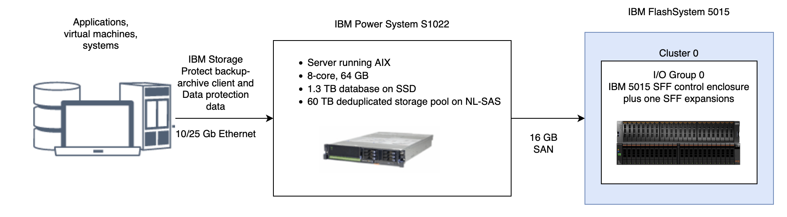

## Chapter 3. Storage configuration blueprints

### 3.1 Small configuration

A small-scale system is based on IBM FlashSystem 5015 storage. One dual control enclosure and one expansion enclosure contain IBM Storage Protect data.

#### 3.1.1 Logical layout
Figure 2 shows the small system layout and how server and storage hardware is connected to clients. A single cluster and I/O group are used in this configuration. The small system configuration was tested with 16 Gb Fibre Channel connections made directly from the host to the FlashSystem 5015 system without a SAN switch. 

#### 3.1.2 Storage configuration
Table 12 and Table 13 show the detailed layout for each IBM Storage Protect storage requirement on a small system.  The following array configuration requires the default FlashSystem memory allocation for RAID to be increased, as described in Step "2" for small systems [here](appendix-b.1-configuring-the-small-disk-system.md)

_Table 12. MDisk configuration_

| Server storage requirement | Disk type | Disk quantity | Hot spare coverage | RAID type | RAID array quantity | Usable size | Suggested MDisk group and array names | Usage | 
|-------------|---------|------------|-----------|------------|------------|-------------|----------------|-----------|
| Database    | 1.9 TB Flash Drive | 4       | 1  rebuild areas=1 | DRAID 5** | 1    4 DDM | 3.49 TiB | db_grp0  db_array0 |  Database  |
| Storage pool | 2.4 TB 10k  HDD | 44 | rebuild areas=2 | DRAID 6*** | 1   44 DDM |  76.00 TB | stgpool_grp0  stgpool_array0 | Storage pool |

** Distributed RAID 5, stripewidth=3, rebuild areas=1. 
*** Distributed RAID 6, stripewidth=12, rebuild areas=2.

_Table 13. Fully allocated volume configuration_

| Server storage requirement | Volume name | Quantity | Uses MDisk group | Size | Intended server mount point | Usage |
|----------------------------|-------------|----------|------------------|------|-----------------------------|-------|
| Database | db_00 - db_03 | 4 | db_grp0 | 335.25 GB each | /tsminst1/TSMdbspace00   /tsminst1/TSMdbspace01   /tsminst1/TSMdbspace02   /tsminst1/TSMdbspace03 | Database  |
| Database | alog  | 1 | db_grp0 | 145.25 GB | /tsminst1/TSMalog | Active log |
| Database | archlog | 1 | stgpool_grp0 | 1.19 TB | /tsminst1/TSMarchlog | Archive log |
| Database |backup_0 - backup_1 | 2 | stgpool_grp0 | 3.15 TB each |  /tsminst1/TSMbkup00   /tsminst1/TSMbkup01 |  Database backup |
| Storage pool | filepool_00 - filepool_03 | 4 | stgpool_grp0 | 15.12 TB each | /tsminst1/TSMfile00   /tsminst1/TSMfile01   /tsminst1/TSMfile02   /tsminst1/TSMfile03 |  IBM Storage Protect file systems for a directory-container storage pool |

