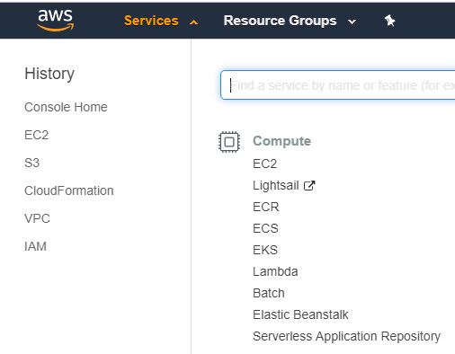
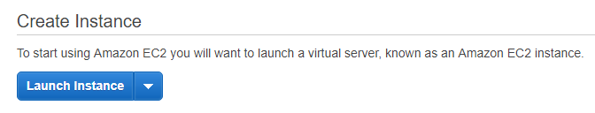
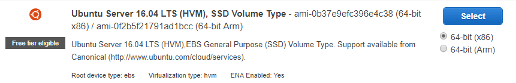
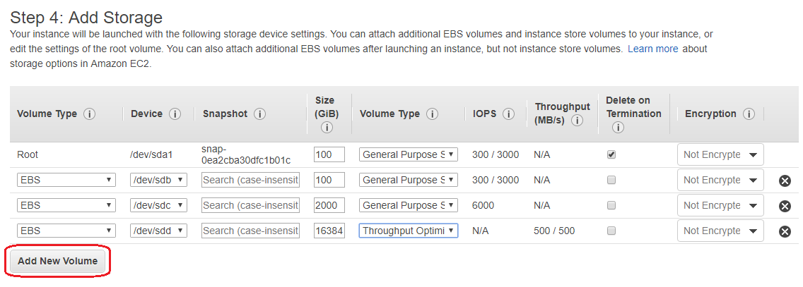
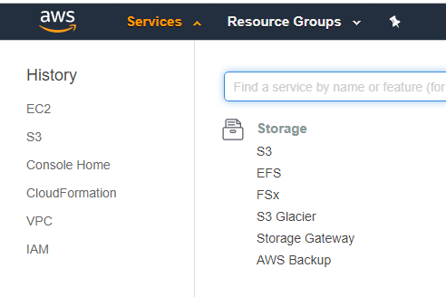
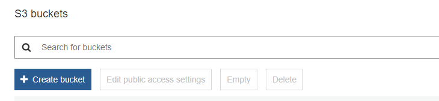
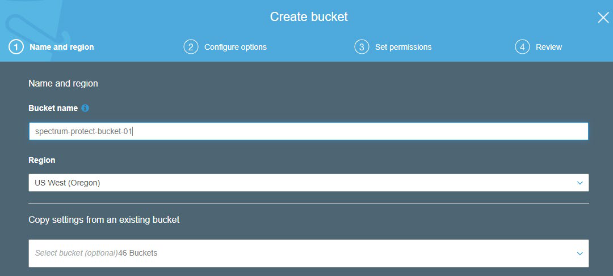
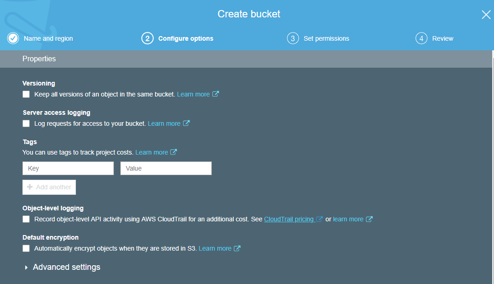

# IBM Storage Protect Blueprint for Amazon Web Services

> Version 2.1
>
> Author: *James Damgar*
> 
> © Copyright International Business Machines Corporation 2013, 2022.</br>
> US Government Users Restricted Rights – Use, duplication or disclosure restricted by GSA ADP Schedule Contract with IBM Corp.
>
> This edition applies to Version 8.1.16 and later of the IBM Storage Protect server, and to all subsequent releases and modifications until otherwise indicated in new editions or technical newsletters.


## Table of Content

* 1. [Introduction](#1-introduction)
  * 1.1 [Purpose](#11-purpose) 
  * 1.2 [Considerations for Disk-to-Cloud Tiering Versus Direct-to-Cloud Data Movement](#12-considerations-for-disk-to-cloud-tiering-versus-direct-to-cloud-data-movement) 
    * 1.2.1 [Cloud Accelerator Cache Considerations](#121-cloud-accelerator-cache-considerations)
    * 1.2.2 [Workload Limitations and Considerations with Tiering](#122-workload-limitations-and-considerations-with-tiering)
    * 1.2.3 [Amazon S3 Intelligent-Tiering](#123-amazon-s3-intelligent-tiering)
  * 1.3 [Cloud Deployment Patterns](#13-cloud-deployment-patterns) 
  * 1.4 [Cloud Environment Considerations](#14-cloud-environment-considerations)
    * 1.4.1 [Importance of Adequate Sizing](#141-importance-of-adequate-sizing)
    * 1.4.2 [Linux Logical Volume Manager (LVM)](#142-linux-logical-volume-manager-lvm)
  * 1.5 [References to Physical IBM Storage Protect Blueprints](#15-references-to-physical-ibm-storage-protect-blueprints)
  * 1.6 [Database Backup to Object Storage](#16-database-backup-to-object-storage)
    * 1.6.1 [Tuning Database Backup Operations to Object Storage](#161-tuning-database-backup-operations-to-object-storage)
  * 1.7 [Server Maintenance Scheduling Considerations](#17-server-maintenance-scheduling-considerations)
  * 1.8 [Session Scalability by Blueprint Size](#18-session-scalability-by-blueprint-size)
  * 1.9 [IBM Storage Protect Security Concepts and Guidelines](#19-ibm-storage-protect-security-concepts-and-guidelines)
    * 1.9.1 [Identity Security in the IBM Storage Protect Environment](#191-identity-security-in-the-ibm-storage-protect-environment)
    * 1.9.2 [IBM Storage Protect Administrative Security](#192-ibm-storage-protect-administrative-security)
    * 1.9.3 [IBM Storage Protect Data Security and Policy Based Management](#193-ibm-storage-protect-data-security-and-policy-based-management)
    * 1.9.4 [IBM Storage Protect Bit-Level Security](#194-ibm-storage-protect-bit-level-security)
  * 1.10 [Optimizing Restore Performance from Cloud-Container Storage](#110-optimizing-restore-performance-from-cloud-container-storage-pools)
    * 1.10.1 [Enabling the Cloud-container Storage Pool Cloud Read Cache](#1101-enabling-the-cloud-container-storage-pool-cloud-read-cache)
    * 1.10.2 [Increasing the Minimum Extent Size for Client Nodes](#1102-increasing-the-minimum-extent-size-for-client-nodes)
* 2. [Amazon EC2 Compute Configurations](#2-amazon-ec2-compute-configurations)
  * 2.1 [Current Cloud Blueprint for AWS Configurations](#21-current-cloud-blueprint-for-aws-configurations)
  * 2.2 [Compute, Disk, and File System Setup Instructions for Linux-based Systems](#22-compute-disk-and-file-system-setup-instructions-for-linux-based-systems)
    * 2.2.1 [Linux Operating System Packages and General Guidance](#221-linux-operating-system-packages-and-general-guidance)
    * 2.2.2 [Large Blueprint Instructions](#222-large-blueprint-instructions)
      * 2.2.2.1 [Disk Setup Instructions](#2221-disk-setup-instructions)
    * 2.2.3 [Medium Blueprint Instructions](#223-medium-blueprint-instructions)
      * 2.2.3.1 [Disk Setup Instructions](#2231-disk-setup-instructions)
    * 2.2.4 [Small Blueprint Instructions](#224-small-blueprint-instructions)
      * 2.2.4.1 [Disk Setup Instructions](#2241-disk-setup-instructions)
    * 2.2.5 [Extra-Small Blueprint Instructions](#225-extra-small-blueprint-instructions)
      * 2.2.5.1 [Disk Setup Instructions](#2251-disk-setup-instructions)
    * 2.2.6 [IBM Storage Protect Format and Server Options](#226-ibm-storage-protect-format-and-server-options)
  * 2.3 [Design Considerations for Amazon EC2 Instances](#23-design-considerations-for-amazon-ec2-instances)
    * 2.3.1 [Considerations for Direct-to-Cloud Architectures](#231-considerations-for-direct-to-cloud-architectures)
    * 2.3.2 [Sizing the Cloud Accelerator Cache](#232-sizing-the-cloud-accelerator-cache)
    * 2.3.3 [AWS: Large Instance Considerations](#233-aws-large-instance-considerations)
    * 2.3.4 [AWS: Medium Instance Considerations](#234-aws-medium-instance-considerations)
    * 2.3.5 [AWS: Small Instance Considerations](#235-aws-small-instance-considerations)
    * 2.3.6 [AWS: Extra-Small Instance Considerations](#236-aws-extra-small-instance-considerations)
    * 2.3.7 [IBM Storage Protect Configuration Next Steps](#237-ibm-storage-protect-configuration-next-steps)
* 3. [Quick Start Guide for Amazon Web Services](#3-quick-start-guide-for-amazon-web-services)
  * 3.1 [Using an Existing or New VPC](#31-using-an-existing-or-new-vpc)
  * 3.2 [Amazon Service Costs](#32-amazon-service-costs)
  * 3.3 [Architecture](#33-architecture)
    * 3.3.1 [Protecting AWS Resources](#331-protecting-aws-resources)
    * 3.3.2 [Replication Configuration](#332-replication-configuration)
  * 3.4 [Planning the Deployment](#34-planning-the-deployment)
    * 3.4.1 [AWS Account](#341-aws-account)
    * 3.4.2 [Technical Requirements](#342-technical-requirements)
    * 3.4.3 [Deployment Options](#343-deployment-options)
  * 3.5 [Deployment Steps](#35-deployment-steps) 
    * 3.5.1 [Step 1. Sign in to the AWS Account](#351-step-1-sign-in-to-the-aws-account) 
    * 3.5.2 [Step 2. Launch the AWS CloudFormation Template](#352-step-2-launch-the-aws-cloudformation-template) 
    * 3.5.3 [Step 3. Connect to the Server to Continue the IBM Storage Protect server Installation](#353-step-3-connect-to-the-server-to-continue-the-ibm-storage-protect-server-installation) 
  * 3.6 [Security](#36-security) 
    * 3.6.1 [AWS Identity and Access Management (IAM)](#361-aws-identity-and-access-management-iam)
    * 3.6.2 [OS Security](#362-os-security) 
    * 3.6.3 [Security Groups](#363-security-groups) 
  * 3.7 [Amazon CloudWatch and AWS CloudTrail Monitoring with IBM Storage Protect](#37-amazon-cloudwatch-and-aws-cloudtrail-monitoring-with-storage-protect) 
    * 3.7.1 [Functions of AWS CloudWatch](#371-functions-of-aws-cloudwatch) 
    * 3.7.2 [Functions of AWS CloudTrail](#372-functions-of-aws-cloudtrail)
    * 3.7.3 [Preparing AWS CloudWatch for Use with IBM Storage Protect](#373-preparing-aws-cloudwatch-for-use-with-ibm-storage-protect) 
    * 3.7.4 [Setting up AWS CloudWatch Monitoring for IBM Storage Protect](#374-setting-up-aws-cloudwatch-monitoring-for-ibm-storage-protect) 
    * 3.7.5 [Integrating AWS CloudTrail with CloudWatch](#375-integrating-aws-cloudtrail-with-cloudwatch) 
    * 3.7.6 [AWS CloudWatch Dashboards](#376-aws-cloudwatch-dashboards) 
  * 3.8 [Encrypting AWS Components with the Key Management Service (KMS)](#38-encrypting-aws-components-with-the-key-management-service-kms) 
    * 3.8.1 [Creating an AWS KMS Key](#381-creating-an-aws-kms-key) 
    * 3.8.2 [Encrypting AWS Resources Used by IBM Storage Protect](#382-encrypting-aws-resources-used-by-ibm-storage-protect) 
  * 3.9 [Other AWS Considerations: Tagging and Cost Reduction](#39-other-aws-considerations-tagging-and-cost-reduction) 
    * 3.9.1 [Tagging AWS Resources](#391-tagging-aws-resources) 
    * 3.9.2 [Cost Reduction in AWS](#392-cost-reduction-in-aws) 
* 4. [Deploying within AWS GovCloud (US)](#4-deploying-within-aws-govcloud-us)
  * 4.1 [Amazon Web Services GovCloud (US)](#41-amazon-web-services-govcloud-us) 
  * 4.2 [AWS GovCloud (US) Amazon Machine Images (AMIs)](#42-aws-govcloud-us-amazon-machine-images-amis) 
  * 4.3 [AWS GovCloud (US) VPC Endpoints](#43-aws-govcloud-us-vpc-endpoints) 
  * 4.4 [AWS GovCloud (US) Differences from Standard AWS](#44-aws-govcloud-us-differences-from-standard-aws) 
    * 4.4.1 [Differences with Amazon S3](#441-differences-with-amazon-s3) 
    * 4.4.2 [Differences with Amazon EC2 and EBS](#442-differences-with-amazon-ec2-and-ebs) 
    * 4.4.3 [Differences with Amazon CloudWatch and CloudTrail](#443-differences-with-amazon-cloudwatch-and-cloudtrail) 
    * 4.4.4 [Differences with Amazon Direct Connect](#444-differences-with-amazon-direct-connect) 
* 5. [Appendix](#5-appendix) 
  * 5.1 [Disk Benchmarking](#51-disk-benchmarking) 
  * 5.2 [Object Storage Benchmarking](#52-object-storage-benchmarking) 
  * 5.3 [Benchmarking Performance Goals](#53-benchmarking-performance-goals) 
  * 5.4 [Instance and Object Storage: Navigating the AWS Portal](#54-instance-and-object-storage-navigating-the-aws-portal) 
* 6. [References](#6-references) 
* 7. [Notices](#7-notices)

---
## 1. Introduction

### 1.1 Purpose

This document introduces possibilities for integrating an IBM Storage Protect server with an **Amazon Web Services (AWS)** cloud computing system. You can use the configurations as starting points to deploy a large, medium, or small system (as defined in the [IBM Storage Protect Blueprints](https://www.ibm.com/support/pages/node/1146352)) or an extra-small system. With the goal of achieving a target daily ingestion rate (corresponding to a large, medium, small, or extra-small deployment), configuration possibilities are offered so that you can get a sense of the relative CPU, memory, disk, and network capabilities that are needed to satisfy requirements. In addition, a survey of options for fulfilling these needs is provided. Certain cloud instance and disk types offered by providers might be sufficient in some areas while lacking in others. You must recognize where system bottlenecks might arise that could limit IBM Storage Protect capability.

Use this paper as a **starting point for guidance** about where to deploy an instance of the IBM Storage Protect server within an Amazon Elastic Compute Cloud (Amazon EC2) dedicated or shared compute instance with the goal of eventually storing the bulk of primary backup and archive data on cost-effective object storage. In the case of Amazon, this means Amazon S3 (Simple Cloud Storage Service). This goal can be accomplished by configuring an IBM Storage Protect cloud-container storage pool with (block disk-based) accelerator cache. Two approaches are generally available for storing data in an IBM Storage Protect cloud-container storage pool: a direct-to-cloud approach or a disk-to-cloud tiering approach.

For **direct-to-cloud** architectures, backup data is ingested directly into a **cloud-container storage pool** with a performant accelerator cache disk location tuned for a system's ingestion workload as the initial "landing spot" (for more information, see [Sizing the Cloud](#232-sizing-the-cloud-accelerator-cache). Data is then immediately, asynchronously transferred to object storage while further data is also ingested into the disk staging area (also known as *overlapped I/O*). The key consideration here is to determine the performance characteristics that the disk staging area must provide to allow for this mixed write-and-read behavior to ensure that ingestion targets are met. A *Cloud Cache and Object Storage Benchmarking* guide and "Cloud benchmarking tools" packages are provided along with this paper to assist in benchmarking both the cloud accelerator cache and object storage system from a prospective host server.

In contrast, **disk-to-cloud** tiering architectures make use of Storage Protect **storage rules** to demote data from one or more (usually small) directory-container storage pools (a disk tier) to a cloud-container storage pool. Backup data is initially ingested into a directory-container storage pool and later a portion of this data is moved asynchronously to a cloud-container storage pool. This can be done with either age-based tiering (available as of IBM Storage Protect Version 8.1.3) or tiering by backup state (available as of Storage Protect V8.1.6). With IBM Storage Protect V8.1.6, a combination of storage rules and storage subrules can be used to facilitate more granular tiering behavior between the disk and object storage tiers, allowing for flexibility and filtering by node and node file space, for example. Some guidance is given in this paper to assist with determining whether tiering is suitable for your workload demands and characteristics. (For an introduction to the tiering features that are available in IBM Storage Protect, see [Tiering data to cloud or tape storage](https://www.ibm.com/docs/en/storage-protect/8.1.23?topic=storage-tiering-data) in the online product documentation.)

With AWS, solutions involving disk-to-cloud tiering can be cost prohibitive due to the higher cost of Amazon Elastic Block Store (EBS) disk, which might have to be provisioned to support the disk tier, in contrast to the relatively lower cost of Amazon Simple Cloud Storage Service (S3) object storage. However, restore requirements of a solution may be such that having operational recovery data on a fast-performing disk tier is worth this additional cost. Further guidance is provided in the following section regarding considerations for using a direct-to-cloud or tiering approach. The architectures referenced within this paper use a direct-to-cloud approach but can be adjusted to conform to the requirements of a tiering architecture.

### 1.2 Considerations for Disk-to-Cloud Tiering Versus Direct-to-Cloud Data Movement

The primary advantage of the **tiering** model is that operational recovery data can be preserved on a localized, fast disk tier for rapid recovery while older copies of data or data intended for long-term retention can be demoted to object storage, which is typically more affordable. The tiering model can also be used as an alternative to the direct-to-cloud model with a relatively small disk tier footprint (not strictly for operational recovery purposes). When the TIERDELAY parameter is set to 0, age-based tiering can be used to tier each day's worth of ingested client data after it is ingested (after the backup operation is completed). In this case, potentially less expensive disk can be provisioned for use by the small directory-container pool tier because no ingest and cloud transfer input/output (I/O) operations occur in parallel. Tiering can be run serially after the completion of data ingestion during scheduled windows with less or no contention for this disk; the disk area can be cleared in preparation for the next day's ingestion.

The same ingestion targets can be satisfied with the disk-to-cloud tiering model as with the direct-to-cloud model, assuming that the direct-to-cloud approach makes use of an accelerator cache and overlapped data ingestion.

**Restriction:** To implement cloud tiering, you must provision enough disk space to hold a full day's worth of ingested data (plus some buffer) to avoid failed backup operations. The same underlying disk technology can be used in both cases. If, however, you plan to use disk-to-cloud tiering to hold one or more days' worth of operational recovery data within a

directory-container pool disk tier, the instance disk capacity might have to be much greater, with the caveat that a slower-performing disk might be sufficient for this case. In all cases, you must understand the ingestion targets (after data deduplication and compression) to determine a daily disk capacity for a transient disk case. Meanwhile, operational recovery requirements in terms of the number of days' worth of recovery data (after deduplication and compression) should be determined to further size a directory-container pool with tiering to cloud if necessary.

With the **direct-to-cloud** model, you can minimize local block storage capacity. This is an advantage because local block storage can be cost prohibitive in cloud-hosted environments.

**Note**: that pursuing a tiering model with Amazon Web Services may be cost prohibitive in terms of the amount of EBS block storage disk required for a directory-container storage pool "disk tier". As such, only direct-to-cloud model options are presented within this paper.

#### 1.2.1 Cloud Accelerator Cache Considerations

Beginning with IBM Storage Protect V8.1.2, data ingestion from clients is throttled if the accelerator cache area is near capacity. This feature makes it possible for this disk cache location to be **underprovisioned** from a capacity standpoint in that the disk cache location does not have to be sized large enough to hold a full day's worth of deduplicated and compressed data. However, the accelerator disk still must be performant enough in terms of input/output operations per second (IOPS) so that client data ingestion and replication target activity can be completed in a timely manner. In the end, you have to compare costs to determine whether larger capacity, less-expensive disk with tiering has an advantage over a direct-to-cloud cache model for a given environment, ingestion rate, and recovery objective.

**Restriction:** If you plan to use the direct-to-cloud ingestion model, the cloud accelerator cache should be sized large enough to hold at least two times the largest front-end object being ingested. For example, if a 512 GB object is to be ingested directly into a cloud-container storage pool, the cloud accelerator cache should be at least 1 TB in size.

Similarly, if 5 client sessions will be backing up 100 GB files each at the same time, the cloud accelerator cache should be sized to at least 1000 GB (5 clients x 100 GB files x 2).

This is because the IBM Storage Protect server will attempt to "reserve" space in the cloud accelerator cache for in-flight ingestion until ingestion is completed for those objects and their database transactions are committed to the server. By default, this processing assumes no deduplication or compression savings and attempts to reserve the total front-end amount of data to ensure sufficient storage capacity.

Beginning with IBM Storage Protect V8.1.6, a server option can be used to influence this behavior. The undocumented server option `PreallocReductionRate` can be used to give the server a "hint" about the expected reduction ratio for ingested data and cause the server to reserve less physical space in the directory-container storage pool. For example, setting this option to 5 will cause the server to assume a 5:1 data reduction rate for front-end to back-end data so that only 1 unit of back-end space will be reserved for 5 units of front-end protected data. This option can range from 1 (the default, no reduction) to 25 (a 25:1 assumed reduction). Use this option only when a smaller cloud accelerator cache is

planned and data reduction rates are certain. If the storage pool has inadequate space, backup operations can fail.

Beginning with IBM Storage Protect V8.1.10, the undocumented server option `UsePreallocReduction` was introduced to enable automatic preallocation reduction in V8.1.10 and later servers. By default, this option is disabled. If you set the option to YES, the IBM Storage Protect server automatically determines an accurate data reduction rate based on existing storage pool statistics and applies this reduction when preallocating space within storage pool directories (or the cloud accelerator cache, in the case of a cloud-container storage pool). Use this option only when a smaller cloud accelerator cache is planned and data reduction rates are consistent between backup operations. If the storage pool has insufficient space, backup operations can fail. Also beginning with IBM Storage Protect V8.1.10, the undocumented server option `PreallocReductionPadding` server option can be used to add "padding" to the preallocation. You can specify this option as a percentage. The default value is 5. The following example illustrates the use of this option. Assume that the `UsePreallocReduction` option is enabled, the `PreallocReductionPadding` option is set to 5, and storage pool statistics show a 4:1 data reduction with deduplication and compression (75%). When a 100 MB object is ingested, the IBM Storage Protect server attempts to allocate 30 MB of space in the cloud accelerator cache, based on the following formula:
```
((100% - 75%) + 5%) X 100 MB = 30 MB
```
You can use the `PreallocReductionPadding` option in combination with the `UsePreallocReduction` option if data reduction rates are inconsistent between backup operations and an accurate padding value can be determined.

The `PreallocReductionRate` option takes precedence over the `UsePreallocReduction` option.

#### 1.2.2 Workload Limitations and Considerations with Tiering

Not all client workloads are suitable for a disk-to-cloud tiering model. Tiering by age (as of IBM Storage Protect V8.1.3) allows for the demotion of *backup* objects that have reached the specified age threshold. Inactive backup generations that are older than the specified age are transitioned to object storage. Tiering by state (as of IBM Storage Protect V8.1.6) allows for the demotion of backup objects that have reached the specified age threshold and are *inactive* within the server. Active backup objects are preserved on the disk tier, while inactive copies of backup objects are transitioned to object storage.

Disk-to-cloud tiering is **suitable** for client workloads that have **low** data deduplication rates (backup generations differ greatly). In this case, data is highly unique between backup operations. When a backup generation is tiered to object storage, the deduplicated extents (chunks) that make up that object have their references decremented on the source directory-container storage pool. In this case, reference counts are likely to be low and more deduplicated extents are likely to be removed from the disk tier as objects are tiered and space is released.

Disk-to-cloud tiering **might not be suitable** for client workloads that have a **high** data deduplication rate. In this case, data is not very unique between backup generations and many shared deduplicated extents are referenced by multiple object generations. Even though an object can be tiered by a storage tiering rule, because the object shares many extents with other objects (which might still be active), a large proportion of the object's data will not be removed from the disk tier (although it will be copied to the object storage tier).

The following figures illustrate how data movement with disk-to-cloud tiering can occur. [Figure 1] depicts depicts a scenario in which multiple versions of three backup objects (A, B, and C) have been ingested and are stored in a directory-container storage pool on disk. Dotted lines represent references to deduplicated extents (colored, numbered boxes). With the tier-by-state option, the inactive object copies (shown in the gray rectangle) would be tiered to a cloud-container storage pool.


*Figure 1: Disk-to-cloud tiering, before and after*

[Figure 2]: Disk-to-cloud tiering, after tiering depicts the situation after tiering is completed and the REUSEDELAY parameter value of the source directory-container storage pool is exceeded (so that deduplicated extent removal for extents with zero reference count can occur).


*Figure 2: Disk-to-cloud tiering, after tiering*

Notice that deduplicated extents 1 and 2 remain on disk even after tiering and extent cleanup have occurred. This is due to the fact that those extents are shared between the active and inactive backup copies. If many deduplicated extents are shared by objects (a high duplicate data rate with high data deduplication ratios), it is more likely that data will remain on disk, even after backup objects have been tiered at an IBM Storage Protect inventory level. Keep this factor in mind when you consider a disk-to-cloud tiering model and when you size an environment.

For workloads that deduplicate well from day to day, there will be many shared extents across backup and archive generations and a smaller capacity footprint on tiered object storage as a result because these backup and archive generations will also share many extents in the cloud-container storage pool. For workloads that deduplicate poorly day to day (highly unique data change each day), there will be few shared extents across backup and archive generations and potentially a larger capacity footprint on tiered object storage because these backup and archive generations will each point to (more) unique data in the cloud-container storage pool.

If the primary motivation for using disk-to-cloud tiering is rapid recovery of operational data, a tiering model might provide the best approach. You must understand the nature of the client workload to accurately size the directory-container storage pool on disk.

#### 1.2.3 Amazon S3 Intelligent-Tiering

Beginning with IBM Storage Protect V8.1.8, you can enable Amazon S3 Intelligent-Tiering for objects in IBM Storage Protect cloud-container storage pools. When you issue the `DEFINE STGPOOL` command to define a cloud-container storage pool with Amazon S3, you can specify a new parameter, `CLOUDSTORAGECLASS` (and update the parameter value later by using the `UPDATE STGPOOL` command). Setting this parameter to a value of `AUTOMATICVENDORTIERING` will cause all new cloud-container storage pool objects that are uploaded to S3 to be sent to the Intelligent-Tiering storage class (as opposed to the default Standard storage class). Objects with the `AUTOMATICVENDORTIERING` storage class type can be transitioned automatically to the Amazon S3 Infrequent Access tier if the object has not been accessed for 30 consecutive days. This functionality offers storage capacity savings for Amazon S3 users. IBM Storage Protect data that is already deduplicated and compressed can be further transitioned to a lower-cost storage tier within S3, provided that restore or other read requests that would involve deduplicated extents within the transitioned object are infrequent. With Amazon S3 Intelligent-Tiering, objects that are read are automatically moved back to the frequent access tier. For more information about Amazon Intelligent-Tiering, see [References](#6-references)\[10\].

### 1.3 Cloud Deployment Patterns

The described configurations can be used as starting points in situations where the IBM Storage Protect cloud instance will be a **primary server and in situations where it is used as a replication target**. In scenarios where the cloud-based instance is a replication target, adequate "public" network capability might be necessary to satisfy replication throughput requirements. AWS Direct Connect can be used to establish a dedicated 1 Gbps or 10 Gbps network connection from an on-premises data center to AWS to facilitate efficient Storage Protect replication or backup processing from peer servers or clients outside the AWS infrastructure.

Generally, IBM Storage Protect deployments making use of cloud-based object storage will align with one of the following three patterns:


*Figure 3: Deployment patterns*

In the figure, the first deployment pattern could involve an Storage Protect server that is installed on premises or in Amazon on an EC2 instance, with primary backup and archive data landing in object storage immediately. The positioning of the IBM Storage Protect server in relationship to clients could be one critical decision point when you consider whether to have a server instance on premises or within AWS. This pattern could involve use of a direct-to-cloud architecture with accelerator cache or a small container pool with immediate tiering to a second cloud-container storage pool without accelerator cache.

The second deployment pattern would make use of cloud-based Amazon S3 object storage at the secondary disaster recovery (DR) site. This DR server could be installed at an on-premises site or on an Amazon EC2 instance. In the latter case, sufficient wide area network (WAN) bandwidth between the primary and secondary sites is required for acceptable performance. Much like the first deployment pattern, here the IBM Storage Protect server at the DR site could make use of a direct-to-cloud topology with a cloud-container storage pool featuring accelerator cache, or it could use a small container pool landing spot with immediate tiering to a cloud-container storage pool backed by object storage.

The third deployment pattern features specific use of disk-to-cloud tiering, available with IBM Storage Protect V8.1.3 and later, to allow for operational recovery data to reside on faster performing disk storage. Data that is older, archived, or both would be tiered to cloud-based Amazon S3 object storage after a specified number of days. This deployment could also be implemented at an on-premises site or within an Amazon EC2 instance. However, the additional cost of having a larger capacity container pool should be factored into cost estimates with an in-the-cloud solution.

A **combination** of approaches is also possible within the same deployment. For example, a cloud-container storage pool could be configured with accelerator cache disk and made to store long-term retention or compliance archives. A directory-container storage pool could be configured as a disk tier for normal backups, and a tiering relationship could be set up so that operational recovery data (for example, backups from the previous 7 days) is kept on this disk tier, while older data is demoted to the same cloud-container storage pool.

The same cloud-container storage pool can be a direct backup target and a tiering target. However, if the pool is a direct target of a backup-archive client, the pool must be configured with accelerator cache disk.

### 1.4 Cloud Environment Considerations

For Amazon EC2, you can choose one of multiple potentially suitable instance types to satisfy an IBM Storage Protect server requirement. You do not have complete flexibility in terms of the type and proportion of CPU and memory resources available for an instance.

However, standard instance types are available, which can roughly match recommended server requirements. Take care to select instances that have the required **CPU and memory** resources to support inline server data deduplication, compression, encryption, and cloud application programming interface (API) operations. The instances also must have the associated storage area network (SAN) disk (Amazon EBS) and network (Ethernet) capability to support the desired workload.

With Amazon Elastic Cloud Compute (EC2) instances, you can alter the instance type later, when resource requirements might be clearer. The process is fairly straightforward for Elastic Block Store (EBS) backed instances using Amazon's web portal. However, there are some caveats to keep in mind. For details, see the Amazon documentation under [References](#6-references)\[3\]. In particular, experience shows that driver issues can occur when attempting to resize Windows-based EC2 instances after initial provisioning. To help avoid complications, use Red Hat Enterprise Linux (RHEL) or Ubuntu Linux instances in Amazon EC2 with IBM Storage Protect.

#### 1.4.1 Importance of Adequate Sizing

Ingested backup data reaching the cloud accelerator cache or the initial container pool tier requires the use of block storage allocated to the cloud server. IBM Storage Protect database activity also uses some level of throughput and elevated I/O operations during workload processing. Therefore, disk **I/O capability** and instance-to-disk throughput considerations must be evaluated when choosing and configuring an in-the-cloud IBM Storage Protect instance. With a final ingestion point on object storage via a cloud-container storage pool, the **Ethernet capability** of the instance and the nature of the network between the instance and the Amazon S3 object storage endpoint must be kept in mind. As part of this, consider how the front-end client data workload deduplicates and compresses data into the back-end stored quantity.

Certain Amazon instances might or might not have access to dedicated bandwidth to attached EBS disks. A lack of access can create a bottleneck in the IBM Storage Protect server's database operations. Certain instances might have limited throughput over Ethernet, and this limitation could hamper ingestion and restore throughput with object storage. During the planning phase, consider how ingested data will be **reduced by data deduplication and compression** when the data moves to the back-end storage location.

These factors will help you estimate how much back-end data must be moved within a certain time window (measured in hours) and can help predict the throughput (megabytes per second or terabytes per hour) that the Ethernet network and object storage endpoint require to satisfy ingestion requirements. Generally, **10 Gbps** Ethernet capability to private

Amazon S3 storage endpoints is required for large, medium, or small Blueprint ingestion targets, while 1 Gbps is sufficient for extra-small targets.

Beginning with IBM Storage Protect V8.1.3, the server automatically throttles client backup operations if the cloud accelerator cache portion of a cloud-container storage pool is nearing full capacity. As a result, it is not mandatory to configure cloud accelerator disk cache space that would be large enough to hold a full day's worth of backups (after data deduplication and compression). However, disk benchmarks should be run to ensure that the anticipated back-end workload that an IBM Storage Protect server is expected to support will not result in this disk location being the primary bottleneck of the system (see [Disk Benchmarking](#51-disk-benchmarking)). In practice, any planned deployment should be validated to ensure that it will meet performance requirements.

#### 1.4.2 Linux Logical Volume Manager (LVM)

The described reference architectures use either the RHEL or Ubuntu Linux operating system. If you want to deploy a solution on Linux based operating systems, the preferred method is to use the **Linux Logical Volume Manager (LVM)** for the cloud accelerator cache disk and, optionally, the IBM Storage Protect database archive log disk (when more than one physical disk is utilized). The remaining Storage Protect disk components can be satisfied with file systems formatted on directly mounted Amazon EBS block disks. The overlapped I/O pattern experienced with concurrent backup ingestion activity and transfer of data to object storage can lead to "hot spots" on disk when more than one storage pool directory is defined for a cloud-container storage pool as accelerator cache. To help avoid a throughput bottleneck, you can configure a single logical volume to span all physical volumes assigned for use as cloud accelerator cache. Furthermore, the preferred method is to use a stripe size of **256 KiBytes** for the single logical volume and ensure that the number of stripes matches the number of physical disks. For more information, see the [Compute, Disk, and File System Setup Instructions for Linux-based Systems](#22-compute-disk-and-file-system-setup-instructions-for-linux-based-systems) section of this document.

The use of Linux LVM to logically stripe across several Amazon EBS disks should not be depended upon to increase the durability of the underlying storage, as Amazon EBS disks are already redundant within an Amazon Availability Zone and so do not benefit from the recovery characteristics of LVM striping or RAID.

### 1.5 References to Physical IBM Storage Protect Blueprints

Throughout this paper, the server specifications in the *IBM Storage Protect Blueprint for Linux x86* document (also known as an [IBM Storage Protect Blueprint](https://www.ibm.com/support/pages/ibm-spectrum-protect-blueprints)) are referenced as targets for CPU and memory configurations matching small, medium, and large server builds. For more information about the Blueprints, see [References](#6-references)\[1\]. The intention with the server builds outlined here is to provide systems capable enough from a CPU, memory, disk, and Ethernet point of view to approach Blueprint-level ingestion capability. Although different instance types can be used to satisfy the same requirements, and deviations from the Blueprint specifications mentioned in this document are possible, the disk specifications should be followed to ensure appropriate ingest and database scalability and performance.

As a reference, the following table indicates the throughput, capacity, CPU, and memory targets for each of the referenced Blueprints. The values for total managed data and daily ingest data are for the block storage Blueprints. These ingestion targets assume an 8-hour backup window.

*Table 1: IBM Storage Protect physical Blueprint targets (Linux x86)*
| Sizing category | CPU  | RAM | Total managed data (front end) | Daily ingest data (front end) |
|-----------------|------|-----|--------------------------------|-------------------------------|
|   Small         | 16 cores | 64 GB  | 60 TB -- 240 TB    | Up to 10 TB per day   |
|   Medium        | 20 cores | 128 GB | 360 TB -- 1440 TB  | 10 -- 30 TB per day   |
|   Large         | 44 cores | 384 GB | 1000 TB -- 4000 TB | 20 -- 100 TB per day  |

Although not defined explicitly in the physical Blueprints, the extra-small cloud Blueprint systems target up to 10 TB or more of total managed (front-end) data with a daily ingestion rate of up to 1 TB, or more, per day.

### 1.6 Database Backup to Object Storage

Beginning with IBM Storage Protect V8.1.10, you can back up the server database to object storage for disaster recovery purposes. The configurations in this document are based on the assumption that the server database is backed up to object storage. An alternative approach for cloud-hosted servers is to use the FILE device class and run backup operations to provisioned disk storage. Previous versions of the Cloud Blueprints included FILE device class configurations that offered approximately two days' worth of full database backups in the worst case (with the IBM Db2 database consuming close to its maximum resident capacity). However, this approach can be cost-prohibitive in some cloud-hosted environments such as Amazon Web Services, where disk storage is typically more expensive than object storage. For example, with a large Blueprint cloud system, an approximate monthly savings of 40-50% can be achieved when using 16 TB of Amazon S3 Standard storage class storage for database backups compared to statically provisioning 16 TB of st1 (throughput optimized) EBS block storage attached to the instance.

Another advantage of using S3 object storage for IBM Storage Protect database backups is that object storage pricing with Amazon Web Services is based on the amount of storage space that is actually used, while disk storage pricing is based on the amount of provisioned storage space, even if a portion is unused. Not only is unused provisioned disk space a deterrent to cost savings, the actual rate charged for this space is much more than object storage considering that the data involved (database backups) is archive-like in nature. Static provisioning of disk storage is no longer required and the amount of storage consumed for database backup operations can better match the requirements of the environment. By taking advantage of this storage model, you can enjoy greater freedom in choosing and changing retention policies for database backup operations to achieve the

recovery window that you want. For example, you can transition from 2 days' worth of full database backups to 7 days without re-provisioning and reconfiguring disk storage.

A further benefit of using database backup operations to S3 object storage is that increased data redundancy, availability, and durability can be achieved through the inherent synchronous copying of data across at least three different availability zones (geographically dispersed data centers) within the same AWS Region. You can use the same Amazon S3 bucket for database backups and the cloud-container storage pool of the IBM Storage Protect server to ensure matching redundancy, availability, and durability attributes for database metadata and storage pool data. In case of an outage of an availability zone within an AWS Region, an IBM Storage Protect server instance could be recovered via a database restore, and the cloud-container storage pool resident data could be accessed by a different Amazon EC2 server instance in the same region. For more information about how Amazon distributes S3 data across availability zones within an AWS Region, see [References](#6-references)\[11\].

By default, Amazon copies S3 object bucket data to all availability zones synchronously within an AWS Region. Amazon S3 bucket replication can also be used with both Same-Region replication (SRR) and Cross-Region replication (CRR) to asynchronously replicate source bucket data to a different bucket in a different AWS Region over a secured SSL network link. You can configure replication for all objects in the bucket or only for objects with a specified prefix and/or tag. Versioning must be enabled for both the source and target buckets in a replication pair. A replication configuration linked to the source bucket is used to drive the replication. The Amazon S3 storage class can be changed during replication if the source objects do not have the storage class of S3 Glacier or S3 Glacier Deep Archive. For example, objects can be replicated from the source bucket with a Standard storage class to Glacier or Infrequent-Access in the target bucket. In addition, Amazon S3 Replication Time Control (S3 RTC) can be used to enforce a window of up to 15 minutes for data in a source bucket to be replicated (99.99% of new objects stored in Amazon S3 are replicated within 15 minutes, according to the service level agreement). For more information about Amazon S3 bucket replication, see [References](#6-references)\[12\].

One use case for Amazon S3 bucket replication with IBM Storage Protect is to store additional copies of database backups in a different storage class in the same Region.

When deleting older database backup objects (for example, with the DELETE VOLUMEHISTORY command), IBM Storage Protect deletes only the objects in the source Amazon S3 bucket. Objects in the target Amazon S3 bucket must be deleted manually by using the Amazon Web Services Console or command-line interface. By taking advantage of different storage classes, you can potentially retain a smaller number of database backup generations (for example, 1 or 2) in an Amazon S3 bucket with an immediate access storage class such as Standard while retaining additional generations of database backups in a target bucket with a different (perhaps less expensive) storage class such S3 Glacier. To recover data from a database backup in the target bucket, you would first have to manually transfer database backup objects outside of Storage Protect to the original bucket by using the AWS command-line interface.

For instructions about backing up databases to object storage, see [References](#6-references)\[13\].

#### 1.6.1 Tuning Database Backup Operations to Object Storage

When a CLOUD device class is used for IBM Storage Protect database backup operations, the following files are copied to Amazon S3 object storage:
* Database volumes
* The device configuration file
* The volume history file
* The master encryption key for the server

Large items, such as database volumes, are copied to object storage by using multipart upload. By specifying multiple, concurrent data streams during database backup operations, you can reduce the time that is required to back up the database. The number of data streams that are used for the database backup operation is the same as the number of data streams that are required for any subsequent database restore. The number of data streams affects throughput. Each database backup operation uses the following separate resources:
* A session connection from Db2 to the IBM Storage Protect server
* A server thread that sends data from the server to object storage

Several performance factors are involved when backing up the server database to object storage, for example:
* Database disk performance (256 - 512 KB sequential input/output operations)
* Object storage system performance
* Network performance to the object storage system

Before you back up a database to Amazon S3 object storage with the systems presented here, consider the maximum network throughput that is required to complete database backup operations on schedule to meet service level commitments. A common expectation is that a daily full backup of the IBM Storage Protect server database can be completed in 2-3 hours (or less). A 1 Gbit Ethernet link provides approximately 100 MB/s of throughput, while a 10 Gbit Ethernet link provides roughly 1000 MB/s of throughput. A full backup operation for an 8 TB database (at the larger end of a large Blueprint system) would take more than 20 hours on a 1 Gbit connection and approximately 2 - 3 hours on a 10 Gbit connection. These estimates are based on the assumption that these network links are hardly utilized otherwise. The relative load on these networks should be considered when scheduling database backup operations and when selecting which network links to provision and configure for cloud compute instances. The health of the network link should also be evaluated. TCP/IP packet loss of as little as 2% can cause a large degradation in throughput for database backup and restore operations from object storage. This degradation can jeopardize the daily database backup.

Db2 database encryption is used by default for backup operations to cloud device classes to provide additional security for database data. You can specify encryption or compression for a database backup operation to cloud, but not both. If you specify compression for a database backup to cloud, encryption is disabled. Compression impacts

backup performance and limits front-end throughput to approximately 0.5 TB per hour or less, and so is not typically suitable for larger server environments unless a longer database backup window can be tolerated. Compression can, however, result in a smaller data footprint in S3 object storage and slightly improve database restore performance. For smaller IBM Storage Protect servers with smaller databases (such as the extra-small and small configurations shown here), use compression when the following conditions are met:
* The network link to object storage is 1 Gbit or less.
* Database encryption is not necessary.
* Compression savings are required.

Depending on the IBM Storage Protect server size, use the following stream quantities as starting points for optimal performance for database backup operations for extra-small, small, medium, and large Blueprint systems:
* Extra-small system: &emsp; 1 - 5 streams 
* Small system: &emsp; 10 streams 
* Medium system: &emsp; 25 streams
* Large system: &emsp; 50 streams

Then, adjust the number of data streams until you achieve the required or optimal level of throughput consistently. Each data stream uses approximately 20 MB of memory on the IBM Storage Protect server. For example, a 50-stream database backup operation consumes approximately 1000 MB of memory on the server.

A beneficial step when building a cloud-based IBM Storage Protect server is to benchmark the components in the solution to verify that the resources that are available to the server can meet performance demands. For database backup operations to Amazon S3 object storage, this means benchmarking the sequential read throughput of the IBM Storage Protect database disks and benchmarking the throughput capability of the link to S3 object storage from the server instance. When you ensure that these components meet performance goals, you increase confidence that database backup (and restore) operations will finish within the allotted time. For instructions about benchmarking the performance of components and interpreting the results, see [References](#6-references)\[14\].

### 1.7 Server Maintenance Scheduling Considerations

The [IBM Storage Protect Blueprint for Linux x86](https://www.ibm.com/support/pages/ibm-spectrum-protect-blueprints) document provides a detailed breakdown of the procedure for setting up IBM Storage Protect server maintenance schedules (see [References](#6-references)\[1\], Chapter 5). Use this information as a reference for establishing a maintenance schedule on cloud-hosted servers.

For an IBM Storage Protect server in AWS that is serving as a replication target, a replication window and schedule might have to be established. For servers using the direct-to-cloud model, where primary backup data is ingested directly into a cloud-container storage pool, a replication window might not be required if this server is not a replication target server because a cloud-container storage pool cannot be used as a replication

source. In this case, redundancy requirements for the ingested client data can be met by the inherit redundancy of Amazon S3 object storage.

For an IBM Storage Protect server in AWS that is using the disk-to-cloud tiering model, a replication source strategy might be required. Replication can help to protect client data objects in the disk directory-container storage pool that have not yet been tiered (demoted) to object storage because only one copy of that data is present. To prevent excess data from being stored (pinned) to the disk tier, verify the following items:
* The source replication server (used for disk-to-cloud tiering) should be configured with a longer retention policy than the target replication server. In other words, data should be retained for a longer period on the source replication server.
* The retention policy that affects client node data on the target replication server should match the value of the TIERDELAY parameter of the storage rule responsible for tiering the same client node data on the source server.

In general, the server that is used for disk-to-cloud tiering (whether it be the source replication server or the target replication server) should be the server with the longer retention policy for the client nodes that are affected by the tiering storage rule.

### 1.8 Session Scalability by Blueprint Size

*The IBM Storage Protect Blueprint and Server Automated Configuration for Linux x86* document describes how to set the IBM Storage Protect server option MAXSESSIONS, based on Blueprint system size:

* Small system: 250 maximum simultaneous client sessions
* Medium system: 500 maximum simultaneous client sessions
* Large system: 1000 maximum simultaneous client sessions

(For more information about the Blueprint configurations, see [References](#6-references)\[1\].)

The actual throughput scalability of a cloud-based solution depends on many factors, including the configured disk capability and capacity of the system, the amount of CPU and memory resources available on the system, and the relative rate of data deduplication and compression for the dataset that is ingested into the server. Larger objects, which feature a larger deduplicated extent size (for example, 250 - 350 KiBytes, or more) and which do not deduplicate or compress well (for example, less than 10%), will result in less database and computation (CPU) overhead, but will utilize more disk and network bandwidth. The logical reduction of front-end client data to the physical back-end data (which is actually written out and stored to disk and object storage) means that the disk, network, and object storage components will be stressed to a higher degree as client/server session counts increase.

Memory usage by the IBM Storage Protect server might also be greater. As session counts increase, these components are likely to become a system bottleneck, limiting front-end throughput.

Objects that feature smaller, deduplicated extent sizes (for example, 60 - 100 KiBytes or similar) and that deduplicate and compress well (for example, 50% data deduplication with 50% compressibility) will result in less network, disk, and object storage bandwidth used,

but will lead to more database and computation overhead to facilitate these data reduction operations. As session counts increase, CPU and database-related memory are likely to first become limiting factors for these data types. In general, the more successfully data can be deduplicated and compressed (and therefore the greater the data reduction from front-end to back-end data), the greater the number of feasible client sessions. The following table indicates a reasonable range of client session counts based on system size and data type, as well as the likely limiting factor for the system as the high end of the range is approached.

*Table 2: Preferred ranges of maximum values for client session counts*
| Cloud system size | Large object, poor data deduplication and compression** | Large object, good data deduplication and compression*** | Large object, small extent size, good data deduplication and compression**** | Small object, poor data deduplication and compression***** |
|-------------|-------------|-------------|-------------|-------------|
| Extra small |   10 -- 50  |   25 -- 50  |   10 -- 50  |   10 -- 50  |
| Small       |   50 - 100  |   100 - 200 |   50 - 100  |   50 - 100  |
| Medium      |   100 - 200 |   200 - 400 |   100 - 150 |   100 - 150 |
| Large       |   300 - 400 |   400 - 500 |   150 - 200 |   150 - 200 |
| Limiting factor at scale | Network, disk, object storage bandwidth, memory | CPU, memory or network, disk, object storage bandwidth | CPU, memory | CPU, memory | 

** This model uses 128 MiByte objects, 250 - 350 KiByte extents, and \<10% data deduplication and compressibility. Full backup operations are used with pseudo random data or data that cannot be easily deduplicated or compressed. For example, this model can be applied to encrypted data.</br>
*** This model uses 128 MiByte objects, 150 - 200 KiByte extents, and 50% data deduplication and compressibility. For example, this model can be applied to virtual machine backups.</br>
**** This model uses 1 GiByte objects, 60 - 100 KiByte extents, and 50% data deduplication and compressibility. For example, this model can be applied to database image backups.</br>
***** This model uses 128 KiByte objects and \<10% data deduplication and compressibility. For example, this model can be applied to file server data and other small files or objects.

Often, a diminishing rate of return in regard to throughput is experienced when 50 - 100 total client sessions are exceeded, regardless of data type. More sessions are possible and might be warranted, given the client schedule or other requirements. However, aggregate gains in total throughput of a single IBM Storage Protect instance might not be substantial past this point.

### 1.9 IBM Storage Protect Security Concepts and Guidelines

We live in an increasingly hostile environment in terms of data protection and security. Internal and external malicious actors target organizations and institutions for political or social reasons. Many seek financial gain through the use of *ransomware*, a type of malware that encrypts client production data or backup data for the purpose of obtaining a payment (ransom) to decrypt that data. Often, ransomware attacks include the following operations:

1. Infiltrate the environment
1. Obfuscate data by using encryption
1. Export the data as an additional blackmail tactic

Beyond ransomware, other forms of malware and computer viruses can disrupt production workloads and lead to business downtime. Organizations must develop and understand their security posture to combat these and other evolving threats. IBM Storage Protect supports a layered approach to addressing security concerns within a data protection environment. Primarily, this approach is based on secure communication protocols, secure user passwords, and different access levels for IBM Storage Protect administrators. Through the use of policy-based management, IBM Storage Protect administrators can ensure that a sufficient number data versions are available to support \"freedom of action\" for recovering data at different points in time within the environment. IBM Storage Protect also provides for bit-level security, anomaly detection, and audit mechanisms to help secure an environment.

For an overview and primer about securing an IBM Storage Protect environment, see [References](#6-references)\[35\] and \[36\].

Overall, a layered approach to data security and protection should be pursued with IBM Storage Protect in both on-premises and in-the-cloud deployments. The layered approach is based on the following guidelines:
* The set of people with physical and virtual access to administrative functions with the data protection environment should be limited and evaluated regularly.
* The set of administrators should be limited and access restricted based on business function and a need-to-know basis.
* Data deletion authority should be limited and deletion-prevention controls should be implemented, including the IBM Storage Protect command approval feature.
* Redundant copies of data should be made, if possible.
* Protected data should be verified for integrity.
* Recovery procedures should be validated through regular audits and by testing restore operations and disaster recovery (DR) procedures. The goal is to ensure that recovery time objective (RTO) and recovery point objective (RPO) targets can be achieved.


*Figure 4: Layered security*

#### 1.9.1 Identity Security in the IBM Storage Protect Environment

IBM Storage Protect uses a novel *verb protocol* communication mechanism for client/server and server/server communication. This verb protocol is an API protocol in which each side of the communication channel initiates requests or replies with responses that drive behavior within the IBM Storage Protect client or server. When first establishing communication between two endpoints, the client and server or two servers authenticate with one another. With recent versions of IBM Storage Protect, Transport Layer Security (TLS) over TCP/IP is used by default as a security protocol for communication. IBM Storage Protect offers industry-standard local credential management with passwords that are encrypted at rest and decrypted at user sign-on and authentication. During the verb protocol sign-on procedure, TLS is used for authentication (certificate and authentication exchange).

IBM Storage Protect client node and administrator password security can be further enhanced by using Lightweight Directory Access Protocol (LDAP) to apply stricter requirements for passwords. This approach includes the integration of Microsoft Active Directory. With LDAP, the server receives credentials from the client over TLS, and the server "binds" to the LDAP directory service or completes an operation that is equivalent to a bind. For instructions about integrating Storage Protect with LDAP, see [References](#6-references)\[37\].


*Figure 5: Credential security*

The preferred method of identity security is to maintain at least one local administrator account that does not depend on LDAP or Active Directory in case the system that hosts LDAP or Active Directory is compromised by ransomware or other malware or is otherwise unavailable.

IBM Storage Protect TLS certificates can be self-signed or certificate authority (CA) signed. By default, the server generates a unique self-signed certificate during server formatting (initialization). Alternatively, a trusted CA-signed certificate provided by an organization can be installed for use by the server. For instructions about installing a trusted CA-signed certificate on the server, see [References](#6-references)\[38\].

#### 1.9.2 IBM Storage Protect Administrative Security

IBM Storage Protect offers different authority classes for administrators. The classes restrict or enable capability within the product. Administrative network traffic can also be directed over a server TCP/IP port that is separate from data traffic. In this way, a networking team can monitor different types of traffic with different tools or with different levels of granularity. IBM Storage Protect offers an audit trail\" in terms of activity log entries stored in the server\'s database for each operation an administrator performs. The IBM Storage Protect Operations Center can be used to specify certain audit-able messages as triggering \"alerts\" that can be configured to notify specific users via email.

\"Command approval\" is a mechanism that can be enabled within the server to ensure that an additional, second administrator must approve any potentially destructive server command, including data policy changes which might affect data retention. This helps to ensure a \"four eyes\" approach so that a single malicious, careless, or uninformed administrator cannot cause damage within an environment. For information about setting up administrator command approval, see [References](#6-references)\[39\].

#### 1.9.3 IBM Storage Protect Data Security and Policy Based Management

Client data versioning and retention represent a critical aspect to a data security posture. IBM Storage Protect tracks every version of a backed-up file separately in its inventory. The files are not altered after they are stored. Rather, each version is treated as a separate object in the server\'s metadata catalog. IBM Storage Protect uses *policies* to control how the server stores and manages data objects through the hierarchy of policy domains, policy sets, management classes, and copy groups. You can specify IBM Storage Protect policy settings so that many versions of client data are protected for a longer period. In this way, you grant yourself more \"freedom of action\" in terms of having more backup versions, originating from a longer period of time, to provide a wider selection of backup versions for recovery. Even if a security event or malware infiltration is not caught promptly, having several versions of data stored within IBM Storage Protect (for example, 30, 45, or 60 days of data versions) helps to ensure recovery flexibility. Policy settings of interest include the `VEREXISTS` (versions existing), `VERDELETED` (versions deleted), `RETEXTRA` (retained extra), and RETONLY (retained only) settings.

To learn more about IBM Storage Protect policy-based data management, see [References](#6-references)\[40\].

To further enhance data security, consider configuring single or multi-target IBM Storage Protect replication, where the operating systems of each IBM Storage Protect server differ. For example, the Microsoft Windows operating system is often an attack vector for malware. By using a different operating system platform for each of two IBM Storage Protect servers in a replication pair relationship, you might help to protect the system against malware that is designed to target one platform. Increasing the number of \"attack vectors\" in this way can build another barrier against malicious actors.

IBM Storage Protect can be configured with different retention policy settings at different ends of a replication relationship. For example, the source replication server can store data to local disk storage with a directory-container storage pool while the target replication server can store data to a cloud-container storage pool in the cloud. With more cost-effective object storage at the target, a longer retention period can be configured to protect more versions of client data for a longer time. Alternatively, IBM Storage Protect *tiering storage rules* can be used with a directory-container storage pool at the target site to tier older or inactive versions of data from disk to object storage for cost-effectiveness. In this case, a longer policy data retention period should be configured at the site from which data is tiered. In both cases, having more versions of data available helps to increase the \"freedom of action\" within the data protection system.

IBM Storage Protect clients can restore data from either end of a replication pair. For more information about setting up replication, see [References](#6-references)\[41\].

#### 1.9.4 IBM Storage Protect Bit-Level Security

IBM Storage Protect provides data stream security in various ways. During data transfer, a data stream can be encrypted by using Transport Layer Security (TLS). The TLS protocol performs data content digest and validation functions during transfer and provides for implicit tamper protection. TCP/IP packets are rejected if they appear to be tampered with.

During security negotiation, the server prioritizes TLS 1.3 ciphers. Many cipher suites are supported.

The IBM Storage Protect Operations Center makes use of an anomaly detection mechanism that detects unexpected changes in client backups. For example, if data is successfully deduplicated for a workload, but then the data reduction rate drops significantly (to near 0%), this change could indicate that ransomware has encrypted the data. In general, an IBM Storage Protect administrator should pay attention to client deduplication and data reduction rates over time. Most client workloads make use of *incremental forever* backup operations. During an incremental backup operation, only new or changed data is backed up. If ransomware encrypts client data, the next incremental backup could be much larger than normal, indicating a possible problem.

IBM Storage Protect encrypts data at rest by using Galois/Counter Mode (GCM) signing and AES-256 encryption. These security mechanisms are applied to both directory-container and cloud-container storage pools. Each unique data extent that is identified by the data deduplication algorithm is encrypted separately by using distinct encryption keys after the extent is optionally compressed by using LZ4 compression.

**Tip:** A *data extent* is the part of a file that is created during data deduplication. Extents are compared with other file extents to identify duplicates.

These data extents are then further encrypted by using a server-level *master encryption key* that is protected as part of the IBM Storage Protect database backup process.

The validity of client objects is ensured in multiple ways. Each deduplicated extent has a Secure Hash Algorithm (SHA-1) value that is computed and stored in the server database. The value is used during data validation. An end-to-end object-level hash is also computed by using the xxHash (formerly MD5) hashing algorithm to ensure object-level integrity.


*Figure 6: Container pool security*

IBM Storage Protect offers explicit audit capabilities that can be enabled by using the `AUDIT CONTAINER` command for directory and cloud-container storage pools. This command can be run ad hoc or be scheduled to run regularly by using storage rules. The audit can help to detect tampering or *bit rot*, which is the slow deterioration of data. For cloud-container storage pools, the audit can be configured to validate object metadata entity tags, known as ETags. You can issue the `AUDIT CONTAINER` command with the `VALIDATECLOUDEXTENTS=NO` parameter setting to audit only ETags. Or you can issue the `AUDIT CONTAINER` command with the `VALIDATECLOUDEXTENTS=YES` parameter setting to enable a more thorough audit that inspects data content. This latter form should be used only when a problem with the data content is suspected because this type of audit can lead to a large amount of data egress and HTTP GET operations from the object storage system. For more information, see

### 1.10 Optimizing Restore Performance from Cloud-Container Storage Pools

#### 1.10.1 Enabling the Cloud-container Storage Pool Cloud Read Cache

Starting with IBM Storage Protect Version 8.1.12, a read cache for cloud-container storage pools can be enabled to help improve the performance of large restore operations.

When this feature is enabled for a cloud-container storage pool, container objects are cached on disk within the \"cloud cache\" (storage pool directories defined to the cloud-container storage pool) during restore operations, which can in some cases improve total throughput.

You can enable a cloud read cache for a cloud-container storage pool by using the `CLOUDREADCACHE` parameter when you define or update a cloud-container storage pool.

When the `CLOUDREADCACHE` parameter is enabled for a cloud-container storage pool, the IBM Storage Protect server analyzes container data read requests for the storage pool. Read requests are initiated by client restore and retrieve activity. If significant read activity occurs within a short time for a cloud-container object, the server downloads the requested data from object storage, and then stages it as a copy to the cloud cache. The cloud cache is in local disk storage pool directories. The system uses the read cache data that was downloaded to the cloud cache to meet further client read requests for that cloud-container object. By using a cloud cache, you can improve the performance of restore operations in some circumstances because reading data from local disk storage pool directories can be much faster than sending small read requests to object storage over the Ethernet network.

Enabling the `CLOUDREADCACHE` parameter might be useful in the following circumstances:
* The IBM Storage Protect server is connected to the object storage system on a network with high bandwidth. For example, the network bandwidth is 5 Gbps, 10 Gbps, or 40 Gbps.
* The IBM Storage Protect server is connected to the object storage system on a network with high latency. For example, the object storage system might be an off- premises public cloud with 10 milliseconds of round-trip latency.
* You must restore more than 10 GB of data.
* You have an extent workload that is predominantly composed of small files, is stored with a low ratio of data deduplication, or both. For example, you have one of the following types of workload:
  * IBM Storage Protect backup-archive client, file server type workloads
  * Oracle database workloads
* You would like to restore data multiple times to different clients or for different purposes. For example, you might want to recover a virtual machine or database multiple times when setting up test environments.

Enabling the `CLOUDREADCACHE` parameter might not be useful in the following circumstances:
* The IBM Storage Protect server is connected to the object storage system on a network with low bandwidth. For example, the network bandwidth is 1 Gbps or 100 Mbps bandwidth.
* You must restore only a small amount of data (less than 10 GB).
* You have a large deduplicated extent workload and the IBM Storage Protect server is connected to the object storage system on a network with low latency. For example, the object storage system might be on the same local area network (LAN) as the cloud-container storage pool, and the round-trip latency might be less than 10 milliseconds.

In cases where the total network bandwidth to the object storage device is limited (that is, 1 Gbps or 100 Mbps), you might get better performance by leaving the `CLOUDREADCACHE` parameter disabled. In these circumstances, the default IBM Storage Protect restore

procedure from object storage might result in better performance by using small read requests for each deduplicated extent. However, if you repeatedly restore data over many hours or days, it might still be advantageous to enable the `CLOUDREADCACHE` parameter so that data is staged on higher-performing, local disk storage for subsequent restore activity.

See the latest guidance in the IBM Storage Protect documentation for recommendations on implementing and tuning this feature [Reference](#6-references)\[48\].

#### 1.10.2 Increasing the Minimum Extent Size for Client Nodes

Starting with IBM Storage Protect Version 8.1.12, it is possible to increase the minimum size of extents that are used for data deduplication operations at the client node level. In some circumstances, specifying a value that is higher than the default can improve the performance of backup, expiration, and restore operations. A larger extent size might also help to prevent unnecessary database growth.

During restore operations with cloud-container storage pools, data is fetched from object storage using individual HTTP GET requests for each deduplicated extent. Using a larger minimum extent size for a node will likely lead to larger HTTP GET requests from object storage, which can benefit restore throughput. The exception to this is when the cloud read cache is enabled for the storage pool, in which case larger read requests from object storage may occur as a part of container caching. The cloud read cache and larger minimum extent sizes can be used together to improve throughput performance for cloud-container storage pool restore operations.

In most system environments, the default extent size of 50 KB is appropriate. However, if you plan to deduplicate data from an Oracle or SAP database, consider increasing the extent size as these data types can often deduplicate with extents that are very small (less than 100 KB on average). To set the extent size, use the `REGISTER NODE` or `UPDATE NODE` command and specify the `MINIMUMEXTENTSIZE` parameter. See the latest guidance for this parameter in the `REGISTER NODE` and `UPDATE NODE` documentation to help evaluate your storage environment and determine whether to use a non-default value for a node.

One consideration is for environments that already have significant data stored for a client node. If the `MINIMUMEXTENTSIZE` parameter is changed for a node, it is likely that the node\'s new backups will not deduplicate very well with older backups ingested with the default or other setting. Consider opening a case with IBM Support if you are considering changing this value for an existing node with a large amount of stored data to evaluate this impact.

## 2. Amazon EC2 Compute Configurations

### 2.1 Current Cloud Blueprint for AWS Configurations

For an overview of this Amazon web service, see

The following configurations represent preferred IBM Storage Protect deployments within the Amazon Web Services infrastructure. These deployments make use of **Amazon Virtual Private Clouds (VPCs)** within a desired Amazon region with a VPC endpoint configured for the Amazon S3 service. The Amazon S3 bucket that is used by each instance for IBM Storage Protect is created within the same Amazon region and is accessed by the IBM Storage Protect server by using HTTPS. Amazon guidelines call for creating a **VPC endpoint for the S3 service** so that instances accessing the public endpoint address (for example, using an IBM Storage Protect cloud-container storage pool with a cloud URL of https://s3.us-west-2.amazonaws.com for US West Oregon) will have traffic routed through Amazon's internal network rather than being exposed to a broader WAN. This approach benefits both the reliability and latency of IBM Storage Protect cloud operations.

For circumstances in which the IBM Storage Protect server is provisioned within an Amazon EC2 compute instance and this server is the target server for storage pool protection and node replication operations from a source server located at an on-premises data center, additional network bandwidth might be needed to satisfy replication requirements. Consider using AWS Direct Connect to establish a dedicated, high bandwidth link from your premises to the AWS-based IBM Storage Protect instance running in EC2. Consider this option if your anticipated back-end replication workload will cause the needed throughput to exceed the bandwidth capacity between the replication pair. Amazon Direct Connect can be used to establish a dedicated 1 Gbps or 10 Gbps network connection from an on-premises data center to AWS in order to access Amazon Virtual Private Cloud (VPC) as well as public AWS services, such as Amazon S3.

For example, if an IBM Storage Protect source server were to ingest 40 TB of front-end data that reduced to 10 TB after (2:1) data deduplication and (2:1) data compression, that 10 TB of back-end data would have to be replicated during the daily storage pool protection and node replication window. A 1 Gbps dedicated link can support approximately 3.5 TB per hour of throughput. Amazon Direct Connect offers both 1 Gbps and 10 Gbps options with the additional benefit of being charged an AWS Direct Connect data transfer rate that is below the rate charged for incoming internet data transfer. See [References](#6-references)\[6\].For each of the instances, isolated throughput measurements should be conducted with an S3 API tool to determine maximum throughput to collocated S3 bucket storage within that region.

*Table 3: AWS, large configuration*

| Cloud component | AWS component | Detailed description |
|-----------------|---------------|----------------------|
| Server and network | m5n.16xlarge Amazon EC2 instance (dedicated) </br> Qty: 1 | <ul><li>64-core Intel Cascade Lake 8259CL @ 3.10GHz</li><li>256 GB RAM </li><li> EBS disk optimized with 13,600 Mbps EBS throughput </li><li>20 Gbit Ethernet connectivity</li><li>Operating system: RHEL or Ubuntu Linux server/li></ul> |
| Server and network | Virtual Private Cloud (VPC) </br></br> Qty: 1 | <ul><li>Instance placed in VPC; endpoint created for Amazon S3 service in the same AWS region</li></ul> |
| Block storage | 100 GB EBS GP2 volume </br> Qty: 1 | Operating system disk |
| Block storage | 125 GB EBS GP2  </br> Qty: 1 | IBM Storage Protect instance disk |
| Block storage | 2048 GB EBS GP2 volume </br> Qty: 8 | IBM Storage Protect database and active log disks |
| Block storage | 8192 GB EBS ST1 volume </br> Qty: 1 | IBM Storage Protect database archive log disk |
| Block storage | 3072 GB EBS GP2 volume </br> Qty: 4 | IBM Storage Protect cloud cache disk |
| Object storage | Amazon S3 bucket </br> Qty: 1 | IBM Storage Protect Amazon S3 bucket </br> (same AWS region as instance) </br> Accessed via VPC endpoint using HTTPS |

*Table 4: AWS, medium configuration*

| Cloud component | AWS component | Detailed description |
|-----------------|---------------|----------------------|
| Server and network | m5n.12xlarge Amazon EC2 instance (dedicated) </br> Qty: 1 | <ul><li>48-core Intel Cascade Lake 8259CL @ 3.10 GHz</li><li>192 GB RAM </li><li> EBS disk optimized with 9500 Mbps EBS throughput </li><li>10 Gbit Ethernet connectivity</li><li>Operating system: RHEL or Ubuntu Linux server/li></ul> |
| Server and network | Virtual Private Cloud (VPC) </br></br> Qty: 1 | <ul><li>Instance placed in VPC; endpoint created for Amazon S3 service in the same AWS region</li></ul> |
| Block storage | 100 GB EBS GP2 volume </br> Qty: 1 | Operating system disk |
| Block storage | 125 GB EBS GP2  </br> Qty: 1 | IBM Storage Protect instance disk |
| Block storage | 2048 GB EBS GP2 volume </br> Qty: 6 | IBM Storage Protect database and active log disks |
| Block storage | 4096 GB EBS ST1 volume </br> Qty: 1 | IBM Storage Protect database archive log disk |
| Block storage | 2048 GB EBS GP2 volume </br> Qty: 2 | IBM Storage Protect cloud cache disk |
| Object storage | Amazon S3 bucket </br> Qty: 1 | IBM Storage Protect Amazon S3 bucket </br> (same AWS region as instance) </br> Accessed via VPC endpoint using HTTPS |

*Table 5: AWS, small configuration*

| Cloud component | AWS component | Detailed description |
|-----------------|---------------|----------------------|
| Server and network | m5n.4xlarge Amazon EC2 instance (shared or dedicated) </br> Qty: 1 | <ul><li>16-core Intel Cascade Lake 8259CL @ 3.10 GHz</li><li>64 GB RAM </li><li> EBS disk optimized with 4750 Mbps EBS throughput </li><li>10 Gbit Ethernet connectivity</li><li>Operating system: RHEL or Ubuntu Linux server/li></ul> |
| Server and network | Virtual Private Cloud (VPC) </br></br> Qty: 1 | <ul><li>Instance placed in VPC; endpoint created for Amazon S3 service in the same AWS region</li></ul> |
| Block storage | 100 GB EBS GP2 volume </br> Qty: 1 | Operating system disk |
| Block storage | 125 GB EBS GP2  </br> Qty: 1 | IBM Storage Protect instance disk |
| Block storage | 2048 GB EBS GP2 volume </br> Qty: 4 | IBM Storage Protect database and active log disks |
| Block storage | 1024 GB EBS ST1 volume </br> Qty: 1 | IBM Storage Protect database archive log disk |
| Block storage | 2048 GB EBS GP2 volume </br> Qty: 2 | IBM Storage Protect cloud cache disk |
| Object storage | Amazon S3 bucket </br> Qty: 1 | IBM Storage Protect Amazon S3 bucket </br> (same AWS region as instance) </br> Accessed via VPC endpoint using HTTPS |

*Table 6: AWS, extra-small configuration*

| Cloud component | AWS component | Detailed description |
|-----------------|---------------|----------------------|
| Server and network | m5n.4xlarge Amazon EC2 instance (shared or dedicated) </br> Qty: 1 | <ul><li>4-core Intel Cascade Lake 8259CL @ 3.10 GHz</li><li>16 GB RAM </li><li> EBS disk optimized with 4750 Mbps EBS throughput </li><li>10 Gbit Ethernet connectivity</li><li>Operating system: RHEL or Ubuntu Linux server/li></ul> |
| Server and network | Virtual Private Cloud (VPC) </br></br> Qty: 1 | <ul><li>Instance placed in VPC; endpoint created for Amazon S3 service in the same AWS region</li></ul> |
| Block storage | 30 GB EBS GP2 volume </br> Qty: 1 | Operating system disk |
| Block storage | 125 GB EBS GP2  </br> Qty: 1 | IBM Storage Protect instance disk |
| Block storage | 64 GB EBS GP2 volume </br> Qty: 4 | IBM Storage Protect database and active log disks |
| Block storage | 512 GB EBS ST1 volume </br> Qty: 1 | IBM Storage Protect database archive log disk |
| Block storage | 1200 GB EBS GP2 volume </br> Qty: 2 | IBM Storage Protect cloud cache disk |
| Object storage | Amazon S3 bucket </br> Qty: 1 | IBM Storage Protect Amazon S3 bucket </br> (same AWS region as instance) </br> Accessed via VPC endpoint using HTTPS |


### 2.2 Compute, Disk, and File System Setup Instructions for Linux-based Systems

The following guidance assumes that Amazon Web Services computing, block disk, and object storage resources specified in the above tables are deployed for a chosen Blueprint size configuration and as per the guidance provided in the **Quick Start Guide for Amazon Web Services** section of this document. This deployment can be manually performed or be performed with the assistance of the provided Amazon Web Services CloudFormation templates.

For IBM Storage Protect deployments on AWS cloud computing systems, the preferred operating system is Linux, either the latest Storage Protect supported Red Hat Enterprise Linux (RHEL) or Ubuntu Linux. With Ubuntu Linux, take care to ensure that all the required Linux packages are installed to enable Linux Logical Volume Manager (LVM) functionality. For more information about the operating systems, see the IBM Storage Protect technote ([References](#6-references)\[7\]).

#### 2.2.1 Linux Operating System Packages and General Guidance

Ensure that the following Linux Operating System packages are installed:
* ftp
* perl
* libnsl
* nss
* ncurses-compat-libs
* device-mapper-multipath
* ksh (x86_64)
* lvm2

Ensure that the following Linux kernel parameters are set to their preferred value:

| Parameter | Description | Preferred value |
|-----------|-------------|-----------------|
| `kernel.randomize_va_space` | Configures the use of memory address space layout randomization (ASLR) for the kernel. If you set this value to 0, you disable ASLR. To learn more about Linux ASLR and Db2, see [technote 1365583](http://www-01.ibm.com/support/docview.wss?uid=swg1365583). | Set this parameter value to 2, which is the default value for the operating system. Later, if you decide not to use ASLR, you can reset the value to 0. |
| `vm.swappiness` | Defines whether the kernel can swap application memory out of physical random access memory (RAM). For more information about kernel parameters, see the Db2 product information. | 5 |
| `vm.overcommit_memory` | Influences how much virtual memory can be allocated, based on kernel parameter settings. For more information about kernel parameters, see Db2 product information. | 0 | 

Enable and start the multipath daemon:
```
mpathconf --enable --with_multipathd y
```
Disable SELinux prior to IBM Storage Protect server installation by editing the `/etc/sysconfig/selinux` file and setting **SELINUX** to "permissive" or "disabled" and restarting the operating system.

Create the following directory paths:
```
mkdir /sp 
mkdir /sp/tsminst1 
mkdir /sp/sp_db1 
mkdir /sp/sp_db2 
mkdir /sp/sp_db3 
mkdir /sp/sp_db4 
mkdir /sp/sp_alog 
mkdir /sp/sp_archlog 
mkdir /sp/sp_cc
```

For Medium or Large Blueprint systems, also create the following directory paths: 
```
mkdir /sp/sp_db5 
mkdir /sp/sp_db6 
mkdir /sp/sp_db7 
mkdir /sp/sp_db8
```

#### 2.2.2 Large Blueprint Instructions

##### 2.2.2.1 Disk Setup Instructions

**IBM Storage Protect / Db2 Instance Directory** Using the **lsblk** command, determine which disk device was specified for the instance disk and then use the disk device name in the following commands in place of `{Instance Disk Device}`:
``` 
mkfs.xfs /dev/{Instance Disk Device} 
mount /dev/{Instance Disk Device} /sp/tsminst1
```
**IBM Storage Protect / Db2 Database and Active Log Directories** Using the **lsblk** command, determine which disk device was specified for the database disks and then use the disk device name in the following commands in place of `{DB Disk 1-8}`: 
```
pvcreate /dev/{DB Disk 1} 
pvcreate /dev/{DB Disk 2} 
pvcreate /dev/{DB Disk 3} 
pvcreate /dev/{DB Disk 4} 
pvcreate /dev/{DB Disk 5} 
pvcreate /dev/{DB Disk 6} 
pvcreate /dev/{DB Disk 7} 
pvcreate /dev/{DB Disk 8}

vgcreate sp_db /dev/{DB Disk 1} /dev/{DB Disk 2} /dev/{DB Disk 3} /dev/{DB Disk 4} /dev/{DB Disk 5} /dev/{DB Disk 6} /dev/{DB Disk 7} /dev/{DB Disk 8}

lvcreate --stripes 8 --stripesize 16 --extents 507904 --name sp_db_db1 sp_db 
lvcreate --stripes 8 --stripesize 16 --extents 507904 --name sp_db_db2 sp_db
lvcreate --stripes 8 --stripesize 16 --extents 507904 --name sp_db_db3 sp_db 
lvcreate --stripes 8 --stripesize 16 --extents 507904 --name sp_db_db4 sp_db 
lvcreate --stripes 8 --stripesize 16 --extents 507904 --name sp_db_db5 sp_db 
lvcreate --stripes 8 --stripesize 16 --extents 507904 --name sp_db_db6 sp_db 
lvcreate --stripes 8 --stripesize 16 --extents 507904 --name sp_db_db7 sp_db 
lvcreate --stripes 8 --stripesize 16 --extents 507904 --name sp_db_db8 sp_db 
lvcreate --stripes 8 --stripesize 16 --extents 100%FREE --name sp_alog sp_db

mkfs.ext4 /dev/mapper/sp_db-sp_db_db1 
mkfs.ext4 /dev/mapper/sp_db-sp_db_db2 
mkfs.ext4 /dev/mapper/sp_db-sp_db_db3 
mkfs.ext4 /dev/mapper/sp_db-sp_db_db4 
mkfs.ext4 /dev/mapper/sp_db-sp_db_db5 
mkfs.ext4 /dev/mapper/sp_db-sp_db_db6 
mkfs.ext4 /dev/mapper/sp_db-sp_db_db7 
mkfs.ext4 /dev/mapper/sp_db-sp_db_db8 
mkfs.ext4 /dev/mapper/sp_db-sp_alog

mount /dev/mapper/sp_db-sp_db_db1 /sp/sp_db1 
mount /dev/mapper/sp_db-sp_db_db2 /sp/sp_db2 
mount /dev/mapper/sp_db-sp_db_db3 /sp/sp_db3 
mount /dev/mapper/sp_db-sp_db_db4 /sp/sp_db4 
mount /dev/mapper/sp_db-sp_db_db5 /sp/sp_db5 
mount /dev/mapper/sp_db-sp_db_db6 /sp/sp_db6 
mount /dev/mapper/sp_db-sp_db_db7 /sp/sp_db7 
mount /dev/mapper/sp_db-sp_db_db8 /sp/sp_db8 
mount /dev/mapper/sp_db-sp_alog /sp/sp_alog
```

**IBM Storage Protect / Db2 Archive Log Directory** 

Using the **lsblk** command, determine which disk device was specified for the Db2 archive log disk and then use the disk device name in the following commands in place of `{Archive Log Disk Device}`:
```
mkfs.ext4 /dev/{Archive Log Disk Device} 
mount /dev/{Archive Log Disk Device} /sp/sp_archlog
```

**IBM Storage Protect Cloud-container Storage Pool Cloud Cache** 

Using the **lsblk** command, determine which disk device was specified for the cloud-container storage pool cloud cache disks and then use the disk device names in the following commands in place of `{Cloud Cache Disk 1-4}`: 
```
pvcreate /dev/{Cloud Cache Disk 1} 
pvcreate /dev/{Cloud Cache Disk 2} 
pvcreate /dev/{Cloud Cache Disk 3} 
pvcreate /dev/{Cloud Cache Disk 4}

vgcreate sp_cc /dev/{Cloud Cache Disk 1} /dev/{Cloud Cache Disk 2} /dev/{Cloud Cache Disk 3} /dev/{Cloud Cache Disk 4} 
lvcreate --stripes 4 --stripesize 256 --extents 100%FREE --name sp_cc1 sp_cc

mkfs.xfs /dev/mapper/sp_cc-sp_cc1 
mount /dev/mapper/sp_cc-sp_cc1 /sp/sp_cc
```

#### 2.2.3 Medium Blueprint Instructions**

###### 2.2.3.1 Disk Setup Instructions

**IBM Storage Protect / Db2 Instance Directory** 

Using the **lsblk** command, determine which disk device was specified for the instance disk and then use the disk device name in the following commands in place of `{Instance Disk Device}`: 
```
mkfs.xfs /dev/{Instance Disk Device} 
mount /dev/{Instance Disk Device} /sp/tsminst1
```

**IBM Storage Protect / Db2 Database and Active Log Directories** 

Using the **lsblk** command, determine which disk device was specified for the database disks and then use the disk device names in the following commands in place of `{DB Disk 1-6}`: 

```
pvcreate /dev/{DB Disk 1} 
pvcreate /dev/{DB Disk 2} 
pvcreate /dev/{DB Disk 3} 
pvcreate /dev/{DB Disk 4} 
pvcreate /dev/{DB Disk 5} 
pvcreate /dev/{DB Disk 6}

vgcreate sp_db /dev/{DB Disk 1} /dev/{DB Disk 2} /dev/{DB Disk 3} /dev/{DB Disk 4} /dev/{DB Disk 5} /dev/{DB Disk 6} 
lvcreate --stripes 6 --stripesize 16 --extents 376836 --name sp_db_db1 sp_db lvcreate --stripes 6 --stripesize 16 --extents 376836 --name sp_db_db2 sp_db 
lvcreate --stripes 6 --stripesize 16 --extents 376836 --name sp_db_db3 sp_db 
lvcreate --stripes 6 --stripesize 16 --extents 376836 --name sp_db_db4 sp_db 
lvcreate --stripes 6 --stripesize 16 --extents 376836 --name sp_db_db5 sp_db 
lvcreate --stripes 6 --stripesize 16 --extents 376836 --name sp_db_db6 sp_db 
lvcreate --stripes 6 --stripesize 16 --extents 376836 --name sp_db_db7 sp_db 
lvcreate --stripes 6 --stripesize 16 --extents 376836 --name sp_db_db8 sp_db 
lvcreate --stripes 6 --stripesize 16 --extents 100%FREE --name sp_alog sp_db

mkfs.ext4 /dev/mapper/sp_db-sp_db_db1 
mkfs.ext4 /dev/mapper/sp_db-sp_db_db2 
mkfs.ext4 /dev/mapper/sp_db-sp_db_db3 
mkfs.ext4 /dev/mapper/sp_db-sp_db_db4
mkfs.ext4 /dev/mapper/sp_db-sp_db_db5 
mkfs.ext4 /dev/mapper/sp_db-sp_db_db6 
mkfs.ext4 /dev/mapper/sp_db-sp_db_db7 
mkfs.ext4 /dev/mapper/sp_db-sp_db_db8 
mkfs.ext4 /dev/mapper/sp_db-sp_alog

mount /dev/mapper/sp_db-sp_db_db1 /sp/sp_db1 
mount /dev/mapper/sp_db-sp_db_db2 /sp/sp_db2 
mount /dev/mapper/sp_db-sp_db_db3 /sp/sp_db3 
mount /dev/mapper/sp_db-sp_db_db4 /sp/sp_db4 
mount /dev/mapper/sp_db-sp_db_db5 /sp/sp_db5 
mount /dev/mapper/sp_db-sp_db_db6 /sp/sp_db6 
mount /dev/mapper/sp_db-sp_db_db7 /sp/sp_db7 
mount /dev/mapper/sp_db-sp_db_db8 /sp/sp_db8 
mount /dev/mapper/sp_db-sp_alog /sp/sp_alog
```

**IBM Storage Protect / Db2 Archive Log Directory** 

Using the **lsblk** command, determine which disk device was specified for the Db2 archive log disk and then use the disk device name in the following commands in place of `{Archive Log Disk Device}`: 
```
mkfs.ext4 /dev/{Archive Log Disk Device} 
mount /dev/{Archive Log Disk Device} /sp/sp_archlog
```

**IBM Storage Protect Cloud-container Storage Pool Cloud Cache** 

Using the **lsblk** command, determine which disk device was specified for the cloud-container storage pool cloud cache disks and then use the disk device names in the following commands in place of `{Cloud Cache Disk 1-2}`: 
```
pvcreate /dev/{Cloud Cache Disk 1} 
pvcreate /dev/{Cloud Cache Disk 2}

vgcreate sp_cc /dev/{Cloud Cache Disk 1} /dev/{Cloud Cache Disk 2} 
lvcreate --stripes 2 --stripesize 256 --extents 100%FREE --name sp_cc1 sp_cc

mkfs.xfs /dev/mapper/sp_cc-sp_cc1 
mount /dev/mapper/sp_cc-sp_cc1 /sp/sp_cc
```

#### 2.2.4 Small Blueprint Instructions

##### 2.2.4.1 Disk Setup Instructions

**IBM Storage Protect / Db2 Instance Directory** 

Using the **lsblk** command, determine which disk device was specified for the instance disk and then use the disk device name in the following commands in place of `{Instance Disk Device}`: 
```
mkfs.xfs /dev/{Instance Disk Device} 
mount /dev/{Instance Disk Device} /sp/tsminst1
```

**IBM Storage Protect / Db2 Database and Active Log Directories** 

Using the **lsblk** command, determine which disk device was specified for the database disks and then use the disk device name in the following commands in place of `{DB Disk 1-4}`: 
```
pvcreate /dev/{DB Disk 1} 
pvcreate /dev/{DB Disk 2} 
pvcreate /dev/{DB Disk 3} 
pvcreate /dev/{DB Disk 4}

vgcreate sp_db /dev/{DB Disk 1} /dev/{DB Disk 2} /dev/{DB Disk 3} /dev/{DB Disk 4} 
lvcreate --stripes 4 --stripesize 16 --extents 507904 --name sp_db_db1 sp_db 
lvcreate --stripes 4 --stripesize 16 --extents 507904 --name sp_db_db2 sp_db 
lvcreate --stripes 4 --stripesize 16 --extents 507904 --name sp_db_db3 sp_db 
lvcreate --stripes 4 --stripesize 16 --extents 507904 --name sp_db_db4 sp_db 
lvcreate --stripes 8 --stripesize 16 --extents 100%FREE --name sp_alog sp_db

mkfs.ext4 /dev/mapper/sp_db-sp_db_db1 
mkfs.ext4 /dev/mapper/sp_db-sp_db_db2
mkfs.ext4 /dev/mapper/sp_db-sp_db_db3 
mkfs.ext4 /dev/mapper/sp_db-sp_db_db4
mkfs.ext4 /dev/mapper/sp_db-sp_alog

mount /dev/mapper/sp_db-sp_db_db1 /sp/sp_db1 
mount /dev/mapper/sp_db-sp_db_db2 /sp/sp_db2 
mount /dev/mapper/sp_db-sp_db_db3 /sp/sp_db3 
mount /dev/mapper/sp_db-sp_db_db4 /sp/sp_db4 
mount /dev/mapper/sp_db-sp_alog /sp/sp_alog
```

**IBM Storage Protect / Db2 Archive Log Directory** 

Using the **lsblk** command, determine which disk device was specified for the Db2 archive log disk and then use the disk device name in the following commands in place of `{Archive Log Disk Device}`: 
```
mkfs.ext4 /dev/{Archive Log Disk Device} 
mount /dev/{Archive Log Disk Device} /sp/sp_archlog
```

**IBM Storage Protect Cloud-container Storage Pool Cloud Cache** 

Using the **lsblk** command, determine which disk device was specified for the cloud-container storage pool cloud cache disks and then use the disk device name in the following commands in place of `{Cloud Cache Disk 1}`: 
```
pvcreate /dev/{Cloud Cache Disk 1}

vgcreate sp_cc /dev/{Cloud Cache Disk 1} 
lvcreate --stripes 1 --stripesize 256 --extents 100%FREE --name sp_cc1 sp_cc

mkfs.xfs /dev/mapper/sp_cc-sp_cc1 
mount /dev/mapper/sp_cc-sp_cc1 /sp/sp_cc
```

#### 2.2.5 Extra-Small Blueprint Instructions

##### 2.2.5.1 Disk Setup Instructions

**IBM Storage Protect / Db2 Instance Directory**

Using the **lsblk** command, determine which disk device was specified for the instance disk and then use the disk device name in the following commands in place of `{Instance Disk Device}`: 
```
mkfs.xfs /dev/{Instance Disk Device} 
mount /dev/{Instance Disk Device} /sp/tsminst1
```

**IBM Storage Protect / Db2 Database and Active Log Directories** 

Using the **lsblk** command, determine which disk device was specified for the database disks and then use the disk device names in the following commands in place of `{DB Disk 1-5}`: 
```
pvcreate /dev/{DB Disk 1} 
pvcreate /dev/{DB Disk 2} 
pvcreate /dev/{DB Disk 3} 
pvcreate /dev/{DB Disk 4} 
pvcreate /dev/{DB Disk 5}

vgcreate sp_db /dev/{DB Disk 1} /dev/{DB Disk 2} /dev/{DB Disk 3} /dev/{DB Disk 4} /dev/{DB Disk 5} 
lvcreate --stripes 5 --stripesize 16 --extents 12610 --name sp_db_db1 sp_db 
lvcreate --stripes 5 --stripesize 16 --extents 12610 --name sp_db_db2 sp_db 
lvcreate --stripes 5 --stripesize 16 --extents 12610 --name sp_db_db3 sp_db 
lvcreate --stripes 5 --stripesize 16 --extents 12610 --name sp_db_db4 sp_db 
lvcreate --stripes 5 --stripesize 16 --extents 100%FREE --name sp_alog sp_db

mkfs.ext4 /dev/mapper/sp_db-sp_db_db1 
mkfs.ext4 /dev/mapper/sp_db-sp_db_db2 
mkfs.ext4 /dev/mapper/sp_db-sp_db_db3 
mkfs.ext4 /dev/mapper/sp_db-sp_db_db4 
mkfs.ext4 /dev/mapper/sp_db-sp_alog

mount /dev/mapper/sp_db-sp_db_db1 /sp/sp_db1
mount /dev/mapper/sp_db-sp_db_db2 /sp/sp_db2 
mount /dev/mapper/sp_db-sp_db_db3 /sp/sp_db3 
mount /dev/mapper/sp_db-sp_db_db4 /sp/sp_db4 
mount /dev/mapper/sp_db-sp_alog /sp/sp_alog
```

**IBM Storage Protect / Db2 Archive Log Directory** 

Using the **lsblk** command, determine which disk device was specified for the Db2 archive log disk and then use the disk device name in the following commands in place of `{Archive Log Disk Device}`: 
```
mkfs.ext4 /dev/{Archive Log Disk Device} 
mount /dev/{Archive Log Disk Device} /sp/sp_archlog
```

**IBM Storage Protect Cloud-container Storage Pool Cloud Cache** 

Using the **lsblk** command, determine which disk device was specified for the cloud-container storage pool cloud cache disks and then use the disk device name in the following commands in place of `{Cloud Cache Disk 1}`:
```
pvcreate /dev/{Cloud Cache Disk 1}

vgcreate sp_cc /dev/{Cloud Cache Disk 1} 
lvcreate --stripes 1 --stripesize 256 --extents 100%FREE --name sp_cc1 sp_cc

mkfs.xfs /dev/mapper/sp_cc-sp_cc1 
mount /dev/mapper/sp_cc-sp_cc1 /sp/sp_cc
```

#### 2.2.6 IBM Storage Protect Format and Server Options

First, create a Linux group and user for use with IBM Storage Protect and Db2: 
```
groupadd tsmsrvrs 
useradd -g tsmsrvrs -m tsminst1
```

Change ownership of all of the file system directories associated with IBM Storage Protect to this new user: 
```
chown -R tsminst1:tsmsrvrs /sp/
```
As the **root** user, create the Db2 instance for IBM Storage Protect:
```
/opt/tivoli/tsm/db2/instance/db2icrt -u tsminst1 tsminst1
```
As the **tsminst1** user, format the IBM Storage Protect server instance using the following commant, depending on the Blueprint size:

**Large Blueprint:**

dsmserv -i /sp/tsminst1 format dbdir=/sp/sp_db1,/sp/sp_db2,/sp/sp_db3,/sp/sp_db4,/sp/sp_db5, /sp/sp_db6,/sp/sp_db7,/sp/sp_db8 activelogsize=450000 activelogdir=/sp/sp_alog archlogdir=/sp/sp_archlog

**Medium Blueprint:**
```
dsmserv -i /sp/tsminst1 format dbdir=/sp/sp_db1,/sp/sp_db2,/sp/sp_db3,/sp/sp_db4,/sp/sp_db5, /sp/sp_db6,/sp/sp_db7,/sp/sp_db8 activelogsize=450000 activelogdir=/sp/sp_alog archlogdir=/sp/sp_archlog
```
**Small Blueprint:**
```
dsmserv -i /sp/tsminst1 format dbdir=/sp/sp_db1,/sp/sp_db2,/sp/sp_db3,/sp/sp_db4 activelogsize=250000 activelogdir=/sp/sp_alog archlogdir=/sp/sp_archlog
```
**Extra-Small Blueprint:**
```
dsmserv -i /sp/tsminst1 format dbdir=/sp/sp_db1,/sp/sp_db2,/sp/sp_db3,/sp/sp_db4 activelogsize=90000 activelogdir=/sp/sp_alog archlogdir=/sp/sp_archlog
```
Ensure that the dsmserv.opt IBM Storage Protect server options file contains the following pieces of information:
```
ACTIVELOGSize       {Active Log Size} 
ACTIVELOGDirectory  /sp/sp_alog 
ARCHLOGDirectory    /sp/sp_archlog
```
Where `{Active Log Size}` matches the following, depending on Blueprint size:
```
Large Blueprint:        450000
Medium Blueprint:       450000
Small Blueprint:        250000
Extra-Small Blueprint:  90000
```

### 2.3 Design Considerations for Amazon EC2 Instances

Several factors play into the choice of instance type and disk configuration for Amazon instances. For each of the sizes, choose an instance type that will provide an acceptable balance of vCPU and memory capacity to align with IBM Storage Protect sizing targets. Regardless of size, any instance chosen should feature **EBS optimizations** with dedicated bandwidth to the attached disk layer. This feature is deemed necessary, given the **I/O requirements** of the IBM Storage Protect server database and the throughput and I/O requirements of the cloud accelerator cache as the primary backup target. Each of the preferred Amazon EC2 instances mentioned here are launched with EBS optimizations enabled by default. For instances that do not feature EBS optimizations at launch by default but that have this feature available, ensure that the EBS optimizations are enabled when configuring the instance. See [References](#6-references)\[4\].

Some Amazon EC2 instance lines tend to provide too much of one resource at excess cost or too little of another resource than is needed by IBM Storage Protect. The other t2 and m3 "General Purpose" instance lines were not sufficient from a vCPU and memory perspective. The "Memory Optimized" x1 and r4 instances provide unnecessary amounts of memory. The "Accelerated Computing" p3, p2, g3, and f1 instance lines, geared toward machine learning and compute-intensive applications, are costly. Thus, they make a poor choice for Storage Protect deployments

Instance lines that could potentially match IBM Storage Protect requirements include the **i3 and d2 lines** of "Storage Optimized" instances as well as the **c4 line** of "Compute Optimized" instances and the m4 and m5 "General Purpose" instance lines. For each Blueprint size, it is preferred to choose the same instance type as specified in this document. However, if you choose to deviate from the Blueprint guidance, be sure to choose instances that have similar CPU, memory, and disk connectivity characteristics as those specified.

When building IBM Storage Protect systems in AWS, avoid internal non-volatile memory express (NVMe) solid-state drive (SSD) storage. It **should be cautioned** that for all non-EBS volumes, if you stop or terminate the instance, the disk volumes are erased. Even if you temporarily stop the instance with the intention of starting it later, disk volumes are erased. When the system restarts, its non-EBS volumes are provided anew, and any previous data that might have resided on disks of this type are lost. Use of this potentially **volatile storage should be avoided as storage-pool directory targets** due to the potential for data loss. Attached disks (EBS) are the preferred and only reasonable repository for IBM Storage Protect server data.

If you choose an instance type that does **not meet** the memory requirements of a Blueprint-level system, mitigation steps might be necessary to avoid out-of-memory

conditions when the system is under a Blueprint-level load. Mitigation steps can include use of the DBMEMPERCENT server parameter to tune down maximum system Db2 database memory at the expense of database performance, reducing the maximum number of parallel client sessions dispatched to the server, or both. You might apply additional measures. If in doubt, adhere to the physical Blueprint targets.

*Table 7: AWS instance options*

| Sizing category | Instance | Blueprint CPU | Blueprint memory |
|-----------------|----------|---------------|------------------|
| Extra small     | <ul><li>line: m5n &ensp; type: m5n.xlarge &ensp; vCPU: 4 &ensp; Memory: 16GB </li></ul> | - | - |
| Small           | <ul><li>line: m5n &ensp; type: m5n.xlarge &ensp; vCPU: 4 &ensp; Memory: 16 GB</li><li>line: i3 &ensp; type: i3.4xlarge &ensp; vCPU: 16 &ensp; Memory: 122 GB</li><li>line: d2 &ensp; type: d2.2xlarge &ensp; vCPU: 8 &ensp; Memory: 61 GB </li></ul> | 12 | 64 GB |
| Medium          | <ul><li>line: c4 &ensp; type: c4.8xlarge &ensp; vCPU: 36 &ensp; Memory: 60 GB</li><li>line: m5n &ensp; type: m5n.12xlarge &ensp; vCPU: 48 &ensp; Memory: 192 GB</li><li>line: i3 &ensp; type: i3.8xlarge &ensp; vCPU: 32 &ensp; Memory: 244 GB</li><li>line: d2 &ensp; type: d2.4xlarge &ensp; vCPU: 16 &ensp; Memory: 122 GB </li></ul> | 16 | 128 GB |
| Large          | <ul><li>line: m4 &ensp; type: m4.10xlarge &ensp; vCPU: 40 &ensp; Memory: 160 GB</li><li>line: i3 &ensp; type: i3.8xlarge &ensp; vCPU: 32 &ensp; Memory: 244 GB</li><li>line: m5n &ensp; type: m5n.16xlarge &ensp; vCPU: 64 &ensp; Memory: 256 GB</li><li>line: i3 &ensp; type: i3.16xlarge &ensp; vCPU: 64 &ensp; Memory: 488 GB</li><li>line: d2 &ensp; type: d2.8xlarge &ensp; vCPU: 36 &ensp; Memory: 244 GB </li></ul> | 44 | 384 GB |

The previous table is sorted from **lowest to highest** cost instance in each category. Costs are estimated from the Amazon EC2 calculator based on a RHEL instance in the US West Oregon Region with On-Demand hourly pricing. Pricing is subject to change; for this reason, exact figures are not provided. The entries highlighted in blue are the current preferred Amazon EC2 instance types for extra-small, small, medium, and large configurations, respectively. The blue entries provide a good balance between controlling costs while satisfying IBM Storage Protect server requirements.

Beginning with IBM Storage Protect V8.1.3, the server automatically throttles client backup operations if the cloud accelerator cache portion of a direct-to-cloud storage pool is nearing full capacity. As a result, it is not mandatory to configure cloud accelerator disk cache space that would be large enough to hold a full day's worth of backups (after data deduplication and compression). However, disk benchmarks should be run to ensure that the anticipated back-end workload that an IBM Storage Protect server is expected to support will not result in this disk location being the primary bottleneck of the system (see [Disk Benchmarking](#51-disk-benchmarking)). In the previous table, the EC2 instances were carefully selected to ensure that they have the dedicated EBS bandwidth and disk resources that are necessary for the desired role. In practice, any planned deployment should be validated to ensure it will meet performance requirements.

The NVMe SSD storage available for many instances, including the i3 line, should be avoided for use by IBM Storage Protect. If the instance is stopped, all data in this non-EBS disk will be lost. This would include a scenario in which data that is ingested by the Storage Protect server into the cloud accelerator cache, and reported successfully stored to the client, is lost from this disk before the asynchronous disk-to-cloud transfer is completed.

Thresholds, particularly at the EBS disk level, must be kept in mind when designing and deploying complete instance solutions. For example, IOPS are limited to a count of 80,000 per AWS account per disk type. Failure to account for IOPS or throughput limitations imposed by the service provider on the account, instance, or disk level can result in performance problems that might be difficult to debug in production. For Amazon documentation about this subject, see [References](#6-references)\[4\] \[5\].

#### 2.3.1 Considerations for Direct-to-Cloud Architectures

The **direct-to-cloud** configurations discussed here are architected such that the disk of the cloud accelerator cache is on fast-performing SSD. In general, the limiting factor for end-to-end ingestion throughput for an IBM Storage Protect server using object storage is the network to the object storage system or the object storage system itself. For this reason, you must understand the throughput capability requirements of the planned system. Those requirements will drive your decisions about assigning servers to Ethernet networks. Next, the ceiling for daily ingestion throughput (in terms of mebibytes per second or tebibytes per day) must be determined at the object storage end by using **object storage** **benchmarking** tests. The test results will establish what the overlapped I/O capability would have to be for the cloud accelerator cache disk location for maximum back-end throughput. These two factors will help you select a disk technology to sustain daily backup ingestion requirements while working within object storage limits. After you select a disk technology, run **disk benchmarking** tests to ensure throughput capability (see [Disk Benchmarking](#51-disk-benchmarking)).

**Tip:** In this paper, the abbreviation MiB is used for mebibytes, the abbreviation TiB is used for tebibytes, the abbreviation KiB is used for kibibytes, and the abbreviation GiB is used for gibibytes.

**Example**

If an object storage link is capable of 10 Gbps, this data transfer speed equals about 1000 MiB/s after packet overhead and other efficiency loss. In order to saturate this link for long periods, the cloud accelerator cache disk location must be capable of taking in client ingestion data (writes) at 1000 MiB/s and transmitting staged data to object storage (reads) at a similar speed, 1000 MiB/s (\~128-256 KiB I/O size). This capacity ensures that the cloud accelerator cache disk can remain as small as possible while sustaining maximum throughput. **Alternatively**, a larger capacity, slower disk technology (such as Amazon EBS st1 magnetic disk) can be used such that the client ingestion data that has been staged to

accelerator disk cache can be transmitted to object storage over a longer period of the day (extending past the backup window). However, beware that data residing only in the cloud accelerator cache is unprotected in the sense that only a single copy of the data exists. The redundancy protection inherent in cloud object storage is available only if the data is transmitted to object storage. Generally, Amazon EBS disks provide acceptable durability.

#### 2.3.2 Sizing the Cloud Accelerator Cache

[Figure 7] can be used as a rough guide for the appropriate disk technology to use based on object storage and object storage network capability. At the top left, Amazon S3 object storage is reachable over the same LAN (for example, within the same AWS Virtual Private Cloud network). As we move from top to bottom in the diagram, the network capability becomes slower (10 Gbps to 1 Gbps), while the storage capacity requirements increase to store data that is queued up in the accelerator disk cache awaiting transfer to object storage. In the case of slower network-to-object storage, it is more likely that (asynchronous) client ingestion from local client systems can run at a faster rate than cloud transfer. In such a scenario, client ingestion data begins to fill the cache disk location faster than the data can be transferred to object storage and cleared from the cache. As of Storage Protect V8.1.2, an internal **throttling** mechanism is in place to slow client ingestion speeds if the cloud accelerator cache disk area begins nearing capacity.

However, to avoid slowing client ingestion in cases where ingestion exceeds the cloud transfer rate (which might not be desired), the accelerator cache should be sized with a larger capacity, perhaps up to a single day's worth of back-end client ingestion (after data deduplication and compression).


*Figure 7: Sizing the cloud accelerator cache for AWS*

#### 2.3.3 AWS: Large Instance Considerations

For a large Amazon based build, the m5(a).16xlarge instance type is the preferred choice.

The newer generation m5 or m5a "general purpose" instance lines feature updated Intel Platinum or AMD EPYC processors on the AWS Nitro System hypervisor and are generally more affordable than their earlier m4 counterparts. The AWS Nitro System instances are generally higher-performing instance types with lines including m5, c5, and r5 instance types. For more information, see [References](#6-references)\[9\].

Amazon **GP2 type EBS disks** were chosen for the IBM Storage Protect **database disk** and active log disk volumes as a more cost-effective alternative to io1 type disks. To meet IOPS requirements of the Db2 component, a larger capacity disk is required to enable the increased IOPS capability of these underlying "general purpose" EBS disks. Eight disks at 2000 GB each for the database volumes and one disk at 665 GB for the active log were sufficient for this purpose. A capacity of approximately 15.6 TB represents an overprovisioning of space for the database in exchange for the required IOPS scalability.

Amazon **st1 type** throughput-optimized EBS disks were chosen for use as IBM Storage Protect **database archive log** volume due to their sequentially optimized nature and cost effectiveness.

Amazon **gp2 type EBS disks** were chosen for **cloud accelerator cache** due to their efficient random IOPS characteristics. Configurations with these types of disks seem to be ideal for handling the direct-to-cloud pattern of 256 KB sequential writes mixed with asynchronous 128 KB, somewhat sequential reads (of other files on disk). Eight of these disks at a 3300 GB capacity each were chosen to provide enough overlapped throughput capability to allow the Storage Protect server to saturate the back-end link to S3 storage from this instance. A total capacity of more than 25 TB results from this configuration, providing enough storage for a single day's worth of large Blueprint-level backup ingestion, assuming a favorable (for example, 4:1) data reduction ratio with deduplication and compression of front-end client data.

To review disk benchmarks for database disk volumes and cloud accelerator cache volumes for all built configurations, see [Disk Benchmarking](#51-disk-benchmarking).

#### 2.3.4 AWS: Medium Instance Considerations

For the medium Amazon build, the m5(a).12xlarge instance types are preferred (Intel or AMD variants). This instance type provides 48 vCPUs and 192 GB of RAM with 875 MB/s of advertised dedicated EBS throughput and 10 Gbit Ethernet network capability. This instance provides for more CPU and memory capacity than would typically be required of a medium Blueprint-level system, allowing this instance type to be an option for a smaller-end large build as well. Other alternatives for the medium Blueprint role tend to provide less memory than is preferred, and this factor could lead to resource constraints on a loaded system in production. More cost-effective alternatives to the medium role could be pursued within EC2, with the caveat that **memory demands** and usage of the IBM Storage Protect server and database should be closely monitored during high load.

As with the large instance type, Amazon gp2 disks were again chosen for the primary database volumes and active log volume, but at a smaller capacity for both. A total database size of approximately 5.8 TB is provided with this configuration. Once again, excess capacity is provisioned with these less expensive disks to achieve the desired IOPS capability. st1 disks were again chosen for the server's database archive log disk volume.

For the cloud accelerator cache disk, gp2 volumes were again chosen. However, only four are needed for a medium configuration.

#### 2.3.5 AWS: Small Instance Considerations

For the small Amazon build, the m5(a).4xlarge instance types are preferred (Intel or AMD variants). This instance type provides 16 vCPUs and 122 GB of RAM, providing more server memory than the physical Blueprint specification. This instance type provides for 437.5 MB/s of dedicated throughput to the EBS disk layer, along with up to 10 Gbit Ethernet bandwidth capability. A similar caveat applies with this instance as with the medium EC2 instance: options are present that could serve the role of an IBM Storage Protect medium deployment but with less memory capability than is preferred, at the risk of being memory constrained on the system during periods of high load.

Again, gp2 type EBS disks were used here for database and active log volumes, providing 2.6 TB of database capacity across four database disks. Disk capacity for the st1-based database archive log volume was also reduced.

In this case, only two 3300 GB gp2 type volumes were used for cloud accelerator cache, providing a total capacity of 6600 GB.

#### 2.3.6 AWS: Extra-Small Instance Considerations

For the extra-small Amazon build, the m5(a).xlarge instance types are preferred (Intel or AMD variants). This instance type features 4 vCPUs and 64 GB of RAM. For maximum cost savings, the m5a.xlarge AMD variant and Ubuntu Linux could be chosen. This instance type provides up to 2120 Mbps of dedicated throughput to the EBS disk layer, along with up to 10 Gbit Ethernet bandwidth.

EBS gp2 disks were again chosen for the database and active log volumes to ensure adequate IOPS capability, even for this smaller instance size. To simplify scalability, the five 64 GB disks were combined into a single LVM volume group with four database volumes and one active log volume. Similarly, a single 512 GB ST1 volume was provisioned and used as the archive log volume.

#### 2.3.7 IBM Storage Protect Configuration Next Steps

After having successfully provisioned the instance, disk, and object storage resources outlined in this document, the next step is to finish preparing the system for IBM Storage Protect installation and configuration. See the see the **Compute, Disk, and File System Setup Instructions for Linux-based Systems** section of this document.for instructions on how to format, configure, and mount block storage disks and file systems for use by IBM Storage Protect.

## 3. Quick Start Guide for Amazon Web Services

### 3.1 Using an Existing or New VPC

You can deploy IBM Storage Protect to an existing Amazon Virtual Private Cloud (VPC) or to a new VPC. To deploy IBM Storage Protect to an existing or new VPC, at least one private or public subnet is required. A private subnet might be required to protect resources running in AWS by using Amazon\'s private network rather than the WAN. A public subnet might be required to connect to the IBM Storage Protect instance over the WAN, such as with the DSMADMC command-line client or the Operations Center graphical user interface.

An AWS CloudFormation template is provided with the Blueprints to assist in automating the deployment of the AWS infrastructure for an IBM Storage Protect server. This automation requires that the user specify an existing Ubuntu-based Amazon Machine Image (AMI) at an operating system level that is supported by IBM Storage Protect. For a list of supported IBM Storage Protect operating systems, see [References](#6-references)\[7\]. Ensure that you use the template version that matches the version of this Blueprint document. To deploy IBM Storage Protect to an existing VPC, you must provide the VPC ID in the CloudFormation template. To deploy IBM Storage Protect to a new VPC, you must provide network parameters in the CloudFormation template. An AWS environment is then created, which consists of the VPC, subnets, security groups, and other infrastructure components.

After the Amazon AWS infrastructure components are created, the Storage Protect installation code must be uploaded to the Amazon EC2 server instance to proceed with the installation. See the **Compute, Disk, and File System Setup Instructions for Linux-based Systems** section of this document for the next steps for configuring a Linux-based operating system, the block disk devices, and the file systems. For instructions about installing IBM Storage Protect server components on Linux operating systems, see [References](#6-references)\[20\].

### 3.2 Amazon Service Costs

You are responsible for the cost of the AWS services that are used while deploying IBM Storage Protect, regardless of whether you select a manual deployment or an automated deployment with the provided AWS CloudFormation template. AWS CloudFormation provides a way to create and manage a collection of related AWS resources, provisioning and updating them in an orderly and predictable fashion. The AWS CloudFormation template includes configuration parameters that you can customize. Some of these settings, such as Blueprint size and operating system, will affect the cost of deployment.

For cost estimates, see the pricing pages for each AWS service that you will use. Prices are subject to change. To get started, see [References](#6-references)\[18\].

After you deploy the AWS CloudFormation template, it is useful to enable the AWS Cost and Usage Report to track costs that are associated with the deployment. This report delivers billing metrics to an Amazon S3 bucket in your account. It provides cost estimates

based on usage throughout each month and finalizes the data at the end of the month. For more information, see [References](#6-references)\[19\].

### 3.3 Architecture

IBM Storage Protect can be configured on AWS to protect AWS-resident resources from existing IBM Storage Protect clients, such as Storage Protect for Databases or IBM Storage Protect for Mail. In addition, IBM Storage Protect can be configured in a replication relationship with an IBM Storage Protect server either inside of AWS or elsewhere, for example, on premises.

#### 3.3.1 Protecting AWS Resources

After deployment, the IBM Storage Protect server is hosted on AWS as shown in the following figure. Beginning with IBM Storage Protect V8.1.10, server database backups can be stored in Amazon S3 object storage in addition to cloud-container storage pool data. The current AWS Blueprints use this configuration.


*Figure 8: AWS Cloud architecture using an EC2 instance with S3 storage*

You can deploy the IBM Storage Protect server to an existing VPC or a new VPC, either manually or by using the provided AWS CloudFormation template. The AWS components that must be deployed depend on whether you are deploying IBM Storage Protect to an existing or new VPC. For deployment to an existing VPC or to a new VPC using manual steps, the components that are indicated by an asterisk (\*) in the following list must exist before you start the deployment. For deployment to a new VPC with the provided AWS CloudFormation template, the VPC is created by the template and all of the components in the list are deployed.
* A VPC that spans one Availability Zone and includes one public subnet, one private subnet, or both.\*
* A security group to restrict access to only the required protocols and ports.
* A network address translation (NAT) gateway for outbound internet access from private subnets.\*
* An Elastic IP (EIP) for NAT usage.\*
* An Identity and Access Management (IAM) role with fine-grained permissions for access to AWS services that are required for the deployment process and operational usage by IBM Storage Protect. These permissions provide access to Amazon S3 object storage for cloud-container storage pools, database backup operations, and Amazon CloudWatch monitoring.
* A gateway for internet access.\*
* An EC2 server instance that is configured by using the preferred instance type in accordance with the Blueprint size specifications in this document.
* EBS block storage attached to the EC2 server instance, in accordance with the Blueprint size specifications in this document.

The AWS CloudFormation template configures and builds a stack consisting of the AWS infrastructure components that are necessary for an IBM Storage Protect server running in AWS. The deployed block storage disks must then be prepared and formatted and the IBM Storage Protect server must be installed and configured. If you delete this stack, the entire deployment, including the IBM Storage Protect server instance, is deleted. Ensure that you define an Amazon S3 service endpoint within the VPC to ensure that cloud-container storage pool and IBM Storage Protect database backup and restore traffic occur over Amazon\'s internal network as opposed to the WAN. At least one user-specified Amazon S3 bucket must be created for use with the IBM Storage Protect cloud-container storage pool and for database backup operations. If the provided CloudFormation templates are used, an S3 bucket is created automatically for use by the IBM Storage Protect server.

**Deploying IBM Storage Protect to an Existing VPC**

The following figures illustrate the AWS environment before and after IBM Storage Protect is deployed to an existing PVC.


*Figure 9: Architecture before the deployment of IBM Storage Protect to an existing VPC*


*Figure 10: Architecture after deployment of IBM Storage Protect to an existing VPC*

**Deploying IBM Storage Protect to a New VPC** The following figures illustrate the AWS environment before and after IBM Storage Protect is deployed to a new VPC.


*Figure 11: Architecture after deployment of IBM Storage Protect to a new VPC*

#### 3.3.2 Replication Configuration

The IBM Storage Protect server can be configured in a replication relationship with another server located within AWS or elsewhere, for example, on premises. When deploying a secondary server within AWS, the provided AWS CloudFormation template can be used to automate AWS infrastructure deployment. The initial steps for setting up this secondary AWS server, such as the installation of the IBM Storage Protect server, will be the same as outlined earlier for the primary server.

With IBM Storage Protect cloud-container storage pools, client node data can be replicated from one server to another as a part of a disaster recovery strategy. For information about setting up node replication, see [References](#6-references)\[21\]. Unlike directory-container storage pools, cloud-container storage pools cannot be protected by using the PROTECT STGPOOL command.

When configuring replication between an on-premises IBM Storage Protect server and a server in AWS, consider using AWS Direct Connect to establish a dedicated network connection from your on-premises infrastructure to AWS. Low bandwidth, high latency, and/or lossy TCP/IP networks can degrade IBM Storage Protect node replication performance and lead to replication errors that result in reattempted replication operations.

Depending on replication workload requirements, you might have to dedicate a specific bandwidth for AWS Direct Connect.

For example, a small Blueprint IBM Storage Protect server might ingest 1 - 10 TB (1024 - 10240 GB) of front-end client data per day. Assuming a 4:1 data reduction with deduplication and compression, the total amount of back-end data stored on the primary server in a replication relationship might be 256 - 2560 GB per day. With an 8-hour replication window, replication network bandwidth will need to be between 32 - 320 GB/hour, which equates to about 10 - 100 MB/second. A single dedicated 1 Gbit Ethernet connection would be required to ensure consistent throughput of 100 MB/second. For smaller replication windows or larger replication workloads (for example, with medium or large Blueprint servers), additional dedicated bandwidth might be required between on-premises and AWS resources. For more information about AWS Direct Connect, see [References](#6-references)\[6\].

If AWS Direct Connect is not used between on-premises resources and AWS, and network latency and/or packet loss are a concern, consider configuring the IBM Storage Protect servers to use IBM Aspera Fast Adaptive Secure Protocol (FASP) technology to improve network throughput. Aspera FASP can be configured with an additional license purchase for Linux x86_64 IBM Storage Protect servers. For more information about using Aspera FASP with IBM Storage Protect, see [References](#6-references)\[22\].

The following figure depicts an architecture with node replication between two IBM Storage Protect servers in two different AWS instances within the same VPC.


*Figure 12: Architecture for node replication between two servers in separate AWS-hosted instances*

The following figure depicts an architecture with node replication between two IBM Storage Protect servers, one in AWS and one on premises. In this case, AWS Direct Connect is not used. A virtual private network (VPN) tunnel must be used to establish bidirectional communication between the VPC that contains the IBM Storage Protect server on AWS and the on-premises network.


*Figure 13: Architecture for node replication with one AWS and one on-premises instance*

### 3.4 Planning the Deployment

To plan the deployment, you must be familiar with IBM Storage Protect and have a moderate level of familiarity with the AWS services and components that are described in the following sections. If you are new to AWS, visit the Getting Started Resource Center (see [References](#6-references)\[24\]) and the AWS Training and Certification website (see [References](#6-references)\[25\]) for materials and programs that can help you develop the skills to design, deploy, and operate your infrastructure and application on the AWS Cloud.
* **Amazon EC2**. The Amazon EC2 service enables you to launch virtual machine instances with a variety of operating systems. You can choose from existing Amazon Machine Images (AMIs) or import your own virtual machine images.
* **Amazon VPC**. With the Amazon VPC service, you can provision a private, isolated section of the AWS Cloud where you can launch AWS services and other resources in a virtual network that you define. You control the virtual networking environment, including selection of your own IP address range, subnet creation, and configuration of route tables and network gateways.
* **AWS CloudFormation**. AWS CloudFormation helps to simplify the creation and management of related AWS resources so that you can provision and update the resources in an orderly and predictable way. By using a template, you can describe all the AWS resources (for example, EC2 instances) that you want. You don't have to create and configure the resources or figure out dependencies; AWS CloudFormation handles those tasks.
* **IAM**. With AWS Identity and Access Management (IAM), you can control access to AWS services and resources for users. You can manage users, security credentials such as access keys, and permissions that control which AWS resources users can access, from a central location.
* **CloudWatch**. Amazon CloudWatch is a monitoring service for AWS Cloud resources and the applications that you run on AWS. You can use CloudWatch to collect and track metrics, collect and monitor log files, set alarms, and automatically react to changes in your AWS resources.
* **Amazon S3**. Amazon Simple Storage Service (Amazon S3) is storage for the internet. You can use Amazon S3 to store and retrieve any amount of data at any time, from anywhere on the web. You can accomplish these tasks by using the web interface of the AWS Management Console.

#### 3.4.1 AWS Account

If you do not have an AWS account, create one at [https://aws.amazon.com] by following the on-screen instructions. Part of the sign-up process involves receiving a phone call and entering a PIN by using the phone keypad. Your AWS account is automatically signed up for all AWS services. You are charged only for the services that you use.

#### 3.4.2 Technical Requirements

Before you launch the AWS CloudFormation template, your account must be configured as specified in the following table. Otherwise, deployment might fail. If necessary, request service limit increases for the following resources. You might have to do this if you have an existing deployment that uses these resources, and you think that you might exceed the default limits with this deployment. For default limits, see the AWS documentation. AWS Trusted Advisor offers a service limits check that displays your usage and limits for some aspects of some services.

| Resource | Quantity |
|----------|----------|
| VPC *    | 1        |
| Elastic IP Addresses * | 1 |
| Security groups | 1 |
| IAM roles | 1       |
| EC2 instances | 1   |
| HDD EBS volumes (st1) | Up to 3 (depending on instance size) |
| SSD EBS volumes (gp2) | Up to 19 (depending on instance size) |
| NAT gateways * | 1 |
| Subnets * | 1 public, 1 private (optional) |
| S3 bucket |   1     |
| Internet gateways * | 1 |

* If you are deploying IBM Storage Protect to an existing VPC, these components must be pre-existing and are required for successful deployment. The CloudFormation template will not deploy these components.

Ensure that at least one Amazon EC2 key pair exists in your AWS account in the region where you are planning to deploy the template. Make note of the key pair name. You'll be prompted for this information during deployment. To create a key pair, follow the instructions in the AWS documentation. If you're deploying the AWS CloudFormation template for testing or proof-of-concept purposes, the preferred method is to create a new key pair instead of specifying a key pair that is already used by a production instance.

To deploy the AWS CloudFormation template, you must log in to the AWS Management Console with IAM permissions for the resources and actions that the templates will deploy.

The \"Administrator Access\" managed policy within IAM provides sufficient permissions, although your organization might select a custom policy with more restrictions.

#### 3.4.3 Deployment Options

You can deploy IBM Storage Protect on AWS to a new VPC or to an existing VPC:
* **New VPC.** This option builds a new AWS environment consisting of the VPC, subnets, NAT gateways, security groups, and other infrastructure components that are required for an IBM Storage Protect server.
* **Existing VPC.** This option builds the EC2-related infrastructure that is required for an IBM Storage Protect server.

### 3.5 Deployment Steps

#### 3.5.1 Step 1. Sign in to the AWS Account

* **a.** Sign in to your AWS account at [https://aws.amazon.com] with an IAM user role that has the required permissions. For details, see [AWS Account](#341-aws-account).
* **b.** Ensure that your AWS account is configured correctly, as described in [Technical Requirements](#342-technical-requirements).

#### 3.5.2 Step 2. Launch the AWS CloudFormation Template

You are responsible for the cost of the AWS services used while running this deployment. However, there is no additional cost for using the AWS CloudFormation template. For full details, see the pricing pages for each AWS service that you will be using. Prices are subject to change.

* **a.** From the AWS CloudFormation webpage, verify the region that is displayed in the navigation bar and change the region if necessary. The region specifies where the IBM Storage Protect server infrastructure will be built.
* **b.** Click **Create stack** and select the **With new resources (standard)** option.
* **c.** From the \"Create stack\" wizard under the **Specify template** section, click the radio button **Upload a template file**.
* **d.** Click **Choose file**. From the file open interface, select the provided \"IBM Storage Protect AWS Infrastructure -- New VPC.json\" or \"IBM Storage Protect AWS Infrastructure -- Existing VPC.json\" template. Click **Next**.
* **e.** Under the **Specify stack details** section, specify the stack name.
* **f.** Review the parameters for the template. For the parameters that require input, specify the required information. For all other parameters, review the default settings and customize them as necessary.
  In the following tables, parameters are listed by category and described separately for the two deployment options.

  **Option 1: Parameters for Deploying in an Existing VPC**

  ***Server Instance Settings***
  | Parameter | Default | Description | 
  |-----------|---------|-------------|
  | IBM Storage Protect Server Size | Extra-small | The IBM Storage Protect Blueprint infrastructure size to build |
  | Amazon AMI | Requires input | The name of an AMI that is available in the region to use for this deployment. The AMI must be based on a version of Ubuntu that is supported by IBM Storage Protect. |
  
  ***VPC Configuration***
  | Parameter | Default | Description | 
  |-----------|---------|-------------|
  | Existing VPC ID | Requires input | ID of an existing AWS Virtual Private Cloud (for example, vpc-0343555e) |
  | Availability Zone | Requires input | The Availability Zone to use for the subnets in the VPC |
  | VPC Subnet ID | Requires input | ID of a public subnet in the Availability Zone that is specified in the existing VPC (for example, subnet-a0246ddd) |
  | Allowed External Access CIDR |  Requires input | The CIDR block that allows external SSH access to the EC2 instance. The value is similar to the following example: </br> 192.0.2.0/24 </br> For increased security, set this value to a trusted CIDR block. For example, you might want to restrict access so that only your corporate network can access the server. |
  
  ***EC2 General Configuration***
  | Parameter | Default | Description | 
  |-----------|---------|-------------|
  | Key Pair Name | Requires input | A public and private key pair that will be used to connect securely to your IBM Storage Protect server instance. This is the key pair that you created in your preferred region, as described in [Technical Requirements](#342-technical-requirements). |
  | Time Zone | US/Eastern | The time zone where the IBM Storage Protect server instance is located |
  
  **Option 2: Parameters for Deploying in a New VPC**
  
  ***Server Instance Settings***
  | Parameter | Default | Description | 
  |-----------|---------|-------------|
  | IBM Storage Protect Server Size | Extra-Small | The IBM Storage Protect Blueprint infrastructure size to build |
  | Amazon AMI | Requires input | The name of an AMI that is available in the region to use for this deployment. The AMI must be based on a version of Ubuntu that is supported by IBM IBM Storage Protect. |
  
  ***VPC Network Configuration***
  | Parameter | Default | Description | 
  |-----------|---------|-------------|
  | VPC CIDR  | Requires input | The range of IPv4 addresses for the VPC. The value is similar to the following example: </br>10.0.0.0/16 |
  | Availability Zone | Requires input |The Availability Zone to use for the subnets in the VPC. |
  | Private Subnet CIDR | Requires input | The CIDR block for a private subnet located in the Availability Zone. The CIDR block parameter must be in the form x.x.x.x/16-28, for example: </br>10.0.0.0/16 |
  | Public Subnet CIDR | Requires input | The CIDR block for a public subnet located in the Availability Zone. The CIDR block parameter must be in the form x.x.x.x/16-28, for example: </br>10.0.0.0/16 |
  | Allowed External Access CIDR | Requires input | The CIDR block that allows external SSH access to the EC2 instance. The value is similar to the following example: </br>192.0.2.0/24</br> For increased security, set this value to a trusted CIDR block. For example, you might want to restrict access so that only your corporate network can access the server. |
  
  ***EC2 General Configuration***
  | Parameter | Default | Description | 
  |-----------|---------|-------------|
  | Key Pair Name | Requires input | A public and private key pair that will be used to connect securely to your IBM Storage Protect server instance. This is the key pair that you created in your preferred region, as described in [Technical Requirements](#342-technical-requirements). |
  | Time Zone | US/Eastern | The time zone where the IBM Storage Protect server instance is located |  

* **g.** On the Options page, you can specify tags (key-value pairs) for resources in your stack and set advanced options. Then, click **Next**.
* **h.** On the Review page, review and confirm the template settings. Under **Capabilities**, select the checkbox to acknowledge that the template will create an IAM resource.
* **i.** Click **Create stack** to deploy the stack.
* **j.** Monitor the status of the stack on the **Stack info** tab.

When the status is CREATE_COMPLETE, the infrastructure is ready for access. Execution of the CloudFormation template generally takes 5-10 minutes, at which point infrastructure components should be ready for use. The template outlined in this section will first deploy a new VPC with the desired network configuration. It will then deploy an EC2 instance and EBS block disk into the desired Availability Zone of the new VPC. It will also update and install the required instance operating system packages and format and mount the required file systems for the IBM Storage Protect server, as specified in the Blueprint tables. An S3 bucket for use by the server will also be created. For convenience, a CloudWatch Log Group with a 7-day retention period is also provided. If deploying into a new VPC, the instance will be placed in the public subnet.

When the process is completed, the **Outputs** tab for the stack will display the current public IP address for the created instance and the name of the Amazon S3 bucket for use by IBM Storage Protect.

#### 3.5.3 Step 3. Connect to the Server to Continue the IBM Storage Protect server Installation

As a part of the CloudFormation configuration, the specified CIDR block for external access is used to configure a new Security Group in the VPC allowing SSH access to the server from the specified network range. The created EC2 instance is associated with this new Security Group. Initially, connect via SSH by using the default username, which is

specified based on the instance type and AMI and the key pair in the template. For Ubuntu, the default username is usually \"ubuntu\". The value can be determined from the EC2 page of the AWS portal. Under the **Instances** section, right-click the EC2 instance and select **Connect**. Then, select the **SSH client** tab, which provides an example SSH command to use to connect to the instance.

Next, you must upload and install the IBM Storage Protect server code. Each of the required file systems as specified in the Blueprint tables will be formatted, mounted, and ready for use as the Storage Protect instance directory, Db2 database directories, Db2 active log directory, Db2 archive log directory, and cloud-container storage pool accelerator cache, respectively.

### 3.6 Security

The AWS Cloud provides a scalable platform that is designed to help customers deploy applications and data quickly and securely. When you build systems on the AWS infrastructure, security responsibilities are shared between you and AWS. This shared model can reduce your operational burden because AWS operates, manages, and controls the components from the host operating system and virtualization layer down to the physical security of the facilities in which the services operate. In turn, you assume responsibility and management of the guest operating system (including updates and security patches), other associated applications, as well as the configuration of the AWS-provided security group firewall. For more information about security on AWS, go to the AWS Security Center.

#### 3.6.1 AWS Identity and Access Management (IAM)

This solution leverages an IAM role with least privileged access. Do not store SSH keys, secret keys, or access keys on the provisioned instances. An IAM role with sufficient privileges is required to run the provided AWS CloudFormation template to provision resources. The \"Administrator Access\" managed policy within IAM provides sufficient permissions, although your organization may choose to use a custom policy with more restrictions.

After running the AWS CloudFormation template, a new IAM role is created with \"AmazonS3FullAccess\" permissions to enable the use of IBM Storage Protect cloud-container storage pools and database backup operations to object storage. After running the template, an IAM user is created and associated with this role. Use the Public Access Key and Secret Access Key for this user as the credentials for the IBM Storage Protect cloud-container storage pool and the cloud device class that is used for database backup. In this way, \"root level\" keys for the AWS account as a whole can be avoided. Instead, a more granular and isolated IAM-level role and user can be used to enhance security.

#### 3.6.2 OS Security

Initially, the root user is blocked from remote login access. Use the default operating system user ID that is specific to the AMI for SSH and connection purposes. This user has sudo privileges. Additional users can be created, as needed, as a next step.

AWS does not store the SSH key, which allows SSH access to the server. If you lose your SSH key, you can lose access to the server instance. Store this SSH key in a safe place to ensure continued access to the AWS EC2 instances that are associated with this key pair. Operating system patches are your responsibility and should be applied periodically.

#### 3.6.3 Security Groups

A security group acts as a firewall that controls the traffic for one or more instances. When you launch an instance, you associate one or more security groups with the instance. You add rules to each security group to allow traffic to or from its associated instances. You can modify the rules for a security group at any time. The new rules are automatically applied to all instances that are associated with the security group. The security groups created and assigned to the Storage Protect server instance as part of the CloudFormation template in this solution are restricted as much as possible while allowing access to the functions that are required by IBM Storage Protect. After the instance is running, review security groups and restrict access as needed.

The AWS CloudFormation template creates the following security group rules for the IBM Storage Protect server:
* Open port 1500 for all VPC IPs and the external access CIDR block to allow for IBM Storage Protect client/server communication over the default port.
* Open port 11090 for all VPC IPs and the external access CIDR block to allow for IBM Storage Protect Operations Center web UI access.
* Open port 22 for SSH access for the external access CIDR block only

For a list of ports that might have to be opened, see [References](#6-references)\[9\]. If additional ports are required, modify the inbound and outbound rules for the security group that is associated with the EC2 instance.

### 3.7 Amazon CloudWatch and AWS CloudTrail Monitoring with Storage Protect

To help enhance the security of your IBM Storage Protect environment, you can use AWS services:
* Amazon CloudWatch is used to monitor AWS resources and applications.
* AWS CloudTrail is used to audit activities in an AWS account. Actions that are taken by users are recorded as events. You can view recent events and keep an ongoing record of events by creating a trail.

Instructions are provided for configuring Amazon CloudWatch and AWS CloudTrail in an IBM Storage Protect environment.

#### 3.7.1 Functions of AWS CloudWatch

Amazon CloudWatch is designed to provide a convenient and accessible means of monitoring AWS resources, including EC2 instances that are used as IBM Storage Protect servers. You can monitor metrics for response times and usage of processors, disks, file systems, memory, and network data. Metrics related to the Amazon EC2 instance and EBS storage usage can also be monitored. The Amazon S3 bucket that is used for cloud-container storage pools and server database backups can be monitored for ingress and egress traffic and bucket size and object count.

AWS CloudWatch collects monitoring and operational data in the form of logs, metrics, and events, providing a unified view of AWS resources, applications, and services that run on AWS and on-premises servers. This data can be visualized in the form of customizable dashboards to help you gauge the health and status of the environment. With CloudWatch, you can also create *alarms*, which are based on thresholds for metric values that you specify. More advanced features of CloudWatch include the ability to leverage machine learning algorithms to detect anomalous behavior and set up automated actions that are triggered by alarms.

#### 3.7.2 Functions of AWS CloudTrail

AWS CloudTrail is a service that assists users in maintaining compliance with security operations center (SOC), payment card industry (PCI), Health Insurance Portability and Accountability Act (HIPAA), and other regulations. AWS API user activity and events are audited, captured, and recorded on a central platform for later analysis. Use cases for AWS CloudTrail include being able to audit user activity, identify security incidents, and troubleshoot operational issues within an AWS environment. Events can be captured and stored from multiple AWS regions to a single location.

With AWS CloudTrail, events can be validated for authenticity and audit reports can be automatically generated to comply with internal policies or external regulations. Security incidents can be identified, and AWS API usage history can be monitored. Advanced features include the ability to configure AWS EventBridge to automate business workflow rules in response to incidents and use machine learning to evaluate API behavior.

AWS CloudTrail is enabled on all AWS accounts and records management events across AWS services without manual setup. You can view, search, and download the most recent 90-day history of your account's management events for free using CloudTrail in the AWS console or the AWS Command Line Interface (CLI) lookup API. One copy of management events can be logged to Amazon S3 for free by creating a *trail*. By using the trail, you can store events from the past 90 days.

Additional copies of events and data events can be captured by using a paid tier of service with additional trails along with enabling CloudTrail Insights analysis. An additional trail can be configured to feed CloudTrail data into AWS CloudWatch Logs, thereby enabling centralized monitoring within a single dashboard. For more information about AWS CloudTrail pricing, see [References](#6-references)\[34\].

#### 3.7.3 Preparing AWS CloudWatch for Use with IBM Storage Protect

The first step for using AWS CloudWatch to monitor resources associated with IBM Storage Protect is to create an IAM role or user to enable in-guest CloudWatch agents.

The agents will collect metrics from the EC2 system that is hosting the IBM Storage Protect server. This IAM role must have permissions to write metrics to CloudWatch for your AWS account. The IAM role must also have a predefined Amazon CloudWatchAgentServerPolicy policy associated with it. If the IAM role does not exist, you can create the IAM role manually by following the instructions in [References](#6-references)\[29\].

The newly created IAM role must be attached to the EC2 instance that is hosting the IBM Storage Protect server. To attach the role to the EC2 instance, complete the following steps: 
1. Go to the primary EC2 services page of AWS.
1. Select the instance in the instances table.
1. Click **Actions -\> Security -\> Modify IAM Role**. From here, the IAM role that was created previously can be associated with the instance. If the provided Amazon CloudFormation templates are used for deployment, an IAM role with both the CloudWatch permissions and the associated AmazonS3FullAccess policy is created. The IAM role can be used for CloudWatch monitoring and for monitoring IBM Storage Protect cloud-container storage pool and database backup usage.
1. Download the agent package for your operating system and run the installation wizard. For instructions about downloading and installing the agent package, see [References](#6-references)\[30\].
1. After the CloudWatch agent is installed, run the configuration wizard to generate a configuration file that the agent will use for monitoring. For instructions about running the wizard, see [References](#6-references)\[31\]. Specify a user with adequate permissions to access the required log files. For example, you can specify the root user or the IBM Storage Protect instance owner user, depending on the ownership of the log files that you monitor. The configuration wizard prompts you to specify which in-guest log files to monitor. For logs that are of interest with IBM Storage Protect, see [Setting up AWS CloudWatch Monitoring for IBM Storage Protect](#374-setting-up-aws-cloudwatch-monitoring-for-ibm-storage-protect).

#### 3.7.4 Setting up AWS CloudWatch Monitoring for IBM Storage Protect

AWS CloudWatch can be used to capture and monitor EC2 instance-level metrics for the system that is hosting the IBM Storage Protect server, including processor and memory usage and disk and network throughput. AWS CloudWatch can also be used to monitor Amazon S3 data ingress, egress, data information for S3 buckets, and other AWS API activities. The service can also be used to capture and view billing and cost information associated with a deployment, for example, by creating a stacked area chart in a CloudWatch dashboard to monitor daily, weekly, or monthly costs.

In terms of IBM Storage Protect logging output, the following logs can be added for in-guest monitoring with CloudWatch:
| Log    | Path   |
|--------|--------|
| The first-failure data capture (FFDC) log | _instance_home_/dsmffdc.log |
| The (S3) object agent log, if configured | _instance_home/agent_name_/protect.log |
| The built-in servermon server monitoring log | _instance_home_/srvmon/servermon.log |
| The server activity log, which can be configured to capture both standard server and IBM Storage Protect client events | The server activity log, including all ANR messages, can be configured to log data to an in-guest file in the following ways: <ul><li>By redirecting the standard out and standard error streams of the server process to an output file. For example, if the instance home directory is `/home/tsminst1`, the output log is in the following location: </br>dsmserv ... /home/tsminst1/spserver.log</li><li>By using the event logging feature of IBM Storage Protect and defining the FILEEXIT option to specify a file to which enabled events are routed. This method can be used to limit space consumption by controlling the volume of data that is logged to a log file. For instructions about configuring event logging, see the following topics: </br> [Logging IBM Tivoli Storage Manager events to receivers](https://www.ibm.com/docs/en/tsm/7.1.1?topic=methods-logging-tivoli-storage-manager-events-receivers) </br>[Logging events to a file exit and user exit](https://www.ibm.com/docs/en/tsm/7.1.1?topic=receivers-logging-events-file-exit-user-exit#t_events_logging_file_user_exit) </br>You can also configure the server to log IBM Storage Protect client events. Follow the instructions in [Logging events to the IBM Tivoli Storage Manager server console and activity log](https://www.ibm.com/docs/en/tsm/7.1.1?topic=ltsmer-logging-events-tivoli-storage-manager-server-console-activity-log#t_events_logging_cnsl_activ_log).</li><li>By using the DSMULOG utility to capture server console messages to a log file. For more information, see [DSMULOG](https://www.ibm.com/docs/en/spectrum-protect/8.1.12?topic=su-dsmulog-capture-spectrum-protect-server-messages-user-log-file). |

To start AWS CloudWatch monitoring within the EC2 instance, the agent service can be started with the configuration file that is generated by the configuration wizard (as described in [Preparing AWS CloudWatch for Use with IBM Storage Protect](#373-preparing-aws-cloudwatch-for-use-with-ibm-storage-protect)). The following command can be used to start the agent as a Linux operating system user with sufficient rights to read each log file. The example is based on the assumption that the wizard generated the configuration file config.json in the following path:
```
file:/opt/aws/amazon-cloudwatch-agent/bin/config.json
```
For this example, the following command would be issued:
```
/opt/aws/amazon-cloudwatch-agent/bin/amazon-cloudwatch-agent-ctl -a fetch-config -m ec2 -s -c file:/opt/aws/amazon-cloudwatch- agent/bin/config.json
```
If you did not install the CloudWatch `collectd` plugin and you specified in the wizard that `collectd` statistics must be collected, you must create the required directory and `collectd` database file for the command to succeed:
```
mkdir -p /usr/share/collectd/
touch /usr/share/collectd/types.db
```
To learn more about setting up the collectd plugin to monitor processors, memory, disk, and other system metrics, see [References](#6-references)\[33\].

If you detect issues when you run the CloudWatch agent, see the guidance in [References](#6-references)\[32\]. By default, the metrics that are recorded by the CloudWatch agent on the EC2 server are displayed under the CWAgent namespace in the CloudWatch service page of the AWS console. Processor, memory, and disk metrics appear within this metrics namespace. For log data collected for IBM Storage Protect, the wizard creates Log groups, which are specific to each log file monitored. These groups have the name that you specify when you run the wizard.

To view the configured log groups, including those for IBM Storage Protect, go to the CloudWatch services page of the AWS console and click **Logs -\> Log groups**. By selecting a log group, for example the `dsmffdc.log` log group for the FFDC log, you can select the current log stream to conveniently view its contents from within the AWS console. The data can be downloaded or copied in ASCII or CSV format.

You can set up log events and metric filters that use specific regular expressions in the IBM Storage Protect log data that is generated. In particular, the server's activity log file stream can be monitored for specific messages as a means of augmenting normal monitoring done by the IBM Storage Protect Operations Center. CloudWatch metrics can be monitored and graphed. Exact phrases in the log text can be filtered and specific values can be extracted from a portion of matching text to generate custom metrics.

#### 3.7.5 Integrating AWS CloudTrail with CloudWatch

AWS CloudTrail can be configured to deliver log data to AWS CloudWatch Logs, enabling integrated monitoring from the CloudWatch dashboard. By using the dashboard, you can observe and react to auditable events within the AWS environment. To integrate CloudTrail with CloudWatch Logs, complete the following steps:

1. Create a CloudTrail trail by taking the following actions: 
   1. In the AWS console, navigate to the CloudTrail page by clicking **Services -\> Management & Governance -\> CloudTrail**.
   1. On the CloudTrail page, click **Create a trail** to launch the \"Quick trail create\" wizard. In the wizard, give the trail a name. By default, this trail is stored in an auto-generated Amazon S3 bucket within this account.
1. View the trail details. Click **CloudTrail-\>Trails** and select the newly created trail.
1. To configure logging, in the **CloudWatch Logs** section, click **Edit**. Specify settings in the wizard: 
   1. Under **CloudWatch Logs**, select the **Enabled** checkbox.
   1. Under **Log group name**, select either a new or existing CloudWatch log group name.
   1. Under **IAM Role**, select a new or existing IAM role that will be assigned to send CloudTrail events to the CloudWatch Logs log group. </br>A \"Policy document\" JSON file is displayed to represent the configuration. d. To complete the configuration, click **Save changes**.
1. In the AWS console, navigate to the CloudWatch page by clicking **Services -\> Management & Governance -\> CloudTrail**.
1. Under the **Logs** section of the left navigation panel, click **Log groups**. The created CloudTrail log group with its underlying Log stream appears on this page.

#### 3.7.6 AWS CloudWatch Dashboards

A CloudWatch dashboard can provide a single-pane-of-glass view of your AWS environment. For example, you might create a dashboard for monitoring one or more IBM Storage Protect oriented environments and their associated EC2, EBS, and S3 resources.

To create an AWS CloudWatch dashboard, complete the following steps:
1. Navigate to the CloudWatch page by clicking **Services -\> Management &** **Governance -\> Cloudwatch**.
1. In the left navigation panel, click **Dashboard.**
1. Click **Create dashboard**.

**Use case: metric filter**

For IBM Storage Protect logs, you can create a metric filter that is applied to a log stream. For example, to monitor the frequency of a specific IBM Storage Protect server ANR warning message, complete the following steps:
1. Ensure that an AWS CloudWatch log group and log stream are created for the IBM Storage Protect activity log output (which includes all ANR messages).
1. In the CloudWatch interface left navigation panel, click **Logs -\> Log groups**.
1. Select the appropriate log group and click **Actions -\> Create metric filter**. A wizard is opened so that you can define the metric.
1. In the **Create filter pattern** input field, specify the Storage Protect ANR number that you want to monitor, for example: \"ANR2841W\".
1. Optionally, test the pattern within this wizard.
1. Click **Next**. Give the filter a name and apply this metric filter to an existing or new metric namespace. Give the metric itself a name.
1. To calculate the count of the specified warning message, enter a metric value of 1. In this way, you record the numeric value for each occurrence of the message. Set the default value to 0.

This new namespace metric can then be used to define CloudWatch alarms for notifications that are based on thresholds. You can also graph the metrics in a CloudWatch dashboard widget. A CloudWatch dashboard can be created to monitor metrics such as EC2 instance processor utilization, network throughput, disk throughput (including per EBS disk metrics), Amazon S3 bucket size and object count, and other metrics. For example, the size of the Amazon S3 bucket that is used for IBM Storage Protect cloud-container storage pools and database backups can be monitored. A widget for AWS CloudTrail events can also be added. The following figure shows an example dashboard:


*Figure 14: Example AWS CloudWatch dashboard*

Many more AWS-specific metrics and graphs could be added to such a dashboard. One example might be a stacked area chart tracking billable usage for different AWS resources associated with this environment so that operational expenditures could be easily tracked. With custom Storage Protect log streams, more sophisticated queries could be set up with CloudWatch Insights to precisely track IBM Storage Protect server conditions or errors and provide visibility.

### 3.8 Encrypting AWS Components with the Key Management Service (KMS)

As a component of an overall data security strategy, users deploying IBM Storage Protect on Amazon Web Services may optionally use the AWS Key Management Service (KMS) to further protect their AWS-based resources that are associated with IBM Storage Protect. With AWS KMS, lower-level AWS components (such as Amazon S3

buckets and Elastic Block Storage disk volumes) can be encrypted and the KMS keys used for encryption and decryption, which is centrally managed in AWS. Additionally, KMS logging can be integrated with AWS CloudTrail to give the user a centralized view into who has accessed, encrypted, and decrypted data where and when. This view includes API requests that are made on the behalf of applications, as well. AWS KMS uses hardware security modules (HSMs) that have been or are in the process of being validated under the FIPS 120-2 standard. These keys are used only within these dedicated devices and are never shared outside of the AWS region in which they were created. To further enhance security and compliance within your organization, you can also store these keys in single-tenant HSMs in AWS CloudHSM instances that you control.

At the time of publication, Amazon offered a free tier with a metered limit of 20,000 requests per month with additional requests charged beyond this limit. KMS keys can be generated by AWS or imported from a user\'s key management infrastructure. Currently, IBM Storage Protect does not make use of AWS KMS encryption directly with the AWS Encryption SDK. However, AWS KMS can be used manually in tandem with IBM Storage Protect to protect AWS resources.

#### 3.8.1 Creating an AWS KMS Key

To use AWS KMS to protect resources, you must create a KMS key.

Complete the following steps: 
1. Navigate to the AWS Key Management Service page by logging into the AWS console and clicking **Services =\> Security, Identity, & Compliance =\> Key Management Service**.
1. Click **Create a key**.
1. Specify the encryption or decryption method by clicking **Symmetric** or **Asymmetric**. In this way, you specify the key type. With a symmetric key, only a single key is used for encryption and decryption. With an asymmetric key pair, both a public and private key are used.
1. Under **Advanced options**, in the **key material origin** section, select either **KMS**, **External**, or **Custom** key store (CloudHSM). With **KMS**, AWS generates key material. With **External**, you can import key material from within the key management infrastructure. With **Custom key store (CloudHSM)**, key material is created from a custom key store. To learn more about AWS KMS concepts, see [References](#6-references)\[42\].
1. Specify whether you want to use the key in a single region or multiple AWS regions. Select either **Single-Region key** or **Multi-Region key**.
1. In the **Alias** section, specify an alias for the key.
1. Optionally, specify a key description and tags in the **Description** and **Tags** sections.
1. Select IAM users, roles, or both for the administration of the key through the KMS API.
1. Specify whether key administrators may delete the key. The default is **yes**.
1. Specify the IAM users, roles, or both that can use this KVM key in cryptographic operations. If you used the provided CloudFormation templates to create IBM Storage Protect resources, you can include the stack-specific SPRole role that was created during stack deployment. This specification is optional.
1. Optionally, add other AWS accounts that can use this key.
1. Review the settings and click **Finish** to create the key.

After creating the key, you can select it to view and edit its configuration. You can add or remove administrators and users, allow key deletion, add other AWS accounts, add tags, turn on yearly automatic key rotation, and add custom aliases to the key for use elsewhere in the console and with the AWS Encryption SDK.

#### 3.8.2 Encrypting AWS Resources Used by IBM Storage Protect

AWS Elastic Block Storage (EBS) volumes can be encrypted at the time of creation and used with IBM Storage Protect instances.

To create a volume with enabled encryption, complete the following steps:

1. In the AWS console, click **Services =\> Compute =\> EC2.**
1. From the left navigation panel, click **Elastic Block Store =\> Volumes.**
1. On the **Volumes** page, click **Create volume**. When creating an EBS volume, select the **Encrypt this volume** checkbox. Under the **KMS key** dropdown menu, select the key that was created in [Creating an AWS KMS Key](#381-creating-an-aws-kms-key). This EBS disk will then be encrypted and decrypted by using this KMS key.

AWS Simple Storage Service (S3) buckets can be encrypted at the time of creation or enabled for encryption afterward.

To enable encryption for an existing bucket, complete the following steps:

1. In the AWS console, navigate to **Services =\> Storage =\> S3.**
1. Select a bucket to edit.
1. Navigate to the **Properties** tab and click **Edit** under the **Default encryption** section.
1. In the wizard, enable server-side encryption to automatically encrypt objects that are stored within the bucket. Under the **Encryption key type** section, select **AWS Key Management Service key (SSE-KMS)**. Under the **AWS KMS key** section, select **Choose from your AWS KMS keys**. In the **AWS KMS key** drop-down menu, select the key that was created in [Creating an AWS KMS Key](#381-creating-an-aws-kms-key).
1. Optionally, enable bucket keys to help reduce the costs that are associated with KMS API calls. For more information about this option, see [References](#6-references)\[43\].
1. To finish enabling encryption for the bucket, click **Save changes**.

### 3.9 Other AWS Considerations: Tagging and Cost Reduction

You can learn how to better manage AWS resources by using tags. You can also learn how to control the cost of AWS cloud object storage by applying the documented guidelines.

#### 3.9.1 Tagging AWS Resources

By tagging Amazon Web Services resources that are associated with Storage Protect, you can more effectively manage the resources, analyze costs, and isolate logical collections of resources within AWS. Each *tag* within AWS consists of a user-defined key and value. Both the tag key and value are case-sensitive.

Tags can be used to categorize and organize resources by purpose, owner, environment, or other criteria. For more information about tagging AWS resources, see [References](#6-references)\[44\].

If you use the provided CloudFormation templates to deploy your Storage Protect resources, these resources will possess a tag with a key of \"Name\" and a value of the CloudFormation \"stack\" name followed by a resource descriptor. For example, the EC2 instance will have a \"Name\" tag value of \"*stack_name*\_spserver\" and the AWS Security Group created for the instance will have a \"Name\" tag value of \"*stack\_* *name*\_security_group\".

In general, when deploying IBM Storage Protect servers into AWS, consider tagging the following resources:
* The Virtual Private Cloud (VPC) containing the resources (any of the IBM Storage Protect servers)
* Any EC2 instances hosting IBM Storage Protect servers
* The Elastic Block Storage (EBS) disks underlying the EC2 instances
* Any public and private subnets
* Any public internet gateways
* Any security groups
* Any S3 buckets that store IBM Storage Protect data

A preferred method for tagging AWS resources is to create tags that are grouped along technical, business, or security dimensions. For example, with IBM Storage Protect, a \"Name\" or \"Instance\" tag key could be used as a technical key to organize all resources associated with a specific instance of the IBM Storage Protect server with a value of a unique instance name for the server. Meanwhile, a higher level \"Type\" tag key could be used to gather all IBM Storage Protect server resources with a value of \"IBM Storage Protect Server\". In this way, all resources associated with any one server instance or all server instances could be easily searched and filtered in the AWS console.

Depending on business requirements or the organization of the data protection environment, other tags could be used. For example, a single S3 bucket could be used by multiple IBM Storage Protect instances for database backups, while another could be used for cloud-container storage pool data and each could be tagged appropriately. Two AWS-hosted Storage Protect servers engaged in a replication pair relationship could be tagged with an identifier indicating this relationship. The current version of IBM IBM Storage Protect running within an instance also could be indicated with a tag.

#### 3.9.2 Cost Reduction in AWS

When deploying IBM Storage Protect into an AWS environment, consider the guidelines for deploying, monitoring, and managing resources to help reduce costs:
* **Monitor usage and costs with the AWS Cost Explorer**. AWS Cost Explorer provides a means for monitoring, visualizing, and reporting on costs accrued in AWS. This tooling can help you analyze your historical spending within AWS; set custom budgets, thresholds, and alerts; and trigger automated actions in response to budget events. This tooling can also help to determine whether resources are being used efficiently and help to detect underused components that might be consolidated or eliminated in AWS to help reduce costs. To learn more about the AWS Cost Explorer, see [References](#6-references)\[45\].
* **With AWS CloudTrail, create dashboard charts that monitor daily, weekly, or** **monthly usage and costs by resource type**. The charts can help you to consolidate budget and expense information into the same \"pane of glass\" as other AWS monitoring for ease of management and monitoring. For more information about AWS CloudTrail with Storage Protect, see [Integrating AWS CloudTrail with CloudWatch](#375-integrating-aws-cloudtrail-with-cloudwatch).
* **Select the appropriate instance size for your workload as defined in the** **Blueprints based on daily ingest and total managed data requirements**. For the data ranges that are appropriate for each Blueprint size, see [References to Physical IBM Storage Protect Blueprints](#15-references-to-physical-ibm-storage-protect-blueprints). If data ingest and management requirements change over time, consider migrating the IBM Storage Protect instance to a smaller or larger size by resizing the EC2 instance and reconfiguring database and cloud cache storage.
* When deploying EC2 instances for IBM Storage Protect, **use reserved** **instances or convert existing on-demand instances to reserved instances**. Reserved instances can be significantly less expensive than on-demand instances for longer-term deployments lasting weeks, months, or years. When you use the reserved instances feature, EC2 instances are paid for and reserved for longer periods of time at a discount. For IBM Storage Protect deployments beyond the proof-of-concept phase, consider reserved instances to save on instance cost. For more information about reserved instances, see [References](#6-references)\[46\].
* **Make use of S3 Intelligent-Tiering with IBM Storage Protect cloud-container** **storage pools** to reduce data capacity costs for primary backup data. When defining or updating a cloud-container storage pool with an Amazon S3 back-end, the CLOUDSTORAGECLASS parameter can be set to AUTOMATICVENDORTIERING to store object storage objects with the S3 Intelligent-Tiering storage class. The S3 Intelligent-Tiering storage class can be used to optimize storage costs based on the access patterns of data. With cloud- container storage pools, container objects are typically written once and seldom read. With automatic movement of objects to a lower-cost access tier in S3, the S3 Intelligent-Tiering storage class can help reduce IBM Storage Protect storage pool costs. To learn more about S3 Intelligent-Tiering, see [References](#6-references)\[47\].

When setting up IBM Storage Protect policy domains, policy sets, management classes, and copy groups, consider setting **data retention for backup and archive data** **appropriately**. Store only as many versions of data as are necessary and for only the required period of time. Avoid storing too much data to help control costs by reducing storage pool utilization, even when data deduplication and compression are effective.

## 4. Deploying within AWS GovCloud (US)

### 4.1 Amazon Web Services GovCloud (US)

Amazon Web Services (AWS) provides a specially designed, regulatory and compliance environment for US government agencies and other US customers and organizations that run and manage sensitive workloads in the cloud. The AWS GovCloud (US) Regions allow customers to adhere to U.S. International Traffic in Arms Regulations (ITAR), Federal Risk and Authorization Management Program (FedRAMP), and Department of Defense (DoD) Cloud Computing Security Requirements Guide) SRG Impact Levels 2, 3, and 5. AWS GovCloud (US) Regions are located in the Eastern and Northwestern parts of the United States (us-gov-east-1 and us-gov-west-1) and consist of AWS\'s internal data center facilities, servers, networking equipment, and host software systems that are within AWS\'s control and are operated by U.S. citizens. AWS GovCloud (US) Regions allow for adhering to regulatory compliance specifications requiring sensitive workloads and data remain logically and physically within U.S. data centers and operated by U.S. citizens.

IBM Storage Protect can be deployed within AWS GovCloud (US) environments just like standard AWS environments and is supported in this configuration. However, there are certain details and differences to be aware of for some AWS services that may be used in conjunction with an IBM Storage Protect deployment. The following sub-sections describe these differences.

For general information regarding AWS GovCloud (US), see [References](#6-references)\[49\] and \[50\]. For information regarding setting up AWS GovCloud (US), see the AWS GovCloud (US) User Guide \[52\]. For more general information about how to use AWS GovCloud (US), including how to maintain compliance with ITAR, see [References](#6-references)\[57\].

### 4.2 AWS GovCloud (US) Amazon Machine Images (AMIs)

The m5n \"Nitro\" class of AWS instances specified in this document for use with IBM Storage Protect are only available for certain Amazon Machine Image (AMI) types in AWS GovCloud (US) Regions. For the purposes of verification at the time of testing, the following Red Hat Enterprise Linux version 8 AMI was used in the us-gov-west-1 Region:
* Red Hat Enterprise Linux 8 (HVM), SSD Volume Type - ami-030d6a72a36d06477 (64-bit x86)

As an alternative to Red Hat Enterprise Linux, the following Ubuntu Server 20.04 LTS AMI in the us-gov-west-1 Region was also available:
* Ubuntu Server 20.04 LTS (HVM), SSD Volume Type - ami-0f1289f37e46c1eff (64- bit x86)

In practice, choose whichever x86 (64-bit) operating system that is supported by AWS m5n \"Nitro\" instances, is supported by the Storage Protect server, and that suits your deployment goals.

### 4.3 AWS GovCloud (US) VPC Endpoints

Note that AWS features a different set of Virtual Private Cloud (VPC) endpoints for the AWS GovCloud (US) Regions. For example, the following AWS service endpoints exist for the us-gov-west-1 and us-gov-east-1 Regions:

| Service  | AWS GovCloud (US-West) | AWS GovCloud (US-East) |
|----------|------------------------|------------------------|
| AWS Direct Connect  | com.amazonaws.us-gov-west-1.directconnect |  com.amazonaws.us-gov-east-1.directconnect |
| AWS Key Management Service | com.amazonaws.us-gov-west-1.kms |   com.amazonaws.us-gov-east-1.kms |
| Amazon Simple Storage Service (S3) |   com.amazonaws.us-gov-west-1.s3 |   com.amazonaws.us-gov-east-1.s3 |

For a complete set of AWS VPC endpoints for both GovCloud (US) and standard AWS, see [References](#6-references)\[51\].

### 4.4 AWS GovCloud (US) Differences from Standard AWS

The AWS GovCloud (US) User Guide \[52\] includes a section describing the differences between GovCloud (US) and Standard AWS Regions \[53\]. AWS GovCloud (US) Regions are physically isolated and have logical network isolation from other AWS Regions and feature authentication and authorization that is completely isolated from Amazon.com. A separate set of login credentials are created after establishing an AWS GovCloud account which is permanently linked and billed to a single standard AWS account. IAM user credentials for AWS GovCloud (US) can only access AWS GovCloud (US) and remain logically separate from standard AWS credentials. Closing the linked standard AWS account also closes the associated GovCloud (US) account.

Multi-factor authentication (MFA) tokens used with standard AWS accounts are not compatible with AWS GovCloud (US) accounts. Amazon Resource Names (ARNs) and endpoints are different in AWS GovCloud (US) Regions. For CLI and SDK calls, the region names are us-gov-west-1 and us-gov-east-1. For a complete set of differences between GovCloud (US) and standard AWS services, see [References](#6-references)\[53\]. In general, most differences with GovCloud instances do not influence the ability to deploy IBM Storage Protect within AWS. Specific differences to note are mentioned below.

#### 4.4.1 Differences with Amazon S3

If you are processing export-controlled data, you should use one of the SSL (HTTPS) S3 endpoints. AWS GovCloud (US) also includes an option for using Federal Information Processing Standards (FIPS) endpoints for Amazon Simple Storage Service (Amazon S3).

However, these types of endpoints require using virtual host style access for S3 buckets

instead of path style access. Currently, virtual host style access is not supported with IBM Storage Protect, so S3 FIPS endpoints cannot be used. For other differences between GovCloud (US) S3 and standard S3, see [References](#6-references)\[55\].

#### 4.4.2 Differences with Amazon EC2 and EBS

AWS GovCloud (US) requires that EC2 instances (and other resources) be placed within an Amazon Virtual Private Cloud (VPC). There is no such requirement for this with standard AWS. When creating an Amazon GovCloud (US) account, a default VPC is automatically created for you to deploy resources within, including the IBM Storage Protect server on EC2 and its associated EBS block disks. It is also possible to create other VPCs within the GovCloud (US) account, as needed by your requirements. The CloudFormation templates provided with the Storage Protect Cloud Blueprints are only applicable for non-GovCloud deployments. Provisioned IOPS SSD (io2) EBS volumes are not available in AWS GovCloud (US) Regions. The current IBM Storage Protect Cloud Blueprints do not utilize this disk type.

#### 4.4.3 Differences with Amazon CloudWatch and CloudTrail

If you choose to utilize Amazon CloudWatch to monitor your Storage Protect server or other instances, be aware that a few features are not available in AWS GovCloud (US).

These include:
* The GetMetricWidgetImage API
* Dashboard sharing
* CloudWatch real user monitoring (RUM)
* CloudWatch Metrics Insights query
* CloudWatch Metric Streams
* CloudWatch alarms for Trusted Advisor metrics

Amazon CloudTrail is automatically enabled with logging turned on for GovCloud (US) accounts. As of 2021, activity is logged in the GovCloud (US) Region it is associated with.

#### 4.4.4 Differences with Amazon Direct Connect

If you are connecting your on-premises resources with your Amazon VPC infrastructure using Amazon Direct Connect, be aware of the following with Amazon GovCloud (US):
* Dedicated AWS Direct Connect connectivity for AWS GovCloud (US) is available via the AWS GovCloud (US-West) Region only, provided via the San Jose Equinix location. As an alternative option, AWS Direct Connect Gateway can be used to associate a virtual private gateway with an AWS Direct Connect gateway that exists in a linked commercial/standard AWS account if other connectivity is needed.
* GovCloud (US) Console and Credentials must be used when setting up Direct Connect (not standard AWS account credentials).
* An AWS Direct Connect gateway is supported between an AWS GovCloud (US) account and a linked public AWS account. From your AWS GovCloud (US) account, you can associate a virtual private gateway with an AWS Direct Connect gateway that is in the linked account.

If you are processing export-controlled workloads, you must configure your AWS Direct Connect connection with a VPN to encrypt data in transit.Use the Amazon VPC section of the AWS GovCloud (US) console to set up hardware VPN access to AWS GovCloud (US) Regions over a public virtual interface. For more information on limitations and caveats with using AWS GovCloud (US) with AWS Direct Connect, see [References](#6-references)\[48\].

## 5. APPENDIX

### 5.1 Disk Benchmarking

As a part of vetting each AWS test configuration outlined in this document, disk benchmark tests were performed to validate the capability of the disk volumes underlying the IBM Storage Protect database and cloud accelerator cache. From a database point of view, this vetting was done to ensure that the volumes were sufficiently capable from an IOPS perspective to support the 8 KiByte random mixed write and read workload that a busy Blueprint-level system would demand. From a cloud cache standpoint, the vetting was performed to ensure that overlapped 128-256 KiByte write and read throughput could achieve a rate high enough such that the server's bottleneck for IO would be at the instance-to-object storage network level and not the disk level. The goal was to ensure that the disk could perform at a rate such that the IBM Storage Protect server could utilize it during overlapped ingest and be able to stress the network link layer simultaneously.

Disk benchmarking was performed by using the tsmdiskperf.pl Perl script, provided as a part of the Blueprint configuration scripts package found on the IBM Storage Protect Blueprints page ([References](#6-references)\[1\]). Execution of the script was performed as follows:
```
perl tsmdiskperf.pl workload=stgpool fslist=*directory_list*
perl tsmdiskperf.pl workload=db fslist=*directory_list*
```

With a `stgpool` workload specification, the script drives a 256 KiByte IO pattern, whereas with a db workload specification, the script drives 8 KiByte operations. For each directory location provided as a value to the comma-separate fslist, a pair of IO processes is created to perform writes and reads to test files that are generated in that directory.

Typical script output for a `stgpool` workload run resembles the following example:
```
======================================================================
: IBM Storage Protect disk performance test (Program version 3.1b)
:
: Workload type:            stgpool 
: Number of filesystems:    1 
: Mode:                     readwrite 
: Files to write per fs:    5 
: File size:                2 GB 
: 
====================================================================== 
: 
: Beginning I/O test.
: The test can take upwards of ten minutes, please be patient 
: Starting write thread ID: 1 on filesystem /sp/sp_cc/1 
: Starting read thread ID: 2 on filesystem /sp/sp_cc/1 
: All threads are finished. Stopping iostat process with id 111519 
=================================================================== 
: RESULTS: 
: Devices reported on from output: 
: dm-2 
: 
: Average R Throughput (KB/sec):    19473.92 
: Average W Throughput (KB/sec):    19377.45 
: Avg Combined Throughput (MB/sec): 37.94 
: Max Combined Throughput (MB/sec): 160.57 
: 
: Average IOPS:                     464.63 
: Peak IOPS:                        2154.57 at 11/10/2017 04:22:32 
: 
: Total elapsed time (seconds):     443 
===================================================================
```

The value that was extracted for the purposes of comparison and validation for stgpool workloads was Avg Combined Throughput (MB/sec). The goal was to determine the largest aggregate average throughput for writes and reads to the accelerator cache disk such that overlapped backup ingest and transfer to object storage will not be constrained by disk capability.

When running the tool in db workload mode, output should appear similar to the following example: 

```
======================================================================
: IBM Storage Protect disk performance test (Program version 3.1b)
:
: Workload type:            db
: Number of filesystems:    1
: Mode:                     readwrite
: Thread count per FS:      2
: I/Os per thread:          500000
: File size:                10 GB
:
======================================================================
:
: Creating files of 10 GB to simulate IBM Storage Protect DB.
: Issuing command ./ldeedee if=/dev/zero of=/sp/sp_db1/1/tsmdiskperf_1 bs=1024k
count=10240 dio=2 > /dev/null 2>&1
: Issuing command ./ldeedee if=/dev/zero of=/sp/sp_db1/1/tsmdiskperf_2 bs=1024k
count=10240 dio=2 > /dev/null 2>&1
:
: Beginning I/O test.
: The test can take upwards of ten minutes, please be patient ...
: All threads are finished. Stopping iostat process with id 111978
===================================================================
: RESULTS:
: Devices reported on from output:
: dm-6
:
: Average R Throughput (KB/sec):    12907.53
: Average W Throughput (KB/sec):    12707.15
: Avg Combined Throughput (MB/sec): 25.01
: Max Combined Throughput (MB/sec): 42.70
:
: Average IOPS:                     3202.28
: Peak IOPS:                        5465.86 at 11/10/2017 04:31:47
:
: Total elapsed time (seconds):     30
===================================================================
```

For the db workload tests, the Avg Combined Throughput (MB/sec) and Average IOPS metrics are significant for evaluating database disk capability. Here, the small random IOPS capability of the underlying disk that is used for the Storage Protect Db2 database is of interest.

To conduct measurements of your own, increase the number of write/read threads pairs (and directories) by 1 for each test until the average throughput, the average IOPS, or both stabilize (level off). Benchmark test results are provided here as a reference for those who want to build systems resembling those laid out in this document and who want to validate that their system is capable of supporting the described level of ingestion. For each graph, the horizontal axis represents the quantity of write/read thread pairs (and the number of directory locations used with fslist). For each successive bar to the right, the thread count affecting the disk is increased by 2 (1 write thread, 1 read thread, and adding a directory location). The vertical axis represents total average throughput in MiBytes/s.

### 5.2 Object Storage Benchmarking

Another important step in validating the capability of an IBM Storage Protect in-the-cloud solution is to benchmark the throughput of the bare metal server or compute instance to the chosen target object storage system with a workload that is typical of IBM Storage Protect. Ideally, any in-the-cloud IBM Storage Protect solution should be network bound in terms of its connection to object storage. Post inline data deduplication, compression, and encryption, the back-end ingestion rate over HTTPS should dictate an upper bound for daily ingestion performance of a system.

To help facilitate this test activity in-house, a Java program was developed by the IBM Storage Protect test team to emulate the behavior of the server's use of the Amazon S3 Java API. The tool can be used to drive various backup and restore-type activities to object storage, including direct HTTP PUT, GET, multipart file upload, and range-read restore behavior with a variable number of threads. This tool, known as SPObjBench.jar, is included with the Benchmarking package provided with this document.

Also included in the Benchmarking package is a Perl script, tsmobjperf.pl, which can be used to automate execution of the SPObjBench.jar file with several thread counts to measure ingest (PUT) and restore (GET) scalability.

On the normal ingestion path within the scope of a direct-to-cloud with accelerator cache architecture, the IBM Storage Protect server attempts to upload up to 100 1 GB disk container files from the accelerator cache in parallel by using multipart upload. Within a production environment, this work would occur in conjunction with overlapped ingestion to another set of container files within the same storage pool directory locations on accelerator cache disk storage.

To attempt to isolate and gauge the instance-to-object storage ingestion capability of a system, you can complete the following steps:

1. Populate a set of 10 1 GB files in a memory-mapped file system location to use as source data for ingestion. The use of memory-mapped locations (such as tmpfs on Linux) is preferred to eliminate source disk bottlenecks. For a Linux system with at least 11 GB of free RAM, run the following commands:
   ```
   mkdir /mnt/ramdisk
   mount --t tmpfs --o size=11g tmpfs /mnt/ramdisk
   for I in \`seq 10\`; do dd if=/dev/urandom of=/mnt/ramdisk/file.\$I bs=1048576 count=1024; done
   ```
1. To run a set of automated tests scaling from 1 to 100 threads, run the tsmobjperf.pl tool by using the recently created RAM disk files as source files to upload. If more threads are specified than files are present in the source list, the tool completes a round-robin action over these source files. Because all activity is read-only, using separate file handles from memory-mapped sources, multiple threads sharing the same file is not a concern. To test with 1, 10, 20, 30, 40, 50, 60, 70, 80, 90, and 100 threads, run the tool as follows, specifying the arguments as needed:
   ```
   perl tsmobjperf.pl type=*type* endpoints=*endpoint* user="*user*" pass="*pass*" bucket=*bucketmin*=1 *max*=100 *step*=10 flist= *comma_delimited_source_files_list*
   ```
   where:
   * *type* should be s3 for Amazon S3.
   * *endpoint* specifies a comma-delimited list of IP addresses or URLs for the object storage endpoints. For Amazon S3, this should be a single private S3 endpoint that is accessed over HTTPS (for security), preferably with a VPC endpoint set up.
   * For S3, the *user* is a public key ID.
   * For S3, the *pass* is the secret key for a user who has valid S3 credentials to create buckets and PUT and GET objects in the region indicated by the *endpoint* URL. These values align with those that are used to define an IBM Storage Protect cloud-container storage pool, either via the Operations Center or the command line.
   * The *bucket* value should be an Amazon S3 bucket name that the credentialed user has create/PUT/GET access to and that exists in the object storage system. The *min* and *max* values should indicate the minimum and maximum thread counts to test.
   * The *step* value should indicate the increase in thread count from test to test.
   * The flist parameter should include a comma-delimited list of source files to be used for multipart upload. These files should be the same as those created earlier in the memory-mapped file system.

   The following example is for execution of an Amazon S3 based endpoint in the US West (Oregon) Region, using 100 upload threads with an existing test bucket:
   ```
   perl tsmobjperf.pl type=s3 endpoints=https://s3.us-west-2.amazonaws.com user="PUBLICKEYID" pass="SECRETKEY" bucket=testbucket min=1 max=100 step=10 flist=/mnt/ramdisk/file.1,/mnt/ramdisk/file.2,/mnt/ramdisk/file.3,/mnt/ramdisk/file.4,/mnt/ramdisk/file.5,/mnt/ramdisk/file.6,/m nt/ramdisk/file.7,/mnt/ramdisk/file.8,/mnt/ramdisk/file.9 ,/mnt/ramdisk/file.10 
   ```
   Each thread count test (for 1, 10, 20, or more threads) uploads 10 x 1 GB objects per thread. The previous example would result in a total of 5510 GB of data being stored to the test bucket after all thread tests are completed. The tool does not remove objects that are created. You must remove the objects manually after test completion.

   Upon completion, the tool generates aggregate throughput metrics that can be used to estimate practical instance-to-object storage performance rates for IBM Storage Protect. Data is provided in comma-separated-value format (CSV) and the output of the SPObjBench.jar tool can be inspected upon completion as well:
   ```
   ===================================================================
   : IBM Storage Protect object storage test
   :
   : Test Mode:     write
   : Type:          s3
   : Endpoints:     https:// s3.us-west-2.amazonaws.com
   : User:          PUBLICKEY
   : Pass:          SECRETKEY
   : Test Bucket:   testbucket
   : Min Threads:   1
   : Max Threads:   100
   : Thread Step:   10
   : File List:
   /mnt/ramdisk/file.1,/mnt/ramdisk/file.2,/mnt/ramdisk/file.3,/mnt/ramdisk/file.4,
   /mnt/ramdisk/file.5,/mnt/ramdisk/file.6,/mnt/ramdisk/file.7,/mnt/ramdisk/file.8,
   /mnt/ramdisk/file.9 ,/mnt/ramdisk/file.10
   : Using java:    java
   ===================================================================
   SPObjBench.jar output being captured to file: tsmobjperf.1540336631.out
   ===================================================================
   : Test Results
   Thread Count, Write Throughput (MB/s), Read Throughput (MB/s)
   1, XXX, YYY
   10, XXX, YYY
   20, XXX, YYY
   30, XXX, YYY
   40, XXX, YYY
   50, XXX, YYY
   60, XXX, YYY
   70, XXX, YYY
   80, XXX, YYY
   90, XXX, YYY
   100, XXX, YYY
   ===================================================================
   ```

   It can be beneficial to monitor network transmission rates externally from the tool, as well, to validate the absolute throughput rate that is experienced to object storage over the (Ethernet) network. The tool reports an aggregate rate that can include build-up and tear-down overhead associated with the tool. Calculating an actual transmission rate from the instance-to-object storage while the test is running can give an indication of the throughput limits of the environment. On Linux, for example, the dstat utility can be used to monitor several system metrics at once, including network interface send and receive statistics, by using the basic command:

   ```
   % dstat
   You did not select any stats, using -cdngy by default.
   ----total-cpu-usage---- -dsk/total- -net/total- ---paging-- ---system--
   usr  sys idl wai hiq   siq|  read   writ| recv send| in out | int csw
   0    0   100 0   0       0|  60B   2511B|   0     0| 0   0  | 76  71
   15   1   84  0   0       1|  0       24k|1674k  58M| 0   0  | 42k 2785
   15   1   83  0   0       1|  0        0 |1838k  62M| 0   0  | 46k 2969
   16   1   82  0   0       1|  0        0 |1832k  61M| 0   0  | 45k 3127
   15   1   84  0   0       1|  0        0 |1753k  61M| 0   0  | 44k 2822
   16   1   83  0   0       1|  0        0 |1811k  62M| 0   0  | 45k 3001
   15   1   83  0   0       1|  0        0 |1778k  62M| 0   0  | 45k 3068
   16   1   82  0   0       1|  0        0 |1870k  63M| 0   0  | 46k 3068
   16   1   82  0   0       1|  0        0 |1933k  64M| 0   0  | 46k 3011
   15   1   83  0   0       1|  0        0 |1834k  63M| 0   0  | 46k 2974
   ```
   
   The dstat tool outputs a new line of metrics at a configured interval, much like the standard iostat and netstat utilities. For the execution above, the net/total send column is of greatest interest, here reported in MiBytes, as an indication of how quickly data could be sent to the object storage endpoint from the server.

### 5.3 Benchmarking Performance Goals

For each IBM Storage Protect Blueprint size, run benchmarks to ensure that the following input output operations per second (IOPs) and throughput thresholds and/or ranges are met for the IBM Storage Protect database disks and connectivity to object storage:

***IBM Storage Protect Database Disks***
| Blueprint Size | Large | Medium | Small | Extra-Small |
|----------------|-------|--------|-------|-------------|
| IOPs           | 35,000-50,000 8 KB IOPs | 20,000-35,000 8 KB IOPs | 10,000+ 8KB IOPs | 1,000+ 8 KB IOPs |

***IBM Storage Protect Bandwidth and Throughput to Object Storage***
| Blueprint Size | Large | Medium | Small | Extra-Small |
|----------------|-------|--------|-------|-------------|
| Throughput     | 800 - 1000 MB/s | 500 -- 800 MB/s | 250+ MB/s | 50+ MB/s  |

### 5.4 Instance and Object Storage: Navigating the AWS Portal

When deploying a new IBM Storage Protect environment based on AWS, you must navigate the web portal and create relevant cloud resources. Use the following steps as a starting point for creating AWS resources. An important consideration when building an IBM Storage Protect server in AWS is to correctly configure host servers and object storage such that the private (internal AWS) network link between these resources is efficient.

Begin by navigating to the [AWS](https://aws.amazon.com/) home page and sign in with the appropriate user credentials.

**AWS EC2 Instances**
1. At the top left, click **Services**. In the **Compute** section, click **EC2**.</br>
   
1. In the **Create Instance** section, click **Launch Instance**.</br>
   
1. Select an appropriate and supported Amazon Machine Image (AMI), for example, Ubuntu Server 16.04 LTS.</br>
   
1. Select an instance type that is applicable to the desired Storage Protect cloud Blueprint size. Click **Next: Configure Instance Details**.</br>
   
1. On the "Step 3: Configure Instance Details" page, customize the VPC, subnet, IAM role, and other settings related to the instance. Click **Next: Add Storage**.
1. On the "Step 4: Add Storage" page, add the necessary IBM Storage Protect EBS block disk appropriate to the desired cloud Blueprint size. Optionally, select the **delete on termination** check box if EBS volumes should be deleted when the instance is deleted.
   **Warning**: Deletion of EBS volumes might not be desirable with Storage Protect. EBS volumes contain persistent IBM Storage Protect storage pool and database data that might be required outside the lifetime of the instance. For example, it might be necessary to terminate an EC2 instance and provision one of a different size or model in some circumstances. Maintaining EBS disks with IBM Storage Protect data separate from the instance will allow for greater instance flexibility.</br>
   
1. Click **Next: Add Tags**. Add any instance-specific tags that you require. Then, click **Next: Configure Security Group**.
1. On the "Step 6: Configure Security Group" page, assign the instance to a new or existing Amazon EC2 security group. Security groups help to organize incoming or outgoing protocol and port restriction rules for one or more instances in a group. Note that outgoing TCP port 80 is required for HTTP communication to S3 object storage and TCP port 443 is required for HTTPS. Click **Review and Launch**.
1. On the final "Step 7: Review Instance Launch" page, review the desired instance settings. If the settings are correct, click **Launch** to direct Amazon to create the instance and attached volumes.

**AWS S3 Object Storage**
1. At the top left, click **Services**. Then, in the **Storage** section, click **S3**.</br>
   
1. Click **Create bucket** to create a bucket for use by IBM Storage Protect cloud- container storage pools.</br>
   
1. Specify a globally-unique name for the bucket and select an Amazon Region where the bucket will be created. For optimal performance, the Amazon S3 bucket and Amazon EC2 instance hosting IBM Storage Protect should be in the same Amazon Region. Click **Next**.</br>
   
1. On the "Configure options" pane of the create bucket wizard, specify any further options that you require.
   **Tips:** 
   - Versioning is not recommended with IBM Storage Protect because this feature is not used by cloud-container storage pools.
   - If data privacy is a concern, object-level encryption is not necessary because deduplicated extent-level encryption can be enabled on the IBM Storage Protect cloud-container storage pool with little, if any, performance penalty. </br> Click **Next**.</br>
     
1. On the "Set Permissions" page, adjust public bucket access, if desired. The preferred method is to keep the default settings. Click **Next**.
1. On the final "Review" page, review the desired bucket settings. If the settings are correct, click **Create bucket** to direct Amazon to create the bucket within the desired region.

When you access Amazon S3 object storage from an Amazon EC2 instance, be sure to use the optimal S3 protocol endpoint. For a listing of available endpoints, see [References](#6-references)\[8\]. If possible, use the private endpoint that is geographically closest to the Amazon EC2 compute instance to help optimize throughput.

## 6. REFERENCES

* [1] IBM Storage Protect Blueprints: https://www.ibm.com/support/pages/ibm-spectrum-protect-blueprints
* [2] Amazon Web Services: https://aws.amazon.com
* [3] Amazon EC2, "Resizing an Amazon EBS-backed Instance": http://docs.aws.amazon.com/AWSEC2/latest/UserGuide/ec2-instance-resize.html
* [4] Amazon EBS-Optimized Instances: https://docs.aws.amazon.com/AWSEC2/latest/UserGuide/EBSOptimized.html
* [5] Amazon EBS Volume Types: https://docs.aws.amazon.com/AWSEC2/latest/UserGuide/EBSVolumeTypes.html
* [6] AWS Direct Connect: https://aws.amazon.com/directconnect/
* [7] Overview - IBM Storage Protect Supported Operating Systems: http://www.ibm.com/support/docview.wss?uid=swg21243309
* [8] AWS Service Endpoints: https://docs.aws.amazon.com/general/latest/gr/rande.html
* [9] Amazon Nitro System: https://aws.amazon.com/ec2/nitro/
* [10] Announcing S3 Intelligent-Tiering: https://aws.amazon.com/about-aws/whats-new/2018/11/s3-intelligent-tiering/
* [11] Amazon S3 FAQs: https://aws.amazon.com/s3/faqs/
* [12] Amazon S3 Replication: https://docs.aws.amazon.com/AmazonS3/latest/dev/replication.html
* [13] Backing up a server database to cloud storage: https://www.ibm.com/docs/en/spectrum-protect/8.1.16?topic=storage-backing-up-server-database-cloud
* [14] Optimizing database backup operations to cloud object storage:https://www.ibm.com/docs/en/spectrum-protect/8.1.16?topic=storage-optimizing-database-backup-operations-cloud-object
* [15] Directory-container storage pool FAQs: https://www.ibm.com/support/pages/directory-container-storage-pools-faqs
* [16] Cloud-container storage pool FAQs: https://www.ibm.com/support/pages/cloud-container-storage-pools-faqs
* [17] Container Storage Pools Best Practices: https://www.ibm.com/support/pages/container-storage-pools-best-practices
* [18] Amazon EC2 pricing: https://aws.amazon.com/ec2/pricing/
* [19] Creating Cost and Usage Reports: https://docs.aws.amazon.com/cur/latest/userguide/cur-create.html
* [20] Installing the server: https://www.ibm.com/docs/en/spectrum-protect/8.1.16?topic=upgrading-installing-server
* [21] Managing replication: https://www.ibm.com/docs/en/spectrum-protect/8.1.16?topic=managing-replication
* [22] Determining whether Aspera FASP technology can optimize data transfer in your system environment: https://www.ibm.com/docs/en/spectrum-protect/8.1.16?topic=mso-determining-whether-aspera-fasp-can-optimize-data-transfer-in-your-environment
* [23] Planning firewall access: https://www.ibm.com/docs/en/spectrum-protect/8.1.16?topic=ps-planning-firewall-access
* [24] Getting Started with AWS: https://aws.amazon.com/getting-started
* [25] Training and Certification: https://aws.amazon.com/training
* [26] What Is Amazon CloudWatch?http://docs.aws.amazon.com/AmazonCloudWatch/latest/monitoring/WhatIsCloudWatch.html
* [27] Getting Started with CloudWatch Logs: https://docs.aws.amazon.com/AmazonCloudWatch/latest/logs/CWL_GettingStarted.html
* [28] Collecting Metrics and Logs from Amazon EC2 Instances and On-Premises Servers with the CloudWatch Agent: https://docs.aws.amazon.com/AmazonCloudWatch/latest/monitoring/Install-CloudWatch-Agent.html
* [29] Create IAM Roles and Users for Use with CloudWatch Agent: https://docs.aws.amazon.com/AmazonCloudWatch/latest/monitoring/create-iam-roles-for-cloudwatch-agent.html
* [30] Installing and Running the CloudWatch Agent on Your Servers: https://docs.aws.amazon.com/AmazonCloudWatch/latest/monitoring/install-CloudWatch-Agent-commandline-fleet.html
* [31] Create the CloudWatch Agent Configuration File with the Wizard: https://docs.aws.amazon.com/AmazonCloudWatch/latest/monitoring/create-cloudwatch-agent-configuration-file-wizard.html
* [32] Troubleshooting the CloudWatch Agent: https://docs.aws.amazon.com/AmazonCloudWatch/latest/monitoring/troubleshooting-
CloudWatch-Agent.html
* [33] collectd – The system statistics collection daemon: https://collectd.org
* [34] AWS CloudTrail pricing: https://aws.amazon.com/cloudtrail/pricing/
* [35] Securing the IBM Storage Protect server: https://www.ibm.com/docs/en/spectrum-protect/8.1.16?topic=servers-securing-server
* [36] Security concepts: https://www.ibm.com/docs/en/spectrum-protect/8.1.16?topic=ss-security-concepts-1
* [37] Authenticating IBM Storage Protect users by using an LDAP server: https://www.ibm.com/docs/en/spectrum-protect/8.1.16?topic=server-authenticating-users-by-using-ldap
* [38] Installing a trusted certificate on an IBM Storage Protect server: https://www.ibm.com/docs/en/spectrum-protect/8.1.16?topic=directory-installing-trusted-certificate-spectrum-protect-server
* [39] SET COMMANDAPPROVAL (Specifies whether command approval is required): https://www.ibm.com/docs/en/spectrum-protect/8.1.16?topic=sc-set-commandapproval-specifies-whether-command-approval-is-required
* [40] Processes for managing data protection with IBM Storage Protect: https://www.ibm.com/docs/en/spectrum-protect/8.1.16?topic=overview-data-protection-management-processes
* [41] Managing replication: https://www.ibm.com/docs/en/spectrum-protect/8.1.16?topic=managing-replication
* [42] AWS KMS concepts: https://docs.aws.amazon.com/kms/latest/developerguide/concepts.html
* [43] Reducing the cost of SSE-KMS with Amazon S3 Bucket Keys: https://docs.aws.amazon.com/AmazonS3/latest/userguide/bucket-key.html
* [44] Tagging AWS resources: https://docs.aws.amazon.com/general/latest/gr/aws_tagging.html
* [45] AWS Cost Explorer: https://aws.amazon.com/aws-cost-management/aws-cost-explorer/
* [46] Amazon EC2 Reserved Instances: https://aws.amazon.com/ec2/pricing/reserved-instances/
* [47] Amazon S3 Intelligent-Tiering storage class: https://aws.amazon.com/s3/storage-classes/intelligent-tiering/
* [48] Guidelines for caching cloud-container storage pool data to improve the performance of restore operations: https://www.ibm.com/docs/en/spectrum-protect/8.1.12?topic=tcspv-guidelines-caching-cloud-container-storage-pool-data-improve-performance-restore-operations
* [49] AWS GovCloud (US): https://aws.amazon.com/govcloud-us/?whats-new-ess.sort-by=item.additionalFields.postDateTime&whats-new-ess.sort-order=desc
* [50] AWS GovCloud (US) FAQs: https://aws.amazon.com/govcloud-us/faqs/
* [51] VPC Endpoints: https://docs.aws.amazon.com/govcloud-us/latest/UserGuide/using-govcloud-vpc-endpoints.html
* [52] AWS GovCloud (US) User Guide: https://docs.aws.amazon.com/govcloud-us/latest/UserGuide/welcome.html
* [53] AWS GovCloud (US) Compared to Standard AWS Regions: https://docs.aws.amazon.com/govcloud-us/latest/UserGuide/govcloud-differences.html
* [54] Services in AWS GovCloud (US) Regions https://docs.aws.amazon.com/govcloud-us/latest/UserGuide/using-services.html
* [55] How Amazon Simple Storage Service Differs fro AWS GovCloud (US): https://docs.aws.amazon.com/govcloud-us/latest/UserGuide/govcloud-s3.html
* [56] Virtual hosting of buckets: https://docs.aws.amazon.com/AmazonS3/latest/userguide/VirtualHosting.html
* [57] Using AWS GovCloud (US) Regions: https://docs.aws.amazon.com/govcloud-us/latest/UserGuide/using-govcloud.html
* [58] How AWS Direct Connect Differs for AWS GovCloud (US): https://docs.aws.amazon.com/govcloud-us/latest/UserGuide/govcloud-dc.html

---
## 7. Notices

This information was developed for products and services offered in the US. This material might be available from IBM in other languages. However, you may be required to own a copy of the product or product version in that language in order to access it.

IBM may not offer the products, services, or features discussed in this document in other countries. Consult your local IBM representative for information on the products and services currently available in your area. Any reference to an IBM product, program, or service is not intended to state or imply that only that IBM product, program, or service may be used.

Any functionally equivalent product, program, or service that does not infringe any IBM intellectual property right may be used instead. However, it is the user\'s responsibility to evaluate and verify the operation of any non-IBM product, program, or service.

IBM may have patents or pending patent applications covering subject matter described in this document. The furnishing of this document does not grant you any license to these patents. You can send license inquiries, in writing, to:

    IBM Director of Licensing
    IBM Corporation
    North Castle Drive, MD-NC119
    Armonk, NY 10504-1785
    US

For license inquiries regarding double-byte character set (DBCS) information, contact the IBM Intellectual Property Department in your country or send inquiries, in writing, to:

    Intellectual Property Licensing
    Legal and Intellectual Property Law 
    IBM Japan Ltd.
    19-21, Nihonbashi-Hakozakicho, Chuo-ku 
    Tokyo 103-8510, Japan

INTERNATIONAL BUSINESS MACHINES CORPORATION PROVIDES THIS PUBLICATION \"AS IS\" WITHOUT WARRANTY OF ANY KIND, EITHER EXPRESS OR IMPLIED, INCLUDING, BUT NOT LIMITED TO, THE IMPLIED WARRANTIES OF NON-INFRINGEMENT, MERCHANTABILITY OR FITNESS FOR A PARTICULAR PURPOSE. Some jurisdictions do not allow disclaimer of express or implied warranties in certain transactions, therefore, this statement may not apply to you.

This information could include technical inaccuracies or typographical errors. Changes are periodically made to the information herein; these changes will be incorporated in new editions of the publication. IBM may make improvements and/or changes in the product(s) and/or the program(s) described in this publication at any time without notice.

Any references in this information to non-IBM websites are provided for convenience only and do not in any manner serve as an endorsement of those websites. The materials at those websites are not part of the materials for this IBM product and use of those websites is at your own risk.

IBM may use or distribute any of the information you provide in any way it believes appropriate without incurring any obligation to you.

Licensees of this program who wish to have information about it for the purpose of enabling: (i) the exchange of information between independently created programs and other programs (including this one) and (ii) the mutual use of the information which has been exchanged, should contact:

    IBM Director of Licensing
    IBM Corporation
    North Castle Drive, MD-NC119
    Armonk, NY 10504-1785
    US

Such information may be available, subject to appropriate terms and conditions, including in some cases, payment of a fee.

The licensed program described in this document and all licensed material available for it are provided by IBM under terms of the IBM Customer Agreement, IBM International Program License Agreement or any equivalent agreement between us.

The performance data discussed herein is presented as derived under specific operating conditions. Actual results may vary.

Information concerning non-IBM products was obtained from the suppliers of those products, their published announcements or other publicly available sources. IBM has not tested those products and cannot confirm the accuracy of performance, compatibility or any other claims related to non-IBM products. Questions on the capabilities of non-IBM products should be addressed to the suppliers of those products.

This information is for planning purposes only. The information herein is subject to change before the products described become available.

This information contains examples of data and reports used in daily business operations. To illustrate them as completely as possible, the examples include the names of individuals, companies, brands, and products. All of these names are fictitious and any similarity to actual people or business enterprises is entirely coincidental.

**COPYRIGHT LICENSE:**

This information contains sample application programs in source language, which illustrate programming techniques on various operating platforms. You may copy, modify, and distribute these sample programs in any form without payment to IBM, for the purposes of developing, using, marketing or distributing application programs conforming to the application programming interface for the operating platform for which the sample programs are written. These examples have not been thoroughly tested under all conditions. IBM, therefore, cannot guarantee or imply reliability, serviceability, or function of these programs. The sample programs are provided \"AS IS\", without warranty of any kind. IBM shall not be liable for any damages arising out of your use of the sample programs.

### 7.1 Trademarks

IBM, the IBM logo, and ibm.com are trademarks or registered trademarks of International Business Machines Corp., registered in many jurisdictions worldwide. Other product and service names might be trademarks of IBM or other companies. A current list of IBM trademarks is available on the web at \"Copyright and trademark information\" at www.ibm.com/legal/copytrade.shtml.

Intel and Itanium are trademarks or registered trademarks of Intel Corporation or its subsidiaries in the United States and other countries.

The registered trademark Linux® is used pursuant to a sublicense from the Linux Foundation, the exclusive licensee of Linus Torvalds, owner of the mark on a worldwide basis.

Java™ and all Java-based trademarks and logos are trademarks or registered trademarks of Oracle and/or its affiliates.

VMware is a registered trademark of VMware, Inc. or its subsidiaries in the United States and/or other jurisdictions.
