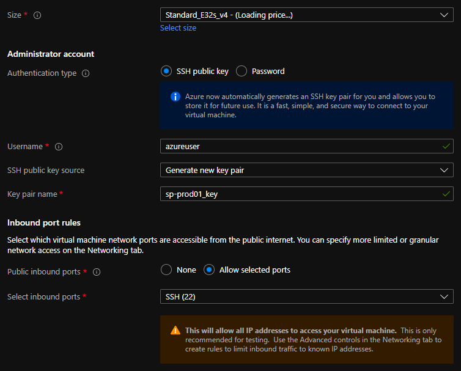
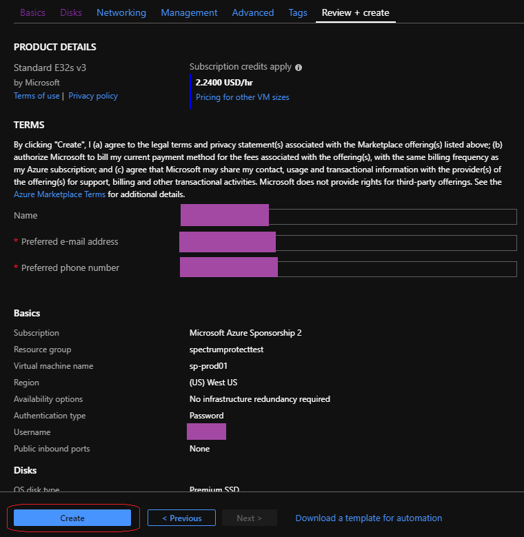

# IBM Storage Protect Blueprint for Azure

> Version 2.0  
>
> Author: *James Damgar* 
>    
> © Copyright International Business Machines Corporation 2013, 2022.</br>  US Government Users Restricted Rights – Use, duplication or disclosure restricted by GSA ADP Schedule Contract with IBM Corp.
> 
> This edition applies to Version 8.1.16 and later of the IBM Storage Protect server, and to all subsequent releases and modifications until otherwise indicated in new editions or technical newsletters.


## Table of Contents
* [1. Introduction](#1-introduction)
  * [1.1 Purpose](#11-purpose)
  * [1.2 Considerations for Disk-to-Cloud Tiering Versus Direct-to-Cloud Data Movement](#12-considerations-for-disk-to-cloud-tiering-versus-direct-to-cloud-data-movement)
    * [1.2.1 Cloud Accelerator Cache Considerations](#121-cloud-accelerator-cache-considerations)
    * [1.2.2 Workload Limitations and Considerations with Tiering](#122-workload-limitations-and-considerations-with-tiering)
  * [1.3 Cloud Deployment Patterns](#13-cloud-deployment-patterns)
  * [1.4 Cloud Environment Considerations](#14-cloud-environment-considerations)
    * [1.4.1 Importance of Adequate Sizing](#141-importance-of-adequate-sizing)
    * [1.4.2 Linux Logical Volume Manager (LVM)](#142-linux-logical-volume-manager-lvm)
  * [1.5 References to Physical IBM Storage Protect Blueprints](#15-references-to-physical-ibm-storage-protect-blueprints)
  * [1.6 Database Backup to Object Storage](#16-database-backup-to-object-storage)
    * [1.6.1 Tuning Database Backup Operations to Object Storage](#161-tuning-database-backup-operations-to-object-storage)
  * [1.7 Server Maintenance Scheduling Considerations](#17-server-maintenance-scheduling-considerations)
  * [1.8 Session Scalability by Blueprint Size](#18-session-scalability-by-blueprint-size)
  * [1.9 IBM Storage Protect Security Concepts and Guidelines](#19-ibm-storage-protect-security-concepts-and-guidelines)
    * [1.9.1 Identity Security in the IBM Storage Protect Environment](#191-identity-security-in-the-ibm-storage-protect-environment)
    * [1.9.2 IBM Storage Protect Administrative Security](#192-ibm-storage-protect-administrative-security)
    * [1.9.3 IBM Storage Protect Data Security and Policy Based Management](#193-ibm-storage-protect-data-security-and-policy-based-management)
    * [1.9.4 IBM Storage Protect Bit-Level Security](#194-ibm-storage-protect-bit-level-security)
  * [1.10 Optimizing Restore Performance from Cloud-Container Storage Pools](#110-optimizing-restore-performance-from-cloud-container-storage-pools)
    * [1.10.1 Enabling the Cloud-container Storage Pool Cloud Read Cache](#1101-enabling-the-cloud-container-storage-pool-cloud-read-cache)
    * [1.10.2 Increasing the Minimum Extent Size for Client Nodes](#1102-increasing-the-minimum-extent-size-for-client-nodes)
* 2. [Microsoft Azure Configurations](#2-microsoft-azure-configurations)
  * [2.1 Compute, Disk, and File System Setup Instructions for Linux-based Systems](#21-compute-disk-and-file-system-setup-instructions-for-linux-based-systems)
    * [2.1.1 Linux Operating System Packages and General Guidance](#211-linux-operating-system-packages-and-general-guidance)
    * [2.1.2 Microsoft Azure Specific Volume Group Adjustments](#212-microsoft-azure-specific-volume-group-adjustments)
    * [2.1.3 Large Blueprint Instructions](#213-large-blueprint-instructions)
      * [2.1.3.1 Disk Setup Instructions](#2131-disk-setup-instructions)
    * [2.1.4 Medium Blueprint Instructions](#214-medium-blueprint-instructions)
      * [2.1.4.1 Disk Setup Instructions](#2141-disk-setup-instructions)
    * [2.1.5 Small Blueprint Instructions](#215-small-blueprint-instructions)
      * [2.1.5.1 Disk Setup Instructions](#2151-disk-setup-instructions)
    * [2.1.6 Extra-Small Blueprint Instructions](#216-extra-small-blueprint-instructions)
      * [2.1.6.1 Disk Setup Instructions](#2161-disk-setup-instructions)
    * [2.1.7 IBM Storage Protect Format and Server Options](#217-ibm-storage-protect-format-and-server-options)
  * [2.2 Design Considerations for Microsoft Azure Instances](#22-design-considerations-for-microsoft-azure-instances)
    * [2.2.1 Considerations for Direct-to-Cloud Architectures](#221-considerations-for-direct-to-cloud-architectures)
    * [2.2.2 Sizing the Cloud Accelerator Cache](#222-sizing-the-cloud-accelerator-cache)
    * [2.2.3 Microsoft Azure: Large Instance Considerations](#223-microsoft-azure-large-instance-considerations)
    * [2.2.4 Microsoft Azure: Medium and Small Instance Considerations](#224-microsoft-azure-medium-and-small-instance-considerations)
* [3. Appendix](#3-appendix)
  * [3.1 Disk Benchmarking](#31-disk-benchmarking)
    * [3.1.1 Object Storage Benchmarking](#311-object-storage-benchmarking)
    * [3.1.2 Benchmarking Performance Goals](#312-benchmarking-performance-goals)
  * [3.2 Instance and Object Storage: Navigating the Microsoft Azure Portal](#32-instance-and-object-storage-navigating-the-microsoft-azure-portal)
* [4. References](#4-references)
* [5. Notices](#5-notices)
  * [5.1 Trademarks](#51-trademarks)

---
## 1. Introduction

### 1.1 Purpose

This document introduces possibilities for integrating an IBM Storage Protect server with **Microsoft Azure** infrastructure as a service (IaaS). You can use the configurations as starting points to deploy a large, medium, or small system (as defined in the [IBM Storage Protect Blueprints](https://www.ibm.com/support/pages/node/1146352)) or an extra-small system. With the goal of achieving a target daily ingestion rate (corresponding to a large, medium, small, or extra-small deployment), configuration possibilities are offered so that you can get a sense of the relative CPU, memory, disk, and network capabilities that are needed to satisfy requirements. In addition, a survey of options for fulfilling these needs is provided. Certain cloud instance and disk types offered by providers might be sufficient in some areas while lacking in others. You must recognize where system bottlenecks might arise that could limit IBM Storage Protect capability.

Use this paper as a **starting point for guidance** about where to deploy an instance of the IBM Storage Protect server within a Microsoft Azure dedicated or shared compute instance with the goal to eventually store the bulk of primary backup and archive data on cost-effective object storage. In the case of Microsoft, this means Azure Blob storage. This goal can be accomplished by configuring an IBM Storage Protect cloud-container storage pool with (block disk-based) accelerator cache. Two approaches are generally available for storing data in an IBM Storage Protect cloud-container storage pool: a direct-to-cloud approach or a disk-to-cloud tiering approach.

For **direct-to-cloud** architectures, backup data is ingested directly into a **cloud-container storage pool** with a performant accelerator cache disk location tuned for a system's ingestion workload as the initial "landing spot" (for more information, see [Sizing the Cloud Accelerator Cache](#222-sizing-the-cloud-accelerator-cache)). Data is then immediately, asynchronously transferred to object storage while further data is also ingested into the disk staging area (also known as *overlapped I/O*). The key consideration here is to determine the performancecharacteristics that the disk staging area must provide to allow for this mixed write-and-read behavior to ensure that ingestion targets are met. A *Cloud Cache and Object Storage Benchmarking* guide and "Cloud benchmarking tools" packages are provided along with this paper to assist in benchmarking both the cloud accelerator cache and object storage system from a prospective host server.

By contrast, **disk-to-cloud** tiering architectures make use of IBM Storage Protect **storage rules** to demote data from one or more (usually small) directory-container storage pools (a disk tier) to a cloud-container storage pool. Backup data is initially ingested into a directory-container storage pool and later a portion of this data is moved asynchronously to a cloud-container storage pool. The data can be moved with either age-based tiering (available as of IBM Storage Protect Version 8.1.3) or tiering by backup state (available as of IBM Storage Protect V8.1.6). With IBM Storage Protect V8.1.6, a combination of storage rules and storage subrules can be used to facilitate more granular tiering behavior between the disk and object storage tiers, allowing for flexibility and filtering, for example, by node and node file space. This paper provides some guidance to determine whether tiering is suitable for your workload demands and characteristics. (For an introduction to the tiering features that are available in IBM Storage Protect and for detailed guidance, see [Tiering data to cloud or tape storage](https://www.ibm.com/docs/en/storage-protect/8.1.23?topic=storage-tiering-data) in the online product documentation.)

With Microsoft Azure, solutions involving disk-to-cloud tiering can be cost prohibitive due to the higher cost of block storage disk, which might be required for the disk tier, in contrast to the relatively lower cost of Microsoft Azure Blob object storage. However, the requirements for restoring data might be such that having operational recovery data on a fast-performing disk tier is worth this additional cost. Further guidance is provided in the following section regarding considerations for using a direct-to-cloud or tiering approach. The architectures referenced within this paper use a direct-to-cloud approach but can be adjusted to conform to the requirements of a tiering architecture.

### 1.2 Considerations for Disk-to-Cloud Tiering Versus Direct-to-Cloud Data Movement

The primary advantage of the **tiering** model is that operational recovery data can be preserved on a localized, fast disk tier for rapid recovery while older copies of data or data intended for long-term retention can be demoted to object storage, which is typically more affordable. The tiering model can also be used as an alternative to the direct-to-cloud model with a relatively small disk tier footprint (not strictly for operational recovery purposes). When the TIERDELAY parameter is set to 0, age-based tiering can be used to tier each day's worth of ingested client data. In this case, potentially less expensive disk can be provisioned for use by the small directory-container storage pool tier because no ingestion and cloud transfer input/output (I/O) operations occur in parallel. Tiering can be run serially after the completion of data ingestion during scheduled windows with less or no contention for this disk; the disk area can be cleared in preparation for the next day's ingestion.

The same ingestion targets can be satisfied with the disk-to-cloud tiering model as with the direct-to-cloud model, assuming that the direct-to-cloud approach makes use of an accelerator cache and overlapped data ingestion.

**Restriction:** To implement cloud tiering, you must provision enough disk space to hold a

full day's worth of ingested data (plus some buffer) to avoid failed backup operations. The same underlying disk technology can be used in both cases. If, however, you plan to use disk-to-cloud tiering to hold one or more days' worth of operational recovery data within a directory-container storage pool disk tier, the instance disk capacity might have to be much greater, with the caveat that a slower-performing disk might be sufficient for this case. In all cases, you must understand the ingestion targets (after data deduplication andcompression) to determine a daily disk capacity for a transient disk case. Meanwhile, operational recovery requirements in terms of the number of days' worth of recovery data (after data deduplication and compression) should be determined to further size adirectory-container storage pool with tiering to cloud if necessary.

With the **direct-to-cloud** model, you can minimize local block storage capacity. This is an advantage because local block storage can be cost prohibitive in cloud-hostedenvironments.

**Note** that pursuing a tiering model with Microsoft Azure virtual instances may be cost prohibitive in terms of the amount of EBS block storage disk required for a directory-container storage pool "disk tier". As such, only direct-to-cloud model options are presented within this paper.

#### 1.2.1 Cloud Accelerator Cache Considerations

Beginning with IBM Storage Protect V8.1.2, data ingestion from clients is throttled if the accelerator cache area is near capacity. This feature makes it possible for this disk cache location to be **underprovisioned** from a capacity standpoint in that the disk cache location does not have to be sized large enough to hold a full day's worth of deduplicated and compressed data. However, the accelerator disk still must be performant enough in terms of input/output operations per second (IOPS) so that client data ingestion and replication target activity can be completed in a timely manner. In the end, you have to compare costs to determine whether larger capacity, less-expensive disk with tiering has an advantage over a direct-to-cloud cache model for a given environment, ingestion rate, and recovery objective.

**Restriction:** If you plan to use the direct-to-cloud ingestion model, the cloud accelerator cache should be sized large enough to hold at least two times the largest front-end object being ingested. For example, if a 512 GB object is to be ingested directly into a cloud-container storage pool, the cloud accelerator cache should be at least 1 TB in size.

Similarly, if 5 client sessions will be backing up 100 GB files each at the same time, the cloud accelerator cache should be sized to at least 1000 GB (5 clients x 100 GB files x 2).

This is because the IBM Storage Protect server will attempt to "reserve" space in the cloud accelerator cache for in-flight ingestion until ingestion is completed for those objects and their database transactions are committed to the server. By default, this processing assumes no savings from data deduplication or compression and attempts to reserve the total front-end amount of data to ensure sufficient storage capacity.

Beginning with IBM Storage Protect V8.1.6, a server option can be used to influence this behavior. The undocumented server option `PreallocReductionRate` can be used to give the server a "hint" about the expected reduction ratio for ingested data and cause the server to reserve less physical space in the directory-container storage pool. For example, setting this option to 5 will cause the server to assume a 5:1 data reduction rate for front-end to back-end data so that only 1 unit of back-end space will be reserved for 5 units of front-end protected data. This option can range from 1 (the default, no reduction) to 25 (a 25:1 assumed reduction). Use this option only when a smaller cloud accelerator cache is desired and data reduction rates are certain. If the storage pool has inadequate space, backup failures can occur.

Beginning with IBM Storage Protect V8.1.10, the undocumented server option`UsePreallocReduction` was introduced to enable automatic preallocation reduction in V8.1.10 and later servers. By default, this option is disabled. If set to YES, the IBM Storage Protect server automatically determines an accurate data reduction rate based on existing storage pool statistics and applies this reduction when preallocating space within storage pool directories (or the cloud accelerator cache in the case of a cloud-container storage pool). Use this option only when a smaller cloud accelerator cache is configured and data reduction rates are consistent between backup operations. If the storage pool has inadequate space, backup operations might fail. Also beginning with IBM Storage Protect V8.1.10, the undocumented server option`PreallocReductionPadding` can be used to add "padding" to the preallocated space. Specify this option as a percentage. The default value is 5. The following example illustrates this feature. For example, assume that the `UsePreallocReduction` option is enabled, the `PreallocReductionPadding` value is set to 5, and storage pool statistics show a 4:1 data reduction with deduplication and compression (75%). When a 100 MB object is ingested, the IBM Storage Protect server will attempt to allocate space in the cloud accelerator cache based on the following formula:

((100% - 75%) + 5%) x 100 MB = 30 MB

Use the `PreallocReductionPadding` option in combination with the `UsePreallocReduction` option if data reduction rates are inconsistent between backups and an accurate padding value can be determined.

The `PreallocReductionRate` option takes precedence over the `UsePreallocReduction` option.

#### 1.2.2 Workload Limitations and Considerations with Tiering

Not all client workloads are suitable for a disk-to-cloud tiering model. Tiering by age (as of IBM Storage Protect V8.1.3) allows for the demotion of *backup* objects that have reached the specified age threshold. Inactive backup generations that are older than the specified age are transitioned to object storage. Tiering by state (as of IBM Storage Protect V8.1.6) allows for the demotion of backup objects that have reached the specified age threshold and are *inactive* within the server. Active backup objects are preserved on the disk tier, while inactive copies of backup objects are transitioned to object storage.

Disk-to-cloud tiering is **suitable** for client workloads that have **low** data deduplication rates (backup generations differ greatly). In this case, data is highly unique between backup operations. When a backup generation is tiered to object storage, the deduplicated extents (chunks) that make up that object have their references decremented on the source directory-container storage pool. In this case, reference counts are likely to be low and more deduplicated extents are likely to be removed from the disk tier as objects are tiered and space is released.

Disk-to-cloud tiering **might not be suitable** for client workloads that have a **high** data deduplication rate. In this case, data is not very unique between backup generations and many shared deduplicated extents are referenced by multiple object generations. Even though an object can be tiered by a storage tiering rule, because the object shares many extents with other objects (which might still be active), a large proportion of the object's data will not be removed from the disk tier (although it will be copied to the object storage tier).

The following figures illustrate how data movement with disk-to-cloud tiering can occur. `Figure 1` depicts a scenario in which multiple versions of three backup objects (A, B, and C) have been ingested and are stored in a directory-container storage pool on disk. Dotted lines represent references to deduplicated extents (colored, numbered boxes). With the tier-by-state option, the inactive object copies (shown in the gray rectangle) would be tiered to a cloud-container storage pool.


*Figure 1: Disk-to-cloud tiering, before and after*

`Figure 2` depicts the situation after tiering is completed and the REUSEDELAY parameter value of the source directory-container storage pool is exceeded (so that deduplicated extent removal for extents with zero reference count can occur).


*Figure 2: Disk-to-cloud tiering, after tiering*

Notice that deduplicated extents 1 and 2 remain on disk even after tiering and extent cleanup have occurred. This is due to the fact that those extents are shared between the active and inactive backup copies. If many deduplicated extents are shared by objects (a high duplicate data rate with high data deduplication ratios), it is more likely that data will remain on disk, even after backup objects have been tiered at an IBM Storage Protect inventory level. Keep this factor in mind when you consider a disk-to-cloud tiering model and when you size an environment.

For workloads that deduplicate well from day to day, there will be many shared extents across backup and archive generations and a smaller capacity footprint on tiered object storage as a result because these backup and archive generations will also share many extents in the cloud-container storage pool. For workloads that deduplicate poorly day to day (highly unique data change each day), there will be few shared extents across backup and archive generations and potentially a larger capacity footprint on tiered object storage because these backup and archive generations will each point to (more) unique data in the cloud-container storage pool.

If the primary motivation for using disk-to-cloud tiering is rapid recovery of operational data, a tiering model might provide the best approach. You must understand the nature of the client workload to accurately size the directory-container storage pool on disk.

### 1.3 Cloud Deployment Patterns

The described configurations can be used as starting points in situations where the IBM Storage Protect cloud instance will be a **primary server and in situations where it is used as a replication target**. In scenarios where the cloud-based instance is a replication target, adequate "public" network capability might be necessary to satisfy replication throughput requirements. Microsoft Azure ExpressRoute can be used to establish a dedicated link ranging from 50 Mbps to 10 Gbps from an on-premises data center to Microsoft Azure private and public resources to facilitate efficient IBM Storage Protect replication or backup processing from peer servers or clients outside of the Microsoft Azure infrastructure.

Generally, IBM Storage Protect deployments making use of cloud-based object storage will align with one of the following three patterns:


*Figure 3: Deployment patterns*

In the figure, the first deployment pattern could involve an IBM Storage Protect server that is installed on premises or on a Microsoft Azure system, with primary backup and archive data landing in object storage immediately. The positioning of the IBM Storage Protect server in relationship to clients could be one critical decision point when you consider whether to have a server instance on premises or within Microsoft Azure. This pattern could involve use of a direct-to-cloud architecture with accelerator cache or a small directory-container storage pool with immediate tiering to a second cloud-container storage pool without accelerator cache.

The second deployment pattern would make use of cloud-based Azure Blob object storage at the secondary disaster recovery (DR) site. This DR server could be installed at an on-premises site or on a Microsoft Azure system. In the latter case, sufficient wide area network (WAN) bandwidth between the primary and secondary sites is required for acceptable performance. Much like the first deployment pattern, here the IBM Storage Protect server at the DR site could make use of a direct-to-cloud topology with a cloud-container storage pool featuring accelerator cache, or it could use a small directory-container storage pool landing spot with immediate tiering to a cloud-container storage pool backed by object storage.

The third deployment pattern features specific use of disk-to-cloud tiering, available with IBM Storage Protect V8.1.3 and later, to allow for operational recovery data to reside on faster performing disk storage. Data that is older, archived, or both would be tiered to Microsoft Azure Blob object storage after a specified number of days. This deployment could also be performed at an on-premises site or within a Microsoft Azure instance. However, the additional cost of having a larger capacity directory-container storage pool should be factored into cost estimates with an in-the-cloud solution.

A **combination** of approaches is also possible within the same deployment. For example, a cloud-container storage pool could be configured with accelerator cache disk and made to store long-term retention or compliance archives. A directory-container storage pool could be configured as a disk tier for normal backups, and a tiering relationship could be set up so that operational recovery data (for example, backups from the previous 7 days) is kept on this disk tier, while older data is demoted to the same cloud-container storage pool. The same cloud-container storage pool can be a direct backup target and a tiering target.

However, if the pool is a direct target of a backup-archive client, the pool must be configured with accelerator cache disk.

### 1.4 Cloud Environment Considerations

For Microsoft Azure, you can choose one of multiple potentially suitable instance types to satisfy an IBM Storage Protect server requirement. You do not have complete flexibility in terms of the type and proportion of CPU and memory resources available for an instance. However, standard instance types are available, which can roughly match recommended server requirements. Take care to select instances that have the required **CPU and memory** resources to support inline server data deduplication, compression, encryption, and cloud API operations. The instances also must have the associated Microsoft Azure Virtual Machine Disks and network (Ethernet) capability to support the desired workload.

With Microsoft Azure instances, the possibility exists for you to alter the instance type later, when resource requirements might be clearer. The process is fairly straightforward via the Microsoft Azure web portal for most instance types. However, there are some caveats to keep in mind. For more information, see Microsoft's documentation in [References](#4-references)\[3\].

#### 1.4.1 Importance of Adequate Sizing

Ingested backup data reaching the cloud accelerator cache or the initial directory-container storage pool tier requires the use of block storage allocated to the Microsoft Azure cloud server. IBM Storage Protect database activity also uses some level of throughput and elevated I/O operations during workload processing. Therefore, disk **I/O capability** and instance-to-disk throughput considerations must be evaluated when choosing and configuring an in-the-cloud IBM Storage Protect instance with Microsoft Azure. With a final ingestion point on Azure Blob storage via a cloud-container storage pool, the **Ethernet capability** of the instance and the nature of the network between the instance and the Azure Blob storage endpoint (in addition to an understanding of how a front-end client data workload deduplicates and compresses into a back-end stored quantity) should be kept in mind.

Certain Microsoft instances might or might not have access to dedicated bandwidth to attached disks (Microsoft managed disks). A lack of access can create a bottleneck in the database operations of the IBM Storage Protect server. Certain instances might have limited throughput over Ethernet, and this limitation could hamper ingestion and restore throughput with object storage. During the planning phase, consider how the ingested data will be **reduced via data deduplication and compression** in the back-end storage location. These factors will help you estimate how much back-end data must be moved within a certain time window (measured in hours) and can help predict the throughput (megabytes per second or terabytes per hour) that the Ethernet network and object storage endpoint require to satisfy ingestion requirements. Generally, **10 Gbps** Ethernet capability to private Microsoft Azure Blob storage endpoints is required for large, medium, or small Blueprint ingestion targets, while 1 Gbps is sufficient for extra-small targets.

Beginning with IBM Storage Protect V8.1.3, the server automatically throttles client backup operations if the cloud accelerator cache portion of a cloud-container storage pool is nearing full capacity. As a result, it is not mandatory to configure cloud accelerator disk cache space that would be large enough to hold a full day's worth of backups (after data deduplication and compression). However, disk benchmarks should be run to ensure that the anticipated back-end workload that an IBM Storage Protect server is expected to support will not result in this disk location being the primary bottleneck of the system (see [Disk Benchmarking](#31-disk-benchmarking)). In practice, any planned deployment should be validated to ensure that it will meet performance requirements.

#### 1.4.2 Linux Logical Volume Manager (LVM)

The described reference architectures use the Red Hat Enterprise Linux (RHEL) operating system. For a lower-cost alternative, a supported version of the Ubuntu Linux operating system may be used. To deploy IBM Storage Protect on a Linux based operating system, the preferred method is to use the **Linux Logical Volume Manager (LVM)** for the cloud accelerator cache disk and, optionally, the IBM Storage Protect database archive log disk (when more than one physical disk is utilized). The remaining IBM Storage Protect disk components can be satisfied with file systems formatted on directly mounted Microsoft Azure block disks. The overlapped I/O pattern experienced with concurrent backup ingestion activity and transfer of data to object storage can lead to "hot spots" on disk when more than one storage pool directory is defined for a cloud-container storage pool as accelerator cache. To help avoid a throughput bottleneck, you can configure a single logical volume to span all physical volumes assigned for use as cloud accelerator cache.

Furthermore, the preferred method is to use a stripe size of **256 KiBytes** for the single logical volume and ensure that the number of stripes matches the number of physical disks. For guidance about specific commands to use when setting up Linux based instances, see the **Compute, Disk, and File System Setup Instructions for Linux-based Systems** section of this document. The use of Linux LVM to logically stripe across several Microsoft Azure block disks should not be depended upon to increase the durability of the underlying storage, as Microsoft Azure block disks are already redundant within one or more datacenters and so do not benefit from the recovery characteristics of LVM striping or RAID.

### 1.5 References to Physical IBM Storage Protect Blueprints

Throughout this paper, the server specifications in the *IBM Storage Protect Blueprint and Server Automated Configuration for Linux x86* document (also known as an IBM Storage Protect Blueprint) are referenced as targets for CPU and memory configurations matching small, medium, and large server builds. For more information about the Blueprints, see [References](#4-references)\[1\]. The intention with the server builds outlined here is to provide systems capable enough from a CPU, memory, disk, and Ethernet point of view to approach Blueprint-level ingest capability. Although different instance types can be used to satisfy the same requirements, the disk specifications in particular should be noted in this document as guidance for those deploying environments of their own.

As a reference, the following table indicates the throughput, capacity, CPU, and memory targets for each of the referenced Blueprints. The values for total managed data and daily ingested data are for the block storage Blueprints. These ingestion targets assume an 8-hour backup window.

*Table 1: IBM Storage Protect physical Blueprint targets (, Linux x86)*
| Sizing category | CPU       | RAM memory | Total managed data (front end) | Daily ingested data (front end) |
|-----------------|-----------|------------|--------------------------------|---------------------------------|
| Small           | 16 cores  | 64 GB      | 60 TB – 240 TB                 | Up to 10 TB per day             |
| Medium          | 20 cores  | 128 GB     | 360 TB – 1440 TB               | 10 – 30 TB per day              |
| Large           | 44 cores  | 384 GB     | 1000 TB – 4000 TB              | 20 – 100 TB per day             |

Although not defined explicitly in the physical Blueprints, the extra-small cloud Blueprint systems target up to 10 TB or more of total managed (front-end) data with a daily ingestion rate of up to 1 TB, or more, per day.

### 1.6 Database Backup to Object Storage

Beginning with IBM Storage Protect V8.1.10, you can back up the server database to object storage for disaster recovery purposes. The configurations in this document are based on the assumption that the server database is backed up to object storage. An alternative approach for cloud-hosted servers is to use the FILE device class and run backup operations to provisioned disk storage. Previous versions of the Cloud Blueprints included FILE device class configurations that offered approximately two days' worth of full database backups in the worst case (with the Db2 database consuming close to its maximum resident capacity). However, this approach can be cost-prohibitive in some cloud-hosted environments such as Microsoft Azure, where disk storage is typically more expensive than object storage. For example, with a large Blueprint cloud system, an approximate monthly savings of 40-50% can be achieved when using 16 TB of Standard, Hot access tier, LRS Blob (object) storage for database backup purposes compared to statically provisioning 16 TB of Standard class block disk storage.

Another advantage of using Blob object storage for IBM Storage Protect database backups is that Blob object storage pricing with Microsoft Azure is based on the amount of used storage, while disk storage pricing is based on the amount of storage space provisioned, even if a portion is unused. Not only is unused provisioned disk space a deterrent to cost savings, the actual rate charged for this space is much more than object storage considering that the data involved (database backups) is archive-like in nature.

Static provisioning of disk storage is no longer required and the amount of storage consumed for database backup can better match the requirements of the environment. By taking advantage of this pricing model, you can enjoy greater freedom in choosing and changing retention policies for database backups to achieve the required recovery window.

For example, you can transition from 2 days' worth of full database backups to 7 days without having to re-provision and configure disk storage.

A further benefit of database backup operations to Blob object storage is that increased data redundancy, availability, and durability can be achieved by using a Blob object storage account with different data redundancy settings. Locally redundant storage (LRS) is the most cost-efficient option, where data is copied synchronously three times within a single physical location in the primary Microsoft Azure region. Zone-redundant storage (ZRS) copies data across three availability zones (data centers) in the primary region synchronously with each write operation and can be used to protect against the outage of a single availability zone. Greater availability and durability can be achieved by using Geo-redundant storage (GRS) or Geo-zone-redundant storage (GZRS) to replicate data from the primary Microsoft Azure region to a secondary region. Both of these options copy data to a single physical location in the secondary region (as with LRS), but differ in how they copy data in the primary region. As with LRS, GRS makes three copies in a single physical location at the primary region while GZRS, as with ZRS, copies data to three availability zones in the primary region. In the case of GRS and GZRS, data is copied to the additional Microsoft Azure region asynchronously with a recovery point objective (RPO) ofapproximately 15 minutes or less (although with no guaranteed service level agreement, SLA).

You can use the same Microsoft Azure Blog object storage account for database backups and the cloud-container storage pool of the IBM Storage Protect server to ensure matching redundancy, availability, and durability attributes for database metadata and storage pool data. In the case of an outage of an availability zone within a Microsoft Azure region, an IBM Storage Protect server instance can be recovered via a database restore operation and by using the cloud-container storage pool resident data that is accessed by a different Microsoft Azure server instance located within the same region. For more information about Microsoft Azure redundancy options, see [References](#4-references)\[8\]. For detailed guidance about setting up database backup operations to object storage, see [References](#4-references)\[4\].

#### 1.6.1 Tuning Database Backup Operations to Object Storage

When a CLOUD device class is used for IBM Storage Protect database backup operations, the following files are copied to Blob object storage:
* Database volumes
* The device configuration file
* The volume history file
* The master encryption key for the server

Large items, such as database volumes, are copied to object storage by using multipart upload. By specifying multiple, concurrent data streams during database backup, you can reduce the time that is required to back up the database. The number of data streams that are used for the database backup operation is the same as the number of data streams that are required for any subsequent database restore operation. The number of data streams affects throughput. Each database backup operation uses the following separate resources:

* A session connection from Db2 to the IBM Storage Protect server
* A server thread that sends data from the server to object storage

Several performance factors affect operations for backing up the server database to object storage, for example:
* Database disk performance (256 - 512 KB sequential input/output operations)
* Object storage system performance
* Network performance to the object storage system

When using database backup to Microsoft Azure Blob object storage with the systems presented here, consider the maximum network throughput that is required to complete database backup operations on schedule to meet service level commitments. A common expectation is that a daily full backup of the IBM Storage Protect server database can be completed in 2 - 3 hours (or less). A 1 Gbit Ethernet link provides approximately 100 MB/s of throughput while a 10 Gbit Ethernet link provides roughly 1000 MB/s of throughput. A full backup of an 8 TB database (at the larger end of a large Blueprint system) would take more than 20 hours on a 1 Gbit connection and approximately 2 - 3 hours on a 10 Gbit connection. These estimates assume that these network links are hardly utilized otherwise.

The relative load on these networks should be considered when scheduling database backup operations and when selecting which network links to provision and configure for cloud compute instances. The health of the network link should also be evaluated. TCP/IP packet loss of as little as 2% can cause a large degradation in throughput for database backup and restore operations from object storage, jeopardizing the daily database backup.

Db2 database encryption is used by default for database backup operations to cloud device classes to provide additional data security for database data. You can specify encryption or compression for a database backup operation to cloud, but not both. If you specify compression for a database backup operation to cloud, encryption is disabled.

Compression impacts backup performance and limits front-end throughput toapproximately 0.5 TB per hour, or less, and so is not typically suitable for larger server environments unless a longer database backup window can be tolerated. Compression can, however, result in a smaller data footprint in Blob object storage and slightly improve database restore performance. For smaller IBM Storage Protect servers with smaller databases (such as the extra-small and small configurations shown here) use compression when the following conditions are met:
* The network link to object storage is 1 Gbit or less.
* Database encryption is not necessary.
* Compression savings are required.

Depending on the IBM Storage Protect server size, use the following stream quantities as starting points for optimal performance for database backup operations for extra-small, small, medium, and large Blueprint systems:
* Extra-small system: &emsp; 1-5 streams
* Small system: &emsp; 10 streams
* Medium system: &emsp; 25 streams
* Large system: &emsp; 50 streams

Then, adjust the number of data streams until you achieve optimal throughput on a consistent basis over time. Each data stream uses approximately 20 MB of memory on the IBM Storage Protect server. For example, a 50-stream database backup operation consumes approximately 1000 MB of memory on the server.

A beneficial step when building a cloud-based IBM Storage Protect server is tobenchmark the components involved in the solution to prove that the resources available to the server are sufficient to meet performance demands. For database backup operations to Microsoft Azure Blob object storage, this means benchmarking the sequential read throughput of the IBM Storage Protect database disks and benchmarking the throughput capability of the link to Blob object storage from the server instance. By ensuring that these components perform adequately, you can achieve a higher level of confidence that database backup (and restore) operations will perform as expected within the allotted time. For instructions about how to benchmark performance and interpret the results, see [References](#4-references)\[5\].

### 1.7 Server Maintenance Scheduling Considerations

The *IBM Storage Protect Blueprint and Server Automated Configuration for Linux x86* document provides a detailed breakdown of the procedure for setting up IBM Storage Protect server maintenance schedules (see [References](#4-references)\[1\], Chapter 5). Use this information as a reference for establishing a maintenance schedule on cloud-hosted servers.

For an IBM Storage Protect server in Microsoft Azure that is serving as a replication target, a replication window and schedule might have to be established. For servers using the direct-to-cloud model, where primary backup data is ingested directly into a cloud-container storage pool, a replication window might not be required if this server is not a replication target server because a cloud-container storage pool cannot be used as a replication source. In this case, redundancy requirements for the ingested client data can be met by the inherit redundancy of Microsoft Azure Blob object storage.

For an IBM Storage Protect server running in Microsoft Azure that is using the disk-to-cloud tiering model, a replication source strategy might be required. Replication can help to protect client data objects in the disk directory-container storage pool that have not yet been tiered (demoted) to object storage because only one copy of that data is present. To prevent excess data from being stored (pinned) to the disk tier, verify the following items:
* The source replication server (used for disk-to-cloud tiering) should be configured with a longer retention policy than the target replication server. In other words, data should be retained for a longer period on the source replication server.
* The retention policy that affects client node data on the target replication server should match the value of the TIERDELAY parameter of the storage rule that is responsible for tiering the same client node data on the source server.

In general, the server that is used for disk-to-cloud tiering (whether it be the source replication server or the target replication server) should be the server with the longer retention policy for the client nodes that are affected by the tiering storage rule.

### 1.8 Session Scalability by Blueprint Size

The **IBM Storage Protect Blueprint and Server Automated Configuration for Linux x86** document describes how to set the IBM Storage Protect server optionMAXSESSIONS, based on Blueprint system size:
- Small system: 250 maximum simultaneous client sessions
- Medium system: 500 maximum simultaneous client sessions
- Large system: 1000 maximum simultaneous client sessions

(For more information about the Blueprint configurations, see [References](#4-references)\[1\].)

The actual throughput scalability of a cloud-based solution depends on many factors, including the configured disk capability and capacity of the system, the amount of CPU and memory resources available on the system, and the relative rate of data deduplication and compression for the dataset that is ingested into the server. Larger objects, which feature a larger deduplicated extent size (for example, 250 - 350 KiBytes, or more) and which do not deduplicate or compress well (for example, less than 10%), will result in less database and computation (CPU) overhead, but will utilize more disk and network bandwidth. The logical reduction of front-end client data to the physical back-end data (which is actually written out and stored to disk and object storage) means that the disk, network, and object storage components will be stressed to a higher degree as client/server session counts increase. Memory usage by the IBM Storage Protect server might also be greater. As session counts increase, these components are likely to become a system bottleneck, limiting front-end throughput.

Objects that feature smaller, deduplicated extent sizes (for example, 60 - 100 KiBytes or similar) and that deduplicate and compress well (for example, 50% data deduplication with 50% compressibility) will result in less network, disk, and object storage bandwidth used, but will lead to more database and computation overhead to facilitate these data reduction operations. As session counts increase, CPU and database-related memory are likely to first become limiting factors for these data types. In general, the more successfully data can be deduplicated and compressed (and therefore the greater the data reduction from front-end to back-end data), the greater the number of feasible client sessions. The following table indicates a reasonable range of client session counts based on system size and data type, as well as the likely limiting factor for the system as the high end of the range is approached.

*Table 2: Preferred ranges of maximum values for client session counts*
| Cloud system size | Large object, poor data deduplication and compression ** | Large object, good data deduplication and compression *** | Large object, small extent size, good data deduplication and compression **** | Small object, poor data deduplication and compression ***** |
|----------------|-------------|-------------|-------------|-------------|
| Extra small    |   10 -- 50  |   25 -- 50  |   10 -- 50  |   10 -- 50  |
| Small          |   50 - 100  |   100 - 200 |   50 - 100  |   50 - 100  |
| Medium         |   100 - 200 |   200 - 400 |   100 - 150 |   100 - 150 |
| Large          |   300 - 400 |   400 - 500 |   150 - 200 |   150 - 200 |
| Limiting factor at scale |   Network, disk, object storage bandwidth, memory, |CPU, memory or network, disk, object storage bandwidth | CPU, memory |   CPU, memory |

** This model uses 128 MiByte objects, 250 - 350 KiByte extents, and \<10% data deduplication and compressibility. Full backup operations are used with pseudo random data or data that cannot be easily deduplicated or compressed. For example, this model can be applied to encrypted data. </br>
*** This model uses 128 MiByte objects, 150 - 200 KiByte extents, and 50% data deduplication and compressibility. For example, this model can be applied to virtual machine backups. </br>
**** This model uses 1 GiByte objects, 60 - 100 KiByte extents, and 50% data deduplication and compressibility. For example, this model can be applied to database image backups. </br>
***** This model uses 128 KiByte objects and \<10% data deduplication and compressibility. For example, this model can be applied to file server data and other small files or objects.

Often, a diminishing rate of return in regard to throughput is experienced when 50 - 100 total client sessions are exceeded, regardless of data type. More sessions are possible and might be warranted, given the client schedule or other requirements. However, aggregate gains in total throughput of a single IBM Storage Protect instance might not be substantial past this point.

### 1.9 IBM Storage Protect Security Concepts and Guidelines

We live in an increasingly hostile environment in terms of data protection and security. Internal and external malicious actors target organizations and institutions for political or social reasons. Many seek financial gain through the use of *ransomware*, a type of malware that encrypts client production data or backup data for the purpose of obtaining a payment (ransom) to decrypt that data. Often, ransomware attacks include the following operations:
1. Infiltrate the environment
2. Obfuscate data by using encryption
3. Export the data as an additional blackmail tactic

Beyond ransomware, other forms of malware and computer viruses can disrupt production workloads and lead to business downtime. Organizations must develop and understand their security posture to combat these and other evolving threats. IBM Storage Protect supports a layered approach to addressing security concerns within a data protection environment. Primarily, this approach is based on secure communication protocols, secure user passwords, and different access levels for IBM Storage Protect administrators. Through the use of policy-based management, IBM Storage Protect administrators can ensure that a sufficient number of data versions are available to support \"freedom of action\" for recovering data at different points in time within the environment. IBM Storage Protect also provides for bit-level security, anomaly detection, and audit mechanisms to help secure an environment.

For an overview and primer about securing an IBM Storage Protect environment, see [References](#4-references)\[35\] and \[36\].

Overall, a layered approach to data security and protection should be pursued with IBM Storage Protect in both on-premises and in-the-cloud deployments. The layered approach is based on the following guidelines:
* The set of people with physical and virtual access to administrative functions with the data protection environment should be limited and evaluated regularly.
* The set of administrators should be limited and access restricted based on business function and a need-to-know basis.
* Data deletion authority should be limited and deletion-prevention controls should be implemented, including the IBM Storage Protect command approval feature.
* Redundant copies of data should be made, if possible.
* Protected data should be verified for integrity.
* Recovery procedures should be validated through regular audits and by testing restore operations and disaster recovery (DR) procedures. The goal is to ensure that recovery time objective (RTO) and recovery point objective (RPO) targets can be achieved.


*Figure 4: Layered security*

#### 1.9.1 Identity Security in the IBM Storage Protect Environment

IBM Storage Protect uses a novel *verb protocol* communication mechanism for client-to-server and server-to-server communication. This verb protocol is an API protocol in which each side of the communication channel initiates requests or replies with responses that drive behavior within the IBM Storage Protect client or server. When first establishing

communication between two endpoints, the client and server or two servers authenticate with one another. With recent versions of IBM Storage Protect, Transport Layer Security (TLS) over TCP/IP is used by default as a security protocol for communication. IBM Storage Protect offers industry-standard local credential management with passwords that are encrypted at rest and decrypted at user sign-on and authentication. During the verb protocol sign-on procedure, TLS is used for authentication (certificate andauthentication exchange).

IBM Storage Protect client node and administrator password security can be further enhanced by using Lightweight Directory Access Protocol (LDAP) to apply stricterrequirements for passwords. This approach includes the integration of Microsoft Active Directory. With LDAP, the server receives credentials from the client over TLS, and the server "binds" to the LDAP directory service or completes an operation that is equivalent to a bind. For instructions about integrating IBM Storage Protect with LDAP, see[References](#4-references)\[37\].


*Figure 5: Credential security*

The preferred method of identity security is to maintain at least one local administrator account that does not depend on LDAP or Active Directory in case the system that hosts LDAP or Active Directory is compromised by ransomware or other malware or is otherwise unavailable.

IBM Storage Protect TLS certificates can be self-signed or certificate authority (CA) signed. By default, the server generates a unique self-signed certificate during server formatting (initialization). Alternatively, a trusted CA-signed certificate provided by an organization can be installed for use by the server. For instructions about installing a trusted CA-signed certificate on the server, see [References](#4-references)\[38\].

#### 1.9.2 IBM Storage Protect Administrative Security

IBM Storage Protect offers different authority classes for administrators. The classes restrict or enable capability within the product. Administrative network traffic can also be directed over a server TCP/IP port that is separate from data traffic. In this way, a networking team can monitor different types of traffic with different tools or with different levels of granularity. IBM Storage Protect offers an "audit trail\" in terms of activity log entries stored in the server\'s database for each operation that an administrator performs. The IBM Storage Protect Operations Center can be used to specify certain audit-able messages as triggering \"alerts\" that can be configured to notify specific users via email.

\"Command approval\" is a mechanism that can be enabled within the server to ensure that an additional, second administrator must approve any potentially destructive server command, including data policy changes which might affect data retention. This helps to ensure a \"four eyes\" approach so that a single malicious, careless, or uninformed administrator cannot cause damage within an environment. For information setting up administrator command approval, see [References](#4-references)\[39\].

#### 1.9.3 IBM Storage Protect Data Security and Policy Based Management

Client data versioning and retention represent a critical aspect to a data security posture. IBM Storage Protect tracks every version of a backed-up file separately in its inventory. The files are not altered after they are stored. Rather, each version is treated as a separate object in the server\'s metadata catalog. IBM Storage Protect uses *policies* to control how the server stores and manages data objects through the hierarchy of policy domains, policy sets, management classes, and copy groups. You can specify IBM Storage Protect policy settings so that many versions of your client data are protected for a longer period. In this way, you grant yourself more \"freedom of action\" in terms of having more backup versions, originating from a longer period of time, to provide a wider selection of backup versions for recovery. Even if a security event or malware infiltration is not caught promptly, having several versions of data stored within IBM Storage Protect (for example, 30, 45, or 60 days of data versions) helps to ensure recovery flexibility. Policy settings of interest include the VEREXISTS (versions existing), VERDELETED (versions deleted), RETEXTRA (retained extra), and RETONLY (retained only) settings.

To learn more about IBM Storage Protect policy-based data management, see [References](#4-references)\[40\].

To further enhance data security, consider configuring single or multi-target IBM Storage Protect replication, where the operating systems of each IBM Storage Protect server differ. For example, the Microsoft Windows operating system is often an attack vector for malware. By using a different operating system platform for each of two IBM Storage Protect servers in a replication pair relationship, you might help to protect the system against malware that is designed to target one platform. Increasing the number of \"attack vectors\" in this way can build another barrier against malicious actors.

IBM Storage Protect can be configured with different retention policy settings at different ends of a replication relationship. For example, the source replication server can store data to local disk storage with a directory-container storage pool while the target replication server can store data to a cloud-container storage pool in the cloud. With more cost-effective object storage on the target, a longer retention period can be configured to protect more versions of client data for a longer time. Alternatively, IBM Storage Protect *tiering storage rules* can be used with a directory-container storage pool at the target site to tier older or inactive versions of data from disk to object storage for cost-effectiveness. In this case, a longer policy data retention period should be configured at the site from which data is tiered. In both cases, having more versions of data available helps to increase the \"freedom of action\" within the data protection system.

IBM Storage Protect clients can restore data from either end of a replication pair. For more information about setting up replication, see [References](#4-references)\[41\].

#### 1.9.4 IBM Storage Protect Bit-Level Security

IBM Storage Protect provides data stream security in various ways. During data transfer, a data stream can be encrypted by using Transport Layer Security (TLS). The TLS protocol performs data content digest and validation functions during transfer and provides for implicit tamper protection. TCP/IP packets are rejected if they appear to be tampered with. During security negotiation, the server prioritizes TLS 1.3 ciphers. Many cipher suites are supported.

The IBM Storage Protect Operations Center makes use of an anomaly detection mechanism that detects unexpected changes in client backups. For example, if data is successfully deduplicated for a workload, but then the data reduction rate dropssignificantly (to near 0%), this change could indicate that ransomware has encrypted the data. In general, an IBM Storage Protect administrator should pay attention to client deduplication and data reduction rates over time. Most client workloads make use of *incremental forever* backup operations. During an incremental backup operation, only new or changed data is backed up. If ransomware encrypts client data, the next incremental backup could be much larger than normal, indicating a possible problem.

IBM Storage Protect encrypts data at rest by using Galois/Counter Mode (GCM) signing and AES-256 encryption. These security mechanisms are applied to both directory-container and cloud-container storage pools. Each unique data extent that is identified by the data deduplication algorithm is encrypted separately by using distinct encryption keys after the extent is optionally compressed by using LZ4 compression.

**Tip:** A *data extent* is the part of a file that is created during data deduplication. Extents are compared with other file extents to identify duplicates.

These data extents are then further encrypted by using a server-level *master encryption key* that is protected as part of the IBM Storage Protect database backup process.

The validity of client objects is ensured in multiple ways. Each deduplicated extent has a Secure Hash Algorithm (SHA-1) value that is computed and stored in the server database. The value is used during data validation. An end-to-end object-level hash is also computed by using the xxHash (formerly MD5) hashing algorithm to ensure object-level integrity.


*Figure 6: Container pool security*

IBM Storage Protect offers explicit audit capabilities that can be enabled by using the `AUDIT CONTAINER` command for directory and cloud-container storage pools. This command can be run ad hoc or be scheduled to run regularly by using storage rules. The audit can help to detect tampering or *bit rot*, which is the slow deterioration of data. For cloud-container storage pools, the audit can be configured to validate object metadata entity tags, known as ETags. You can issue the `AUDIT CONTAINER` command with the `VALIDATECLOUDEXTENTS=NO` parameter setting to audit only ETags. Or you can issue the `AUDIT CONTAINER` command with the `VALIDATECLOUDEXTENTS=YES` parameter setting to enable a more thorough audit that inspects data content. This latter form should be used only when a problem with the data content is suspected because this type of audit can lead to a large amount of data egress and HTTP GET operations from the object storage system. For more information, see [AUDIT CONTAINER](https://www.ibm.com/docs/en/spectrum-protect/8.1.16?topic=commands-cloud-container-audit).

### 1.10 Optimizing Restore Performance from Cloud-Container Storage Pools

#### 1.10.1 Enabling the Cloud-container Storage Pool Cloud Read Cache

Starting with IBM Storage Protect Version 8.1.12, a read cache for cloud-container storage pools can be enabled to help improve the performance of large restore operations. When this feature is enabled for a cloud-container storage pool, container objects are cached on disk within the \"cloud cache\" (storage pool directories defined to the cloud-container storage pool) during restore operations, which can in some cases improve total throughput.

You can enable a cloud read cache for a cloud-container storage pool by using the `CLOUDREADCACHE` parameter when you define or update a cloud-container storage pool.

When the `CLOUDREADCACHE` parameter is enabled for a cloud-container storage pool, the IBM Storage Protect server analyzes container data read requests for the storage pool. Read requests are initiated by client restore and retrieve activity. If significant read activity occurs within a short time for a cloud-container object, the server downloads the requested data from object storage, and then stages it as a copy to the cloud cache. The cloud cache is in the local disk storage pool directories. The system uses the read cache data that was downloaded to the cloud cache to meet further client read requests for that cloud-container object. By using a cloud cache, you can improve the performance of restore operations in some circumstances because reading data from local disk storage pool directories can be much faster than sending small read requests to object storage over the Ethernet network.

Enabling the `CLOUDREADCACHE` parameter might be useful in the following circumstances:
* The IBM Storage Protect server is connected to the object storage system on a network with high bandwidth. For example, the network bandwidth is 5 Gbps, 10
Gbps, or 40 Gbps.
* The IBM Storage Protect server is connected to the object storage system on a network with high latency. For example, the object storage system might be an off-premises public cloud with 10 milliseconds of round-trip latency.
* You must restore more than 10 GB of data.
* You have an extent workload that is predominantly composed of small files, is stored with a low ratio of data deduplication, or both. For example, you have one of the following types of workload:
  * IBM Storage Protect backup-archive client, file server type workloads
  * Oracle database workloads
* You would like to restore data multiple times to different clients or for different purposes. For example, you might want to recover a virtual machine or database multiple times when setting up test environments. 

Enabling the CLOUDREADCACHE parameter might not be useful in the following circumstances:
* The IBM Storage Protect server is connected to the object storage system on a network with low bandwidth. For example, the network bandwidth is 1 Gbps or 100 Mbps bandwidth.
* You must restore only a small amount of data (less than 10 GB).
* You have a large deduplicated extent workload and the IBM Storage Protect server is connected to the object storage system on a network with low latency. For example, the object storage system might be on the same local area network (LAN) as the cloud-container storage pool, and the round-trip latency might be less than 10 milliseconds.

In cases where the total network bandwidth to the object storage device is limited (that is, 1 Gbps or 100 Mbps), you might get better performance by leaving the `CLOUDREADCACHE` parameter disabled. In these circumstances, the default IBM Storage Protect restore procedure from object storage might result in better performance by using small read requests for each deduplicated extent. However, if you repeatedly restore data over many hours or days, it might still be advantageous to enable the `CLOUDREADCACHE` parameter so that data is staged on higher-performing, local disk storage for subsequent restore activity.

See the latest guidance in the IBM Storage Protect documentation for recommendations on implementing and tuning this feature \[48\].

#### 1.10.2 Increasing the Minimum Extent Size for Client Nodes

Starting with IBM Storage Protect Version 8.1.12, it is possible to increase the minimum size of extents that are used for data deduplication operations at the client node level. In some circumstances, specifying a value that is higher than the default can improve the performance of backup, expiration, and restore operations. A larger extent size might also help to prevent unnecessary database growth.

During restore operations with cloud-container storage pools, data is fetched from object storage using individual HTTP GET requests for each deduplicated extent. Using a larger minimum extent size for a node will likely lead to larger HTTP GET requests from object storage, which can benefit restore throughput. The exception to this is when the cloud read cache is enabled for the storage pool, in which case larger read requests from object storage may occur as a part of container caching. The cloud read cache and larger minimum extent sizes can be used together to improve throughput performance for cloud-container storage pool restore operations.

In most system environments, the default extent size of 50 KB is appropriate. However, if you plan to deduplicate data from an Oracle or SAP database, consider increasing the extent size as these data types can often deduplicate with extents that are very small (less than 100 KB on average). To set the extent size, use the `REGISTER NODE` or `UPDATE NODE` command and specify the `MINIMUMEXTENTSIZE` parameter. Please see the latest guidance for this parameter in the `REGISTER NODE` and `UPDATE NODE` documentation to help evaluate your storage environment and determine whether to use a non-default value for a node.

One consideration is for environments that already have significant data stored for a client node. If the `MINIMUMEXTENTSIZE` parameter is changed for a node, then it is likely that node\'s new backups will not deduplicate very well with older backups ingested with the default or other setting. Consider opening a case with IBM Support if you are considering changing this value for an existing node with a large amount of stored data to evaluate this impact.

## 2. Microsoft Azure Configurations

To access this cloud computing service, go to the [Microsoft Azure](https://portal.azure.com/) portal.

The following configurations represent preferred IBM Storage Protect deployments within a Microsoft Azure infrastructure. These deployments make use of Microsoft Azure Blob object storage. Data is ingested into a cloud-container storage pool backed by a **standard, hot access tier, locally redundant storage (LRS) storage account** container in the same Azure region, using the HTTPS protocol.

Blob Storage requires a standard type storage account. The Blob Storage account should be configured as **LRS** both to ensure the most performant object storage behavior and to avoid using the zone-redundant and geo-redundant Azure features that IBM Storage Protect does not currently support. A storage account for Blob Storage in the same region as the instance should be chosen to minimize latency and to take advantage of the Microsoft internal network for endpoint communication, where possible.

For circumstances in which the IBM Storage Protect server is provisioned within a Microsoft Azure virtual machine compute instance and this server is the target server for storage pool protection and node replication operations from a source server located at an on-premises data center, additional network bandwidth might be needed to satisfy replication requirements. Consider using Microsoft Azure ExpressRoute to establish a dedicated, high bandwidth link from your premises to the Azure-based IBM Storage Protect instance running within the remote virtual machine. Consider this option if your anticipated back-end replication workload will cause the needed throughput to exceed the bandwidth capacity between the replication pair. For example, if an IBM Storage Protect source server were to ingest 40 TB of front-end data that reduced to 10 TB after (2:1) data deduplication and (2:1) data compression, then that 10 TB of back-end data would need to be replicated during the daily storage pool protection and node replication window. A 1 Gbps dedicated link can support approximately 3.5 TB per hour of throughput. Microsoft Azure ExpressRoute offers monthly data plan bandwidth options in the range of 50 Mbps up to 10 Gbps with the additional benefit of inbound data transfer bound for Azure resources being free of charge. See [References](#4-references)\[6\]. For each of the instances, isolated throughput measurements should be conducted with an Azure storage API tool todetermine maximum throughput to collocated Microsoft Azure Blob vault storage within that region.

In many cases, the provisioned disk sizes chosen would appear to be too large for the IBM Storage Protect purpose that they are dedicated to. The reason for this is because Microsoft Azure block disk devices make use of "IOPs density" -- IOPs and throughput capability increase with the capacity of the block disk device. Microsoft Azure organizes their "standard" and "premium" block disk devices into disk types. Each disk type (for example: S6 or P30) specifies a minimum size. Each step up in disk type generally features greater IOPs or throughput capability and a block device must be configured to be at least this minimum size to experience these benefits.

*Table 3: Microsoft Azure, large configuration*
| Cloud component | Microsoft Azure component | Detailed description | 
|-----------------|-----------------|-----------------|
| Server and network | E64s v5 Microsoft Azure instance (dedicated) </br> Qty: 1 | <ul><li> 64-core Intel</li><li>512 GB RAM </li><li>10 Gbit or more Ethernet connectivity to Blob Storage </li><li>Operating system: RHEL or Ubuntu Linux server </li></ul>  |
| Block storage | 64 GB S6 "standard" HDD (managed disk) </br> Qty: 1 | Operating system |
| Block storage | 64 GB S6 "standard" HDD (managed disk) </br> Qty: 1 | IBM Storage Protect instance disk |
| Block storage | 1024 GB P30 "premium" SSD (managed disk) </br> Qty: 12 | IBM Storage Protect database and active log disk |
| Block storage | 8192 GB S60 "standard" HDD (managed disk) </br> Qty: 1 | IBM Storage Protect database archive log disk |
| Block storage | 2048 GB P40 "premium" SSD (managed disk) </br> Qty: 6 | IBM Storage Protect cloud cache disk |
| Object storage | Microsoft Azure Storage Account </br> Qty: 1 | IBM Storage Protect Azure Storage Account created and used in same Azure Region as instance |


 *Table 5: Microsoft Azure, medium configuration*
| Cloud component | Microsoft Azure component | Detailed description | 
|-----------------|-----------------|-----------------|
| Server and network | E32s v5 Microsoft Azure instance (dedicated or shared) </br> Qty: 1 | <ul><li> 32-core Intel</li><li>256 GB RAM </li><li>10 Gbit or more Ethernet connectivity to Blob Storage </li><li>Operating system: RHEL or Ubuntu Linux server </li></ul>  |
| Block storage | 64 GB S6 "standard" HDD (managed disk) </br> Qty: 1 | Operating system |
| Block storage | 64 GB S6 "standard" HDD (managed disk) </br> Qty: 1 | IBM Storage Protect instance disk |
| Block storage | 1024 GB P30 "premium" SSD (managed disk) </br> Qty: 8 | IBM Storage Protect database and active log disk |
| Block storage | 4096 GB S60 "standard" HDD (managed disk) </br> Qty: 1 | IBM Storage Protect database archive log disk |
| Block storage | 2048 GB P40 "premium" SSD (managed disk) </br> Qty: 4 | IBM Storage Protect cloud cache disk |
| Object storage | Microsoft Azure Storage Account </br> Qty: 1 | IBM Storage Protect Azure Storage Account created and used in same Azure Region as instance |


*Table 6: Microsoft Azure, small configuration*
| Cloud component | Microsoft Azure component | Detailed description | 
|-----------------|-----------------|-----------------|
| Server and network | E16s v5 Microsoft Azure instance (dedicated or shared) </br> Qty: 1 | <ul><li> 16-core Intel</li><li>128 GB RAM </li><li>10 Gbit or more Ethernet connectivity to Blob Storage </li><li>Operating system: RHEL or Ubuntu Linux server </li></ul>  |
| Block storage | 64 GB S6 "standard" HDD (managed disk) </br> Qty: 1 | Operating system |
| Block storage | 64 GB S6 "standard" HDD (managed disk) </br> Qty: 1 | IBM Storage Protect instance disk |
| Block storage | 1024 GB P30 "premium" SSD (managed disk) </br> Qty: 6 | IBM Storage Protect database and active log disk |
| Block storage | 1024 GB S60 "standard" HDD (managed disk) </br> Qty: 1 | IBM Storage Protect database archive log disk |
| Block storage | 2048 GB P40 "premium" SSD (managed disk) </br> Qty: 2 | IBM Storage Protect cloud cache disk |
| Object storage | Microsoft Azure Storage Account </br> Qty: 1 | IBM Storage Protect Azure Storage Account created and used in same Azure Region as instance |

 *Table 7: Microsoft Azure, extra-small configuration*
| Cloud component | Microsoft Azure component | Detailed description | 
|-----------------|-----------------|-----------------|
| Server and network | E4s v5 Microsoft Azure instance (shared) </br> Qty: 1 | <ul><li> 4-core Intel</li><li>32 GB RAM </li><li>10 Gbit or more Ethernet connectivity to Blob Storage </li><li>Operating system: RHEL or Ubuntu Linux server </li></ul>  |
| Block storage | 64 GB S6 "standard" HDD (managed disk) </br> Qty: 1 | Operating system |
| Block storage | 64 GB S6 "standard" HDD (managed disk) </br> Qty: 1 | IBM Storage Protect instance disk |
| Block storage | 512 GB P30 "premium" SSD (managed disk) </br> Qty: 1 | IBM Storage Protect database and active log disk |
| Block storage | 512 GB S60 "standard" HDD (managed disk) </br> Qty: 1 | IBM Storage Protect database archive log disk |
| Block storage | 1024 GB P40 "premium" SSD (managed disk) </br> Qty: 1 | IBM Storage Protect cloud cache disk |
| Object storage | Microsoft Azure Storage Account </br> Qty: 1 | IBM Storage Protect Azure Storage Account created and used in same Azure Region as instance |

### 2.1 Compute, Disk, and File System Setup Instructions for Linux-based Systems

The following guidance assumes that IBM Cloud compute, block disk, and object storage resources specified in the previous tables were deployed for a chosen Blueprint size configuration. **The following instructions apply for an IBM Cloud Virtual Server for VPC configuration only.**

For IBM Storage Protect deployments on IBM Cloud computing systems, the preferred operating system is Linux, either the latest IBM Storage Protect supported Red Hat Enterprise Linux (RHEL) or Ubuntu Linux. With Ubuntu Linux, care should be taken to ensure that all required Linux packages are installed to enable the Linux Logical Volume Manager (LVM) functionality. For more information about the operating systems, see the IBM Storage Protect technote ([References](#4-references)\[3\]).

#### 2.1.1 Linux Operating System Packages and General Guidance

The following actions represent the best guidance for your Linux operating system packages. Ensure that the following Linux Operating System packages are installed:
* ftp
* perl
* libnsl
* nss
* ncurses-compat-libs
* device-mapper-multipath
* ksh (x86_64)
* lvm2

Ensure that the following Linux kernel parameters are set to the preferred value:
| Parameter       | Description        | Preferred value        |
|-----------------|--------------------|------------------------|
|  `kernel.randomize_va_space` | Configures the use of memory address space layout randomization (ASLR) for the kernel. If you set this value to 0, you disable ASLR. To learn more about Linux ASLR and Db2, see [technote 1365583](http://www-01.ibm.com/support/docview.wss?uid=swg1365583). |  Set this parameter value to 2, which is the default value for the operating system. Later, if you decide not to use ASLR, you can reset the value to 0. |
| `vm.swappiness` | Defines whether the kernel can swap application memory out of physical random access memory (RAM). For more information about kernel parameters, see the Db2 product information. | 5 |
|  `vm.overcommit_memory` | Influences how much virtual memory can be allocated, based on kernel parameter settings. For more information about kernel parameters, see Db2 product information. | 0 |

Enable and start the multipath daemon:
```
mpathconf --enable --with_multipathd y
```
Disable SELinux prior to IBM Storage Protect server installation by editing the `/etc/sysconfig/selinux` file and setting **SELINUX** to "permissive" or "disabled" and restarting the operating system.

Create the following directory paths:
```
mkdir /sp
mkdir /sp/tsminst1
mkdir /sp/sp_db1
mkdir /sp/sp_db2
mkdir /sp/sp_db3
mkdir /sp/sp_db4
mkdir /sp/sp_alog
mkdir /sp/sp_archlog
mkdir /sp/sp_cc
```

For Small, Medium, or Large Blueprint systems, also create the following directory paths:
```
mkdir /sp/sp_db5
mkdir /sp/sp_db6
mkdir /sp/sp_db7
mkdir /sp/sp_db8
```

#### 2.1.2 Microsoft Azure Specific Volume Group Adjustments

For Microsoft Azure virtual compute instances deployed with certain Linux operating systems, it is sometimes necessary to expand the "rootlv" logical volume within the "rootvg" volume group prior to installing the IBM Storage Protect server.

To expand the logical volume, run the following as the **root** user:
```
lvextend -l |100%FREE /dev/mapper/rootvg-rootlv
```


Then grow the XFS file system using:
```
xfs_growfs /dev/mapper/rootvg-rootlv
```

#### 2.1.3 Large Blueprint Instructions

##### 2.1.3.1 Disk Setup Instructions

**IBM Storage Protect / Db2 Instance Directory**

Using the **lsblk** command, determine which disk device was specified for the instance disk, and then use that disk device name in place of `{Instance Disk Device}` in the following commands:
```
mkfs.xfs /dev/{Instance Disk Device}
mount /dev/{Instance Disk Device} /sp/tsminst1
```

**IBM Storage Protect / Db2 Database and Active Log Directories**

Using the **lsblk** command, determine which disk device was specified for the database disks and use those disk device names in place of `{DB Disk 1-12}`:

```
pvcreate /dev/{DB Disk 1}
pvcreate /dev/{DB Disk 2}
pvcreate /dev/{DB Disk 3}
pvcreate /dev/{DB Disk 4}
pvcreate /dev/{DB Disk 5}
pvcreate /dev/{DB Disk 6}
pvcreate /dev/{DB Disk 7}
pvcreate /dev/{DB Disk 8}
pvcreate /dev/{DB Disk 9}
pvcreate /dev/{DB Disk 10}
pvcreate /dev/{DB Disk 11}
pvcreate /dev/{DB Disk 12}

vgcreate sp_db /dev/{DB Disk 1} /dev/{DB Disk 2} /dev/{DB Disk 3} /dev/{DB Disk 4} /dev/{DB Disk 5} /dev/{DB Disk 6} /dev/{DB Disk 7} /dev/{DB Disk 8} /dev/{DB Disk 9} /dev/{DB Disk 10} /dev/{DB Disk 11} /dev/{DB Disk 12}

lvcreate --stripes 12 --stripesize 16 --extents 376836 --name sp_db_db1 sp_db
lvcreate --stripes 12 --stripesize 16 --extents 376836 --name sp_db_db2 sp_db
lvcreate --stripes 12 --stripesize 16 --extents 376836 --name sp_db_db3 sp_db
lvcreate --stripes 12 --stripesize 16 --extents 376836 --name sp_db_db4 sp_db
lvcreate --stripes 12 --stripesize 16 --extents 376836 --name sp_db_db5 sp_db
lvcreate --stripes 12 --stripesize 16 --extents 376836 --name sp_db_db6 sp_db
lvcreate --stripes 12 --stripesize 16 --extents 376836 --name sp_db_db7 sp_db
lvcreate --stripes 12 --stripesize 16 --extents 376836 --name sp_db_db8 sp_db
lvcreate --stripes 12 --stripesize 16 --extents 100%FREE --name sp_alog sp_db

mkfs.ext4 /dev/mapper/sp_db-sp_db_db1
mkfs.ext4 /dev/mapper/sp_db-sp_db_db2
mkfs.ext4 /dev/mapper/sp_db-sp_db_db3
mkfs.ext4 /dev/mapper/sp_db-sp_db_db4
mkfs.ext4 /dev/mapper/sp_db-sp_db_db5
mkfs.ext4 /dev/mapper/sp_db-sp_db_db6
mkfs.ext4 /dev/mapper/sp_db-sp_db_db7
mkfs.ext4 /dev/mapper/sp_db-sp_db_db8
mkfs.ext4 /dev/mapper/sp_db-sp_alog

mount /dev/mapper/sp_db-sp_db_db1 /sp/sp_db1 
mount /dev/mapper/sp_db-sp_db_db2 /sp/sp_db2 
mount /dev/mapper/sp_db-sp_db_db3 /sp/sp_db3 
mount /dev/mapper/sp_db-sp_db_db4 /sp/sp_db4 
mount /dev/mapper/sp_db-sp_db_db5 /sp/sp_db5 
mount /dev/mapper/sp_db-sp_db_db6 /sp/sp_db6 
mount /dev/mapper/sp_db-sp_db_db7 /sp/sp_db7 
mount /dev/mapper/sp_db-sp_db_db8 /sp/sp_db8

mount /dev/mapper/sp_db-sp_alog /sp/sp_alog
```

**IBM Storage Protect / Db2 Archive Log Directory**

Using the **lsblk** command, determine which disk device was specified for the Db2 archive log disk and then use that disk device name in place of `{Archive Log Disk Device}`:
```
mkfs.ext4 /dev/{Archive Log Disk Device}
mount /dev/{Archive Log Disk Device} /sp/sp_archlog
```

**IBM Storage Protect Cloud-container Storage Pool Cloud Cache**

Using the **lsblk** command, determine which disk device was specified for the cloud-container storage pool cloud cache disks and then use those disk device names in place of `{Cloud Cache Disk 1-6}`:
```
pvcreate /dev/{Cloud Cache Disk 1}
pvcreate /dev/{Cloud Cache Disk 2}
pvcreate /dev/{Cloud Cache Disk 3}
pvcreate /dev/{Cloud Cache Disk 4}
pvcreate /dev/{Cloud Cache Disk 5}
pvcreate /dev/{Cloud Cache Disk 6}

vgcreate sp_cc /dev/{Cloud Cache Disk 1} /dev/{Cloud Cache Disk 2} /dev/{Cloud Cache Disk 3} /dev/{Cloud Cache Disk 4}/dev/{Cloud Cache Disk 5} /dev/{Cloud Cache Disk 6}
lvcreate --stripes 6 --stripesize 256 --extents 100%FREE --name sp_cc1 sp_cc

mkfs.xfs /dev/mapper/sp_cc-sp_cc1
mount /dev/mapper/sp_cc-sp_cc1 /sp/sp_cc
```

#### 2.1.4 Medium Blueprint Instructions

##### 2.1.4.1 Disk Setup Instructions

**IBM Storage Protect / Db2 Instance Directory**

Using the **lsblk** command, determine which disk device was specified for the instance disk and then use that disk device name in place of `{Instance Disk Device}`:
```
mkfs.xfs /dev/{Instance Disk Device}
mount /dev/{Instance Disk Device} /sp/tsminst1
```

**IBM Storage Protect / Db2 Database and Active Log Directories**

Using the **lsblk** command, determine which disk device was specified for the database disks and then use that disk device name in place of `{DB Disk 1-8}`:
```
pvcreate /dev/{DB Disk 1}
pvcreate /dev/{DB Disk 2}
pvcreate /dev/{DB Disk 3}
pvcreate /dev/{DB Disk 4}
pvcreate /dev/{DB Disk 5}
pvcreate /dev/{DB Disk 6}
pvcreate /dev/{DB Disk 7}
pvcreate /dev/{DB Disk 8}

vgcreate sp_db /dev/{DB Disk 1} /dev/{DB Disk 2} /dev/{DB Disk 3} /dev/{DB Disk 4} /dev/{DB Disk 5} /dev/{DB Disk 6} /dev/{DB Disk 7} /dev/{DB Disk 8}

lvcreate --stripes 8 --stripesize 16 --extents 245760 --name sp_db_db1 sp_db
lvcreate --stripes 8 --stripesize 16 --extents 245760 --name sp_db_db2 sp_db
lvcreate --stripes 8 --stripesize 16 --extents 245760 --name sp_db_db3 sp_db
lvcreate --stripes 8 --stripesize 16 --extents 245760 --name sp_db_db4 sp_db
lvcreate --stripes 8 --stripesize 16 --extents 245760 --name sp_db_db5 sp_db
lvcreate --stripes 8 --stripesize 16 --extents 245760 --name sp_db_db6 sp_db
lvcreate --stripes 8 --stripesize 16 --extents 245760 --name sp_db_db7 sp_db
lvcreate --stripes 8 --stripesize 16 --extents 245760 --name sp_db_db8 sp_db
lvcreate --stripes 8 --stripesize 16 --extents 100%FREE --name sp_alog sp_db

mkfs.ext4 /dev/mapper/sp_db-sp_db_db1
mkfs.ext4 /dev/mapper/sp_db-sp_db_db2
mkfs.ext4 /dev/mapper/sp_db-sp_db_db3
mkfs.ext4 /dev/mapper/sp_db-sp_db_db4
mkfs.ext4 /dev/mapper/sp_db-sp_db_db5
mkfs.ext4 /dev/mapper/sp_db-sp_db_db6
mkfs.ext4 /dev/mapper/sp_db-sp_db_db7
mkfs.ext4 /dev/mapper/sp_db-sp_db_db8
mkfs.ext4 /dev/mapper/sp_db-sp_alog

mount /dev/mapper/sp_db-sp_db_db1 /sp/sp_db1 
mount /dev/mapper/sp_db-sp_db_db2 /sp/sp_db2 
mount /dev/mapper/sp_db-sp_db_db3 /sp/sp_db3 
mount /dev/mapper/sp_db-sp_db_db4 /sp/sp_db4 
mount /dev/mapper/sp_db-sp_db_db5 /sp/sp_db5 
mount /dev/mapper/sp_db-sp_db_db6 /sp/sp_db6 
mount /dev/mapper/sp_db-sp_db_db7 /sp/sp_db7 
mount /dev/mapper/sp_db-sp_db_db8 /sp/sp_db8 
mount /dev/mapper/sp_db-sp_alog /sp/sp_alog
```

**IBM Storage Protect / Db2 Archive Log Directory**

Using the **lsblk** command, determine which disk device was specified for the Db2 archive log disk and then use that disk device name in place of `{Archive Log Disk Device}`:
```
mkfs.ext4 /dev/{Archive Log Disk Device}
mount /dev/{Archive Log Disk Device} /sp/sp_archlog
```

**IBM Storage Protect Cloud-container Storage Pool Cloud Cache**

Using the **lsblk** command, determine which disk devices were specified for the cloud-container storage pool cloud cache disks and then use those disk device names in place of `{Cloud Cache Disk 1-4}`:
```
pvcreate /dev/{Cloud Cache Disk 1}
pvcreate /dev/{Cloud Cache Disk 2}
pvcreate /dev/{Cloud Cache Disk 3}
pvcreate /dev/{Cloud Cache Disk 4}

vgcreate sp_cc /dev/{Cloud Cache Disk 1} /dev/{Cloud Cache Disk 2} /dev/{Cloud Cache Disk 3} /dev/{Cloud Cache Disk 4}
lvcreate --stripes 4 --stripesize 256 --extents 100%FREE --name sp_cc1 sp_cc

mkfs.xfs /dev/mapper/sp_cc-sp_cc1
mount /dev/mapper/sp_cc-sp_cc1 /sp/sp_cc
```

#### 2.1.5 Small Blueprint Instructions

##### 2.1.5.1 Disk Setup Instructions

**IBM Storage Protect / Db2 Instance Directory**

Using the **lsblk** command, determine which disk device was specified for the instance disk and then use that disk device name in place of `{Instance Disk Device}`: 
```
mkfs.xfs /dev/{Instance Disk Device}
mount /dev/{Instance Disk Device} /sp/tsminst1
```

**IBM Storage Protect / Db2 Database and Active Log Directories**

Using the **lsblk** command, determine which disk device was specified for the database disks and then use those disk device names in place of `{DB Disk 1-6}`:
```
pvcreate /dev/{DB Disk 1}
pvcreate /dev/{DB Disk 2}
pvcreate /dev/{DB Disk 3}
pvcreate /dev/{DB Disk 4}
pvcreate /dev/{DB Disk 5}
pvcreate /dev/{DB Disk 6}

vgcreate sp_db /dev/{DB Disk 1} /dev/{DB Disk 2} /dev/{DB Disk 3} /dev/{DB Disk 4} /dev/{DB Disk 5} /dev/{DB Disk 6}
lvcreate --stripes 6 --stripesize 16 --extents 376830 --name sp_db_db1 sp_db

lvcreate --stripes 6 --stripesize 16 --extents 376830 --name sp_db_db2 sp_db
lvcreate --stripes 6 --stripesize 16 --extents 376830 --name sp_db_db3 sp_db
lvcreate --stripes 6 --stripesize 16 --extents 376830 --name sp_db_db4 sp_db
lvcreate --stripes 6 --stripesize 16 --extents 100%FREE --name sp_alog sp_db

mkfs.ext4 /dev/mapper/sp_db-sp_db_db1
mkfs.ext4 /dev/mapper/sp_db-sp_db_db2
mkfs.ext4 /dev/mapper/sp_db-sp_db_db3
mkfs.ext4 /dev/mapper/sp_db-sp_db_db4
mkfs.ext4 /dev/mapper/sp_db-sp_alog

mount /dev/mapper/sp_db-sp_db_db1 /sp/sp_db1 
mount /dev/mapper/sp_db-sp_db_db2 /sp/sp_db2 
mount /dev/mapper/sp_db-sp_db_db3 /sp/sp_db3 
mount /dev/mapper/sp_db-sp_db_db4 /sp/sp_db4 
mount /dev/mapper/sp_db-sp_alog /sp/sp_alog
```

**IBM Storage Protect / Db2 Archive Log Directory**

Using the **lsblk** command, determine which disk device was specified for the Db2 archive log disk and then use that disk device name in place of `{Archive Log Disk Device}`:
```
mkfs.ext4 /dev/{Archive Log Disk Device}
mount /dev/{Archive Log Disk Device} /sp/sp_archlog
```

**IBM Storage Protect Cloud-container Storage Pool Cloud Cache**

Using the **lsblk** command, determine which disk device was specified for the cloud-container storage pool cloud cache disks and then use those disk device names in place of `{Cloud Cache Disk 1-2}`:
```
pvcreate /dev/{Cloud Cache Disk 1}
pvcreate /dev/{Cloud Cache Disk 2}

vgcreate sp_cc /dev/{Cloud Cache Disk 1} /dev/{Cloud Cache Disk 2}

lvcreate --stripes 2 --stripesize 256 --extents 100%FREE --name sp_cc1 sp_cc

mkfs.xfs /dev/mapper/sp_cc-sp_cc1

mount /dev/mapper/sp_cc-sp_cc1 /sp/sp_cc
```

#### 2.1.6 Extra-Small Blueprint Instructions

##### 2.1.6.1 Disk Setup Instructions

**IBM Storage Protect / Db2 Instance Directory**

Using the **lsblk** command, determine which disk device was specified for the instance disk and then use that disk device name in place of `{Instance Disk Device}`:
```
mkfs.xfs /dev/{Instance Disk Device}

mount /dev/{Instance Disk Device} /sp/tsminst1
```

**IBM Storage Protect / Db2 Database and Active Log Directories**

Using the **lsblk** command, determine which disk device was specified for the database disks and then use that disk device name in place of `{DB Disk 1}`:
```
pvcreate /dev/{DB Disk 1}

vgcreate sp_db /dev/{DB Disk 1}

lvcreate --stripes 1 --stripesize 16 --extents 24575 --name sp_db_db1 sp_db
lvcreate --stripes 1 --stripesize 16 --extents 24575 --name sp_db_db2 sp_db
lvcreate --stripes 1 --stripesize 16 --extents 24575 --name sp_db_db3 sp_db
lvcreate --stripes 1 --stripesize 16 --extents 24575 --name sp_db_db4 sp_db
lvcreate --stripes 1 --stripesize 16 --extents 100%FREE --name sp_alog sp_db

mkfs.ext4 /dev/mapper/sp_db-sp_db_db1
mkfs.ext4 /dev/mapper/sp_db-sp_db_db2
mkfs.ext4 /dev/mapper/sp_db-sp_db_db3
mkfs.ext4 /dev/mapper/sp_db-sp_db_db4
mkfs.ext4 /dev/mapper/sp_db-sp_alog

mount /dev/mapper/sp_db-sp_db_db1 /sp/sp_db1 
mount /dev/mapper/sp_db-sp_db_db2 /sp/sp_db2 
mount /dev/mapper/sp_db-sp_db_db3 /sp/sp_db3 
mount /dev/mapper/sp_db-sp_db_db4 /sp/sp_db4 
mount /dev/mapper/sp_db-sp_alog /sp/sp_alog
```

**IBM Storage Protect / Db2 Archive Log Directory**

Using the **lsblk** command, determine which disk device was specified for the Db2 archive log disk and then use that disk device name in place of `{Archive Log Disk Device}`:
```
mkfs.ext4 /dev/{Archive Log Disk Device}
mount /dev/{Archive Log Disk Device} /sp/sp_archlog
```

**IBM Storage Protect Cloud-container Storage Pool Cloud Cache**

Using the **lsblk** command, determine which disk device was specified for the cloud-container storage pool cloud cache disks and then use those disk device names in place of `{Cloud Cache Disk 1}`:

```
pvcreate /dev/{Cloud Cache Disk 1}

vgcreate sp_cc /dev/{Cloud Cache Disk 1}
lvcreate --stripes 1 --stripesize 256 --extents 100%FREE --name sp_cc1 sp_cc

mkfs.xfs /dev/mapper/sp_cc-sp_cc1
mount /dev/mapper/sp_cc-sp_cc1 /sp/sp_cc
```

#### 2.1.7 IBM Storage Protect Format and Server Options

First, create a Linux group and user for use with IBM Storage Protect and Db2 using the following command:
```
groupadd tsmsrvrsuseradd -g tsmsrvrs -m tsminst1
```

Change ownership of all of the file system directories associated with IBM Storage Protect to this new user:
```
chown -R tsminst1:tsmsrvrs /sp/
```
As the **root** user, create the Db2 instance for IBM Storage Protect:
```
/opt/tivoli/tsm/db2/instance/db2icrt -u tsminst1 tsminst1
```
As the **tsminst1** user, format the IBM Storage Protect server instance using the appropriate command for the Blueprint size:

**Large Blueprint:**
```
dsmserv -i /sp/tsminst1 formatdbdir=/sp/sp_db1,/sp/sp_db2,/sp/sp_db3,/sp/sp_db4,/sp/sp_db5, /sp/sp_db6,/sp/sp_db7,/sp/sp_db8 activelogsize=450000activelogdir=/sp/sp_alog archlogdir=/sp/sp_archlog
```
**Medium Blueprint:**
```
dsmserv -i /sp/tsminst1 formatdbdir=/sp/sp_db1,/sp/sp_db2,/sp/sp_db3,/sp/sp_db4,/sp/sp_db5, /sp/sp_db6,/sp/sp_db7,/sp/sp_db8 activelogsize=450000activelogdir=/sp/sp_alog archlogdir=/sp/sp_archlog
```
**Small Blueprint:**
```
dsmserv -i /sp/tsminst1 formatdbdir=/sp/sp_db1,/sp/sp_db2,/sp/sp_db3,/sp/sp_db4 activelogsize=200000 activelogdir=/sp/sp_alog archlogdir=/sp/sp_archlog
```
**Extra-Small Blueprint:**
```
dsmserv -i /sp/tsminst1 formatdbdir=/sp/sp_db1,/sp/sp_db2,/sp/sp_db3,/sp/sp_db4 activelogsize=90000 activelogdir=/sp/sp_alogarchlogdir=/sp/sp_archlog
```
Ensure that the dsmserv.opt IBM Storage Protect server options file contains the following pieces of information:
```
ACTIVELOGSize       {Active Log Size} 
ACTIVELOGDirectory  /sp/sp_alog
ARCHLOGDirectory    /sp/sp_archlog
```
Where {Active Log Size} matches the following, depending on Blueprint size:
* Large Blueprint: 450000
* Medium Blueprint: 450000
* Small Blueprint: 200000
* Extra-Small Blueprint: 90000

### 2.2 Design Considerations for Microsoft Azure Instances

A range of Microsoft Azure instances are available that provide copious options for choosing vCPU and memory combinations, along with specific tuning for compute, memory, storage, or machine learning and analytics intensive workloads.

The **ESv5-series** of Azure instances provides the vCPU and memory resources necessary to build small, medium, and large Blueprint-level IBM Storage Protect servers while also featuring the availability of Azure **premium managed disks**, which have the benefit of **persistently existing** independent of any instance and can be attached or detached on demand to an instance. These disks are necessary for forming IBM Storage Protect database, active log, and cloud accelerator cache volumes. The ESv5 line of instances are also economically viable and compare favorably to other instance line candidates, such as the DS line. For these instances, be sure to choose the **"s" variants** to ensure access to Azure premium storage. These new instance types represent capable and economical choices for a large IBM Storage Protect build that were not previously available.

In general, the use of any transient storage **should be avoided** for IBM Storage Protect storage pool or database data due to the potential for data loss. For each Blueprint size, it is preferred to choose the same instance type as specified in this document. However, if you choose to deviate from the Blueprint guidance, be sure to choose instances that have similar CPU, memory, and disk connectivity characteristics as those specified.If you choose to deviate from the sys

When possible, enable and use Microsoft Azure **Accelerated Networking** for supported Azure instance types. Instances with Azure Accelerated Networking feature the ability to offload computationally expensive network policy enforcement (such as with network security groups, access control lists, isolation, and other network virtualized serves to network traffic) to hardware. This permits the bypassing of the Azure virtual switch layer and can help facilitate more efficient Azure Blob storage and IBM Storage Protect backup client communication. See [References](#4-references)\[7\].

Beginning with IBM Storage Protect V8.1.3, the server automatically throttles client backup operations if the cloud accelerator cache portion of a direct-to-cloud storage pool is nearing full capacity. As a result, it is not mandatory to configure cloud accelerator disk cache space that would be large enough to hold a full day's worth of backups (after data deduplication and compression). However, disk benchmarks should be run to ensure that the anticipated back-end workload that an IBM Storage Protect server is expected to support will not result in this disk location being the primary bottleneck of the system (see [Disk Benchmarking](#31-disk-benchmarking)).

The Microsoft Azure Blob storage account underlying an IBM Storage Protect cloud-container storage pool can be configured as a **hot access tier** or as a **cool access tier** storage account. The Azure storage archive access tier is currently not supported by IBM Storage Protect. The performance characteristics of the hot and cool storage account types should be identical. Hot access tier storage accounts feature higher storage costs than the cool access tier but with lower access costs. For data that will be retained for at least 30 days and that will be restored infrequently (for example, long-term or compliance retention data and archive data), consider directing this workload to an IBM Storage Protect cloud-container storage pool with an underlying cool access tier Azure blob storage account to save on costs. However, be aware that segmenting your data ingestion workload into more than one cloud-container storage pool could potentially reduce the overall data deduplication efficiency of the solution, as IBM Storage Protect data de-duplication takes place at the granularity of the container storage pool. Consider balancing the cost savings from segmenting longer-term retention workloads with potential losses in data deduplication efficiency and a greater data storage footprint.

#### 2.2.1 Considerations for Direct-to-Cloud Architectures

The **direct-to-cloud** configurations discussed here are architected such that the disk of the cloud accelerator cache is on fast-performing SSD. In general, the limiting factor for end-to-end ingestion throughput for an IBM Storage Protect server using object storage is the network to the object storage system or the object storage system itself. For this reason, you must understand the throughput capability requirements of the planned system. Those requirements will drive your decisions about assigning servers to Ethernet networks. Next, the ceiling for daily ingestion throughput (in terms of mebibytes per second or tebibytes per day) must be determined at the object storage end by using **object storage****benchmarking** tests. The test results will establish what the overlapped I/O capability would have to be for the cloud accelerator cache disk location for maximum back-end throughput. These two factors will help you select a disk technology to sustain daily backup ingestion requirements while working within object storage limits. After you select a disk technology, run **disk benchmarking** tests to verify throughput capability (see [Disk Benchmarking](#31-disk-benchmarking)).

**Tip:** In this paper, the abbreviation MiB is used for mebibytes, the abbreviation TiB is used for tebibytes, the abbreviation KiB is used for kibibytes, and the abbreviation GiB is used for gibibytes.

**Example**

If an object storage link is capable of 10 Gbps, this data transfer speed equals about 1000 MiB/s after packet overhead and other efficiency loss. In order to saturate this link for long periods, the cloud accelerator cache disk location must be capable of taking in client ingestion data (writes) at 1000 MiB/s and transmitting staged data to object storage (reads) at a similar speed, 1000 MiB/s (\~128-256 KiB I/O size). This capacity ensures that the cloud accelerator cache disk can remain as small as possible while sustaining maximum throughput. **Alternatively**, a larger capacity, slower disk technology (such as Microsoft Azure standard HDD magnetic disks) can be used such that the client ingestion data that has been staged to accelerator disk cache can be transmitted to object storage over a longer period of the day (extending past the backup window). However, be aware that data residing only in the cloud accelerator cache is unprotected in the sense that only a single copy of the data exists. The redundancy protection inherent in cloud object storage is available only if the data is transmitted to object storage. Generally, Microsoft Azure block disks provide acceptable durability.

#### 2.2.2 Sizing the Cloud Accelerator Cache

[Figure 4] can be used as a rough guide for the appropriate disk technology to use based on object storage and object storage network capability. At the top left, Microsoft Azure Blob object storage is reachable over the same LAN (for example, within the same Microsoft Azure region). As we move from top to bottom in the figure, the network capability becomes slower (10 Gbps to 1 Gbps), while the storage capacity requirements increase to store data that is queued up in the accelerator disk cache awaiting transfer to object storage. In the case of slower network-to-object storage, it is more likely that(asynchronous) data ingestion from local client systems can run at a faster rate than cloud transfer. In such a scenario, client ingestion data begins to fill the cache disk location faster than the data can be transferred to object storage and cleared from the cache. As of IBM Storage Protect V8.1.2, an internal **throttling** mechanism is in place to slow client ingestion speeds if the cloud accelerator cache disk area begins nearing capacity.

However, to avoid slowing client ingestion in cases where ingestion exceeds the cloud transfer rate (which might not be desired), the accelerator cache should be sized with a larger capacity, perhaps up to a single day's worth of back-end client ingestion (after data deduplication and compression).


*Figure 4 : Sizing the cloud accelerator cache for Microsoft Azure*

#### 2.2.3 Microsoft Azure: Large Instance Considerations

For the large Microsoft build, the GS5 instance type was chosen to provide for acompletely unconstrained environment in which to stress Azure object storage to capacity with an IBM Storage Protect workload from a single instance. This instance type met the specification for a large x86 Linux 64-bit physical system while also providing an excess of memory at 448 GB of RAM. This instance type was primarily chosen for its advertised 16 Gbit Ethernet capability to provide the best link possible to Azure Blob Storage. Whereas a different instance type could be chosen in practice for a large Azure build, the **outlined disk configuration** should be referenced to provide for the disk IOPS and throughput necessary to support a large workload, regardless of the instance type.

For the IBM Storage Protect **database volume disks**, eight **1024 GB premium SSD P30 managed disks** were configured. According to the manufacturer, these disks have a 5000 IOPS limit per disk. In total, they provided for 8 TB database capacity and the IOPS necessary to support a large, data-deduplicated workload. A 512 GB premium SSD P20 managed disk was also configured for the **active log disk**. According to the manufacturer, a premium SSD disk of this size has a 2300 IOPS capability. A volume would have to be configured to 1024 GB or larger to reach the next Azure threshold of 5000 IOPS per disk capability.

Azure **standard managed disks** were configured for the server archive log disk. Premium SSD disks are not required for this purpose.

For the **cloud accelerator cache**, eight 1024 GB premium SSD P30 managed disks were configured. Premium SSD disks were required to provide the mixed write/read IOPS capability needed for overlapped client ingestion and disk-to-cloud transfer. Eight disks were the maximum that could be configured in a Linux LVM volume group. This provided for a cache disk volume configuration permitting 8 TB of capacity (while staying within the 32 attached disk limit for the alternative E32s v4 large build).

#### 2.2.4 Microsoft Azure: Medium and Small Instance Considerations

The medium, small, and extra-small Microsoft Azure instances as defined in this document were never built nor tested. However, the specifications in the table above provide guidance for the relative instance types and disk configurations that would be necessary to meet the requirements for ingestion throughput on medium and small systems. Instances must possess the necessary throughput capability to the managed Azure disk layer, including premium SSD disks. Additionally, the instances must have the needed Ethernet network capability to transmit data at an acceptable rate to meet ingestion needs.

**Premium SSD managed disks** proved to be necessary for the IBM Storage Protect **database, active log, and cloud accelerator cache** disk as the only realistic Azure disk type capable of satisfying IOPS and throughput needs for those roles. Managed disks as opposed to unmanaged disks should be chosen in all cases to preserve and persist the state of the IBM Storage Protect server data independent of the instance state.

## 3. APPENDIX

### 3.1 Disk Benchmarking

As a part of vetting a Microsoft Azure test configuration, disk benchmark tests were performed to validate the capability of the disk volumes underlying the IBM Storage Protect database and cloud accelerator cache. From a database point of view, this vetting was done to ensure that the volumes were sufficiently capable from an IOPS perspective to support the 8 KiByte random mixed write and read workload that a busy Blueprint-level system would demand. From a cloud cache standpoint, the vetting was performed to ensure that overlapped 128-256 KiByte write and read throughput could achieve a rate high enough such that the server's bottleneck for IO would be at the instance-to-object storage network level and not the disk level. The goal was to ensure that the disk could perform at a rate such that the IBM Storage Protect server could utilize it during overlapped ingest and be able to stress the network link layer simultaneously.

Disk benchmarking was performed by using the tsmdiskperf.pl Perl script, provided as a part of the Blueprint configuration scripts package found on the IBM Storage Protect Blueprints page ([References](#4-references)\[1\]). Execution of the script was performed as follows:
```
perl tsmdiskperf.pl workload=stgpool fslist=*directory_list*
perl tsmdiskperf.pl workload=db fslist=*directory_list*
```

With a stgpool workload specification, the script drives a 256 KiByte IO pattern, whereas with a db workload specification, the script drives 8 KiByte operations. For each directory location provided as a value to the comma-separate fslist, a pair of IO processes is created to perform writes and reads to test files that are generated in that directory.

Typical script output for a stgpool workload run resembles the following example: 
```
====================================================================== 
: IBM Storage Protect disk performance test (Program version 3.1b) 
:
: Workload type:            stgpool
: Number of filesystems:    1
: Mode:                     readwrite
: Files to write per fs:    5
: File size:                2 GB
:====================================================================== 
:
: Beginning I/O test.
: The test can take upwards of ten minutes, please be patient 
: Starting write thread ID: 1 on filesystem /sp/sp_cc/1
: Starting read thread ID: 2 on filesystem /sp/sp_cc/1
: All threads are finished. Stopping iostat process with id 111519 
=================================================================== 
: RESULTS:: Devices reported on from output:
: dm-2:
: Average R Throughput (KB/sec):        19473.92
: Average W Throughput (KB/sec):        19377.45
: Avg Combined Throughput (MB/sec):     37.94
: Max Combined Throughput (MB/sec):     160.57
:
: Average IOPS:                         464.63
: Peak IOPS:                            2154.57 at 11/10/2017 04:22:32 
:
: Total elapsed time (seconds):         443
===================================================================
```

The value that was extracted for the purposes of comparison and validation for stgpool workloads was Avg Combined Throughput (MB/sec). The goal was to determine the largest aggregate average throughput for writes and reads to the accelerator cache disk

such that overlapped backup ingest and transfer to object storage will not be constrained by disk capability.

When running the tool in db workload mode, output should appear similar to the following example:
```
======================================================================
: IBM Storage Protect disk performance test (Program version 3.1b)
:
: Workload type: db
: Number of filesystems: 1
: Mode: readwrite
: Thread count per FS: 2
: I/Os per thread: 500000
: File size: 10 GB
:
======================================================================
:
: Creating files of 10 GB to simulate IBM Storage Protect DB.
: Issuing command ./ldeedee if=/dev/zero of=/sp/sp_db1/1/tsmdiskperf_1 bs=1024k count=10240 dio=2 \> /dev/null 2\>&1
: Issuing command ./ldeedee if=/dev/zero of=/sp/sp_db1/1/tsmdiskperf_2 bs=1024k count=10240 dio=2 \> /dev/null 2\>&1:: Beginning I/O test.

: The test can take upwards of ten minutes, please be patient 

: All threads are finished. Stopping iostat process with id 111978 
=================================================================== 
: RESULTS:
: Devices reported on from output:
: dm-6:
: Average R Throughput (KB/sec): 12907.53
: Average W Throughput (KB/sec): 12707.15
: Avg Combined Throughput (MB/sec): 25.01
: Max Combined Throughput (MB/sec): 42.70
:
: Average IOPS: 3202.28
: Peak IOPS: 5465.86 at 11/10/2017 04:31:47 
:
: Total elapsed time (seconds): 30
===================================================================
```

For the db workload tests, the `Avg Combined Throughput (MB/sec)` and `Average IOPS` metrics are significant for evaluating database disk capability. Here, the small random IOPS capability of the underlying disk that is used for the IBM Storage Protect Db2 database is of interest.

To conduct measurements of your own, increase the number of write/read threads pairs (and directories) by 1 for each test until the average throughput, the average IOPS, or both stabilize (level off). Benchmark test results are provided here as a reference for those who want to build systems resembling those laid out in this document and who want to validate that their system is capable of supporting the described level of ingestion. For each graph, the horizontal axis represents the quantity of write/read thread pairs (and the number of directory locations used with `fslist`). For each successive bar to the right, the thread count affecting the disk is increased by 2 (1 write thread, 1 read thread, and adding a directory location). The vertical axis represents total average throughput in MiBytes/s.

#### 3.1.1 Object Storage Benchmarking

Another important step in validating the capability of an IBM Storage Protect in-the-cloud solution is to benchmark the throughput of the server to the object storage system with a workload that is typical of IBM Storage Protect. Ideally, any in-the-cloud IBM Storage Protect solution should be network bound in terms of its connection to object storage. Post-inline data deduplication, compression, and encryption, and the back-end ingestion rate over HTTPS should dictate an upper bound for the daily ingestion performance of a system.

To help facilitate this test activity in-house, a Java program was developed by the IBM Storage Protect test team to emulate the behavior of the server's use of the Microsoft Azure Java API. The tool can be used to drive various backup and restore-type activities to object storage, including direct HTTP PUT, GET, multipart file upload, and range-read restore behavior with a variable number of threads. This tool, known as `SPObjBench.jar`, is included with the Benchmarking package provided with this document.

Also included in the Benchmarking package is a Perl script, tsmobjperf.pl, which can be used to automate execution of the SPObjBench.jar file with several thread counts to measure ingest (PUT) and restore (GET) scalability.

On the normal ingestion path within the scope of a direct-to-cloud with accelerator cache architecture, the IBM Storage Protect server attempts to upload up to 100 1 GB disk container files from the accelerator cache in parallel by using multipart upload. Within a production environment, this work would occur in conjunction with overlapped ingestion to another set of container files within the same storage pool directory locations onaccelerator cache disk storage.

To attempt to isolate and gauge the instance-to-object storage ingestion capability of a system, you can complete the following steps:

1. Populate a set of 10 1 GB files in a memory-mapped file system location to use as source data for ingestion. The use of memory-mapped locations (such as tmpfs on Linux) is preferred to eliminate source disk bottlenecks. For a Linux system with at least 11 GB of free RAM, run the following commands:
   ```
    mkdir /mnt/ramdisk

    mount --t tmpfs --o size=11g tmpfs /mnt/ramdisk

    for I in \`seq 10\`; do dd if=/dev/urandom

    of=/mnt/ramdisk/file.\$I bs=1048576 count=1024; done
   ```
1. To run a set of automated tests scaling from 1 to 100 threads, run thetsmobjperf.pl tool by using the recently created RAM disk files as source files to upload. If more threads are specified than files are present in the source list, the tool completes a round-robin action over these source files. Because all activity is read-only, using separate file handles from memory-mapped sources, multiple threads sharing the same file is not a concern. To test with 1, 10, 20, 30, 40, 50, 60, 70, 80, 90, and 100 threads, run the tool as follows, specifying the arguments as needed:
   ```
    perl tsmobjperf.pl type=*type* endpoints=*endpoint* user=\"*user*\" pass=\"*pass*\" bucket=*bucketmin*=1 *max*=100 *step*=10 flist=*comma_delimited_source_files_list*
   ```
   where:
   * _type_ should be azure for Microsoft Azure Blob object storage.
   * _endpoint_ specifies a comma-delimited list of IP addresses or URLs for the object storage endpoints. With Microsoft Azure, this value will be a single URL that should be accessed over HTTPS (f or security) and that represents the Microsoft Azure provided endpoint URL for the Azure Blob Storage Account.
   * For Microsoft Azure, the user should be the Azure Account Name.
   * For Microsoft Azure, the pass should be a SAS token that was configured for the Azure Storage Account in that specific Azure region. This user must have valid Azure credentials to create containers (buckets) and PUT and GET Blob objects in the region indicated by the endpoint URL. These values align with those that are used to define an IBM Storage Protect cloud-container storage pool, either via the Operations Center or the command line.
   * The bucket value should be a Microsoft Azure container name that the credentialed user has create/PUT/GET access to and that exists in the object storage system.
   * The min and max values should indicate the minimum and maximum thread counts to test.
   * The step value should indicate the increase in thread count from test to test.
   * The flist parameter should include a comma-delimited list of source files to be used for multipart upload. These f iles should be the same as those created earlier in the memory-mapped file system.

   The following example is for execution of a Microsoft Azure based endpoint in the West US 2 (Oregon) Region, using 100 upload threads with an existing test container: 
   ```
   perl tsmobjperf.pl type=azure endpoints=user="spobjpvthot" min=1 max=100 step=10 flist=/mnt/ramdisk/file.1,/mnt/ramdisk/file.2,/mnt/ramdisk/file.3,/mnt /ramdisk/file.4,/mnt/ramdisk/file.5,/mnt/ramdisk/file.6,/mnt/ram disk/file.7,/mnt/ramdisk/file.8,/mnt/ramdisk/file.9,/mnt/ramdisk/file.10
   ```
   Each thread count test (for 1, 10, 20, or more threads) uploads 10 x 1 GB objects per thread. The previous example would result in a total of 5510 GB of data being stored to the test container after all thread tests are completed. The tool does not remove objects that are created. You must remove the objects manually after test completion. 
   
   Upon completion, the tool generates aggregate throughput metrics that can be used to estimate practical instance-to-object storage performance rates for IBM Storage Protect. Data is provided in comma-separated-value format (CSV) and the output of the SPObjBench.jar tool can be inspected upon completion as well:
   ```
   ===================================================================
   : IBM Storage Protect object storage test
   :
   : Test Mode: write
   : Type: azure
   : Endpoints: https://spobjpvthot.blob.core.windows.net/
   : User: spobjpvthot
   : Pass: SASTOKENSTRING
   : Test Bucket: testcontainer
   : Min Threads: 1
   : Max Threads: 100
   : Thread Step: 10
   : File List:/mnt/ramdisk/file.1,/mnt/ramdisk/file.2,/mnt/ramdisk/file.3,/mnt/ramdisk/file.4, /mnt/ramdisk/file.5,/mnt/ramdisk/file.6,/mnt/ramdisk/file.7,/mnt/ramdisk/file.8, /mnt/ramdisk/file.9 ,/mnt/ramdisk/file.10
   : Using java: java
   ===================================================================
   SPObjBench.jar output being captured to file: tsmobjperf.1540336631.out
   =================================================================== 
   : Test ResultsThread Count, Write Throughput (MB/s), Read Throughput (MB/s) 
   1, XXX, YYY
   10, XXX, YYY
   20, XXX, YYY
   30, XXX, YYY
   40, XXX, YYY
   50, XXX, YYY
   60, XXX, YYY
   70, XXX, YYY
   80, XXX, YYY
   90, XXX, YYY
   100, XXX, YYY
   ===================================================================
   ```
   It can be beneficial to monitor network transmission rates externally from the tool, as well, to validate the absolute throughput rate that is experienced to object storage over the (Ethernet) network. The tool reports an aggregate rate that can include build-up and tear-down overhead associated with the tool. Calculating an actual transmission rate from the instance-to-object storage while the test is running can give an indication of the throughput limits of the environment. On Linux, for example, the dstat utility can be used to monitor several system metrics at once, including network interface send and receive statistics, by using the basic command:

   ```
   % dstat
   You did not select any stats, using -cdngy by default.
   ----total-cpu-usage---- -dsk/total- -net/total- ---paging-- ---system--
   usr sys idl wai hiq siq| read writ| recv send|   in  out |  int     csw
   0    0   100 0   0   0|  60B 2511B| 0      0 |   0     0 |  76      71
   15   1   84  0   0   1|  0     24k|1674k  58M|   0     0 |  42k   2785
   15   1   83  0   0   1|  0      0 |1838k  62M|   0     0 |  46k   2969
   16   1   82  0   0   1|  0      0 |1832k  61M|   0     0 |  45k   3127
   15   1   84  0   0   1|  0      0 |1753k  61M|   0     0 |  44k   2822
   16   1   83  0   0   1|  0      0 |1811k  62M|   0     0 |  45k   3001
   15   1   83  0   0   1|  0      0 |1778k  62M|   0     0 |  45k   3068
   16   1   82  0   0   1|  0      0 |1870k  63M|   0     0 |  46k   3068
   16   1   82  0   0   1|  0      0 |1933k  64M|   0     0 |  46k   3011
   15   1   83  0   0   1|  0      0 |1834k  63M|   0     0 |  46k   2974
   ```

The `dstat` tool outputs a new line of metrics at a configured interval, much like the standard `iostat` and `netstat` utilities. For the execution above, the `net/total send` column is of greatest interest, here reported in MiBytes, as an indication of how quickly data could be sent to the object storage endpoint from the server.

#### 3.1.2 Benchmarking Performance Goals

For each IBM Storage Protect Blueprint size, run benchmarks to ensure that the following input output operations per second (IOPs) and throughput thresholds and/or ranges are met for the IBM Storage Protect database disks and connectivity to object storage:

***IBM Storage Protect Database Disks***

| Blueprint Size | Large | Medium  | Small | Extra-Small |
|----------------|-------|---------|-------|-------------|
|IOPs      | 35,000-50,000 </br> 8 KB IOPs | 20,000-35,000 </br> 8 KB IOPs | 10,000+ </br> 8 KB IOPs | 1,000+ </br> 8 KB IOPs |

 ***IBM Storage Protect Bandwidth and Throughput to Object Storage***

| Blueprint Size | Large | Medium  | Small | Extra-Small |
|----------------|-------|---------|-------|-------------|
| Throughput     | 800 - 1000 MB/s | 500 – 800 MB/s | 250+ MB/s | 50+ MB/s |
  
### 3.2 Instance and Object Storage: Navigating the Microsoft Azure Portal

When deploying a new IBM Storage Protect environment based on Microsoft Azure IaaS, you must navigate the web portal and create relevant cloud resources. Use the following steps as a starting point for creating Microsoft Azure resources. An important consideration when building an IBM Storage Protect server in Azure is to correctly configure host servers and object storage such that the private (internal Azure) network link between these resources is efficient.

Begin by navigating to the home page and sign in with the appropriate user credenti

#### 3.2.1 Microsoft Azure Instances

1. In the navigation pane on the left side of the window, either click **Create a resource** and search for **Virtual machines** in the search bar or click **Virtual machines** if it appears in the list.

   

1. In the **Virtual machines** pane, click **Add**.

   

1. On the **Basics** tab, in the **Subscription** and **Resource group** sections, specify appropriate settings.

1. In the **Virtual machine name** field, enter a name for the virtual machine.

1. In the **Region** and **Availability options** sections, specify appropriate settings. In the **Image** section, specify an image, for example, Red Hat Enterprise Linux 7.6. Then, click **Select size**.

   

1. In the **Select a VM size** pane, search for an appropriate virtual machine instance type, for example, e32s for a large Blueprint. Click on the instance type and then click the **Select** button at the bottom.

   

1. In the **Username** and **SSH public key** sections, specify settings for initial instance authentication.

1. Optionally, specify settings in the **Inbound port rules** section. Click the **Next: Disks** button.

   

1. On the **Disks** tab, add IBM Storage Protect premium SSD and standard HDD block disks that are appropriate for the planned cloud Blueprint size. For each disk added, click the **Change size** link to set the appropriate size for the disk.

   **Warning**: Microsoft Azure bills for disk usage based on the value in the **Disk Tier** field.

   For each disk tier, the maximum size of a disk is listed. If a custom disk size is used that is larger than the size specified, the next disk tier up is used, and usage is billed for this next size. For example, if a 200 GiB disk is chosen, you are billed for a 256 GiB P15 tier disk. Guidance in this paper is to use disks only of the appropriate disk tier size for optimal capacity and billing.

   

1. When all disks are added for the appropriate cloud Blueprint size, click **Next:** **Networking**.

   

1. On the **Networking** tab, in the **Virtual network** section, create a virtual network or place the virtual machine into an existing network. Select appropriate subnet and public IP values for the virtual machine.

1. Optionally, set public inbound ports and other options. Click **Next: Management**.

   **Tip**: Place the IBM Storage Protect server virtual machine in the same virtual network as the client systems that are being protected. In this way, you can help to ensure optimal performance and minimize ingress and egress charges.

   

1. On the **Management** tab, add or customize the settings in the **Azure Security Center** and **Azure Active Directory** sections for the virtual machine. Click **Next: Advanced**.

1. On the **Advanced** tab, add any extensions or customizations that you require. Click **Next: Tags**.

1. On the **Tags** tab, add any tags that you require for this virtual machine. Click **Next:** **Review | create**.

1. On the **Review | create** tab, ensure that the virtual machine passes the validation test. To create the virtual machine, click **Create**.

   

#### 3.2.2 Microsoft Azure Blob Object Storage

1. In the navigation pane on the left side of the window, either click **Create a resource** and search for **Storage accounts** in the search bar or click **Storage accounts** if it appears in the list.

   

1. In the **Storage accounts** pane, click **Add**.

   

1. On the **Basics** tab, in the **Subscription** and **Resource group** sections, select appropriate settings. Specify settings in the **Storage account name** and **Location** fields. For the performance level, select **Standard**. For the account kind, select **Blob Storage**. For the replication setting, select the appropriate redundancy setting for your Blob storage. The **Locally-redundant storage (LRS)** selection provides the lowest cost option. For the access tier, select **Hot**. Click **Next: Advanced**.

   

1. On the **Advanced** tab, specify whether to require secure data transfer (HTTPS with TLS) and other options. Click **Next: Tags**.

1. On the **Tags** tab, add any tags that you require for this storage account. Click **Next:** **Review | create**.

1. On the **Review | create** tab, ensure that the storage account passes the validation test. To create the storage account, click **Create**.

   After a Blob storage account is created, a shared access signature (SAS) can be created along with a SAS token to use with IBM Storage Protect cloud-container storage pools.

1. To create the SAS and SAS token, click the relevant storage account on the **Storage accounts** pane. Click the **Shared access signature link** in the navigation pane for the Blob storage account.

   

1. In the **Shared access signature** view, select an appropriate start and end range for the SAS token based on your security needs. After a SAS token expires, another one must be created, and the cloud-container storage pool must be updated with this new token value. Read, Write, Delete, List, Add, and Create permissions are required for cloud container storage pool access. Optionally, restrict access to certain IP addresses and for the HTTPS protocol only. In the **Signing key** section, select an appropriate signing key. Click **Generate SAS and connection string**.

   

1. Copy the SAS token entry that appears below the **Generate SAS and connection string** button and use this for IBM Storage Protect cloud-container storage pools.

---
## 4. References

* [1] IBM Storage Protect Blueprints: https://www.ibm.com/support/pages/ibm-spectrum-protect-blueprints
* [2] Microsoft Azure: https://portal.azure.com
* [3] Microsoft Azure, "Resize virtual machines" topic: https://azure.microsoft.com/en-us/blog/resize-virtual-machines
* [4] Backing up a server database to cloud storage: https://www.ibm.com/docs/en/spectrum-protect/8.1.16?topic=storage-backing-up-server-database-cloud
* [5] Optimizing database backup operations to cloud object storage: https://www.ibm.com/docs/en/spectrum-protect/8.1.16?topic=storage-optimizing-database-backup-operations-cloud-object
* [6] Microsoft Azure ExpressRoute: https://azure.microsoft.com/en-us/services/expressroute
* [7] Microsoft Azure, "Creating a Windows VM with accelerated networking using Azure PowerShell" topic: https://docs.microsoft.com/en-us/azure/virtual-network/create-vm-accelerated-networking-powershell
* [8] Azure Storage redundancy: https://docs.microsoft.com/en-us/azure/storage/common/storage-redundancy
* [9] Overview - IBM Storage Protect Supported Operating Systems: http://www.ibm.com/support/docview.wss?uid=swg21243309
* [10] Directory-container storage pool FAQs: https://www.ibm.com/support/pages/directory-container-storage-pools-faqs
* [11] Cloud-container storage pool FAQs: https://www.ibm.com/support/pages/cloud-container-storage-pools-faqs
* [12] Container Storage Pools Best Practices: https://www.ibm.com/support/pages/container-storage-pools-best-practices

---
## 5. Notices

This information was developed for products and services offered in the US. This material might be available from IBM in other languages. However, you may be required to own a copy of the product or product version in that language in order to access it.

IBM may not offer the products, services, or features discussed in this document in other countries. Consult your local IBM representative for information on the products and services currently available in your area. Any reference to an IBM product, program, or service is not intended to state or imply that only that IBM product, program, or service may be used.

Any functionally equivalent product, program, or service that does not infringe any IBM intellectual property right may be used instead. However, it is the user\'s responsibility to evaluate and verify the operation of any non-IBM product, program,

or service.

IBM may have patents or pending patent applications covering subject matter described in this document. The furnishing of this document does not grant you any license to these patents. You can send license inquiries, in writing, to:

    IBM Director of Licensing
    IBM Corporation
    North Castle Drive, MD-NC119
    Armonk, NY 10504-1785
    US

For license inquiries regarding double-byte character set (DBCS) information, contact the IBM Intellectual Property Department in your country or send inquiries, in writing, to:

    Intellectual Property Licensing
    Legal and Intellectual Property Law
    IBM Japan Ltd.
    19-21, Nihonbashi-Hakozakicho, Chuo-ku
    Tokyo 103-8510, Japan

INTERNATIONAL BUSINESS MACHINES CORPORATION PROVIDES THIS PUBLICATION \"AS IS\" WITHOUT WARRANTY OF ANY KIND, EITHER EXPRESS OR IMPLIED, INCLUDING, BUT NOT LIMITED TO, THE IMPLIED WARRANTIES OF NON-INFRINGEMENT, MERCHANTABILITY OR FITNESS FOR A PARTICULAR PURPOSE. Some jurisdictions do not allow disclaimer of express or implied warranties in certain transactions, therefore, this statement may not apply to you.

This information could include technical inaccuracies or typographical errors. Changes are periodically made to the information herein; these changes will be incorporated in new editions of the publication. IBM may make improvements and/or changes in the product(s) and/or the program(s) described in this publication at any time without notice.

Any references in this information to non-IBM websites are provided for convenience only and do not in any manner serve as an endorsement of those websites. The materials at those websites are not part of the materials for this IBM product and use of those websites is at your own risk.

IBM may use or distribute any of the information you provide in any way it believes appropriate without incurring any obligation to you.

Licensees of this program who wish to have information about it for the purpose of enabling: (i) the exchange of information between independently created programs and other programs (including this one) and (ii) the mutual use of the information which has been exchanged, should contact:

    IBM Director of Licensing
    IBM Corporation
    North Castle Drive, MD-NC119
    Armonk, NY 10504-1785
    US

Such information may be available, subject to appropriate terms and conditions, including in some cases, payment of a fee.

The licensed program described in this document and all licensed material available for it are provided by IBM under terms of the IBM Customer Agreement, IBM International Program License Agreement or any equivalent agreement between us.

The performance data discussed herein is presented as derived under specific operating conditions. Actual results may vary.

Information concerning non-IBM products was obtained from the suppliers of those products, their publishedannouncements or other publicly available sources. IBM has not tested those products and cannot confirm the accuracy of performance, compatibility or any other claims related to non-IBM products. Questions on the capabilities of non-IBM products should be addressed to the suppliers of those products.

This information is for planning purposes only. The information herein is subject to change before the products described become available.

This information contains examples of data and reports used in daily business operations. To illustrate them as completely as possible, the examples include the names of individuals, companies, brands, and products. All of these names are fictitious and any similarity to actual people or business enterprises is entirely coincidental.

COPYRIGHT LICENSE:

This information contains sample application programs in source language, which illustrate programming techniques on various operating platforms. You may copy, modify, and distribute these sample programs in any form without payment to IBM, for the purposes of developing, using, marketing or distributing application programs conforming to the application programming interface for the operating platform for which the sample programs are written. These examples have not been thoroughly tested under all conditions. IBM, therefore, cannot guarantee or imply reliability, serviceability, or function of these programs. The sample programs are provided \"AS IS\", without warranty of any kind. IBM shall not be liable for any damages arising out of your use of the sample programs.

### 5.1 Trademarks

IBM, the IBM logo, and ibm.com are trademarks or registered trademarks of International Business Machines Corp., registered in many jurisdictions worldwide. Other product and service names might be trademarks of IBM or other emarks is available on the web at \"Copyright and trademark information\" at .

Intel and Itanium are trademarks or registered trademarks of Intel Corporation o r its subsidiaries in the United States and other countries.

The registered trademark Linux® is used pursuant to a sublicense from the Linux Foundation, the exclusive licensee of Linus Torvalds, owner of the mark on a worldwide basis.

Microsoft is a trademark of Microsoft Corporation in the United States, other countries, or both.

Java™ and all Java-based trademarks and logos are trademarks or registered trademarks of Oracle and/or its affiliates.

VMware is a registered trademark of VMware, Inc. or its subsidiaries in the United States and/or other jurisdictions.

---
