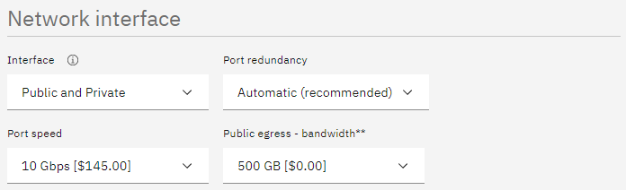

# IBM Storage Protect Blueprint for IBM Cloud

> Version 2.0  
>
> Author: *James Damgar* 
>    
> © Copyright International Business Machines Corporation 2013, 2022.</br>  US Government Users Restricted Rights – Use, duplication or disclosure restricted by GSA ADP Schedule Contract with IBM Corp.
> 
> This edition applies to Version 8.1.16 and later of the IBM Storage Protect server, and to all subsequent releases and modifications until otherwise indicated in new editions or technical newsletters.

## Table of Content

* [1. Introduction](#1-introduction)
  * [1.1 Purpose](#11-purpose)
  * [1.2 Considerations for Disk-to-Cloud Tiering Versus Direct-to-Cloud Data Movement](#12-considerations-for-disk-to-cloud-tiering-versus-direct-to-cloud-data-movement)
    * [1.2.1 Cloud Accelerator Cache Considerations](#121-cloud-accelerator-cache-considerations)
    * [1.2.2 Workload Limitations and Considerations with Tiering](#122-workload-limitations-and-considerations-with-tiering)
  * [1.3 Cloud Deployment Patterns](#13-cloud-deployment-patterns)
  * [1.4 Cloud Environment Considerations](#14-cloud-environment-considerations)
    * [1.4.1 The Importance of Adequate Sizing](#141-the-importance-of-adequate-sizing)
    * [1.4.2 Linux Logical Volume Manager (LVM)](#142-linux-logical-volume-manager-lvm)
  * [1.5 References to Physical IBM Storage Protect Blueprints](#15-references-to-physical-ibm-storage-protect-blueprints)
  * [1.6 Database Backup to Object Storage](#16-database-backup-to-object-storage)
    * [1.6.1 Tuning Database Backup Operations to Object Storage](#161-tuning-database-backup-operations-to-object-storage)
  * [1.7 Server Maintenance Scheduling Considerations](#17-server-maintenance-scheduling-considerations)
  * [1.8 Session Scalability by Blueprint Size](#18-session-scalability-by-blueprint-size)
  * [1.9 IBM Storage Protect Security Concepts and Guidelines](#19-ibm-storage-protect-security-concepts-and-guidelines)
    * [1.9.1 Identity Security in the IBM Storage Protect Environment](#191-identity-security-in-the-ibm-storage-protect-environment)
    * [1.9.2 IBM Storage Protect Administrative Security](#192-ibm-storage-protect-administrative-security)
    * [1.9.3 IBM Storage Protect Data Security and Policy Based Management](#193-ibm-storage-protect-data-security-and-policy-based-management)
    * [1.9.4 IBM Storage Protect Bit-Level Security](#194-ibm-storage-protect-bit-level-security)
  * [1.10 Optimizing Restore Performance from Cloud-Container Storage Pools](#110-optimizing-restore-performance-from-cloud-container-storage-pools)
    * [1.10.1 Enabling the Cloud-Container Storage Pool Cloud Read Cache](#1101-enabling-the-cloud-container-storage-pool-cloud-read-cache)
    * [1.10.2 Increasing the Minimum Extent Size for Client Nodes](#1102-increasing-the-minimum-extent-size-for-client-nodes)
* [2. IBM Cloud Computing Configurations](#2-ibm-cloud-computing-configurations)
  * [2.1 Compute, Disk, and File System Setup Instructions for Linux-based Systems](#21-compute-disk-and-file-system-setup-instructions-for-linux-based-systems)
    * [2.1.1 Linux Operating System Packages and General Guidance](#211-linux-operating-system-packages-and-general-guidance)
    * [2.1.2 Large Blueprint Instructions (Virtual Server for VPC)](#212-large-blueprint-instructions-virtual-server-for-vpc)
      * [2.1.2.1 Disk Setup Instructions](#2121-disk-setup-instructions)
    * [2.1.3 Medium Blueprint Instructions (Virtual Server for VPC)](#213-medium-blueprint-instructions-virtual-server-for-vpc)
      * [2.1.3.1 Disk Setup Instructions](#2131-disk-setup-instructions)
    * [2.1.4 Small Blueprint Instructions (Virtual Server for VPC)](#214-small-blueprint-instructions-virtual-server-for-vpc)
      * [2.1.4.1 Disk Setup Instructions](#2141-disk-setup-instructions-ibm-storage-protect--db2-instance-directory)
    * [2.1.5 Extra-Small Blueprint Instructions (Virtual Server for VPC)](#215-extra-small-blueprint-instructions-virtual-server-for-vpc)
      * [2.1.5.1 Disk Setup Instructions](#2151-disk-setup-instructions)
    * [2.1.6 Large Blueprint Instructions (Bare Metal, Direct-to-Cloud)](#216-large-blueprint-instructions-bare-metal-direct-to-cloud)
      * [2.1.6.1 Disk Setup Instructions](#2161-disk-setup-instructions)     
    * [2.1.7 Medium Blueprint Instructions (Bare Metal, Direct-to-Cloud)](#217-medium-blueprint-instructions-bare-metal-direct-to-cloud)
      * [2.1.7.1 Disk Setup Instructions](#2171-disk-setup-instructions)
    * [2.1.8 Small Blueprint Instructions (Bare Metal, Direct-to-Cloud)](#218-small-blueprint-instructions-bare-metal-direct-to-cloud)
      * [2.1.8.1 Disk Setup Instructions](#2181-disk-setup-instructions)
    * [2.1.9 Large Blueprint Instructions (Bare Metal, Disk-to-Cloud Tiering)](#219-large-blueprint-instructions-bare-metal-disk-to-cloud-tiering)
      * [2.1.9.1 Disk Setup Instructions](#2191-disk-setup-instructions)
    * [2.1.10 Medium Blueprint Instructions (Bare Metal, Disk-to-Cloud Tiering)](#2110-medium-blueprint-instructions-bare-metal-disk-to-cloud-tiering)
      * [2.1.10.1 Disk Setup Instructions](#21101-disk-setup-instructions)
    * [2.1.11 Small Blueprint Instructions (Bare Metal, Disk-to-Cloud Tiering)](#2111-small-blueprint-instructions-bare-metal-disk-to-cloud-tiering)
      * [2.1.11.1 Disk Setup Instructions](#21111-disk-setup-instructions)
    * [2.1.12 IBM Storage Protect Format and Server Options](#2112-ibm-storage-protect-format-and-server-options)
  * [2.2 Design Considerations for IBM Cloud Systems](#22-design-considerations-for-ibm-cloud-systems)
    * [2.2.1 Considerations for Direct-to-Cloud Architectures](#221-considerations-for-direct-to-cloud-architectures)
    * [2.2.2 Sizing the Cloud Accelerator Cache](#222-sizing-the-cloud-accelerator-cache)
    * [2.2.3 Considerations for Disk-to-Cloud Tiering Architectures](#223-considerations-for-disk-to-cloud-tiering-architectures)
    * [2.2.4 Disk-to-Cloud Tiering Operational Recovery Capacities](#224-disk-to-cloud-tiering-operational-recovery-capacities)
    * [2.2.5 IBM Cloud Object Storage Resiliency and Storage-Class Choices](#225-ibm-cloud-object-storage-resiliency-and-storage-class-choices)
    * [2.2.6 Network Uplinks and Port Redundancy with IBM Cloud Bare Metal Servers](#226-network-uplinks-and-port-redundancy-with-ibm-cloud-bare-metal-servers)
    * [2.2.7 Configuring IBM Cloud Block Storage iSCSI Disks on Linux](#227-configuring-ibm-cloud-block-storage-iscsi-disks-on-linux)
* [3. Disk Benchmarking](#3-disk-benchmarking)
  * [3.1 Object Storage Benchmarking](#31-object-storage-benchmarking)
  * [3.2 Benchmarking Performance Goals](#32-benchmarking-performance-goals)
* [4. Instance and Storage: Navigating the IBM Cloud Portal](#4-instance-and-storage-navigating-the-ibm-cloud-portal)
* [5. References](#5-references)
* [6. Notices](#6-notices)
  * [6.1 Trademarks](#61-trademarks)

---

## 1. Introduction

### 1.1 Purpose

This paper introduces the possibilities for deploying IBM Storage Protect on an **IBM Cloud**™ into the following environments: 
* **Bare metal servers for classic** computing systems 
* Virtual servers for Virual Private Cloud (VPC)

You can use the configurations that are presented here as a starting point for deploying a large, medium, small, or extra-small system, similar to those defined in the [IBM Storage Protect Blueprints](https://www.ibm.com/support/pages/node/1146352). With the goal of achieving a target daily ingestion rate (small, or extra-small deployment), configuration possibilities are offered so that you can get a sense of the relative CPU, memory, disk, and network capabilities that are needed to satisfy requirements. In addition, an overview of options for meeting the requirements is provided. The current IBM Cloud offerings for bare metal servers for classic systems and virtual servers for VPC represent a wide gamut of available options, which are appropriate for different workloads. The availability of options depends, in part, on the IBM Cloud data center being considered and whether servers are provisioned on an hourly or monthly basis. Certain systems might be sufficient in some system resource areas while lacking in others. You must recognize where system bottlenecks might arise that could limit IBM Storage Protect capability.

Use this paper as a **starting point for guidance** about where and how to deploy an instance of the IBM Storage Protect server on a dedicated IBM Cloud bare metal server for classic systems or virtual servers for VPC for large, medium, small, and extra-small deployments. This paper presents options for deploying IBM Storage Protect in two configurations:

* A configuration in which primary IBM Storage Protect backup-archive data is stored directly to cost-effective IBM Cloud Object Storage (hosted within IBM Cloud). Solutions are provided both for bare metal servers as well as for virtual servers for VPC.
* A configuration in which several days of operational recovery data is kept on a (directory-container storage pool) disk tier for rapid recovery and older, inactive data is demoted to and preserved on IBM Cloud Object Storage. This option can prove cost effective for smaller IBM Cloud bare metal servers. The feasibility of this configuration is contingent upon IBM Cloud data center availability for bare metal servers providing 24-36 internal drive chassis slots. Many modern IBM Cloud bare metal servers provide only a maximum of 12 internal drive slots and some offer only more expensive SSD disks for in-chassis storage where HDDs would be preferable for greater capacity and cheaper cost. For these systems, a large or medium Blueprint tiering configuration might not be possible due to a lack of locally attached disk storage capacity.

The choice of architecture depends on the mixture of data recovery objectives and cost goals for a specific solution. Restore rates are generally slower for data in object storage than for data in localized block storage. However, object storage capacity costs are usually lower than costs for block disk, especially for cloud-hosted environments. The availability of IBM Cloud bare metal systems with 24-36 internal drive slots in the desired IBM Cloud data center location will also determine whether the tiering architecture is possible.

For the **direct-to-cloud** architectures, backup data is ingested directly into a **cloud-container storage pool** with a performant accelerator cache disk location tuned for a system's ingestion workload as the initial "landing spot" (for more information, see [Sizing the Cloud Accelerator Cache](#222-sizing-the-cloud-accelerator-cache). Data is then immediately, asynchronously transferred to object storage while further data is also ingested into the disk staging area (also known as *overlapped I/O*). The key consideration here is to determine the performance characteristics that the disk staging area must provide to allow for this mixed write-and-read behavior to ensure that ingestion targets are met. A *Cloud Cache and Object Storage Benchmarking* guide and "Cloud benchmarking tools" packages are provided along with this paper to assist in benchmarking both the cloud accelerator cache and object storage system from a prospective host server.

The **disk-to-cloud** tiering architectures make use of IBM Storage Protect **storage rules** to demote data from a small directory-container storage pool (disk tier) to a cloud-container storage pool. Backup data is initially ingested into a directory-container storage pool and later a portion of this data is moved asynchronously to a cloud-container storage pool. This can be done with either age-based tiering (available as of IBM Storage Protect Version 8.1.3) or tiering by backup state (available as of IBM Storage Protect V8.1.6). With IBM Storage Protect V8.1.6, a combination of storage rules and storage subrules can be used to facilitate more granular tiering behavior between the disk and object storage tiers, allowing for flexibility and filtering by node and node file space, for example. Some guidance is given in this paper to assist with determining whether tiering is suitable for your workload demands and characteristics.

### 1.2 Considerations for Disk-to-Cloud Tiering Versus Direct-to-Cloud Data Movement

The primary advantage of the **tiering** model is that operational recovery data can be preserved on a localized, fast disk tier for rapid recovery while older copies of data or data intended for long-term retention can be demoted to object storage, which is typically more affordable. The tiering model can also be used as an alternative to the direct-to-cloud model with a relatively small disk tier footprint (not strictly for operational recovery purposes). When the TIERDELAY parameter is set to 0, age-based tiering can be used to tier each day's worth of ingested client data after it is ingested (after the backup operation is completed). In this case, potentially less expensive disk can be provisioned for use by the small directory-container storage pool disk tier because no ingest and cloud transfer input/output (I/O) operations occur in parallel. Tiering can be run serially after the completion of data ingestion during scheduled windows with less or no contention for this disk; the disk area can be cleared in preparation for the next day's ingestion.

The same ingestion targets can be satisfied with the disk-to-cloud tiering model as with the direct-to-cloud model, assuming that the direct-to-cloud approach makes use of an accelerator cache and overlapped data ingestion.

**Restriction:** To implement cloud tiering, you must provision enough disk space to hold a full day's daily ingestion (plus some buffer) to avoid failed backup operations. The same underlying disk technology can be used in both cases. If, however, you plan to use disk-to-cloud tiering to hold one or more days' worth of operational recovery data within a directory-container storage pool disk tier, the instance disk capacity might have to be much greater, with the caveat that a slower-performing disk might be sufficient for this case. In all cases, you must understand the ingestion targets (after data deduplication and compression) to determine a daily disk capacity for a transient disk case. Meanwhile, operational recovery requirements in terms of the number of days' worth of recovery data (after deduplication and compression) should be determined to further size a directory-container storage pool with tiering to cloud if necessary.

With the **direct-to-cloud** model, you can minimize local block storage capacity. This is an advantage because local block storage can be cost prohibitive in cloud-hosted environments, particularly with virtual servers.

#### 1.2.1 Cloud Accelerator Cache Considerations

Beginning with IBM Storage Protect V8.1.2, data ingestion from clients is throttled if the accelerator cache area is near capacity. This feature makes it possible for this disk cache location to be **underprovisioned** from a capacity standpoint in that the disk cache location does not have be sized large enough to hold a full day's worth of deduplicated and compressed data. However, the accelerator disk still must be performant enough in terms of input/output operations per second (IOPS) so that client data ingestion and replication target activity can be completed in a timely manner. In the end, you have to compare costs to determine whether larger capacity, less-expensive disk with tiering has an advantage over a direct-to-cloud cache model for a given environment, ingestion rate, and recovery objective.

**Restriction:** If you plan to use the direct-to-cloud ingestion model, the cloud accelerator cache should be sized large enough to hold at least two times the largest front-end object that is ingested. For example, if a 512 GB object is to be ingested directly into a cloud-container storage pool, the cloud accelerator cache should be at least 1 TB in size.

Similarly, if 5 client sessions will simultaneously back up 100 GB files each, the cloud accelerator cache should be sized to at least 1000 GB (5 clients x 100 GB files x 2). This calculation is based on the fact that the IBM Storage Protect server will attempt to "reserve" space in the cloud accelerator cache for in-flight ingestion until object processing is completed and the database transactions are committed to the server. By default, this processing assumes no data deduplication or compression savings and attempts to reserve the total front-end amount of data to ensure sufficient storage capacity.

Beginning with IBM Storage Protect V8.1.6, a server option can be used to influence this behavior. The undocumented server option PreallocReductionRate can be used to give the server a "hint" about the expected reduction ratio for ingested data and cause the server to reserve less physical space in the directory-container storage pool. For example, setting this option to 5 will cause the server to assume a 5:1 data reduction rate for front-end to back-end data so that only 1 unit of back-end space will be reserved for 5 units of front-end protected data. This option can range from 1 (the default, no reduction) to 25 (a 25:1 assumed reduction). Use this option only if you want to configure a smaller cloud accelerator cache and data reduction rates are certain. If the storage pool has inadequate space, backup failures can result.

Beginning with IBM Storage Protect V8.1.10, the undocumented server option `UsePreallocReduction` was introduced to enable automatic reduction of preallocation.

By default, this option is disabled. If set to YES, the IBM Storage Protect server automatically determines an accurate data reduction rate based on existing storage pool statistics and applies this reduction when preallocating space within storage pool directories (or, in the case of a cloud-container storage pool, in the cloud accelerator cache). Use this option only when a smaller cloud accelerator cache is necessary and data reduction rates are consistent between backups. If the storage pool has inadequate space, backup failures can occur.

Also beginning with IBM Storage Protect V8.1.10, the undocumented server option `PreallocReductionPadding` can be used to add "padding" to the preallocation process. You can specify a value by using a percentage. The default value is 5. The following example illustrates the use of this option. Assume that the `UsePreallocReduction` server option is enabled; the `PreallocReductionPadding` option is set to 5; and storage pool statistics show a 4:1 data reduction with data deduplication and compression (75%). In this case, when a 100 MB object is ingested, the IBM Storage Protect server attempts to allocate 30 MB to the cloud accelerator cache, based on this formula:

((100% - 75%) + 5%) × 100 MB = 30 MB

You can use the `PreallocReductionPadding` option in combination with the `UsePreallocReduction` option if data reduction rates are inconsistent between backups and an accurate padding value can be determined. The PreallocReductionRate option takes precedence over the `UsePreallocReduction` option.

#### 1.2.2 Workload Limitations and Considerations with Tiering

Not all client workloads are suitable for a disk-to-cloud tiering model. Age-based tiering (as of IBM Storage Protect V8.1.3) allows for the demotion of *backup* objects that are older than a specified age. Inactive backup generations that are older than the specified age are transitioned to object storage. State-based tiering (as of IBM Storage Protect V8.1.6) allows for the demotion of *backup* objects that are inactive within the server. Active backup objects are preserved on the disk tier, while inactive copies of backup objects are transitioned to object storage.

Disk-to-cloud tiering is **suitable** for client workloads that have **low** data deduplication rates (backup generations differ greatly). In this case, data is highly unique between backup operations. When a backup generation is tiered to object storage, the deduplicated extents (chunks) that make up that object have their references decremented on the source directory-container storage pool. In this case, reference counts are likely to be low and more deduplicated extents are likely to be removed from the disk tier as objects are tiered and space is released.

Disk-to-cloud tiering **may not be suitable** for client workloads that have a **high** data deduplication rate. In this case, data is not very unique between backup generations and many shared deduplicated extents are referenced by multiple object generations. Even though an object can be tiered by a storage tiering rule, because the object shares many extents with other objects (which might still be active), a large proportion of the object's data will not be removed from the disk tier (although it will be copied to the object storage tier).

The following figures illustrate how data movement with disk-to-cloud tiering can occur. Figure 1 depicts a scenario in which multiple versions of three backup objects (A, B, and C) have been ingested and are stored in a directory-container storage pool on disk. Dotted lines represent references to deduplicated extents (colored, numbered boxes). With the tier-by-state option, the inactive object copies highlighted within the gray rectangle would be tiered to a cloud-container storage pool.


*Figure 1: Disk-to-cloud tiering, before and after*

`Figure 2` depicts the situation after tiering is completed and the REUSEDELAY parameter value of the source directory-container storage pool is exceeded (so that deduplicated extent removal for extents with zero reference count can occur).


*Figure 2: Disk-to-cloud tiering, after tiering*

Notice that deduplicated extents 1 and 2 remain on disk even after tiering and extent cleanup have occurred. The extents remain because they are shared between the active and inactive backup copies. If many deduplicated extents are shared by objects (a high duplicate data rate with high data deduplication ratios), it is more likely that data will remain on disk, even after backup objects have been tiered at an IBM Storage Protect inventory level. Keep this factor in mind when you consider a disk-to-cloud tiering model and when you size an environment.

For workloads that deduplicate well from day to day, there will be many shared extents across backup and archive generations and a smaller capacity footprint on tiered object storage as a result because these backup and archive generations will also share many extents in the cloud-container storage pool. For workloads that deduplicate poorly day to day (highly unique data change each day), there will be few shared extents across backup and archive generations and potentially a larger capacity footprint on tiered object storage because these backup and archive generations will each point to (more) unique data in the cloud-container storage pool.

If the primary motivation for using disk-to-cloud tiering is rapid recovery of operational recovery data, a tiering model might provide the best approach. You must understand the nature of the client workload to accurately size the directory-container storage pool on disk.

### 1.3 Cloud Deployment Patterns

The configurations described in this paper can be used as starting points in situations where the IBM Storage Protect cloud instance will be a **primary server and in** **situations where it is used as a replication target**. In scenarios where the IBM Cloud based instance is a replication target, adequate "public" network capability might be sufficient to satisfy the replication throughput requirements of a solution is a comprehensive service that includes the ability to establish deding from 50 Mbps to 10 Gbps with partner providers between an on-premises data center and IBM Cloud hosted resources. Such links can help to facilitate efficient IBM Storage Protect replication or client backup processing from clients or peer servers outside of the IBM Cloud private network.

Generally, IBM Storage Protect deployments making use of cloud-based object storage will align with one of the following three patterns:


*Figure 3: Deployment patterns*

In the figure, the **first** deployment pattern could involve an IBM Storage Protect server that is installed on premises or within an IBM Cloud server, with primary backup data landing in object storage immediately. The positioning of the IBM Storage Protect server in relationship to clients could be one critical decision point when you consider whether to have a server instance on premises or hosted in IBM Cloud, with further considerations involving whether IBM Cloud Direct Link is used. This pattern could involve use of a direct-to-cloud architecture with accelerator cache or a small container storage pool with immediate tiering to a second cloud-container storage pool without accelerator cache.

 The **second** deployment pattern would make use of IBM Cloud Object Storage at the secondary disaster recovery (DR) site. This DR server could be installed at an on-premises site or on an IBM Cloud server. In the latter case, sufficient wide area network (WAN) bandwidth between the primary and secondary sites is required for acceptable performance. Much like the first deployment pattern, here the IBM Storage Protect server at the DR site could make use of a direct-to-cloud topology with a cloud pool featuring accelerator cache, or it could use a small container storage pool landing spot with immediate tiering to a cloud pool backed by object storage.

The **third** deployment pattern features specific use of disk-to-cloud tiering to allow for operational recovery data to reside on faster performing disk storage. This could involve age-based tiering (available with IBM Storage Protect V8.1.3 and later) or state-based tiering (available with IBM Storage Protect V8.1.6 and later), or a mixture of the two approaches tailored for a specific purpose. Data that is older, archived, or both would be tiered to cloud-based object storage after a specified number of days or by its state (active or inactive) within the server. This deployment also could be configured at an on-premises site or within an IBM Cloud server. However, the additional cost of having a larger capacity container storage pool should be factored into cost estimates with an in-the-cloud solution.

A **combination** of approaches is also possible within the same deployment. For example, a cloud-container storage pool could be configured with accelerator cache disk and made to take in long-term retention or compliance archives. A directory-container storage pool could be configured as a disk tier for normal backups, and a tiering relationship could be set up so that operational recovery data (for example, backups from the previous 7 days) is kept on this disk tier, while older data is demoted to the same cloud-container storage pool. The same cloud-container storage pool can be a direct backup target and a tiering target.

However, if the pool is a direct target of a backup-archive client, the pool must be configured with accelerator cache disk.

### 1.4 Cloud Environment Considerations

For IBM Storage Protect solutions in the **IBM Cloud**, **bare metal servers for classic systems** and virtual servers for VPC are viable options. Ethernet network capability in **excess of 10 Gbps** to one of the IBM Cloud Object Storage endpoints accessible over the private IBM Cloud network for the cloud-container storage pool is required to achieve large, medium, or small Blueprint-level ingestion rates. The selection of bare metal and virtual servers can vary based on the desired IBM Cloud data center and whether monthly or hourly provisioning is desired. Various options can be used to satisfy IBM Storage Protect requirements and to provide adequate flexibility for tuning server selections. For bare metal servers for classic systems, ensure that you select server offerings that include a large enough chassis to support the required number of **internal disks** for IBM Storage Protect. In this document, systems with either 24 or 36 internal disks are outlined. For the extra-small server option, a virtual server for VPC is the best choice. IBM Cloud virtual servers can have a multitenant architecture (for greatest cost savings) or a single-tenant (dedicated) architecture and can be provisioned with hourly, monthly, or yearly billing terms. For larger systems or more demanding workloads, consider single-tenant (dedicated) systems.

**Restriction:** Before you select an IBM Cloud bare metal server, consider that moving to another server type after deployment would require a complete rebuild. The large, medium, and small bare metal solutions outlined here make use of physical server deployments with all-internal disk configurations. Some systems may also use IBM Cloud Block storage for iSCSI-attached access. If the appropriate IBM Storage Protect server sizing is initially unclear, or the server requirements might change, and you can collocate other, non-IBM Storage Protect workloads in IBM Cloud as well, you could potentially provision a larger bare metal server and install hypervisor virtualization software on the host. In this way, you could provide flexibility in provisioning CPU and memory resources to an IBM Storage Protect virtual machine. This configuration could be altered as requirements change. However, this paper addresses only installations of IBM Storage Protect on bare metal servers with no hypervisor and a single operating system.

#### 1.4.1 The Importance of Adequate Sizing

Ingested backup data reaching the cloud accelerator cache or the initial container pool tier requires the use of block storage allocated to the cloud server. IBM Storage Protect database activity also uses some level of throughput and elevated I/O operations during workload processing. Therefore, disk **I/O capability** and server-to-disk throughput considerations are paramount when deploying an IBM Storage Protect instance. To help achieve the required performance level and to reduce cost, internal, in-chassis JBOD disks and redundant arrays of independent disks (RAID) are used with large, medium, and small IBM Cloud bare metal systems. With a final ingestion point on object storage via a cloud-container storage pool, the **Ethernet capability** of the server and the nature of the network between the server and the IBM Cloud Object Storage endpoint should be kept in mind. In addition, you must consider how the front-end client data workload is deduplicated and compressed into a back-end storage quantity.

A lack of adequately performing disks can lead to bottlenecks in the IBM Storage Protect server's database operations. Certain IBM Cloud servers might have, or be configured with, limited throughput over Ethernet, and this limitation could hamper ingestion and restore throughput with IBM Cloud Object Storage. During the planning phase, consider how the ingested data will be **reduced via data deduplication and compression** at the back-end storage location. These factors will help you estimate how much back-end data must be moved within a certain time window (measured in hours) and can help predict the throughput (megabytes per second or terabytes per hour) that the Ethernet network and object storage endpoint require to satisfy ingestion requirements. Generally, **10 Gbps** Ethernet capability to private IBM Cloud Object Storage endpoints is required for large, medium, or small Blueprint ingestion targets while 1 Gbps is sufficient for extra-small targets.

Beginning with IBM Storage Protect V8.1.3, the server automatically throttles client backup operations if the cloud accelerator cache portion of a cloud-container storage pool is nearing full capacity. As a result, it is not mandatory to configure cloud accelerator disk cache space that would be large enough to hold a full day's worth of backups (after data deduplication and compression). However, disk benchmarks should be run to ensure that the anticipated back-end workload that an IBM Storage Protect server is expected to support will not result in this disk location being the primary bottleneck of the system (see [Disk Benchmarking](#3-disk-benchmarking)). In practice, any planned deployment should be validated to ensure that it will meet performance requirements.

Finally, with IBM Cloud bare metal servers, the availability of certain servers might be limited by the data center location and whether hourly or monthly provisioning is desired. Server options can also change over time by data center. Consult the latest list of available bare metal servers at your desired data center for current information.

#### 1.4.2 Linux Logical Volume Manager (LVM)

The described reference architectures use either the Red Hat Enterprise Linux (RHEL) or Ubuntu Linux operating systems. For the **disk-to-cloud tiering** configurations with IBM Cloud bare metal servers, the preferred method for provisioning storage volumes from the archive log and directory-container storage pool RAID 6 disk arrays for medium and small options is to use the **Linux Logical Volume Manager (LVM)**. Each RAID 6 array is presented to the operating system as a single physical disk. Create a single volume group for each RAID 6 array. Then, use the created volume groups for the IBM Db2® archive log and the directory-container storage pool disk. Because only one physical disk (representing a RAID 6 array volume) is used per volume group, striping information is not required. For more information, see the [Compute, Disk, and File System Setup Instructions for Linux-based Systems](#21-compute-disk-and-file-system-setup-instructions-for-linux-based-systems) section of this document.

### 1.5 References to Physical IBM Storage Protect Blueprints

Throughout this paper, the server specifications in the [Storage Protect Blueprint for Linux](https://www.ibm.com/support/pages/node/1146352) document (also known as an IBM Storage Protect Blueprint) are referenced as targets for CPU and memory configurations matching small, medium, and large server builds. For more information about the Blueprints, see [References](#5-references)[1]. The intention with the server builds outlined here is to provide systems capable enough from a CPU, memory, disk, and Ethernet point of view to approach Blueprint-level ingest capability. Although different instance types can be used to satisfy the same requirements, the disk specifications in particular should be noted in this document as guidance for those deploying environments of their own.

As a reference, the following table indicates the throughput, capacity, CPU, and memory targets for each of the referenced Blueprints. The values for total managed data and daily ingest data are for the block storage Blueprints. These ingestion targets assume an 8-hour backup window.

*Table 1: IBM Storage Protect physical Blueprint targets (Linux x86)*

| Sizing category | CPU | RAM memory | Total managed data (front end) | Daily ingest data (front end) |
|-----------------|-----|------------|--------------------|-----------------|
| Small  | 16 cores | 64 GB  | 60 TB – 240 TB     | Up to 10 TB per day |
| Medium | 20 cores | 192 GB | 360 TB – 1440 TB   | 10 – 30 TB per day  |
| Large  | 44 cores | 384 GB | 1000 TB – 4000 TB  | 20 – 100 TB per day |

Although not defined explicitly in the physical Blueprints, the extra-small cloud Blueprint systems target up to 10 TB or more of total managed (front-end) data with a daily ingestion rate of up to 1 TB, or more, per day.

### 1.6 Database Backup to Object Storage

Beginning with IBM Storage Protect V8.1.10, you can back up the server database to object storage for disaster recovery purposes. An alternative approach for cloud-hosted servers is to use the FILE device class and run backup operations to provisioned disk storage. Previous versions of the Cloud Blueprints included FILE device class configurations that offered approximately two days' worth of full database backups in the worst case (with the Db2 database consuming close to its maximum resident capacity).

However, this approach can be cost-prohibitive in some cloud-hosted environments.

With IBM Cloud bare metal servers, it might be less expensive in some cases to use a FILE device class approach for IBM Storage Protect database backup operations with locally attached SATA drives instead of backup operations to IBM Cloud Object Storage. This locally attached block storage tier, when used with IBM Cloud bare metal servers, is cost-competitive with IBM Cloud Object Storage. However, internal drive slots within the limited bare metal server chassis must be assigned for this purpose with adequate RAID protection to protect against disk failure. Many current IBM Cloud bare metal server offerings provide only 12 internal disk slots at most, limiting the maximum capacity that can be reserved for database backup operations. The server configurations in this document are based on database backup operations to object storage. An alternative approach could be pursued with FILE device class volumes. For guidance about using disk storage for database backup, see Version 1.2 of this document.

An advantage of using IBM Cloud Object Storage for IBM Storage Protect database backups is that object storage pricing with IBM Cloud is based on the amount of storage space that is used, while disk storage pricing is based on the amount of storage space that is provisioned, even if a portion is unused. Not only is unused provisioned disk space a deterrent to cost savings, the actual rate charged for this space can be more than object storage. Use of IBM Cloud Object Storage for database backup can help ensure that storage consumed for backup operations better matches the requirements of the environment. By taking this approach, you can enjoy greater freedom in choosing and changing a retention policy for database backups to match the required recovery window. For example, you can transition from 2 days' worth of full database backups to 7 without having to re-provision and configure disk storage.

 A further benefit of using database backup to IBM Cloud Object Storage is that increased data redundancy, availability, and durability can be achieved through the inherent erasure coding distribution of data across separate data center facilities. You can achieve this by selecting Regional or Cross Region IBM Cloud Object Storage:

* With Regional IBM Cloud Object Storage, data is distributed and accessible from different physical data center locations within a single IBM Cloud Region, with protection offered for individual site outages.
* With Cross Region IBM Cloud Object Storage, additional data availability and resiliency are gained by distributing data across multiple geographically distant IBM Cloud regional data centers, offering protection against full region outages.

You can use the same IBM Cloud Object Storage vault for database backups and use the cloud-container storage pool of the IBM Storage Protect server to ensure matching redundancy, availability, and durability attributes for database metadata and storage pool data:
* If an outage occurs in a specific site within a region of Regional IBM Cloud Object Storage, an IBM Storage Protect server instance can be recovered with a database restore operation. And the cloud-container storage pool resident data can be accessed by a different IBM Cloud server instance, which is located in the same region at the same or a different physical site.
* With Cross Region IBM Cloud Object storage, an IBM Storage Protect server instance can be recovered within a different geographic region.

 For detailed guidance about setting up database backup operations to object storage, see [References](#5-references)[6].

#### 1.6.1 Tuning Database Backup Operations to Object Storage

When a CLOUD device class is used for IBM Storage Protect database backup operations, the following files are copied to IBM Cloud Object Storage:
* Database volumes
* The device configuration file
* The volume history file
* The master encryption key for the server

Large items, such as database volumes, are copied to object storage by using multipart upload. By specifying multiple, concurrent data streams during database backup, you can reduce the time that is required to back up the database. The number of data streams that are used for the database backup operation is the same as the number of data streams that are required for any subsequent database restore. The number of data streams affects throughput. Each database backup operation uses the following separate resources:
* A session connection from Db2 to the IBM Storage Protect server
* A server thread that sends data from the server to object storage

Several performance factors affect server database backup operations to object storage, for example:
* Database disk performance (256 - 512 KB sequential input/output operations)
* Object storage system performance
* Network performance to the object storage system

When you plan database backup operations to IBM Cloud Object Storage with the systems presented here, consider the maximum network throughput that is required to complete database backup operations on schedule to meet service level commitments. A common expectation is that a daily full backup of the IBM Storage Protect server database is completed in 2 - 3 hours (or less). A 1 Gbit Ethernet link provides approximately 100 MB/s of throughput, while a 10 Gbit Ethernet link provides roughly 1000 MB/s of throughput. A full backup of an 8 TB database (at the larger end of a large Blueprint system) would take more than 20 hours on a 1 Gbit connection and approximately 2 - 3 hours on a 10 Gbit connection. These estimates are based on the assumption that the network links are hardly used otherwise. The relative load on these networks should be considered when scheduling database backup operations and when selecting which network links to provision and configure for cloud compute instances. The health of the network link should also be evaluated. TCP/IP packet loss of 2% or more can cause a large degradation in throughput for database backup and restore operations from object storage, jeopardizing daily database backup operations.

Db2 database encryption is used by default for database backup operations to cloud device classes to provide additional security for database data. You can specify encryption or compression for a database backup operation to cloud, but not both. If you specify compression, encryption is disabled. Compression impacts backup performance and limits front-end throughput to approximately 0.5 TB per hour or less and thus is not typically suitable for larger server environments unless a longer database backup window can be tolerated. Compression can, however, result in a smaller data footprint in IBM Cloud Object Storage and slightly improve database restore performance. For smaller IBM Storage Protect servers with smaller databases (such as the extra-small and small configurations shown here), enable compression when the following conditions are met:
* The network link to object storage is 1 Gbit or less.
* Database encryption is not necessary.
* Compression savings are required.

Depending on the IBM Storage Protect server size, use the following stream quantities as starting points for optimal performance for database backup operations on Blueprint systems:
* Extra-small system: 1-5 streams 
* Small system: 10 streams 
* Medium system: 25 streams 
* Large system: 50 streams 

Then, adjust the number of data streams until you achieve the desired or optimal throughput on a consistent basis over time. Each data stream uses approximately 20 MB of memory on the IBM Storage Protect server. For example, a 50-stream database backup operation consumes approximately 1000 MB of memory on the server.

A beneficial step when building a cloud-based IBM Storage Protect server is to benchmark the components in the solution to prove that the resources available to the server are sufficient to meet performance demands. For database backup to IBM Cloud Object Storage, benchmark the sequential read throughput of the IBM Storage Protect database disks and the throughput capability of the link to object storage from the server instance. By ensuring that these components perform adequately, you increase confidence that database backup (and restore) operations will perform acceptably within allotted time windows. For guidance about benchmarking and interpreting the results, see [References](#5-references)[7].

### 1.7 Server Maintenance Scheduling Considerations

The [Storage Protect Blueprint for Linux](https://www.ibm.com/support/pages/node/1146352) document features a detailed breakdown of the procedure for setting up IBM Storage Protect server maintenance schedules (see [References](#5-references)[1], Chapter 5). Use this information as a reference for establishing a maintenance schedule on cloud-hosted servers.

For an IBM Storage Protect server in IBM Cloud that is serving as a replication target, a replication window and schedule might have to be established. For servers using the direct-to-cloud model, where primary backup data is ingested directly into a cloud-container storage pool, a replication window might not be required if this server is not a replication target server because a cloud-container storage pool cannot be used as a replication source. In this case, redundancy requirements for the ingested client data can be met by the inherit redundancy of IBM Cloud Object Storage.

For an IBM Storage Protect server in IBM Cloud that is using the disk-to-cloud tiering model, a replication source strategy might be required. Replication can help to protect client data objects in the disk directory-container storage pool that have not yet been tiered (demoted) to object storage because only one copy of that data is present. To prevent excess data from being stored (pinned) to the disk tier, verify the following items:
- The source replication server (used for disk-to-cloud tiering) should be configured with a longer retention policy for the client data that is being replicated than does the replication target server.
- The retention policy that affects client node data on the target replication server should match the value of the TIERDELAY parameter of the storage rule responsible for tiering the same client node data on the source server.

In general, the server that is used for disk-to-cloud tiering -- whether it be the source replication server or the target replication server -- should be the server with the longer retention policy for the client nodes affected by the tiering storage rule.

### 1.8 Session Scalability by Blueprint Size

The [Storage Protect Blueprint for Linux](https://www.ibm.com/support/pages/node/1146352) document describes how to set the IBM Storage Protect server option MAXSESSIONS, based on Blueprint system size:
- Small system: 250 maximum simultaneous client sessions
- Medium system: 500 maximum simultaneous client sessions
- Large system: 1000 maximum simultaneous client sessions

(For more information about the Blueprint configurations, see [References](#5-references)[1].)

The actual throughput scalability of an IBM Cloud based solution depends on many factors, including the configured disk capability and capacity of the system, the amount of CPU and memory resources available on the system, and the relative rate of data deduplication and compression for the data set that is ingested into the server. Larger objects, which feature a larger deduplicated extent size (for example, 250 - 350 KiB, or more) and which do not deduplicate or compress well (for example, less than 10%), will result in less database and computation (CPU) overhead, but will utilize more disk and network bandwidth. The logical reduction of front-end client data to the physical back-end data (which is actually written out and stored to disk and object storage) means that the disk, network, and object storage components will be stressed to a higher degree as client/server session counts increase. Memory usage by the IBM Storage Protect server might also be greater. As session counts increase, these components are likely to become a system bottleneck, limiting front-end throughput.

Objects that feature smaller, deduplicated extent sizes (for example, 60 - 100 KiB or similar) and that deduplicate and compress well (for example, 50% data deduplication with 50% compressibility) will result in less network, disk, and object storage bandwidth used, but will lead to more database and computation overhead to facilitate these data reduction operations. As session counts increase, CPU and database-related memory are likely to first become limiting factors for these data types. In general, the more successfully data can be deduplicated and compressed (and therefore the greater the data reduction from front-end to back-end data), the greater the number of feasible client sessions. The following table indicates a reasonable range of client session counts based on system size and data type, as well as the likely limiting factor for the system as the high end of the range is approached.

*Table 2: Preferred ranges of maximum values for client session counts*
| Cloud system size | Large object, poor data deduplication and compression ** | Large object, good data deduplication and compression *** |  Large object, small extent size, good data deduplication and compression **** |  Small object, poor data deduplication and compression ***** |
|-------------|-----------|-----------|-----------|-----------|
| Extra small | 10 - 50   | 25 - 50   | 10 - 50   | 10 - 50   | 
| Small       | 50 - 100  | 100 - 200 | 50 - 100  | 50 - 100  |
| Medium      | 100 - 200 | 200 - 400 | 100 - 150 | 100 - 150 |
| Large       | 300 - 400 | 400 - 500 | 150 - 200 | 150 - 200 |
| Limiting factor at scale | Network, disk, object storage bandwidth, memory | CPU, memory or network, disk, object storage bandwidth | CPU, memory | CPU, memory |
 
** This model uses 128 MiB objects, 250 - 350 KiB extents, and <10% data deduplication and compressibility. Full backup operations are used with pseudo random data or data that cannot be easily deduplicated or compressed. For example, this model can be applied to encrypted data. </br>
*** This model uses 128 MiB objects, 150 - 200 KiB extents, and 50% data deduplication and compressibility. For example, this model can be applied to virtual machine backups. </br>
**** This model uses 1 GiB objects, 60 - 100 KiB extents, and 50% data deduplication and compressibility. For example, this model can be applied to database image backups. </br>
***** This model uses 128 KiB objects and <10% data deduplication and compressibility. For example, this model can be applied to file server data and other small files or objects.

Often, a diminishing rate of return regarding throughput is experienced when 50 - 100 total client sessions are exceeded, regardless of data type. More sessions are possible and might be warranted, given the client schedule or other requirements. However, aggregate gains in total throughput of a single IBM Storage Protect instance might not be substantial past this point.

### 1.9 IBM Storage Protect Security Concepts and Guidelines

We live in an increasingly hostile environment in terms of data protection and security. Internal and external malicious actors target organizations and institutions for political or social reasons. Many seek financial gain through the use of *ransomware*, a type of malware that encrypts client production data or backup data for the purpose of obtaining a payment (ransom) to decrypt that data. Often, ransomware attacks include the following operations:
1. Infiltrate the environment
2. Obfuscate data by using encryption
3. Export the data as an additional blackmail tactic

Beyond ransomware, other forms of malware and computer viruses can disrupt production workloads and lead to business downtime. Organizations must develop and understand their security posture to combat these and other evolving threats. IBM Storage Protect supports a layered approach to addressing security concerns within a data protection environment. Primarily, this approach is based on secure communication protocols, secure user passwords, and different access levels for IBM Storage Protect administrators. Through the use of policy-based management, IBM Storage Protect administrators can ensure that a sufficient number of data versions are available to support "freedom of action" to recover data at different points in time within the environment. IBM Storage Protect also provides for bit-level security, anomaly detection, and audit mechanisms to help secure an environment.

For an overview and primer about securing an IBM Storage Protect environment, see [References](#5-references)[35] and [36].

Overall, a layered approach to data security and protection should be pursued with IBM Storage Protect in both on-premises and in-the-cloud deployments. The layered approach is based on the following guidelines:
* The set of people with physical and virtual access to administrative functions with the data protection environment should be limited and evaluated regularly.
* The set of administrators should be limited and access restricted based on business function and a need-to-know basis.
* Data deletion authority should be limited and deletion-prevention controls should be implemented, including the IBM Storage Protect command approval feature.
* Redundant copies of data should be made, if possible.
* Protected data should be verified for integrity.
* Recovery procedures should be validated through regular audits and by testing restore operations and disaster recovery (DR) procedures. The goal is to ensure that the recovery time objective (RTO) and the recovery point objective (RPO) targets can be achieved


*Figure 4: Layered security*

#### 1.9.1 Identity Security in the IBM Storage Protect Environment

IBM Storage Protect uses a novel *verb protocol* communication mechanism for client-to-server and server-to-server communication. This verb protocol is an API protocol in which each side of the communication channel initiates requests or responses that drive behavior within the IBM Storage Protect client or server. When first establishing communication between the two endpoints, the client and server or two servers authenticate with one another. With recent versions of IBM Storage Protect, Transport Layer Security (TLS) over TCP/IP is used by default as a security protocol for communication. IBM Storage Protect offers industry-standard local credential management with passwords that are encrypted at rest and decrypted at user sign-on and authentication. During the verb protocol sign-on procedure, TLS is used for authentication (certificate and authentication exchange).

IBM Storage Protect client-node and administrator password security can be further enhanced by using Lightweight Directory Access Protocol (LDAP) to apply stricter requirements for passwords. This approach includes the integration of Microsoft Active Directory. With LDAP, the server receives credentials from the client over TLS, and the server "binds" to the LDAP directory service or completes an operation that is equivalent to binding. For instructions about integrating IBM Storage Protect with LDAP, see [References](#5-references)[18].


*Figure 5: Credential security*

The preferred method of identity security is to maintain at least one local administrator account that does not depend on LDAP or Active Directory in case the system that hosts LDAP or Active Directory is compromised by ransomware or other malware or is otherwise unavailable.

IBM Storage Protect TLS certificates can be self-signed or certificate authority (CA) signed. By default, the server generates a unique self-signed certificate during server formatting (initialization). Alternatively, a trusted CA-signed certificate provided by an organization can be installed for use by the server. For instructions about installing a trusted CA-signed certificate on the server, see [References](#5-references)[19].

#### 1.9.2 IBM Storage Protect Administrative Security

IBM Storage Protect offers different authority classes for administrators. The classes restrict or enable capability within the product. Administrative network traffic can also be directed over a server TCP/IP port that is separate from data traffic. In this way, a networking team can monitor different types of traffic with different tools or with different levels of granularity. IBM Storage Protect offers an "audit trail" missing the other quote mark? in terms of activity log entries stored in the server's database for each operation an

 administrator performs. The IBM Storage Protect Operations Center can be used to specify certain audit-able messages as triggering "alerts" that can be configured to notify specific users via email.

"Command approval" is a mechanism that can be enabled within the server to ensure that an additional, second administrator must approve any potentially destructive server command, including data policy changes which might affect data retention. This helps to ensure a "four eyes" approach so that a single malicious, careless, or uninformed administrator cannot cause damage within an environment. For information setting up administrator command approval, see [References](#5-references)[39].

#### 1.9.3 IBM Storage Protect Data Security and Policy Based Management

Client data versioning and retention represent critical aspects to a data security posture. IBM Storage Protect tracks every version of a backed-up file separately in its inventory. The files are not altered after they are stored. Rather, each version is treated as a separate object in the server's metadata catalog. IBM Storage Protect uses *policies* to control how the server stores and manages data objects through the hierarchy of policy domains, policy sets, management classes, and copy groups. You can specify IBM Storage Protect policy settings so that many versions of client data are protected for a longer period. In this way, you grant yourself more "freedom of action" in terms of having more backup versions, originating from a longer period of time, to provide a wider selection of backup versions for recovery. Even if a security event or malware infiltration is not caught promptly, having several versions of data stored within IBM Storage Protect (for example, 30, 45, or 60 days of data versions) helps to ensure recovery flexibility. Policy settings of interest include the `VEREXISTS` (versions existing), `VERDELETED` (versions deleted), `RETEXTRA` (retained extra), and `RETONLY` (retained only) settings.

To learn more about IBM Storage Protect policy-based data management, see [References](#5-references)[40].

To further enhance data security, consider configuring single or multi-target IBM Storage Protect replication, where the operating systems of each IBM Storage Protect server differ. For example, the Microsoft Windows operating system is often an attack vector for malware. By using a different operating system platform for each of two IBM Storage Protect servers in a replication pair relationship, you might help to protect the system against malware that is designed to target one platform. Increasing the number of "attack vectors" in this way can build another barrier against malicious actors.

IBM Storage Protect can be configured with different retention policy settings at different ends of a replication relationship. For example, the source replication server can store data to local disk storage with a directory-container storage pool while the target replication server can store data to a cloud-container storage pool in the cloud. With more cost-effective object storage on the target server, a longer retention period can be configured to protect more versions of client data for a longer time. Alternatively, IBM Storage Protect *tiering storage rules* can be used with a directory-container storage pool at the target site to tier older or inactive versions of data from disk to object storage for cost-effectiveness. In this case, a longer policy data retention period should be configured at the site from which data is tiered. In both cases, having more versions of data available helps to increase the "freedom of action" within the data protection system.

IBM Storage Protect clients can restore data from either end of a replication pair. For more information about setting up replication, see [References](#5-references)[41].

#### 1.9.4 IBM Storage Protect Bit-Level Security

IBM Storage Protect provides data stream security in various ways. During data transfer, a data stream can be encrypted by using Transport Layer Security (TLS). The TLS protocol performs data content digest and validation functions during transfer and provides for implicit tamper protection. TCP/IP packets are rejected if they appear to be tampered with. During security negotiation, the server prioritizes TLS 1.3 ciphers. Many cipher suites are supported.

The IBM Storage Protect Operations Center makes use of an anomaly detection mechanism that detects unexpected changes in client backups. For example, if data is successfully deduplicated for a workload, but then the data reduction rate drops significantly (to near 0%), this change could indicate that ransomware has encrypted the data. In general, an IBM Storage Protect administrator should pay attention to client deduplication and data reduction rates over time. Most client workloads make use of *incremental forever* backup operations. During an incremental backup operation, only new or changed data is backed up. If ransomware encrypts client data, the next incremental backup could be much larger than normal, indicating a possible problem.

IBM Storage Protect encrypts data at rest by using Galois/Counter Mode (GCM) signing and AES-256 encryption. These security mechanisms are applied to both directory-container and cloud-container storage pools. Each unique data extent that is identified by the data deduplication algorithm is encrypted separately by using distinct encryption keys after the extent is optionally compressed by using LZ4 compression.

**Tip:** A *data extent* is the part of a file that is created during data deduplication. Extents are compared with other file extents to identify duplicates.

These data extents are then further encrypted by using a server-level *master encryption key* that is protected as part of the IBM Storage Protect database backup process.

The validity of client objects is ensured in multiple ways. Each deduplicated extent has a Secure Hash Algorithm (SHA-1) value that is computed and stored in the server database. The value is used during data validation. An end-to-end object-level hash is also computed by using the xxHash (formerly MD5) hashing algorithm to ensure object-level integrity.


*Figure 6: Container pool security*

IBM Storage Protect offers explicit audit capabilities that can be enabled by using the `AUDIT CONTAINER` command for directory and cloud-container storage pools. This command can be run ad hoc or be scheduled to run regularly by using storage rules. The audit can help to detect tampering or *bit rot*, which is the slow deterioration of data. For cloud-container storage pools, the audit can be configured to validate object metadata entity tags, known as ETags. You can issue the `AUDIT CONTAINER` Consider going through this document and ensuring that the text formatting for named commands and parameters are consistent. For example, it seems section 1.10.1 uses some different formatting command with the `VALIDATECLOUDEXTENTS=NO` parameter setting to audit only ETags. Or you can issue the `AUDIT CONTAINER` command with the `VALIDATECLOUDEXTENTS=YES` parameter setting to enable a more thorough audit that inspects data content. This latter form should be used only when a problem with the data content is suspected because this type of audit can lead to a large amount of data egress and HTTP GET operations from the object storage system. For more information, see [AUDIT CONTAINER](https://www.ibm.com/docs/en/storage-protect/8.1.23?topic=commands-cloud-container-audit).

### 1.10 Optimizing Restore Performance from Cloud-Container** **Storage Pools

#### 1.10.1 Enabling the Cloud-Container Storage Pool Cloud Read Cache

Starting with IBM Storage Protect Version 8.1.12, a read cache for cloud-container storage pools can be enabled to help improve the performance of large restore operations. When this feature is enabled for a cloud-container storage pool, container objects are cached on disk within the "cloud cache" (storage pool directories defined to the cloud-container storage pool) you might consider removing this parenthetical explanation and defining it instead in a next sentence or in a tip, like you did for data extents. If you can cover it outside this sentence, the sentence will be earlier to read 😊 during restore operations, which can in some cases improve total throughput.

You can enable a cloud read cache for a cloud-container storage pool by using the `CLOUDREADCACHE` parameter when you define or update a cloud-container storage pool.

When the `CLOUDREADCACHE` parameter is enabled for a cloud-container storage pool, the IBM Storage Protect server analyzes container data read requests for the storage pool. Read requests are initiated by client restore and retrieve activity. If significant read activity occurs within a short time for a cloud-container object, the server downloads the requested data from object storage, and then stages it as a copy to the cloud cache. The cloud cache is in the local disk storage pool directories. The system uses the read cache data that was downloaded to the cloud cache to meet further client read requests for that cloud-container object. By using a cloud cache, you can improve the performance of restore operations in some circumstances because reading data from local disk storage pool directories can be much faster than sending individual small read requests to object storage over the Ethernet network.

Enabling the `CLOUDREADCACHE` parameter might be useful in the following circumstances:
* The IBM Storage Protect server is connected to the object storage system on a network with high bandwidth. For example, the network bandwidth is 5 Gbps, 10 Gbps, or 40 Gbps.
* The IBM Storage Protect server is connected to the object storage system on a network with high latency. For example, the object storage system might be an off-premises public cloud with 10 milliseconds of round-trip latency.
* You must restore more than 10 GB of data.
* You have an extent workload that is predominantly composed of small files, is stored with a low ratio of data deduplication, or both. For example, you have one of the following types of workload:
  * IBM Storage Protect backup-archive client, file server type workloads
  * Oracle database workloads
* You would like to restore data multiple times to different clients or for different purposes. For example, you might want to recover a virtual machine or database multiple times when setting up test environments.

Enabling the `CLOUDREADCACHE` parameter might not be useful in the following
circumstances:
* The IBM Storage Protect server is connected to the object storage system on a network with low bandwidth. For example, the network bandwidth is 1 Gbps or 100 Mbps bandwidth.
* You must restore only a small amount of data (less than 10 GB).
* You have a large deduplicated extent workload and the IBM Storage Protect server is connected to the object storage system on a network with low latency. For example, the object storage system might be on the same local area network (LAN) as the cloud-container storage pool, and the round-trip latency might be less than 10 milliseconds.

In cases where the total network bandwidth to the object storage device is limited (that is, 1 Gbps or 100 Mbps), you might get better performance by leaving the `CLOUDREADCACHE` parameter disabled. In these circumstances, the default IBM Storage Protect restore procedure from object storage might result in better performance by using small read requests for each deduplicated extent. However, if you repeatedly restore data over many hours or days, it might still be advantageous to enable the `CLOUDREADCACHE` parameter so that data is staged on higher-performing, local disk storage for subsequent restore activity.

See the latest guidance in the IBM Storage Protect documentation for recommendations on implementing and tuning this feature [48].

#### 1.10.2 Increasing the Minimum Extent Size for Client Nodes

Starting with IBM Storage Protect Version 8.1.12, it is possible to increase the minimum size of extents that are used for data deduplication operations at the client node level. In some circumstances, specifying a value that is higher than the default can improve the performance of backup, expiration, and restore operations. A larger extent size might also help to prevent unnecessary database growth.

During restore operations with cloud-container storage pools, data is fetched from object storage using individual HTTP GET requests for each deduplicated extent. Using a larger minimum extent size for a node will likely lead to larger HTTP GET requests from object storage, which can benefit restore throughput. The exception to this is when the cloud read cache is enabled for the storage pool, in which case larger read requests from object storage may occur as a part of container caching. The cloud read cache and larger minimum extent sizes can be used together to improve throughput performance for cloud-container storage pool restore operations.

In most system environments, the default extent size of 50 KB is appropriate. However, if you plan to deduplicate data from an Oracle or SAP database, consider increasing the extent size as these data types can often deduplicate with extents that are very small (less than 100 KB on average). To set the extent size, use the `REGISTER NODE` or `UPDATE NODE` command and specify the `MINIMUMEXTENTSIZE` parameter. Please see the latest guidance for this parameter in the `REGISTER NODE` and UPDATE NODE documentation to help evaluate your storage environment and determine whether to use a non-default value for a node.

One consideration is for environments that already have significant data stored for a client node. If the `MINIMUMEXTENTSIZE` parameter is changed for a node, it is likely that the node's new backups will not deduplicate very well with older backups ingested with the default or other setting. Consider opening a case with IBM Support if you are considering changing this value for an existing node with a large amount of stored data to evaluate this impact.

## 2. IBM Cloud Computing Configurations

You can deploy IBM Storage Protect in an **IBM Cloud** server. For an introduction to IBM Cloud resources, see [IBM Cloud](https://cloud.ibm.com/).

The following configue as possible options for deploying IBM Storage Protect in an IBM Cloud server with the final destination of ingested data being either purely on public **IBM Cloud Object Storage** (for a direct-to-cloud variant) or with some operational recovery data on a fast-restoring disk tier, with data that is older, inactive, or both being demoted to IBM Cloud Object Storage for longer term retention (for a disk-to-cloud tiering variant). The large, medium, and small options provided here involve either bare metal servers or virtual servers for VPC. A bandwidth exceeding 1 Gbps to object storage is necessary to reach Blueprint-level daily ingestion targets to object storage. For cost-effectiveness, an IBM Cloud virtual server for VPC is the only extra-small option.

Configurations covered in this document should be set up to use either the single-site IBM Cloud Object Storage **Regional** offering or the multisite **Cross Regional** offering for object storage using a **Standard or Smart Tier** storage class.

IBM Cloud deployments have an advantage in that provisioned instances have access to an internal private IBM network providing access to IBM Cloud Object Storage. By using the closest, private domain Regional or Cross Regional object storage endpoints, as opposed to the normal public endpoints, you can allow for network traffic to bypass the public WAN and permit a user to save on cost by not having to pay the typical ingress and egress charges associated with IBM Cloud Object Storage data entering and leaving the IBM network.

The bare metal server configurations use **RAID** for certain groups of disks. Bare metal servers require installation of internal disks within the server chassis rather than being SAN-attached. RAID is included for a level of protection in case of physical disk outages.

 For the direct-to-cloud large Blueprint configuration, iSCSI-attached IBM Cloud Block storage is used for the server database and active log. Storage provisioned from this service features inherent durability such that RAID protection is not required.

For each small, medium, or large environment, two configurations are presented:
* The first configuration is intended for a direct-to-cloud, accelerator cache-backed strategy involving a small, high performing cache disk landing area housing incoming data that is quickly transmitted to object storage. Options are presented for both bare metal and virtual server for VPC variants.
* The second configuration is intended for disk-to-cloud tiering, available in IBM Storage Protect V8.1.3 and later. In this case, a larger, SATA HDD disk configuration (when available) is used to house a more sizeable disk tier, where operational recovery data from multiple days is stored. The tiering server options included in this document are f acing varied availability, with most IBM Cloud data center locations now offering bare metal servers with only a maximum of 12 internal drive slots in the server chassis. Before you select an IBM Cloud data center location, ascertain the availability of bare metal servers with 24 - 36 internal drives slots to determine whether a tiering configuration is feasible. Only bare metal server options are presented here.
* **Note** that building a large IBM Storage Protect tier-to-cloud configuration may be cost-prohibitive due to the quantity of IBM Cloud Block Storage necessary for the directory-container storage pool tier.

For the extra-small environment, a direct-to-cloud configuration is described.

For virtual server for VPC variants, be sure to use the "Direct" IBM Cloud Object Storage endpoints when setting up connections to the cloud.

**IBM Cloud Bare Metal Configurations**

The system requirements for IBM Cloud bare metal configurations are listed in the following tables.

*Table 3: IBM Cloud, large bare metal configuration, direct-to-cloud model*
| Cloud component | IBM Cloud component | Detailed description |
|-----------------|---------------------|----------------------|
| Server and network | Intel® Xeon® 5218 (bare metal server) </br> Qty: 1 | <ul><li>64-core Intel Xeon CPU 5218 @ 2.30 GHz</li><li>384 GB RAM</li><li>Up to 24 internal hard drives</li><li>10 Gbps public and private uplinks with "Automatic" port redundancy via Link Aggregation Control Protocol (LACP) bonding</li><li>Operating system: RHEL or Ubuntu Linux server</li></ul> |
| Server and network | Private IBM Cloud Object Storage endpoint </br> Qty: 1 | <ul><li>Closest private domain IBM Cloud Object Storage endpoint (Regional or Cross Regional)</li></ul> |
| Block storage | 960 GB SSD </br> Qty: 2 (RAID 1) | Operating system and IBM Storage Protect instance disk |
| Block storage | 1.9 TB SSD  </br> Qty: 6 (RAID 5) | IBM Storage Protect database disks and active log disk |
| Block storage | 8192 GB IBM Cloud Block Storage, Endurance tier (0.25 IOPs/GB) </br> Qty: 1 | IBM Storage Protect database archive log disk |
| Object storage | IBM Cloud Object Storage, Standard or Smart Tier Storage Class, Regional or Cross Regional Bucket </br> Qty: 1 | IBM Storage Protect bucket </br> Closest endpoint to server </br> Accessed via private IBM Cloud endpoint using HTTPS |

** This configuration requires persistent attachment of IBM Cloud Block storage over the iSCSI protocol.*

*Table 4: IBM Cloud, large bare metal configuration, disk-to-cloud tiering*
| Cloud component | IBM Cloud component | Detailed description |
|-----------------|---------------------|----------------------|
| Server and network | Intel® Xeon® 5218 (bare metal server) </br> Qty: 1 | <ul><li>64-core Intel Xeon CPU 5218 @ 2.30 GHz</li><li>384 GB RAM</li><li>Up to 24 internal hard drives</li><li>10 Gbps public and private uplinks with "Automatic" port redundancy via Link Aggregation Control Protocol (LACP) bonding</li><li>Operating system: RHEL or Ubuntu Linux server</li></ul> |
| Server and network | Private IBM Cloud Object Storage endpoint </br> Qty: 1 | <ul><li>Closest private domain IBM Cloud Object Storage endpoint (Regional or Cross Regional)</li></ul> |
| Block storage | 960 GB SSD </br> Qty: 2 (RAID 1) | Operating system and IBM Storage Protect instance disk |
| Block storage | 1.9 TB SSD  </br> Qty: 6 (RAID 5) | IBM Storage Protect database disks and active log disk |
| Block storage | 30 TB or more of IBM Cloud Block Storage, Endurance tier (0.25 IOPs/GB) </br> Qty: 1 | IBM Storage Protect database archive log and container pool disk tier |
| Object storage | IBM Cloud Object Storage, Standard or Smart Tier Storage Class, Regional or Cross Regional Bucket </br> Qty: 1 | IBM Storage Protect bucket </br> Closest endpoint to server </br> Accessed via private IBM Cloud endpoint using HTTPS |


*Table 5: IBM Cloud, medium bare metal configuration, direct-to-cloud model*
| Cloud component | IBM Cloud component | Detailed description |
|-----------------|---------------------|----------------------|
| Server and network | Intel® Xeon® 4210 (bare metal server) </br> Qty: 1 | <ul><li>20-core Intel Xeon CPU 4210 (Cascade Lake) @ 2.20 GHz</li><li>192 GB RAM</li><li>Up to 12 internal hard drives</li><li>10 Gbps public and private uplinks with "Automatic" port redundancy via Link Aggregation Control Protocol (LACP) bonding</li><li>Operating system: RHEL or Ubuntu Linux server</li></ul> |
| Server and network | Private IBM Cloud Object Storage endpoint </br> Qty: 1 | <ul><li>Closest private domain IBM Cloud Object Storage endpoint (Regional or Cross Regional)</li></ul> |
| Block storage | 1 TB SATA </br> Qty: 2 (RAID 1) | Operating system and IBM Storage Protect instance disk |
| Block storage | 1.2 TB SSD  </br> Qty: 5 (RAID 5) | IBM Storage Protect database disks and active log disk |
| Block storage | 4 TB SATA  </br> Qty: 2 (RAID 1) | IBM Storage Protect database archive log and container pool disk tier |
| Block storage | 1.9 TB SSD  </br> Qty: 3 (RAID 5) | IBM Storage Protect cloud cache disk |
| Object storage | IBM Cloud Object Storage, Standard or Smart Tier Storage Class, Regional or Cross Regional Bucket </br> Qty: 1 | IBM Storage Protect bucket </br> Closest endpoint to server </br> Accessed via private IBM Cloud endpoint using HTTPS |

*Table 6: IBM Cloud, medium bare metal configuration, disk-to-cloud tiering*
| Cloud component | IBM Cloud component | Detailed description |
|-----------------|---------------------|----------------------|
| Server and network | Intel Xeon E5-2650 v4 (bare metal server) </br> Qty: 1 | <ul><li>24-core Intel Xeon CPU E5-2650 v4 @ 2.20 GHz</li><li>128 GB RAM</li><li>Up to 36 internal hard drives</li><li>10 Gbps public and private uplinks with "Automatic" port redundancy via Link Aggregation Control Protocol (LACP) bonding</li><li>Operating system: RHEL or Ubuntu Linux server</li></ul> |
| Server and network | Private IBM Cloud Object Storage endpoint </br> Qty: 1 | <ul><li>Closest private domain IBM Cloud Object Storage endpoint (Regional or Cross Regional)</li></ul> |
| Block storage | 960 GB SSD</br> Qty: 2 (RAID 1) | Operating system and IBM Storage Protect instance disk |
| Block storage | 960 GB SSD  </br> Qty: 5 (RAID 5) - 1 hot spare | IBM Storage Protect database disk |
| Block storage | 960 GB SSD  </br> Qty: 1 | IBM Storage Protect database active log disk |
| Block storage | 8 TB SATA  </br> 16 (RAID 6) - 1 hot spare | IBM Storage Protect database archive log and container pool disk tier |
| Object storage | IBM Cloud Object Storage, Standard or Smart Tier Storage Class, Regional or Cross Regional Bucket </br> Qty: 1 | IBM Storage Protect bucket </br> Closest endpoint to server </br> Accessed via private IBM Cloud endpoint using HTTPS |

*Table 7: IBM Cloud, small bare metal configuration, direct-to-cloud model*
| Cloud component | IBM Cloud component | Detailed description |
|-----------------|---------------------|----------------------|
| Server and network | Intel® Xeon® 4110 (bare metal server) </br> Qty: 1 | <ul><li>16-core Intel Xeon CPU 4110 (Cascade Lake) @ 2.10 GHz</li><li>64 GB RAM</li><li>Up to 12 internal hard drives</li><li>10 Gbps public and private uplinks with "Automatic" port redundancy via Link Aggregation Control Protocol (LACP) bonding</li><li>Operating system: RHEL or Ubuntu Linux server</li></ul> |
| Server and network | Private IBM Cloud Object Storage endpoint </br> Qty: 1 | <ul><li>Closest private domain IBM Cloud Object Storage endpoint (Regional or Cross Regional)</li></ul> |
| Block storage | 1 TB SATA </br> Qty: 2 (RAID 1) | Operating system and IBM Storage Protect instance disk |
| Block storage | 960 GB SSD  </br> Qty: 5 (RAID 5) | IBM Storage Protect database disks and active log disk |
| Block storage | 1 TB SATA  </br> Qty: 2 (RAID 1) | IBM Storage Protect database archive log and container pool disk tier |
| Block storage | 1.9 TB SSD  </br> Qty: 2 (RAID 1) | IBM Storage Protect cloud cache disk |
| Object storage | IBM Cloud Object Storage, Standard or Smart Tier Storage Class, Regional or Cross Regional Bucket </br> Qty: 1 | IBM Storage Protect bucket </br> Closest endpoint to server </br> Accessed via private IBM Cloud endpoint using HTTPS |

*Table 8: IBM Cloud, small bare metal configuration, disk-to-cloud tiering*
| Cloud component | IBM Cloud component | Detailed description |
|-----------------|---------------------|----------------------|
| Server and network | Intel Xeon E5-2620 v4 (bare metal server) </br> Qty: 1 | <ul><li>16-core Intel Xeon CPU E5-2620 v4 @ 2.20 GHz</li><li>64 GB RAM</li><li>Up to 36 internal hard drives</li><li>10 Gbps public and private uplinks with "Automatic" port redundancy via Link Aggregation Control Protocol (LACP) bonding</li><li>Operating system: RHEL or Ubuntu Linux server</li></ul> |
| Server and network | Private IBM Cloud Object Storage endpoint </br> Qty: 1 | <ul><li>Closest private domain IBM Cloud Object Storage endpoint (Regional or Cross Regional)</li></ul> |
| Block storage | 960 GB SSD</br> Qty: 2 (RAID 1) | Operating system and IBM Storage Protect instance disk |
| Block storage | 960 GB SSD  </br> Qty: 3 (RAID 5) - 1 hot spare | IBM Storage Protect database disk |
| Block storage | 960 GB SSD  </br> Qty: 1 | IBM Storage Protect database active log disk |
| Block storage | 8 TB SATA  </br> 8 (RAID 6) - 1 hot spare | IBM Storage Protect database archive log and container pool disk tier |
| Object storage | IBM Cloud Object Storage, Standard or Smart Tier Storage Class, Regional or Cross Regional Bucket </br> Qty: 1 | IBM Storage Protect bucket </br> Closest endpoint to server </br> Accessed via private IBM Cloud endpoint using HTTPS |

**IBM Cloud Virtual Server for VPC Configurations**

The system requirements for IBM Cloud virtual server for VPC configurations are listed in the following tables.

*Table 9: IBM Cloud, virtual server for VPC configuration, large*
| Cloud component | IBM Cloud component | Detailed description |
|-----------------|---------------------|----------------------|
| Server and network | mx2-48x384 VM instance </br> Qty: 1 | <ul><li>48-core Intel</li><li>384 GB RAM</li><li>Volume Bandwidth: 20 Gbps</li><li> Network Bandwidth: 50 Gbps</li><li>Operating system: RHEL or Ubuntu Linux server</li></ul> |
| Server and network | Virtual Private Cloud (VPC) </br> Qty: 1 | <ul><li>Server Instance placed in VPC</li></ul> |
| Block storage | 100 GB (3 IOPs/GB) disk</br> Qty: 1 | Operating system disk |
| Block storage | 100 GB (3 IOPs/GB) disk  </br> Qty: 1 | IBM Storage Protect instance disk |
| Block storage | 2000 GB (5 IOPs/GB) disk  </br> Qty: 6 | IBM Storage Protect database disk and active log disk |
| Block storage | 8192 GB (3 IOPs/GB) disk </br> 1 | IBM Storage Protect database archive log disk |
| Block storage | 4000 GB (5 IOPs/GB) disk </br> 3 | IBM Storage Protect cloud cache disk |
| Object storage | IBM Cloud Object Storage, Standard or Smart Tier Storage Class, Regional, or Cross Regional Bucket </br> Qty: 1 | IBM Storage Protect vault </br> Same IBM Cloud region as server </br> Accessed via private IBM Cloud endpoint using HTTPS |


*Table 10: IBM Cloud, virtual server for VPC configuration, medium*
| Cloud component | IBM Cloud component | Detailed description |
|-----------------|---------------------|----------------------|
| Server and network | mx2-32x256 VM instance </br> Qty: 1 | <ul><li>32-core Intel</li><li>256 GB RAM</li><li>Volume Bandwidth: 16 Gbps</li><li> Network Bandwidth: 48 Gbps</li><li>Operating system: RHEL or Ubuntu Linux server</li></ul> |
| Server and network | Virtual Private Cloud (VPC) </br> Qty: 1 | <ul><li>Server Instance placed in VPC</li></ul> |
| Block storage | 100 GB (3 IOPs/GB) disk</br> Qty: 1 | Operating system disk |
| Block storage | 100 GB (3 IOPs/GB) disk  </br> Qty: 1 | IBM Storage Protect instance disk |
| Block storage | 2000 GB (5 IOPs/GB) disk  </br> Qty: 4 | IBM Storage Protect database disk and active log disk |
| Block storage | 4096 GB (3 IOPs/GB) disk </br> 1 | IBM Storage Protect database archive log disk |
| Block storage | 4090 GB (5 IOPs/GB) disk </br> 2 | IBM Storage Protect cloud cache disk |
| Object storage | IBM Cloud Object Storage, Standard or Smart Tier Storage Class, Regional, or Cross Regional Bucket </br> Qty: 1 | IBM Storage Protect vault </br> Same IBM Cloud region as server </br> Accessed via private IBM Cloud endpoint using HTTPS |

*Table 11: IBM Cloud, virtual server for VPC configuration, small*
| Cloud component | IBM Cloud component | Detailed description |
|-----------------|---------------------|----------------------|
| Server and network | bx2-16x64 VM instance </br> Qty: 1 | <ul><li>16-core Intel</li><li>64 GB RAM</li><li>Volume Bandwidth: 8 Gbps</li><li> Network Bandwidth: 24 Gbps</li><li>Operating system: RHEL or Ubuntu Linux server</li></ul> |
| Server and network | Virtual Private Cloud (VPC) </br> Qty: 1 | <ul><li>Server Instance placed in VPC</li></ul> |
| Block storage | 100 GB (3 IOPs/GB) disk</br> Qty: 1 | Operating system disk |
| Block storage | 100 GB (3 IOPs/GB) disk  </br> Qty: 1 | IBM Storage Protect instance disk |
| Block storage | 2000 GB (5 IOPs/GB) disk  </br> Qty: 2 | IBM Storage Protect database disk and active log disk |
| Block storage | 1024 GB (3 IOPs/GB) disk </br> 1 | IBM Storage Protect database archive log disk |
| Block storage | 4000 GB (5 IOPs/GB) disk </br> 1 | IBM Storage Protect cloud cache disk |
| Object storage | IBM Cloud Object Storage, Standard or Smart Tier Storage Class, Regional, or Cross Regional Bucket </br> Qty: 1 | IBM Storage Protect vault </br> Same IBM Cloud region as server </br> Accessed via private IBM Cloud endpoint using HTTPS |

 *Table 12: IBM Cloud, virtual server for VPC configuration, extra-small*
| Cloud component | IBM Cloud component | Detailed description |
|-----------------|---------------------|----------------------|
| Server and network | mx2-4x32 VM instance </br> Qty: 1 | <ul><li>4-core Intel</li><li>32 GB RAM</li><li>Volume Bandwidth: 2 Gbps</li><li> Network Bandwidth: 6 Gbps</li><li>Operating system: RHEL or Ubuntu Linux server</li></ul> |
| Server and network | Virtual Private Cloud (VPC) </br> Qty: 1 | <ul><li>Server Instance placed in VPC</li></ul> |
| Block storage | 100 GB (3 IOPs/GB) disk</br> Qty: 1 | Operating system disk |
| Block storage | 100 GB (3 IOPs/GB) disk  </br> Qty: 1 | IBM Storage Protect instance disk |
| Block storage | 64 GB (5 IOPs/GB) disk  </br> Qty: 2 | IBM Storage Protect database disk and active log disk |
| Block storage | 512 GB (3 IOPs/GB) disk </br> 1 | IBM Storage Protect database archive log disk |
| Block storage | 1200 GB (5 IOPs/GB) disk </br> 1 | IBM Storage Protect cloud cache disk |
| Object storage | IBM Cloud Object Storage, Standard or Smart Tier Storage Class, Regional, or Cross Regional Bucket </br> Qty: 1 | IBM Storage Protect vault </br> Same IBM Cloud region as server </br> Accessed via private IBM Cloud endpoint using HTTPS |

### 2.1 Compute, Disk, and File System Setup Instructions for Linux-based Systems

The following guidance assumes that IBM Cloud computing, block disk, and object storage resources specified in the above tables are deployed for a chosen Blueprint size configuration.

For IBM Storage Protect deployments on IBM Cloud computing systems, the preferred operating system is Linux, either the latest IBM Storage Protect supported Red Hat Enterprise Linux (RHEL) or Ubuntu Linux. With Ubuntu Linux, take care to ensure that all the required Linux packages are installed to enable Linux Logical Volume Manager (LVM) functionality. For more information about the operating systems, see the IBM Storage Protect technote ([References](#5-references)[3]).

#### 2.1.1 Linux Operating System Packages and General Guidance

Ensure that the following Linux Operating System packages are installed:
* ftp
* perl
* libnsl
* nss
* ncurses-compat-libs
* device-mapper-multipath
* ksh (x86_64)
* lvm2

Ensure that the following Linux kernel parameters are set to their preferred value:
| Parameter | Description | Preferred values | 
|-----------|-------------|------------------|
| `kernel.randomize_va_space` | Configures the use of memory address space layout randomization (ASLR) for the kernel. If you set this value to 0, you disable ASLR. To learn more about Linux ASLR and Db2, see [technote 384757](https://www.ibm.com/support/pages/node/384757). | Set this parameter value to 2, which is the default value f or the operating system. Later, if you decide not to use ASLR, you can reset the value to 0. | 
| `vm.swappiness` | Def ines whether the kernel can swap application memory out of physical random access memory (RAM). For more information about kernel parameters, see the Db2 product information. | 5 |
| `vm.overcommit_memory` | Influences how much virtual memory can be allocated, based on kernel parameter settings. For more information about kernel parameters, see the Db2 product information. |

Enable and start the multipath daemon:
```
mpathconf --enable --with_multipathd y
```

Disable SELinux prior to IBM Storage Protect server installation by editing the `/etc/sysconfig/selinux` file and setting **SELINUX** to "permissive" or "disabled" and restarting the operating system.

Create the following directory paths:
```
mkdir /sp 
mkdir /sp/tsminst1 
mkdir /sp/sp_db1 
mkdir /sp/sp_db2 
mkdir /sp/sp_db3 
mkdir /sp/sp_db4 
mkdir /sp/sp_alog 
mkdir /sp/sp_archlog 
mkdir /sp/sp_cc
```
For Small, Medium, or Large Blueprint systems, also create the following directory paths:
```
mkdir /sp/sp_db5 
mkdir /sp/sp_db6 
mkdir /sp/sp_db7 
mkdir /sp/sp_db8
```
#### 2.1.2 Large Blueprint Instructions (Virtual Server for VPC)

##### 2.1.2.1 Disk Setup Instructions

**IBM Storage Protect / Db2 Instance Directory**

Using the **lsblk** command, determine which disk device was specified for the instance disk then use the disk device name in the following commands in place of `{Instance Disk Device}`: 
```
mkfs.xfs /dev/{Instance Disk Device} 
mount /dev/{Instance Disk Device} /sp/tsminst1
```

**IBM Storage Protect / Db2 Database and Active Log Directories** 

Using the **lsblk** command, determine which disk device was specified for the database disks and then use the disk device names in the following commands in place of `{DB Disk 1-6}`: 
```
pvcreate /dev/{DB Disk 1} 
pvcreate /dev/{DB Disk 2} 
pvcreate /dev/{DB Disk 3} 
pvcreate /dev/{DB Disk 4} 
pvcreate /dev/{DB Disk 5} 
pvcreate /dev/{DB Disk 6}

vgcreate sp_db /dev/{DB Disk 1} /dev/{DB Disk 2} /dev/{DB Disk 3} /dev/{DB Disk 4} /dev/{DB Disk 5} /dev/{DB Disk 6} 

lvcreate --stripes 6 --stripesize 16 --extents 367620 --name sp_db_db1 sp_db 
lvcreate --stripes 6 --stripesize 16 --extents 367620 --name sp_db_db2 sp_db 
lvcreate --stripes 6 --stripesize 16 --extents 367620 --name sp_db_db3 sp_db 
lvcreate --stripes 6 --stripesize 16 --extents 367620 --name sp_db_db4 sp_db 
lvcreate --stripes 6 --stripesize 16 --extents 367620 --name sp_db_db5 sp_db 
lvcreate --stripes 6 --stripesize 16 --extents 367620 --name sp_db_db6 sp_db 
lvcreate --stripes 6 --stripesize 16 --extents 367620 --name sp_db_db7 sp_db 
lvcreate --stripes 6 --stripesize 16 --extents 367620 --name sp_db_db8 sp_db 
lvcreate --stripes 6 --stripesize 16 --extents 100%FREE --name sp_alog sp_db

mkfs.ext4 /dev/mapper/sp_db-sp_db_db1 
mkfs.ext4 /dev/mapper/sp_db-sp_db_db2 
mkfs.ext4 /dev/mapper/sp_db-sp_db_db3 
mkfs.ext4 /dev/mapper/sp_db-sp_db_db4 
mkfs.ext4 /dev/mapper/sp_db-sp_db_db5 
mkfs.ext4 /dev/mapper/sp_db-sp_db_db6 
mkfs.ext4 /dev/mapper/sp_db-sp_db_db7 
mkfs.ext4 /dev/mapper/sp_db-sp_db_db8 
mkfs.ext4 /dev/mapper/sp_db-sp_alog

mount /dev/mapper/sp_db-sp_db_db1 /sp/sp_db1 
mount /dev/mapper/sp_db-sp_db_db2 /sp/sp_db2 
mount /dev/mapper/sp_db-sp_db_db3 /sp/sp_db3 
mount /dev/mapper/sp_db-sp_db_db4 /sp/sp_db4 
mount /dev/mapper/sp_db-sp_db_db5 /sp/sp_db5 
mount /dev/mapper/sp_db-sp_db_db6 /sp/sp_db6 
mount /dev/mapper/sp_db-sp_db_db7 /sp/sp_db7 
mount /dev/mapper/sp_db-sp_db_db8 /sp/sp_db8 
mount /dev/mapper/sp_db-sp_alog /sp/sp_alog
```

**IBM Storage Protect / Db2 Archive Log Directory** 

Using the **lsblk** command, determine which disk device was specified for the Db2 archive log disk and then use the disk device name in the following commands in place of `{Archive Log Disk Device}`: 
```
mkfs.ext4 /dev/{Archive Log Disk Device} 
mount /dev/{Archive Log Disk Device} /sp/sp_archlog
```

**IBM Storage Protect Cloud-container Storage Pool Cloud Cache**

Using the **lsblk** command, determine which disk device was specified for the cloud-container storage pool cloud cache disks and then use the disk device names in the following commands in place of `{Cloud Cache Disk 1-3}`:
```
pvcreate /dev/{Cloud Cache Disk 1}
pvcreate /dev/{Cloud Cache Disk 2}
pvcreate /dev/{Cloud Cache Disk 3}

vgcreate sp_cc /dev/{Cloud Cache Disk 1} /dev/{Cloud Cache Disk 2} /dev/{Cloud Cache Disk 3}

lvcreate --stripes 3 --stripesize 256 --extents 100%FREE --name sp_cc1 sp_cc

mkfs.xfs /dev/mapper/sp_cc-sp_cc1
mount /dev/mapper/sp_cc-sp_cc1 /sp/sp_cc
```

#### 2.1.3 Medium Blueprint Instructions (Virtual Server for VPC)

##### 2.1.3.1 Disk Setup Instructions

**IBM Storage Protect / Db2 Instance Directory**

Using the **lsblk** command, determine which disk device was specified for the instance disk and then use the disk device name in the following commands in place of `{Instance Disk Device}`:
```
mkfs.xfs /dev/{Instance Disk Device}
mount /dev/{Instance Disk Device} /sp/tsminst1
```

**IBM Storage Protect / Db2 Database and Active Log Directories**

Using the **lsblk** command, determine which disk device was specified for the database disks and then use the disk device name in the following commands in place of `{DB Disk 1-4}`:
```
pvcreate /dev/{DB Disk 1}
pvcreate /dev/{DB Disk 2}
pvcreate /dev/{DB Disk 3}
pvcreate /dev/{DB Disk 4}

vgcreate sp_db /dev/{DB Disk 1} /dev/{DB Disk 2} /dev/{DB Disk 3} /dev/{DB Disk 4}

lvcreate --stripes 4 --stripesize 16 --extents 239616 --name sp_db_db1 sp_db
lvcreate --stripes 4 --stripesize 16 --extents 239616 --name sp_db_db2 sp_db
lvcreate --stripes 4 --stripesize 16 --extents 239616 --name sp_db_db3 sp_db
lvcreate --stripes 4 --stripesize 16 --extents 239616 --name sp_db_db4 sp_db
lvcreate --stripes 4 --stripesize 16 --extents 239616 --name sp_db_db5 sp_db
lvcreate --stripes 4 --stripesize 16 --extents 239616 --name sp_db_db6 sp_db
lvcreate --stripes 4 --stripesize 16 --extents 239616 --name sp_db_db7 sp_db
lvcreate --stripes 4 --stripesize 16 --extents 239616 --name sp_db_db8 sp_db
lvcreate --stripes 4 --stripesize 16 --extents 100%FREE --name sp_alog sp_db

mkfs.ext4 /dev/mapper/sp_db-sp_db_db1
mkfs.ext4 /dev/mapper/sp_db-sp_db_db2
mkfs.ext4 /dev/mapper/sp_db-sp_db_db3
mkfs.ext4 /dev/mapper/sp_db-sp_db_db4
mkfs.ext4 /dev/mapper/sp_db-sp_db_db5
mkfs.ext4 /dev/mapper/sp_db-sp_db_db6
mkfs.ext4 /dev/mapper/sp_db-sp_db_db7
mkfs.ext4 /dev/mapper/sp_db-sp_db_db8
mkfs.ext4 /dev/mapper/sp_db-sp_alog

mount /dev/mapper/sp_db-sp_db_db1 /sp/sp_db1
mount /dev/mapper/sp_db-sp_db_db2 /sp/sp_db2
mount /dev/mapper/sp_db-sp_db_db3 /sp/sp_db3 
mount /dev/mapper/sp_db-sp_db_db4 /sp/sp_db4 
mount /dev/mapper/sp_db-sp_db_db5 /sp/sp_db5 
mount /dev/mapper/sp_db-sp_db_db6 /sp/sp_db6 
mount /dev/mapper/sp_db-sp_db_db7 /sp/sp_db7 
mount /dev/mapper/sp_db-sp_db_db8 /sp/sp_db8 
mount /dev/mapper/sp_db-sp_alog /sp/sp_alog

```

**IBM Storage Protect / Db2 Archive Log Directory** 

Using the **lsblk** command, determine which disk device was specified for the Db2 archive log disk and then use the disk device name in the following commands in place of `{Archive Log Disk Device}`: 
```
mkfs.ext4 /dev/{Archive Log Disk Device} 
mount /dev/{Archive Log Disk Device} /sp/sp_archlog
```

**IBM Storage Protect Cloud-container Storage Pool Cloud Cache** 

Using the **lsblk** command, determine which disk device was specified for the cloud-container storage pool cloud cache disks and then use the disk device names in the following commands in place of `{Cloud Cache Disk 1-2}`: 
```
pvcreate /dev/{Cloud Cache Disk 1} 
pvcreate /dev/{Cloud Cache Disk 2}

vgcreate sp_cc /dev/{Cloud Cache Disk 1} /dev/{Cloud Cache Disk 2} 
lvcreate --stripes 2 --stripesize 256 --extents 100%FREE --name sp_cc1 sp_cc

mkfs.xfs /dev/mapper/sp_cc-sp_cc1 
mount /dev/mapper/sp_cc-sp_cc1 /sp/sp_cc
```

#### 2.1.4 Small Blueprint Instructions (Virtual Server for VPC) 

##### 2.1.4.1 Disk Setup Instructions** **IBM Storage Protect / Db2 Instance Directory

Using the **lsblk** command, determine which disk device was specified for the instance disk and then use the disk device name in the following commands in place of `{Instance Disk Device}`:
```
mkfs.xfs /dev/{Instance Disk Device}
mount /dev/{Instance Disk Device} /sp/tsminst1
```

**IBM Storage Protect / Db2 Database and Active Log Directories**

Using the **lsblk** command, determine which disk device was specified for the database disks and then use the disk device name in the following commands in place of `{DB Disk 1-2}`:
```
pvcreate /dev/{DB Disk 1}
pvcreate /dev/{DB Disk 2}

vgcreate sp_db /dev/{DB Disk 1} /dev/{DB Disk 2}

lvcreate --stripes 2 --stripesize 16 --extents 119808 --name sp_db_db1 sp_db
lvcreate --stripes 2 --stripesize 16 --extents 119808 --name sp_db_db2 sp_db
lvcreate --stripes 2 --stripesize 16 --extents 119808 --name sp_db_db3 sp_db
lvcreate --stripes 2 --stripesize 16 --extents 119808 --name sp_db_db4 sp_db
lvcreate --stripes 2 --stripesize 16 --extents 119808 --name sp_db_db5 sp_db
lvcreate --stripes 2 --stripesize 16 --extents 119808 --name sp_db_db6 sp_db
lvcreate --stripes 2 --stripesize 16 --extents 119808 --name sp_db_db7 sp_db
lvcreate --stripes 2 --stripesize 16 --extents 119808 --name sp_db_db8 sp_db
lvcreate --stripes 2 --stripesize 16 --extents 100%FREE --name sp_alog sp_db

mkfs.ext4 /dev/mapper/sp_db-sp_db_db1
mkfs.ext4 /dev/mapper/sp_db-sp_db_db2 
mkfs.ext4 /dev/mapper/sp_db-sp_db_db3 
mkfs.ext4 /dev/mapper/sp_db-sp_db_db4 
mkfs.ext4 /dev/mapper/sp_db-sp_db_db5 
mkfs.ext4 /dev/mapper/sp_db-sp_db_db6 
mkfs.ext4 /dev/mapper/sp_db-sp_db_db7 
mkfs.ext4 /dev/mapper/sp_db-sp_db_db8 
mkfs.ext4 /dev/mapper/sp_db-sp_alog

mount /dev/mapper/sp_db-sp_db_db1 /sp/sp_db1 
mount /dev/mapper/sp_db-sp_db_db2 /sp/sp_db2 
mount /dev/mapper/sp_db-sp_db_db3 /sp/sp_db3 
mount /dev/mapper/sp_db-sp_db_db4 /sp/sp_db4 
mount /dev/mapper/sp_db-sp_db_db5 /sp/sp_db5 
mount /dev/mapper/sp_db-sp_db_db6 /sp/sp_db6 
mount /dev/mapper/sp_db-sp_db_db7 /sp/sp_db7 
mount /dev/mapper/sp_db-sp_db_db8 /sp/sp_db8 
mount /dev/mapper/sp_db-sp_alog /sp/sp_alog
```

**IBM Storage Protect / Db2 Archive Log Directory** 

Using the **lsblk** command, determine which disk device was specified for the Db2 archive log disk and then use the disk device name in the following commands in place of `{Archive Log Disk Device}`: 
```
mkfs.ext4 /dev/{Archive Log Disk Device} 
mount /dev/{Archive Log Disk Device} /sp/sp_archlog
```

**IBM Storage Protect Cloud-container Storage Pool Cloud Cache**

Using the **lsblk** command, determine which disk device was specified for the cloud-container storage pool cloud cache disks and then use the disk device name in the following commands in place of `{Cloud Cache Disk 1}`: 
```
pvcreate /dev/{Cloud Cache Disk 1}

vgcreate sp_cc /dev/{Cloud Cache Disk 1}

lvcreate --stripes 1 --stripesize 256 --extents 100%FREE --name sp_cc1 sp_cc

mkfs.xfs /dev/mapper/sp_cc-sp_cc1 
mount /dev/mapper/sp_cc-sp_cc1 /sp/sp_cc
```

#### 2.1.5 Extra-Small Blueprint Instructions (Virtual Server for VPC)

##### 2.1.5.1 Disk Setup Instructions** 

**IBM Storage Protect / Db2 Instance Directory** 

Using the **lsblk** command, determine which disk device was specified for the instance disk and then use the disk device name in the following commands in place of `{Instance Disk Device}`: 
```
mkfs.xfs /dev/{Instance Disk Device} 
mount /dev/{Instance Disk Device} /sp/tsminst1
```

**IBM Storage Protect / Db2 Database and Active Log Directories** 

Using the **lsblk** command, determine which disk device was specified for the database disks and then use the disk device name in the following commands in place of `{DB Disk 1}`: 
```
pvcreate /dev/{DB Disk 1}

vgcreate sp_db /dev/{DB Disk 1} 

lvcreate --stripes 1 --stripesize 16 --extents 24576 --name sp_db_db1 sp_db 
lvcreate --stripes 1 --stripesize 16 --extents 24576 --name sp_db_db2 sp_db 
lvcreate --stripes 1 --stripesize 16 --extents 24576 --name sp_db_db3 sp_db 
lvcreate --stripes 1 --stripesize 16 --extents 24576 --name sp_db_db4 sp_db 
lvcreate --stripes 1 --stripesize 16 --extents 100%FREE --name sp_alog sp_db

mkfs.ext4 /dev/mapper/sp_db-sp_db_db1 
mkfs.ext4 /dev/mapper/sp_db-sp_db_db2 
mkfs.ext4 /dev/mapper/sp_db-sp_db_db3 
mkfs.ext4 /dev/mapper/sp_db-sp_db_db4 
mkfs.ext4 /dev/mapper/sp_db-sp_alog

mount /dev/mapper/sp_db-sp_db_db1 /sp/sp_db1 
mount /dev/mapper/sp_db-sp_db_db2 /sp/sp_db2 
mount /dev/mapper/sp_db-sp_db_db3 /sp/sp_db3 
mount /dev/mapper/sp_db-sp_db_db4 /sp/sp_db4 
mount /dev/mapper/sp_db-sp_alog /sp/sp_alog
```

**IBM Storage Protect / Db2 Archive Log Directory** 

Using the **lsblk** command, determine which disk device was specified for the Db2 archive log disk and then use the disk device name in the following commands in place of `{Archive Log Disk Device}`: 
```
mkfs.ext4 /dev/{Archive Log Disk Device} 
mount /dev/{Archive Log Disk Device} /sp/sp_archlog
```

**IBM Storage Protect Cloud-container Storage Pool Cloud Cache** 

Using the **lsblk** command, determine which disk device was specified for the cloud-container storage pool cloud cache disks and then use the disk device name in the following commands in place of `{Cloud Cache Disk 1}`: 
```
pvcreate /dev/{Cloud Cache Disk 1}

vgcreate sp_cc /dev/{Cloud Cache Disk 1} 
lvcreate --stripes 1 --stripesize 256 --extents 100%FREE --name sp_cc1 sp_cc

mkfs.xfs /dev/mapper/sp_cc-sp_cc1 
mount /dev/mapper/sp_cc-sp_cc1 /sp/sp_cc
```

#### 2.1.6 Large Blueprint Instructions (Bare Metal, Direct-to-Cloud)
 
##### 2.1.6.1 Disk Setup Instructions
 
**IBM Storage Protect / Db2 Database and Active Log Directories** 

Using the **lsblk** command, determine which disk device was specified for the Db2 database / active log disks (6 total 1.9 TB SSD disks, combined using RAID 5 into a single physical disk seen by the OS) and use the following command to create a physical volume (PV) using this `{DB Disk}`: 
```
pvcreate /dev/{DB Disk}
```

Create a Linux LVM volume group (VG) using this disk. 
```
vgcreate sp_db /dev/{DB Disk}
```

When creating logical volumes, the physical extent (PE) size is 4 MB by default. First create an active log logical volume with approximately 512 GB of capacity (131072 extents). Note that the "stripes" and "stripesize" parameters are not needed since there is a single underlying physical disk: 
```
lvcreate --extents 131072 --name sp_alog sp_db
```
Next, create a total of 8 logical volumes for use as Db2 database file systems. To determine the number of extents {extents count} to use for each logical volume, take the remaining "Free PE" (free physical extents) as shown with the "vgdisplay -v" command for the "sp_db" volume group and divide this by 8. Take the floor of this value (integer floor).
```
lvcreate --extents {extents count} --name sp_db_db1 sp_db 
lvcreate --extents {extents count} --name sp_db_db2 sp_db 
lvcreate --extents {extents count} --name sp_db_db3 sp_db 
lvcreate --extents {extents count} --name sp_db_db4 sp_db 
lvcreate --extents {extents count} --name sp_db_db5 sp_db 
lvcreate --extents {extents count} --name sp_db_db6 sp_db 
lvcreate --extents {extents count} --name sp_db_db7 sp_db 
lvcreate --extents {extents count} --name sp_db_db8 sp_db
```

Next, format each of the above logical volumes as EXT4 file systems and mount them to the appropriate directories: 
```
mkfs.ext4 /dev/mapper/sp_db-sp_db_db1 
mkfs.ext4 /dev/mapper/sp_db-sp_db_db2 
mkfs.ext4 /dev/mapper/sp_db-sp_db_db3 
mkfs.ext4 /dev/mapper/sp_db-sp_db_db4 
mkfs.ext4 /dev/mapper/sp_db-sp_db_db5 
mkfs.ext4 /dev/mapper/sp_db-sp_db_db6 
mkfs.ext4 /dev/mapper/sp_db-sp_db_db7 
mkfs.ext4 /dev/mapper/sp_db-sp_db_db8 
mkfs.ext4 /dev/mapper/sp_db-sp_alog

mount /dev/mapper/sp_db-sp_db_db1 /sp/sp_db1 
mount /dev/mapper/sp_db-sp_db_db2 /sp/sp_db2 
mount /dev/mapper/sp_db-sp_db_db3 /sp/sp_db3 
mount /dev/mapper/sp_db-sp_db_db4 /sp/sp_db4 
mount /dev/mapper/sp_db-sp_db_db5 /sp/sp_db5 
mount /dev/mapper/sp_db-sp_db_db6 /sp/sp_db6 
mount /dev/mapper/sp_db-sp_db_db7 /sp/sp_db7 
mount /dev/mapper/sp_db-sp_db_db8 /sp/sp_db8 
mount /dev/mapper/sp_db-sp_alog /sp/sp_alog
```

**IBM Storage Protect / Db2 Archive Log Directory** 

Using the **lsblk** command, determine which disk device was specified for the Db2 archive log. This should be the disk device presented from IBM Cloud Block Storage over iSCSI. Use these in the following commands for `{Archive Log Disk Device}`: 
```
pvcreate /dev/{Archive Log Disk Device} vgcreate sp_archlog /dev/{ Archive Log Disk Device}
```
Next, create an archive log logical volume which spans the capacity of the volume group: 
```
lgcreate ---extents 100%FREE ---name sp_archlog sp_archlog
```
Next, format the Db2 archive log logical volume as an EXT4 file system and mount to the appropriate directory path:
```
mkfs.ext4 /dev/mapper/sp_archlog-sp_archlog 
mount /dev/mapper/sp_archlog-sp_archlog /sp/sp_archlog
```

**IBM Storage Protect Cloud-container Storage Pool Cloud Cache** 

Using the **lsblk** command, determine which disk device was specified for the cloud-container storage pool cloud cache. This should be the disk presented from the RAID 5 array configured with 3 total 3.8 TB SSDs. Use these in the following commands for `{Cloud Cache Disk Device}`: 
```
pvcreate /dev/{Cloud Cache Disk Device} 
vgcreate sp_cc /dev/{Cloud Cache Disk Device}
```
Next, create a cloud cache logical volume which spans the capacity of the volume group: 
```
lgcreate ---extents 100%FREE ---name sp_cc sp_cc
```

Next, format the cloud cache logical volume as a XFS file system and mount to the appropriate directory path: 
```
mkfs.xfs /dev/mapper/sp_cc-sp_cc
mount /dev/mapper/sp_cc-sp_cc /sp/sp_cc
```

#### 2.1.7 Medium Blueprint Instructions (Bare Metal, Direct-to-Cloud)

##### 2.1.7.1 Disk Setup Instructions 

**IBM Storage Protect / Db2 Database and Active Log Directories** 

Using the **lsblk** command, determine which disk device was specified for the Db2 database / active log disks (5 total 1.2 TB SSD disks, combined using RAID 5 into a single physical disk seen by the OS) and use the following command to create a physical volume (PV) using this `{DB Disk}`: 
```
pvcreate /dev/{DB Disk}
```
Create a Linux LVM volume group (VG) using this disk. 
```
vgcreate sp_db /dev/{DB Disk}
```

When creating logical volumes, the physical extent (PE) size is 4 MB by default. First create an active log logical volume with approximately 512 GB of capacity (131072 extents). Note that the "stripes" and "stripesize" parameters are not needed since there is a single underlying physical disk: 
```
lvcreate --extents 131072 --name sp_alog sp_db
```

Next, create a total of 8 logical volumes for use as Db2 database file systems. To determine the number of extents {extents count} to use for each logical volume, take the remaining "Free PE" (free physical extents) as shown with the "vgdisplay -v" command for the "sp_db" volume group and divide this by 8. Take the floor of this value (integer floor).
```
lvcreate --extents {extents count} --name sp_db_db1 sp_db 
lvcreate --extents {extents count} --name sp_db_db2 sp_db 
lvcreate --extents {extents count} --name sp_db_db3 sp_db 
lvcreate --extents {extents count} --name sp_db_db4 sp_db 
lvcreate --extents {extents count} --name sp_db_db5 sp_db 
lvcreate --extents {extents count} --name sp_db_db6 sp_db 
lvcreate --extents {extents count} --name sp_db_db7 sp_db 
lvcreate --extents {extents count} --name sp_db_db8 sp_db
```

Next, format each of the above logical volumes as EXT4 file systems and mount them to the appropriate directories: 
```
mkfs.ext4 /dev/mapper/sp_db-sp_db_db1 
mkfs.ext4 /dev/mapper/sp_db-sp_db_db2 
mkfs.ext4 /dev/mapper/sp_db-sp_db_db3 
mkfs.ext4 /dev/mapper/sp_db-sp_db_db4 
mkfs.ext4 /dev/mapper/sp_db-sp_db_db5 
mkfs.ext4 /dev/mapper/sp_db-sp_db_db6 
mkfs.ext4 /dev/mapper/sp_db-sp_db_db7 
mkfs.ext4 /dev/mapper/sp_db-sp_db_db8 
mkfs.ext4 /dev/mapper/sp_db-sp_alog

mount /dev/mapper/sp_db-sp_db_db1 /sp/sp_db1 
mount /dev/mapper/sp_db-sp_db_db2 /sp/sp_db2
mount /dev/mapper/sp_db-sp_db_db3 /sp/sp_db3 
mount /dev/mapper/sp_db-sp_db_db4 /sp/sp_db4 
mount /dev/mapper/sp_db-sp_db_db5 /sp/sp_db5 
mount /dev/mapper/sp_db-sp_db_db6 /sp/sp_db6
mount /dev/mapper/sp_db-sp_db_db7 /sp/sp_db7 
mount /dev/mapper/sp_db-sp_db_db8 /sp/sp_db8 
mount /dev/mapper/sp_db-sp_alog /sp/sp_alog
```

**IBM Storage Protect / Db2 Archive Log Directory** 

Using the **lsblk** command, determine which disk device was specified for the Db2 archive log. This should be the disk presented from the RAID 1 mirror of 2 total 4 TB SATA drives. Use these in the following commands for `{Archive Log Disk Device}`: 
```
pvcreate /dev/{Archive Log Disk Device} 
vgcreate sp_archlog /dev/{ Archive Log Disk Device}
```

Next, create an archive log logical volume which spans the capacity of the volume group: 
```
lgcreate ---extents 100%FREE ---name sp_archlog sp_archlog
```

Next, format the Db2 archive log logical volume as an EXT4 file system and mount to the appropriate directory path: 
```
mkfs.ext4 /dev/mapper/sp_archlog-sp_archlog 
mount /dev/mapper/sp_archlog-sp_archlog /sp/sp_archlog
```

**IBM Storage Protect Cloud-container Storage Pool Cloud Cache** 

Using the **lsblk** command, determine which disk device was specified for the cloud-container storage pool cloud cache. This should be the disk presented from the RAID 5 array configured with 3 total 1.9 TB SSDs. Use these in the following commands for `{Cloud Cache Disk Device}`: 
```
pvcreate /dev/{Cloud Cache Disk Device} 
vgcreate sp_cc /dev/{Cloud Cache Disk Device}
```
Next, create a cloud cache logical volume which spans the capacity of the volume group:
```
lgcreate ---extents 100%FREE ---name sp_cc sp_cc
```
Next, format the cloud cache logical volume as a XFS file system and mount to the appropriate directory path:
```
mkfs.xfs /dev/mapper/sp_cc-sp_cc

mount /dev/mapper/sp_cc-sp_cc /sp/sp_cc
```

#### 2.1.8 Small Blueprint Instructions (Bare Metal, Direct-to-Cloud)

##### 2.1.8.1 Disk Setup Instructions

**IBM Storage Protect / Db2 Database and Active Log Directories**

Using the **lsblk** command, determine which disk device was specified for the Db2 database / active log disks (5 total 960 GB SSD disks, combined using RAID 5 into a single physical disk seen by the OS) and use the following command to create a physical volume (PV) using this `{DB Disk}`:
```
pvcreate /dev/{DB Disk}
```
Create a Linux LVM volume group (VG) using this disk.
```
vgcreate sp_db /dev/{DB Disk}
```
When creating logical volumes, the physical extent (PE) size is 4 MB by default. First create an active log logical volume with approximately 256 GB of capacity (65536 extents). Note that the "stripes" and "stripesize" parameters are not needed since there is a single underlying physical disk:
```
lvcreate --extents 65536 --name sp_alog sp_db
```
Next, create a total of 8 logical volumes for use as Db2 database file systems. To determine the number of extents {extents count} to use for each logical volume, take the remaining "Free PE" (free physical extents) as shown with the "vgdisplay -v" command for the "sp_db" volume group and divide this by 8. Take the floor of this value (integer floor).
```
lvcreate --extents {extents count} --name sp_db_db1 sp_db
lvcreate --extents {extents count} --name sp_db_db2 sp_db
lvcreate --extents {extents count} --name sp_db_db3 sp_db
lvcreate --extents {extents count} --name sp_db_db4 sp_db
lvcreate --extents {extents count} --name sp_db_db5 sp_db 
lvcreate --extents {extents count} --name sp_db_db6 sp_db 
lvcreate --extents {extents count} --name sp_db_db7 sp_db 
lvcreate --extents {extents count} --name sp_db_db8 sp_db
```

Next, format each of the above logical volumes as EXT4 file systems and mount them to the appropriate directories:
```
mkfs.ext4 /dev/mapper/sp_db-sp_db_db1 
mkfs.ext4 /dev/mapper/sp_db-sp_db_db2 
mkfs.ext4 /dev/mapper/sp_db-sp_db_db3 
mkfs.ext4 /dev/mapper/sp_db-sp_db_db4 
mkfs.ext4 /dev/mapper/sp_db-sp_db_db5 
mkfs.ext4 /dev/mapper/sp_db-sp_db_db6 
mkfs.ext4 /dev/mapper/sp_db-sp_db_db7 
mkfs.ext4 /dev/mapper/sp_db-sp_db_db8 
mkfs.ext4 /dev/mapper/sp_db-sp_alog

mount /dev/mapper/sp_db-sp_db_db1 /sp/sp_db1 
mount /dev/mapper/sp_db-sp_db_db2 /sp/sp_db2 
mount /dev/mapper/sp_db-sp_db_db3 /sp/sp_db3 
mount /dev/mapper/sp_db-sp_db_db4 /sp/sp_db4 
mount /dev/mapper/sp_db-sp_db_db5 /sp/sp_db5 
mount /dev/mapper/sp_db-sp_db_db6 /sp/sp_db6 
mount /dev/mapper/sp_db-sp_db_db7 /sp/sp_db7 
mount /dev/mapper/sp_db-sp_db_db8 /sp/sp_db8 
mount /dev/mapper/sp_db-sp_alog /sp/sp_alog
```

**IBM Storage Protect / Db2 Archive Log Directory**

Using the **lsblk** command, determine which disk device was specified for the Db2 archive log. This should be the disk presented from the RAID 1 mirror of 2 total 1 TB SATA drives. Use these in the following commands for `{Archive Log Disk Device}`:
```
pvcreate /dev/{Archive Log Disk Device}

vgcreate sp_archlog /dev/{ Archive Log Disk Device}
```
Next, create an archive log logical volume which spans the capacity of the volume group:
```
lgcreate ---extents 100%FREE ---name sp_archlog sp_archlog
```
Next, format the Db2 archive log logical volume as an EXT4 file system and mount to the appropriate directory path:
```
mkfs.ext4 /dev/mapper/sp_archlog-sp_archlog

mount /dev/mapper/sp_archlog-sp_archlog /sp/sp_archlog
```

**IBM Storage Protect Cloud-container Storage Pool Cloud Cache**

Using the **lsblk** command, determine which disk device was specified for the cloud-container storage pool cloud cache. This should be the disk presented from the RAID 1 array configured with 2 total 1.9 TB SSDs. Use these in the following commands for `{Cloud Cache Disk Device}`:
```
pvcreate /dev/{Cloud Cache Disk Device}

vgcreate sp_cc /dev/{Cloud Cache Disk Device}
```
Next, create a cloud cache logical volume which spans the capacity of the volume group:
```
lgcreate ---extents 100%FREE ---name sp_cc sp_cc
```
Next, format the cloud cache logical volume as a XFS file system and mount to the appropriate directory path:
```
mkfs.xfs /dev/mapper/sp_cc-sp_cc

mount /dev/mapper/sp_cc-sp_cc /sp/sp_cc
```

#### 2.1.9 Large Blueprint Instructions (Bare Metal, Disk-to-Cloud Tiering)

##### 2.1.9.1 Disk Setup Instructions

**IBM Storage Protect / Db2 Database and Active Log Directories**

Using the **lsblk** command, determine which disk device was specified for the Db2

database / active log disks (6 total 1.9 TB SSD disks, combined using RAID 5 into a single physical disk seen by the OS) and use the following command to create a physical volume (PV) using this `{DB Disk}`: 
```
pvcreate /dev/{DB Disk}
```
Create a Linux LVM volume group (VG) using this disk. 
```
vgcreate sp_db /dev/{DB Disk}
```
When creating logical volumes, the physical extent (PE) size is 4 MB by default. First create an active log logical volume with approximately 512 GB of capacity (131072 extents). Note that the "stripes" and "stripesize" parameters are not needed since there is a single underlying physical disk: 
```
lvcreate --extents 131072 --name sp_alog sp_db
```
Next, create a total of 8 logical volumes for use as Db2 database file systems. To determine the number of extents {extents count} to use for each logical volume, take the remaining "Free PE" (free physical extents) as shown with the "vgdisplay -v" command for the "sp_db" volume group and divide this by 8. Take the floor of this value (integer floor).
```
lvcreate --extents {extents count} --name sp_db_db1 sp_db 
lvcreate --extents {extents count} --name sp_db_db2 sp_db 
lvcreate --extents {extents count} --name sp_db_db3 sp_db 
lvcreate --extents {extents count} --name sp_db_db4 sp_db 
lvcreate --extents {extents count} --name sp_db_db5 sp_db 
lvcreate --extents {extents count} --name sp_db_db6 sp_db 
lvcreate --extents {extents count} --name sp_db_db7 sp_db 
lvcreate --extents {extents count} --name sp_db_db8 sp_db
```

Next, format each of the above logical volumes as EXT4 file systems and mount them to the appropriate directories: 
```
mkfs.ext4 /dev/mapper/sp_db-sp_db_db1 
mkfs.ext4 /dev/mapper/sp_db-sp_db_db2 
mkfs.ext4 /dev/mapper/sp_db-sp_db_db3

mkfs.ext4 /dev/mapper/sp_db-sp_db_db4 
mkfs.ext4 /dev/mapper/sp_db-sp_db_db5 
mkfs.ext4 /dev/mapper/sp_db-sp_db_db6 
mkfs.ext4 /dev/mapper/sp_db-sp_db_db7 
mkfs.ext4 /dev/mapper/sp_db-sp_db_db8 
mkfs.ext4 /dev/mapper/sp_db-sp_alog

mount /dev/mapper/sp_db-sp_db_db1 /sp/sp_db1 
mount /dev/mapper/sp_db-sp_db_db2 /sp/sp_db2 
mount /dev/mapper/sp_db-sp_db_db3 /sp/sp_db3 
mount /dev/mapper/sp_db-sp_db_db4 /sp/sp_db4 
mount /dev/mapper/sp_db-sp_db_db5 /sp/sp_db5 
mount /dev/mapper/sp_db-sp_db_db6 /sp/sp_db6 
mount /dev/mapper/sp_db-sp_db_db7 /sp/sp_db7 
mount /dev/mapper/sp_db-sp_db_db8 /sp/sp_db8 
mount /dev/mapper/sp_db-sp_alog /sp/sp_alog
```

**IBM Storage Protect / Db2 Archive Log Directory and Directory-container Storage Pool Disk Tier** 

Using the **lsblk** command, determine which disk device was specified for the Db2 archive log disk and directory-container pool disk tier. This should be the disk device presented from IBM Cloud Block Storage over iSCSI. Use these in the following commands for `{Disk Device}`: 
```
pvcreate /dev/{Disk Device} 

vgcreate sp_stg1 /dev/{Disk Device}
```
Next, create an archive log logical volume. Use enough 4 MB physical extents (1048576) to allow for approximately 4 TB of total capacity: 
```
lgcreate ---extents 1048576 ---name sp_archlog sp_stg1
```
Next, create a logical volume on the volume group that uses 100% of the remaining space to use as a directory-container storage pool directory: 
```
lgcreate ---extents 100%FREE ---name sp_stg1 sp_stg1
```
Next, format the Db2 archive log logical volume as an EXT4 file system and the directory-container storage pool logical volume as a XFS file system and mount these to their appropriate directory paths:
```
mkfs.ext4 /dev/mapper/sp_stg1-sp_archlog
mkfs.xfs /dev/mapper/sp_stg1-sp_stg1

mount /dev/mapper/sp_stg1-sp_archlog /sp/sp_archlog
mount /dev/mapper/sp_stg1-sp_stg1 /sp/sp_stg1
```

#### 2.1.10 Medium Blueprint Instructions (Bare Metal, Disk-to-Cloud Tiering)

##### 2.1.10.1 Disk Setup Instructions

**IBM Storage Protect / Db2 Database and Active Log Directories**

Using the **lsblk** command, determine which disk device was specified for the Db2 database disks (5 total 960 GB SSD disks, combined using RAID 5 into a single physical disk seen by the OS) and which disk device was specified for the Db2 active log (1 total 960 GB SSD disk) and use the following command to create a physical volume (PV) using this `{DB Disk}` and `{Active Log Disk}`:
```
pvcreate /dev/{DB Disk}

pvcreate /dev/{Active Log Disk}
```
Create the Linux LVM volume groups (VGs) using these disks.
```
vgcreate sp_db /dev/{DB Disk}

vgcreate sp_alog /dev/{Active Log Disk}
```
When creating logical volumes, the physical extent (PE) size is 4 MB by default. First create an active log logical volume that spans the total capacity of the disk:
```
lvcreate --extents 100%FREE --name sp_alog sp_alog
```
Next, create a total of 8 logical volumes for use as Db2 database file systems. To determine the number of extents {extents count} to use for each logical volume, take the remaining "Free PE" (free physical extents) as shown with the "vgdisplay -v" command for the "sp_db" volume group and divide this by 8. Take the floor of this value (integer floor).
```
lvcreate --extents {extents count} --name sp_db_db1 sp_db 
lvcreate --extents {extents count} --name sp_db_db2 sp_db 
lvcreate --extents {extents count} --name sp_db_db3 sp_db 
lvcreate --extents {extents count} --name sp_db_db4 sp_db 
lvcreate --extents {extents count} --name sp_db_db5 sp_db 
lvcreate --extents {extents count} --name sp_db_db6 sp_db 
lvcreate --extents {extents count} --name sp_db_db7 sp_db 
lvcreate --extents {extents count} --name sp_db_db8 sp_db
```

Next, format each of the above logical volumes as EXT4 file systems and mount them to the appropriate directories: 
```
mkfs.ext4 /dev/mapper/sp_db-sp_db_db1 
mkfs.ext4 /dev/mapper/sp_db-sp_db_db2 
mkfs.ext4 /dev/mapper/sp_db-sp_db_db3 
mkfs.ext4 /dev/mapper/sp_db-sp_db_db4 
mkfs.ext4 /dev/mapper/sp_db-sp_db_db5 
mkfs.ext4 /dev/mapper/sp_db-sp_db_db6 
mkfs.ext4 /dev/mapper/sp_db-sp_db_db7 
mkfs.ext4 /dev/mapper/sp_db-sp_db_db8 
mkfs.ext4 /dev/mapper/sp_alog-sp_alog

mount /dev/mapper/sp_db-sp_db_db1 /sp/sp_db1 
mount /dev/mapper/sp_db-sp_db_db2 /sp/sp_db2 
mount /dev/mapper/sp_db-sp_db_db3 /sp/sp_db3 
mount /dev/mapper/sp_db-sp_db_db4 /sp/sp_db4 
mount /dev/mapper/sp_db-sp_db_db5 /sp/sp_db5 
mount /dev/mapper/sp_db-sp_db_db6 /sp/sp_db6 
mount /dev/mapper/sp_db-sp_db_db7 /sp/sp_db7 
mount /dev/mapper/sp_db-sp_db_db8 /sp/sp_db8 
mount /dev/mapper/sp_alog-sp_alog /sp/sp_alog
```

**IBM Storage Protect / Db2 Archive Log Directory and Directory-container Storage Pool Disk Tier**

Using the **lsblk** command, determine which disk device was specified for the Db2 archive log disk and directory-container pool disk tier. This should be the disk device presented from the RAID 6 array of SATA HDD storage. Use these in the following commands for `{Disk Device}`:
```
pvcreate /dev/{Disk Device}

vgcreate sp_stg1 /dev/{Disk Device}
```
Next, create an archive log logical volume. Use enough 4 MB physical extents (524288) to allow for approximately 2 TB of total capacity:
```
lgcreate ---extents 524288 ---name sp_archlog sp_stg1
```
Next, create a logical volume on the volume group that uses 100% of the remaining space to use as a directory-container storage pool directory:
```
lgcreate ---extents 100%FREE ---name sp_stg1 sp_stg1
```
Next, format the Db2 archive log logical volume as an EXT4 file system and the directory-container storage pool logical volume as a XFS file system and mount these to their appropriate directory paths:
```
mkfs.ext4 /dev/mapper/sp_stg1-sp_archlog
mkfs.xfs /dev/mapper/sp_stg1-sp_stg1

mount /dev/mapper/sp_stg1-sp_archlog /sp/sp_archlog
mount /dev/mapper/sp_stg1-sp_stg1 /sp/sp_stg1
```

#### 2.1.11 Small Blueprint Instructions (Bare Metal, Disk-to-Cloud Tiering)

##### 2.1.11.1 Disk Setup Instructions

**IBM Storage Protect / Db2 Database and Active Log Directories**

Using the **lsblk** command, determine which disk device was specified for the Db2 database disks (2 total 960 GB SSD disks, combined using RAID 1 into a single physical disk seen by the OS) and which disk device was specified for the Db2 active log (1 total 960 GB SSD disk) and use the following command to create a physical volume (PV) using this `{DB Disk}` and `{Active Log Disk}`:
```
pvcreate /dev/{DB Disk}

pvcreate /dev/{Active Log Disk}
```
Create the Linux LVM volume groups (VGs) using these disks.
```
vgcreate sp_db /dev/{DB Disk} 
vgcreate sp_alog /dev/{Active Log Disk}
```

When creating logical volumes, the physical extent (PE) size is 4 MB by default. First create an active log logical volume that spans the total capacity of the disk: 
```
lvcreate --extents 100%FREE --name sp_alog sp_alog
```
Next, create a total of 8 logical volumes for use as Db2 database file systems. To determine the number of extents {extents count} to use for each logical volume, take the remaining "Free PE" (free physical extents) as shown with the "vgdisplay -v" command for the "sp_db" volume group and divide this by 8. Take the floor of this value (integer floor).
```
lvcreate --extents {extents count} --name sp_db_db1 sp_db 
lvcreate --extents {extents count} --name sp_db_db2 sp_db 
lvcreate --extents {extents count} --name sp_db_db3 sp_db 
lvcreate --extents {extents count} --name sp_db_db4 sp_db 
lvcreate --extents {extents count} --name sp_db_db5 sp_db 
lvcreate --extents {extents count} --name sp_db_db6 sp_db 
lvcreate --extents {extents count} --name sp_db_db7 sp_db 
lvcreate --extents {extents count} --name sp_db_db8 sp_db
```
Next, format each of the above logical volumes as EXT4 file systems and mount them to the appropriate directories: 
```
mkfs.ext4 /dev/mapper/sp_db-sp_db_db1 
mkfs.ext4 /dev/mapper/sp_db-sp_db_db2 
mkfs.ext4 /dev/mapper/sp_db-sp_db_db3 
mkfs.ext4 /dev/mapper/sp_db-sp_db_db4 
mkfs.ext4 /dev/mapper/sp_db-sp_db_db5 
mkfs.ext4 /dev/mapper/sp_db-sp_db_db6 
mkfs.ext4 /dev/mapper/sp_db-sp_db_db7 
mkfs.ext4 /dev/mapper/sp_db-sp_db_db8 
mkfs.ext4 /dev/mapper/sp_alog-sp_alog

mount /dev/mapper/sp_db-sp_db_db1 /sp/sp_db1
mount /dev/mapper/sp_db-sp_db_db2 /sp/sp_db2
mount /dev/mapper/sp_db-sp_db_db3 /sp/sp_db3
mount /dev/mapper/sp_db-sp_db_db4 /sp/sp_db4
mount /dev/mapper/sp_db-sp_db_db5 /sp/sp_db5
mount /dev/mapper/sp_db-sp_db_db6 /sp/sp_db6
mount /dev/mapper/sp_db-sp_db_db7 /sp/sp_db7
mount /dev/mapper/sp_db-sp_db_db8 /sp/sp_db8
mount /dev/mapper/sp_alog-sp_alog /sp/sp_alog
```

**IBM Storage Protect / Db2 Archive Log Directory and Directory-container Storage Pool Disk Tier**

Using the **lsblk** command, determine which disk device was specified for the Db2 archive log disk and directory-container pool disk tier. This should be the disk device presented from the RAID 6 array of SATA HDD storage. Use these in the following commands for `{Disk Device}`:
```
pvcreate /dev/{Disk Device}
vgcreate sp_stg1 /dev/{Disk Device}
```
Next, create an archive log logical volume. Use enough 4 MB physical extents (262144) to allow for approximately 1 TB of total capacity:
```
lgcreate ---extents 262144 ---name sp_archlog sp_stg1
```
Next, create a logical volume on the volume group that uses 100% of the remaining space to use as a directory-container storage pool directory:
```
lgcreate ---extents 100%FREE ---name sp_stg1 sp_stg1
```
Next, format the Db2 archive log logical volume as an EXT4 file system and the directory-container storage pool logical volume as a XFS file system and mount these to their appropriate directory paths:
```
mkfs.ext4 /dev/mapper/sp_stg1-sp_archlog
mkfs.xfs /dev/mapper/sp_stg1-sp_stg1

mount /dev/mapper/sp_stg1-sp_archlog /sp/sp_archlog
mount /dev/mapper/sp_stg1-sp_stg1 /sp/sp_stg1
```

#### 2.1.12 IBM Storage Protect Format and Server Options

First, create a Linux group and user for use with IBM Storage Protect and Db2:
```
groupadd tsmsrvrs useradd -g tsmsrvrs -m tsminst1
```
Change ownership of all of the file system directories associated with IBM Storage Protect to this new user:
```
chown -R tsminst1:tsmsrvrs /sp/
```
As the **root** user, create the Db2 instance for IBM Storage Protect:
```
/opt/tivoli/tsm/db2/instance/db2icrt -u tsminst1 tsminst1
```
As the **tsminst1** user, format the IBM Storage Protect server instance using the following commant, depending on the Blueprint size:

**Large Blueprint:**
```
dsmserv -i /sp/tsminst1 format dbdir=/sp/sp_db1,/sp/sp_db2,/sp/sp_db3,/sp/sp_db4,/sp/sp_db5, /sp/sp_db6,/sp/sp_db7,/sp/sp_db8 activelogsize=450000 activelogdir=/sp/sp_alog archlogdir=/sp/sp_archlog
```
**Medium Blueprint:**
```
dsmserv -i /sp/tsminst1 format dbdir=/sp/sp_db1,/sp/sp_db2,/sp/sp_db3,/sp/sp_db4,/sp/sp_db5, /sp/sp_db6,/sp/sp_db7,/sp/sp_db8 activelogsize=450000 activelogdir=/sp/sp_alog archlogdir=/sp/sp_archlog
```
**Small Blueprint:**
```
dsmserv -i /sp/tsminst1 format dbdir=/sp/sp_db1,/sp/sp_db2,/sp/sp_db3,/sp/sp_db4,/sp/sp_db5, /sp/sp_db6,/sp/sp_db7,/sp/sp_db8 activelogsize=200000 activelogdir=/sp/sp_alog archlogdir=/sp/sp_archlog
```
**Extra-Small Blueprint:**
```
dsmserv -i /sp/tsminst1 format
dbdir=/sp/sp_db1,/sp/sp_db2,/sp/sp_db3,/sp/sp_db4

activelogsize=90000 activelogdir=/sp/sp_alog
archlogdir=/sp/sp_archlog
```

Ensure that the dsmserv.opt IBM Storage Protect server options file contains the following pieces of information:
```
ACTIVELOGSize {Active Log Size} ACTIVELOGDirectory /sp/sp_alog ARCHLOGDirectory /sp/sp_archlog
```
Where, {Active Log Size} matches the following, depending on Blueprint size:
* Large Blueprint: 450000
* Medium Blueprint: 450000
* Small Blueprint: 200000
* Extra-Small Blueprint: 90000

### 2.2 Design Considerations for IBM Cloud Systems

A plethora of **bare metal server and virtual server** options are available with IBM Cloud that might be suitable for use with IBM Storage Protect. Key aspects to keep in mind with IBM Cloud are the possible need to purchase additional **public bandwidth** if the server is used for backup operations from external clients outside of the IBM Cloud network or to secure a dedicated **network line** from a primary server site if the cloud-based server is being used as a replication target in a DR scenario (via the IBM Cloud Direct Link service). The best option will depend on network requirements and the anticipated amount of data being moved by replication or storage pool protection per day. Select **10 Gbps public and private network uplinks** for the large, medium, and small bare metal server options to help ensure sufficient backup network and object storage network capacity for the system. Select 1 Gbps public and private network uplinks for the extra-small virtual server option.

Select an IBM Cloud bare metal server that can manage enough **internal disks** for the planned large, medium, or small deployment. Some systems feature as few as 4 or as many as 36 internal disks as an option. The number of required disks can quickly increase when factoring in RAID requirements. If the drive chassis has open, unused drive slots, consider adding drives for array hot spare coverage as an added precaution. Disk outages can occur with IBM Cloud bare metal servers, and you must open a device-oriented service ticket with the IBM Cloud support team to resolve them.

SSD disks are preferable for the underlying IBM Storage Protect database, database active log, and cloud accelerator cache. Higher-capacity SATA or HDD drives are a suitable IBM Cloud hosted option for underlying the database archive log and directory-container storage pool disk tier when grouped together with RAID protection and possible hot spare coverage. To correct a disk outage with IBM Cloud, you must open a service ticket with the hardware support team. RAID protection for storage pool anddatabase archive log disks is preferred, with hot spares utilized if additional in-chassis drive capacity is present.

For each Blueprint size, it is preferred to choose the same instance type as specified in this document. However, if you choose to deviate from the Blueprint guidance, be sure to choose instances that have similar CPU, memory, and disk connectivity characteristics as those specified.

#### 2.2.1 Considerations for Direct-to-Cloud Architectures

The **direct-to-cloud** configurations discussed previously are architected such that the disk of the cloud accelerator cache is on fast-performing SSD. In general, the limiting factor for end-to-end ingestion throughput for an IBM Storage Protect server using object storage is the network to the object storage system or the object storage system itself. For this reason, you must understand the throughput capability requirements of the planned system. Those requirements will drive your decisions about assigning servers to Ethernet networks. Next, the ceiling for daily ingestion throughput (in terms of mebibytes per second or tebibytes per day) must be understood at the object storage end via **object storage benchmarking** tests. The test results will establish what the overlapped I/O capability would have to be for the cloud accelerator cache disk location for maximum back-end throughput. These two factors will help you select a disk technology to sustain daily backup ingestion needs while working within object storage limits. After you select a disk technology, run **disk benchmarking** tests to ensure throughput capability (see [Disk Benchmarking](#3-disk-benchmarking)).

**Tip:** In this paper, the abbreviation MiB is used for mebibytes, the abbreviation TiB is used for tebibytes, the abbreviation KiB is used for kibibytes, and the abbreviation GiB is used for gibibytes.

**Example**

If an object storage link is capable of 10 Gbps, this equals about 1000 MiB/s after packet overhead and other efficiency loss. In order to saturate this link for long periods, the cloud accelerator cache disk location must be capable of taking in client ingestion data (writes) at 1000 MiB/s and transmitting staged data to object storage (reads) at a similar 1000 MiB/s (~128-256 KiB I/O size). This capacity ensures that the cloud accelerator cache disk can remain as small as possible while sustaining maximum throughput. **Alternatively**, a larger capacity, slower disk technology (such as SATA) can be used such that the client ingestion data that has been staged to accelerator disk cache can be transmitted to object storage over a longer period of the day (extending past the backup window). However, beware that data residing only in the cloud accelerator cache is unprotected in the sense that only a single copy of the data exists. The redundancy protection inherent in cloud object storage

 is available only if the data is transmitted to object storage. The disk used for the cloud accelerator cache should be protected by RAID (in the case of physical disks) to avoid data loss, and the disk should be performant enough to allow quick data transfer to object storage. Generally, IBM Cloud virtual server virtual disks provide acceptable durability.

#### 2.2.2 Sizing the Cloud Accelerator Cache

`Figure 7` can be used as a rough guide for the appropriate disk technology to use based on object storage and object storage network capability. At the top left, IBM Cloud Object Storage is reachable over the same LAN (for example, with an IBM Cloud bare metal server over the private IBM Cloud network). As we move from top to bottom in the diagram, the network capability becomes slower (10 Gbps to 1 Gbps), while the storage capacity needs increase to store data that is queued up in the accelerator disk cache awaiting transfer to object storage. In the case of slower network-to-object storage, it is more likely that (asynchronous) client ingestion from local client systems can run at a faster rate than cloud transfer. In such a scenario, client ingestion data begins to fill the cache disk location faster than the data can be transferred to object storage and cleared from the cache. As of IBM Storage Protect V8.1.2, an internal **throttling** mechanism is in place to slow client ingestion speeds if the cloud accelerator cache disk area begins nearing capacity.

However, to avoid slowing client ingestion in cases where ingestion exceeds the cloud transfer rate (which might not be desired), the accelerator cache should be sized with a larger capacity, perhaps up to a single day's worth of back-end client ingestion (after data deduplication and compression).


*Figure 7: Sizing the cloud accelerator cache for IBM Cloud*

#### 2.2.3 Considerations for Disk-to-Cloud Tiering Architectures

When using the **disk-to-cloud tiering** model, it is important to **adequately size** the directory-container storage pool disk tier to be large enough to hold operational recovery data and provide a buffer to avoid backup or archive failures. An understanding of the tiering storage rules to be used and the effect on the quantity of data that will remain in the disk tier should be established

For data that **does not deduplicate well** (highly unique data that changes between backup operations), each backup generation will be mostly unique compared to the previous. This scenario allows for a good estimation of what the daily ingestion and tier quantities will be. For example, if you want to maintain 5 days' worth of operational recovery data on the disk tier, a storage rule with a TIERDELAY value of 5 would result in backup generations 6 days or older being tiered to object storage when the tiering storage rule process runs. The directory-container storage pool should be sized large enough to hold at least 6 days' worth of backup data (5 days for operational recovery and 1 for the "buffer" of ingesting a new day's worth of data). Additional days of sizing will help protect against accidental overruns to the disk tier. This can happen, for example, in case of an interruption or loss of service to the object storage endpoint underlying the cloud-container storage pool involved in tiering or if a larger quantity of backup ingestion is experienced on a given day (such as when new systems are backed up for the first time). Unlike the direct-to-cloud path with cloud accelerator cache, there is no throttling mechanism in place to slow client ingestion to a near-full directory-container storage pool. Backup failures could result if the disk tier runs out of capacity.

Beware that the **REUSEDELAY** setting for the directory-container storage pool serving as the disk tier can influence how much data is preserved in this disk tier. This storage pool parameter controls how many days' worth of deduplicated extents are kept in the storage pool after their reference count has reached zero. A value of 0 will cause deduplicated extents to be removed from the disk tier soon after their reference counts have reached zero (for example, after objects with very little data overlap and low data deduplication are tiered to object storage). A value of 1 or more days can be used to preserve deduplicated extents in the directory-container storage pool such that new client ingestion is more likely to match these extents. This situation could lower IOPS and throughput demands to the disk tier because these data extents will not need to be rewritten. If client-side data deduplication is used, this feature can also decrease network demands for these clients. However, increasing the value of the REUSEDELAY parameter on the directory-container storage pool disk tier might increase capacity demands to the disk tier because more data is preserved.

The following table illustrates how the medium and small disk-to-cloud tiering configurations outlined in this paper could be adjusted to feature greater capacity in the operational recovery disk tier or greater capacity for the IBM Storage Protect database. In general, consider using larger capacity SATA drives (such as 10 or 12 TB) for disk tier arrays or larger capacity SSD drives (such as 1.7 TB SSD 3 DWPD or 3.8 TB SSD 3 DWPD) for the database array, or both. Alternatively, if drive slots are available in the server chassis, consider adding additional drives to the RAID groups to increase capacity.

For the large disk-to-cloud tiering configuration making use of IBM Cloud Block Storage, more block storage could be provisioned from this iSCSI based service.
| Goal           | Small configuration       | Medium configuration       |
|----------------|---------------------------|----------------------------|
| Original       | Database array: 3x 960 GB SSD (RAID 5) + hot spare </br>Disk tier array: 8x 8 TB SATA (RAID 6) + hot spare | Database array: 5x 960 GB SSD (RAID 5) + hot spare </br> Disk tier array: 16x 8 TB (RAID 6) + hot spare |
| Greater disk tier capacity | Disk tier array: 8x 12 TB SATA (RAID 6) + hot spare **(+24 TB raw)** | Disk tier array: 16x 12 TB (RAID 6) + hot spare **(+56 TB raw)** | 
| Greater database capacity | Database array: 3x 1.7 TB SSD (RAID 5) + hot spare **(+1.5 TB raw)** | Database array: 4x 1.7 TB SSD (RAID 5) + hot spare **(+1.35 TB raw)** |

The **storage rule** for disk-to-cloud tiering can be defined with a MAXPROCESS parameter value in the range 1 - 99. For optimal throughput, the following values are preferred based on the disk-to-cloud tiering configuration size outlined in this paper:
- Small: 10 processes
- Medium: 25 processes
- Large: 35 - 50 processes

In practice, the performance of disk-to-cloud tiering might not be a critical concern. In this case, lower MAXPROCESS values can be used to transfer tiered data over a longer duration of time outside of the backup window.

#### 2.2.4 Disk-to-Cloud Tiering Operational Recovery Capacities

The medium and small disk-to-cloud tiering architectures presented in this paper are configured with shared, in-chassis RAID 6 SATA disk arrays that field the responsibility for the directory-container storage pool disk tier and the Db2 archive log. For Linux systems, LVM can be used to create multiple logical volumes from a single physical disk presented to the operating system. For the configurations presented in this paper, LVM was used to establish volumes in the following manner:

**Small**
- 8-disk 8 TiB RAID 6 Array (48 TiB raw capacity)
  * 1 physical volume and volume group
    * 1 logical volume, 1 TB for archive log
    * 1 logical volume, remainder of storage for disk tier

**Medium**
- 16-disk 8 TiB RAID 6 Array (112 TiB raw capacity)
  * 1 physical volume and volume group
    * 1 logical volume, 3 TB for archive log
    * 1 logical volume, remainder of storage for disk tier

**Large**
- At least 30 TB of IBM Cloud Block Storage (iSCSI)
  * 1 physical volume and volume group
    * 1 logical volume, 4 TB for archive log
    * 1 logical volume, remainder of storage for disk tier

Each of the disk tier logical volumes used for the directory-container storage pool for each configuration should then be formatted as an **XFS file system**. This approach should yield the following approximate usable capacities for an operational recovery disk tier.

*Table 13: Operational recovery data with disk-to-cloud tiering*
| Sizing category | Daily ingestion data (front-end) | Disk tier usable capacity |  Days of operational recovery data on disk ** |
|-----------------|--------------------------|---------------------|----------------------|
| Small           | Up to 10 TB per day      | 35 - 40 TB          | About 3 or more      |
| Medium          | 10 – 20 TB per day       | 85 - 95 TB          | About 5 or more      |
| Large           | 20 – 100 TB per day      | 20+ TB              | Variable             |

** The estimate is based on a workload with a high daily change rate and minimal data deduplication.*

A **1-day buffer** should be factored in to account for newly ingested data entering the disk tier during a backup window before the next daily tiering operation can run. Estimates for the number of days of operational recovery data presented in the table reflect an assumption that the ingested workload is mostly unique from day to day (minimal data deduplication). The lower end of daily ingestion ranges accounts for scenarios in which ingested data does not deduplicate or compress well, or both. The lower end of the ranges were used to estimate the number of (age-based tiering) days of operational recovery data that can be preserved on the directory-container storage pool disk tier.

The value of the **REUSEDELAY** parameter for the directory-container storage pool disk tier must also be considered when sizing disk tier capacity, as an increase in this value above 0 can cause additional data to be preserved in the directory-container storage pool.

#### 2.2.5 IBM Cloud Object Storage Resiliency and Storage-Class Choices

Cloud object storage provided by IBM Cloud, using the Simple Storage Server (S3) protocol, is available in three **Resiliency** choices:
* With Cross Region resiliency, data is stored across three regions within a geography for regional concurrent access and highest availability.
* With Regional resiliency, data is stored in multiple data center facilities within a single geographic region for high availability.
* With Single Data Center resiliency, data is stored across multiple devices in a single data center for data locality and local access [References](#5-references)[4]).
 
Cross Region resiliency is more expensive from a capacity standpoint than Regional and Single Data Center. For a current listing of Regional, Cross-Region, and Single Site IBM Cloud Object Storage endpoints, see [References](#5-references)[5].

IBM Cloud Object Storage buckets with any of these Resiliency choices can be used with an IBM Storage Protect cloud-container storage pool. When selecting an IBM Cloud Object Storage endpoint, be sure to select the private network endpoint that is closest to the IBM Cloud bare metal server that is being used in order to minimize latency and achieve the best throughput performance. Throughput to an object storage endpoint should be benchmarked to determine what level of throughput is possible from a bare metal server to that endpoint (see [Object Storage Benchmarking](#31-object-storage-benchmarking)). Bandwidth and latency can vary by data center. However, individual deployment results can vary. IBM Storage Protect currently does not alter behavior based on the Resiliency of a bucket.

IBM Cloud Object Storage is furthermore offered in four "immediate access" **Storage-class** choices that are appropriate for IBM Storage Protect cloud-container storage pool usage: Smart Tier, Standard, Vault, and Cold Vault, where capacity costs are lower in the case of Vault and Cold Vault, but with higher HTTP GET costs associated with data recovery. For use with IBM Storage Protect, generally the **Smart Tier or Standard** storage classes should be used for most backup data. For long-term retention and archive data that is rarely restored, Vault or Cold Vault could be considered to save on capacity costs. Cold Vault can be used in a disk-to-cloud tiering architecture where data demoted to object storage is older, inactive, or both and is unlikely to be restored often.

#### 2.2.6 Network Uplinks and Port Redundancy with IBM Cloud Bare Metal Servers

When you order an IBM Cloud bare metal server, you can configure public and private network uplinks at 100 Mbps, 1 Gbps, or 10 Gbps speeds. Public uplink bandwidth requirements vary depending on whether the data to be protected is located outside of IBM Cloud internal networks. For example, requirements for on-premises applications differ from scenarios in which data is replicated to or from the IBM Cloud hosted system. For medium or large Blueprint systems, at least one 10 Gbps private uplink is required to achieve the necessary network bandwidth for IBM Cloud Object Storage to satisfy daily ingest requirements. For small Blueprint systems, a 1 Gbps private uplink may be sufficient for throughput requirements at the lower end of the small Blueprint range. Otherwise, a 10 Gbps private uplink is needed. For extra-small Blueprint systems, a single 100 Mbps or 1 Gbps private uplink is sufficient.

IBM Cloud bare metal servers can be configured with automatic, user managed, or no port redundancy with LACP bonding. If you specify the "Automatic" redundancy option, two ports are configured for each of the private and, if specified, public networks. Systems are provisioned with LACP at the physical switch and LACP port bonding at the operating system level. For small, medium, and large Blueprint systems configured on IBM Cloud bare metal servers, "Automatic" redundancy can provide fault-tolerance for both network types. For the direct-to-cloud large Blueprint system, IBM Storage Protect cloud container storage pools traffic, cloud device class traffic for database backup and restore operations, and database and active log disk traffic over iSCSI will use the same bonded port configuration. Use of the same bonded port configuration is not generally a concern, however, because throughput requirements for database and active log traffic are often less than 4 Gbps.

To learn more about IBM Cloud subnets, see [References](#5-references)[13] and [14].

#### 2.2.7 Configuring IBM Cloud Block Storage iSCSI Disks on Linux

The Blueprint reference architecture for large bare metal servers includes usage of IBM Cloud Block storage over the iSCSI protocol, which uses Ethernet bandwidth. IBM Cloud Block Storage is iSCSI block storage that is backed up to flash storage. IBM Cloud Block Storage is available in capacities ranging from 25 GB to 12,000 GB, which can be accessed by IBM Cloud bare metal and virtual servers. The supported quantity of IOPS for the block storage scales with the size of the storage created, with 48,000 maximum IOPS for a 12,000 GB volume. For instructions about ordering IBM Cloud Block Storage from the IBM Cloud console, see [References](#5-references)[15] and [Instance and Storage: Navigating the IBM Cloud Portal](#4-instance-and-storage-navigating-the-ibm-cloud-portal).

After provisioning the requisite storage, this storage must be persistently attached to the IBM Cloud bare metal server over iSCSI. For instructions about attaching this storage on RHEL, see [References](#5-references)[11]. To learn more about IBM Cloud Block Storage, see [References](#5-references)[12].

## 3. Disk Benchmarking

As a part of vetting each IBM Cloud system outlined in this document, disk benchmark tests were performed to validate the capability of the disk volumes underlying the IBM Storage Protect database, cloud accelerator cache, and directory-container storage pool disk tier. From a database point of view, this vetting was done to ensure that the volumes were sufficiently capable from an IOPS perspective to support the 8 KiB random mixed write and read workload that a busy Blueprint-level system would demand. From a cloud cache standpoint, the vetting was performed to ensure that overlapped 128 - 256 KiB write and read throughput could achieve a rate high enough such that the server's bottleneck for IO would be at the instance-to-object storage network level and not the disk level. The goal was to ensure that the disk could perform at a rate such that the IBM Storage Protect server could utilize it during overlapped ingest and be able to stress the network link layer simultaneously. From a directory-container storage pool disk tier point of view, benchmarking was conducted to ensure that this storage location could adequately handle separate daily backup ingestion and cloud transfer responsibilities.

Disk benchmarking was conducted by using the **tsmdiskperf.pl** Perl script, provided as a part of the Blueprint configuration scripts package found on the IBM Storage Protect Blueprints page ([References](#5-references)[1]). The script was run as follows:
```
perl tsmdiskperf.pl workload=stgpool fslist=*directory_list*
perl tsmdiskperf.pl workload=db fslist=*directory_list*
```

With a stgpool workload specification, the script drives a 256 KiB I/O pattern, whereas with a db workload specification, the script drives 8 KiB operations. For each directory location provided as a value to the comma-separate fslist, a pair of I/O processes is created to write and read to test files that are generated in that directory.

Typical script output for a stgpool workload run resembles the following example:
```
======================================================================
: IBM Storage Protect disk performance test (Program version 3.1b)
:
: Workload type: stgpool
: Number of filesystems: 1
: Mode: readwrite
: Files to write per fs: 5
: File size: 2 GB
:
======================================================================
: 
: Beginning I/O test.
: The test can take upwards of ten minutes, please be patient 
: Starting write thread ID: 1 on filesystem /sp/sp_cc/1 
: Starting read thread ID: 2 on filesystem /sp/sp_cc/1 
: All threads are finished. Stopping iostat process with id 111519 
=================================================================== 
: RESULTS: 
: Devices reported on from output: 
: dm-2 : 
: Average R Throughput (KB/sec): 19473.92 
: Average W Throughput (KB/sec): 19377.45 
: Avg Combined Throughput (MB/sec): 37.94 
: Max Combined Throughput (MB/sec): 160.57 
: 
: Average IOPS: 464.63 
: Peak IOPS: 2154.57 at 11/10/2017 04:22:32 
: 
: Total elapsed time (seconds): 443 
===================================================================
```
The value that was extracted for the purposes of comparison and validation for stgpool workloads was Avg Combined Throughput (MB/sec). The goal was to determine the largest aggregate average throughput for writes and reads to the accelerator cache disk such that overlapped backup ingestion and transfer to object storage will not be constrained by disk capability. A similar goal was used for the directory-container storage pool disk tier disk.

When running the tool in db workload mode, output is similar to the following example: 
```
====================================================================== 
: IBM Storage Protect disk performance test (Program version 3.1b) 
: 
: Workload type: db 
: Number of filesystems: 1 
: Mode: readwrite 
: Thread count per FS: 2 
: I/Os per thread: 500000 
: File size: 10 GB 
:
====================================================================== 
: 
: Creating files of 10 GB to simulate IBM Storage Protect DB.
: Issuing command ./ldeedee if=/dev/zero of=/sp/sp_db1/1/tsmdiskperf_1 bs=1024k count=10240 dio=2 > /dev/null 2>&1 
: Issuing command ./ldeedee if=/dev/zero of=/sp/sp_db1/1/tsmdiskperf_2 bs=1024k count=10240 dio=2 > /dev/null 2>&1 
: 
: Beginning I/O test.
: The test can take upwards of ten minutes, please be patient 

: All threads are finished. Stopping iostat process with id 111978 
=================================================================== 
: RESULTS: 
: Devices reported on from output: 
: dm-6 : 
: Average R Throughput (KB/sec): 12907.53 
: Average W Throughput (KB/sec): 12707.15 
: Avg Combined Throughput (MB/sec): 25.01 
: Max Combined Throughput (MB/sec): 42.70 
: 
: Average IOPS: 3202.28 
: Peak IOPS: 5465.86 at 11/10/2017 04:31:47 
: 
: Total elapsed time (seconds): 30 
===================================================================
```
For the db workload tests, the Avg Combined Throughput (MB/sec) and Average IOPS metrics are significant for evaluating database disk capability. Here, the small random IOPS capability of the underlying disk that is used for the IBM Storage Protect Db2 database is of interest.

To conduct measurements of your own, increase the number of write/read threads pairs (and directories) by 1 for each test until the average throughput, the average IOPS, or both stabilize (level off). Benchmark test results are provided here as a reference for those who want to build systems resembling those described in this document and who want to validate that their system is capable of supporting the described level of ingestion. For each graph, the horizontal axis represents the quantity of write/read thread pairs (and the number of directory locations used with fslist). For each successive bar to the right, the thread count affecting the disk is increased by 2 (1 write thread, 1 read thread, and adding a directory location). The vertical axis represents total average throughput in MiB/s.

### 3.1 Object Storage Benchmarking

Another important step in validating the capability of an IBM Cloud-based IBM Storage Protect solution is to benchmark the throughput of the bare metal server to IBM Cloud Object Storage with a workload that is typical of IBM Storage Protect. Ideally, any in-the-cloud IBM Storage Protect solution should be network bound in terms of its connection to object storage. After inline data deduplication, compression, and encryption, the back-end ingestion rate over HTTPS should dictate an upper bound for daily ingestion performance of a system.

To help facilitate this test activity in-house, a Java program was developed by the IBM Storage Protect test team to emulate the behavior of the server's use of the IBM Cloud Object Storage API. The tool can be used to drive various backup and restore-type activities to object storage, including direct HTTP PUT, GET, multipart file upload, and range-read restore behavior with a variable number of threads. This tool, known as SPObjBench.jar, is included with the Benchmarking package provided with this document.

Also included in the Benchmarking package is a Perl script, tsmobjperf.pl, which can be used to automate execution of the SPObjBench.jar file with several thread counts to measure ingest (PUT) and restore (GET) scalability.

On the normal ingestion path within the scope of a direct-to-cloud with accelerator cache architecture, the IBM Storage Protect server attempts to upload up to 100 1 GB disk container files from the accelerator cache in parallel by using multipart upload. Within a production environment, this work would occur in conjunction with overlapped ingestion to another set of container files within the same storage pool directory locations on accelerator cache disk storage.

To attempt to isolate and gauge the instance-to-object storage ingestion capability of a system, you can complete the following steps:

1. Populate a set of 10 1 GB files in a memory-mapped file system location to use as source data for ingestion. The use of memory-mapped locations (such as tmpfs on Linux) is preferred to eliminate source disk bottlenecks. For a Linux system with at least 11 GB of free RAM, run the following commands:
   ```
    mkdir /mnt/ramdisk
    
    mount --t tmpfs --o size=11g tmpfs /mnt/ramdisk
    
    for I in `seq 10`; do dd if=/dev/urandom
    of=/mnt/ramdisk/file.$I bs=1048576 count=1024; done
   ```

1. To run a set of automated tests scaling from 1 to 100 threads, run the `tsmobjperf.pl` tool by using the recently created RAM disk files as source files to upload. If more threads are specified than files are present in the source list, the tool completes a round-robin action over these source files. Because all activity is read-only, using separate file handles from memory-mapped sources, multiple threads sharing the same file is not a concern. To test with 1, 10, 20, 30, 40, 50, 60, 70, 80, 90, and 100 threads, run the tool as follows, specifying the arguments as needed:
   ```
    perl tsmobjperf.pl type=*type* endpoints=*endpoint* user="*user*"
    pass="*pass*" bucket=*bucketmin*=1 *max*=100 *step*=10 flist= *comma_delimited_source_files_list*
   ```
   where:
   * type should be s3 for IBM Cloud Object Storage.
   * endpoint specifies a comma-delimited list of IP addresses or URLs for the object storage endpoints. For IBM Cloud, this should be a single private IBM Cloud network endpoint that is accessed over HTTPS (f or security).
   * For S3, the user is a public key ID.
   * For S3, the pass is the secret key for a user who has valid S3 credentials to create buckets and PUT and GET objects in the region indicated by the endpoint URL. These values align with those that are used to define an IBM Storage Protect cloud-container storage pool, either via the Operations Center or the command line.
   * The bucket value should be an IBM Cloud Object Storage bucket or vault name that the credentialed user has create/PUT/GET access to and that exists in the object storage system. The min and max values should indicate the minimum and maximum thread counts to test.
   * The step value should indicate the increase in thread count from test to test.
   * The flist parameter should include a comma-delimited list of source files to be used for multipart upload. These files should be the same as those created earlier in the memory-mapped file system.

   The following example is for execution to an IBM Cloud Object Storage Regional (South) endpoint, using 100 upload threads with an existing test bucket:
   ```
    perl tsmobjperf.pl type=s3 endpoints=https://s3.us-south.objectstorage.service.networklayer.com user="PUBLICKEYID" pass="SECRETKEY" bucket=testbucket min=1 max=100 step=10 flist=/mnt/ramdisk/file.1,/mnt/ramdisk/file.2,/mnt/ramdisk/file.3,/mnt/ramdisk/file.4,/mnt/ramdisk/file.5,/mnt/ramdisk/file.6,/mnt/ramdisk/file.7,/mnt/ramdisk/file.8,/mnt/ramdisk/file.9 ,/mnt/ramdisk/file.10 
   ```

   Each thread count test (for 1, 10, 20, or more threads) will upload 10 x 1 GB objects per thread. The previous example would result in a total of 5510 GB of data being stored to the test bucket after all thread tests are completed. The tool does not remove objects that are created. You must remove the objects manually after test completion. Upon completion, the tool generates aggregate throughput metrics that can be used to estimate practical instance-to-object storage performance rates for IBM Storage Protect. Data is provided in comma-separated-value format (CSV) and the output of the SPObjBench.jar tool can be inspected upon completion as well: 
   ```
    =================================================================== 
    : IBM Storage Protect object storage test 
    : 
    : Test Mode: write 
    : Type: s3 
    : Endpoints: https://s3.us-south.objectstorage.service.networklayer.com 
    : User: PUBLICKEY 
    : Pass: SECRETKEY 
    : Test Bucket: testbucket 
    : Min Threads: 1 
    : Max Threads: 100 
    : Thread Step: 10 
    : File List: 
    /mnt/ramdisk/file.1,/mnt/ramdisk/file.2,/mnt/ramdisk/file.3,/mnt/ramdisk/file.4, /mnt/ramdisk/file.5,/mnt/ramdisk/file.6,/mnt/ramdisk/file.7,/mnt/ramdisk/file.8, /mnt/ramdisk/file.9 ,/mnt/ramdisk/file.10 
    : Using java: java 
    ===================================================================
    SPObjBench.jar output being captured to file: tsmobjperf.1540336631.out
    =================================================================== 
    : Test Results 
    Thread Count, Write Throughput (MB/s), Read Throughput (MB/s) 
    1, XXX, YYY 
    10, XXX, YYY 
    20, XXX, YYY 
    30, XXX, YYY 
    40, XXX, YYY 
    50, XXX, YYY
    60, XXX, YYY 
    70, XXX, YYY 
    80, XXX, YYY 
    90, XXX, YYY 
    100, XXX, YYY 
    =================================================================== 
   ```
   It can be beneficial to monitor network transmission rates externally from the tool, as well, to validate the absolute throughput rate that is experienced to object storage over the (Ethernet) network. The tool reports an aggregate rate that can include build-up and tear-down overhead associated with the tool. Calculating an actual transmission rate from the instance-to-object storage while the test is running can give an indication of the throughput limits of the environment. On Linux, for example, the dstat utility can be used to monitor several system metrics at once, including network interface send and receive statistics, by using the basic command: 
   ```
    % dstat 
    You did not select any stats, using -cdngy by default.
    ----total-cpu-usage---- -dsk/total- -net/total- ---paging-- ---system-- 
    usr sys idl wai hiq siq| read  writ| recv  send| in     out| int csw 
    0   0   100 0   0   0|   60B  2511B|    0    0 | 0      0  | 76   71 
    15  1   84  0   0   1|   0      24k|1674k   58M| 0      0  | 42k  2785 
    15  1   83  0   0   1|   0       0 |1838k   62M| 0      0  | 46k  2969 
    16  1   82  0   0   1|   0       0 |1832k   61M| 0      0  | 45k  3127 
    15  1   84  0   0   1|   0       0 |1753k   61M| 0      0  | 44k  2822 
    16  1   83  0   0   1|   0       0 |1811k   62M| 0      0  | 45k  3001 
    15  1   83  0   0   1|   0       0 |1778k   62M| 0      0  | 45k  3068 
    16  1   82  0   0   1|   0       0 |1870k   63M| 0      0  | 46k  3068 
    16  1   82  0   0   1|   0       0 |1933k   64M| 0      0  | 46k  3011 
    15  1   83  0   0   1|   0       0 |1834k   63M| 0      0  | 46k  2974
   ```
   
   The dstat tool generates a new line of metrics at a configured interval, much like the standard iostat and netstat utilities. In the previous output, the net/total send column is of greatest interest, here reported in mebibytes, as an indication of how quickly data could be sent to the object storage endpoint from the server.

### 3.2 Benchmarking Performance Goals

For each IBM Storage Protect Blueprint size, run benchmarks to ensure that the following input output operations per second (IOPs) and throughput thresholds and/or ranges are met for the IBM Storage Protect database disks and connectivity to object storage:

***IBM Storage Protect Database Disks***

| Blueprint Size | Large  | Medium  | Small  | Extra-Small  |
|----------------|--------|---------|--------|--------------|
| IOPs           | 35,000-50,000 </br >8 KB IOPs | 20,000-35,000 </br> 8 KB IOPs |  10,000+ </br> 8 KB IOPs 1,000+ </br> 8 KB IOPs |

 ***IBM Storage Protect Bandwidth and Throughput to Object Storage***
| Blueprint Size | Large  | Medium  | Small  | Extra-Small  |
|----------------|--------|---------|--------|--------------|
| Throughput     | 800 - 1000 MB/s | 500 – 800 MB/s |  250+ MB/s | 50+ MB/s |

## 4. Instance and Storage: Navigating the IBM Cloud Portal

When deploying a new IBM Cloud based IBM Storage Protect environment, you must consider tasks such as navigating the IBM Cloud web portal and creating relevant cloud resources. Use the following steps as a starting point for creating IBM Cloud resources. An important consideration when building an IBM Storage Protect server in IBM Cloud is to correctly order host servers and object storage such that the private (internal IBM Cloud) network link between these resources is efficient.

Begin by navigating to the home page and log in with the appropriate user credentials.

### 4.1 IBM Cloud Bare Metal Servers

1. At the top-right corner of the window, click **Create Resource.**

   

1. In the **Search the catalog** search bar, search for **Bare Metal Server.** Then, select the **Bare Metal Server** option.

   

1. From the Bare Metal Server offering details page, select the appropriate quantity of servers and customize the **Hostname** and **Domain** fields. Select the desired billing model (hourly, monthly, or by contract).

   

1. Select the desired IBM Cloud location. Furthermore, if necessary, select a particular data center for that location for the bare metal server to be deployed. Ideally, an IBM Storage Protect server should be deployed close to client resources (data) being protected. When you order IBM Cloud Object Storage, if you select Regional object storage, the storage should be within the same IBM Cloud location as the instance for optimal throughput (any data center within that same location should suffice).

   

1. Customize the bare metal server instance type. You might have to click the **All Servers** tab to find the preferred servers that are specified in this paper. Adjust the RAM value for the server as necessary because the default memory allotment might not be sufficient. Select the appropriate operating system. A supported version of RHEL or Ubuntu Linux LTS is preferred for IBM Storage Protect instances running in IBM Cloud.

   

   

1. Configure block storage to Blueprint specifications. For each storage disk line item that is added, the RAID type, number of disks, hot spare coverage, disk media type, and disk size can be selected. For bare metal servers, the IBM Cloud team will ensure that disks are properly installed within the server chassis and RAID configurations are initialized. Ensure that 10 Gbps private network uplinks are selected for the uplink port speeds for large, medium, or small Blueprint systems to ensure adequate throughput to IBM Cloud Object Storage and for any IBM Cloud Block storage iSCSI traffic.

   

   

1. Add any desired add-ons and complete the server configuration.

1. Accept the third-party service agreement terms and create the resource or save a quote for later.

   

### 4.2 IBM Cloud Virtual Servers

1. At the top-right corner of the window, click **Create resource**.

   

1. In the **Search the catalog** search box, search for **Virtual Server**. Select the **Virtual** **Server for Classic** option.

   

1. Select the appropriate style of virtual server. Avoid the **Transient Virtual Server** option for IBM Storage Protect purposes. The **Public Virtual Server** option is much less expensive than the **Dedicated Virtual Server** option because virtual machines are maintained on multitenant hypervisor hosts where resources are shared. For the greatest cost savings for extra-small deployments that will have longevity, choose the **Reserved Virtual Server** option.

   

1. From the virtual server instance offering details page, select the appropriate quantity of servers and customize the **Hostname** and **Domain** fields. Select the desired billing model (hourly, monthly, or by contract). Virtual machines may be collocated within a new or existing placement group.

   

1. Select the desired IBM Cloud location. Furthermore, if necessary, select a particular data center for that location for the virtual server to be deployed. Ideally, an IBM Storage Protect server should be deployed close to the client resources (data) that are being protected. If you order IBM Cloud Object Storage with Regional object storage, the Regional storage should be within the same IBM Cloud location as the instance for optimal throughput (any data center within that same location should suffice).

   

1. Customize the virtual server instance type. To find the preferred servers that are specified in this paper, you might have to click the **All Profiles** tab. A supported version of RHEL or Ubuntu Linux LTS is preferred for IBM Storage Protect instances running in IBM Cloud.

   

   

1. Configure SAN-attached block storage in accordance with Blueprint specifications. For each storage disk line item that is added, you can select a size. Ensure that 1 Gbps private network uplinks are selected for Uplink port speeds for extra-small Blueprint systems to ensure adequate throughput to IBM Cloud Object Storage.

   

1. Add any desired add-ons and complete the server configuration.

1. Accept the third-party service agreement terms and create the resource or save a quote for later.

   

### 4.3 IBM Cloud Object Storage

1. At the top-right corner of the window, click **Create resource.**

   

1. In the **Search the catalog** search box, search for **Object Storage**. Select the **Object** **Storage** option.

   

1. Customize the service name for the object storage and an optional resource group within your IBM Cloud account. Apply any necessary tags to the service.

   

1. For all but the smallest deployments, select a standard pricing plan to ensure necessary capacity and IOPS for IBM Storage Protect. To create the object storage resource, click **Create**.

   

   After you create the object storage resource, you must also specify service credentials for the IBM Storage Protect server to use for any cloud-container storage pools.

1. On the Cloud Object Storage resource page, navigate to the **Service credentials** tab and click **New credential**.

   

   When you add a credential, ensure that the manager role is specified and that **Include HMAC Credential** is set to **On**.

   

1. On the "Service credentials" page, click the down arrow next to the created credential.

   A JSON window displays the public key ("access_key_id") and the private key ("secret_access_key") for S3 protocol object storage, which is used by IBM Storage Protect cloud-container storage pools.

   

1. To create a bucket, in the navigation pane, click **Endpoints.** Then,scroll to the bottom of the page and select the **Create a bucket** option.

   

   

1. On the next page, select **Customize your bucket** under the **Custom bucket** section.

1. Enter a globally unique bucket name. To help optimize performance, select **Regional** resiliency. For the highest availability in case of an outage, select **Cross Region** resiliency.

1. In the **Location** section, select a regionthat is the same as the bare metal or virtual server that was provisioned for IBM Storage Protect.

1. In the **Storage class** section, select either **Smart Tier** or **Standard** for use with IBM Storage Protect cloud-container storage pools and database backup.

1. In the **Rules & Policies** section, do not specify rules or policies for buckets used by IBM Storage Protect (Archive rule, Expiration, Retention Policy).

1. Click **Create bucket**.

When you access IBM Cloud Object Storage from an IBM Cloud instance, use the optimal S3 protocol endpoint. For a listing of available endpoints, see [References](#5-references)[5]. Different endpoints are available, depending on whether the IBM Cloud Object Storage bucket that was created was Regional or Cross-Regional. If possible, use the **private** endpoint that is geographically closest to the IBM Cloud compute instance to help optimize throughput.

---
## 5. References

* [1] IBM Storage Protect Blueprints: https://www.ibm.com/support/pages/ibm-spectrum-protect-blueprints
* [2] IBM Cloud, bare metal servers: https://www.ibm.com/cloud/bare-metal-servers
* [3] Overview - IBM Storage Protect Supported Operating Systems: http://www.ibm.com/support/docview.wss?uid=swg21243309
* [4] IBM Cloud Object Storage pricing: https://cloud.ibm.com/objectstorage/create
* [5] IBM Cloud Object Storage endpoints and storage locations: https://cloud.ibm.com/docs/services/cloud-object-storage/basics?topic=cloud-object-storage-endpoints
* [6] Backing up a server database to cloud storage:https://www.ibm.com/docs/en/spectrum-protect/8.1.16?topic=storage-backing-up-server-database-cloud
* [7] Optimizing database backup operations to cloud object storage: https://www.ibm.com/docs/en/spectrum-protect/8.1.16?topic=storage-optimizing-database-backup-operations-cloud-object
* [8] Directory-container storage pool FAQs: https://www.ibm.com/support/pages/directory-container-storage-pools-faqs
* [9] Cloud-container storage pool FAQs: https://www.ibm.com/support/pages/cloud-container-storage-pools-faqs
* [10] Container Storage Pools Best Practices: https://www.ibm.com/support/pages/container-storage-pools-best-practices
* [11] Connecting to iSCSI LUNs on Linux: https://cloud.ibm.com/docs/BlockStorage?topic=BlockStorage-mountingLinux
* [12] IBM Cloud Block Storage: https://www.ibm.com/cloud/block-storage
* [13] Getting started with subnets and IPs: https://cloud.ibm.com/docs/subnets?topic=subnets-getting-started#getting-started-with-subnets-and-ips
* [14] About subnets and IPs: https://cloud.ibm.com/docs/subnets?topic=subnets-about-subnets-and-ips#about-subnets-and-ips
* [15] Ordering Block Storage: https://cloud.ibm.com/docs/BlockStorage?topic=BlockStorage-orderingBlockStorage&interface=ui
* [16] Securing the IBM Storage Protect server: https://www.ibm.com/docs/en/spectrum-protect/8.1.16?topic=servers-securing-server
* [17] Security concepts: https://www.ibm.com/docs/en/spectrum-protect/8.1.16?topic=ss-security-concepts-1
* [18] Authenticating IBM Storage Protect users by using an LDAP server: https://www.ibm.com/docs/en/spectrum-protect/8.1.16?topic=server-authenticating-users-by-using-ldap
* [19] Installing a trusted certificate on an IBM Storage Protect server: https://www.ibm.com/docs/en/spectrum-protect/8.1.16?topic=directory-installing-trusted-certificate-spectrum-protect-server
* [20] SET COMMANDAPPROVAL (Specifies whether command approval is required):  https://www.ibm.com/docs/en/spectrum-protect/8.1.16?topic=sc-set-commandapproval-specifies-whether-command-approval-is-required
* [21] Processes for managing data protection with IBM Storage Protecthttps://www.ibm.com/docs/en/spectrum-protect/8.1.16?topic=overview-data-protection-management-processes
* [22] Managing replication: https://www.ibm.com/docs/en/spectrum-protect/8.1.16?topic=managing-replication

---

## 6. Notices

This information was developed for products and services offered in the US. This material might be available from IBM in other languages. However, you may be required to own a copy of the product or product version in that language in order to access it.

IBM may not offer the products, services, or features discussed in this document in other countries. Consult your local IBM representative for information on the products and services currently available in your area. Any reference to an IBM product, program, or service is not intended to state or imply that only that IBM product, program, or service may be used.

Any functionally equivalent product, program, or service that does not infringe any IBM intellectual property right may be used instead. However, it is the user's responsibility to evaluate and verify the operation of any non-IBM product, program, or service.

IBM may have patents or pending patent applications covering subject matter described in this document. The furnishing of this document does not grant you any license to these patents. You can send license inquiries, in writing, to:

    IBM Director of Licensing
    IBM Corporation
    North Castle Drive, MD-NC119
    Armonk, NY 10504-1785
    US

For license inquiries regarding double-byte character set (DBCS) information, contact the IBM Intellectual Property Department in your country or send inquiries, in writing, to:

    Intellectual Property Licensing 
    Legal and Intellectual Property Law 
    IBM Japan Ltd.
    19-21, Nihonbashi-Hakozakicho, 
    Chuo-ku Tokyo 103-8510, Japan

INTERNATIONAL BUSINESS MACHINES CORPORATION PROVIDES THIS PUBLICATION "AS IS" WITHOUT WARRANTY OF ANY KIND, EITHER EXPRESS OR IMPLIED, INCLUDING, BUT NOT LIMITED TO, THE IMPLIED WARRANTIES OF NON-INFRINGEMENT, MERCHANTABILITY OR FITNESS FOR A PARTICULAR PURPOSE. Some jurisdictions do not allow disclaimer of express or implied warranties in certain transactions, therefore, this statement may not apply to you.

This information could include technical inaccuracies or typographical errors. Changes are periodically made to the information herein; these changes will be incorporated in new editions of the publication. IBM may make improvements and/or changes in the product(s) and/or the program(s) described in this publication at any time without notice.

Any references in this information to non-IBM websites are provided for convenience only and do not in any manner serve as an endorsement of those websites. The materials at those websites are not part of the materials for this IBM product and use of those websites is at your own risk.

IBM may use or distribute any of the information you provide in any way it believes appropriate without incurring any obligation to you.

Licensees of this program who wish to have information about it for the purpose of enabling: (i) the exchange of information between independently created programs and other programs (including this one) and (ii) the mutual use of the information which has been exchanged, should contact:

    IBM Director of Licensing
    IBM Corporation
    North Castle Drive, MD-NC119
    Armonk, NY 10504-1785
    US

Such information may be available, subject to appropriate terms and conditions, including in some cases, payment of a fee.

The licensed program described in this document and all licensed material available for it are provided by IBM under terms of the IBM Customer Agreement, IBM International Program License Agreement or any equivalent agreement between us.

The performance data discussed herein is presented as derived under specific operating conditions. Actual results may vary.

Information concerning non-IBM products was obtained from the suppliers of those products, their published announcements or other publicly available sources. IBM has not tested those products and cannot confirm the accuracy of performance, compatibility or any other claims related to non-IBM products. Questions on the capabilities of non-IBM products should be addressed to the suppliers of those products.

This information is for planning purposes only. The information herein is subject to change before the products described become available.

This information contains examples of data and reports used in daily business operations. To illustrate them as completely as possible, the examples include the names of individuals, companies, brands, and products. All of these names are fictitious and any similarity to actual people or business enterprises is entirely coincidental.

*COPYRIGHT LICENSE:*

This information contains sample application programs in source language, which illustrate programming techniques on various operating platforms. You may copy, modify, and distribute these sample programs in any form without payment to IBM, for the purposes of developing, using, marketing or distributing application programs conforming to the application programming interface for the operating platform for which the sample programs are written. These examples have not been thoroughly tested under all conditions. IBM, therefore, cannot guarantee or imply reliability, serviceability, or function of these programs. The sample programs are provided "AS IS", without warranty of any kind. IBM shall not be liable for any damages arising out of your use of the sample programs.

### 6.1 Trademarks

IBM, the IBM logo, and ibm.com are trademarks or registered trademarks of International Business Machines Corp., registered in many jurisdictions worldwide. Other product and service names might be trademarks of IBM or other emarks is available on the web at "Copyright and trademark information" at .

Intel and Itanium are trademarks or registered trademarks of Intel Corporation o r its subsidiaries in the United States and other countries.

The registered trademark Linux® is used pursuant to a sublicense from the Linux Foundation, the exclusive licensee of Linus Torvalds, owner of the mark on a worldwide basis.

Java™ and all Java-based trademarks and logos are trademarks or registered trademarks of Oracle and/or its affiliates.

VMware is a registered trademark of VMware, Inc. or its subsidiaries in the United States and/or other jurisdictions. 

---
