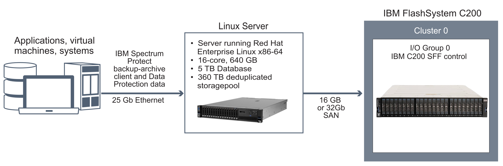

### 3.1 Medium FlashSystem C200 configuration

A medium-scale system is based on IBM FlashSystem C200 storage. One dual control enclosure contain IBM Storage Protect data.

#### 3.1.1 Logical layout

Figure 3 shows the medium system layout and how server and storage hardware is connected to clients. A single cluster and I/O group are used. The medium system configuration was tested by using a SAN switch with 16 Gb Fibre Channel connections and two bonded 10 Gb Ethernet connections. The image depicts a configuration that uses a Lenovo ThinkSystem SR650 server.

#### 3.1.2 Storage configuration

Table 12 and Table 13 show the detailed layouts for MDisk and volume configurations on a medium system. The following array configuration requires the default FlashSystem C200 memory allocation for RAID to be increased, as described in [Step “2”](#medium-system-step-2).

_Table 12. MDisk configuration_

| Server storage requirement | Disk type | Disk quantity | Hot spare coverage | RAID type | RAID array quantity | Usable size | Suggested MDisk group and array names | Usage |
|-------------|---------|------------|-----------|------------|------------|-------------|----------------|-----------|
| Database & Storage pool | FlashCore Module XL | 24 | rebuild-areas = 1 | DRAID6* | 1   24 DDM | Up to 2.3 PBe | flash_grp   flash_array0 | Database, active log, storage pool, archive log, and backups |

\* Distributed RAID 6, stripe width = 12, rebuild areas = 1.  
** Effective capacity will be reduced due to Storage Protect container-pool compression.

_Table 13. Fully allocated volume configuration_

| Server storage requirement | Volume name | Quantity | Uses MDisk group | Size | Intended server mount point | Usage |
|----------------------------|-------------|----------|------------------|------|-----------------------------|-------|
| Database | db_00, db_01, db_02, db_03, db_04, db_05, db_06, db_07 | 8 | flash_grp | 642.1 GB each | /tsminst1/TSMdbspace00   /tsminst1/TSMdbspace01   /tsminst1/TSMdbspace02   /tsminst1/TSMdbspace03   /tsminst1/TSMdbspace04   /tsminst1/TSMdbspace05   /tsminst1/TSMdbspace06   /tsminst1/TSMdbspace07 | Database |
| Database | alog | 1 | flash_grp | 147 GB | /tsminst1/TSMalog | Active log |
| Database | archlog_00 | 1 | flash_grp | 2 TB | /tsminst1/TSMarchlog | Archive log |
| Database | backup_00, backup_01, backup_02 | 3 | flash_grp | 15 TB each | /tsminst1/TSMbkup00   /tsminst1/TSMbkup01   /tsminst1/TSMbkup02 | Database backup |
| Storage pool | filepool00 - filepool11 | 12 | flash_grp | 29.22 TB each | /tsminst1/TSMfile00   /tsminst1/TSMfile01   ...   /tsminst1/TSMfile11 | IBM Storage Protect file systems for a directory-container storage pool |
