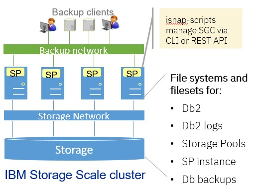
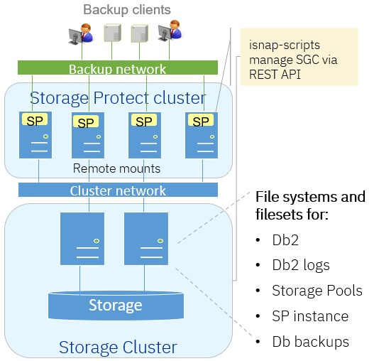

# Consistent SGC for IBM Storage Protect on IBM Storage Scale

-------------------------


## Introduction

This project provides a solution based on scripts (Unix bash) that facilitate the creation and restoration of consistent safeguarded copies (SGC) for IBM Storage Protect server instance storing their data in IBM Storage Scale file systems. In a world where cyber-attacks are widely spreading and becoming faster and faster there is a need for cyber-resilience, also for backup data. The focus of  cyber-resilience is to quickly recover non-infected data after a cyber-attack was detected. 

While the legacy Storage Protect server backup and restore function allows the restoration to a consistent state, it is not fast. For example, the restoration of a Storage Protect server with container pools from tape takes approx. 34 hours for a 200 TB managed data (see IBM Documentation). This solution addresses this and allows to **restore a single Storage Protect instance more than 8 times** faster by leveraging consistent immutable snapshots. At the same time, **the creation of consistent immutable snapshots is more than 50 times faster** than the legaciy Storage Protect backup function.

The use of consistent immutable snapshot to improve cyber resilience of the Storage Protect environment comes for a price: snapshots consume additional storage capacity. For this reason, the storage capacity for immutable snapshots must be planned accordingly (see section [Storage capacity planning](#storage-capacity-planning)). 

In Storage Scale safeguarded copies are called immutable snapshots. Therefore the terms consistent immutable snapshots and safeguarded copies (SGC) are used interchangibly. 

The next section [Architecture](#Architecture) describes the architecture of IBM Storage Protect on IBM Storage Scale, where consistent immutable snapshots are provided using the `isnap-scripts`. 


### License

This project is under [Apache License 2.0](../../LICENSE).


### Architecture

In the architecture with IBM Storage Protect running on IBM Storage Scale multiple IBM Storage Protect server instance can share the same set of file systems provided by IBM Storage Scale. The Storage Protect server instances run on Storage Scale nodes. Each Storage Protect instance uses its own independent fileset in each file system to store data and metadata. This allows to create consistent and immutable snapshots for a particular Storage Protect instance in the relevant file systems and filesets. More importantly it allows fast restore of snapshots for a particular instance. 

There are two topologies for Storage Protect on Storage Scale. In the first topology - shown in figure 1 - the Storage Protect instances run on Storage Scale nodes that are member of the storage cluster. The storage cluster provides the flash and disk storage for the Storage Protect instance data and metadata.



Figure 1: Storage Scale topology in storage cluster


As shown in figure 1, multiple Storage Protect instances run in a single Storage Scale storage cluster. Storage Scale provides highly available and scalable file systems that are used by all Storage Protect instances. Each Storage Protect instance includes a database for metadata and storage pools for backup data. 
Multiple file systems are configured in Storage Scale for different types of Storage Protect data and metadata. For example, there is a file system for the Storage Protect database, one for the database logs, one for the storage pools and one for the instance itself. Within the file system each Storage Protect instance has its own fileset. This allows to create and restore consistent immutable snapshots per Storage Protect instance. 

The `isnap-scripts` provided by the project run on the cluster nodes that host the Storage Protect instances in the storage cluster. In this topology the `isnap-scripts` can use the Storage Scale CLI or REST API to manage consistent immutable snapshots. When using the CLI, then immutable snapshots can be restored manually or automated. Manual restore means that the restore script prints restore instruction on the console and the user must confirm these. Automated restore means that the snapshots are restored automatically without interactions on the console. When the REST API is used, then the restore of immutable snapshots is always done manually (see section [Restore safeguarded copy](#Restore-safeguarded-copy) for more details).


In the second topology - shown in figure 2 - the Storage Protect instances run in a separate Storage Scale cluster (remote cluster). The storage for all data of the Storage Protect instances is provided by a storage cluster. 



Figure 2: Storage Scale topology with remote and storage cluster


As shown in figure 2 multiple Storage Scale instances run in a remote cluster. The remote cluster is a storage-less Storage Scale cluster that remotely mounts the file systems provided by the storage cluster. Each Storage Protect instance uses its own fileset configured in the Storage Scale file systems provided by the storage cluster. This allows to create and restore consistent immutable snapshots per Storage Protect instance.

The `isnap-scripts` provided by the project run on the cluster nodes of the remote cluster. In this topology the `isnap-scripts` use the Storage Scale REST API of the storage cluster to manage consistent immutable snapshots. With the Storage Scale REST API it is not possible to restore immutable snapshots in an automated manner (see section [Restore safeguarded copy](#Restore-safeguarded-copy) for more details).

The advantage of the remote cluster architecture shown in figure 2 is a separation of administrative domains. The servers in the Storage Protect cluster are administered by the Storage Protect administrators, while the Storage Scale file systems and storage are administered by the Storage administrators. The Storage Protect administrators have no access to the file system disk in the Storage cluster, only to the file system itself. Furthermore, a cyber attack on the Storage Protect servers in the remote cluster cannot tamper with the file system resources provided by the storage cluster, because this infrastructure is decoupled from the remote cluster.


**Note:** The remote cluster topology shown in Figure 2 requires the Storage Scale REST API service in the storage cluster. The Storage Scale REST API service is not available for AIX. When using the AIX operating system in the storage cluster, then a GUI node running RHEL or Ubuntu is required providing the Storage Scale REST API service. 


Find below a guidance for planning, installation and configuration as well as a reference for all scripts. 


### Requirements and Limitations

Find below some requirements and limitations for the usage of these scripts with IBM Storage Scale. 

- Supported matrix: 

	| Operating System | OS version | Storage Scale version |
	|------------------|------------|-----------------------|
	| Red Hat Enterprise Linux (RHEL) | 8 and 9 | 5.2.1 and above |
	| AIX | 7 TL 3 | 5.2.3.1 and above |

	**Note:**, the scripts were also tested with Storage Scale version 5.1.9 on RHEL. However, there is a issue when restoring independent filesets that contain nested dependent filesets. For this reason, the recommended Storage Scale version for RHEL is 5.2.1 where this issue was fixed. 

- Storage Protect version 8.1.25 and above are supported

- Storage Scale ESS and Storage Scale software defined deployments are supported

- Single cluster and remote cluster architectures (Storage Protect instances running in remote cluster) are supported

- When Storage Protect instances run in a remote cluster, then the REST API must be used.

- When using the Storage Scale REST API, then it is **not possible** to automatically restore consistent immutable snapshots for a given instance.

- The current implementation uses the Storage Scale REST API version 2. This is the legacy implementation in Storage Scale version 5. 

- Each Storage Protect instance must either have dedicated filesystem or dedicated independent fileset for all instance specific backup data and metadata (see [File system configuration](#File-system-configuration)])

- Nested independent fileset - where the parent of an independent fileset is an independent fileset - are not supported. This is because the snapshot of the parent independent fileset does not snap the date of the nested independent fileset. 

- When using the Storage Scale CLI, then the instance user requires elevated permissions to execute Storage Scale snapshot commands (see [Sudo configuration](#sudo-configuration))

- Storage Protect disk, file and container pools are supported

- Volume reuse delay for Storage Protect storage pools must be set to the retention period of the snapshots plus 1. This especially applies to storage pools that are not snapped, for example copy pools on tape or cloud

- More storage capacity is required in the Storage Scale cluster because snapshots consume storage capacity (see section [Storage capacity planning](#storage-capacity-planning))

- The following extra tools are required:
	- JSON parser `jq` is required to be installed on the Storage Protect servers
	- Bash shell is required
	- Tool `curl` is required
	- Tool `bc` is required


Some requirements are further explained in the [Planning](#Planning) section. 


### Known issues

This section describes known issues:

| Issue | Mitigation |
|-------|------------|
| The Storage Scale REST API does not allow to restore snapshots | There is no mitigation because current implementation of the Storage Scale REST API (version 2) does not provide an endpoint to restore snapshots. Restore must be conducted in a manual way. |
| The creating of consistent immutable snapshots during Storage Protect database backup fails. | This is because both operations cannot be run simultaneously. Define schedules where Storage Protect database backup and creation of snapshots to not overlap |
| ANR9999D occurs intermittently when creating snapshots | There is no mitigation. This issue is related to the `servermon` process that collects statistics from the Storage Protect database. If the database is suspended because a snapshot is created, then the statistic cannot be collected and the ANR9999D occurs. A typical entry in the activity log may look like this: `ANR9999D_2395808121 dbiDbSpaceStats(rdbdb.c:3806) Thread<294>: Unexpected rc 1114 from RdbExecuteSQLToStrings.` |
| Restore of immutable snapshot fails | Examine the message on the console and solve the problem. Re-run the restore script. The restore script can be re-run at any time |
| Snapshots may temporarily be shown after deletion when using the REST API | The REST API has some latency. Wait 2 minutes and list the snapshots again. |
| On AIX, restore of immutable snapshots fails for the Storage Protect instance fileset. A socket file (`tsmdbauth`) cannot be restored. | Ensure that Storage Scale version 5.2.3.1 or above is installed |


------------------------------

## Planning

This section describes planning aspects before implementing the solution.


### Storage capacity planning

Storage Scale snapshots are space efficient upon create and start consuming storage capacity upon changes of files in the file system. Depending on the Storage Protect internal workloads (for example, database, logs, storage pool) the storage capacity consumption can grow significantly. For this reason it is important to plan the storage capacity of the Storage Scale cluster for snapshots accordingly.

The storage capacity consumption of snapshots is influenced by
- number of snapshots created per day
- snapshot retention time - how long snapshots are retained
- Storage Protect database backup schedule


The table below provides an estimate of the storage capacity consumption for snapshots in accordance with the Storage Protect internal workloads for one Storage Protect instance:

| SP workload | Estimated snapshot capacity relative to life data | Note |
|-------------|---------------------------------------------------|------|
| Database | 50 - 100% per snapshot | Depends on frontend and backend activities |
| Active log | 80 - 100% per snapshot | Full active logs are moved to archive logs |
| Archive log  | 50 - 100% per day | Assuming daily Db backup. Archive logs are deleted after Db backup  |
| Storage pools | 20% per day | Assuming 20% daily change rate |
| Db backup | 20% per day | Assuming daily Db backup with 5 days retention |
| Instance home | 50% per snapshot | Db2 diag logs can cause larger consumption |


Life data is the capacity allocated (or planned) in the file system without snapshots. For example, if a snapshot allocates 50% of a 1 TB file system, then the snapshot allocates 0,5 TB. When 5 snapshots are retained, then 2,5 TB (5 x 0,5TB) of additional storage capacity must be planned. 


The next table gives two example about storage capacity consumption for snapshots for a medium-size Storage Protect instance. In the first example two snapshots are created per day and kept over 5 days. In the second example one snapshot is created per day and kept over 10 days. This calculation assumes daily Db backup. 

| Workload | Storage capacity for life data | Estimated per snapshot capacity | Extra capacity with 2 snapshots per day and 5 days retention |	Extra capacity with 1 snapshots per day and 10 days retention |
|----------|------------------|---------------------------------|--------------------------------------------------------------|----------------------------------|
| Database	| 5 TB | 50 – 100 % per snapshot | 25 - 50 TB | 25 - 50 TB |
| Active logs | 147 GB | 80 – 100 % per snapshot | 1176 - 1470 GB	| 1176 - 1470 GB |
| Archive logs | 2 TB | 50 – 100 % per day | 5 – 10 TB | 10 - 20 TB |
| Storage pools | 350 TB |20 % per day | 350 TB | 700 TB |
| Db backup |30 TB | 20 % per day | 30 TB | 60 TB |
| Instance home | 20 GB | 50 % per snapshot | 100 GB | 100 GB |
| **Total capacity** | **287,2 TB** | -- | **411,3 - 441,6 TB** | **796,3 - 931,5 TB** |


As shown in the table above, the total number of snapshots is identical in both examples but the storage capacity consumption in the second example is almost twice as much because the snapshots are retained twice as long compared to the first example. 


The last table gives an example from a customer who has tested this in a production environment. In this example, the logs include active and archive logs. Database backup was done to tape and is not accounted here. There was one snapshot created per day, kept over 8 days.

| Workload | Snapshot capacity relative to life data | Snapshot capacity factor | Used capacity for life data | Additional snapshot capacity |
|----------|-----------------------------------------|--------------------------|-----------------------------|------------------------------|
| Database | 60% per snapshot | 4,8 | 1 TB | 4,8 TB |
| Logs | 83% per snapshot | 6,6 | 0,6 TB | 4 TB |
| Storage pools | 5% per snapshot | 0,4 | 338 TB | 130 TB |
| Instance home |	2% per snapshot | 0,16 | 0,015 TB | 0,002 TB |


As shown in the examples above, storage capacity planning is vital to ensure that file systems and file set do not run out of space due to snapshots.


### Operating system specific tools

The `isnap-scripts` require the following tools to be installed in the operating system of the Storage Protect instance:

- bash:     Shell (all scripts are written in bash), should be installed in `/usr/bin`
- jq:       JSON parser, should be installed in `/usr/bin`
- curl:     interact with REST API, should be installed in `/usr/bin`
- awk:      parse text, should be installed in `/usr/bin`
- bc:		floating point calculator, used in `isnap-fscap.sh`, should be installed in `/usr/bin`


The tools must be executable be the Storage Protect instance users. It is recommended to install these tools prior to installing and configuring the `isnap-scripts`. 

On AIX, some of the tools come with the "AIX Toolbox for Open Source Software". Ensure that the required tools are link to the directory `/usr/bin`. Normally these tools are installed in `/opt/freeware/bin/` and cannot be found by the `isnap-scripts`.


### File system configuration

The `isnap-scripts` for managing consistent safeguarded copies for Storage Protect on Storage Scale require that each Storage Protect instance stores its data and metadate in a independent fileset linked into a Storage Scale file system. An independent fileset allow creating and restoring snapshots just for the independent fileset and not the entire file system. This allows to create and restore snapshots on a Storage Protect instance basis. 

Here is an example of a file system and fileset configuration for two Storage Protect instances (instance 1 and instance 2). It does not matter if these two instances run on the same server or not, as long as they are using the same Storage Scale file systems: 

| File system purpose | File system mount point | Fileset path for Instance 1 | Fileset path for instance 2|
|---------------------|-------------------------|-----------------------------|-----------------------------|
| TSM DB | /gpfs/tsmdb | /gpfs/tsmdb/inst01 | /gpfs/tsmdb/inst02 |
| Active logs | /gpfs/tsmlog | /gpfs/tsmlog/inst01 | /gpfs/tsmlog/inst02 |
| Archive logs | /gpfs/tsmalog | /gpfs/tsmalog/inst01 | /gpfs/tsmalog/inst02 |
| DB backup | /gpfs/tsmbackup | /gpfs/tsmbackup/inst01 | /gpfs/tsmbackup/inst02 |
| Storage pools | /gpfs/tsmstg | /gpfs/tsmstg/inst01  | /gpfs/tsmstg/inst02 |
| Instance | /gpfs/tsminst | /gpfs/tsminst/inst01 | /gpfs/tsminst/inst02 |

As shown in the table above, each instance has its own independent filesets in the file system. For example, `instance 1` has the filesets created in the subdirectory `inst01` of each file system. 

The number of file systems and filesets per instance does not matter with regards to managing immutable snapshots. A single file system and independent fileset per instance is sufficient for managing snapshots on a per-instance basis. Creating multiple filesystems with independent filesets per instance has the advantage that each filesystem can be tuned for the workload. 

Without independent filesets for each instance, the workflows presented below do not work on an per instance basis!! Instead all instance storing data and metadata in the file system are snapped and restored at the same time. 

**Note:** If there are nested independent filesets within an independent fileset, then these nested independent are not included in the snapshot. Therefore, it is not supported to use nested independent fileset. 

If the file system and fileset configuration does not provide independent fileset for each instance in each filesystem, then this must be adjusted before deploying the `isnap-scripts`. Adjusting the configuration may require downtime of the Storage Protect instance. Converting a traditional directory into a fileset may include the following high level steps:

- stop the Storage Protect instance
- rename the original directories to be converted into filesets
- create and link independent filesets under the original directory names
- copy all files from the orgininal directories including permissions and subdirectories (use cp-command, or the Storage Scale command mmxcp for this) to the independent fileset linked under the original directory name
- verify that all files and permission were copied
- start the Storage Protect instance

**Note:** performing this procedure requires more storage capacity, especially for storage pool file directories. Consider to move the files from the original directory to the independent filesets. 


The file system and fileset configuration is required when configuring the `isnap-scripts` (see section [Adjust configuration files](#Adjust-configuration-files)).


### Storage Protect instance and network

The Storage Protect must be error free. 

The Storage Protect instance must be setup to access the relevant file systems and fileset in the Storage Scale file system. In a remote cluster configuration, this requires additional steps to make file systems and filesets avaible from the storage cluster in the remote cluster. 

When the Storage Protect instance runs in the storage cluster, then the `isnap-scripts` can use the CLI or REST API to manage immutable snapshots. When the Storage Protect instance runs in a remote cluster, then the `isnap-scripts` must use REST API of the storage cluster to manage immutable snapshots. 

When using the REST API, then the Storage Protect instance must be able to connect to the Storage Scale REST API of the storage cluster via a network. 


### Storage Scale REST API

The `isnap-scripts` can be configured to use the Storage Scale REST API to manage immutable snapshots. When using the REST API it does not matter if the Storage Protect instance run in the storage cluster or in a remote cluster. 

When using the REST API, then a REST API user with the role `snapAdmin` must be created. Collect the following information for the REST API of the storage cluster. This information is required, when configuring the `isnap-scripts` (see section [Adjust configuration files](#Adjust-configuration-files))

- IP address or IP alias of the REST API server
- IP port of the REST API server
- REST API user name in the `snapAdmin` role
- REST API user password


**Note:** When using the REST API, then the restore is always performed in manual mode. 

**Note:** The Storage Scale REST API service is not available on AIX. Therefore, the remote cluster architecture where Storage Protect instance run in a remote cluster can only be implemented when the storage cluster provides a GUI node for the REST API service. 


### Sudo configuration

When **not using the REST API** to manage manage immutable snapshots, the Storage Protect instance user requires elevated permissions to:
- create immutable snapshots
- list immutable snapshots
- delete immutable snapshots
- restore immutable snapshots
- list filesets in a file system
- send event notifications (optional)

The elevated permissions should be implemented prior to the configuration of the ` isnap-scripts`.

For example, to grant a single instance user (`tsminst1`) the required permission using `sudo`: 

``` 
### Allow a specifig instance user to run snapshot commands and mmsysmonc without password
tsminst1 ALL=(ALL)       NOPASSWD: /usr/lpp/mmfs/bin/mmcrsnapshot,/usr/lpp/mmfs/bin/mmlssnapshot,/usr/lpp/mmfs/bin/mmdelsnapshot,/usr/lpp/mmfs/bin/mmrestorefs,/usr/lpp/mmfs/bin/mmsysmonc,/usr/lpp/mmfs/bin/mmlsfileset

``` 


If there are multiple Storage Protect instance, then the required permissin can be granted for the group of users (`tsmsrvrs`) as shown in the example below:

``` 
### Alternatively allow all users in group tsmsrvrs to run snapshot commands and mmsysmonc without password
%tsmsrvrs ALL=(ALL)       NOPASSWD: /usr/lpp/mmfs/bin/mmcrsnapshot,/usr/lpp/mmfs/bin/mmlssnapshot,/usr/lpp/mmfs/bin/mmdelsnapshot,/usr/lpp/mmfs/bin/mmrestorefs,/usr/lpp/mmfs/bin/mmsysmonc,/usr/lpp/mmfs/bin/mmlsfileset
``` 

The command `/usr/lpp/mmfs/bin/mmsysmonc` is required, when using event notifications (see [Event notification](#Event-notification). 

If a different command than `/usr/bin/sudo` is used for privilege escalation, then the configuration parameter `sudoCommand` can be set to the command that is used in the configuration file `snapconfig.json` (see [Adjust configuration files](#Adjust-configuration-files)).


------------------------------

## Installation and configuration

This section describes the installation and configuration of the scripts associated with this project. 


### Copy and explore scripts

The `isnap-scripts` can be copied or cloned from the gitHub repository. In the example below the scripts are cloned to directory `/tmp`:

```
# git clone https://github.com/IBM/storage-protect-galaxy.git /tmp/
# cd /tmp/storage-protect-galaxy/snap-protect/storage-scale/
# ls -l
```

After cloning the repo, the `isnap-scripts` reside in `/tmp/storage-protect-galaxy/snap-protect/storage-scale/`. The following files are included in this project:

| Filename | Description | More Information |
|----------|-------------|------------------|
| isnap-create.sh  | Creates consistent immutable snapshots on Storage Scale fileset used by the Storage Protect instance | [Create safeguarded copy](#Create-safeguarded-copy) |
| isnap-delete.sh  | Deletes expired consistent immutable snapshots for Storage Protect instance. | [Delete safeguarded copy](#Delete-safeguarded-copy) |
| isnap-fscap.sh   | Prints file system and snapshot capacity allocation | [Filesystem statistics](#Filesystem-statistics) |
| isnap-list.sh    | Lists all consistent immutable snapshots for the Storage Protect instance | [List safeguarded copy](#List-safeguarded-copy) |
| isnap-restore.sh | Restores consistent immutable snapshots for the Storage Protect instance | [Restore safeguarded copy](#Restore-safeguarded-copy) |
| isnap-wrapper.sh | Wraps the other `isnap-scripts`, can be used with schedulers | [Wrapper script](#Wrapper-script) |
| snapconfig.json | Configuration file describing the Storage Protect instance configuration and REST API connection | [Adjust configuration files](#Adjust-configuration-files) |


The script files (`*.sh`) are further described in sectio [Workflows and scripts](#Workflows-and-scripts). The configuration file (`snapconfig.json`) is described in the next section [Adjust configuration files](#Adjust-configuration-files).


### Copy files to common directory

Copy the `isnap-scripts` to a directory with read and execute permissions for the Storage Protect instance users or group. In the example below the scripts are copied to the directory `/usr/local/bin` and permissions are adjusted allowing the instance user group read and execute:

```
# cd /tmp/storage-protect-galaxy/snap-protect/storage-scale/
# cp * /usr/local/bin/
# cd /usr/local/bin
# chmod +x isnap-*.sh
# chown instUser:instUserGroup isnap*.sh
# chown instUser:instUserGroup snapconfig.json
# chown root:root isnap-wrapper.sh
```


Replace  `instUser` and `instUserGroup` with the user and group name of the instance users. Find below an example of the permission and ownership for the `isnap-scripts` whereby the instance user name is `tsminst1` and the instance user group is `tsmsrvrs`:

```
-rw-r--r--. 1 tsminst1 tsmsrvrs  snapconfig.json
-rwxr-xr-x. 1 tsminst1 tsmsrvrs  isnap-create.sh
-rwxr-xr-x. 1 tsminst1 tsmsrvrs  isnap-delete.sh
-rwxr-xr-x. 1 tsminst1 tsmsrvrs  isnap-fscap.sh
-rwxr-xr-x. 1 tsminst1 tsmsrvrs  isnap-list.sh
-rwxr-xr-x. 1 tsminst1 tsmsrvrs  isnap-restore.sh
-rwxr-xr-x. 1 root     root      isnap-wrapper.sh
```


Add the script path (e.g. `/usr/local/bin`) to the `$PATH` variable of the instance user.


**Note:** all `isnap-scripts` including the configuration file `snapconfig.json` must be copied into the same directory on all Storage Protect instances.

**Do not copy the files to the Storage Protect instance user home directory, because this directory will be overwritten upon restore.**


### Adjust configuration files

The configuration of each Storage Protect instance is described in the configuration file `snapconfig.json`. For each Storage Protect instance a set of configuration parameters is required. Find below the configuration parameters for each instance. The column `Required` indicates if this parameter is required (`yes`) or not. Optional configuration parameters have default values that can be overwritten in the configuration file.


| Parameter | Description | Required | Example |
|-----------|-------------|---------|---------|
| instName | Instance name, corresponds to the instance user | yes | tsminst1 |
| snapPrefix | Name prefix of the snapshot, used to create and restore snapshot	| yes | tsminst1-snap |
| dirsToSnap | file system name and fileset name, used to create and restore snapshot. If fileset name is not given, global snapshot are used. | yes |	fsname+fsetname  |
| snapRetention | Retention time in days for the snapshot, default is 0 days. Snapshots cannot be deleted during retention time	| no | 5 |
| dbName | Name of the Db2, default is TSMDB1 | no | TSMDB1 | 
| serverInstDir | Instance directory of the server (where dsmserv.opt resides). Must only be specified if different to instance user home. Default is instance user home directory.	| no | /tsminst/inst01/home |
| sudoCommand | Full qualified path of command used by the instance user run other commands with root privileges. Default is `/usr/bin/sudo`. | no | /usr/bin/dzdo |
| autoRestore | Controls if restore is done automatically or manually when using the CLI. When REST API is used, then restore is always done manually, regardless of the setting of `autoRestore`. Default is `false` (manual restore) | no | true or false (lower case) |
| apiServerIP | IP address or host name of the REST API server. If this parameter is set, then the REST API is used instead of the CLI. | when API is used | x.x.x.x |
| apiServerPort | IP port of the REST API server. Required if `apiServerIP` is set. Default is 443 | when API is used | 443 |
| apiCredentials | REST API user and password encoded in base64 as User:Password. Required if `apiServerIP` is set.  | when API is used | YWRtaW46VGVzdDEyMzRhIQ== |


When the parameters `apiServerIP`, `apiServerPort` and `apiCredentials` are defined in the configuration file, then the Storage Scale REST API is used instead of the command line. When the REST API is used, then the restore of immutable snapshots is always done manually (see section [Restore safeguarded copy](#Restore-safeguarded-copy) for more details).


The configuration parameter for each Storage Protect instance is described as a JSON-formatted objects in the configuration file `snapconfig.json`. Here is an example for the configuration file for two instances (`tsminst1` and `tsminst2`). The instance `tsminst1` is configured to use the REST API, while instance `tsminst2` is configured to use the CLI in automatic restore mode. The parameter `dirsToSnap` includes the file system and fileset name for each instance individually in the form: `fsName+fsetName`:

```
[
	{
		"instName": "tsminst1",
		"dbName": "TSMDB1",
		"snapPrefix": "tsminst1-snap",
		"snapRetention": "4",
		"serverInstDir": "/tsminst/inst01/home",
		"sudoCommand": "/usr/bin/sudo",
		"apiServerIP": "REST API server IP",
		"apiServerPort": "REST API server IP, default is 443",
		"apiCredentials": "base64 encoded API user User:Password",
		"dirsToSnap": ["tsmdb+inst01", "tsmlog+inst01", "tsmalog+inst01", "tsmstg+inst01", "tsminst+inst01", "tsmbackup+inst01"]
	},
	{
		"instName": "tsminst2",
		"dbName": "TSMDB1",
		"snapPrefix": "tsminst2-snap",
		"snapRetention": "4",
		"serverInstDir": "/tsminst/inst02/home",
		"sudoCommand": "/usr/bin/sudo",
		"autoRestore": true
		"dirsToSnap": ["tsmdb+inst02", "tsmlog+inst02", "tsmalog+inst02", "tsmstg+inst02", "tsminst+inst02", "tsmbackup+inst02"]
	}
]
``` 

The configuration file must be stored in the same directory along with the `isnap-scripts` (e.g., `/usr/local/bin`). It must have read permissions for the instance users or instance user group. 


### Obtain REST API credentials 

When the Storage Scale REST API is used for managing consistent immutable copies, then a REST API user in the `snapAdmin` role must be created. The following Storage Scale CLI command creates a user `snapadmin` with the role `SnapAdmin`:

```
/usr/lpp/mmfs/gui/cli/mkuser snapadmin -p <password> -g SnapAdmin
```

To use the API user credentials, the username and password must be base64 encoded. The following command encodes the username `user` and password `secret` in base64, the resulting string can be used as value for the parameter `apiCredentials` in the configuration file:

```
echo -n user:secret | base64
dXNlcjpzZWNyZXQ=
```

It is recommended to test the API connection from the servers where the scripts are installed. The following example gets the cluster configuration using the REST API. The base64 encoded credential is following the string `Authorization: Basic`:

```
curl -k -X GET --header 'Accept: application/json' --header 'Authorization: Basic [base64-encoded-user:secret]' 'https://GUI-Server:GUI-Port/scalemgmt/v2/cluster'
```


### Adjust sudo configuration

To create consistent immutable snapshots for a Storage Protect instance, the Storage Protect Db2 of the instance must be suspended and resumed. For the restoration of snapshots the Storage Protect instance Db2 must be restarted and resumed. These steps require authorization to perform Db2 commands. By default, the instance user is authorized to connect to the instance Db2 and perform Db2 commands. Therefore, the instance user can create and restore snapshots for its instance.

The creation and restoration of immutable snapshots in Storage Scale via command line requires elevated privileges for the instance user. Elevated privileges are not required when using the Storage Scale REST API to manage snapshots. To provide the instance user with elevated privileges to manage snapshots in Storage Scale the sudo-configuration can be used. Adjusting the sudo-configuration requires root-privileges. The following example provides the instance user `tsminst1` the required privileges:

``` 
### Allow a specifig instance user to run snapshot commands and mmsysmonc without password
tsminst1 ALL=(ALL)       NOPASSWD: /usr/lpp/mmfs/bin/mmcrsnapshot,/usr/lpp/mmfs/bin/mmlssnapshot,/usr/lpp/mmfs/bin/mmdelsnapshot,/usr/lpp/mmfs/bin/mmrestorefs,/usr/lpp/mmfs/bin/mmsysmonc,/usr/lpp/mmfs/bin/mmlsfileset
```

Alternatively, the user group of all instance users can be allowed to manage snapshots:

```
### Alternatively allow all users in group tsmsrvrs to run snapshot commands and mmsysmonc without password
%tsmsrvrs ALL=(ALL)       NOPASSWD: /usr/lpp/mmfs/bin/mmcrsnapshot,/usr/lpp/mmfs/bin/mmlssnapshot,/usr/lpp/mmfs/bin/mmdelsnapshot,/usr/lpp/mmfs/bin/mmrestorefs,/usr/lpp/mmfs/bin/mmsysmonc,/usr/lpp/mmfs/bin/mmlsfileset
``` 

In addition consider to provide the path of the Storage Scale commands as `secure_path` in the sudo configuration. This eliminates the need to spell out the path for each command:

``` 
### add /usr/lpp/mmfs/bin to secure_path
Defaults    secure_path = /sbin:/bin:/usr/sbin:/usr/bin:/usr/lpp/mmfs/bin
```

**Note:** To leverage event notification (see [Event notification](#Event-notification)), the command `/usr/lpp/mmfs/bin/mmsysmonc` must also be allowed for the instance user.  

**Note:** If a different command than `/usr/bin/sudo` is used for privilege escalation, then the configuration parameter `sudoCommand` can be set to the command that is used in the configuration file `snapconfig.json` (see [Adjust configuration files](#Adjust-configuration-files)).

If the snapshots are managed via the REST API, then the instance user does not need the sudo-privileges for the CLI based snapshot commands. 


### Configure custom event notification

The creation and deletion of consistent immutable snapshot is usually automated via scheduler. When the creation or deletion of consistent immutable snapshots fails, then an event can be raised with the Storage Scale system health monitoring. This event is visible in the GUI and can be forwarded to the datacenter monitoring infrastructure via SNMP, email or webhooks. This way the administrator is immediatelly informed. 

Storage Scale allows [creating and raising custom events](https://www.ibm.com/docs/en/storage-scale/5.2.3?topic=STXKQY_5.2.3/com.ibm.spectrum.scale.v5r10.doc/bl1adv_createuserdefinedevents.htm). This is based on a custom event definitions in JSON format in file `custom.json`. Find below an example of events defined in `custom.json`:

```
{
"snap_warn":{
       "cause":"Creating consistent snapshots ended with warnings.",
        "user_action":"Investigate the error message and logs.",
        "scope":"NODE",
        "code":"cu_1803",
        "description":"Creating snapshots using the isnap-create script ended with warnings.",
        "event_type":"INFO",
        "message":"Warning creating snapshot for instance {0}. Message: {1}",
        "severity":"WARNING"
 },
"snap_fail":{
       "cause":"Creating consistent snapshots ended with errors. ",
        "user_action":"Investigate the error message and logs.",
        "scope":"NODE",
        "code":"cu_1804",
        "description":"Creating snapshot using the isnap-create script ended with errors. Investigate the error message and logs.",
        "event_type":"INFO",
        "message":"Error creating snapshot for instance {0}. Message: {1}",
        "severity":"ERROR"
 },
"delsnap_fail":{
       "cause":"Deleting snapshot(s) failed.",
        "user_action":"Investigate the error message and logs.",
        "scope":"NODE",
        "code":"cu_1805",
        "description":"Deleting snapshot using the isnap-del script ended with errors. Investigate the error message and logs.",
        "event_type":"INFO",
        "message":"Error deleting snapshot for instance {0}. Message: {1}",
        "severity":"ERROR"
 }
}
```

The custom event definition must be installed on all Storage Scale nodes running Storage Protect instance. Or in other words, on all nodes where the `isnap-scripts` are installed. Peform the following steps: 
- Copy the file `custom.json` to `/var/mmfs/mmsysmon/` and create a symlink to this file under `/usr/lpp/mmfs/lib/mmsysmon/`.
- Next restart the Storage Scale monitoring services `systemctl restart mmsysmon.service`
- Restart the GUI service on the Storage Scale GUI node: `systemctl restart gpfsgui.service` 

Once the custom events are installed on all Storage Protect nodes, test if the events are working:

```
mmhealth event show snap_fail
mmhealth event show snap_warn
mmhealth event show delsnap_fail
```

The scripts `isnap-create.sh` and `isnap-del.sh` raise custom events using the Storage Scale command `mmsysmonc`. This requires the instance user to have privileges to run the `mmsysmonc` command (see [Sudo configuration](#Sudo-configuration)). By default, the command to raise events (`mmsysmonc`) is commented out in the scripts. 


### Test the scripts

To test the scripts change to the instance user (for example `tsminst1`) and test the scripts:

```
# su - tsminst1
$ isnap-list.sh
$ isnap-create.sh --help
$ isnap-restore.sh --help
```

If the scripts are not found, then add the path where the scripts are installed (e.g. `/usr/local/bin`) to the `PATH` variable. This can be done in the file `.profile` located in the home directory of the instance user. To add the path `/usr/local/bin` to the path variable, add the following lines to `.profile`:

```
PATH=$PATH:/usr/local/bin
export PATH
```

Subsequently, source the `.profile`:

```
$ source .profile
```


### Create schedules

The creation and deletion of consistent immutable snapshots can be scheduled with different methods, such as system scheduler like `cron`, Storage Protect client schedules or external schedulers. The creation of consistent immutable snapshots must be executed by the instance user (for example `tsminst1`), hence the schedule must be created in the context of the instance user. 

**Note:** Do not schedule the consistent immutable snapshots creation at the same time when a Storage Protect Db backup is executed or during heavy backup or housekeeping workloads!!


#### Scheduling with cron

Schedules with `cron` must be defined on all servers where Storage Protect instances are running. Each Storage Protect can have its own schedule. This also requires that the `isnap` scripts are installed on all servers hosting Storage Protect instances. 

The example below creates an consistent immutable snapshots every day at midnight using `isnap-create.sh` (see [Create safeguarded copy](#Create-safeguarded-copy)). Adjust the setting of `home-directory-of-instance-user` for parameters `HOME` and `BASH_ENV`. If the scripts are stored in a different directory than `/usr/local/bin`, then adjust the directory as well:


```
# su - tsminst1
$ crontab -e

SHELL=/bin/bash
HOME=[/home-directory-of-instance-user]
PATH=/sbin:/bin:/usr/sbin:/usr/bin:/usr/local/bin
BASH_ENV=[/home-directory-of-instance-user].profile
MAILTO=root

# create snapshot at midnight every day
00 00 *  *  * /usr/local/bin/isnap-create.sh -r >> /tmp/snaplogs/tsminst1-snapcreate.log 2>&1
```

An alternative way to schedule the creation of consistent immutable snapshots is to source the `profile` of the instance user prior to executing `isnap-create.sh`:

```
# create snapshot at midnight every day
00 00 *  *  * source [/home-directory-of-instance-user].profile; /usr/local/bin/isnap-create.sh -r >> /tmp/snaplogs/tsminst1-snapcreate.log 2>&1
```


Consistent immutable snapshots that are expired based on the snapshot retention time can be deleted. The snapshot retention time is configured in the configuration file as parameter `snapRetention` (see [Adjust configuration files](#Adjust-configuration-files)). To accommodate the automated deletion of SGC that are older than the retention time, the script `isnap-del.sh` is used (see [Delete safeguarded copy](#Delete-safeguarded-copy)). The example below deletes SGC that are older than 10 days. 

```
# delete snapshots older than 10 days at 00:00
15 00 * * * /usr/local/bin/isnap-del.sh -i tsminst1 -g 10 >> /tmp/snapdel/tsminst1-snapdel.log 2>&1
```

**Note:** the age of the snapshot given with the parameter `-g` must be equal or greater than the snapshot retention time given in configuration parameter `snapRetention`. 


#### Scheduling with Storage Protect client schedules

The Storage Protect scheduler can be used to schedule the creation and deletion of consistent SGC. This requires two additional components on all servers running Storage Protect instances that are snapped:

- `isnap-wrapper.sh` script that is invoked by the client schedule and runs the appropriate `isnap` script (see [Wrapper script](#Wrapper-script)).
- Storage Protect client acceptor daemon `dsmcad`


On the Storage Protect server, install `isnap-wrapper.sh` script along with all other `isnap-scripts` in a directory with execute permissions for the root user and the instance users or group (e.g., `/usr/local/bin`)


In the Storage Protect instance register client node for scheduling. The client node name in this example is `isnap-scheduler`:

```
> REGISTER NODE ISNAP-SCHEDULER ?***? USERID=NONE DOMAIN=STANDARD EMAILADDRESS=admin@my-company.org CONTACT=admin-name
```


In the Storage Protect instance create the client schedule for node `isnap-scheduler`. In the following example a schedule for SGC creation (`isnap-create`) starting daily at 5 AM and a schedule for SGC deletion (`isnap-delete`) starting daily at 6 AM are defined. The command executed by the schedule is `isnap-wrapper.sh` which wraps the `isnap-scripts` (see [Wrapper script](#Wrapper-script)). The scripts are installed in `/usr/local/bin` in this example:

```
> DEFINE SCHEDULE STANDARD isnap-create action=command objects='/usr/local/bin/isnap-wrapper.sh -i tsminst1 -c' startt=05:00
> DEFINE SCHEDULE STANDARD isnap-delete action=command objects='/usr/local/bin/isnap-wrapper.sh -i tsminst1 -d 5' startt=06:00
> DEFINE ASSOCIATION standard ISNAP-CREATE ISNAP-SCHEDULER
> DEFINE ASSOCIATION standard ISNAP-DELETE ISNAP-SCHEDULER
``` 

On the server, configure client acceptor daemon. First, add the following stanza to dsm.sys. This stanze references the previously create client node `isnap-scheduler` which is used in Storage Protect to execute the client schedule: 


```
	*  ========================ISNAP-SCHEDULER=============================
	Servername              isnap-scheduler
	NODename                isnap-scheduler
	PASSWORDAccess          generate
	PASSWORDDIR             /opt/tivoli/tsm/client/ba/bin/tsmpwd
	
	TCPServeraddress        server1.ibm.lab
	TCPPort                 1500
	COMMMethod              TCPip
	
	SCHEDMODe               PRompted
	MANAGEDSERVICES         SCHEDULE
	TCPCLIENTPort           1501
	ERRORLOGRetention       90
	SCHEDLOGRetention       90
	SCHEDLOGName            /opt/tivoli/tsm/client/ba/bin/dsmsched-isnap-scheduler.log
	ERRORLOGName            /opt/tivoli/tsm/client/ba/bin/dsmerror-isnap-scheduler.log
```

Second create an option file that references the server name `isnap-scheduler`. In this example, the option file is named `dsm_isnap-scheduler.opt`:

```
	Servername isnap-scheduler
```

Now, install and configure the client acceptor daemon (`dsmcad`)

```
cp /opt/tivoli/tsm/client/ba/bin/rc.dsmcad /opt/tivoli/tsm/client/ba/bin/rc.dsmcad.isnap-scheduler

vi /opt/tivoli/tsm/client/ba/bin/rc.dsmcad.isnap-scheduler
	==> replace all "daemon $DSMCAD_BIN" with "daemon $DSMCAD_BIN -optfile=/opt/tivoli/tsm/client/ba/bin/dsm_isnap-scheduler.opt"

ln -s /opt/tivoli/tsm/client/ba/bin/rc.dsmcad.isnap-scheduler /etc/rc.d/init.d/dsmcad.isnap-scheduler
```


Initialize the Storage Protect client node `isnap-scheduler` by manually running the Storage Protect client once in the foreground:

```
# /opt/tivoli/tsm/client/ba/bin/dsmc -optfile=/opt/tivoli/tsm/client/ba/bin/dsm_isnap-scheduler.opt
```

This will prompt to enter user ID and password. Press enter when asked for the user ID and enter the password that was set when the node was registered in the server. This will save the password file under the user's home directory or configured password location.


Start and enable the client acceptor daemon service:

```
# Start DSMCAD for scheduling
#########################################

# systemctl enable dsmcad.isnap-scheduler
# systemctl start dsmcad.isnap-scheduler
# systemctl status dsmcad.isnap-scheduler
```


Test and monitor the client schedules. The `isnap-wrapper.sh` scripts stores log files by default in `/var/log/isnap`. The client acceptor stores log files in `/opt/tivoli/tsm/client/ba/bin/dsmsched-isnap-scheduler.log` (as provided as parameter `SCHEDLOGName` in file `dsm.sys` above.)


------------------------------

## Workflows and scripts

This section describes the workflows and scripts implementing these workflows. All scripts require a valid configuration file `snapconfig.json`, see section [Adjust configuration files](#Adjust-configuration-files) for more details. 

All scripts and the configuration file are stored in a common directory that has read and execute permissions for the instance users or group (e.g., `/usr/local/bin`). 


### Create safeguarded copy

Safeguarded copies are created using the script [isnap-create.sh](isnap-create.sh). This script must be run in the environmental context of the instance user, because it requires interactions with the Storage Protect database. 

The creation of safeguarded copies runs in three phases:

- **Phase 1:** Check configuration parameter and that Storage Protect instance is running, connect to the instance Db2 and write suspend the Db2. 
- **Phase 2:** Freeze file systems, create SGC for all relevant filesets using the `mmcrsnapshot` command.
- **Phase 3:** Unfreeze file sysetms and resume the Db2 of the instances. 


The `isnap-create.sh` script requires the configuration file `snapconfig.json` to be stored the same directory with read and execute permission for the instance users or group.  

The Storage Protect instance must be running. 

If the configuration parameter `apiServerIP` is specified, then the Storage Scale REST API is used. 

**Syntax:**

```
isnap-create.sh -r | --run 
	-r | --run: performs the workflow to create consistent snapshots (required)
```


This script creates SGC for all relevant filesets defined as parameter `dirsToSnap` in the configuration file `snapconfig.json`. The name of the SGC created at a given point in time is composed from the `snapPrefix` parameter and the current time stamp. The retention time configured in parameter `snapRetention` is applied for all SGC.

If the Storage Protect server instance is not running, or the script is executed on a node where the Storage Protect instance does not run, then no safeguarded copy is created. 

The script writes runtime information to standard out. 


### Restore safeguarded copy

Safeguarded copies are restored using the script [isnap-restore.sh](isnap-restore.sh). This script must be run in the environmental context of the instance user, because it requires interactions with the Storage Protect database. 

The restoration of safeguarded copies runs in three phases:

- **Phase 1:** Check that the instance is down, restore the SGC for all relevant Storage Scale filesets using the `mmrestorefs` command.
- **Phase 2:** Restart the instance Db2 and resume the instance Db2.  
- **Phase 3:** Start the Storage Protect instance in foreground and in maintenance mode.


**Attention:** The script must be exectured as instance user on the server where the instance was running. The script requires that the instance is stopped. When running the script on one server while the instance is running on another server, the script does not detect this and performs the restore operation while the instance may be running on another server. This will cause the instance to become unavailable and potentially corrupted.

**Syntax:**

```
isnap-restore.sh snapshot-name | -h | --help
	snapshot-name: specifies the name of the snapshot to be restored. 
	-h | --help:   show the syntax
```

The script does not perform the restore under the following conditions

- Configuration parameters in the configuration are not valid
- Storage Protect instance is still running on the server
- Storage Scale REST API does not have the role `Snapshot Administrator`
- Snapshot to be restored does not exist on all filesets


Depending on the parameter configure in `snapconfig.json` the snapshot restore in performed in automated or in manual mode. In general, if the REST API is configured in the configuration file, then the restore in performed in manual mode, regardless of the setting of parameter `autoRestore` (see [Restore in automated mode](#Restore-in-automated-mode)). If the command line (CLI) is used, then the setting of parameter `autoRestore` is considered. If the parameter `autoRestore` is set to `true` then the restore in done in automated mode (see [Restore in manual mode](#Restore-in-manual-mode)). If the parameter is set to `false` then the restore is done in manual mode. For more information about configuration parameters see [Adjust configuration files](#Adjust-configuration-files).


#### Restore in automated mode

Automated restore can only be done when the REST API is not configured in the configuration file and the parameter `autoRestore` is set to `true`. In automated mode all three phases are executed automatically. Command output is written to the console. 

If the restore in automated mode fails, then check the command outputs on the console, correct the problem and run the restore again. 


#### Restore on manual mode

If the REST API configured in the configuration file or if the REST API is not configured in the configuration and the parameter `autoRestore` is set to `false`, then the restore in executed in manual mode. In manual mode the user obtains instruction for the restore on the console. During manual restore the following steps are performed:

- validate configuration parameter in the configuration file
- ensure that the instance is not running on the server. If the instance is running, then the restore is aborted.
- ensure that the snapshot to be restore exists on all file systems and filesets
- instruct the user to restore the snapshots by providing the necessary commands. The user must executed these commands with a privileged user and confirm the successful execution in the console.
- show information about mounted filesystems and fileset and instruct the user to check if the required filesystems are mounted and filesets are linked. The user must confirm the checks on the console.
- show information about the instance configuration
- instruct the user to start the database manager, resume the database and start the instance in maintenance mode
- once the instance was successfully started in maintenance mode, the user can perform necessary checks such as audit storage pools and devices. Once these checks are successfull, the user can `halt` the instance in maintenance mode and start the instance in normal mode. 


If the restore in manual mode fails, then check the command outputs on the console, correct the problem and run the restore again. 


#### General restore considerations

If the server instance directory is different than the instance user home directory, then the variable `serverInstDir` must be set to the server instance directory path in the configuration file (see [Adjust configuration files](#Adjust-configuration-files)). Otherwise, starting the Storage Protect instance in maintenance mode does not work. 

When using the Storage Scale REST API, then the API user must have the role `snapshot administrator`. 

The `isnap-restore.sh` script requires the configuration file `snapconfig.json` to be stored the same directory with read and execute permission for the instance users or group. 

The Storage Protect instance must not be running when running the scripts.


**Note:** If there are nested independent filesets within the independent fileset to be snapped, then these nested independent are not included in the snapshot. Therefore, it is not supported to use nested independent fileset. 

**Note:** If quota is enabled on file systems and filesets, then the snapshot restore may fail. Disable quota prior to restore and enable quota after the snapshot restore. Alternatively, unmount the file system and perform the snapshot restore. 

**Note:** When running `isnap-restore.sh` in automated mode (no REST API is used or `autoRestore=false`) and the instance home directory is not accessible, then it requires to run `isnap-restore.sh` two times. The first time `isnap-restore.sh` restores the instance home directory but fails to start the db2 because it could not source the environment initially. Prior running `isnap-restore.sh` a second time, login as instance user again to source the environment. After the second run, the db2 will be started, set to write resume and the instance is started in maintenance mode. 
Alternatively, the instance can be started manually, after the first run. Make sure that the first run restored the snapshots and perform the following steps:
- Logout as instance user
-	Login as instance user
- Run: `db2start`
- Run: `db2 restart db $dbName write resume`
- If the server instance directory is different to instance user home, then change to the server instance directory
- Run: `dsmserv maintenance`

After the instance started in maintenance mode and was verified, then halt the instance and start it normally. 


### List safeguarded copy

Safeguarded copies are listed by Storage Protect instance using the script [isnap-list.sh](isnap-list.sh). The script can be executed by any user who has permissions to execute it. When not executed by the instance user, then the command line parameter `-i instance-name` must be provided. 

The script uses the command `mmlssnapshot`. If the configuration parameter `apiServerIP` is specified, then the Storage Scale REST API is used. 

The `isnap-list.sh` script requires the configuration file `snapconfig.json` to be stored the same directory with read and execute permission for the instance users or group. 


**Syntax:**

```
isnap-list.sh [-i instance-user-name -s snapshot-name -v -h | --help]
	-i instance-user-name: 	Name of the instance (user) for which the snapshots are listed (optional, default is user running this command).
	-s snapshot-name:      	Snapshot name to be listed (checked) for all relevant file systems and filesets (optional, lists all snapshot by default).
	-v:                    	Show allocated blocks (optional, does not work with REST API)
	-h | --help:			Show this help message (optional).
```


The script lists the snapshots for each file system and fileset configured for the instance. The parameter `-v` shows the allocated capacity for each snapshot. This parameter `-v` only works when the CLI is used. It does not work with the REST API, because the REST API endpoint does not provide capacity information. Here is an example of the output:

```
Snapshots in file system tsmdb: [data and metadata]
Directory                SnapId    Status  Created                   ExpirationTime            Fileset           Data  Metadata
tsminst2-20241105050005  663       Valid   Tue Nov  5 05:00:43 2024  Thu Nov  7 05:00:05 2024  srv02           1.465G    7.547M
tsminst2-20241106050005  664       Valid   Wed Nov  6 05:00:43 2024  Fri Nov  8 05:00:05 2024  srv02           1.483G    7.547M

Snapshots in file system tsmlog: [data and metadata]
Directory                SnapId    Status  Created                   ExpirationTime            Fileset           Data  Metadata
tsminst2-20241105050005  662       Valid   Tue Nov  5 05:00:44 2024  Thu Nov  7 05:00:05 2024  srv02           6.504G     6.75M
tsminst2-20241106050005  663       Valid   Wed Nov  6 05:00:43 2024  Fri Nov  8 05:00:05 2024  srv02            5.58G    6.688M

Snapshots in file system tsmalog: [data and metadata]
Directory                SnapId    Status  Created                   ExpirationTime            Fileset           Data  Metadata
tsminst2-20241105050005  662       Valid   Tue Nov  5 05:00:37 2024  Thu Nov  7 05:00:05 2024  srv02           2.902G     3.25M
tsminst2-20241106050005  663       Valid   Wed Nov  6 05:00:37 2024  Fri Nov  8 05:00:05 2024  srv02           2.877G     3.25M

Snapshots in file system tsmstg: [data and metadata]
Directory                SnapId    Status  Created                   ExpirationTime            Fileset           Data  Metadata
tsminst2-20241105050005  662       Valid   Tue Nov  5 05:00:38 2024  Thu Nov  7 05:00:05 2024  srv02           32.31G    20.53M
tsminst2-20241106050005  663       Valid   Wed Nov  6 05:00:38 2024  Fri Nov  8 05:00:05 2024  srv02           32.28G    20.31M

Snapshots in file system tsminst: [data and metadata]
Directory                SnapId    Status  Created                   ExpirationTime            Fileset           Data  Metadata
tsminst2-20241105050005  662       Valid   Tue Nov  5 05:00:39 2024  Thu Nov  7 05:00:05 2024  srv02           39.34M    17.28M
tsminst2-20241106050005  663       Valid   Wed Nov  6 05:00:38 2024  Fri Nov  8 05:00:05 2024  srv02           29.39M    17.28M

Snapshots in file system tsmbackup: [data and metadata]
Directory                SnapId    Status  Created                   ExpirationTime            Fileset           Data  Metadata
tsminst2-20241105050005  671       Valid   Tue Nov  5 05:00:46 2024  Thu Nov  7 05:00:05 2024  srv02           7.221G     5.25M
tsminst2-20241106050005  672       Valid   Wed Nov  6 05:00:45 2024  Fri Nov  8 05:00:05 2024  srv02           7.112G     5.25M

```

**Note:** Parameter `-s snapshot-name` can be used to check if a particular snapshot exists on all file systems and filesets. 


### Delete safeguarded copy

Safeguarded copies can be deleted for a Storage Protect instance using the script [isnap-del.sh](isnap-del.sh). The script can be executed by any user who has permissions to execute it. When not executed by the instance user, then the command line parameter `-i instance-name` must be provided. 
**Notes:** Safeguarded copies cannot be deleted unless they are expired. 

The script uses the command `mmdelsnapshot`. If the configuration parameter `apiServerIP` is specified, then the Storage Scale REST API is used. 

The `isnap-del.sh` script requires the configuration file `snapconfig.json` to be stored the same directory with read and execute permission for the instance users or group. 

**Syntax:**

```
isnap-del.sh -s snapshot-name | -g snapshot-age [-i instance-user-name -p]
  -s snapshot-name:      Name of the snapshot to be deleted from all file systems (mutually exclusive with option -g)
  -g snapshot-age:       Age of snapshots in days to be deleted from all file systems (mutually exclusive with option -s)
  -i instance-user-name: Instance user name, default is the user running this script. 
  -p:                    Preview snapshot names to be deleted from all file systems (optional). Does not deleted snapshots, just lists the snapshots to be deleted. 
```

The snapshot(s) to be deleted can either be specified with the snapshot name (parameter `-s snap-name`) or with the age of the snapshot in days (parameter `-g snap-age`). When specifying snapshot age, then all snapshots are deleted that are older than `snap-age` days relative to the date and time when the script is executed. The date and time in (hh:mm:ss) is taken into account. 

Preview mode (parameter `-p`) allows to preview the snapshots that would be deleted, but does not actually delete snapshots. 

The scripts writes runtime information to standard out. 


### Filesystem statistics

File system usage information can be displayed using the script [isnap-fscap.sh](isnap-fscap.sh). The script can be executed by any user who has permissions to execute it. When not executed by the instance user, then the command line parameter `-i instance-name` must be provided. 

The `isnap-fscap.sh` script requires the configuration file `snapconfig.json` to be stored the same directory with read and execute permission for the instance users or group. 


**Syntax:**

```
Syntax: isnap-fscap.sh [-i instance-user-name]
  -i instance-user-name: instanz name to the fileset capacities
```

The latest version of `isnap-fscap.sh` calculates the capacity occupied in the filesystems or filesets without SGC and the capacity occupied by all SGC for the subject filesystem or fileset. It further calculates an extra capacity factor using the formula: 

`(capacity in SGC / (capacity in fileset - occupied capacity in SGC)

The intention of the factor is to reflect the amount of extra capacity required for the filesystems or filesets. Here is an example of the output:

```
INFO: Wed Sep 10 16:59:37 CEST 2025 program /usr/local/bin/isnap-fscap.sh version 1.4 started by root
INFO: Wed Sep 10 16:59:38 CEST 2025 Getting capacity statistic for all filesystems of instance tsminst3 via command line.

Timestamp                     FS-Name     FS-capacity [GB] Snap-capacity [GB]          Factor
2025-09-10@16:59:42             tsmdb                 2.74               5.52            2.01

Timestamp                     FS-Name     FS-capacity [GB] Snap-capacity [GB]          Factor
2025-09-10@16:59:44          tsmctlog                15.83              33.71            2.12

Timestamp                     FS-Name     FS-capacity [GB] Snap-capacity [GB]          Factor
2025-09-10@16:59:45           tsmalog                 6.08              15.35            2.52

Timestamp                     FS-Name     FS-capacity [GB] Snap-capacity [GB]          Factor
2025-09-10@16:59:47            tsmstg               444.00             243.75            0.54

Timestamp                     FS-Name     FS-capacity [GB] Snap-capacity [GB]          Factor
2025-09-10@16:59:50           tsminst                 0.30               0.42            1.40

Timestamp                     FS-Name     FS-capacity [GB] Snap-capacity [GB]          Factor
2025-09-10@16:59:51          smbackup                 8.33               0.75            0.09
```

Note, the scipt uses the configuration file (see [Adjust configuration files](#Adjust-configuration-files)) to determine file system and fileset combination of the instance. When running this script as non-instance user, then specify the instance user name with the parameter `-i instance-user`.


### Wrapper script

The wrapper script `isnap-wrapper.sh` can be used to schedule SGC operations such as creation, deletion, list and file system capacity statistics. The wrapper script is launched by the root user and executes the specified SGC operations as instance user (via `su instanceUser -c "SGC operation command"`). The `isnap-wrapper.sh` script is placed on the Storage Protect server and can be invoked by a scheduler running either local on the server or remotely. 


**Syntax:**

```
isnap-wrapper.sh -i inst-name [-c | -d age | -l | -f ]
  -i inst-name: name of the instance to be processed (required)

  Even one of the following operation arguments is required.
  -c:     create snapshot - invokes isnap-create.sh -r
  -d age: delete snapshots older than age - invokes isnap-del.sh -g age
  -l:     list snapshots - invokes isnap-list.sh
  -f:     list fileset and snapshot capacities - invokes isnap-fscap.sh

  To get help
  -h | --help:   Show this help message (optional).
```

The instance name must match the name of the Storage Protect instance scheduling the operation.

One operation (create, delete, list or fscap) can be specified for each invokation of `isnap-wrapper.sh`. 

The `isnap-wrapper.sh` parses the command line parameters and invokes the appropriate `isnap` script to execute the requested operation. 

The `isnap-wrapper.sh` creates log files for each instance and operation in the directory `/var/log/isnap`. The log file name is composes as `instanceName-operation.log`. For example, for the creation of SGC for instance tsminst1, the log file name is `tsminst1-create.log`. When required log rotation should be configured for this directory. 


### Troubleshooting

**Issue 1**: isnap-scheduler node cannot communicate to the IBM Storage Protect server

**Description**:

After you configure the schedule for isnap-wrapper.sh script as per the #scheduling-with-storage-protect-client-schedules section, you may see the following error messages in `/opt/Tivoli/tsm/client/ba/bin/dsmsched-isnap-scheduler.log` file:

Error messages:
```
05/31/2025 10:10:55 Scheduler has been started by Dsmcad.
05/31/2025 10:10:55 IBM Storage Protect Backup-Archive Client Version 8, Release 1, Level 23.0
05/31/2025 10:10:55 Querying server for next scheduled event.
05/31/2025 10:10:55 Node Name: ISNAP-SCHEDULER
05/31/2025 10:10:55 ANS2050E IBM Storage Protect needs to prompt for the password but cannot prompt because the process is running in the background.
05/31/2025 10:10:55 ANS2050E IBM Storage Protect needs to prompt for the password but cannot prompt because the process is running in the background.
05/31/2025 10:10:55 ANS1029E Communication with the IBM Storage Protect server is lost.
05/31/2025 10:10:55 Scheduler has been stopped.
```
To fix the above issue:
We need to manually run the client once in the foreground and store the password securely using the password access method defined in your dsm.sys file
-  Run the client once interactively to store the password:
`/opt/tivoli/tsm/client/ba/bin/dsmc -optfile=/opt/tivoli/tsm/client/ba/bin/dsm_isnap-scheduler.opt`
- This will prompt:
```
Please enter your user id:  (usually press Enter)
Please enter your password:
```
After this, the scheduler will start working fine, and the issue mentioned above will be resolved.

END OF DOCUMENT
