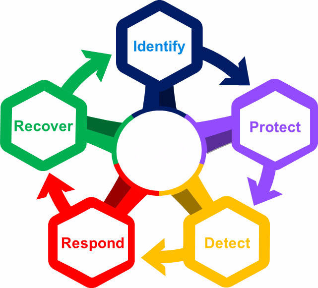
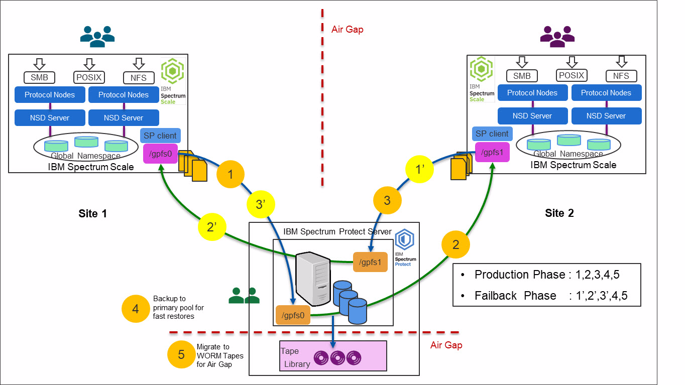
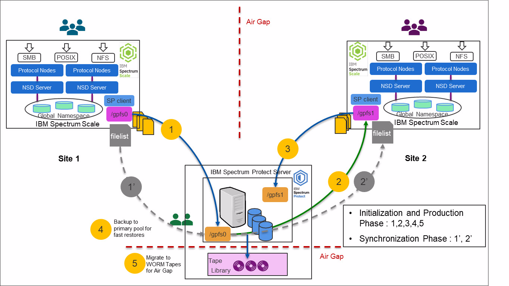
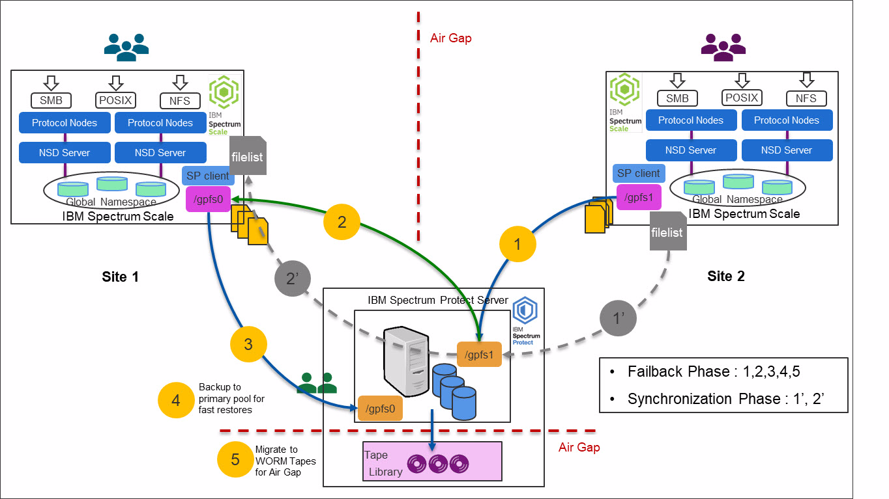

# Cyber Resiliency Solution for IBM Storage Scale - using IBM Storage Protect

> Version 1.0
> 
> © Copyright International Business Machines Corporation 2013, 2022.</br>
> US Government Users Restricted Rights – Use, duplication or disclosure restricted by GSA ADP Schedule Contract with IBM Corp.
>

---
## Table or Contents

* [1. About this document](#1-about-this-document)
* [2. Contributions](#2-contributions)
* [3. Introduction](#3-introduction)
  * [3.1 Scope](#31-scope)
  * [3.2 Prerequisites](#32-prerequisites)
  * [3.3 National Institute of Standards andTechnology framework](#33-national-institute-of-standards-and-technology-framework)
* [4. Implementing a Cyber Resiliency solution with IBM Storage Scale](#4-implementing-a-cyber-resiliency-solution-with-ibm-storage-scale)
  * [4.1 IBM Storage Scale](#41-ibm-storage-scale)
  * [4.2 IBM Storage Protect](#42-ibm-storage-protect)
  * [4.3 IBM Tape Storage](#43-ibm-tape-storage)
  * [4.4 Usecases considered for a Cyber Resiliency solution for IBM SpectrumScale](#44-use-cases-considered-for-a-cyber-resiliency-solution-for-ibm-storage-scale)
  * [4.5 Cyber Resiliency solution for IBM Storage Scalearchitectural overview](#45-cyber-resiliency-solution-for-ibm-storage-scale-architectural-overview)
* [5. Configuring a CyberResiliency solution for IBM Storage Scale](#5-configuring-a-cyber-resiliency-solution-for-ibm-storage-scale)
  * [5.1 IBM Storage Protect server configuration](#51-ibm-storage-protect-server-configuration)
  * [5.2 IBM Storage Protect client configuration on IBM Storage Scale](#52-ibm-storage-protect-client-configuration-on-ibm-storage-scale)
* [6. Phases of an IBM Storage Scale CyberResiliency solution](#6-phases-of-an-ibm-storage-scale-cyber-resiliency-solution)
  * [6.1 Initialization Phase](#61-initialization-phase)
  * [6.2 Backup Synchronization technique in the Production phase](#62-backup-synchronization-technique-in-the-production-phase)
  * [6.3 Production phase](#63-production-phase)
  * [6.4 Detection of Anomaly phase](#64-detection-of-anomaly-phase)
  * [6.5 Failover and Failback phase](#65-failover-and-failback-phase)
* [7. Summary](#7-summary)
* [8. Notices](#8-notices)
  * [8.1 Trademarks](#81-trademarks)
  * [8.2 Terms and conditions for product documentation](#82-terms-and-conditions-for-product-documentation)
    * [8.2.1 Applicability](#821-applicability)
    * [8.2.2 Commercial use](#822-commercial-use)
    * [8.2.3 Rights](#823-rights)
    * [8.2.4 Privacy policy considerations](#824-privacy-policy-considerations)

---
## 1. About this document

This document is intended to facilitate the deployment of the `Cyber Resiliency solution for IBM® Storage Scale`. This solution is designed to protect the data on `IBM Storage Scale` from external cyberattacks or insider attacks using its integration with IBM Storage Protect™ and IBM Tape Storage. To complete the tasks that it describes, you must understand `IBM Storage Scale`, `IBM Storage Protect`, and `IBM Tape Storage architecture`, concepts, and configuration.

The information in this document is distributed on an as-is basis without any warranty that is either expressed or implied. Support assistance for the use of this material is limited to situations where IBM Storage Scale or IBM Storage Protect are supported and entitled, and where the issues are specific to a blueprint implementation.

## 2. Contributions

The `Cyber Resiliency solution for IBM Storage Scale` provides an integrated support experience for clients. The information in this document (referred to throughout as the *Blueprint*) is distributed on an "as-is" basis without any warranty that is either expressed or implied. Support for the underlying components that make up this solution are provided by way of the standard procedures and processes that are available for each of those components, as governed by the support entitlement that is available for those components. For more information about these components, see ["Prerequisites"](#32-prerequisites).

All components of the solutions are part of the unified support structure. Support assistance for the solution that is described in this Blueprint is available by requesting assistance for any of the components in the solution. This is the preferred method.

You are invited to contribute to this Blueprint, give feedback, and continuously improve its application.

---
## 3. Introduction

In today's data-driven world, an organization's information and data is considered the most important asset to its business, and it can serve as a key asset for the growth of an organization. As more and more data is collected by businesses, organizations, and companies, data volume is growing at a staggering pace.

With this exponential data growth, there is an increased need to protect the data from various cyberattacks in the form of malware and ransomware. These cyberattacks can have a catastrophic impact on an organization, and can result in devastating financial losses and affect an organization's reputation for many years.

The financial impact of cyberattacks is rising. According to Ponemon's [*Cost of a Data Breach Report - 2019*](#https://www.ibm.com/security/data-breach?lnk=ushpv18l1), the average cost of a data breach is estimated at a staggering USD 3.92 million. Moreover, that same Ponemon's report also placed the average chance of\ experiencing a data breach over the next two years at 29.6%. Therefore, it's a matter of when, not if.

These cyberattacks can happen in several forms. They can be in the form of malware or ransomware targeted at stealing confidential data or holding users' information for ransom. Sometimes these attacks are targeted to destroy confidential and critical data to cripple organizations. Moreover, according to [Verizon](https://enterprise.verizon.com/resources/reports/2019-data-breach-investigations-report.pdf), 34% of data breaches involved internal actors.

Per Wikipedia, [*Cyber Resiliency*](https://en.m.wikipedia.org/wiki/Cyber_resilience) refers to an entity's ability to continuously deliver the intended outcome despite cyber events. Assuming that you already have an infrastructure that uses some of the current data protection techniques, such as backups, snapshots, and replication, the next step is expanding your current infrastructure to add the necessary cyber resiliency focus.

`IBM Storage Scale` is a high-performance, highly available, clustered file system available on a variety of platforms (including the public cloud service providers). It provides concurrent access to a single file system or set of file systems from multiple nodes. IBM Storage Scale has multiple data access points (via different protocols) where data in the form of files and objects is directly accessible by end users as well as applications.

Moreover, the product integrates with an organization's external directory services for different types of authentication and authorization. Unlike block storage products, these aspects make the attack vector for such products much wider, making them more vulnerable to cyberattacks and increasing the overall threat index. IBM Storage Protect can simplify data protection, whether data is hosted in physical, virtual, software-defined, or cloud environments.

`IBM Storage Scale` provides conventional features, such as snapshots, replication, encryption, and immutability, which can be implemented to reduce cyber security threats. In addition, IBM Storage Scale's integration with IBM Storage Protect provides an effective backup and restore mechanism. This feature integration can be effectively leveraged to provide a Cyber Resiliency approach for organizations that are planning to improve cyber threat resolution, reduce costs, and deliver quick recovery for the environment.

Adding `IBM Tape Storage` offers cost-effective, long-term backup and archive WORM storage, with a true physical air gap and total separation from ransomware and cyber-attacks.

### 3.1 Scope

This Blueprint provides the following information:
* A solutions architecture and related solution configuration workflows, with the following essential software components:
  - `IBM Storage Scale`
  - `IBM Storage Protect`
  - `IBM Tape Storage`
* Detailed technical configuration steps for building an end-to-end solution

This technical report does not include the following:
* Provide scalability and performance analysis from a user perspective
* Provide claims of creating totally isolated air-gap infrastructure
* Replace any official manuals and documents issued by IBM

### 3.2 Prerequisites

This technical report assumes basic knowledge of the following prerequisites:
* IBM Storage Scale installation and configuration
* IBM Storage Protect installation and configuration
* IBM Tape Storage installation and configuration

### 3.3 National Institute of Standards and Technology framework

As systems became linked with external networks, organizations adopted a *defense-in-depth* security mode so that if the perimeter was breached, there were additional layers of security to protect critical information from falling into the wrong hands. The focus was on the technical aspects of recovery. However, these measures are no longer sufficient for protection against cyberattacks.

Organizations are beginning to understand that traditional device-centric and\ technology-centric security measures, such as firewalls, fail to provide security in the cyber ecosystem. Moving forward, you must take a holistic approach across your data, applications, and the entire infrastructure to not only recover, but prevent (or at the very least minimize) the attack.

Some of the following factors are considered for designing a Cyber Resiliency approach:
* Although regulations continue to play an important role, consumers decide the ultimate outcomes for a business.
* For implementing effective Cyber Resiliency approach, it must be changed from a reactive approach to a proactive approach. A repeated cycle of planning, protecting, testing, and learning must be implemented by a Cyber Resiliency team.
* Most organizations' backup and disaster recovery plans are designed around the fact that most disasters are caused by either technical failures or human errors, with secondary concern about natural disasters. Modern data protection approaches must also consider data compromise due to cyber events, and be implemented accordingly.
* As attackers are getting smarter, approaches should consider continuous improvements, innovations, and reengineering to address the newer threats that are challenging organizations.
* Though effort is made to leverage existing infrastructure, modern technologies help automate systems to deal more effectively with cyber threats.

In order to more effectively deal with cyber events, the National Institution of Standards and Technology (NIST) provides a policy framework of computer security guidance regarding how organizations can assess and improve their ability to prevent, detect, and respond to cyberattacks. This framework is an industry-accepted methodology for building a plan to develop and implement safeguards to ensure delivery of critical business services.

As shown in Figure 1, a Cyber Resiliency plan is a continuous process that needs to be repeated in the environment to safeguard data from cyberattacks.



*Figure 1 - NIST Cyber Security framework*

The NIST framework is a set of five Cyber Security functions:
* **Identify:** NIST recommends building organizational understanding during the *Identify* stage so that business IT systems can be confidently restored to their  operational state. It is important to identify what must be protected, and then prioritize your protection plan.
* **Protect:** During the *Protect* stage, implement various safeguards, such as identity management, access control, awareness and training, data security, code currency procedures, and data protection technology, to ensure delivery of critical services.
* **Detect:** The best way to reduce costs during an event is to detect it early, and then rapidly recover. The point of the *Detect* stage is implementing activities and technologies to identify anomalies and events that are out of the ordinary. This enables you to quickly respond and limit the damage by containing the event.
* **Respond:** In the *Response* state, develop and implement appropriate activities to take actions regarding a detected cybersecurity incident.
* **Recover:** In the *Recover* stage, develop and implement appropriate activities to maintain plans for resilience, and to restore any capabilities or services that were impaired due to a cybersecurity incident. In this stage, the goal is to get a compromised environment back up and running quickly and efficiently.

---
## 4. Implementing a Cyber Resiliency solution with IBM Storage Scale

This section describes the components and solution building blocks used for implementing a Cyber Resiliency solution.

### 4.1 IBM Storage Scale

IBM Storage Scale is a high-performance, highly available, clustered file system available on a variety of platforms. IBM Storage Scale provides concurrent access to a single file system or set of file systems from multiple nodes. On-premise, IBM Storage Scale nodes can be SAN-attached, network-attached, a mixture of SAN-attached and network-attached, or in a Shared Nothing cluster configuration.

### 4.2 IBM Storage Protect

IBM Storage Protect can simplify data protection, whether data is hosted in physical, virtual, software-defined, or cloud environments. With IBM Storage Protect, organizations can choose the right software to manage and protect their data while also simplifying backup administration, improving efficiency, delivering scalable capacity, and enabling advanced capabilities.

### 4.3 IBM Tape Storage

IBM Tape Storage offers cost-effective, long-term backup and archive WORM storage, with a true physical air gap and total separation from ransomware and cyberattacks. Tape is used to optimize data protection costs, and mitigates the risk of ransomware for data-centric organizations. At a cost of less than a half a cent per GB (gigabyte), it is also an extremely cost-effective solution.

### 4.4 Use cases considered for a Cyber Resiliency solution for IBM Storage Scale**

The architectural design in this Cyber Resiliency solution addresses the following use cases:

* As a storage architect and administrator, data should be safeguarded from virus attacks, ransomware encryption, or deletion by a malicious user.
* As a storage architect and administrator, data is a most-important asset, and the business of my organization relies on the data on the storage system. Business can continue even if the data on the primary system holding the data has been compromised.
* Multiple copies of data are maintained using multiple features of data protection, even if one or more copies of data are compromised.
* Copies of data are available in an immutable format to avoid overriding valid copies of data. This state provides the ability to restore valid copies of the data at a remote system to validate the authenticity of recovered data.
* Copies of my data are stored in an air-gapped environment where only authorized personnel have access to the data.
* Avoid the human element from accessing and compromising all copies of data, with a provision to store multiple copies of data at different locations, and to separate administrative access for the different copies of data.

### 4.5 Cyber Resiliency solution for IBM Storage Scale architectural overview

The following figure shows the high-level architectural overview of a Cyber Resiliency solution to achieve protection of data on an IBM Storage Scale cluster.



*Figure 2 - Architectural overview*

In this test setup and validation, IBM Storage Scale clusters are configured on two sites.

One of the sites is a production site, and the other site is an air-gapped site where only authorized personnel and processes have access. Designing an air-gapped system is out of the scope of this document.

This proposed solution consists of two identically configured file systems of the same capacity and characteristics: /gpfs0 (the production file system) and /gpfs1 (the failover file system) on two IBM Storage Scale clusters at different sites. The IBM Storage Protect server is used to facilitate the transmission of data across two IBM Storage Scale clusters.

The IBM Storage Protect client is used to synchronize the two file systems across the IBM Storage Scale clusters. This solution uses IBM Storage Scale's **mmbackup**utility, which internally uses the IBM Storage Protect backup-archive (BA) client to achieve higher performance and scalability of the synchronization mechanism.

In this solution approach, data from the production IBM Storage Scale cluster is backed up incrementally to the IBM Storage Protect server. All incremental changes are then synchronized with the air-gapped IBM Storage Scale cluster. The transmission of data uses file lists created using the **mmbackup** utility and reused for synchronized processing.

When the data on the production system is compromised, or when there is a complete failure of the production system, applications using the data can be directed to the failover system to maintain business continuity. At this time, the air-gapped IBM Storage Scale cluster assumes the role of the production IBM Storage Scale cluster.

After the original production IBM Storage Scale cluster is recovered, incremental data from the air-gapped IBM Storage Scale cluster is synchronized with it. The application can now be redirected back to the original production IBM Storage Scale cluster.

Consider the following information:

* File systems on the production and failover IBM Storage Scale clusters have different mount points. Therefore, appropriate changes need to be applied to the application accessing the data after the failover.
* When production and failover sites are in multiple locations, then I/O latency and bandwidth for processing backup and restore needs to be considered.
* This solution allows multiple failover systems. This can be implemented based on the feasibility and business need to maintain multiple copies of data. In this example, only one production and one failover IBM Storage Scale cluster has been considered.

---
## 5. Configuring a Cyber Resiliency solution for IBM Storage Scale

This solution approach is designed using standard IBM Storage Scale and IBM Storage Protect software components.

### 5.1 IBM Storage Protect server configuration

This solution considers a single IBM Storage Protect server for backup and restore operations. For setting up an IBM Storage Protect server, see the

> **Note:** All of the configurations described in the following sections are for illustration only. </br>
> Actual configurations vary in real environments and need to be planned appropriately.

This document discusses the IBM Storage Protect configuration where local disk-based storage was used as a primary storage media on the IBM Storage Protect server. However, it is advised to configure a tape pool to be used as an additional air-gapped mechanism to store the data.Tape serves as the proven mechanism and building block of a complete modern data protection plan. It provides a low-cost, long-term data archiving solution.

Tape provides a *write once read many* (WORM) capability that can be used to thwart ransomware attacks. Tape achieves this functionality by ensuring an air gap between live data and recovery data when both the production and another site are compromised in a ransomware attack.

To configure the IBM Storage Protect server, complete the following steps:

1. After the storage pools are configured on an IBM Storage Protect server, register the production IBM Storage Scale cluster nodes on the IBM Storage Protect server, as shown in following figure.
   ```
   Protect: SSS-IP06>
   Protect: SSS-IP06>reg node sss-ip02 password maxnummp=10
   ANR2060I Node SSS-IP02 registered in policy domain STANDARD.
   Protect: SSS-IP06>reg node sss-ip03 password maxnummp=10
   ANR2060I Node SSS-IP03 registered in policy domain STANDARD.
   Protect: SSS-IP06>
   ```
   *Figure 3 - Register the production IBM Storage Scale cluster nodes*

2. Register the IBM Storage Scale cluster nodes from the air-gapped IBM Storage Scale cluster on the same IBM Storage Protect server, as shown in following figure.
   ```
   Protect: SSS-IP06>
   Protect: SSS-IP06>reg node sss—ip09 password maxnummp=10 
   ANR2060I Node SSS-IP09 registered in policy domain STANDARD. 
   Protect: SSS-IP06>reg node sss—ipl0 password maxnummp=10 
   ANR2060I Node SSS-IP10 registered in policy domain STANDARD. 
   Protect: SSS-IP06> 
   ```
   *Figure 4 - Register air-gapped IBM Storage Scale cluster nodes*

3. After the nodes are registered, grant proxy authority of the IBM Storage Scale cluster nodes to the IBM Storage Scale cluster nodes on the other site. This enables IBM Storage Scale cluster nodes on one site to perform restore operations of the data backed up from the IBM Storage Scale cluster nodes from another site. The following figure shows that nodes on the air-gapped sites sss-ip09 and sss-ip10 were provided authority to perform restores of the data backed up from the production IBM Storage Scale cluster node sss-ip02.
   ```
   Protect: SSS-IP06>
   Protect: SSS-IP06>
   Protect: SSS-IP06>grant proxynode target=sss-ip02 agent=sss—ip09,sss—ipl0
   ANR0140I GRANT PROXYNODE: success. Node SSS-IP03 is granted proxy authority to node SSS-IP02.
   ANR0140I GRANT PROXYNODE: success. Node SSS-IP09 is granted proxy authority to node SSS-IP02.
   ANR0140I GRANT PROXYNODE: success. Node SSS-IP10 is granted proxy authority to node SSS-IP02.
   Protect: SSS-IP06>
   Protect: SSS-IP06>
   ```
   *Figure 5 - Grant proxy authority to the IBM Storage Scale cluster nodes*

4. Grant proxy authority to the IBM Storage Scale cluster nodes on the production site for the IBM Storage Scale cluster nodes on the air-gapped site.

### 5.2 IBM Storage Protect client configuration on IBM Storage Scale

After installing the IBM Storage Protect BA client on the IBM Storage Scale cluster nodes, they need to be configured for IBM Storage Protect backup:

1. Configure dsm.sys on the participating IBM Storage Scale cluster nodes to point to the IBM Storage Protect server, as shown in following figure.

   ```
   [root@sss-ip02 binl# 
   [root@sss—ip02 bin]# cat dsm.sys 
   ******************************************************************* 
   *                                                                 * 
   * Sample Client System Options file for UNIX (dsm.sys.smp)        * 
   ******************************************************************* 
   * 
   * This file contains the minimum options required to get started
   * using the Backup-Archive Client. Copy dsm.sys.smp to dsm.sys. 
   * In the dsm.sys file, enter the appropriate values for each option 
   * listed below and remove the leading asterisk (*) for each one. 
   
   * If your client node communicates with multiple servers, be
   * sure to add a stanza, beginning with the SERVERNAME option, for
   * each additional server.
   *******************************************************************
   
   SErvername sss—ip06 
   NODENAME sss—-ip02 
   ASNODENAME sss—-ip09 
   PASSWORDACCESS GENERATE 
   
   COMMMe thod TCPip 
   TCPPort 1500 
   TCPServeraddress sss—ip06.tuc.stglabs.ibm.com 
   
   [root@sss—-ip02 bin]# 
   ```
   *Figure 6 - Sample dsm.sys on the IBM Storage Scale cluster node*

2. Configure dsm.opton the participating IBM Storage Scale cluster nodes to point to the IBM Storage Protect server, as shown in following figure.
   ```
   [root@sss-ip02 ~l# cat /opt/tivoli/tsm/client/ba/bin/dsm.opt
   ******************************************************************* 
   *                                                                 * 
   * Sample Client User Options file for UNIX (dsm.opt.smp)          * 
   ******************************************************************* 
   * 
   * This file contains the option you can use to specify the 
   * server to contact if more than one is defined in your client
   * system options file (dsm.sys). Copy dsm.opt.smp to dsm.opt.
   * If you enter a server name for the option below, remove the
   * leading asterisk (*). 
   *******************************************************************  

   * SErvername         A server name defined in the dsm.sys file
   SErervername       sss-ip06
   [root@sss-ip02 ~l#
   ```
   *Figure 7 Sample dsm.opt configuration on the IBM Storage Scale cluster nodes*

3. After configuration, create a test file on an IBM Storage Scale file system. Next, verify the basic backup, query, and restore operations from the IBM Storage Scale cluster nodes from both the sites, as shown in following figure.
   ```
   [root@sss—ip02 ~]# dsmc sel /ibm/gpfs0/testfile
   [root@sss—ip02 ~]# dsmc query ba /ibm/gpfs0/testfile
   [root@sss—ip02 ~]# dsmc restore /ibm/gpfsO/testfile -replace=all
   [root@sss—ip09 ~]# dsmc sel /ibm/gpfsl/testfile2
   [root@sss—ip09 ~]# dsmc query ba /ibm/gpfsl/testfile2
   [root@sss—ip09 ~]# dsmc restore /ibm/gpfsl/testfile2 -replace=all
   ```
   *Figure 8 - Verify test backup and restore operations from IBM Storage Scale cluster nodes*

---
## 6. Phases of an IBM Storage Scale Cyber Resiliency solution

This section describes the various phases of the Cyber Resiliency solution with IBM Storage Scale. In this solution approach, data on the production site IBM Storage Scale cluster is isolated to an air-gapped IBM Storage Scale cluster using the IBM Storage Protect backup and restore mechanism.

The data on the production IBM Storage Scale cluster is backed up incrementally to the IBM Storage Protect server. All incremental changes are synchronized with the air-gapped IBM Storage Scale cluster by restoring incrementally backed up files from the production to the air-gapped IBM Storage Scale cluster. The transmission of the data uses the *file list* created from the IBM Storage Scale's **mmbackup**utility, and this list is reused for the synchronization purpose.

IBM Storage Scale file systems can hold huge files and data. For higher parallelism and scalability, the backup processing can happen on the file set level. For more information about scale out backup architecture, see [Petascale Data Protection](https://www.ibm.com/support/pages/petascale-data-protection).

IBM Storage Protect server achieves the isolation purpose for Cyber Resiliency. It isolates the data continuously from the production IBM Storage Scale cluster. This helps protect valid copies of data on the IBM Storage Protect server. If data on the production cluster gets compromised, it can be immediately restored from the IBM Storage Protect server using the uncompromised data backed up on the IBM Storage Protect server.

Then, depending on each organization's policies, this data can be offloaded to the WORM capable tapes to achieve an extra level of protection for tampering with the non-compromised data. It is strongly advised to have separate administrators for IBM Storage Scale clusters at both locations and for the IBM Storage Protect server, therefore removing the possibility of tampering with all valid copies of data by human intervention.

IBM Storage Protect detects anomalies to workload patterns to alert administrators of potential ransomware infections for workloads, enabling clients to be aware of possible attacks and mitigate them before they spread. In this solution, when the anomalies are detected, synchronization from the production cluster to the air-gapped cluster needs to be stopped to prevent compromising data on the air-gapped cluster.

Additionally, point-in-time snapshots created at the air-gapped IBM Storage Scale cluster help in keeping multiple snapshot copies of data. In case of compromise, data can be restored to the air-gapped cluster and validated for the good copies of data. In case of a total compromise of the production IBM Storage Scale cluster, applications using the data can be failed over to the air-gap IBM Storage Scale cluster, assuming that data is not\ compromised at the air-gapped location.

At this point, the air-gapped IBM Storage Scale cluster takes over the role of the production IBM Storage Scale cluster. When the recovery of the original production cluster completes, data can again be reversed and synchronized to the original production cluster, and applications can be pointed back to the original production IBM Storage Scale cluster.

This solution approach discusses the following phases for this Cyber Resiliency solution.

### 6.1 Initialization Phase

As shown in the following figure, initial synchronization between the file systems are established across the IBM Storage Scale clusters at both the sites in this phase.



*Figure 9 - Initialization and production phase*

To prepare the initialization phase, complete the following steps:

1. Create an initial full backup of the file system from the production IBM Storage Scale cluster. In order to have a consistent backup, create a snapshot of the production IBM Storage Scale file system, as shown in Figure 10.

   ```
   [root@sss—-ip02 ~]#
   [root@sss—-ip02 ~]# mmcrsnapshot gpfsO backup_snap
   Flushing dirty data for snapshot :backup_snap...
   Quiescing all file system operations.
   Snapshot :backup_ snap created with id 9.
   [root@sss—ip02 ~]#
   ```
   *Figure 10 - Creating a snapshot of the production IBM Storage Scale file system*

2. For the first time, take a full backup of the file system from the production IBM Storage Scale cluster. After the full backup, delete the temporary snapshot created on the production IBM Storage Scale cluster (step 1 shown in Figure 9).

   **Notes:**
   1. Depending on the snapshot retention policy of your organization, snapshots of the production IBM Storage Scale file system can be kept for operational recovery. If kept, these snapshots can serve as an operational recovery mechanism from any infections, or from accidental deletion of data from the file system.
   1. All use of backup and restore commands, such as **mmbackup**, in this document is for illustration purposes only (Figure 11). Actual use can vary in production environments.
      ```
      [root@sss—ip02 ~]#
      [root@sss—ip02 ~]# mmbackup gpfs0 -t full -S backup_snap
      --------------------------------------------------------
      mmbackup: Backup of /ibm/gpfs0 begins at Tue Aug 6 21:21:47 MST 2019
      --------------------------------------------------------
      Tue Aug 6 21:21:52 2019 mmbackup:Scanning file system gpfsO
      mmbackup: TSM Summary Information:
            Total number of objects inspected:        6766
            Total number of objects backed up:        6485
            Total number of objects updated:          0
            Total number of objects rebound:          0
            Total number of objects deleted:          0
            Total number of objects expired:          0
            Total number of objects failed:           0            
            Total number of objects encrypted:        0
            Total number of bytes inspected:          2544768122
            Total number of bytes transferred:        2544768122
      --------------------------------------------------------
      mmbackup: Backup of /ibm/gpfs0 completed successfully at Tue Aug 6 21:21:47 MST 2019
      --------------------------------------------------------
      [root@sss—ip02 ~]#
      [root@sss—ip02 ~]#
      [root@sss—ip02 ~]# mmdelsnapshot gpfs0 backup snap
      Invalidating snapshot files in :backup_snap...
      Deleting files in snapshot
        100.00 $ complete on Tue Aug 6 21:23:35 2019  (655360 inodes with total  28 MB data processed)
      Invalidating snapshot files in :backup_snap/F/...
      Delete snapshot :backup_snap successful.
      [root@sss—ip02 ~]#
      ```
      *Figure 11 - Initial full backup of the production IBM Storage Scale file system*

3. Initiate full synchronization of the production IBM Storage Scale file system (gpfs0) to the air-gapped IBM Storage Scale file system (gpfs1). Log in to the air-gapped IBM Storage Scale cluster and use a no-query-restore for this to enable massive parallel restore processing (Step 2 shown in Figure 9).

   After the full restore of the file system, delete the shadow DB generated by the **mmbackup** utility on the production IBM Storage Scale system that was restored during a full restore process, as shown in Figure 12.

   ```
   [root@sss-ip09 ~]#
   [root@sss-ip09 ~]# dsmc restore /ibm/gpfs0/ /ibm/gpfsl/ -replace-all -subdir=yes -tapeprompt=no 
   IBM Storage Protect
   Command Line Backup-Archive Client Interface
      Client Version 8, Release 1, Level 7.0
      Client date/time: 08/06/2019 21:29:58
   (c) Copyright by IBM Corporation and other(s) 1990, 2019. All Rights Reserved.

   Node Name: SSS-IP02
   Session established with server SSS-IP06: Linux/x86_64
      Server Version 8, Release 1, Level 7.000
      Server date/time: 08/06/2019 21:30:04          Last access: 08/06/2019 21:27:17

   Restore function invoked.

   ANS12471 Waiting for files from the server...
   Restoring         19 /ibm/gpfs0/worm_fset01/worm_test2 --> /ibm/gpfsl/worm_fset01/worm_test2 [Done]
   Restoring  1,200,227 /ibm/gpfs0/.mmbackupShadow.1.sss-ip06.filesys --> /ibm/gpfs1/.mmbackupShadow.1.sss-ip06.filesys [Done]
 
   Restore processing finished.

   Total number of objects restored:       6,491
   Total number of objects failed:             0
   Total number of bytes transferred:       2.37 GB
   Data transfer time:                      9.74 sec
   Network data transfer rate:        254,743.14 KB/sec
   Aggregate data transfer rate:       79,174.32 KB/sec
   Elapsed processing time:             00:00:31

   [root@sss-ip09 ~]#
   [root@sss-ip09 ~]#
   [root@sss-ip09 ~]# rm -f rm /ibm/gpfs1/.mmbackupShadow.1.sss-ip06.filesys 
   [root@sss-ip09 ~]#

   ```
   *Figure 12 - Initiate a full restore of backed up data to the IBM Storage Scale file system at the air-gap location*

4. Initiate a full backup of the IBM Storage Scale file system at the air-gap location on the same IBM Storage Protect server. This acts as a baseline for the reverse production workflow when a failover occurs (step 3 shown in Figure 9).

   Follow the previous procedure to create a snapshot of the file system and then initiate a full backup of the IBM Storage Scale file system at the air-gap location using the **mmbackup**utility, as shown in Figure 13.
   ```
   [root@sss-ip09 ~]#
   [root@sss-ip09 ~]# mmcrsnapshot gpfs1 backup_snap_airgap 
   Flushing dirty data for snapshot :backup_snap_airgap... 
   Quiescing all file system operations.
   Snapshot backup_snap_airgap created with id 7.
   [root@sss-ip09 ~]#
   [root@sss-ip09 ~]# mmbackup gpfsl -t full -S backup_snap_airgap
   --------------------------------------------------------
   mmbackup: Backup of /ibm/gpfsl begins at Tue Aug 6 21:38:58 MST 2019.
   --------------------------------------------------------
   Tue Aug 6 21:39:22 2019 mmbackup: Scanning file system gpfsl
   mmbackup: TSM Summary Information:
           Total number of objects inspected:        7359
           Total number of objects backed up:        6493
           Total number of objects updated:          0 
           Total number of objects rebound:          0
           Total number of objects deleted:          0
           Total number of objects expired:          0
           Total number of objects failed:           0
           Total number of objects encrypted:        0
           Total number of bytes inspected:          2555505541
           Total number of bytes transferred:        2544768122
   --------------------------------------------------------
   mmbackup: Backup of /ibm/gpfsl completed successfully at Tue Aug 6 21:40:00 MST 2019.
   --------------------------------------------------------   
   [root@sss-ip09 ~]#
   ```
   *Figure 13 - Initiate a full backup of the IBM Storage Scale file system at the air-gap location*

   > **Note:** It is advisable to keep the snapshots at the IBM Storage Scale cluster in the air-gap location per your snapshot retention policy. These snapshots can serve as a recovery mechanism on an air-gapped IBM Storage Scale cluster to validate the authenticity of data at a remote location.

5. As explained previously, Cyber Resiliency at an IBM Storage Protect server can be further achieved by migrating the data to WORM capable tapes (Steps 4 and 5 from Figure 9).

### 6.2 Backup Synchronization technique in the Production phase

As explained earlier in this document, this approach uses the **mmbackup** utility from IBM Storage Scale to initiate backups to the IBM Storage Protect server. The **mmbackup** utility provides scalable backup processing and creates file lists with backup candidates. In a normal scenario, these file lists are deleted from the file system by the **mmbackup** utility after finishing the backup processing.

In this approach, the generated file lists are used to synchronize file systems across both locations. To keep these file lists, debug level 2 mode (DEBUGmmbackup=0x002) must be enabled on the **mmbackup** utility. After finishing the backup, these file lists will be backed up separately to the IBM Storage Protect server. On the air-gapped cluster, these file lists are restored first. The file lists generated in an **mmbackup** utility format are then converted to the IBM Storage Protect recognized file lists format.

Then, incrementally backed up files from the production file system are restored on the air-gapped IBM Storage Scale file system using these converted file lists. This is also shown in Figure 9.

### 6.3 Production phase

In this phase of the Cyber Resiliency approach, files on the production IBM Storage Scale cluster are backed up incrementally. IBM Storage Scale typically holds a large amount of data. Therefore, it is a best practice to back up IBM Storage Scale file systems incrementally at a regular interval. The frequency of the backup depends on the file system usage and the change rate of files.

In this phase, there can be two types of files that are under consideration.

**Newly generated files or modified files**

The following steps illustrate the synchronization of the files that are newly generated or modified on the IBM Storage Scale cluster at the production site:

1. To back up incrementally, create a snapshot of the production file system and enable the **mmbackup**utility debug parameter so that the file lists are kept in the IBM Storage Scale file system, as shown in Figure 14.
   ```
   [root@sss-ip02 ~]#
   [root@sss-ip02 ~]# mmcrsnapshot gpfs0 backup_snap 
   Flushing dirty data for snapshot :backup_snap... 
   Quiescing all file system operations.
   Snapshot backup_snap created with id 10. 
   [root@sss-ip02 ~]# export DEBUGmmbackup=0x002 
   [root@sss-ip02 ~]#
   ``` 
   *Figure 14 - Creating snapshot and enabling mmbackup debug parameter for incremental backup*

2. Initiate incremental backup of the production IBM Storage Scale file system to the IBM Storage Protect server. Then, delete the snapshot if it is not required under the snapshot retention policy, as shown in Figure 15 (also step 1 shown in Figure 9).
   ```
   [root@sss-ip02 ~]#
   [root@sss-ip02 ~]# mmbackup gpfs0 -t incremental -S backup_snap
   --------------------------------------------------------
   mmbackup: Backup of /ibm/gpfs0 begins at Tue Aug 6 23:32:14 MST 2019.
   --------------------------------------------------------
   Tue Aug 6 23:32:19 2019 mmbackup: Scanning file system gpfs0
   mmbackup: TSM Summary Information:
          Total number of objects inspected:        2471
          Total number of objects backed up:        2144
          Total number of objects updated:          0
          Total number of objects rebound:          0
          Total number of objects deleted:          0
          Total number of objects expired:          0
          Total number of objects failed:           0
          Total number of objects encrypted:        0
          Total number of bytes inspected:          850132992
          Total number of bytes transferred:        846924349
   --------------------------------------------------------
   mmbackup: Backup of /ibm/gpfs0 completed successfully at Tue Aug 6 23:32:35 MST 2019.
   --------------------------------------------------------
   [root@sss-1p02 ~]#
   [root@sss-ip02 ~]# mmdelsnapshot gpfs0 backup_snap 
   Invalidating snapshot files in backup_snap.. 
   Deleting files in snapshot :backup_snap...
     100.00 % complete on Tue Aug 6 23:33:03 2019 (    655360 inodes with total     28 MB data processed)
   Invalidating snapshot files in backup_snap/F/... 
   Delete snapshot backup_snap successful.
   [root@sss-ip02 ~]#
   ```
   *Figure 15 - Incremental backup from the IBM Storage Scale cluster at the production site*

3. Selectively backup the **mmbackup** utility generated file list and then delete the file list locally from the production IBM Storage Scale file system as shown in Figure 16 and Step 1 in Figure 9.
   ```
   [root@sss-ip02 ~]#
   [root@sss-ip02 ~]# dsmc sel /ibm/gpfs0/.mmbackupCfg/updatedFiles/.list.l.sss-ip06 
   IBM Storage Protect
   Command Line Backup-Archive Client Interface
     Client Version 8, Release 1, Level 7.0
     Client date/time: 08/06/2019 23:35:07
   (c) Copyright by IBM Corporation and other (s) 1990, 2019. All Rights Reserved.

   Node Name: SSS-IP02
   Session established with server SSS-IP06: Linux/x86 64
     Server Version 8, Release 1, Level 7.000 
     Server date/time: 08/06/2019 23:35:13   Last access: 08/06/2019 23:32:39

   Selective Backup function invoked.

   Normal File-->       453,246 /ibm/gpfs0/.mmbackupCfg/updatedFiles/.list.l.sss-ip06 [Sent]
   Selective Backup processing of '/ibm/gpfs0/.mmbackupCfg/updatedFiles/.list.1.sss-ip06' finished without failure.

   Total number of objects inspected:           1
   Total number of objects backed up:           1
   Total number of objects updated:             0
   Total number of objects rebound:             0
   Total number of objects deleted:             0
   Total number of objects expired:             0
   Total number of objects failed:              0
   Total number of objects encrypted:           0
   Total number of objects grew:                0
   Total number of retries:                     0
   Total number of bytes inspected:        442.62 KB
   Total number of bytes transferred:      442.80 KB
   Data transfer time:                       0.06 sec
   Network data transfer rate:           7,055.12 KB/sec
   Aggregate data transfer rate:           420.90 KB/sec
   Objects compressed by:                       0%
   Total data reduction ratio:               0.00%
   Elapsed processing time:              00:00:01
   [root@sss-ip02 ~]#
   [root@sss-ip02 ~]# rm -f /ibm/gpfs0/.mmbackupCfg/updatedFiles/.list.1.sss-ip06 
   [root@sss-ip02 ~]#
   ```
   *Figure 16 - Selective backup of a file list generated by mmbackup utility*

4. Restore the file list generated by the **mmbackup** utility on the IBM Storage Scale file system at the air-gap location (Figure 17 and step 2 in Figure 9).
   ```
   [root@sss—ip09 ~]#
   [root@sss-ip09 ~]# dsmc restore /ibm/gpfs0/.mmbackupCfg/updatedFiles/.list.l.sss—-ip06 /ibm/gpfsl/incre restore list -asnodename—sss—ip02
   IBM Storage Protect 
   Command Line Backup-Archive Client Interface
     Client Version 8, Release 1, Level 7.0
     Client date/time: 08/07/2019 00:23:01
   (c) Copyright by IBM Corporation and other(s) 1990, 2019. All Rights Reserved.

   Node Name: SSS-IP09
   Session established with server SSS-IP06: Linux/x86_64
     Server Version 8, Release 1, Level 7.000
     Server date/time: 08/07/2019 00:23:07 Last access: 08/07/2019 00:18:46

   Accessing as node: SSS-IP02
   Restore function invoked.

   Restoring     453,246 /ibm/gpfs0/.mmbackupCfg/updatedFiles/.list.1.sss-ip06 ——> /ibm/gpfsl/incre_restore list [Done]

   Restore processing finished.

   Total number of objects restored:            1
   Total number of objects failed:              0
   Total number of bytes transferred:      442.69 KB
   Data transfer time:                       0.00 sec
   Network data transfer rate:         232,022.13 KB/sec
   Aggregate data transfer rate:           142.54 KB/sec
   Elapsed processing time:              00:00:03
   
   [root@sss—ip09 ~1#
   ```
   *Figure 17 - Restore the file list generated by the mmbackup utility at the air-gap location*

5. Convert the file list generated from the **mmbackup**utility format to the IBM Storage Protect recognized file list format for the restore. Figure 18 shows the example of converting the **mmbackup** utility format to the IBM Storage Protect recognized file list format. (Figure 18 is for illustration purposes only.)
   ```
   [root@sss-ip09 ~]#
   [root@sss-ip09 ~]# awk -F: '{print $9]' incre_restore_list | grep -v "^" | sed "s/[0-9]*\!/\/ibm\/gpfs0\//g" >> incre_restore_list2
   [root@sss-ip09 ~]#
   ```
   *Figure 18 - Example of converting a file list generated from the mmbackup utility format*

6. After restoring the **mmbackup** utility generated file list from the IBM Storage Protect server, expire the file list from the IBM Storage Protect server. This file list is backed up again after the next incremental backup, as shown in Figure 19.
   ```
   [root@sss—-ip09 ~1#
   [root@sss-ip02 ~]# dsmc expire /ibm/gpfs0/.mmbackupCfg/updatedFiles/.list.l.sss-ip06
   [root@sss—-ip09 ~1#
   ```
   *Figure 19 - Expire file list from the IBM Storage Protect server*

7. Restore the files that are backed up incrementally from the production IBM Storage Scale file system to the IBM Storage Scale file system at the air-gap location using the file list generated in the previous step (Figure 20 and step 2 from Figure 9).
   ```
   [root@sss—-ip09 ~]# dsmc restore -filelist=incre_restore_list2 /ibm/gpfsl/ -replace=all -preser=complete -tapeprompt=no -asnodename=sss-ip02
   IBM Storage Protect
   Command Line Backup-Archive Client Interface
     Client Version 8, Release 1, Level 7.0
     Client date/time: 08/07/2019 02:29:10
   (c) Copyright by IBM Corporation and other(s) 1990, 2019. All Rights Reserved.

   Node Name: SSS—-IP09
   Session established with server SSS-IP06: Linux/x86_64
     Server Version 8, Release 1, Level 7.000
     Server date/time: 08/07/2019 02:29:16         Last access: 08/07/2019 02:27:04

   Accessing as node: SSS-IP02
   Restore function invoked.
   ...
   ANS1898I ***** Processed 2,000 files ****%x

   Total number of objects restored:          2,144
   Total number of objects failed:                0
   Total number of bytes transferred:        807.47 MB
   Data transfer time:                         3.87 sec
   Network data transfer rate:           213,250.78 KB/sec
   Aggregate data transfer rate:          13,708.73 KB/sec
   Elapsed processing time:                00:01:00

   [root@sss-ip09 ~]#
   ```
   *Figure 20 - Incremental restore at the air-gap location*

8. In order to keep backups synchronized on the IBM Storage Protect server, perform an incremental backup from the IBM Storage Scale file system at the air-gap location to the IBM Storage Protect server (Figure 21 and step 3 from Figure 9).
   ```
   [root@sss-ip02 ~]#
   [root@sss-ip09 ~]# mmcrsnapshot gpfsl backup _snap_airgapl
   [root@sss-ip09 ~]# mmbackup gpfsl -t incremental -S backup snap airgapl
   [root@sss-ip02 ~]#
   ```
   *Figure 21 - Incremental backups from the IBM Storage Scale file system at the air-gap location*

9. As explained previously, IBM Storage Protect server-level Cyber Resiliency can be further achieved by migrating the data to WORM capable tapes (steps 4 and 5 from Figure 9).

**Deleted files**

This is an optional approach to recover deleted files on the production IBM Storage Scale cluster, or keep the IBM Storage Scale clusters synchronized when the files are deleted purposefully from the cluster. In some scenarios, files are deleted from the production IBM Storage Scale file system accidentally, or they are deleted by some virus attacks. In such scenarios, when the next incremental backup is issued against a file system, deleted files are also expired from the IBM Storage Protect server.

If the appropriate retention policy is configured for the objects backed up from the IBM Storage Scale clusters, those accidentally deleted files can be restored from the IBM Storage Protect server. Also, such files could be recovered from the IBM Storage Scale file system at the air-gap location using the procedure explained in the previous section.

In some cases, files on the IBM Storage Scale clusters are deleted purposefully for releasing the space from the file system on the production site. In such cases, files on the IBM Storage Scale cluster can be retained for quick recovery purposes. If IBM Storage Scale file systems need to be kept synchronized at all times, those files must also be deleted from the IBM Storage Scale cluster at the air-gap location.

Consider the following procedure for keeping the files synchronized on the IBM Storage Scale cluster at the air-gap location:
1. When an incremental backup is issued on the IBM Storage Scale cluster in debug mode, the **mmbackup** utility also creates a file list containing a list of files marked for expiry. Back up this file list containing a list of the objects marked for expiry using a selective backup to the IBM Storage Protect server. (In this example, the file list for expired files is /ibm/gpfs0/.mmbackupCfg/expiredFiles/.list.1.sss-ip06).
2. Restore this **mmbackup** utility-generated file list of expired objects on the IBM Storage Scale cluster at the air-gap location.
3. Convert this **mmbackup** utility-generated file list into the IBM Storage Protect file list format.
4. Then remove the files mentioned in the converted file list from the IBM Storage Scale air-gap location.
5. Whenever the next incremental backup is run from the IBM Storage Scale cluster at the air-gap location, the deleted files are also expired from the IBM Storage Protect server file space of the IBM Storage Scale cluster at the air-gap location.

### 6.4 Detection of Anomaly phase

IBM Storage Protect detects anomalies in workload patterns to alert administrators of potential ransomware infections for workloads. This detection can depend on significant increased backup rates compared to the historical values, or significant decreased deduplication and compression rates compared to the historical values.

Anomaly detection enables administrators to be aware of possible attacks and mitigate them before they spread to other locations. The alert system can be used to notify the administrators that something malicious happened on the production IBM Storage Scale cluster. This system can also stop the synchronization processing to the IBM Storage Scale cluster at the air-gap location to prevent corrupted data from being synchronized to the air-gap location. For more information, see [IBM Knowledge Base](https://www.ibm.com/support/knowledgecenter/SSEQVQ_8.1.8/srv.admin/r_adm_chklist_mon_daily.html) for IBM Storage Protect.

### 6.5 Failover and Failback phase

If the IBM Storage Scale cluster at the production site is compromised, applications are failed over to the IBM Storage Scale cluster at the air-gap location, and it assumes the role of a new production cluster. At this time, the original production cluster that was compromised needs to be recovered.

Depending on the organization policies, there are various methods of recovering the compromised data on the original production IBM Storage Scale cluster:

* If only live data on the production IBM Storage Scale cluster was compromised (for example, with ransomware) and immediately recognized, and if an organization has a policy of maintaining snapshots of the production site, that data can quickly be restored using local snapshots on the production Storage Scale cluster.
* If non-compromised data copies are not located on the local snapshot copies, that data can be restored from the IBM Storage Protect server. Older copies of data can be restored from the IBM Storage Protect server using data backed up on WORM tapes.
* If compromised data is not yet synchronized with the IBM Storage Scale cluster at the air-gap location, it can be restored back from the IBM Storage Scale cluster at the air-gap location.
* If compromised data is synchronized with the IBM Storage Scale cluster at the air-gap location, data can be restored at the air-gap location first from the snapshots, and then restored back from the IBM Storage Scale cluster at the air-gap location.
* If the entire IBM Storage Scale cluster at the production site is compromised by known events, unknown events, or human intervention, applications are failed over to the IBM Storage Scale cluster at the air-gap location. This cluster assumes the role of the production site.

After the original production IBM Storage Scale cluster is restored, then it needs to be synchronized with the IBM Storage Scale cluster at the air-gap location. Finally, appropriate applications are failed back to the original production IBM Storage Scale cluster.

Figure 22 shows the failback phase of data movement and synchronization from the IBM Storage Scale file system at the air-gap location to the original production IBM Storage Scale file system.



*Figure 22 - Failback phase*

This phase uses the same **mmbackup**utility-generated file lists, and synchronizes the data on the original production IBM Storage Scale file system using the file lists:

1. In order to fail back to the original production IBM Storage Scale cluster, take a snapshot of the IBM Storage Scale file system at the air-gap location and export the **mmbackup** utility debug parameter. Next, take an incremental backup of the IBM Storage Scale file system at the air-gap location (Figure 23), and back up the **mmbackup**utility-generated file list to the IBM Storage Protect server (Step 1 from Figure 22).
   ```
   [root@sss-ip09 ~1]#
   [root@sss-ip09 ~1]# mmcrsnapshot gpfsl backup_snap_airgapl
   [root@sss-ip09 ~1]#
   [root@sss-ip09 ~1]# export DEBUGmmbackup=0x002
   [root@sss-ip09 ~1]#
   [root@sss-ip09 ~1]# mmbackup gpfsl -t incremental -S backup_snap_airgapl
   [root@sss-ip09 ~1]#
   [root@sss-ip09 ~1]# dsmc sel /ibm/gpfsl/.mmbackupCfg/updatedFiles/.list.l.sss-ip06
   [root@sss-ip09 ~1]#
   [root@sss-ip09 ~1]# rm -f /ibm/gpfsl/.mmbackupCfg/updatedFiles/.list.l.sss-ip06
   ```
   *Figure 23 - Incremental backup from the IBM Storage Scale file system at the air-gap location*

2. Depending on the data recovery required on the original IBM Storage Scale cluster, either full or incremental recovery of the IBM Storage Scale file system needs to be performed.

   If a full restore of an IBM Storage Scale file system is needed, perform a full restore of the file system from IBM Storage Protect. Next, use a no-query-restore for this system to enable massive parallel restore processing, as shown in Figure 24.

   ```
   [root@sss—ip02 ~1]#
   [root@sss-ip02 ~1]# dsmc restore /ibm/gpfsl/ /ibm/gpfs0/ -replace=all -subdir=yes -tapeprompt=no
   [root@sss—ip02 ~]1#
   ```
   *Figure 24 - A full restore of IBM Storage Scale file system at the production site*

3. In the case where only incremental data needs to be restored from the **mmbackup**\ utility-generated file lists, first restore the file lists from the IBM Storage Protect server on the original production cluster (Step 2 from Figure 22).

   Convert the file lists into an IBM Storage Protect recognized format and then restore the incrementally backed up data from the IBM Storage Scale file system at the air-gap location to the IBM Storage Scale file system at the original production site (Figure 25 and step 2 from Figure 22).

   ```
   [root@sss-ip02 ~1]#
   [root@sss-ip02 ~1]# dsmc restore /ibm/gpfsl/.mmbackupCfg/updatedFiles/.list.1l.sss-ip06 airgap restore list -asnodename=sss-ip09
   [root@sss-ip02 ~1]#
   [root@sss-ip02 ~1]# dsmc restore -filelist=airgap restore list2 /ibm/gpfs0/ -replace=all -preser=complete -tapeprompt=no -asnodename=sss—-ip09
   [root@sss-ip02 ~1]#
   ```
   *Figure 25 - Incremental restore at the original production site*

4. To keep backups synchronized on the IBM Storage Protect server, perform an incremental backup from the production IBM Storage Scale file system to the IBM Storage Protect server (step 3 from Figure 22.)

   After the data on both the IBM Storage Scale clusters is synchronized, applications can be failed back to the IBM Storage Scale cluster at the original production site.

---
## 7. Summary

Cyberattacks are likely to remain a significant risk for the foreseeable future. Attacks on organizations can be external and internal. Investing in technology and processes to prevent these cyberattacks is the highest priority for these organizations. Organizations need well-designed procedures and processes to recover from attacks.

The NIST framework provides standards, guidelines, and best practices to manage cybersecurity related risks. Adoption of the NIST framework, the proper discipline of risk management, and IBM Storage offerings can be used to create and implement recovery plans that ensure the safety of business-critical data.

IBM Storage Scale is a software-defined storage system for high performance, large-scale workloads, on-premises or in the cloud. IBM Storage Protect is a data protection platform that gives enterprises a single point of control and administration for backup and recovery. IBM Tape Storage offers cost-effective, long-term backup and archive WORM storage, with a true physical air gap and total separation from ransomware and cyberattacks.

The IBM Storage Scale existing feature integration with IBM Storage Protect and IBM Tape Storage enables organizations to implement an effective, easy-to-manage, and automated Cyber Resiliency solution. This solution provides robust protection against external cyber events, such as malware, ransomware attacks, and human elements.

The configurations and examples of commands described in this document are for illustration purposes only. The real-world implementation, configuration of IBM Storage Scale clusters, and execution of commands might vary (per the number of IBM Storage Scale nodes) to achieve better scalability and performance.

---
## 8. Notices

This information was developed for products and services offered in the US. This material might be available from IBM in other languages. However, you may be required to own a copy of the product or product version in that language in order to access it.

IBM may not offer the products, services, or features discussed in this document in other countries. Consult your local IBM representative for information on the products and services currently available in your area. Any reference to an IBM product, program, or service is not intended to state or imply that only that IBM product, program, or service may be used. Any functionally equivalent product, program, or service that does not infringe any IBM intellectual property right may be used instead. However, it is the user's responsibility to evaluate and verify the operation of any non-IBM product, program, or service.

IBM may have patents or pending patent applications covering subject matter described in this document. The furnishing of this document does not grant you any license to these patents. You can send license inquiries, in writing, to:


    IBM Director of Licensing
    IBM Corporation
    North Castle Drive, MD-NC119
    Armonk, NY 10504-1785
    US

For license inquiries regarding double-byte character set (DBCS) information, contact the IBM Intellectual Property Department in your country or send inquiries, in writing, to:

    Intellectual Property Licensing
    Legal and Intellectual Property Law 
    IBM Japan Ltd.
    19-21, Nihonbashi-Hakozakicho, Chuo-ku 
    Tokyo 103-8510, Japan

INTERNATIONAL BUSINESS MACHINES CORPORATION PROVIDES THIS PUBLICATION "AS IS" WITHOUT WARRANTY OF ANY KIND, EITHER EXPRESS OR IMPLIED, INCLUDING, BUT NOT LIMITED TO, THE IMPLIED WARRANTIES OF NON-INFRINGEMENT, MERCHANTABILITY OR FITNESS FOR A PARTICULAR PURPOSE. Some jurisdictions do not allow disclaimer of express or implied warranties in certain transactions, therefore, this statement may not apply to you.

This information could include technical inaccuracies or typographical errors. Changes are periodically made to the information herein; these changes will be incorporated in new editions of the publication. IBM may make improvements and/or changes in the product(s) and/or the program(s) described in this publication at any time without notice.

Any references in this information to non-IBM websites are provided for convenience only and do not in any manner serve as an endorsement of those websites. The materials at those websites are not part of the materials for this IBM product and use of those websites is at your own risk.

IBM may use or distribute any of the information you provide in any way it believes appropriate without incurring any obligation to you.

The performance data and client examples cited are presented for illustrative purposes only. Actual performance results may vary depending on specific configurations and operating conditions.

Information concerning non-IBM products was obtained from the suppliers of those products, their published announcements or other publicly available sources. IBM has not tested those products and cannot confirm the accuracy of performance, compatibility or any other claims related to non-IBM products. Questions on the capabilities of non-IBM products should be addressed to the suppliers of those products.

Statements regarding IBM's future direction or intent are subject to change or withdrawal without notice, and represent goals and objectives only.

This information contains examples of data and reports used in daily business operations. To illustrate them as completely as possible, the examples include the names of individuals, companies, brands, and products.

All of these names are fictitious and any similarity to actual people or business enterprises is entirely coincidental.

COPYRIGHT LICENSE:

This information contains sample application programs in source language, which illustrate programming techniques on various operating platforms. You may copy, modify, and distribute these sample programs in any form without payment to IBM, for the purposes of developing, using, marketing or distributing application programs conforming to the application programming interface for the operating platform for which the sample programs are written. These examples have not been thoroughly tested under all conditions. IBM, therefore, cannot guarantee or imply reliability, serviceability, or function of these programs. The sample programs are provided "AS IS", without warranty of any kind. IBM shall not be liable for any damages arising out of your use of the sample programs.

### 8.1 Trademarks

IBM, the IBM logo, and ibm.com are trademarks or registered trademarks of International Business Machines Corporation, registered in many jurisdictions worldwide. Other product and service names might be trademarks of IBM or other covailable on the web at "Copyright and trademark information" at http://www.ibm.com/legal/copytrade.shtml

The following terms are trademarks or registered trademarks of International Business Machines Corporation, and might also be trademarks or registered trademarks in other countries.
* Redbooks 
* IBM Spectrum
* IBM Storage Scale
* IBM®

The following terms are trademarks of other companies:
* Other company, product, or service names may be trademarks or service marks of others.

### 8.2 Terms and conditions for product documentation

Permissions for the use of these publications are granted subject to the following terms and conditions.

#### 8.2.1 Applicability

These terms and conditions are in addition to any terms of use for the IBM website.

#### 8.2.2 Commercial use

You may reproduce, distribute and display these publications solely within your enterprise provided that all proprietary notices are preserved. You may not make derivative works of these publications, or reproduce, distribute or display these publications or any portion thereof outside your enterprise, without the express consent of IBM.

#### 8.2.3 Rights

Except as expressly granted in this permission, no other permissions, licenses or rights are granted, either express or implied, to the publications or any information, data, software or other intellectual property contained therein.

IBM reserves the right to withdraw the permissions granted herein whenever, in its discretion, the use of the publications is detrimental to its interest or, as determined by IBM, the above instructions are not being properly followed.

You may not download, export or re-export this information except in full compliance with all applicable laws and regulations, including all United States export laws and regulations.

IBM MAKES NO GUARANTEE ABOUT THE CONTENT OF THESE PUBLICATIONS. THE PUBLICATIONS ARE PROVIDED "AS-IS" AND WITHOUT WARRANTY OF ANY KIND, EITHER EXPRESSED OR IMPLIED, INCLUDING BUT NOT LIMITED TO IMPLIED WARRANTIES OF MERCHANTABILITY, NON-INFRINGEMENT, AND FITNESS FOR A PARTICULAR PURPOSE.

#### 8.2.4 Privacy policy considerations

IBM Software products, including software as a service solutions, ("Software Offerings") may use cookies or other technologies to collect product usage information, to help improve the end user experience, to tailor interactions with the end user, or for other purposes. In many cases no personally identifiable information is collected by the Software Offerings. Some of our Software Offerings can help enable you to collect personally identifiable information. If this Software Offering uses cookies to collect personally identifiable information, specific information about this offering\'s use of cookies is set forth below.

This Software Offering does not use cookies or other technologies to collect personally identifiable information.

If the configurations deployed for this Software Offering provide you as customer the ability to collect personally identifiable information from end users via cookies and other technologies, you should seek your own legal advice about any laws applicable to such data collection, including any requirements for notice and consent.

For more information about use of various technologies, including cookies, for these purposes, see IBM's Privacy Policy at http://www.ibm.com/privacy and IBM's Online Privacy Statement at http://www.ibm.com/privacy/details in the section entitled "Cookies, Web Beacons and Other Technologies," and the "IBM Software Products and Software-as-a-Service Privacy Statement" at http://www.ibm.com/software/info/product-privacy.

---
