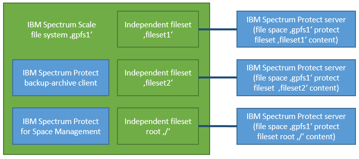
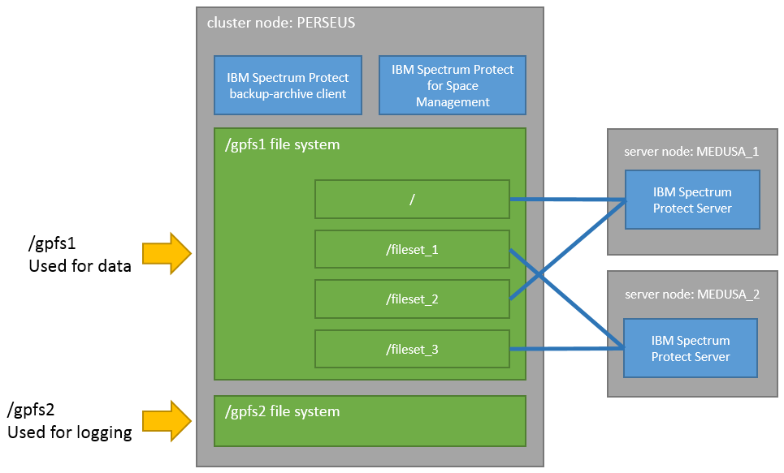

# Petascale Data Protection - using IBM Storage Protect

> Version 1.0
> 
> Author: </br> 
> *Thomas Schreiber* </br> 
> *Patrick Luft* </br> 
> *Dominic Müller-Wicke*
> 
> © Copyright International Business Machines Corporation 2013, 2022.</br> 
> US Government Users Restricted Rights – Use, duplication or disclosure restricted by GSA ADP Schedule Contract with IBM Corp.

> This edition applies to Version 8.1.16 and later of the IBM Storage Protect server, and to all subsequent releases and modifications until otherwise indicated in new editions or technical newsletters.

## Table of Content
* [1. Introduction](#1-introduction)
  * [1.1 Architectural overview](#11-architectural-overview)
  * [1.2 Who should read this paper?](#12-who-should-read-this-paper)
* [2. Test environment](#2-test-environment)
* [3. Setting up the environment](#3-setting-up-the-environment)
  * [3.1 Planning and configuration](#31-planning-and-configuration)
  * [3.2 Installing the products](#32-installing-the-products)
  * [3.3 Configuration and logging file system](#33-configuration-and-logging-file-system)
  * [3.4 Logging directory](#34-logging-directory)
  * [3.5 HSM multiple-server setup](#35-hsm-multiple-server-setup)
  * [3.6 General policy rule statements](#36-general-policy-rule-statements)
* [4. Active server binding](#4-active-server-binding)
  * [4.1 Verification by using an HSM command](#41-verification-by-using-an-hsm-command)
  * [4.2 Verification by using an IBM Storage Scale command](#42-verification-by-using-an-ibm-storage-scale-command)
  * [4.3 Verification by using the IBM Storage Scale policy engine](#43-verification-by-using-the-ibm-storage-scale-policy-engine)
* [5. Backup](#5-backup)
  * [5.1 Backup processing best practices](#51-backup-processing-best-practices)
  * [5.2 Backup processing](#52-backup-processing)
* [6. Restore](#6-restore)
  * [6.1 Restore processing](#61-restore-processing)
* [7. Migration and recall](#7-migration-and-recall)
  * [7.1 Migration and recall processing best practices](#71-migration-and-recall-processing-best-practices)
  * [7.2 Migration and recall processing](#72-migration-and-recall-processing)
  * [7.3 Migration based on fileset granularity](#73-migration-based-on-fileset-granularity)
  * [7.4 Transparent recall](#74-transparent-recall)
  * [7.5 Tape-optimized recall](#75-tape-optimized-recall)
* [8. Recovering missing stub files](#8-recovering-missing-stub-files)
* [9. Reconciling a multiple-server file system](#9-reconciling-a-multiple-server-file-system)
* [10. SOBAR backup processing](#10-sobar-backup-processing)
* [11. Recovering from a disaster](#11-recovering-from-a-disaster) 
* [12. References](#12-references)
* [13. Notices](#13-notices)
  * [13.1 Trademarks](#131-trademarks)

--- 
## 1. Introduction

You can protect data that scales up to hundreds of petabytes in an IBM Storage Scale file system that uses the IBM Storage Protect™ backup-archive client and IBM Storage Protect for Space Management. This paper provides configuration guidance for the setup and operation of data protection processes in this environment.

This paper also introduces the concept of different service levels for data protection at the file system and fileset level.

### 1.1 Architectural overview

To use this approach, a large IBM Storage Scale file system is divided into multiple independent filesets. Each fileset is protected by using the IBM Storage Protect backup-archive client and optionally, with IBM Storage Protect for Space Management. IBM Storage Protect for Space Management can be used for data tiering to a nearline storage device like tape, and it enables the environment for disaster protection by using the Scale Out Backup and Restore (SOBAR) function.

One file system corresponds to one file space on the IBM Storage Protect server. For one file system, multiple IBM Storage Protect server file spaces can be created on different server instances. An independent fileset is a subset of a file system and is handled as a subset of a file space on the IBM Storage Protect server. With this approach, each fileset can be protected with one physical server. This approach increases the maximum data protection capacity by multiplying the maximum server capacity by the number of used servers.

The following figure shows a logical overview of the architecture. The IBM Storage Scale cluster in green on the left side implements a file system that contains several\ independent filesets. The IBM Storage Protect backup-archive client and IBM Storage Protect for Space Management are installed on the cluster nodes in blue. The IBM Storage Protect servers in blue on the right side provide the data-protection storage backend with multiple server instances. Each IBM Storage Scale fileset corresponds to an instance of the IBM Storage Protect server:



*Figure 1: High-level architectural overview*

The described data protection environment can be realized with multiple IBM Storage Scale server or client nodes. Each IBM Storage Scale cluster node that is used for data protection requires the installation and configuration of the IBM Storage Protect backup-archive client and optionally, the IBM Storage Protect for Space Management client.

### 1.2 Who should read this paper?

Administrators who are experienced in protecting IBM Storage Scale file systems by using IBM Storage Protect and who plan to design and implement a scale-out data protection infrastructure should read this paper. In addition, the paper is intended to help technical sales and service personnel to integrate the technologies into customer business processes so that a single file system namespace can be split into different service levels for backup operations and data tiering.

---
## 2. Test environment

> **Assumptions:**
> - The IBM Storage Protect server, IBM Storage Protect backup-archive client, and IBM Storage Protect for Space Management are installed and configured. 
> - The base function of IBM Storage Scale and IBM Storage Protectare verified.
>
> **Before you begin:** 
> - The preferred method is to review the official product documentation in before you configure the system environment as described in this paper.


The following figure provides an overview of the compute and storage environment:



*Figure 2: Test environment*

In the figure, the IBM Storage Scale cluster is a single-node cluster (node and cluster name: PERSEUS). The existing Network Shared Disks (NSDs) are combined in two devices that are called gpfs1 and gpfs2 and are mounted to mount points /gpfs1 and /gpfs2. All IBM Storage Scale configuration parameters have default values. The file system has one root fileset and three explicit filesets (see CLI 1). All filesets are defined as\ independent filesets.

```
> mmlsfileset /dev/gpfs1 

Filesets in file system 'gpfs1':
 
Name          Status     Path             
root          Linked     /gpfs1           
fileset_1     Linked     /gpfs1/fileset_1 
fileset_2     Linked     /gpfs1/fileset_2 
fileset_3     Linked     /gpfs1/fileset_3 
```
*CLI 1: Filesets that are created and used in the test environment*

IBM Storage Protect: The backup-archive client is installed and configured with default values. Before you install IBM Storage Protect for Space Management (hereinafter, the HSM client), the export setting HSMINSTALLMODE=SCOUTFREE was set to automatically disable the standard automatic migration, which is not used in this environment. The following HSM client options are set in the dsm.opt file:


```
============================================================
HSMENABLEIMMEDIATEMIGRATE  YES 
HSMDISABLEAUTOMIGDAEMONS   YES 
HSMEXTOBJIDATTR            YES 
HSMMULTISERVER             YES 
============================================================
```
*Code listing 1: User options in the test environment*

The IBM Storage Protect servers MEDUSA_1 and MEDUSA_2 were configured according to the [IBM Storage Protect Blueprint](https://www.ibm.com/support/pages/ibm-spectrum-protect-blueprints) for small installations. To simplify problem analysis and logging, the server stanzas (ERRORLOGNAME, HSMLOGNAME) were edited to log in to different log files. See the following listing:

```
============================================================
SERVERNAME            MEDUSASERV_1 
  TCPPORT             1500
  TCPSERVERADDRESS    MEDUSA_1.X.Y.Z
  PASSWORDACCESS      GENERATE
  ASNODENAME          MYTHOLOGY
  NODENAME            THESEUS
  ERRORLOGNAME        /gpfs2/log/dsmerror.medusa1.log
  HSMLOGNAME          /gpfs2/log/hsm.medusa1.log
  HSMLOGEVENTFLAGS    FILE

SERVERNAME            MEDUSASERV_2 
  TCPPORT             1500 
  TCPSERVERADDRESS    MEDUSA_2.X.Y.Z 
  PASSWORDACCESS      GENERATE 
  ASNODENAME          MYTHOLOGY 
  NODENAME            PERSEUS 
  ERRORLOGNAME        /gpfs2/log/dsmerror.medusa2.log 
  HSMLOGNAME          /gpfs2/log/hsm.medusa2.log 
  HSMLOGEVENTFLAGS    FILE 
============================================================
```
*Code listing 2: Server stanzas in the test environment*

---
## 3. Setting up the environment

You can set up and configure a data protection environment with multiple nodes and multiple servers.

### 3.1 Planning and configuration

* Review the most recent product documentation to get information about changes and improvements in the used functions. Both IBM Storage Scale and IBM Storage Protect for Space Management provide an FAQ document. Find them in [References](#12-references).
* When you size the IBM Storage Scale cluster, remember that the mmbackup command adds workload (in terms of memory consumption, cluster network I/O, and CPU) on all cluster nodes that are involved in backup processing. In addition, all cluster nodes that participate in the backup processing must have sufficient I/O bandwidth to the IBM Storage Scale storage system. Furthermore, adequate bandwidth must be available for the connection to the IBM Storage Protect server.
* The smallest entity for processing (for the backup-archive client and HSM) is a file system or fileset. To accelerate the processing for one entity, parallelize it by distributing the workload to multiple nodes. If multiple entities must be backed up at the same time, select distinct sets of nodes for each entity. If one entity is finished, you can start to process another entity by using the same set of nodes.
* Do not mix operating systems for backup and restore processing in a heterogeneous cluster environment.
* You can use IBM Storage Protect include and exclude options to control which files and directories are backed up. The mmbackup command translates these options into IBM Storage Scale policy rules for backup. The translation of these options into rules can be complex and might have significant impact on scan performance. For more information, see [technote 1699569](http://www-01.ibm.com/support/docview.wss?uid=swg21699569).

### 3.2 Installing the products

> **Before you install HSM packages:** Issue the following UNIX
>
>   `shell command: export HSMINSTALLMODE=SCOUTFREE`
> 
> In this way, you can automatically streamline the HSM client for use in IBM Storage Scale environments.

To take advantage of improvements and defect fixes, install the latest versions of IBM Storage Protect and IBM Storage Scale.

### 3.3 Configuration and logging file system

The product functions that are used in the multiple-server environment require several configuration and command input files. These are the dsm.sys and dsm.opt files for the IBM Storage Protect client configuration or the rule files that are used for the different policy engine runs. The preferred method is to store a copy of these files in a global working directory to ensure that the files are available on all nodes in the cluster that manage the processing. For the described test environment, a shared file system with mount point /gpfs2 is used. It contains directories for logging and configuration files:


| Directory               | Content             |
|-------------------------|---------------------|
| `/gpfs2/config`         | Configuration information, such as copies of the `dsm.sys` and `dsm.opt` files; policy rule files; and a server-to-fileset mapping table |
| `/gpfs2/log`            | Logging information, such as the following files: mmbackup log, mmapplypolicy log, dsmerror.log, and hsm.log

*Table 1: Logging and configuration files directory*

The configuration directory is backed up daily to ensure that the information is available after the accidental deletion of data or a disaster.

### 3.4 Logging directory

Because several IBM products and product functions are combined in a multiple-server data protection environment, log space must be handled with care. Consider the following items:
1.The use of one globally available logging directory simplifies the analysis of results and problems.
2.Different product functions might generate a significant amount of information and enough space must be available to store it.

The preferred method is to log all information in a separate IBM Storage Scale file system that is mounted on all affected nodes. You can use the following command-line parameters and log directory settings to ensure that all logging tools write to the same directory:

**mmbackup command-line options**

| directory          | `--tsm-servers` | `-g` and `-s` |
|--------------------|-----------------|---------------|
| `/gpfs1`           | MEDUSASERV_2    | `/gpfs2/log/mmbackup/gpfs1/root` |
| `/gpfs1/fileset_1` | MEDUSASERV_1    | `/gpfs2/log/mmbackup/gpfs1/fileset_1` |
| `/gpfs1/fileset_2` | MEDUSASERV_1    | `/gpfs2/log/mmbackup/gpfs1/fileset_2` |
| `/gpfs1/fileset_3` | MEDUSASERV_2    | `/gpfs2/log/mmbackup/gpfs1/fileset_3` |

*Table 2: Log directories for the mmbackup command*

**mmapplypolicy command-line options**

| directory          | `-g` and `-s`        |
|--------------------|----------------------|
| `/gpfs1`           | `/gpfs2/log/mmapplypolicy/gpfs1/root` |
| `/gpfs1/fileset_1` | `/gpfs2/log/mmapplypolicy/gpfs1/fileset_1` |
| `/gpfs1/fileset_2` | `/gpfs2/log/mmapplypolicy/gpfs1/fileset_2` |
| `/gpfs1/fileset_3` | `/gpfs2/log/mmapplypolicy/gpfs1/fileset_3` |

*Table 3: Log directories for the mmapplypolicy command*


**IBM Storage Protect server stanzas**                       

* **SERVERNAME:** MEDUSASERV_1
  * **ERRORLOGNAME**  `/gpfs2/log/dsmerror.medusa1.log`
  * **HSMLOGNAME**    `/gpfs2/log/hsm.medusa1.log`
* **SERVERNAME:** MEDUSASERV_2    
  * **ERRORLOGNAME**   `/gpfs2/log/dsmerror.medusa2.log`
  * **HSMLOGNAME**     `/gpfs2/log/hsm.medusa2.log`

*Table 4: IBM Storage Protect log directories*

### 3.5 HSM multiple-server setup

This section describes how to set up IBM Storage Protect for Space Management to manage a single file system by using multiple IBM Storage Protect servers. This type of setup is called an HSM multiple-server environment. The setup of the HSM multiple-server environment enables active server binding by using the server name attribute as described in the previous section.

Initially, you must add the HSM management server to the file system as shown in this example:

```
> dsmmigfs Add -SErver=MEDUSASERV_1 /gpfs1
```
*CLI 2: Adding the HSM management server*

To enable the HSM multiple-server environment, you must add the initially used server and all other available servers to the environment as shown in this example:

```
> dsmmigfs ADDMultiserver -Server=MEDUSASERV_1 /gpfs1 
> dsmmigfs ADDMultiserver -Server=MEDUSASERV_2 /gpfs1
```
*CLI 3: Adding another HSM server*

The setup can be verified as shown in the following example:

```
> dsmmigfs QUERYMultiserver /gpfs1 
IBM Tivoli Storage Manager

Command Line Space Management Client Interface 
Client Version 7, Release 1, Level 6 
Client date/time: 03/21/16 12:57:45 
(c) Copyright by IBM Corporation and other(s) 1990, 2016. All Rights Reserved. 

 Server Name   Bytes [KByte]     Files     Throughput [MByte/s]
 MEDUSASERV_1  0                 0         0                 
 MEDUSASERV_2  0                 0         0               

```
*CLI 4: Verifying the HSM multiple-server environment*

> **Restriction:** As described in the IBM Storage Protect for Space Management product documentation, multiple-server setup tools automatically create sample policy rules for migration processing.  Do not use these policy rules. Instead, use the policy rules that are described in [Migration and recall](#7-migration-and-recall).

### 3.6 General policy rule statements

This section describes general IBM Storage Scale information lifecycle management (ILM) rules and policies that are used throughout this paper. These rules are wrapped into macros, defining a term for an expression, as shown in the following list.

> **Requirement:** If you create a policy file, you must place a list of definitions in the file before any rules.

```
============================================================
/*=== identify files that are in state premigrated ===*/

 define(is_premigrated, 
        (MISC_ATTRIBUTES LIKE '%M%' AND 
         MISC_ATTRIBUTES NOT LIKE '%V%'))

 /*=== identify files that are in state migrated ===*/

 define(is_migrated, 
        (MISC_ATTRIBUTES LIKE '%V%'))

 /*=== identify files that are in state resident ===*/

 define(is_resident,
        (MISC_ATTRIBUTES NOT LIKE '%M%'))

 /*=== allow the comparison of the servername attribute ===*/

 define(servername,
        (XATTR('dmapi.IBMServ') ))

 /*=== exclude list for file that must not be processed from HSM ===*/

 define(exlude_list,
        (PATH_NAME LIKE '%/.SpaceMan/%'
            OR NAME LIKE '%dsmerror.log%'
            OR NAME LIKE '%.mmbackup%'))
============================================================
```
*Code listing 3: Frequently used policy definition statements*

---
## 4. Active server binding

You can use the active server binding function to ensure that a file in a fileset is sent to only one server. You can enable active server binding when you implement an HSM multiple-server environment that includes IBM Storage Protect for Space Management.

> **Tip:** Active server binding is applied to the server that is named in the server stanza (see [Test environment](#2-test-environment)).

After you bind a file to a server, the initial backup or migration of the file causes the creation of a hidden attribute in the inode of the file. Any attempt to send the file to a different server fails. At the same time, IBM Storage Protect for Space Management functions such as backing up files before migration ("backup before migrate") work as expected. Furthermore, active server binding enables the inline copy function.

> **Tip:** Active server binding is an IBM Storage Protect for Space Management function, and the IBM Storage Protect backup-archive client uses the function if the HSM multiple-server environment is enabled. In a pure backup environment without IBM Storage Protect for Space Management, the active binding that is provided by IBM Storage Protect tools is not possible. You must take manual steps to ensure that the filesets are always backed up to the same IBM Storage Protect server.

Before you start operations to back up or migrate files to different servers, you must document the correlation between filesets and server names. This step is important to allow the reconstruction of the environment after a system failure or a disaster. For the test environment, the correlation was documented as follows:

**Device: gpfs1**

| Fileset           | Linkage            | Server name  | 
|-------------------|--------------------|--------------|
| root              | `/gpfs1`           | MEDUSASERV_2 |
| fileset_1         | `/gpfs1/fileset_1` | MEDUSASERV_1 |
| fileset_2         | `/gpfs1/fileset_2` | MEDUSASERV_1 |
| fileset_3         | `/gpfs1/fileset_3` | MEDUSASERV_2 |

*Table 5: Documenting the correlation between filesets and servers*

> **Tip:** When you bind a file to a server, operations to back up and migrate files use the same server. To change the binding, use one of the following methods:
> - To change the binding for an individual file, create a copy of the file and delete the original file. Then, rename the new file to the old file name. After that, back up and migrate the new file.
> - To recall all files from a server and remove the binding, use the HSM multiple-server command `dsmMultiServerRemove.pl`.  

You can use the following methods to verify that files are backed up or migrated with active server binding:
* By using the HSM command dsmls (see [Verification by using an HSM command](#41-verification-by-using-an-hsm-command))
* By using the IBM Storage Scale command mmlsattr (see [Verification by using an IBM Storage Scale command](#42-verification-by-using-an-ibm-storage-scale-command))
* By using the IBM Storage Scale policy engine (see [Verification by using an IBM Storage Scale policy engine](#43-verification-by-using-the-ibm-storage-scale-policy-engine))

### 4.1 Verification by using an HSM command

You can obtain the bind information for a file by using the HSM command dsmls. As seen in the following example, the Srv column displays the name of the binding server:
```
> dsmls rootfile*

IBM Tivoli Storage Manager 
Command Line Space Management Client Interface 
&ensp; Client Version 7, Release 1, Level 6 
&ensp; Client date/time: 03/18/16 11:16:37 
(c) Copyright by IBM Corporation and other(s) 1990, 2016. All Rights Reserved.

ActS     ResS     ResB  FSt  Srv           FName      
1048576  1048576  1024  r    MEDUSASERV_2  rootfile0 
1048576  1048576  1024  r    MEDUSASERV_2  rootfile1  

```
*CLI 5: Showing server bind values*

> **Tip:** To obtain a description of all column headers, use the --help argument of the dsmls command.

### 4.2 Verification by using an IBM Storage Scale command

You can obtain the server bind attribute for a file by using the IBM Storage Scale command mmlsattr. The active server binding function sets an extended attribute named dmapi.IBMServ:
```
> mmlsattr -d -L rootfile1 | grep IBMServ 

dmapi.IBMServ:  "MEDUSASERV_2"
```
*CLI 6: Using the mmlsattr command to get the server name for a file*

### 4.3 Verification by using the IBM Storage Scale policy engine

Due to the limited performance of the dsmls and mmlsattr commands, it is more practical to use the IBM Storage Scale policy engine to list the files that bind to a given server. For example, to list all files that are bound to server MEDUSASERV, the following policy can be used (by using macros that are defined in [General policy rule statements](#36-general-policy-rule-statements)):
```
============================================================
RULE EXTERNAL LIST 'MEDUSA_RESIDENT' EXEC '' 
RULE EXTERNAL LIST 'MEDUSA_PREMIG' EXEC '' 
RULE EXTERNAL LIST 'MEDUSA_MIG' EXEC ''

RULE 'resident_files' LIST 'MEDUSA_RESIDENT'
      WHERE (is_resident) AND servername LIKE 'MEDUSASERV_2%' 

RULE 'premigrated_files' LIST 'MEDUSA_PREMIG'
      WHERE (is_premigrated) AND servername LIKE 'MEDUSASERV_2%' 

RULE 'migrated_files' LIST 'MEDUSA_MIG'
      WHERE (is_migrated) AND servername LIKE 'MEDUSASERV_2%
============================================================
```
*Code listing 4: Policy rule that lists all files that are bound to a server*

The rules, which must be stored in a policy file, can be used to generate lists that contain all files that are bound to a specified server. The mmapplypolicy command can be used to execute the rules. The parameter --P specifies the name of file that contains the rules. The following example shows the mmapplypolicy command with the file system scope:
```
> mmapplypolicy gpfs1 -N perseus -P rulefile
  -s /gpfs2/log/mmapplypolicy/gpfs1 -g /gpfs2/log/mmapplypolicy/gpfs1
  -f /gpfs2/log/mmapplypolicy/gpfs1/scan.out -I defer \--scope filesystem
```
*CLI 7: Listing all files with binding for a full file system*

The following example shows the mmapplypolicy command with the fileset scope:
```
> mmapplypolicy /gpfs1/ -N perseus -P rulefile 
  -s /gpfs2/log/mmapplypolicy/gpfs1/root -g /gpfs2/log/mmapplypolicy/gpfs1/root 
  -f /gpfs2/log/mmapplypolicy/gpfs1/root/scan.out -I defer \--scope inodespace 
```
*CLI 8: Listing all files with binding for a fileset*

---
## 5. Backup

You can use the IBM Storage Scale mmbackup command in an environment where each independent fileset is backed up to an IBM Storage Protect server. The IBM Storage Protect server can be different for different filesets.

### 5.1 Backup processing best practices

* Use the processing options -q and \--rebuild on the mmbackup command as seldom as possible. Rebuilding the shadow database of the mmbackup command takes time because the IBM Storage Protect server must be queried.
* Consider IBM Storage Protect character limitations. Files with control-X, control-Y, carriage returns, and the new line character in their names can't be backed up to IBM Storage Protect. The IBM Storage Protect processing options\ quotesareliteral (in combination with the mmbackup command option \--noquote) and wildcardsareliteral can help if you are faced with special characters in path or file names.
* Do not use the IBM Storage Protect processing options --subdir=yes, quiet, scrollprompt, or scrolllines.
* When you run the mmbackup command, avoid using processing option --B. The new options \--max-backup-count, \--max-expire-count, and \--max-backup-size make it possible to fine-tune mmbackup command processing. The values that you use for these options should be multiples of the IBM Storage Protect processing options txnbytelimit and TXNGROUPMAX. For more information, see the\ mmbackup command documentation.
* When you run the mmbackup command, avoid using processing option -m. The new options \--backup-threads and --expire-threads make it possible to fine-tune mmbackup command processing. The values that are used for these options should be aligned with the values that are used for the IBM Storage Protect processing options RESOURCEUTILIZATION and MAXSESSIONS, and with the MAXNUMMP parameter, as explained below.

The IBM Storage Protect processing option RESOURCEUTILIZATION defines the number of consumer and producer threads in the dsmc command for backup operations. The following table shows values and session numbers for backup operations. Expiration processing uses only one session.

**RESOURCEUTILIZATION**         

| Value                 | Number of sessions (send+query) | 
|-----------------------|-----------------------------------|
| 1                     | 1         |
| 0 (default), 2        | 2 (1+1)   |
| 3, 4                  | 3 (2+1)   |
| 5, 6                  | 4 (3+1)   |
| 7                     | 5 (4+1)   |
| 8                     | 6 (5+1)   |
| 9                     | 7 (6+1)   |
| 10                    | 8 (7+1)   |

*Table 6: Values and numbers of sessions for the RESOURCEUTILIZATION option*

The total number of backup sessions coming into the server based on the mmbackup option --backup-threads and the client processing option\ RESOURCEUTILIZATION should be reflected in the setting of the server options MAXSESSIONS and MAXNUMMP.
```
============================================================
#sessions = (#backup-threads * #nodes *   (RESOURCEUTILIZATION\[VALUE\] - 1)) 
============================================================
```
*Code listing 5: Calculating the number of server sessions*

The number of sessions reflects the MAXNUMMP setting for the client node. The value of the server option MAXSESSIONS should be the sum of the MAXNUMMP values for all nodes.

The number of backup threads that are configured with the mmbackup command depends on the number of mount points that are configured for the node (server option MAXNUMMP), and can be calculated as follows:
```
============================================================
#backup-threads = #mount-points / (#nodes * (RESOURCEUTILIZATION\[VALUE\] - 1))
============================================================
```
*Code listing 6: Calculating the number of backup threads*

The total number of expire sessions coming into the server based on the\ mmbackup option --expire-threads should be reflected in the setting of the server MAXSESSIONS option.
```
============================================================
#sessions = (#expire-threads * #nodes)
============================================================
```
*Code listing 7: Calculating the number of sessions*

### 5.2 Backup processing

When you back up a fileset instead of a file system, the fileset must be an independent fileset with a separate inode space from the file system. To run a fileset-level backup operation, you must create a snapshot for the fileset first. Then, run the mmbackup command to back up the files from the snapshot by using the option --S snapshotname and --scope inodespace.

For example, you can back up an independent fileset (fileset_1) to the server MEDUSASERV_1:

```
1. create snapshot

   > mmcrsnapshot /dev/gpfs1nsd snap1 -j fileset_1

2. backup fileset              

   > mmbackup /gpfs1/fileset_1/ -t full -S snap1
     -s /gpfs2/log/mmbackup/gpfs1/fileset_1 -g /gpfs2/log/mmbackup/gpfs1/fileset_1
     --tsm-servers MEDUSASERV_1 --scope inodespace

3. delete snapshot

   > mmdelsnapshot /dev/gpfs1nsd snap1 -j fileset_1
```
*CLI 9: Backing up an independent fileset to a server*

> **Requirement for the initial run of the mmbackup command:** The initial run of the mmbackup command must be started with the argument -t full. This ensures that a file space for the file system will be created on the IBM Storage Protect server.
> 
> **Recommendation to delete snapshots:** IBM Storage Scale snapshots do not support the data management application protocol interface (DMAPI) completely. Because IBM Storage Protect for Space Management relies on the DMAPI, this fact has an impact on HSM processing. It is strongly recommended that you delete snapshots immediately after backup processing has finished.  

All other independent filesets, including the root fileset, can be backed up with the same process. Certain parameters, such as the fileset name, directory, and the server name (\--tsm-servers), must be adjusted.

> **Tip:** To learn more about processing options for the mmbackup command and how they can be used to optimize backup performance, see [mmbackup command reference](https://www.ibm.com/docs/en/storage-scale/5.1.8?topic=reference-mmbackup-command).  

---
## 6. Restore

You can use the IBM Storage Protect restore process to recover missing files in a multi-server environment where each fileset is mapped to a different IBM Storage Protect server. In addition to the IBM Storage Protect backup-archive client GUI, the command-line client (dsmc) can be used to find files and to restore files from the server backup to the file system.

### 6.1 Restore processing

If multiple independent filesets of the same file system are backed up to the same IBM Storage Protect server, all files that belong to the given file system can be queried from this server. In this case, the path for the query is the file system path:

```
> dsmc query backup -detail -subdir=yes /gpfs1/ -servername=MEDUSASERV_1
```
*CLI 10: Querying all files for a file system and server*

You can use a similar query to list the files according to a single fileset, whereby the query path name is the fileset path name:

```
> dsmc query backup -detail -subdir=yes /gpfs1/fileset_1/ -servername=MEDUSASERV_1
```
*CLI 11: Querying all files for a fileset and server*

You can restore files by using the file lists that were generated from the output of the previous backup query:

```
1. generate file list of all protected files in fileset, where filename starts with "peter":

   > dsmc query backup \"/gpfs1/fileset_1/peter*\" -subdir=yes -servername=MEDUSASERV_1 ' grep \" B \" ' awk '{ print \$7 }' > restore.list

2. restore the file list

   > dsmc restore -filelist=restore.list -servername=MEDUSASERV_1
```
*CLI 12: Restoring files by using a file list*

You can also query and restore files by using wildcards, as shown in the following example:

```
1. restore all files, where filename contains "rob":
   > dsmc restore \"/gpfs1/fileset_1/*rob*\" -subdir=yes -servername=MEDUSASERV_1
```
*CLI 13: Restoring files by using wildcards*

By using a file list for the restore operation, you can start multiple parallel restore sessions and possibly improve the performance of the operation. When you use this method, a large file list can be broken down into smaller file lists and these smaller file lists can be used as input for multiple restore commands (dsmc restore --filelist).  You can distribute the workload to multiple nodes that are configured for backup operations by executing the restore commands with different file lists on different nodes simultaneously.

> **Restriction:** Restore operations that are based on file lists do not optimize access to files on the IBM Storage Protect server. The files are processed in the order in which they were written to the file list. The file lists for each restore command should include logical breaks in the directory structure to prevent too many restore processes from writing to the same directory.

---
## 7. Migration and recall

You can use IBM Storage Protect for Space Management to migrate and recall files in a multiple-server environment where each independent fileset is migrated to an IBM Storage Protect server. The IBM Storage Protect server can be different for different filesets.

### 7.1 Migration and recall processing best practices

* To improve migration performance to tape, use the IBM Storage Protect for Space Management processing option hsmgroupedmigrate yes.
* To ensure that expired files can be recovered, do not set the IBM Storage Protect for Space Management processing option migfileexpiration to 0.
* IBM Storage Protect for Space Management is not a backup program. To avoid losing migrated data, specify migrequiresbackup=yes. Furthermore, use migration policies that allow the migration of files that have a valid copy in backup.
* Use tape-optimized recall if it can be integrated into your business processes in terms of accessing migrated files.

### 7.2 Migration and recall processing

The preferred method is to run the migration on each fileset with a separate policy dedicated to each fileset. You can do this by using the mmapplypolicy option and specifying \--scope inodespace and the migration rules that are defined below.

Furthermore, you can use the policy rule statement FOR FILESET to ensure that the policy scan is focused on the right content. If you plan to apply the same rule that defines the target server for the migration to several filesets, do not use the FOR FILESET argument to reduce the number of rule sets to be maintained.

> **Requirement:** The general policy rule statements must be applied here, as well. For more information, see [General policy rule statements](#36-general-policy-rule-statements).

### 7.3 Migration based on fileset granularity

As shown in `Code listing 8`, a complete ruleset was prepared for a fileset that has an active server binding to IBM Storage Protect server MEDUSASERV_1. The ruleset is stored in file /gpfs2/config/rulefile.MEDUSASERV_1. Definitions identify files that are already migrated, premigrated, or resident.

Furthermore, the servername definition is used to read the servername attribute, where the binding to the server is stored. The definition for the exclude list ensures that files that must not be migrated are skipped during the policy scan. This list should be adapted to customer needs. The external pool rule ensures that migration is exclusively to the IBM Storage Protect server MEDUSASERV_1. The migration rule also defines the source and the target pool for the migration. In addition, the thresholds can be defined here. In `Code listing 8`, the threshold definition ensures that all files are premigrated.

> **Tip:** The definition of the threshold values determines whether the files are premigrated, migrated, or resident. For a description
of the rules that can be applied, see the following listings. 

The where clause defines which files are included in, and excluded from, the scan.

```
============================================================
define(is_premigrated,
    (MISC_ATTRIBUTES LIKE '%M%' AND 
     MISC_ATTRIBUTES NOT LIKE '%V%'))
define(is_migrated, 
    (MISC_ATTRIBUTES LIKE '%V%'))
define(is_resident,
    (MISC_ATTRIBUTES NOT LIKE '%M%'))
define(servername, 
    (XATTR('dmapi.IBMServ') ))
define(exlude_list, 
    (PATH_NAME LIKE '%/.SpaceMan/%'
      OR NAME LIKE '%dsmerror.log%'
      OR NAME LIKE '%.mmbackup%'))

RULE EXTERNAL POOL 'MEDUSASERV_1_POOL' EXEC '/opt/tivoli/tsm/client/hsm/multiserver/bin/hsmExecScript.pl 'OPTS '-v -server MEDUSASERV_1'

RULE 'MEDUSASERV_1' MIGRATE
  FROM POOL 'system' THRESHOLD(0,100,0) 
  TO POOL 'MEDUSASERV_1_POOL'
    WHERE NOT (exlude_list) 
    AND NOT (is_migrated)
    AND NOT (is_premigrated)
============================================================
```
*Code listing 8: Policy to premigrate all files in a given fileset*

The values of the THRESHOLD policy statement define whether and how files are migrated, as shown in these examples:

1. Start the threshold migration in a situation where the file system has filled up to 90% of its available space. Migrate files until the minimum threshold of 80% of the available space is reached. Premigrate files that use 10% (80% minus 70%) of the available space in the file system.
   ```
   ============================================================
   RULE 'MEDUSASERV' MIGRATE
        FROM POOL 'system' THRESHOLD(90,80,70)
        TO POOL 'MEDUSASERV_1'
            AND NOT (is_migrated)
   ============================================================
   ```
   *Code listing 9: Rule example for threshold migration*

2. Premigrate all files in the file system.
   ```
   ============================================================
   RULE 'MEDUSASERV' MIGRATE
        FROM POOL 'system' THRESHOLD(0,100,0)
        TO POOL 'MEDUSASERV_1'
            AND NOT (is_migrated)
            AND NOT (is_premigrated) 
   ============================================================
   ```
   *Code listing 10: Rule example for full premigration*

3. Migrate all files in the file system.
   ```
   ============================================================
   RULE 'MEDUSASERV' MIGRATE
        FROM POOL 'system' THRESHOLD(0,0,0)
        TO POOL 'MEDUSASERV_1 
            AND NOT (is_migrated)
   ============================================================
   ```
   *Code listing 11: Rule example for full migration*

   You must start the policy engine separately for each fileset. The following command shows how the policy engine is started with fileset linkage /gpfs1/fileset_3 in the test environment to migrate files based on the policy rule that is defined in\ /gpfs2/config/rulefile.MEDUSASERV_2.

   ```
   > mmapplypolicy /gpfs1/fileset_3 -N perseus -s /gpfs2/log/mmbackup/gpfs1/fileset_3 -g /gpfs2/log/mmbackup/gpfs1/fileset_3 -P /gpfs2/config/rulefile.MEDUSASERV_2 \--scope inodespace
   ```
   *CLI 14: Running a migration policy on a fileset*

### 7.4 Transparent recall

Transparent recall is intended to be transparent to the user. Therefore, no action is required for fileset-level migration and active server binding. The function works as designed.

### 7.5 Tape-optimized recall

Tape-optimized recall processing optimizes the sequential access to tape storage to improve recall performance. This function is designed to work with a dedicated IBM Storage Protect server.

> **Performance considerations:** Compared to transparent recall, tape-optimized recall has significantly better performance. However, tape-optimized recall requires that the user knows which files must be recalled. If business requirements allow integration of tape-optimized recall into customer processes, the overall experience with HSM will be much better compared to transparent recall processing.
> 
> **Tip:** To generate a list of all files that were migrated for a given fileset, use the policy rule that is described in Verification by using the IBM Storage Scale policy engine.

Use the following commands to perform a tape-optimized recall on a fileset for a specified file list and server:

```
> dsmrecall -detail -filelist=recall.list -server=MEDUSASERV_2 /gpfs1
```
*CLI 15: Running a tape-optimized recall operation*

---
## 8. Recovering missing stub files

You can use IBM Storage Protect for Space Management to undelete files in a multiple-server environment in which filesets are mapped to a server.

You can use the HSM command dsmmigundelete to re-create stub files and premigrated files that were accidentally deleted from a fileset. The command is designed to run at the file-system level and to work with a dedicated IBM Storage Protect server.

> **Restrictions:** 
> - HSM migrates only regular files. Special files and directories are not migrated. Therefore, HSM has no information about directory permissions. Due to this fact, the HSM command dsmmigundelete does not create directories. If parts of a directory tree are missing, they must be restored from a backup.
> - The dsmmigundelete command works on the file-system level.  Therefore, all filesets that contain data migrated to a dedicated server must be handled in one step. All affected directory trees must be complete. 

The following command examples show how a missing directory tree can be re-created and how the dsmmigundelete command is used to re-create stub files in fileset /gpfs1/fileset_1 and fileset_2:

```
> dsmc restore -subdir=yes -dirsonly /gpfs1/fileset_1/ -servername=MEDUSASERV_1
> dsmc restore -subdir=yes -dirsonly /gpfs1/fileset_2/ -servername=MEDUSASERV_1
```
*CLI 16: Restoring a directory tree*


```
> dsmmigundelete -detail -server=MEDUSASERV_1 /gpfs1
```
*CLI 17: Undeleting stub files*

---
## 9. Reconciling a multiple-server file system

You can use the HSM reconcile function to synchronize the information in a file system with the migration information that is stored on an IBM Storage Protect server.

The reconcile program is intended to work on the file-system level for a dedicated server.

Therefore, the program must be started once for each server in the multiple-server environment. The program automatically synchronizes the data for all filesets that have an active server binding to the given server. Use the command as shown in the following example:

```
> dsmreconcileGPFS.pl -server=MEDUSASERV_1 /gpfs1
```
*CLI 18: Reconciling a file system*

---
## 10. SOBAR backup processing

You can use the IBM Storage Scale and IBM Storage Protect SOBAR function to back up images in a multiple-server environment in which filesets are mapped to servers.

In general, the SOBAR backup function is processed at the file-system level. The data protection approach that is described in this paper and implemented at the fileset level will not affect the SOBAR backup. All SOBAR function can be used as is. Because SOBAR requires a connection to an IBM Storage Protect server to back up the file-system image files, one of the servers used for fileset data protection can be used for SOBAR image file backup. You must ensure that enough free space is available in the IBM Storage Protect server storage pool to store the backup copy of the SOBAR image files.

For instructions about using the SOBAR function, see [Scale Out Backup and Restore (SOBAR)](http://www.ibm.com/support/knowledgecenter/STXKQY_4.1.1/com.ibm.spectrum.scale.v4r11.adm.doc/bl1adm_sobar.htm).

---
## 11. Recovering from a disaster

You can use the IBM Storage Scale and IBM Storage Protect SOBAR function to perform disaster recovery in a multiple-server environment in which filesets are mapped to servers.

In general, the SOBAR restore function is processed at the file-system level. The data protection approach described in this paper and implemented at the fileset level does not affect the SOBAR restore process. All SOBAR function can be used as is, and the fileset-level data protection information can be recovered.

For instructions about using the SOBAR function, see [Scale Out Backup and Restore (SOBAR)](http://www.ibm.com/support/knowledgecenter/STXKQY_4.1.1/com.ibm.spectrum.scale.v4r11.adm.doc/bl1adm_sobar.htm).

---
 ## 12. REFERENCES

1. IBM Storage Protect product documentation in IBM Knowledge Center: http://www.ibm.com/support/knowledgecenter/SSGSG7/landing/welcome_ssgsg7.html
2. IBM Storage Scale product documentation in IBM Knowledge Center: http://www.ibm.com/support/knowledgecenter/STXKQY/ibmspectrumscale_welcome.ht ml
3. IBM Elastic Storage Server product documentation in IBM Knowledge Center: https://www.ibm.com/support/knowledgecenter/P8ESS/p8ehc/p8ehc_storage_landing.h tm
4. Integrating IBM Storage Protect with IBM Elastic Storage: https://www.ibm.com/support/pages/system/files/inline-files/$FILE/TSM_ElasticStorage_Integration_0.pdf 
5. Tivoli Field Guide – TSM for Space Management for UNIX-GPFS Integration: http://www.ibm.com/support/docview.wss?uid=swg27018848
6. Tivoli Field Guide – Tivoli Storage Manager for Space Management in a mixed GPFS cluster environment: http://www.ibm.com/support/docview.wss?uid=swg27028178
7. Tivoli Field Guide - Performance of GPFS/HSM – Tivoli Storage Manager for Space Management: Part 1: Automigration: http://www.ibm.com/support/docview.wss?uid=swg27020987
8. Considerations for using IBM Storage Protect include and exclude options with IBM Storage Scale mmbackup command: http://www.ibm.com/support/docview.wss?uid=swg21699569
9. Data Storage Management (XDSM) API: http://pubs.opengroup.org/onlinepubs/9657099/
10. IBM Storage Scale FAQ: https://www.ibm.com/support/knowledgecenter/STXKQY/gpfsclustersfaq.html
11. IBM Storage Protect for Space Management FAQ: http://www.ibm.com/support/docview.wss?uid=swg21474412
12. IBM Storage Protect Blueprints: https://www.ibm.com/support/pages/ibm-spectrum-protect-blueprints 

---
## 13. Notices

This information was developed for products and services offered in the US. This material might be available from IBM in other languages. However, you may be required to own a copy of the product or product version in that language in order to access it.

IBM may not offer the products, services, or features discussed in this document in other countries. Consult your local IBM representative for information on the products and services currently available in your area. Any reference to an IBM product, program, or service is not intended to state or imply that only that IBM product, program, or service may be used. Any functionally equivalent product, program, or service that does not infringe any IBM intellectual property right may be used instead. However, it is the user's responsibility to evaluate and verify the operation of any non-IBM product, program, or service.

IBM may have patents or pending patent applications covering subject matter described in this document. The furnishing of this document does not grant you any license to these patents. You can send license inquiries, in writing, to:

*IBM Director of Licensing*</br>
*IBM Corporation*</br>
*North Castle Drive, MD-NC119*</br>
*Armonk, NY 10504-1785*</br>
*US*

For license inquiries regarding double-byte character set (DBCS) information, contact the IBM Intellectual Property Department in your country or send inquiries, in writing, to:

Intellectual Property Licensing</br>
Legal and Intellectual Property Law</br>
IBM Japan Ltd.</br>
19-21, Nihonbashi-Hakozakicho, Chuo-ku</br>
Tokyo 103-8510, Japan

INTERNATIONAL BUSINESS MACHINES CORPORATION PROVIDES THIS PUBLICATION \"AS IS\" WITHOUT WARRANTY OF ANY KIND, EITHER EXPRESS OR IMPLIED, INCLUDING, BUT NOT LIMITED TO, THE IMPLIED WARRANTIES OF NON-INFRINGEMENT, MERCHANTABILITY OR FITNESS FOR A PARTICULAR PURPOSE. Some jurisdictions do not allow disclaimer of express or implied\ warranties in certain transactions, therefore, this statement may not apply to you.

This information could include technical inaccuracies or typographical errors. Changes are periodically made to the information herein; these changes will be incorporated in new editions of the publication. IBM may make improvements and/or changes in the product(s) and/or the program(s) described in this publication at any time without notice.

Any references in this information to non-IBM websites are provided for convenience only and do not in any manner serve as an endorsement of those websites. The materials at those websites are not part of the materials for this IBM product and use of those websites is at your own risk.

IBM may use or distribute any of the information you provide in any way it believes appropriate without incurring any obligation to you.

Licensees of this program who wish to have information about it for the purpose of enabling: (i) the exchange of information between independently created programs and other programs (including this one) and (ii) the mutual use of the information which has been exchanged, should contact:

*IBM Director of Licensing*</br>
*IBM Corporation*</br>
*North Castle Drive, MD-NC119*</br>
*Armonk, NY 10504-1785*</br>
*US*

Such information may be available, subject to appropriate terms and conditions, including in some cases, payment of a fee.

The licensed program described in this document and all licensed material available for it are provided by IBM under terms of the IBM Customer Agreement, IBM International Program License Agreement or any equivalent agreement between us.

Information concerning non-IBM products was obtained from the suppliers of those products, their published announcements or other publicly available sources. IBM has not tested those products and cannot confirm the accuracy of performance, compatibility or any other claims related to non-IBMproducts. Questions on the capabilities of non-IBM products should be addressed to the suppliers of those products.

This information is for planning purposes only. The information herein is subject to change before the products described become available.

This information contains examples of data and reports used in daily business operations. To illustrate them as completely as possible, the examples include the names of individuals, companies, brands, and products. All of these names are fictitious and any similarity to actual people or business enterprises is entirely coincidental.

COPYRIGHT LICENSE:

This information contains sample application programs in source language, which illustrate programming techniques on various operating platforms. You may copy, modify, and distribute these sample programs in any form without payment to IBM, for the purposes of developing, using, marketing or distributing application programs conforming to the application programming interface for the operating platform for which the sample programs are written. These examples have not been thoroughly tested under all conditions. IBM, therefore, cannot guarantee or imply reliability, serviceability, or function of these programs. The sample programs are provided \"AS IS\", without warranty of any kind. IBM shall not be liable for any damages arising out of your use of the sample programs.

### 13.1 Trademarks

IBM, the IBM logo, and ibm.com are trademarks or registered trademarks of International Business Machines Corp., registered in many jurisdictions worldwide. Other product and service names might be trademarks of IBM or other companies. A current list of IBM trademarks is available on the web at \"Copyright and trademark information\" at www.ibm.com/legal/copytrade.shtml.

Linux is a registered trademark of Linus Torvalds in the United States, other countries, or both.

UNIX is a registered trademark of The Open Group in the United States and other countries.

---
